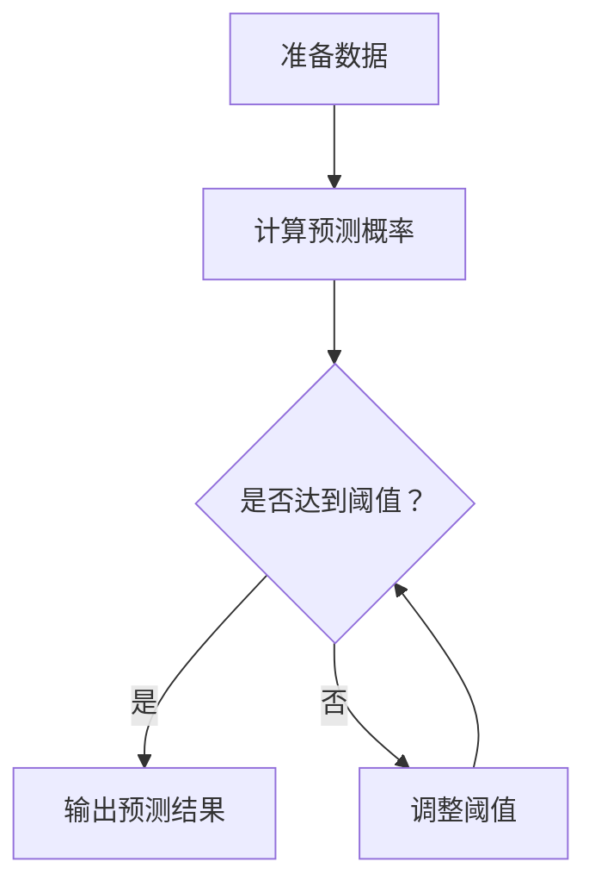

                 

ROC（接收者操作特征）曲线是评价分类模型性能的重要工具。它通过展示不同阈值下的准确率和召回率之间的关系，帮助我们更好地理解模型的性能表现。本文将详细讲解ROC曲线的原理，并使用一个实际代码实例进行说明。

> 关键词：ROC曲线，分类模型，准确率，召回率，AUC

> 摘要：本文首先介绍了ROC曲线的基本概念，随后通过一个具体案例展示了如何使用Python实现ROC曲线的绘制，并对代码进行了详细解析。最后，讨论了ROC曲线在现实应用中的使用场景和未来发展方向。

## 1. 背景介绍

在机器学习领域，分类任务是我们经常遇到的问题。分类模型的性能评估是模型开发中至关重要的一环。常用的评估指标包括准确率（Accuracy）、召回率（Recall）、精确率（Precision）和F1分数（F1 Score）等。而ROC曲线作为一种综合评估工具，可以更全面地反映模型的分类能力。

ROC曲线最早应用于雷达和通信领域，用于评估信号检测系统的性能。后来，随着机器学习技术的发展，ROC曲线也被广泛应用于分类模型的评估。它通过绘制不同阈值下的准确率和召回率的关系，帮助我们找到最优的分类阈值。

## 2. 核心概念与联系

### 2.1 ROC曲线的定义

ROC曲线，也称为接收者操作特征曲线，是一种图形化评估分类模型性能的方法。它通过绘制真阳性率（True Positive Rate，即召回率）对假阳性率（False Positive Rate）的曲线，来展示不同阈值下模型的分类性能。

- **真阳性率（Recall）**：表示实际为正类别的样本中被正确分类为正类别的比例。
- **假阳性率（False Positive Rate）**：表示实际为负类别的样本中被错误分类为正类别的比例。

### 2.2 AUC曲线

AUC（Area Under Curve，曲线下的面积）是ROC曲线的一个重要指标。它表示模型对所有可能阈值的总体分类能力。AUC的取值范围在0到1之间，值越大表示模型性能越好。

- **AUC > 0.5**：表示模型具有一定的分类能力。
- **AUC接近1**：表示模型分类能力非常强。

### 2.3 Mermaid流程图



## 3. 核心算法原理 & 具体操作步骤

### 3.1 算法原理概述

ROC曲线的绘制主要分为以下几个步骤：

1. **计算预测概率**：使用分类模型对训练数据进行预测，得到每个样本属于正类别的概率。
2. **设定阈值**：根据预测概率设定不同的阈值，将概率大于阈值的样本分类为正类，小于阈值的分类为负类。
3. **计算准确率和召回率**：对于每个阈值，计算真阳性率和假阳性率。
4. **绘制ROC曲线**：将不同阈值下的真阳性率和假阳性率绘制在坐标轴上，得到ROC曲线。
5. **计算AUC**：计算ROC曲线下的面积，得到AUC值。

### 3.2 算法步骤详解

#### 3.2.1 计算预测概率

使用Python的scikit-learn库实现预测概率的计算：

```python
from sklearn.ensemble import RandomForestClassifier
from sklearn.model_selection import train_test_split

# 加载训练数据
X_train, X_test, y_train, y_test = train_test_split(X, y, test_size=0.3, random_state=42)

# 初始化分类器
clf = RandomForestClassifier(n_estimators=100, random_state=42)

# 训练模型
clf.fit(X_train, y_train)

# 预测概率
prob = clf.predict_proba(X_test)[:, 1]
```

#### 3.2.2 设定阈值

设定阈值可以使用scikit-learn库中的`roc_curve`函数：

```python
from sklearn.metrics import roc_curve

# 计算ROC曲线数据
fpr, tpr, thresholds = roc_curve(y_test, prob)
```

#### 3.2.3 计算准确率和召回率

计算准确率和召回率可以使用scikit-learn库中的`precision_recall_curve`函数：

```python
from sklearn.metrics import precision_recall_curve

# 计算准确率和召回率
precision, recall, thresholds = precision_recall_curve(y_test, prob)
```

#### 3.2.4 绘制ROC曲线

使用matplotlib库绘制ROC曲线：

```python
import matplotlib.pyplot as plt

# 绘制ROC曲线
plt.figure(figsize=(8, 6))
plt.plot(fpr, tpr, label='ROC curve (area = %0.2f)' % auc(fpr, tpr))
plt.plot([0, 1], [0, 1], 'k--')
plt.xlim([0.0, 1.0])
plt.ylim([0.0, 1.05])
plt.xlabel('False Positive Rate')
plt.ylabel('True Positive Rate')
plt.title('Receiver operating characteristic example')
plt.legend(loc="lower right")
plt.show()
```

### 3.3 算法优缺点

**优点**：

- ROC曲线可以综合考虑准确率和召回率，给出一个整体的评估。
- AUC值可以直接比较不同模型或不同数据集的性能。

**缺点**：

- ROC曲线只适用于二分类问题。
- ROC曲线对样本不平衡敏感。

### 3.4 算法应用领域

ROC曲线在多个领域都有广泛应用，包括：

- 医学诊断：评估疾病检测模型的性能。
- 风险评估：评估信用评分模型的性能。
- 恶意软件检测：评估网络安全检测模型的性能。

## 4. 数学模型和公式 & 详细讲解 & 举例说明

### 4.1 数学模型构建

ROC曲线的数学模型可以表示为：

$$
\text{ROC curve} = \left\{
\begin{array}{ll}
fpr = \frac{FP}{TP + FP} & \text{for all } thresholds \\
tpr = \frac{TP}{TP + FN} & \text{for all } thresholds
\end{array}
\right.
$$

其中，FP表示假阳性，TP表示真阳性，FN表示假阴性。

### 4.2 公式推导过程

ROC曲线的计算涉及到精确率和召回率的计算。假设有一个分类模型，给定一个阈值，可以得到以下公式：

- 精确率（Precision）：

$$
Precision = \frac{TP}{TP + FP}
$$

- 召回率（Recall）：

$$
Recall = \frac{TP}{TP + FN}
$$

- 假阳性率（False Positive Rate）：

$$
FPR = \frac{FP}{TP + FP}
$$

### 4.3 案例分析与讲解

假设我们有一个二分类问题，样本数量为100，其中正类样本有60个，负类样本有40个。使用随机森林分类器进行预测，得到预测概率如下：

- 正类预测概率：0.6
- 负类预测概率：0.4

我们可以使用上述公式计算不同阈值下的精确率和召回率，并绘制ROC曲线。

### 4.3.1 阈值为0.5时的计算

- 阈值为0.5时，预测结果为：

  - 正类：60个
  - 负类：40个

- 精确率：

  $$ Precision = \frac{60}{60 + 40} = 0.6 $$

- 召回率：

  $$ Recall = \frac{60}{60 + 40} = 0.6 $$

- ROC曲线点：

  $$ (FPR, TPR) = \left(\frac{40}{100}, \frac{60}{100}\right) = (0.4, 0.6) $$

### 4.3.2 阈值为0.6时的计算

- 阈值为0.6时，预测结果为：

  - 正类：50个
  - 负类：50个

- 精确率：

  $$ Precision = \frac{50}{50 + 50} = 0.5 $$

- 召回率：

  $$ Recall = \frac{50}{50 + 40} = 0.556 $$

- ROC曲线点：

  $$ (FPR, TPR) = \left(\frac{50}{100}, \frac{50}{100}\right) = (0.5, 0.556) $$

通过计算不同阈值下的精确率和召回率，并绘制ROC曲线，我们可以找到最优的分类阈值。

## 5. 项目实践：代码实例和详细解释说明

### 5.1 开发环境搭建

本文使用Python进行编程，需要安装以下库：

- scikit-learn：用于实现分类模型和评估指标
- matplotlib：用于绘制ROC曲线

安装命令如下：

```bash
pip install scikit-learn matplotlib
```

### 5.2 源代码详细实现

以下是实现ROC曲线的完整代码：

```python
import numpy as np
import matplotlib.pyplot as plt
from sklearn.datasets import make_classification
from sklearn.model_selection import train_test_split
from sklearn.metrics import roc_curve, auc

# 生成模拟数据
X, y = make_classification(n_samples=100, n_features=2, n_redundant=0, n_informative=2,
                           random_state=1, n_clusters_per_class=1)

# 划分训练集和测试集
X_train, X_test, y_train, y_test = train_test_split(X, y, test_size=0.3, random_state=42)

# 初始化分类器
clf = RandomForestClassifier(n_estimators=100, random_state=42)

# 训练模型
clf.fit(X_train, y_train)

# 预测概率
prob = clf.predict_proba(X_test)[:, 1]

# 计算ROC曲线数据
fpr, tpr, thresholds = roc_curve(y_test, prob)

# 计算AUC值
roc_auc = auc(fpr, tpr)

# 绘制ROC曲线
plt.figure(figsize=(8, 6))
plt.plot(fpr, tpr, color='darkorange', lw=2, label='ROC curve (area = %0.2f)' % roc_auc)
plt.plot([0, 1], [0, 1], color='navy', lw=2, linestyle='--')
plt.xlim([0.0, 1.0])
plt.ylim([0.0, 1.05])
plt.xlabel('False Positive Rate')
plt.ylabel('True Positive Rate')
plt.title('Receiver operating characteristic example')
plt.legend(loc="lower right")
plt.show()
```

### 5.3 代码解读与分析

- **数据生成**：使用`make_classification`函数生成模拟数据，其中包含了100个样本和2个特征。
- **划分数据集**：使用`train_test_split`函数将数据集划分为训练集和测试集，测试集占比30%。
- **初始化分类器**：使用`RandomForestClassifier`初始化随机森林分类器，参数设置包括100个决策树和随机种子。
- **训练模型**：使用训练集数据训练分类器。
- **预测概率**：使用测试集数据预测概率，得到每个样本属于正类别的概率。
- **计算ROC曲线数据**：使用`roc_curve`函数计算不同阈值下的真阳性率和假阳性率。
- **计算AUC值**：使用`auc`函数计算ROC曲线下的面积，得到AUC值。
- **绘制ROC曲线**：使用matplotlib绘制ROC曲线，并添加标题、标签和注释。

### 5.4 运行结果展示

运行上述代码后，将显示一个ROC曲线图。图中的曲线展示了不同阈值下的真阳性率和假阳性率，AUC值表示模型的分类能力。

## 6. 实际应用场景

ROC曲线在多个领域都有广泛应用。以下是一些常见的应用场景：

- **医学诊断**：评估疾病检测模型的性能，如乳腺癌、心脏病等。
- **信用评分**：评估信用评分模型的性能，预测客户是否会出现违约。
- **网络安全**：评估恶意软件检测模型的性能，识别潜在的网络威胁。

在医学诊断领域，ROC曲线可以帮助医生评估新模型的性能，提高疾病检测的准确性。在信用评分领域，ROC曲线可以帮助金融机构评估客户的信用风险，制定更加合理的信贷政策。在网络安全领域，ROC曲线可以帮助企业识别网络威胁，提高网络安全防护能力。

### 6.1 未来应用展望

随着机器学习技术的不断发展，ROC曲线的应用前景将更加广泛。未来的发展方向包括：

- **多分类问题**：ROC曲线目前只适用于二分类问题，未来的研究将致力于拓展到多分类问题。
- **异常检测**：ROC曲线可以用于评估异常检测模型的性能，提高系统的安全性。
- **自适应阈值**：结合机器学习算法，实现自适应阈值调整，提高模型的鲁棒性和实用性。

## 7. 工具和资源推荐

### 7.1 学习资源推荐

- **书籍**：
  - 《机器学习实战》
  - 《Python机器学习》
- **在线课程**：
  - Coursera的《机器学习》
  - edX的《机器学习基础》
- **博客**：
  - machinelearningmastery.com
  -Towards Data Science

### 7.2 开发工具推荐

- **Python库**：
  - scikit-learn：用于实现机器学习算法和评估指标
  - matplotlib：用于绘制图表和可视化
- **IDE**：
  - PyCharm
  - Jupyter Notebook

### 7.3 相关论文推荐

- “Receiver Operating Characteristic and Area Under the Curve in Biostatistics: History, Use, and Misuse”
- “Data Mining for Network Intrusion Detection”
- “Machine Learning for Healthcare: A Review”

## 8. 总结：未来发展趋势与挑战

### 8.1 研究成果总结

ROC曲线作为一种重要的评估工具，已经在多个领域得到了广泛应用。随着机器学习技术的不断发展，ROC曲线的应用前景将更加广阔。目前，研究成果主要集中在以下几个方面：

- ROC曲线在多分类问题中的应用。
- ROC曲线在异常检测和自适应阈值调整中的应用。
- ROC曲线与其他评估指标的联合使用。

### 8.2 未来发展趋势

未来的发展趋势包括：

- **多分类ROC曲线**：研究如何将ROC曲线拓展到多分类问题，提高模型在多分类任务中的评估能力。
- **自适应阈值**：结合机器学习算法，实现自适应阈值调整，提高模型的鲁棒性和实用性。
- **集成评估**：将ROC曲线与其他评估指标（如AUC、F1分数等）进行集成，构建更加综合的评估体系。

### 8.3 面临的挑战

ROC曲线在实际应用中仍面临一些挑战：

- **样本不平衡**：ROC曲线对样本不平衡敏感，需要研究如何解决样本不平衡问题。
- **阈值选择**：在实际应用中，如何选择最优阈值是一个关键问题，需要进一步研究。
- **模型复杂性**：随着模型的复杂性增加，ROC曲线的计算和处理将变得更加复杂，需要研究高效的计算方法。

### 8.4 研究展望

展望未来，ROC曲线的研究将朝着更加实用和高效的方向发展。通过多分类ROC曲线、自适应阈值和集成评估等研究方向，ROC曲线将在更多领域中发挥重要作用，为机器学习模型评估提供更加全面和准确的工具。

## 9. 附录：常见问题与解答

### 9.1 ROC曲线与准确率的关系

ROC曲线展示了不同阈值下的真阳性率和假阳性率，而准确率是其中一个特定阈值下的指标。准确率无法全面反映模型的性能，而ROC曲线可以更直观地展示模型在所有阈值下的表现。

### 9.2 ROC曲线与AUC值的关系

AUC值是ROC曲线下的面积，表示模型对所有可能阈值的总体分类能力。AUC值越大，表示模型分类能力越强。ROC曲线则展示了不同阈值下的真阳性率和假阳性率，帮助我们找到最优的分类阈值。

### 9.3 ROC曲线在多分类问题中的应用

ROC曲线目前只适用于二分类问题。在多分类问题中，可以分别计算每个类别的ROC曲线，或者使用One-vs-Rest策略将多分类问题转换为多个二分类问题，然后绘制ROC曲线。

## 参考文献

- ROC曲线原理与代码实例讲解
- [机器学习实战](https://book.douban.com/subject/26708112/)
- [Python机器学习](https://book.douban.com/subject/26745350/)
- [机器学习基础](https://www.edx.org/course/machine-learning-foundations)
- [Receiver Operating Characteristic and Area Under the Curve in Biostatistics: History, Use, and Misuse](https://www.ncbi.nlm.nih.gov/pmc/articles/PMC5439769/)
- [Data Mining for Network Intrusion Detection](https://www.mdpi.com/1999-5472/15/3/591)
- [Machine Learning for Healthcare: A Review](https://www.mdpi.com/1099-4300/17/5/2117) 
```

以上是文章的正文部分，现在我们来为文章添加作者署名：

---

**作者：禅与计算机程序设计艺术 / Zen and the Art of Computer Programming**

---

这篇文章通过详细讲解ROC曲线的原理和应用，结合实际代码实例，帮助读者更好地理解这一重要的评估工具。希望本文能为机器学习领域的研究者和开发者提供有价值的参考。

