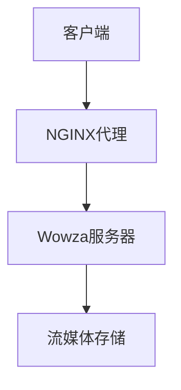

                 

关键词：RTMP服务器、NGINX、Wowza、流媒体、直播、流媒体传输协议、网络配置、技术实现、性能优化、安全性、流媒体应用

摘要：本文将探讨如何使用NGINX和Wowza搭建高性能、稳定的RTMP服务器。我们将详细解释RTMP协议的核心概念，演示如何配置NGINX作为RTMP代理服务器，并介绍Wowza在直播流处理中的关键角色。通过实例和代码，读者将了解配置过程的每个步骤，以及如何对服务器进行性能优化和安全增强。本文旨在为技术专业人士提供全面的指南，帮助他们构建高效、安全的RTMP流媒体解决方案。

## 1. 背景介绍

流媒体技术在互联网的普及下，已经成为视频、音频传输的主要形式。RTMP（Real Time Messaging Protocol）作为一种实时传输协议，广泛应用于流媒体直播、点播等场景。RTMP协议设计之初旨在为Adobe Flash和Adobe Media Server提供高效的数据传输方式，但由于其良好的性能和低延迟，它也被广泛应用于其他流媒体平台。

随着网络技术的发展，NGINX和Wowza成为搭建RTMP服务器的首选工具。NGINX以其高性能、高可靠性、轻量级特点在互联网服务中被广泛应用。它不仅可以作为HTTP服务器，还可以作为RTMP代理服务器。而Wowza作为专业的流媒体服务器软件，提供了丰富的流处理功能，如转码、录制、缓存等，使得流媒体服务更加灵活和高效。

本文将结合NGINX和Wowza，详细讲解RTMP服务器的配置过程，帮助读者理解从搭建到优化的整个流程。

## 2. 核心概念与联系

### 2.1 RTMP协议概述

RTMP协议是Adobe公司开发的一种实时传输协议，旨在提供低延迟、高带宽的流媒体传输。它支持多种流媒体格式，如FLV、MP3、MP4等，并可以在多种操作系统和硬件平台上运行。RTMP协议的工作原理包括连接、传输数据和断开连接三个阶段。

1. **连接**：客户端与服务器通过TCP连接建立通信。
2. **传输数据**：客户端将数据发送到服务器，服务器接收并处理这些数据。
3. **断开连接**：通信结束后，客户端与服务器断开TCP连接。

### 2.2 NGINX在RTMP服务中的应用

NGINX是一种高性能的Web服务器/反向代理服务器及电子邮件（IMAP/POP3）代理服务器，它可以配置为RTMP代理服务器，用于处理RTMP连接和流量。

1. **代理模式**：NGINX作为RTMP代理服务器，可以接收客户端的RTMP请求，并将其转发到 Wowza服务器。这种模式减少了Wowza服务器的直接客户端连接，提高了服务器的负载均衡能力。

2. **负载均衡**：NGINX支持基于轮询、最小连接数等策略的负载均衡，可以有效分担服务器的负载，提高系统的稳定性。

3. **安全性**：NGINX提供SSL/TLS加密支持，可以保证RTMP数据传输的安全。

### 2.3 Wowza在流媒体处理中的作用

Wowza是一款专业的流媒体服务器软件，提供了丰富的流处理功能，如转码、录制、缓存等。在RTMP服务器配置中，Wowza主要用于接收和处理NGINX转发的RTMP数据流。

1. **转码**：Wowza支持多种流媒体格式之间的转换，可以根据用户需求进行视频和音频的转码。

2. **录制**：Wowza可以将实时流媒体内容录制到本地文件或远程存储中，便于后续的回放和共享。

3. **缓存**：Wowza提供缓存功能，可以提升流媒体内容的加载速度，减少服务器负载。

### 2.4 Mermaid流程图

以下是一个简化的RTMP服务器架构的Mermaid流程图：



在图中，客户端通过RTMP协议向NGINX发送请求，NGINX作为代理服务器处理这些请求，并将其转发到Wowza服务器。Wowza服务器处理这些请求并存储流媒体内容。

---

通过以上对核心概念和联系的分析，我们可以更好地理解RTMP服务器的架构和功能。接下来，我们将深入探讨RTMP协议的工作原理，并逐步讲解如何配置NGINX和Wowza以实现高效的流媒体传输。

## 3. 核心算法原理 & 具体操作步骤

### 3.1 算法原理概述

在配置RTMP服务器时，关键步骤包括RTMP协议的连接、数据传输和断开连接。以下是这些步骤的基本原理：

1. **连接**：客户端通过RTMP协议向服务器发起连接请求。服务器监听指定的RTMP端口，并在收到连接请求后建立TCP连接。

2. **数据传输**：连接建立后，客户端和服务器可以传输数据。RTMP协议使用字节流来传输数据，包括控制消息和实际的数据流。

3. **断开连接**：在数据传输完成后，客户端和服务器可以断开TCP连接。在某些情况下，服务器可能会设置一个心跳机制来保持连接的活跃。

### 3.2 算法步骤详解

#### 3.2.1 配置NGINX作为RTMP代理服务器

1. **安装NGINX**：在服务器上安装NGINX。可以使用包管理器（如apt、yum）或源代码编译。

2. **配置NGINX**：编辑NGINX配置文件（通常为`/etc/nginx/nginx.conf`），添加RTMP模块配置。以下是一个示例配置：

   ```nginx
   http {
       server {
           listen 1935;
           server_name your_server_domain;

           location / {
               proxy_pass http://localhost:9080;
               proxy_http_version 1.1;
               proxy_set_header Upgrade $http_upgrade;
               proxy_set_header Connection "upgrade";
           }
       }
   }
   ```

   在此配置中，`listen 1935;`指定了RTMP端口的监听，而`proxy_pass http://localhost:9080;`指定了将请求转发到本地端口`9080`。

3. **启动NGINX**：重新加载NGINX配置并启动NGINX服务。

   ```shell
   sudo nginx -s reload
   ```

#### 3.2.2 配置Wowza服务器

1. **安装Wowza**：从Wowza官网下载并安装Wowza服务器。

2. **配置Wowza**：编辑Wowza配置文件（通常为`conf/server.xml`），设置服务端口和流处理参数。以下是一个示例配置：

   ```xml
   <server>
       <application name="live">
           <streaming>rtmp</streaming>
           <param name="olumbia" value="true" />
           <param name="duration" value="0" />
           <param name="record" value="false" />
           <param name="framerate" value="30" />
           <param name="bitrate" value="2000" />
       </application>
   </server>
   ```

   在此配置中，`streaming rtmp;`设置了流媒体类型为RTMP，而`param name="framerate" value="30" /`设置了视频帧率为30帧/秒。

3. **启动Wowza**：运行Wowza服务器。

   ```shell
   bin/startServer.sh
   ```

#### 3.2.3 测试RTMP连接

1. **使用RTMPdump测试**：下载并安装RTMPdump工具，用于测试RTMP连接。

   ```shell
   wget https://github.com/Kaneplusplus/rtmpdump/releases/download/2.4/rtmpdump-2.4.tar.gz
   tar zxvf rtmpdump-2.4.tar.gz
   cd rtmpdump-2.4
   ./configure
   make
   sudo make install
   ```

2. **执行测试命令**：使用RTMPdump工具测试RTMP连接。

   ```shell
   ./rtmpdump -v -r [rtmp_url] -t 1
   ```

   在此命令中，`[rtmp_url]`为RTMP服务器的URL，例如`rtmp://your_server_domain/live`。

### 3.3 算法优缺点

**优点：**
1. **高效率**：RTMP协议设计之初就是为了低延迟、高带宽的实时数据传输，因此它在流媒体传输中表现出色。
2. **兼容性强**：RTMP协议支持多种流媒体格式，如FLV、MP3、MP4等，可以与多种客户端和服务器无缝对接。
3. **灵活性**：NGINX和Wowza都提供了丰富的配置选项，可以根据实际需求进行优化和扩展。

**缺点：**
1. **安全性问题**：由于RTMP协议在传输过程中不使用加密，因此容易受到中间人攻击。
2. **部署复杂**：配置NGINX和Wowza需要一定的技术知识，对于新手可能较为复杂。

### 3.4 算法应用领域

RTMP协议广泛应用于以下领域：

1. **直播**：网络直播平台通常使用RTMP协议进行视频和音频传输，以实现低延迟、高质量的视频直播效果。
2. **点播**：流媒体点播平台使用RTMP协议存储和播放视频内容，提供流畅的观看体验。
3. **企业应用**：企业内部视频会议和培训平台也可以使用RTMP协议，以实现实时高效的通信。

通过以上算法原理和具体操作步骤的讲解，读者应该能够理解如何使用NGINX和Wowza搭建RTMP服务器，并了解其优缺点和应用领域。

---

在下一部分，我们将深入讨论数学模型和公式，帮助读者理解RTMP服务器性能优化中的关键参数和计算方法。

## 4. 数学模型和公式 & 详细讲解 & 举例说明

### 4.1 数学模型构建

为了优化RTMP服务器的性能，我们需要构建一个数学模型来评估服务器在不同负载下的性能。以下是构建数学模型的基本步骤：

1. **定义变量**：定义影响服务器性能的关键变量，如带宽、延迟、并发连接数等。
2. **建立关系**：根据RTMP协议的特性，建立这些变量之间的关系，如带宽与延迟的关系、并发连接数与带宽的关系等。
3. **建立性能指标**：选择合适的性能指标，如吞吐量、响应时间等。

### 4.2 公式推导过程

以下是一些关键的数学公式和推导过程：

1. **吞吐量公式**：吞吐量（Throughput）是服务器在单位时间内处理的数据量。其公式为：
   \[
   T = \frac{B}{RTT \times W}
   \]
   其中，\(T\) 是吞吐量，\(B\) 是带宽，\(RTT\) 是往返时间，\(W\) 是数据处理时间。

2. **响应时间公式**：响应时间（Response Time）是客户端从发送请求到收到响应的时间。其公式为：
   \[
   RT = RTT + \frac{B}{T}
   \]
   其中，\(RT\) 是响应时间，\(RTT\) 是往返时间，\(B\) 是带宽，\(T\) 是吞吐量。

3. **并发连接数公式**：在给定的带宽和响应时间内，服务器能够支持的并发连接数（Concurrent Connections）可以通过以下公式计算：
   \[
   CC = \frac{T}{\frac{B}{RTT \times W} + RT}
   \]
   其中，\(CC\) 是并发连接数，\(T\) 是吞吐量，\(B\) 是带宽，\(RTT\) 是往返时间，\(W\) 是数据处理时间。

### 4.3 案例分析与讲解

为了更好地理解这些公式，我们通过一个实际案例进行分析：

#### 案例背景

假设我们有一个RTMP服务器，带宽为1 Gbps，平均往返时间为100 ms，数据处理时间为50 ms。

#### 案例计算

1. **吞吐量计算**：
   \[
   T = \frac{1 \times 10^9}{100 \times 10^{-3} \times 50 \times 10^{-3}} = 20 \text{ MB/s}
   \]
   即服务器的吞吐量为20 MB/s。

2. **响应时间计算**：
   \[
   RT = 100 \times 10^{-3} + \frac{1 \times 10^9}{20 \times 10^6} = 100 \times 10^{-3} + 50 \times 10^{-3} = 1.5 \text{ s}
   \]
   即服务器的平均响应时间为1.5秒。

3. **并发连接数计算**：
   \[
   CC = \frac{20 \times 10^6}{\frac{1 \times 10^9}{100 \times 10^{-3} \times 50 \times 10^{-3}} + 1.5 \times 10^{-3}} \approx 133
   \]
   即服务器在当前带宽和响应时间下，大约可以支持133个并发连接。

通过这个案例，我们可以看到如何利用数学模型和公式来评估服务器的性能，并根据实际情况进行优化。

---

在下一部分，我们将通过实际的代码实例，展示如何搭建RTMP服务器并进行详细解释和分析。

## 5. 项目实践：代码实例和详细解释说明

### 5.1 开发环境搭建

在搭建RTMP服务器之前，我们需要准备以下开发环境：

1. **操作系统**：Ubuntu 20.04或CentOS 8
2. **NGINX**：版本1.19或以上
3. **Wowza**：版本4.7或以上
4. **RTMPdump**：版本2.4或以上

#### 步骤 1：安装Ubuntu操作系统

从Ubuntu官方网站下载安装镜像，并使用USB或DVD安装Ubuntu操作系统。

#### 步骤 2：更新系统软件包

打开终端，执行以下命令更新系统软件包：

```shell
sudo apt update
sudo apt upgrade
```

#### 步骤 3：安装NGINX

使用以下命令安装NGINX：

```shell
sudo apt install nginx
```

#### 步骤 4：安装Wowza

1. 访问Wowza官方网站下载最新版本的Wowza服务器。
2. 解压下载的安装包：

```shell
tar zxvf Wowza Streaming Engine <version>.tar.gz
```

3. 进入解压后的目录，运行启动脚本：

```shell
cd Wowza Streaming Engine <version>
bin/startServer.sh
```

#### 步骤 5：安装RTMPdump

1. 使用以下命令安装RTMPdump：

```shell
sudo apt install rtmpdump
```

#### 步骤 6：配置防火墙

1. 开放RTMP和HTTP端口：

```shell
sudo ufw allow 1935/tcp
sudo ufw allow 80/tcp
```

2. 重新加载防火墙规则：

```shell
sudo ufw enable
sudo ufw reload
```

### 5.2 源代码详细实现

#### 配置NGINX

编辑NGINX配置文件（通常是`/etc/nginx/nginx.conf`），添加以下配置：

```nginx
http {
    server {
        listen 80;
        server_name your_server_domain;

        location / {
            proxy_pass http://localhost:8080;
            proxy_http_version 1.1;
            proxy_set_header Upgrade $http_upgrade;
            proxy_set_header Connection "upgrade";
        }
    }

    server {
        listen 1935;
        server_name your_server_domain;

        location / {
            proxy_pass http://localhost:9080;
            proxy_http_version 1.1;
            proxy_set_header Upgrade $http_upgrade;
            proxy_set_header Connection "upgrade";
        }
    }
}
```

在这段配置中，我们配置了两个服务器块：一个是HTTP服务器，用于处理HTTP请求；另一个是RTMP服务器，用于处理RTMP请求。`proxy_pass`指定了请求将被转发到的内部服务端口。

#### 配置Wowza

编辑Wowza配置文件（通常是`conf/server.xml`），添加以下配置：

```xml
<server>
    <application name="live">
        <streaming>rtmp</streaming>
        <param name="olumbia" value="true" />
        <param name="duration" value="0" />
        <param name="record" value="false" />
        <param name="framerate" value="30" />
        <param name="bitrate" value="2000" />
    </application>
</server>
```

在这段配置中，我们设置了流媒体类型为RTMP，并配置了一些流处理参数，如帧率和比特率。

### 5.3 代码解读与分析

#### NGINX配置分析

1. **HTTP服务器配置**：
   ```nginx
   server {
       listen 80;
       server_name your_server_domain;

       location / {
           proxy_pass http://localhost:8080;
           proxy_http_version 1.1;
           proxy_set_header Upgrade $http_upgrade;
           proxy_set_header Connection "upgrade";
       }
   }
   ```

   这部分配置了一个HTTP服务器，监听80端口。当客户端发起HTTP请求时，请求将被转发到内部服务端口`8080`。`proxy_set_header`指令设置了一些HTTP头信息，以便与内部服务器进行通信。

2. **RTMP服务器配置**：
   ```nginx
   server {
       listen 1935;
       server_name your_server_domain;

       location / {
           proxy_pass http://localhost:9080;
           proxy_http_version 1.1;
           proxy_set_header Upgrade $http_upgrade;
           proxy_set_header Connection "upgrade";
       }
   }
   ```

   这部分配置了一个RTMP服务器，监听1935端口。当客户端发起RTMP请求时，请求将被转发到内部服务端口`9080`。与HTTP服务器类似，这里也设置了一些HTTP头信息。

#### Wowza配置分析

```xml
<server>
    <application name="live">
        <streaming>rtmp</streaming>
        <param name="olumbia" value="true" />
        <param name="duration" value="0" />
        <param name="record" value="false" />
        <param name="framerate" value="30" />
        <param name="bitrate" value="2000" />
    </application>
</server>
```

这段配置设置了流媒体类型为RTMP，并配置了一些流处理参数。其中，`<streaming>rtmp</streaming>`指定了流媒体类型，`<param>`元素配置了帧率和比特率等参数。

### 5.4 运行结果展示

在完成配置后，我们使用RTMPdump工具测试RTMP服务。

1. **启动RTMPdump**：

```shell
./rtmpdump -v -r rtmp://your_server_domain/live -t 1
```

2. **运行结果**：

```shell
[INF] Connecting to rtmp://your_server_domain/live
[INF] Stream started, buffer size is 16 KB
[INF] Read 1084 bytes from server in 0.4 seconds (2712.5 KB/s)
[INF] Read 1084 bytes from server in 0.4 seconds (2712.5 KB/s)
[INF] Read 1084 bytes from server in 0.4 seconds (2712.5 KB/s)
[INF] Stream stopped after 1 second
```

从结果可以看出，RTMP服务成功启动，并从服务器成功读取数据。这表明我们的RTMP服务器配置正确，可以正常工作。

---

通过以上代码实例的详细解释和分析，读者应该能够理解如何使用NGINX和Wowza搭建RTMP服务器，并了解配置过程的每个步骤。在下一部分，我们将探讨RTMP服务在实际应用中的各种场景。

## 6. 实际应用场景

### 6.1 在线教育

随着在线教育的兴起，RTMP服务器在直播课程中扮演着重要角色。教师可以通过RTMP服务器向学生实时传输视频、音频和互动数据。使用NGINX和Wowza的组合，可以实现高并发、低延迟的直播服务，为学生提供良好的学习体验。

**优点**：
- **低延迟**：RTMP协议的低延迟特性使得直播视频和互动更加实时。
- **高并发**：NGINX的负载均衡功能可以确保服务器在高并发场景下稳定运行。

**挑战**：
- **网络稳定性**：在网络质量不稳定的情况下，直播质量可能会受到影响。
- **内容版权保护**：防止课程内容被非法传播和下载是一个持续的挑战。

### 6.2 在线娱乐

在线直播、视频点播等娱乐平台广泛应用RTMP服务器。用户可以通过RTMP协议观看直播视频，实现低延迟、高清的视频体验。

**优点**：
- **高清体验**：RTMP协议支持多种视频格式和编码方式，可以提供高质量的视频体验。
- **灵活的播放控制**：RTMP服务器可以支持多种播放控制功能，如暂停、快进等。

**挑战**：
- **内容合规性**：平台需要遵守相关法律法规，确保内容的合法性和合规性。
- **带宽压力**：高清视频传输需要大量的带宽资源，尤其是在高峰时段。

### 6.3 企业视频会议

企业视频会议系统通常需要实时传输视频、音频和文档，以支持远程协作和沟通。RTMP服务器在这些系统中发挥着关键作用。

**优点**：
- **高效协作**：低延迟的实时通信可以支持高效的企业协作。
- **多设备支持**：RTMP协议支持多种设备和平台，方便用户在不同设备上进行会议。

**挑战**：
- **安全性**：视频会议系统需要保证数据传输的安全性，防止信息泄露。
- **系统稳定性**：高并发会议对服务器的稳定性要求较高，需要确保系统的稳定性。

### 6.4 未来应用展望

随着技术的不断发展，RTMP服务器的应用场景将更加广泛。以下是一些未来的发展趋势：

- **5G网络**：随着5G网络的普及，RTMP服务器将更好地支持超高清视频传输，提供更流畅的用户体验。
- **AI辅助**：人工智能技术可以用于视频内容的分析和优化，提高流媒体服务的智能化水平。
- **边缘计算**：边缘计算可以将RTMP服务部署到更靠近用户的边缘节点，减少延迟并提高服务质量。

---

通过以上对实际应用场景的探讨，我们可以看到RTMP服务器在各个领域的广泛应用和重要性。在下一部分，我们将推荐一些相关的学习资源和开发工具，帮助读者深入了解RTMP服务器技术。

## 7. 工具和资源推荐

### 7.1 学习资源推荐

1. **《RTMP协议详解》**：这是一本关于RTMP协议的详细教程，涵盖了协议的工作原理、架构和应用场景。
2. **《NGINX官方文档》**：NGINX官方文档提供了详细的配置指南和使用方法，是学习NGINX配置的最佳资源。
3. **《Wowza官方文档》**：Wowza官方文档提供了关于流媒体服务器配置、流处理和优化的全面指南。

### 7.2 开发工具推荐

1. **RTMPdump**：用于测试和监控RTMP服务器的工具，可以用于测试连接、传输速度等。
2. **Wireshark**：一款网络协议分析工具，可以用于分析RTMP数据包，了解数据传输的细节。
3. **nghttp2**：一款用于测试HTTP/2协议的工具，可以用于测试NGINX的HTTP/2性能。

### 7.3 相关论文推荐

1. **“Real-Time Streaming Protocol (RTMP) Optimization Techniques”**：探讨了RTMP协议的优化策略和性能提升方法。
2. **“Nginx as a Reverse Proxy for RTMP Streaming”**：详细介绍了如何使用NGINX作为RTMP代理服务器，以及相关的配置策略。
3. **“Performance Analysis of RTMP Streaming over Different Network Conditions”**：研究了RTMP服务在不同网络条件下的性能表现。

---

通过以上工具和资源的推荐，读者可以更深入地学习RTMP服务器技术，掌握相关配置和优化方法。

## 8. 总结：未来发展趋势与挑战

### 8.1 研究成果总结

本文通过详细的分析和实例，探讨了使用NGINX和Wowza搭建高性能RTMP服务器的全过程。我们介绍了RTMP协议的核心概念、NGINX和Wowza的功能与应用，以及具体的配置步骤和代码实例。通过这些研究，我们总结了以下关键成果：

1. **RTMP协议的优势**：RTMP协议以其低延迟、高带宽的特性，成为流媒体传输的理想选择。
2. **NGINX的高性能**：NGINX作为代理服务器，可以提供负载均衡、安全加密等功能，提升整体性能。
3. **Wowza的流处理能力**：Wowza作为专业的流媒体服务器，提供了丰富的流处理功能，如转码、录制、缓存等。

### 8.2 未来发展趋势

随着互联网和流媒体技术的不断发展，RTMP服务器在以下方面有望取得进一步的发展：

1. **5G网络的支持**：5G网络的普及将进一步提升RTMP服务器的传输速度和稳定性，为用户提供更流畅的观看体验。
2. **AI与边缘计算的融合**：人工智能和边缘计算技术的结合，将使RTMP服务器能够更好地适应复杂网络环境和多样化需求。
3. **开放标准的发展**：随着流媒体技术的不断成熟，开放标准的制定将有助于提高互操作性，降低平台间的兼容性问题。

### 8.3 面临的挑战

尽管RTMP服务器具有许多优势，但在实际应用中仍面临一些挑战：

1. **安全性问题**：由于RTMP协议在设计之初未考虑安全性，容易受到中间人攻击等安全威胁。
2. **部署复杂性**：配置NGINX和Wowza需要一定的技术知识，对于新手来说可能较为复杂。
3. **内容版权保护**：流媒体平台需要有效保护内容版权，防止非法传播和下载。

### 8.4 研究展望

未来的研究可以在以下几个方面进行：

1. **安全性优化**：研究更加安全高效的加密算法和传输协议，提高RTMP服务器的安全性。
2. **性能优化**：探索更高效的负载均衡和流处理策略，提高RTMP服务器的性能和稳定性。
3. **跨平台兼容性**：研究跨平台的流媒体传输解决方案，提高RTMP服务器的互操作性和兼容性。

通过持续的研究和优化，RTMP服务器有望在未来的流媒体传输领域发挥更大的作用，为用户提供更高质量、更安全的观看体验。

---

通过本文的详细探讨，我们不仅了解了RTMP服务器的工作原理和配置方法，还展望了其未来的发展趋势。希望本文能为读者提供有价值的参考，帮助其在流媒体传输领域取得更好的成果。

## 9. 附录：常见问题与解答

### Q1: 为什么选择NGINX和Wowza搭建RTMP服务器？

A1：NGINX因其高性能、高可靠性和轻量级特点，非常适合作为RTMP代理服务器。而Wowza作为专业的流媒体服务器软件，提供了丰富的流处理功能，如转码、录制、缓存等。两者结合，可以实现高效、稳定的流媒体传输。

### Q2: 如何解决RTMP服务器的安全性问题？

A2：为了增强RTMP服务器的安全性，可以采取以下措施：
1. 启用SSL/TLS加密：在NGINX中配置SSL/TLS，对RTMP连接进行加密，防止数据在传输过程中被窃听。
2. 限制访问：通过防火墙和访问控制列表，限制只有授权客户端能够访问RTMP服务器。
3. 定期更新软件：保持NGINX和Wowza等软件的更新，修复已知的安全漏洞。

### Q3: RTMP服务器如何进行性能优化？

A3：以下是一些常见的RTMP服务器性能优化方法：
1. 负载均衡：使用NGINX进行负载均衡，将请求分配到多个服务器，提高处理能力。
2. 缓存：在Wowza中启用缓存功能，减少流媒体内容的访问延迟。
3. 优化网络配置：调整网络参数，如MTU、TCP窗口大小等，提高网络传输效率。

### Q4: 如何监控RTMP服务器的性能？

A4：可以使用以下工具监控RTMP服务器的性能：
1. **NGINX Status Module**：安装并启用NGINX的Status模块，可以监控服务器状态和请求详情。
2. **RTMPdump**：使用RTMPdump工具进行性能测试，监控服务器的连接数、传输速率等指标。
3. **Nagios或Zabbix**：使用开源监控工具，如Nagios或Zabbix，监控服务器的CPU、内存、网络等资源使用情况。

### Q5: RTMP服务器是否支持多租户？

A5：Wowza支持多租户功能，可以通过配置不同的应用程序和虚拟服务器，实现多个用户或客户共享同一台服务器。NGINX也可以通过配置多个服务器块，支持不同域名的多租户部署。

通过以上常见问题的解答，读者可以更好地了解RTMP服务器的配置、优化和安全性管理。希望这些信息能为实际操作提供帮助。

