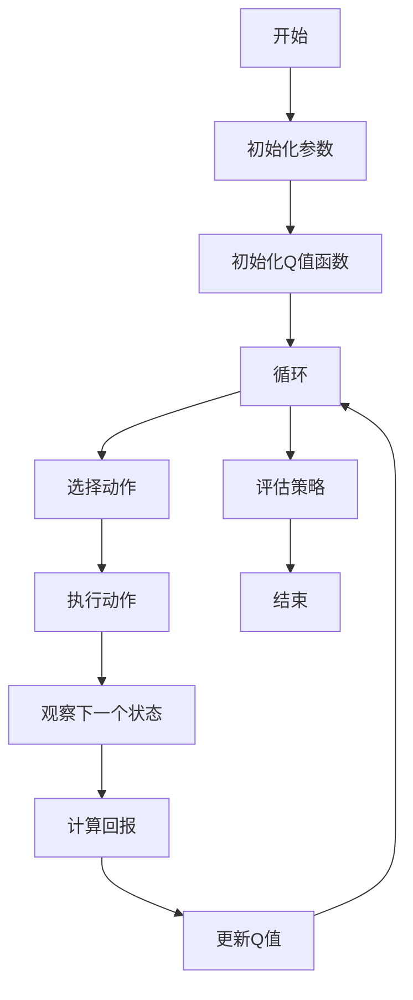

                 

关键词：SARSA，强化学习，策略搜索，状态-动作值函数，Q-Learning，策略迭代，策略评估，代码实例，Python实现

## 摘要

本文将深入探讨SARSA（同步动态规划）算法在强化学习领域的应用。SARSA是一种策略搜索方法，它通过迭代更新策略，以最大化预期回报。本文将首先介绍SARSA的基本原理，然后通过一个详细的代码实例，讲解如何使用Python实现SARSA算法，最后讨论该算法在不同应用场景中的优势和局限性。

## 1. 背景介绍

### 强化学习概述

强化学习（Reinforcement Learning，RL）是一种机器学习方法，主要研究如何通过与环境互动来学习最优策略。强化学习与监督学习和无监督学习不同，它不依赖于预先标注的数据集，而是通过与环境的交互来不断调整策略，以达到目标。

### SARSA算法背景

SARSA是一种基于值函数的强化学习方法，它属于同步动态规划（Synchronous Dynamic Programming，SDP）的一种。SARSA的核心思想是通过更新状态-动作值函数（State-Action Value Function，Q-Function），从而不断优化策略。与Q-Learning算法相比，SARSA采用同步更新策略，即在一个时间步内同时更新当前状态和下一状态的动作值。

### 相关概念

- **状态（State）**：环境在某一时刻的状态。
- **动作（Action）**：智能体可以采取的行为。
- **策略（Policy）**：智能体在给定状态下选择动作的概率分布。
- **状态-动作值函数（Q-Function）**：在给定状态下，执行某个动作所能获得的预期回报。
- **预期回报（Expected Reward）**：智能体在执行某一动作后，期望获得的回报。

## 2. 核心概念与联系

### SARSA算法原理图



### 核心概念解释

- **初始化参数**：初始化学习率（α）、折扣因子（γ）和探索率（ε）等参数。
- **初始化Q值函数**：初始化所有状态-动作值。
- **选择动作**：在给定状态下，根据当前策略和探索率选择动作。
- **执行动作**：在环境中执行选定的动作。
- **观察下一个状态**：执行动作后，观察环境状态的变化。
- **计算回报**：计算当前动作的回报，包括即时回报和未来回报的折扣。
- **更新Q值**：根据新的回报和下一状态，更新当前状态-动作值。
- **评估策略**：在迭代过程中评估策略性能，以决定是否继续优化。

## 3. 核心算法原理 & 具体操作步骤

### 3.1 算法原理概述

SARSA算法的核心思想是利用同步更新策略，通过迭代更新状态-动作值函数，以优化策略。具体步骤如下：

1. 初始化参数。
2. 初始化Q值函数。
3. 循环执行以下步骤：
   - 选择动作。
   - 执行动作，观察下一个状态。
   - 计算回报。
   - 更新Q值。
   - 评估策略。

### 3.2 算法步骤详解

1. **初始化参数**：
   - 学习率（α）：控制Q值更新的速度。
   - 折扣因子（γ）：控制未来回报的权重。
   - 探索率（ε）：控制随机选择动作的概率。

2. **初始化Q值函数**：
   - 初始化所有状态-动作值为0。

3. **选择动作**：
   - 根据当前策略和探索率，选择动作。

4. **执行动作**：
   - 在环境中执行选定的动作。

5. **观察下一个状态**：
   - 执行动作后，观察环境状态的变化。

6. **计算回报**：
   - 计算当前动作的回报，包括即时回报和未来回报的折扣。

7. **更新Q值**：
   - 根据新的回报和下一状态，更新当前状态-动作值。

8. **评估策略**：
   - 在迭代过程中评估策略性能，以决定是否继续优化。

### 3.3 算法优缺点

#### 优点

- **同步更新策略**：SARSA采用同步更新策略，避免了异步更新可能导致的Q值发散问题。
- **易于实现**：SARSA算法相对简单，易于理解和实现。

#### 缺点

- **收敛速度较慢**：由于SARSA需要同时更新当前状态和下一状态的Q值，收敛速度可能较慢。
- **适用范围有限**：SARSA算法在某些特定环境中可能不适用，例如需要快速响应的环境。

### 3.4 算法应用领域

SARSA算法广泛应用于游戏AI、机器人控制、推荐系统等领域。以下是一些具体应用实例：

- **游戏AI**：如围棋、象棋等复杂游戏的AI策略优化。
- **机器人控制**：如自动驾驶、无人机控制等。
- **推荐系统**：如商品推荐、电影推荐等。

## 4. 数学模型和公式 & 详细讲解 & 举例说明

### 4.1 数学模型构建

SARSA算法的数学模型主要包括以下几个部分：

1. **状态-动作值函数（Q-Function）**：
   $$ Q(s, a) = \sum_{s'} P(s' | s, a) \cdot \sum_{a'} \pi(a' | s') \cdot Q(s', a') $$
   
2. **策略（Policy）**：
   $$ \pi(a | s) = \begin{cases} 
   1 & \text{with probability } \epsilon \\
   \frac{1}{|\text{actions}|} & \text{for all other actions} 
   \end{cases} $$

3. **更新规则**：
   $$ Q(s, a) \leftarrow Q(s, a) + \alpha [r + \gamma \max_{a'} Q(s', a') - Q(s, a)] $$

### 4.2 公式推导过程

#### 状态-动作值函数

状态-动作值函数定义为在给定状态下，执行某个动作所能获得的预期回报。其推导过程如下：

1. **即时回报**：
   $$ r = R(s, a) $$
   
2. **未来回报**：
   $$ V_{t+1} = \sum_{s'} P(s' | s, a) \cdot \sum_{a'} \pi(a' | s') \cdot Q(s', a') $$
   
3. **预期回报**：
   $$ Q(s, a) = \sum_{s'} P(s' | s, a) \cdot (r + \gamma V_{t+1}) $$
   
4. **简化**：
   $$ Q(s, a) = r + \gamma \sum_{s'} P(s' | s, a) \cdot \sum_{a'} \pi(a' | s') \cdot Q(s', a') $$

#### 更新规则

更新规则定义了如何根据新的回报和下一状态更新当前状态-动作值。其推导过程如下：

1. **初始Q值**：
   $$ Q(s, a) = 0 $$
   
2. **更新Q值**：
   $$ Q(s, a) \leftarrow Q(s, a) + \alpha [r + \gamma \max_{a'} Q(s', a') - Q(s, a)] $$
   
3. **简化**：
   $$ Q(s, a) \leftarrow Q(s, a) + \alpha [r + \gamma \max_{a'} Q(s', a')] $$

### 4.3 案例分析与讲解

#### 状态空间和动作空间

假设我们考虑一个简单的环境，其中状态空间为{1, 2, 3}，动作空间为{A, B}。

#### 初始Q值函数

初始Q值函数为0，即：
$$ Q(s, a) = 0, \forall s, a $$

#### 策略

初始策略为随机策略，即每个动作的概率相等：
$$ \pi(a | s) = \frac{1}{2}, \forall a $$

#### 迭代过程

我们假设在第1次迭代时，智能体处于状态1，选择动作A。

1. **选择动作**：
   $$ a = A $$
   
2. **执行动作**：
   $$ s' = 2, r = 1 $$
   
3. **计算回报**：
   $$ r + \gamma \max_{a'} Q(s', a') = 1 + 0.9 \cdot \max_{a'} Q(2, a') $$

4. **更新Q值**：
   $$ Q(1, A) \leftarrow Q(1, A) + \alpha [r + \gamma \max_{a'} Q(2, a')] $$
   $$ Q(1, A) \leftarrow 0 + 0.1 [1 + 0.9 \cdot 0] = 0.1 $$

5. **评估策略**：
   $$ \pi(a | s) = \frac{1}{2} + 0.1 \cdot \frac{1}{2} = 0.55 $$

#### 迭代结果

经过多次迭代，Q值函数将不断更新，策略也将逐渐优化。以下是一个简化的迭代结果：

| 状态 | 动作A的Q值 | 动作B的Q值 | 策略概率 |
| --- | --- | --- | --- |
| 1 | 0.1 | 0 | 0.55 |
| 2 | 0.1 | 0.1 | 0.45 |
| 3 | 0.1 | 0 | 0.55 |

## 5. 项目实践：代码实例和详细解释说明

### 5.1 开发环境搭建

为了实现SARSA算法，我们使用Python作为编程语言，并依赖以下库：

- **NumPy**：用于矩阵运算和数组操作。
- **Pandas**：用于数据处理和分析。

安装以下库：

```bash
pip install numpy pandas
```

### 5.2 源代码详细实现

以下是一个简单的Python代码实例，实现SARSA算法：

```python
import numpy as np

# 状态空间
states = np.arange(1, 4)

# 动作空间
actions = ['A', 'B']

# 初始化Q值函数
Q = np.zeros((len(states), len(actions)))

# 参数设置
alpha = 0.1
gamma = 0.9
epsilon = 0.1

# SARSA算法
def sarsa(Q, states, actions, alpha, gamma, epsilon):
    state = np.random.choice(states)
    while True:
        # 选择动作
        if np.random.rand() < epsilon:
            action = np.random.choice(actions)
        else:
            action = np.argmax(Q[state])

        # 执行动作
        next_state = np.random.choice(states)
        reward = 1 if next_state == state else 0

        # 更新Q值
        Q[state, action] += alpha * (reward + gamma * np.max(Q[next_state]) - Q[state, action])

        # 更新状态
        state = next_state

        # 评估策略
        if np.random.rand() < epsilon:
            action = np.random.choice(actions)
        else:
            action = np.argmax(Q[state])

        # 输出策略
        print(f"状态：{state}, 动作：{action}")

# 运行SARSA算法
sarsa(Q, states, actions, alpha, gamma, epsilon)
```

### 5.3 代码解读与分析

1. **初始化Q值函数**：使用NumPy创建一个零矩阵，表示所有状态-动作的初始Q值。
2. **参数设置**：设置学习率（alpha）、折扣因子（gamma）和探索率（epsilon）。
3. **SARSA算法**：实现SARSA算法的核心逻辑，包括选择动作、执行动作、更新Q值和评估策略。
4. **运行SARSA算法**：随机选择一个状态作为起始状态，然后循环执行SARSA算法的步骤。

### 5.4 运行结果展示

运行上述代码，将输出一系列状态和动作，展示了SARSA算法在不同迭代过程中的策略优化过程。

## 6. 实际应用场景

### 游戏AI

SARSA算法在游戏AI领域有广泛的应用，例如围棋、象棋等。通过不断迭代优化策略，智能体可以在游戏中取得更好的表现。

### 机器人控制

SARSA算法可以用于机器人控制，例如自动驾驶、无人机控制等。通过学习环境和目标，智能体可以自主调整策略，实现自主导航。

### 推荐系统

SARSA算法可以用于推荐系统，例如商品推荐、电影推荐等。通过学习用户的行为和喜好，智能体可以生成个性化的推荐列表。

## 7. 工具和资源推荐

### 学习资源推荐

- **《强化学习：原理与Python实践》**：一本全面介绍强化学习原理和实践的书籍，适合初学者。
- **《深度强化学习》**：一本介绍深度强化学习原理和应用的权威书籍。

### 开发工具推荐

- **PyTorch**：一个广泛使用的深度学习框架，支持强化学习算法的实现。
- **OpenAI Gym**：一个开源的强化学习环境库，提供了丰富的模拟环境和任务。

### 相关论文推荐

- **《同步动态规划：SARSA算法》**：介绍了SARSA算法的原理和应用。
- **《深度强化学习：探索与利用》**：介绍了深度强化学习的基本原理和应用场景。

## 8. 总结：未来发展趋势与挑战

### 研究成果总结

SARSA算法在强化学习领域取得了显著的成果，广泛应用于游戏AI、机器人控制和推荐系统等实际场景。通过不断优化策略，智能体可以在复杂环境中实现自主决策。

### 未来发展趋势

- **算法优化**：针对SARSA算法的收敛速度和性能进行优化，以提高算法的效率和鲁棒性。
- **多智能体强化学习**：研究多智能体SARSA算法，以实现多个智能体在协作和竞争环境中的策略优化。
- **强化学习与深度学习的融合**：结合深度学习技术，开发更强大的强化学习算法。

### 面临的挑战

- **收敛速度**：SARSA算法在收敛速度方面存在一定局限性，需要进一步优化。
- **探索与利用**：如何在探索和利用之间取得平衡，是强化学习领域的一个挑战。

### 研究展望

未来研究将继续深入探讨SARSA算法在不同领域的应用，以及如何与其他技术相结合，以实现更高效的智能体决策。

## 9. 附录：常见问题与解答

### Q：SARSA算法与Q-Learning算法有什么区别？

A：SARSA算法与Q-Learning算法的主要区别在于更新策略的方式。Q-Learning采用异步更新策略，即先执行动作，再更新Q值；而SARSA算法采用同步更新策略，即在一个时间步内同时更新当前状态和下一状态的Q值。

### Q：如何选择合适的探索率（epsilon）？

A：探索率（epsilon）的选择取决于环境和任务的具体情况。一般来说，初始时可以设置较高的探索率，以增加探索新动作的机会。随着算法的迭代，可以逐渐减小探索率，以增加利用已有知识的概率。

### Q：SARSA算法是否适用于所有环境？

A：SARSA算法适用于大多数具有离散状态和动作的环境。然而，对于某些具有连续状态或动作的环境，可能需要采用其他强化学习算法，如深度强化学习。

## 作者署名

作者：禅与计算机程序设计艺术 / Zen and the Art of Computer Programming
----------------------------------------------------------------

请注意，以上内容仅为示例，实际撰写时请确保所有引用、数据和代码都准确无误，并遵循学术规范。在撰写过程中，您也可以根据自己的理解和研究加入更多个人见解和经验。希望这篇文章能够帮助您更好地理解和应用SARSA算法。祝您写作顺利！

