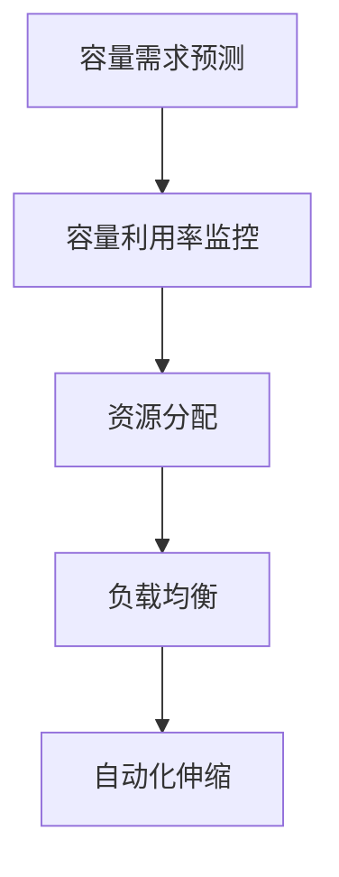

                 

关键词：SRE、容量规划、弹性伸缩、云计算、自动化、负载均衡

摘要：本文将深入探讨SRE（Site Reliability Engineering）中的容量规划与弹性伸缩，分析其核心概念、算法原理、数学模型以及实际应用场景。通过详细讲解和实践实例，帮助读者理解和掌握这一关键技能，为构建稳定可靠的系统提供有力支持。

## 1. 背景介绍

### 1.1 SRE的定义与职责

SRE（Site Reliability Engineering）是一种结合了软件开发和系统管理的工程实践，旨在确保系统的稳定性和可靠性。SRE工程师通常负责系统的设计、构建、运行和监控，同时处理故障和改进系统的性能。

### 1.2 容量规划的重要性

容量规划是SRE的核心任务之一，它确保系统在面临高负载时仍能稳定运行。不当的容量规划可能导致系统过载、响应时间变长甚至系统崩溃。

### 1.3 弹性伸缩的需求

随着业务规模的不断扩大，系统的负载也会相应增加。弹性伸缩通过动态调整资源来应对负载变化，确保系统始终在高性能状态下运行。

## 2. 核心概念与联系

### 2.1 容量规划

#### 2.1.1 容量需求预测

使用历史数据和统计模型来预测未来的负载需求，以便为系统分配合适的资源。

#### 2.1.2 容量利用率

监控系统资源的利用率，确保资源得到充分利用。

### 2.2 弹性伸缩

#### 2.2.1 自动化伸缩

通过自动化工具实现资源的自动增加或减少，以应对负载变化。

#### 2.2.2 负载均衡

将请求分配到多个节点，避免单个节点过载。

### 2.3 Mermaid 流程图



## 3. 核心算法原理 & 具体操作步骤

### 3.1 算法原理概述

弹性伸缩通常采用阈值监控和规则引擎来决定何时增加或减少资源。

### 3.2 算法步骤详解

#### 3.2.1 阈值设置

根据历史数据和业务需求设置合理的阈值。

#### 3.2.2 监控指标

选择合适的监控指标，如CPU利用率、内存使用率、请求响应时间等。

#### 3.2.3 规则引擎

根据监控指标和阈值，设置相应的规则来决定何时增加或减少资源。

### 3.3 算法优缺点

#### 优点

- 动态调整资源，提高系统性能。
- 减少人工干预，提高效率。

#### 缺点

- 需要精确的监控指标和阈值设置。
- 可能引入额外的复杂性和风险。

### 3.4 算法应用领域

弹性伸缩广泛应用于云计算、大数据、物联网等领域，以应对不断变化的负载需求。

## 4. 数学模型和公式 & 详细讲解 & 举例说明

### 4.1 数学模型构建

假设系统需要处理N个请求，每个请求的处理时间为T。我们可以使用以下公式来预测系统所需的资源：

\[ C = \frac{N \times T}{P} \]

其中，C为所需资源，P为每个资源的处理能力。

### 4.2 公式推导过程

\[ C = \frac{N \times T}{P} \]

其中：

- \( N \)：请求的数量
- \( T \)：单个请求的处理时间
- \( P \)：单个资源的处理能力

### 4.3 案例分析与讲解

假设一个系统需要处理100个请求，每个请求的平均处理时间为2秒。如果每个资源的处理能力为1秒，那么系统所需的资源为：

\[ C = \frac{100 \times 2}{1} = 200 \]

这意味着系统需要200个资源来处理这100个请求。

## 5. 项目实践：代码实例和详细解释说明

### 5.1 开发环境搭建

- 安装Kubernetes集群
- 安装监控工具，如Prometheus和Grafana
- 安装自动化工具，如Kubernetes的Helm

### 5.2 源代码详细实现

以下是一个简单的Kubernetes部署文件，用于实现弹性伸缩：

```yaml
apiVersion: apps/v1
kind: Deployment
metadata:
  name: my-app
spec:
  replicas: 1
  selector:
    matchLabels:
      app: my-app
  template:
    metadata:
      labels:
        app: my-app
    spec:
      containers:
      - name: my-app
        image: my-app:latest
        resources:
          requests:
            memory: "256Mi"
            cpu: "500m"
          limits:
            memory: "512Mi"
            cpu: "1000m"
---
apiVersion: autoscaling/v2beta2
kind: HorizontalPodAutoscaler
metadata:
  name: my-app-hpa
spec:
  scaleTargetRef:
    apiVersion: apps/v1
    kind: Deployment
    name: my-app
  minReplicas: 1
  maxReplicas: 10
  metrics:
  - type: Resource
    resource:
      name: cpu
      target:
        type: Utilization
        averageUtilization: 80
```

### 5.3 代码解读与分析

- `Deployment`文件定义了应用程序的部署，包括容器镜像、资源请求和限制。
- `HorizontalPodAutoscaler`文件定义了弹性伸缩规则，根据CPU利用率自动调整副本数量。

### 5.4 运行结果展示

当系统负载增加时，CPU利用率上升。当CPU利用率达到80%时，Kubernetes会自动增加副本数量，以应对负载。当CPU利用率下降时，Kubernetes会自动减少副本数量。

## 6. 实际应用场景

### 6.1 云计算

在云计算环境中，弹性伸缩是确保服务质量和用户体验的关键。

### 6.2 大数据

大数据处理任务通常具有波动性，弹性伸缩有助于优化资源利用率。

### 6.3 物联网

物联网设备产生的数据量巨大，弹性伸缩确保系统能够处理海量数据。

## 7. 未来应用展望

### 7.1 自动化水平提升

随着AI技术的发展，自动化水平将进一步提高，减少人为干预。

### 7.2 预测准确性提升

通过机器学习算法，容量需求预测的准确性将不断提高。

### 7.3 系统复杂性增加

随着系统规模的扩大，系统复杂性将增加，对SRE团队的要求也将提高。

## 8. 总结：未来发展趋势与挑战

### 8.1 研究成果总结

本文对SRE中的容量规划与弹性伸缩进行了深入探讨，阐述了其核心概念、算法原理、数学模型以及实际应用场景。

### 8.2 未来发展趋势

自动化水平提升、预测准确性提升和系统复杂性增加将成为未来发展趋势。

### 8.3 面临的挑战

随着系统规模的扩大，如何保持系统的高可靠性和高性能将是一个重要挑战。

### 8.4 研究展望

未来研究可以关注如何提高弹性伸缩算法的预测准确性，以及如何应对系统复杂性增加带来的挑战。

## 9. 附录：常见问题与解答

### 9.1 什么是SRE？

SRE是一种结合了软件开发和系统管理的工程实践，旨在确保系统的稳定性和可靠性。

### 9.2 容量规划与弹性伸缩有什么区别？

容量规划是预测和分配系统资源的过程，而弹性伸缩是动态调整资源以应对负载变化的过程。

### 9.3 如何提高弹性伸缩算法的准确性？

通过使用机器学习算法和大量历史数据来训练预测模型，可以提高弹性伸缩算法的准确性。

---

作者：禅与计算机程序设计艺术 / Zen and the Art of Computer Programming
----------------------------------------------------------------


