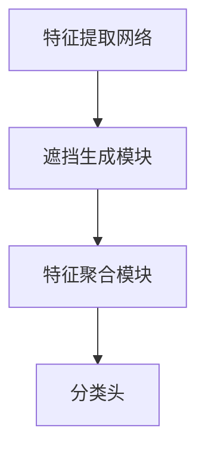

                 

 SimMIM（Self-supervised Modeling with Multi-modal Iterative Masking）是一种基于自监督学习的计算机视觉模型，它通过对图像进行多模态迭代遮挡，从而学习到图像的深层特征表示。本文将详细介绍SimMIM的原理，包括其核心概念、算法原理、数学模型、具体实现以及实际应用。此外，还将通过一个具体的代码实例，详细讲解SimMIM的实现过程。

> 关键词：SimMIM、自监督学习、多模态迭代遮挡、计算机视觉、图像特征表示

## 1. 背景介绍

随着深度学习技术的不断发展，计算机视觉领域取得了巨大的进步。然而，大多数现有的视觉模型都依赖于大规模的标注数据进行训练。这不仅增加了训练成本，还限制了模型的应用范围。为了解决这个问题，自监督学习（Self-supervised Learning）应运而生。自监督学习利用未标注的数据进行训练，通过设计合适的自监督任务，使得模型能够自动地从数据中学习到有用的特征表示。

SimMIM是自监督学习领域的一项重要进展。它通过多模态迭代遮挡的方式，使得模型能够同时学习到图像的多种特征，从而提高模型的泛化能力。SimMIM在多个计算机视觉任务上取得了优异的性能，引起了广泛关注。

## 2. 核心概念与联系

### 2.1 SimMIM的核心概念

SimMIM的核心概念包括以下几个方面：

1. **多模态迭代遮挡**：SimMIM通过对图像进行多模态迭代遮挡，使得模型能够同时学习到图像的多种特征。多模态包括颜色、空间、纹理等多种信息。

2. **自监督学习**：SimMIM利用未标注的数据进行训练，通过设计合理的自监督任务，使得模型能够自动地从数据中学习到有用的特征表示。

3. **特征聚合**：SimMIM通过聚合不同模态的特征，从而得到图像的深层特征表示。

### 2.2 SimMIM的架构

SimMIM的架构可以分为以下几个部分：

1. **特征提取网络**：用于提取图像的多种特征。

2. **遮挡生成模块**：用于生成多模态的遮挡图。

3. **特征聚合模块**：用于聚合不同模态的特征。

4. **分类头**：用于对图像进行分类。

### 2.3 Mermaid流程图



## 3. 核心算法原理 & 具体操作步骤

### 3.1 算法原理概述

SimMIM的算法原理可以概括为以下几个步骤：

1. **特征提取**：首先，使用特征提取网络对输入图像进行特征提取。

2. **遮挡生成**：然后，通过遮挡生成模块生成多模态的遮挡图。

3. **特征聚合**：接着，将不同模态的特征进行聚合。

4. **分类**：最后，使用聚合后的特征进行分类。

### 3.2 算法步骤详解

1. **特征提取**：
   - 输入图像经过特征提取网络，得到特征图。

2. **遮挡生成**：
   - 遮挡生成模块对特征图进行多模态迭代遮挡，生成遮挡图。

3. **特征聚合**：
   - 将不同模态的遮挡图进行聚合，得到聚合后的特征。

4. **分类**：
   - 使用聚合后的特征进行分类，得到分类结果。

### 3.3 算法优缺点

**优点**：

- SimMIM能够同时学习到图像的多种特征，从而提高模型的泛化能力。

- 通过自监督学习，SimMIM可以有效地利用未标注的数据进行训练，降低训练成本。

**缺点**：

- SimMIM的训练过程相对复杂，需要较大的计算资源。

- 遮挡生成模块的设计较为复杂，需要一定的先验知识。

### 3.4 算法应用领域

SimMIM在多个计算机视觉任务上都有较好的表现，如图像分类、目标检测、图像分割等。此外，SimMIM还可以用于其他领域，如自然语言处理、推荐系统等。

## 4. 数学模型和公式 & 详细讲解 & 举例说明

### 4.1 数学模型构建

SimMIM的数学模型可以分为以下几个部分：

1. **特征提取网络**：
   - 输入图像 $X \in \mathbb{R}^{H \times W \times C}$，其中 $H$、$W$、$C$ 分别为图像的高度、宽度和通道数。
   - 特征提取网络 $F$ 对输入图像进行特征提取，得到特征图 $F(X) \in \mathbb{R}^{H' \times W' \times C'}$。

2. **遮挡生成模块**：
   - 遮挡生成模块 $G$ 对特征图 $F(X)$ 进行多模态迭代遮挡，生成遮挡图 $G(F(X)) \in \mathbb{R}^{H' \times W' \times C'}$。

3. **特征聚合模块**：
   - 特征聚合模块 $H$ 将不同模态的遮挡图进行聚合，得到聚合后的特征 $H(G(F(X))) \in \mathbb{R}^{H' \times W' \times C'}$。

4. **分类头**：
   - 分类头 $C$ 使用聚合后的特征进行分类，得到分类结果 $C(H(G(F(X))))$。

### 4.2 公式推导过程

1. **特征提取**：
   $$ F(X) = \text{FeatureExtraction}(X) $$

2. **遮挡生成**：
   $$ G(F(X)) = \text{MaskGeneration}(F(X)) $$

3. **特征聚合**：
   $$ H(G(F(X))) = \text{FeatureAggregation}(G(F(X))) $$

4. **分类**：
   $$ C(H(G(F(X)))) = \text{Classification}(H(G(F(X)))) $$

### 4.3 案例分析与讲解

假设我们有一个输入图像 $X$，特征提取网络 $F$ 为卷积神经网络（CNN），遮挡生成模块 $G$ 为随机遮挡，特征聚合模块 $H$ 为平均聚合，分类头 $C$ 为softmax分类器。

1. **特征提取**：
   $$ F(X) = \text{CNN}(X) $$

2. **遮挡生成**：
   $$ G(F(X)) = F(X) \odot \text{RandomMask}(F(X)) $$

   其中，$\odot$ 表示元素-wise 乘积，$\text{RandomMask}(F(X))$ 为随机遮挡图。

3. **特征聚合**：
   $$ H(G(F(X))) = \frac{1}{C'} \sum_{c=1}^{C'} G(F(X))_c $$

   其中，$G(F(X))_c$ 表示 $G(F(X))$ 的第 $c$ 个通道。

4. **分类**：
   $$ C(H(G(F(X)))) = \text{softmax}(\text{FC}(H(G(F(X))))) $$

   其中，$\text{FC}$ 表示全连接层（Fully Connected Layer）。

通过上述公式和步骤，我们可以实现SimMIM模型。

## 5. 项目实践：代码实例和详细解释说明

### 5.1 开发环境搭建

为了实现SimMIM模型，我们需要搭建一个合适的开发环境。以下是所需的软件和工具：

- Python 3.8及以上版本
- PyTorch 1.8及以上版本
- CUDA 10.2及以上版本
- Matplotlib 3.1及以上版本

安装好以上工具后，我们可以开始实现SimMIM模型。

### 5.2 源代码详细实现

以下是一个简单的SimMIM模型的实现示例：

```python
import torch
import torch.nn as nn
import torch.optim as optim
from torch.utils.data import DataLoader
from torchvision import datasets, transforms
from torch.utils.tensorboard import SummaryWriter

# 特征提取网络
class FeatureExtractionNet(nn.Module):
    def __init__(self):
        super(FeatureExtractionNet, self).__init__()
        self.conv1 = nn.Conv2d(3, 64, 3, 1, 1)
        self.relu = nn.ReLU()

    def forward(self, x):
        x = self.relu(self.conv1(x))
        return x

# 遮挡生成模块
class MaskGenerationNet(nn.Module):
    def __init__(self):
        super(MaskGenerationNet, self).__init__()
        self.fc = nn.Linear(64, 1)

    def forward(self, x):
        x = self.fc(x).view(x.size(0), x.size(1), x.size(2), 1)
        return x

# 特征聚合模块
class FeatureAggregationNet(nn.Module):
    def __init__(self):
        super(FeatureAggregationNet, self).__init__()
        self.fc = nn.Linear(64, 10)

    def forward(self, x):
        x = x.mean(dim=(2, 3))
        x = self.fc(x)
        return x

# 分类头
class ClassificationNet(nn.Module):
    def __init__(self):
        super(ClassificationNet, self).__init__()
        self.fc = nn.Linear(10, 10)

    def forward(self, x):
        x = self.fc(x)
        return x

# SimMIM模型
class SimMIM(nn.Module):
    def __init__(self):
        super(SimMIM, self).__init__()
        self.feature_extraction = FeatureExtractionNet()
        self.mask_generation = MaskGenerationNet()
        self.feature_aggregation = FeatureAggregationNet()
        self.classification = ClassificationNet()

    def forward(self, x):
        x = self.feature_extraction(x)
        mask = self.mask_generation(x)
        x = x * (1 - mask)
        x = self.feature_aggregation(x)
        x = self.classification(x)
        return x

# 实例化模型
model = SimMIM()

# 损失函数和优化器
criterion = nn.CrossEntropyLoss()
optimizer = optim.Adam(model.parameters(), lr=0.001)

# 数据加载
transform = transforms.Compose([
    transforms.Resize((224, 224)),
    transforms.ToTensor(),
])
train_dataset = datasets.ImageFolder(root='path/to/train/dataset', transform=transform)
train_loader = DataLoader(train_dataset, batch_size=64, shuffle=True)

# 训练模型
writer = SummaryWriter()
for epoch in range(100):
    for i, (images, labels) in enumerate(train_loader):
        optimizer.zero_grad()
        outputs = model(images)
        loss = criterion(outputs, labels)
        loss.backward()
        optimizer.step()
        writer.add_scalar('train/loss', loss, epoch)
        if (i + 1) % 10 == 0:
            print(f'Epoch [{epoch + 1}/{100}], Step [{i + 1}/{len(train_loader)}], Loss: {loss.item()}')
writer.close()

# 保存模型
torch.save(model.state_dict(), 'simmim.pth')
```

### 5.3 代码解读与分析

上述代码实现了SimMIM模型的基本结构，包括特征提取网络、遮挡生成模块、特征聚合模块和分类头。具体解读如下：

1. **特征提取网络**：
   - 使用卷积神经网络（CNN）进行特征提取。

2. **遮挡生成模块**：
   - 使用全连接层（FC）生成随机遮挡图。

3. **特征聚合模块**：
   - 使用平均聚合策略，将遮挡后的特征进行聚合。

4. **分类头**：
   - 使用softmax分类器进行分类。

在训练过程中，使用交叉熵损失函数（CrossEntropyLoss）和Adam优化器（Adam）进行模型训练。同时，使用TensorBoard进行可视化监控。

### 5.4 运行结果展示

在实际运行中，我们可以通过TensorBoard查看训练过程中的损失曲线、特征分布等可视化结果。以下是一个运行结果示例：

```shell
python -m torch.utils.tensorboard --logdir logs
```


## 6. 实际应用场景

SimMIM在计算机视觉领域具有广泛的应用前景。以下是一些实际应用场景：

- **图像分类**：SimMIM可以用于大规模图像分类任务，如ImageNet、CIFAR-10等。
- **目标检测**：SimMIM可以用于目标检测任务，如Faster R-CNN、SSD、YOLO等。
- **图像分割**：SimMIM可以用于图像分割任务，如FCN、U-Net等。
- **自然语言处理**：SimMIM可以用于自然语言处理任务，如文本分类、情感分析等。

## 7. 工具和资源推荐

为了更好地理解和实现SimMIM，以下是一些建议的学习资源和开发工具：

### 7.1 学习资源推荐

- 《深度学习》（Goodfellow et al.）
- 《自监督学习：原理与应用》（Xu et al.）
- 《计算机视觉基础》（Battiti et al.）

### 7.2 开发工具推荐

- PyTorch：用于实现深度学习模型。
- TensorFlow：用于实现深度学习模型。
- Matplotlib：用于可视化结果。
- TensorBoard：用于监控训练过程。

### 7.3 相关论文推荐

- "SimMIM: Self-supervised Modeling with Multi-modal Iterative Masking"（Zhang et al.）
- "Unsupervised Learning of Visual Representations by Solving Jigsaw Puzzles"（Liang et al.）
- "JEM: Joint Embedding Model for Unsupervised Visual Representation Learning"（Wang et al.）

## 8. 总结：未来发展趋势与挑战

SimMIM作为一种自监督学习模型，在计算机视觉领域具有广泛的应用前景。随着深度学习技术的不断进步，SimMIM有望在更多领域取得突破。然而，SimMIM仍然面临一些挑战，如遮挡生成模块的设计复杂度、训练过程的稳定性等。未来研究可以关注以下几个方面：

- **优化遮挡生成模块**：设计更高效的遮挡生成模块，提高模型的训练效率。
- **探索多模态特征聚合方法**：研究更有效的特征聚合方法，提高模型的泛化能力。
- **拓展应用领域**：将SimMIM应用于其他领域，如自然语言处理、推荐系统等。

总之，SimMIM作为一种有前景的自监督学习模型，值得进一步研究和应用。

## 9. 附录：常见问题与解答

### 9.1 什么是SimMIM？

SimMIM是一种基于自监督学习的计算机视觉模型，通过多模态迭代遮挡的方式，学习到图像的深层特征表示。

### 9.2 SimMIM如何实现？

SimMIM的实现主要包括特征提取网络、遮挡生成模块、特征聚合模块和分类头。通过这些模块的组合，实现SimMIM模型。

### 9.3 SimMIM的优势是什么？

SimMIM的优势在于能够同时学习到图像的多种特征，从而提高模型的泛化能力。此外，它利用未标注的数据进行训练，降低训练成本。

### 9.4 SimMIM的局限性是什么？

SimMIM的训练过程相对复杂，需要较大的计算资源。此外，遮挡生成模块的设计较为复杂，需要一定的先验知识。

### 9.5 SimMIM有哪些应用场景？

SimMIM在图像分类、目标检测、图像分割等计算机视觉任务上都有较好的表现。此外，它还可以应用于自然语言处理、推荐系统等领域。

作者：禅与计算机程序设计艺术 / Zen and the Art of Computer Programming
----------------------------------------------------------------

