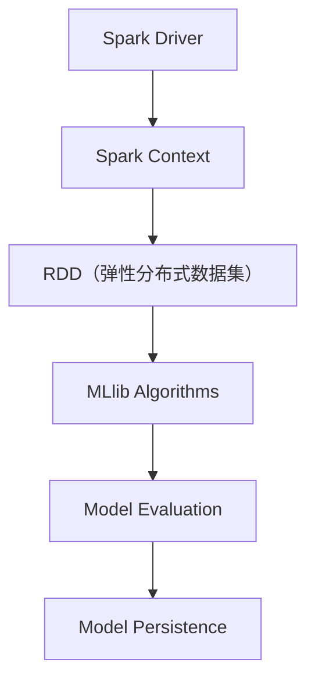

                 

关键词：Spark, MLlib, 机器学习，原理，代码实例

> 摘要：本文深入讲解了Apache Spark MLlib机器学习库的基本原理和使用方法。通过具体的代码实例，详细解析了MLlib中的常见算法，包括分类、回归、聚类和协同过滤等。同时，本文探讨了MLlib在实际应用场景中的优缺点，并展望了未来的发展趋势与挑战。

## 1. 背景介绍

Apache Spark是一个开源的分布式计算系统，它提供了快速的运算能力，特别是对于大规模数据处理。Spark MLlib（Machine Learning Library）是Spark的一个模块，提供了用于机器学习的算法和工具。MLlib包含了多种常用的机器学习算法，如分类、回归、聚类和协同过滤等，并且它设计成可以方便地扩展和定制。

在传统的机器学习框架中，数据处理通常需要将数据加载到内存中，这在处理大数据集时可能会遇到内存不足的问题。Spark MLlib的优势在于它可以在内存受限的环境下工作，通过分布式计算模型有效地处理大规模数据集。

## 2. 核心概念与联系

### 2.1. MLlib的基本架构



- **Spark Driver**：启动Spark应用程序的主控进程。
- **Spark Context**：用于与Spark集群交互的接口。
- **RDD**：Spark的核心抽象，用于表示一个不可变、可分区的大数据集。
- **MLlib Algorithms**：MLlib提供的各种机器学习算法。
- **Model Evaluation**：用于评估模型性能的工具。
- **Model Persistence**：用于保存和加载模型的机制。

### 2.2. 核心概念

- **特征向量（Feature Vector）**：一个特征向量是一组数字，代表数据实例的各个特征。
- **模型（Model）**：描述学习结果的数学结构，可以用来对新数据实例进行预测。
- **评估指标（Evaluation Metric）**：用于衡量模型性能的指标，如准确率、召回率、均方误差等。

## 3. 核心算法原理 & 具体操作步骤

### 3.1. 算法原理概述

MLlib支持多种机器学习算法，每种算法都有其特定的原理和操作步骤。

- **分类（Classification）**：将数据分为不同的类别。常用的算法有逻辑回归、决策树、随机森林等。
- **回归（Regression）**：预测一个连续值。常用的算法有线性回归、岭回归、Lasso回归等。
- **聚类（Clustering）**：将数据分成若干个群组。常用的算法有K-均值、层次聚类等。
- **协同过滤（Collaborative Filtering）**：基于用户的历史行为预测他们的偏好。常用的算法有基于用户的协同过滤、基于项目的协同过滤等。

### 3.2. 算法步骤详解

以逻辑回归为例，具体步骤如下：

1. **数据准备**：读取数据集，将其转换为特征向量和标签。
2. **初始化模型**：创建一个逻辑回归模型。
3. **模型训练**：使用数据集训练模型。
4. **模型评估**：使用测试集评估模型性能。
5. **模型应用**：使用训练好的模型对新数据进行预测。

### 3.3. 算法优缺点

- **逻辑回归**：优点是易于理解和实现，可以解释模型参数的含义；缺点是假设特征独立，对噪声敏感。
- **决策树**：优点是易于理解和可视化，可以处理非线性和非线性数据；缺点是可能产生过拟合，对大规模数据集的性能可能较差。
- **随机森林**：优点是提高了决策树的泛化能力，减少了过拟合；缺点是计算成本较高。

### 3.4. 算法应用领域

MLlib的算法广泛应用于各种领域，包括但不限于：

- 电子商务：用于推荐系统和个性化搜索。
- 金融领域：用于信用评分、风险控制和欺诈检测。
- 健康领域：用于疾病预测和医疗数据分析。

## 4. 数学模型和公式 & 详细讲解 & 举例说明

### 4.1. 数学模型构建

逻辑回归模型的基本数学模型为：

$$
P(y=1|x;\theta) = \frac{1}{1 + e^{-(\theta^T x + b)}}
$$

其中，$y$是目标变量，$x$是特征向量，$\theta$是模型参数，$b$是偏置项。

### 4.2. 公式推导过程

逻辑回归模型的目标是最大化似然函数：

$$
L(\theta) = \prod_{i=1}^{n} P(y_i=1|x_i;\theta) \cdot (1 - P(y_i=1|x_i;\theta))
$$

通过对数似然函数求导并令其等于零，得到模型参数的估计值。

### 4.3. 案例分析与讲解

以房价预测为例，使用逻辑回归模型预测房屋售价。具体步骤如下：

1. **数据预处理**：将房屋数据转换为特征向量和标签。
2. **模型训练**：使用训练集数据训练逻辑回归模型。
3. **模型评估**：使用测试集评估模型性能。
4. **模型应用**：使用训练好的模型预测新房屋的售价。

## 5. 项目实践：代码实例和详细解释说明

### 5.1. 开发环境搭建

首先，需要在本地或集群上安装Spark。以下是使用Apache Maven安装Spark的命令：

```shell
mvn install:install-file -Dfile=https://www-us.apache.org/dist/spark/spark-x.x.x/bin/spark-x.x.x-bin-hadoop2.7.tgz \
  -DgroupId=org.apache.spark \
  -DartifactId=spark \
  -Dversion=x.x.x \
  -Dpackaging=tar.gz
```

### 5.2. 源代码详细实现

以下是一个使用Spark MLlib进行逻辑回归模型训练的简单示例：

```python
from pyspark.sql import SparkSession
from pyspark.ml import Pipeline
from pyspark.ml.feature import VectorAssembler
from pyspark.ml.regression import LinearRegression

# 创建Spark会话
spark = SparkSession.builder.appName("LogisticRegressionExample").getOrCreate()

# 读取数据集
data = spark.read.format("libsvm").load("data/mllib/sample_libsvm_data.txt")

# 特征工程：将特征列组装为特征向量
assembler = VectorAssembler(inputCols=["feature1", "feature2"], outputCol="features")

# 模型训练：创建线性回归模型
lr = LinearRegression(labelCol="label", featuresCol="features")

# 创建管道
pipeline = Pipeline(stages=[assembler, lr])

# 模型训练
model = pipeline.fit(data)

# 模型评估
predictions = model.transform(data)
accuracy = predictions.select("prediction", "label").where((predictions["prediction"] == predictions["label"])).count() / predictions.count()

print("模型准确率：", accuracy)

# 模型应用
new_data = spark.createDataFrame([
  ["2.0", "4.0"],
  ["3.0", "6.0"],
])
new_predictions = model.transform(new_data)
new_predictions.select("prediction").show()

# 模型持久化
model.write().overwrite().save("model/logistic_regression_model")

# 关闭Spark会话
spark.stop()
```

### 5.3. 代码解读与分析

- **数据读取**：使用`SparkSession`读取LibSVM格式的数据。
- **特征工程**：使用`VectorAssembler`将多个特征列组合成一个特征向量。
- **模型训练**：使用`LinearRegression`创建线性回归模型。
- **模型评估**：使用训练集数据评估模型性能。
- **模型应用**：使用训练好的模型对新数据进行预测。
- **模型持久化**：将模型保存到本地文件系统。

## 6. 实际应用场景

MLlib在实际应用中有着广泛的应用，以下是一些具体的应用场景：

- **推荐系统**：使用协同过滤算法预测用户对商品的偏好。
- **金融风险控制**：使用分类算法进行信用评分和欺诈检测。
- **医疗数据分析**：使用聚类算法对病人进行分组，用于疾病预测和治疗规划。

## 7. 工具和资源推荐

### 7.1. 学习资源推荐

- 《Spark MLlib官方文档》：最权威的Spark MLlib学习资料。
- 《Spark: The Definitive Guide》：详细的Spark入门到进阶指南。
- 《Machine Learning with Spark》：专门针对Spark MLlib的机器学习教程。

### 7.2. 开发工具推荐

- **IntelliJ IDEA**：一款功能强大的Python和Scala开发环境，支持Spark插件。
- **PyCharm**：一款适用于Python和Spark开发的IDE，提供丰富的工具和插件。

### 7.3. 相关论文推荐

- “MLlib: Large-scale Machine Learning on Spark”。
- “Distributed Recommendation System with Spark”。
- “Clustering with Spark: A Practical Guide”。

## 8. 总结：未来发展趋势与挑战

### 8.1. 研究成果总结

MLlib在分布式机器学习领域取得了显著的成果，其高效的数据处理能力和丰富的算法库为大数据分析提供了强有力的支持。

### 8.2. 未来发展趋势

- **算法优化**：进一步提高算法的性能和可扩展性。
- **易用性提升**：简化MLlib的使用流程，降低学习门槛。
- **集成生态**：与其他大数据技术和框架（如Flink、TensorFlow等）更好地集成。

### 8.3. 面临的挑战

- **可解释性**：如何提高机器学习模型的可解释性，使其更易于被用户理解和信任。
- **模型大小**：如何高效地处理大型机器学习模型。

### 8.4. 研究展望

未来，MLlib将继续在分布式机器学习领域发挥重要作用，并在算法性能、应用场景和用户体验方面不断进步。

## 9. 附录：常见问题与解答

### 9.1. 如何安装Spark？

请参考Spark官方文档：[Spark安装指南](https://spark.apache.org/docs/latest/running-on-yarn.html)。

### 9.2. 如何使用MLlib进行特征工程？

请参考MLlib官方文档中的[特征工程部分](https://spark.apache.org/docs/latest/mllib-guide.html#feature-extraction)。

### 9.3. 如何评估机器学习模型的性能？

请参考MLlib官方文档中的[评估部分](https://spark.apache.org/docs/latest/mllib-evaluation.html)。

作者：禅与计算机程序设计艺术 / Zen and the Art of Computer Programming
----------------------------------------------------------------


