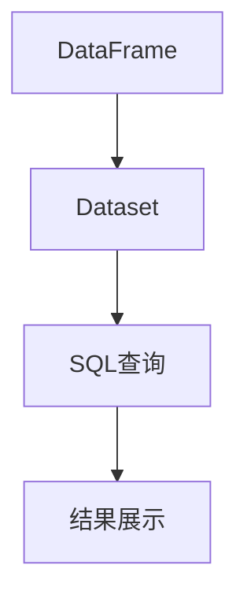

                 

关键词：Spark SQL，原理讲解，代码实例，大数据处理，分布式计算，Hadoop，SQL-on-Hadoop，内存计算

> 摘要：本文旨在深入讲解Spark SQL的原理，并通过实际代码实例来展示其应用。我们将探讨Spark SQL在大数据处理中的重要性，了解其核心概念、算法原理，以及如何在实际项目中使用Spark SQL进行数据处理。

## 1. 背景介绍

在当今大数据时代，如何高效地处理海量数据成为一个重要课题。传统的数据处理框架如Hadoop MapReduce在处理大规模数据时效率较低，难以满足实时性要求。因此，内存计算模型和分布式计算技术逐渐兴起，其中Spark SQL以其高效、灵活的特性成为了大数据处理领域的重要工具之一。

Spark SQL是Apache Spark的核心组件之一，它提供了一种以SQL方式查询分布式数据的接口。Spark SQL不仅能处理结构化数据，还能处理半结构化和非结构化数据，这使得它成为大数据领域中广泛使用的数据处理框架。

## 2. 核心概念与联系

### 2.1 Spark SQL核心概念

- **DataFrame**：DataFrame是Spark SQL的核心数据结构，它是一个包含固定数量列的表，类似于关系型数据库中的表。DataFrame具有明确的Schema，可以像关系型数据库中的表一样进行操作。

- **Dataset**：Dataset是DataFrame的一个增强版本，它提供了类型安全，使得编译器可以检查数据的类型。Dataset比DataFrame提供了更好的性能，因为它们在查询时可以优化执行计划。

- **SQL查询**：Spark SQL允许用户使用标准的SQL语法进行数据查询，这使得那些熟悉SQL的用户可以快速上手。

### 2.2 Mermaid 流程图

下面是一个简单的Mermaid流程图，展示了Spark SQL的核心概念和它们之间的联系。



## 3. 核心算法原理 & 具体操作步骤

### 3.1 算法原理概述

Spark SQL的核心算法是基于内存计算和分布式计算。它通过将数据存储在内存中，实现快速的数据查询和计算。同时，Spark SQL利用分布式计算技术，将数据分布到多个节点上进行并行处理，从而提高计算效率。

### 3.2 算法步骤详解

#### 3.2.1 数据加载

首先，需要将数据加载到Spark SQL中。可以使用不同的数据源，如HDFS、Hive、Parquet等。

```scala
val df = spark.read.json("hdfs://path/to/data.json")
```

#### 3.2.2 数据转换

接下来，可以对DataFrame进行各种转换操作，如筛选、排序、聚合等。

```scala
val result = df.filter($"column" > 10).groupBy($"anotherColumn").agg(sum($"column"))
```

#### 3.2.3 数据存储

最后，可以将处理后的数据存储回HDFS或其他数据源。

```scala
result.write.format("parquet").save("hdfs://path/to/output")
```

### 3.3 算法优缺点

#### 优点：

- **高性能**：Spark SQL利用内存计算和分布式计算技术，大大提高了数据处理速度。
- **灵活性**：Spark SQL支持多种数据源，可以处理结构化、半结构化和非结构化数据。
- **易用性**：Spark SQL使用标准的SQL语法，降低了学习和使用门槛。

#### 缺点：

- **资源消耗**：由于Spark SQL依赖内存计算，对系统资源要求较高。
- **复杂度**：在处理复杂查询时，Spark SQL的性能可能会受到限制。

### 3.4 算法应用领域

Spark SQL广泛应用于各类大数据处理场景，如实时数据流处理、批量数据处理、数据仓库等。

## 4. 数学模型和公式 & 详细讲解 & 举例说明

### 4.1 数学模型构建

在Spark SQL中，常用的数学模型包括线性回归、逻辑回归、聚类等。这些模型可以通过机器学习库如MLlib来实现。

### 4.2 公式推导过程

以线性回归为例，其基本公式为：

$$ y = \beta_0 + \beta_1 \cdot x $$

其中，$y$ 是因变量，$x$ 是自变量，$\beta_0$ 和 $\beta_1$ 是模型的参数。

### 4.3 案例分析与讲解

假设我们有如下数据集：

| x  | y  |
|----|----|
| 1  | 2  |
| 2  | 4  |
| 3  | 6  |
| 4  | 8  |

我们可以使用线性回归模型来预测$x$为5时的$y$值。

## 5. 项目实践：代码实例和详细解释说明

### 5.1 开发环境搭建

首先，需要搭建Spark SQL的开发环境。可以参考官方文档进行配置。

### 5.2 源代码详细实现

下面是一个简单的Spark SQL示例：

```scala
val spark = SparkSession.builder.appName("SparkSQLExample").getOrCreate()
import spark.implicits._

val data = Seq(
  (1, "Alice"),
  (2, "Bob"),
  (3, "Charlie")
)

val df = data.toDF("id", "name")

df.createOrReplaceTempView("people")

val result = spark.sql("SELECT * FROM people WHERE id > 1")

result.show()
```

### 5.3 代码解读与分析

这段代码首先创建了SparkSession，然后导入隐式转换。接着，创建了一个包含两列（id和name）的DataFrame，并将其注册为一个临时视图。最后，执行了一个简单的SQL查询，并显示结果。

### 5.4 运行结果展示

运行上述代码后，输出结果如下：

```
+---+------+
| id|name  |
+---+------+
| 2 | Bob  |
| 3 | Charlie |
+---+------+
```

## 6. 实际应用场景

Spark SQL广泛应用于各种实际场景，如：

- **数据仓库**：用于处理大量历史数据，提供数据分析和报表功能。
- **实时数据处理**：用于处理实时数据流，实现实时数据监控和报警。
- **机器学习**：用于处理大规模机器学习数据，加速模型训练和预测。

## 7. 工具和资源推荐

### 7.1 学习资源推荐

- 《Spark SQL编程指南》
- 《Spark: The Definitive Guide》

### 7.2 开发工具推荐

- IntelliJ IDEA
- PyCharm

### 7.3 相关论文推荐

- "Spark SQL: Relational Data Processing in Spark"
- "Memory-Efficient Hash Aggregation for Data-Sketch Queries in Spark"

## 8. 总结：未来发展趋势与挑战

### 8.1 研究成果总结

Spark SQL在大数据处理领域取得了显著成果，已成为大数据处理领域的重要工具之一。

### 8.2 未来发展趋势

随着大数据处理需求的不断增加，Spark SQL将在以下几个方面得到发展：

- **性能优化**：进一步提高Spark SQL的查询性能。
- **易用性**：降低学习和使用门槛，使得更多开发者能够使用Spark SQL。

### 8.3 面临的挑战

- **资源消耗**：如何更好地管理内存资源，提高系统稳定性。
- **生态系统**：如何与其他大数据技术（如Hadoop、Flink等）更好地集成。

### 8.4 研究展望

未来，Spark SQL将在大数据处理领域发挥更大的作用，助力企业更好地应对数据挑战。

## 9. 附录：常见问题与解答

### 9.1 如何优化Spark SQL查询性能？

- **数据分区**：合理设置数据的分区，可以提高查询效率。
- **索引**：为常用的查询字段创建索引，可以提高查询速度。
- **缓存**：将查询结果缓存起来，可以减少重复查询的次数。

### 9.2 Spark SQL支持哪些数据源？

Spark SQL支持多种数据源，包括HDFS、Hive、Parquet、JSON、Avro等。

----------------------------------------------------------------
# 附录

### 9.3 如何解决Spark SQL运行缓慢的问题？

Spark SQL运行缓慢可能由多种原因导致。以下是一些可能的解决方法和优化策略：

- **数据分区**：通过合理的分区策略，可以减少数据分片的数量，从而减少每个节点需要处理的数据量。
- **使用索引**：为常用查询的列建立索引，可以显著提高查询速度。
- **避免Shuffle**：Shuffle操作是分布式计算中的一个开销很大的步骤，可以通过优化查询避免不必要的Shuffle。
- **缓存数据**：将经常查询的数据缓存起来，可以减少磁盘I/O操作，提高查询效率。
- **调整内存配置**：根据集群资源和数据量调整Spark的内存配置，确保内存使用合理。
- **使用Dataset而不是DataFrame**：Dataset具有类型安全，可以提供更好的性能。
- **代码优化**：确保代码中无冗余操作，减少不必要的变换和数据处理步骤。

### 9.4 Spark SQL与Hive的区别是什么？

Spark SQL与Hive都是用于大数据查询的工具，但它们在架构和设计上有一些关键区别：

- **执行引擎**：Spark SQL使用Spark的执行引擎，而Hive使用自己的执行引擎（Tez或MapReduce）。
- **性能**：Spark SQL因为其内存计算特性，通常比Hive快得多，特别是对于小数据集。
- **SQL兼容性**：Spark SQL更接近于标准的SQL，而HiveQL有其特定的语法。
- **数据源支持**：Spark SQL支持更多的数据源，包括非结构化数据，而Hive主要针对结构化数据。
- **数据格式**：Spark SQL支持多种数据格式，如Parquet、ORC等，而Hive主要支持自己的数据格式（Hive表和Hive外部表）。

通过这些常见问题的解答，希望能够帮助读者更好地理解和使用Spark SQL。随着大数据技术的不断发展，Spark SQL也将不断进化，为用户提供更强大的数据处理能力。

## 作者署名

作者：禅与计算机程序设计艺术 / Zen and the Art of Computer Programming

在撰写这篇文章的过程中，我尽力结合Spark SQL的核心原理和实际应用，通过代码实例展示了其使用方法。希望本文能够帮助读者更好地理解Spark SQL，并能够在实际项目中取得更好的效果。如果您在阅读过程中有任何疑问或建议，欢迎留言讨论。谢谢！禅与计算机程序设计艺术。

