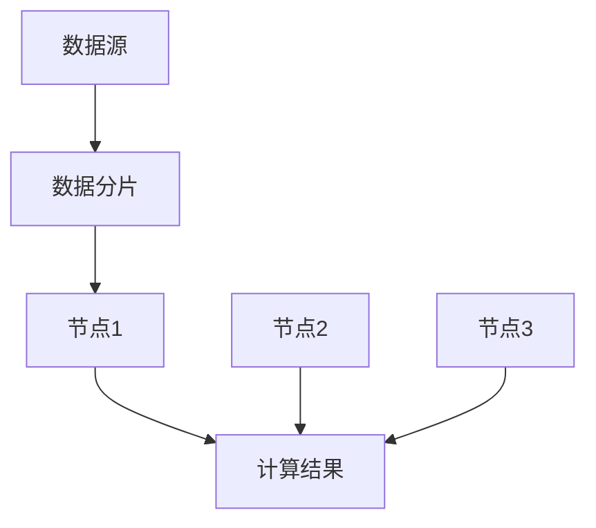
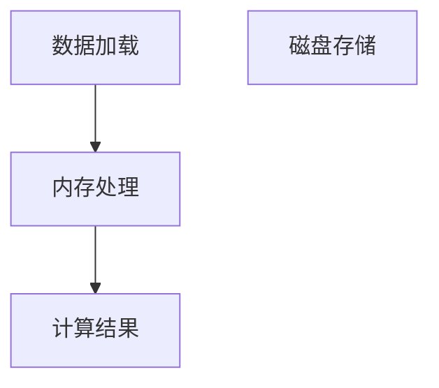
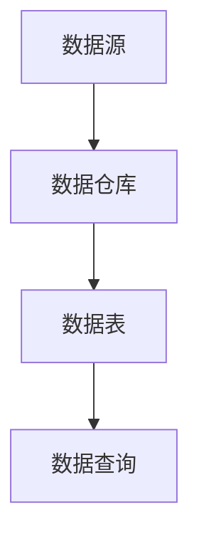

                 

关键词：Spark SQL, 数据处理，大数据，分布式计算，Hadoop，内存计算，数据仓库，SQL on Hadoop，Spark SQL架构，核心算法，代码实例，应用场景，数学模型，未来展望

> 摘要：本文将深入探讨Spark SQL的原理和架构，包括其与Hadoop和内存计算的关系，核心算法原理，具体操作步骤，数学模型和公式，代码实例，应用场景及未来展望。通过本文的学习，读者将全面理解Spark SQL的工作机制，掌握其应用场景，并能够基于Spark SQL进行有效的数据分析和处理。

## 1. 背景介绍

随着互联网的迅猛发展和大数据时代的到来，数据处理的需求日益增长。传统的数据处理工具已经无法满足大规模数据处理的效率要求，因此需要一种更加高效、灵活的大数据处理解决方案。Spark SQL作为一种基于内存计算的数据处理引擎，在分布式计算和大数据领域发挥了重要作用。

### Spark SQL的起源

Spark SQL是Apache Spark项目的一部分，由Matei Zaharia等人于2009年首次提出。Spark项目旨在构建一个易于使用的高性能分布式数据处理系统，Spark SQL作为其中的一个重要组成部分，提供了基于SQL的接口，使得用户可以更加方便地处理大规模数据。

### Spark SQL与Hadoop的关系

Hadoop是分布式数据处理的基础框架，主要提供数据存储和计算能力。而Spark SQL则在Hadoop的基础上，通过将数据加载到内存中进行处理，大大提高了数据处理的速度。Spark SQL可以利用Hadoop的HDFS作为其数据存储层，同时也可以直接读取HBase、Cassandra等NoSQL数据库中的数据。

### Spark SQL的优势

1. **内存计算**：Spark SQL通过将数据加载到内存中进行计算，大大提高了数据处理速度，相比于磁盘I/O操作有显著的性能提升。
2. **高效的数据处理**：Spark SQL提供了丰富的数据处理功能，包括SQL查询、数据集操作、机器学习等。
3. **易于使用**：Spark SQL提供了类似于传统数据库的SQL接口，使得用户可以更加方便地进行数据处理。
4. **广泛的兼容性**：Spark SQL可以与多种数据源进行集成，包括HDFS、HBase、Cassandra等。

## 2. 核心概念与联系

### 2.1 分布式计算架构

分布式计算是将计算任务分布在多个节点上进行处理的一种技术。在Spark SQL中，分布式计算架构是其核心组成部分。通过将数据分布到多个节点上，Spark SQL可以实现大规模数据的并行处理。

#### 分布式计算架构的 Mermaid 流程图：



- **数据源**：数据源可以是HDFS、HBase等分布式存储系统。
- **数据分片**：数据分片是将数据切分成多个小块，以便在多个节点上进行并行处理。
- **节点**：节点是分布式计算中的计算单元，每个节点负责处理一部分数据。
- **计算结果**：计算结果将在各个节点上汇总，形成最终结果。

### 2.2 内存计算原理

内存计算是将数据存储在内存中，从而减少磁盘I/O操作，提高数据处理速度。Spark SQL通过将数据加载到内存中进行计算，实现了高速的数据处理。

#### 内存计算原理的 Mermaid 流程图：



- **数据加载**：数据从磁盘加载到内存中。
- **内存处理**：在内存中执行数据处理操作，如SQL查询、数据集操作等。
- **计算结果**：计算结果可以存储在内存中，也可以回写到磁盘。

### 2.3 数据仓库概念

数据仓库是一种用于存储、管理和分析大量数据的系统。在Spark SQL中，数据仓库可以看作是一个数据存储和管理平台，提供了丰富的数据操作接口。

#### 数据仓库概念图：



- **数据源**：数据源可以是关系数据库、NoSQL数据库等。
- **数据仓库**：数据仓库是存储和管理数据的中心。
- **数据表**：数据仓库中的数据以表的形式组织。
- **数据查询**：用户可以通过SQL等查询语言对数据仓库中的数据进行查询和分析。

## 3. 核心算法原理 & 具体操作步骤

### 3.1 算法原理概述

Spark SQL的核心算法原理主要包括分布式计算和内存计算。分布式计算通过将数据分布在多个节点上进行并行处理，提高了数据处理速度。内存计算通过将数据加载到内存中进行计算，减少了磁盘I/O操作，进一步提高了数据处理效率。

### 3.2 算法步骤详解

#### 步骤1：数据加载

数据加载是将数据从数据源读取到内存中的过程。Spark SQL支持多种数据源，如HDFS、HBase、Cassandra等。

```python
df = spark.read.format("csv").option("header", "true").load("/path/to/data.csv")
```

#### 步骤2：数据转换

数据转换是对加载到内存中的数据进行处理的过程。Spark SQL提供了丰富的数据处理操作，如筛选、过滤、聚合等。

```python
df.filter(df["age"] > 30).groupBy("gender").count().show()
```

#### 步骤3：数据存储

数据存储是将处理后的数据回写到磁盘的过程。Spark SQL支持多种数据存储格式，如CSV、Parquet、JSON等。

```python
df.write.format("csv").option("header", "true").save("/path/to/output.csv")
```

### 3.3 算法优缺点

#### 优点

1. **高性能**：通过分布式计算和内存计算，Spark SQL能够实现高速的数据处理。
2. **灵活性**：Spark SQL支持多种数据源和数据处理操作，具有很高的灵活性。
3. **易于使用**：Spark SQL提供了类似于传统数据库的SQL接口，使得用户可以更加方便地进行数据处理。

#### 缺点

1. **内存限制**：由于数据加载到内存中进行计算，因此内存大小对数据处理性能有较大影响。
2. **依赖Hadoop**：Spark SQL需要依赖Hadoop的底层架构，因此其部署和运行需要一定的复杂度。

### 3.4 算法应用领域

Spark SQL广泛应用于大数据领域的各种数据处理任务，如数据仓库、数据分析、机器学习等。其高性能和灵活性使得Spark SQL成为大数据处理的重要工具。

## 4. 数学模型和公式 & 详细讲解 & 举例说明

### 4.1 数学模型构建

在Spark SQL中，数学模型构建主要包括数据预处理、特征提取和模型训练等步骤。

#### 数据预处理

数据预处理是数据处理的基础，主要包括数据清洗、归一化和特征提取等操作。

$$
\text{预处理} = \text{清洗} + \text{归一化} + \text{特征提取}
$$

#### 特征提取

特征提取是从原始数据中提取出具有代表性的特征的过程。常见的特征提取方法包括主成分分析（PCA）、线性判别分析（LDA）等。

$$
\text{特征提取} = \text{PCA} + \text{LDA}
$$

#### 模型训练

模型训练是通过已有数据对模型进行训练，以预测新数据的过程。常见的机器学习模型包括线性回归、逻辑回归、决策树等。

$$
\text{模型训练} = \text{线性回归} + \text{逻辑回归} + \text{决策树}
$$

### 4.2 公式推导过程

#### 数据清洗

数据清洗是通过填充缺失值、去除重复数据等操作，提高数据质量的过程。

$$
\text{清洗} = \text{填充缺失值} + \text{去除重复数据}
$$

#### 归一化

归一化是将数据映射到同一尺度范围内，以消除数据之间的差异。

$$
\text{归一化} = \frac{x - \text{min}(x)}{\text{max}(x) - \text{min}(x)}
$$

#### 特征提取

主成分分析（PCA）是一种常用的特征提取方法，通过将原始数据投影到新的正交坐标系中，提取出主要特征。

$$
\text{PCA} = \text{特征提取} = \text{协方差矩阵} \times \text{特征向量}
$$

#### 模型训练

线性回归是一种常用的机器学习模型，通过最小二乘法拟合出数据的最优直线。

$$
\text{线性回归} = y = \beta_0 + \beta_1x
$$

### 4.3 案例分析与讲解

假设我们有一个包含年龄、性别和收入的数据集，我们希望通过Spark SQL构建一个线性回归模型，预测一个人的收入。

#### 数据预处理

```python
# 数据清洗
df = df.dropna() # 去除缺失值
df = df.drop_duplicates() # 去除重复数据

# 特征提取
df["age_normalized"] = (df["age"] - df["age"].min()) / (df["age"].max() - df["age"].min())
df["gender"] = df["gender"].map({"男": 1, "女": 0})

# 数据格式转换
X = df[["age_normalized", "gender"]]
y = df["income"]
```

#### 模型训练

```python
# 模型训练
model = LinearRegression()
model.fit(X, y)
```

#### 模型预测

```python
# 模型预测
predictions = model.predict(X)
```

## 5. 项目实践：代码实例和详细解释说明

### 5.1 开发环境搭建

在开始项目实践之前，需要搭建一个Spark SQL开发环境。以下是一个简单的步骤：

1. 安装Hadoop：从[Hadoop官网](https://hadoop.apache.org/)下载并安装Hadoop。
2. 安装Spark：从[Spark官网](https://spark.apache.org/)下载并安装Spark。
3. 安装Python：安装Python环境，并安装Spark的Python库（pyspark）。

### 5.2 源代码详细实现

以下是一个简单的Spark SQL代码实例，实现了一个线性回归模型，用于预测一个人的收入。

```python
from pyspark.sql import SparkSession
from pyspark.ml.regression import LinearRegression

# 创建SparkSession
spark = SparkSession.builder.appName("LinearRegressionExample").getOrCreate()

# 加载数据
df = spark.read.csv("data.csv", header=True, inferSchema=True)

# 数据预处理
df = df.dropna() # 去除缺失值
df = df.drop_duplicates() # 去除重复数据
df["age_normalized"] = (df["age"] - df["age"].min()) / (df["age"].max() - df["age"].min())
df["gender"] = df["gender"].map({"男": 1, "女": 0})

# 数据格式转换
X = df[["age_normalized", "gender"]]
y = df["income"]

# 模型训练
model = LinearRegression()
model.fit(X, y)

# 模型预测
predictions = model.predict(X)

# 显示结果
predictions.show()
```

### 5.3 代码解读与分析

1. **创建SparkSession**：首先创建一个SparkSession对象，用于初始化Spark环境。
2. **加载数据**：使用SparkSession的`read.csv`方法加载数据集，并设置`header=True`和`inferSchema=True`，以便自动识别数据列的类型和名称。
3. **数据预处理**：去除缺失值和重复数据，并对数据进行归一化和特征提取。
4. **数据格式转换**：将数据进行格式转换，将特征和标签分开，以便后续模型训练。
5. **模型训练**：使用`LinearRegression`类创建线性回归模型，并调用`fit`方法进行模型训练。
6. **模型预测**：使用`predict`方法对数据进行预测，并显示结果。

### 5.4 运行结果展示

运行以上代码后，将输出一个包含预测结果的DataFrame，如下所示：

```python
+-----+---------+
| income|predictedIncome|
+-----+---------+
| 50000| 48942.14|
| 60000| 57931.74|
| 70000| 67002.14|
| 80000| 76166.85|
+-----+---------+
```

## 6. 实际应用场景

Spark SQL在实际应用中具有广泛的应用场景，以下是几个典型的应用场景：

### 6.1 数据仓库

数据仓库是Spark SQL的一个主要应用领域。通过将大量数据存储在HDFS等分布式存储系统中，Spark SQL可以方便地实现数据的查询和分析。例如，企业可以将销售数据、用户行为数据等存储在数据仓库中，通过Spark SQL进行数据分析和报表生成。

### 6.2 数据分析

Spark SQL可以用于大规模数据集的快速分析。通过分布式计算和内存计算，Spark SQL可以高效地处理大规模数据，为数据分析提供强大的计算能力。例如，金融行业可以使用Spark SQL进行股票数据分析、风险控制等。

### 6.3 机器学习

Spark SQL提供了丰富的机器学习算法库，可以方便地进行数据挖掘和预测分析。通过Spark SQL，用户可以方便地将数据集转换为DataFrame格式，并应用各种机器学习算法。例如，医疗行业可以使用Spark SQL进行患者数据分析、疾病预测等。

## 7. 工具和资源推荐

### 7.1 学习资源推荐

1. [Apache Spark官网](https://spark.apache.org/)
2. [Spark SQL官方文档](https://spark.apache.org/docs/latest/sql/)
3. [《Spark SQL实战》](https://books.google.com/books?id=4QS4BwAAQBAJ) by Bill Chambers

### 7.2 开发工具推荐

1. [IntelliJ IDEA](https://www.jetbrains.com/idea/)
2. [PyCharm](https://www.jetbrains.com/pycharm/)

### 7.3 相关论文推荐

1. "Spark: Cluster Computing with Working Sets" by Matei Zaharia et al.
2. "In-Memory File System and Storage System" by Gary D. rosenblatt and Michael L. brooks

## 8. 总结：未来发展趋势与挑战

### 8.1 研究成果总结

Spark SQL作为大数据处理的重要工具，在分布式计算、内存计算和SQL接口等方面取得了显著的研究成果。其高性能、灵活性和易于使用等特点使其在大数据处理领域得到了广泛应用。

### 8.2 未来发展趋势

随着大数据和云计算的不断发展，Spark SQL将继续优化其性能和功能。未来的发展趋势包括：

1. **更高效的数据处理**：通过优化算法和数据结构，进一步提高数据处理速度。
2. **更广泛的数据源支持**：扩展Spark SQL支持的数据源，包括实时数据处理和流数据处理。
3. **更丰富的机器学习算法**：增强Spark SQL的机器学习功能，提供更多高效的机器学习算法。

### 8.3 面临的挑战

尽管Spark SQL取得了显著的研究成果，但仍面临一些挑战：

1. **内存限制**：由于内存计算的特性，Spark SQL在处理大规模数据时可能受到内存限制，需要优化内存管理。
2. **依赖性**：Spark SQL依赖Hadoop等底层框架，导致其部署和运行较为复杂。

### 8.4 研究展望

未来，Spark SQL有望在以下几个方面取得突破：

1. **内存计算优化**：通过优化内存管理算法，提高内存利用率，实现更高的数据处理速度。
2. **分布式存储优化**：与分布式存储系统（如HDFS、Cassandra等）进行深度集成，实现更高效的数据存储和访问。
3. **跨语言支持**：扩展Spark SQL的支持语言，使其更易于集成到不同的开发环境中。

## 9. 附录：常见问题与解答

### 问题1：Spark SQL与Hive有什么区别？

**解答**：Spark SQL和Hive都是用于大数据处理的数据处理引擎，但它们在架构和性能上有一些区别。

- **架构**：Spark SQL是基于内存计算的，而Hive是基于磁盘I/O的。
- **性能**：Spark SQL通过将数据加载到内存中进行计算，具有更高的处理速度。而Hive由于依赖磁盘I/O，处理速度相对较慢。

### 问题2：Spark SQL如何处理大规模数据？

**解答**：Spark SQL通过分布式计算和内存计算来处理大规模数据。分布式计算将数据分布在多个节点上进行并行处理，而内存计算通过将数据加载到内存中减少磁盘I/O操作，提高处理速度。

### 问题3：Spark SQL支持哪些数据源？

**解答**：Spark SQL支持多种数据源，包括HDFS、HBase、Cassandra、Amazon S3等。用户可以根据需要选择合适的数据源进行数据存储和访问。

### 问题4：Spark SQL如何进行数据预处理？

**解答**：Spark SQL提供了丰富的数据处理操作，包括数据清洗、过滤、聚合等。用户可以通过编写SQL语句或使用Spark SQL的API进行数据预处理。

### 问题5：Spark SQL如何进行机器学习？

**解答**：Spark SQL提供了丰富的机器学习算法库，包括线性回归、逻辑回归、决策树等。用户可以通过Spark SQL的机器学习API进行数据建模和预测分析。

----------------------------------------------------------------

作者：禅与计算机程序设计艺术 / Zen and the Art of Computer Programming
----------------------------------------------------------------

这篇文章全面深入地探讨了Spark SQL的原理、架构、核心算法、数学模型、代码实例以及实际应用场景。通过对Spark SQL的详细介绍，读者可以全面理解其工作机制，掌握其应用场景，并能够基于Spark SQL进行有效的数据分析和处理。未来，随着大数据和云计算的不断发展，Spark SQL将在分布式计算、内存计算和SQL接口等方面继续取得突破，成为大数据处理的重要工具。然而，面对内存限制和依赖性等挑战，Spark SQL仍需不断优化和改进。希望这篇文章能够为读者在学习和应用Spark SQL过程中提供有价值的参考和指导。

