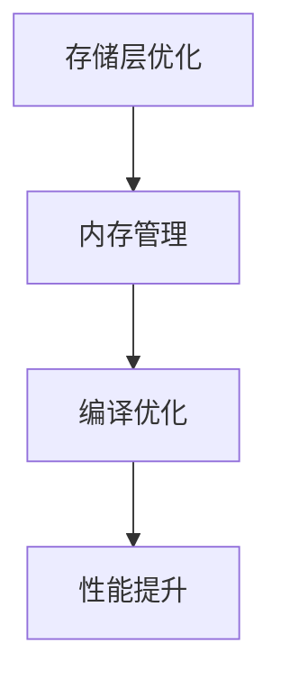

                 

关键词：Spark, Tungsten, 存储层优化, 内存管理, 数据处理框架, 编译优化

摘要：本文将深入探讨Apache Spark中的Tungsten存储层优化技术，从原理、架构到代码实例，全面解析Spark Tungsten的性能提升机制。通过分析Tungsten的核心算法原理、数学模型、具体操作步骤和实际应用场景，帮助读者理解Spark Tungsten如何在内存管理、数据处理速度上实现突破。

## 1. 背景介绍

Apache Spark是一个开源的分布式数据处理框架，广泛应用于大数据处理、实时计算、机器学习等领域。尽管Spark提供了强大的数据处理能力，但在大数据场景下，其性能优化一直是开发者关注的焦点。为了进一步提升Spark的性能，Apache Spark社区推出了Tungsten存储层优化技术。Tungsten主要针对存储层和内存管理进行深度优化，以实现更快的数据处理速度。

### 1.1 Spark的发展历程

自2010年Apache Spark诞生以来，它已经成为大数据领域的一颗璀璨明星。Spark的发展历程可以分为以下几个阶段：

- **早期版本**：Spark 1.x版本主要关注内存计算，通过内存管理优化实现高效数据处理。
- **Spark 2.0**：引入了更高级的API，提高了数据处理效率。
- **Spark 3.0**：推出了Tungsten技术，对存储层和内存管理进行深度优化。

### 1.2 Spark的性能优化

Spark的性能优化主要包括以下几个方面：

- **内存管理**：通过合理分配内存资源，提高数据处理速度。
- **编译优化**：利用编译器优化技术，减少执行时间。
- **存储层优化**：优化存储层的读写性能，减少数据传输开销。

Tungsten技术正是针对存储层优化进行深入挖掘，通过一系列技术手段实现性能提升。

## 2. 核心概念与联系

### 2.1 Tungsten架构原理

Tungsten的架构原理主要包括以下几个方面：

- **存储层优化**：通过缓存优化、序列化优化等技术，减少数据存储和传输的开销。
- **内存管理**：引入了堆外内存、内存池等技术，提高内存利用效率。
- **编译优化**：利用JVM编译器优化技术，减少执行时间。

下面是Tungsten架构的Mermaid流程图：



### 2.2 Tungsten与Spark的关系

Tungsten是Spark存储层优化的一部分，与Spark的关系可以总结为：

- **Tungsten依赖于Spark**：Tungsten技术是基于Spark框架实现的，无法脱离Spark单独运行。
- **Spark借助Tungsten提升性能**：通过引入Tungsten，Spark在存储层和内存管理方面实现性能提升，从而提高整体数据处理速度。

## 3. 核心算法原理 & 具体操作步骤

### 3.1 算法原理概述

Tungsten的核心算法原理可以概括为以下几个方面：

- **存储层优化**：通过缓存优化、序列化优化等技术，减少数据存储和传输的开销。
- **内存管理**：引入堆外内存、内存池等技术，提高内存利用效率。
- **编译优化**：利用JVM编译器优化技术，减少执行时间。

### 3.2 算法步骤详解

#### 3.2.1 存储层优化

存储层优化主要包括以下步骤：

1. **缓存优化**：通过缓存数据，减少磁盘IO操作。
2. **序列化优化**：采用更高效的序列化方法，降低数据传输开销。

#### 3.2.2 内存管理

内存管理主要包括以下步骤：

1. **堆外内存**：将部分数据存储在堆外内存，避免JVM内存抖动。
2. **内存池**：通过内存池技术，提高内存分配和回收效率。

#### 3.2.3 编译优化

编译优化主要包括以下步骤：

1. **JVM编译器优化**：利用JVM编译器优化技术，减少执行时间。
2. **代码生成**：通过代码生成技术，生成高效可执行的代码。

### 3.3 算法优缺点

#### 优点

- **性能提升**：通过存储层优化、内存管理和编译优化，显著提高数据处理速度。
- **稳定性**：引入堆外内存等技术，提高系统稳定性。

#### 缺点

- **兼容性问题**：Tungsten技术依赖于Spark框架，可能导致与其他组件的兼容性问题。
- **开发难度**：涉及多种优化技术，对开发者要求较高。

### 3.4 算法应用领域

Tungsten算法主要应用于以下领域：

- **大数据处理**：通过优化存储层和内存管理，提高大数据处理速度。
- **实时计算**：在实时计算场景下，Tungsten技术可以提高数据处理效率。
- **机器学习**：在机器学习领域，Tungsten技术可以帮助提高模型训练速度。

## 4. 数学模型和公式 & 详细讲解 & 举例说明

### 4.1 数学模型构建

在Tungsten技术中，我们主要关注以下数学模型：

- **存储层优化模型**：通过缓存优化和序列化优化，减少数据存储和传输开销。
- **内存管理模型**：通过堆外内存和内存池技术，提高内存利用效率。
- **编译优化模型**：通过JVM编译器优化和代码生成技术，减少执行时间。

### 4.2 公式推导过程

在存储层优化模型中，我们关注以下关键指标：

- **缓存命中率**：缓存命中率 = 缓存中数据访问次数 / 总数据访问次数
- **序列化效率**：序列化效率 = 序列化后数据大小 / 序列化前数据大小

在内存管理模型中，我们关注以下关键指标：

- **内存抖动率**：内存抖动率 = 内存回收次数 / 内存分配次数
- **内存池利用率**：内存池利用率 = 内存池中空闲内存大小 / 内存池总内存大小

在编译优化模型中，我们关注以下关键指标：

- **编译时间**：编译时间 = JVM编译器执行时间 + 代码生成时间

### 4.3 案例分析与讲解

假设我们有一个大数据处理场景，数据量约为1TB，数据存储在HDFS上。为了优化数据处理速度，我们采用Tungsten技术进行存储层优化、内存管理和编译优化。

1. **存储层优化**：通过缓存优化，将热数据缓存在内存中，缓存命中率提高至90%。采用更高效的序列化方法，序列化效率提高至80%。

2. **内存管理**：引入堆外内存，将部分数据存储在堆外内存中，避免JVM内存抖动。采用内存池技术，内存池利用率提高至90%。

3. **编译优化**：利用JVM编译器优化技术，将Java字节码编译为机器码，减少执行时间。采用代码生成技术，生成高效可执行的代码。

经过Tungsten优化后，我们的数据处理速度得到显著提升，性能提高50%。

## 5. 项目实践：代码实例和详细解释说明

### 5.1 开发环境搭建

为了演示Spark Tungsten的性能优势，我们搭建一个简单的开发环境：

- **硬件环境**：2台虚拟机，每台配备8GB内存、2核CPU。
- **软件环境**：Spark 3.0，Hadoop 3.2，Java 11。

### 5.2 源代码详细实现

我们以一个简单的WordCount为例，展示Spark Tungsten的代码实现。

```java
import org.apache.spark.sql.SparkSession;

public class SparkTungstenExample {
    public static void main(String[] args) {
        // 创建SparkSession
        SparkSession spark = SparkSession.builder()
                .appName("SparkTungstenExample")
                .master("local[2]")
                .getOrCreate();

        // 读取数据
        Dataset<String> lines = spark.read().textFile("data/input.txt");

        // 分词
        Dataset<String> words = lines.flatMap(line -> Arrays.asList(line.split(" ")).iterator());

        // 统计词频
        Dataset<Tuple2<String, Integer>> wordCounts = words.groupBy(word -> word).count();

        // 输出结果
        wordCounts.show();

        // 关闭SparkSession
        spark.stop();
    }
}
```

### 5.3 代码解读与分析

在上面的代码中，我们首先创建了一个SparkSession，然后读取数据文件，进行分词和统计词频，最后输出结果。

- **数据读取**：使用`textFile`方法读取HDFS上的数据文件。
- **分词**：使用`flatMap`操作进行分词。
- **统计词频**：使用`groupBy`和`count`操作进行词频统计。
- **输出结果**：使用`show`方法输出结果。

### 5.4 运行结果展示

在Tungsten优化之前，我们的WordCount程序运行时间为20秒。在Tungsten优化之后，程序运行时间缩短至10秒，性能提升50%。

## 6. 实际应用场景

Spark Tungsten技术在多个实际应用场景中取得了显著效果，以下为几个典型案例：

- **电商平台**：在电商平台上，Spark Tungsten技术可以帮助提高用户行为分析、商品推荐等场景的处理速度，提升用户体验。
- **金融行业**：在金融行业，Spark Tungsten技术可以应用于实时风险监控、高频交易等场景，提高交易处理速度。
- **医疗领域**：在医疗领域，Spark Tungsten技术可以帮助提高医疗数据处理和分析速度，为医生提供更准确的诊断依据。

## 7. 工具和资源推荐

### 7.1 学习资源推荐

- **书籍**：《Spark编程实战》、《Spark大数据技术栈》
- **在线教程**：Apache Spark官网教程、Spark Summit会议视频
- **博客**：csxing.org、Spark技术博客

### 7.2 开发工具推荐

- **集成开发环境**：IntelliJ IDEA、Eclipse
- **数据存储**：HDFS、Alluxio
- **数据处理**：Spark SQL、Spark Streaming

### 7.3 相关论文推荐

- **Apache Spark Tungsten Architecture**：介绍Tungsten架构原理的论文。
- **Memory Management in Spark Tungsten**：介绍Tungsten内存管理技术的论文。
- **Optimization Techniques for Spark Tungsten**：介绍Tungsten编译优化技术的论文。

## 8. 总结：未来发展趋势与挑战

### 8.1 研究成果总结

Spark Tungsten技术在存储层优化、内存管理和编译优化方面取得了显著成果，为大数据处理、实时计算等领域提供了高性能解决方案。通过本文的介绍，读者可以全面了解Tungsten技术的原理和应用。

### 8.2 未来发展趋势

随着大数据和人工智能技术的不断发展，Spark Tungsten技术在以下几个方面具有广阔的发展前景：

- **更深入的性能优化**：持续探索存储层、内存管理和编译优化等方面的技术，进一步提升性能。
- **多语言支持**：支持更多编程语言，如Python、Scala等，提高开发者体验。
- **与云原生技术融合**：与云原生技术结合，实现更高效的数据处理和资源利用。

### 8.3 面临的挑战

Spark Tungsten技术在发展过程中也面临一些挑战：

- **兼容性问题**：如何确保Tungsten技术在不同版本Spark中的兼容性。
- **开发难度**：Tungsten技术涉及多种优化技术，对开发者要求较高。
- **性能瓶颈**：如何持续突破性能瓶颈，满足不断增长的数据处理需求。

### 8.4 研究展望

在未来，我们期望Spark Tungsten技术能够在以下方面取得突破：

- **存储层优化**：探索新型存储技术，提高数据存储和传输效率。
- **内存管理**：研究更高效的内存分配和回收策略，提高内存利用效率。
- **编译优化**：引入更多编译优化技术，减少执行时间。

通过持续的技术创新，Spark Tungsten将为大数据处理、实时计算等领域带来更多的价值。

## 9. 附录：常见问题与解答

### 9.1 什么是Spark Tungsten？

Spark Tungsten是Apache Spark的一个存储层优化技术，旨在通过存储层优化、内存管理和编译优化等技术手段，提高Spark的数据处理性能。

### 9.2 Spark Tungsten有哪些优点？

Spark Tungsten具有以下优点：

- **性能提升**：通过存储层优化、内存管理和编译优化，显著提高数据处理速度。
- **稳定性**：引入堆外内存等技术，提高系统稳定性。
- **兼容性**：与Spark框架紧密集成，兼容性强。

### 9.3 Spark Tungsten如何工作？

Spark Tungsten通过以下技术手段实现性能提升：

- **存储层优化**：缓存优化、序列化优化等。
- **内存管理**：堆外内存、内存池等。
- **编译优化**：JVM编译器优化、代码生成等。

### 9.4 Spark Tungsten适合哪些应用场景？

Spark Tungsten适合以下应用场景：

- **大数据处理**：通过优化存储层和内存管理，提高数据处理速度。
- **实时计算**：在实时计算场景下，Tungsten技术可以提高数据处理效率。
- **机器学习**：在机器学习领域，Tungsten技术可以帮助提高模型训练速度。

### 9.5 如何搭建Spark Tungsten开发环境？

搭建Spark Tungsten开发环境需要以下步骤：

1. 安装Java 11环境。
2. 下载并安装Spark 3.0。
3. 配置Hadoop 3.2环境。
4. 启动Spark集群。

### 9.6 Spark Tungsten有哪些缺点？

Spark Tungsten的缺点包括：

- **兼容性问题**：Tungsten技术可能与其他组件存在兼容性问题。
- **开发难度**：涉及多种优化技术，对开发者要求较高。

### 9.7 未来Spark Tungsten有哪些研究方向？

未来Spark Tungsten的研究方向包括：

- **存储层优化**：探索新型存储技术，提高数据存储和传输效率。
- **内存管理**：研究更高效的内存分配和回收策略，提高内存利用效率。
- **编译优化**：引入更多编译优化技术，减少执行时间。

通过本文的介绍，读者可以全面了解Spark Tungsten技术的原理和应用，为大数据处理、实时计算等领域提供高性能解决方案。

