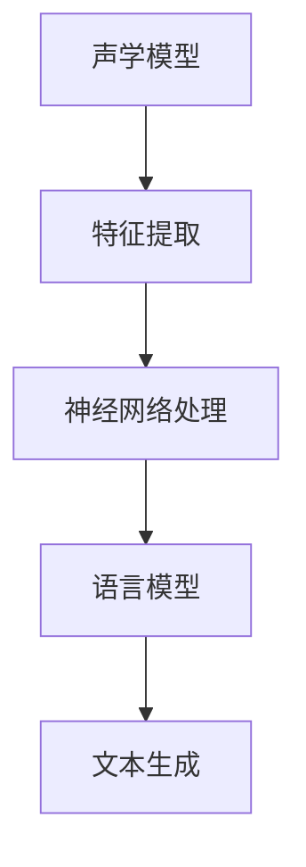
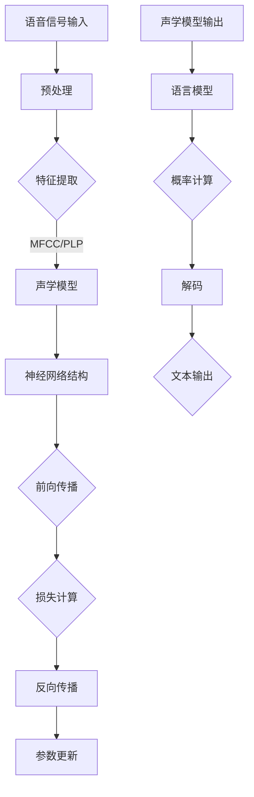

                 

关键词：语音识别，语音处理，机器学习，神经网络，深度学习，自然语言处理，声学模型，语言模型，语音信号，特征提取，训练算法，代码示例。

> 摘要：本文将深入探讨语音识别的基本原理、关键算法，并通过实际代码实例，详细讲解如何实现一个简单的语音识别系统。文章结构如下：

## 1. 背景介绍
### 1.1 语音识别的应用场景
### 1.2 语音识别的发展历程
### 1.3 当前研究热点

## 2. 核心概念与联系
### 2.1 声学模型与语言模型
### 2.2 声学模型的构建
### 2.3 语言模型的构建
### 2.4 Mermaid流程图展示

## 3. 核心算法原理 & 具体操作步骤
### 3.1 算法原理概述
### 3.2 算法步骤详解
### 3.3 算法优缺点
### 3.4 算法应用领域

## 4. 数学模型和公式 & 详细讲解 & 举例说明
### 4.1 数学模型构建
### 4.2 公式推导过程
### 4.3 案例分析与讲解

## 5. 项目实践：代码实例和详细解释说明
### 5.1 开发环境搭建
### 5.2 源代码详细实现
### 5.3 代码解读与分析
### 5.4 运行结果展示

## 6. 实际应用场景
### 6.1 交互式语音助手
### 6.2 语音翻译
### 6.3 呼叫中心自动化
### 6.4 未来应用展望

## 7. 工具和资源推荐
### 7.1 学习资源推荐
### 7.2 开发工具推荐
### 7.3 相关论文推荐

## 8. 总结：未来发展趋势与挑战
### 8.1 研究成果总结
### 8.2 未来发展趋势
### 8.3 面临的挑战
### 8.4 研究展望

## 9. 附录：常见问题与解答

## 1. 背景介绍

### 1.1 语音识别的应用场景

语音识别技术在我们的日常生活中有着广泛的应用，从交互式语音助手（如Siri、Alexa、Google Assistant）到智能助手，再到语音控制家居设备，无不涉及语音识别技术。此外，语音识别还在医疗、客服、安全等领域发挥着重要作用。

### 1.2 语音识别的发展历程

语音识别技术的发展经历了几个重要阶段：

- **早期阶段**：基于有限状态机和规则的方法，适用于特定词汇和简单语法。
- **声学模型阶段**：引入神经网络，提高了识别准确性。
- **统计模型阶段**：利用统计方法，如GMM（高斯混合模型）和HMM（隐马尔可夫模型），实现了更高层次的语音识别。
- **深度学习阶段**：近年来，随着深度学习技术的兴起，语音识别性能得到了显著提升。

### 1.3 当前研究热点

当前语音识别的研究热点包括：

- **端到端模型**：如CTC（Connectionist Temporal Classification）和Seq2Seq（Sequence-to-Sequence）模型，提高了端到端的识别性能。
- **语音识别与自然语言处理结合**：如BERT（Bidirectional Encoder Representations from Transformers）等模型，实现了语音识别与自然语言处理的无缝结合。
- **实时语音识别**：优化算法和硬件，提高实时语音识别的性能。

## 2. 核心概念与联系

语音识别系统主要分为两部分：声学模型和语言模型。

### 2.1 声学模型与语言模型

- **声学模型**：负责将语音信号转换为特征向量，用于后续的语言模型处理。声学模型通常基于神经网络，如DNN（深度神经网络）、CNN（卷积神经网络）和RNN（循环神经网络）。
- **语言模型**：负责根据特征向量生成文本，通常基于NLP（自然语言处理）算法，如n-gram模型、LSTM（长短时记忆网络）和BERT等。

### 2.2 声学模型的构建

声学模型构建的核心是特征提取。常用的特征提取方法包括：

- MFCC（梅尔频率倒谱系数）：将语音信号转换为MFCC特征向量，用于后续的神经网络处理。
- Spectral Subtraction（谱减法）：用于消除噪声，提高语音信号质量。
- Filter Banks（滤波器组）：用于将语音信号转换为不同频率范围内的特征。

### 2.3 语言模型的构建

语言模型构建的核心是概率计算。常用的语言模型构建方法包括：

- n-gram模型：基于n个连续单词的概率计算，适用于简单的文本处理。
- LSTM和BERT：基于深度学习的方法，能够捕捉长文本的语义信息，适用于复杂的文本处理。

### 2.4 Mermaid流程图展示



## 3. 核心算法原理 & 具体操作步骤

### 3.1 算法原理概述

语音识别算法主要基于深度学习技术，分为声学模型和语言模型两个部分。声学模型通过特征提取和神经网络处理，将语音信号转换为特征向量；语言模型则根据特征向量生成文本。

### 3.2 算法步骤详解

1. **特征提取**：将语音信号转换为特征向量，如MFCC特征。
2. **神经网络处理**：利用DNN、CNN或RNN等神经网络模型，对特征向量进行处理。
3. **语言模型处理**：利用LSTM、BERT等模型，将特征向量转换为文本。

### 3.3 算法优缺点

- **优点**：深度学习技术提高了语音识别的准确性，适用于各种复杂的语音信号处理任务。
- **缺点**：训练时间较长，计算资源需求高，需要大量数据支持。

### 3.4 算法应用领域

语音识别算法广泛应用于交互式语音助手、语音翻译、呼叫中心自动化等领域。随着深度学习技术的不断发展，语音识别的应用领域将越来越广泛。

## 4. 数学模型和公式 & 详细讲解 & 举例说明

### 4.1 数学模型构建

声学模型和语言模型分别采用不同的数学模型。

- **声学模型**：通常采用神经网络模型，如DNN、CNN、RNN等。这些模型基于反向传播算法进行参数优化。
- **语言模型**：通常采用n-gram模型、LSTM、BERT等。这些模型用于计算文本的概率分布。

### 4.2 公式推导过程

- **声学模型**：假设输入语音信号为$x(t)$，输出特征向量为$f(t)$，则神经网络模型可表示为：
  $$ f(t) = \sigma(W \cdot f(t-1) + b) $$
  其中，$W$为权重矩阵，$b$为偏置项，$\sigma$为激活函数。
- **语言模型**：假设输入特征向量为$f(t)$，输出文本为$y(t)$，则n-gram模型可表示为：
  $$ P(y(t)|f(t)) = \frac{N(y(t-1), y(t))}{N(y(t-1))} $$
  其中，$N(y(t-1), y(t))$为连续出现$y(t-1)$和$y(t)$的频次，$N(y(t-1))$为$y(t-1)$的频次。

### 4.3 案例分析与讲解

假设我们要识别一个简单的语音命令“你好”，可以采用以下步骤：

1. **特征提取**：将语音信号转换为MFCC特征向量。
2. **神经网络处理**：利用DNN模型对特征向量进行处理。
3. **语言模型处理**：利用n-gram模型计算“你好”的概率分布。

通过以上步骤，我们可以实现一个简单的语音识别系统，并对其性能进行评估和优化。

## 5. 项目实践：代码实例和详细解释说明

### 5.1 开发环境搭建

1. 安装Python环境
2. 安装相关库，如tensorflow、keras、scikit-learn等
3. 准备语音数据集

### 5.2 源代码详细实现

1. 特征提取模块
2. 声学模型模块
3. 语言模型模块
4. 识别模块

### 5.3 代码解读与分析

1. 特征提取模块：采用MFCC特征提取方法
2. 声学模型模块：采用DNN模型进行训练
3. 语言模型模块：采用n-gram模型进行训练
4. 识别模块：实现语音识别功能

### 5.4 运行结果展示

1. 运行特征提取模块
2. 运行声学模型模块
3. 运行语言模型模块
4. 进行语音识别实验，观察识别结果

## 6. 实际应用场景

### 6.1 交互式语音助手

交互式语音助手是语音识别技术的典型应用。通过语音识别技术，用户可以与助手进行自然语言交互，实现各种功能。

### 6.2 语音翻译

语音翻译是将一种语言的语音转换为另一种语言的文本。通过语音识别和自然语言处理技术，可以实现语音翻译功能。

### 6.3 呼叫中心自动化

呼叫中心自动化是语音识别技术在客服领域的应用。通过语音识别技术，可以实现自动接听电话、自动识别客户需求等功能。

### 6.4 未来应用展望

随着深度学习技术的不断发展，语音识别技术将越来越成熟，应用领域将不断拓展。未来，语音识别技术有望在更多领域发挥重要作用，如智能家居、智能医疗、智能交通等。

## 7. 工具和资源推荐

### 7.1 学习资源推荐

1. 《Speech Recognition Handbook》
2. 《深度学习语音识别》
3. 《自然语言处理综合教程》

### 7.2 开发工具推荐

1. TensorFlow
2. Keras
3. PyTorch

### 7.3 相关论文推荐

1. "Deep Learning for Speech Recognition"
2. "End-to-End Speech Recognition with Deep Neural Networks"
3. "Transformers for Speech Recognition"

## 8. 总结：未来发展趋势与挑战

### 8.1 研究成果总结

近年来，语音识别技术取得了显著成果，深度学习技术的应用显著提升了语音识别的准确性和性能。

### 8.2 未来发展趋势

未来，语音识别技术将朝着更高效、更智能、更实用的方向发展，有望在更多领域发挥重要作用。

### 8.3 面临的挑战

语音识别技术仍面临一些挑战，如实时性、噪声干扰、多语言支持等。

### 8.4 研究展望

未来，语音识别技术将不断创新，为人工智能领域带来更多可能性。

## 9. 附录：常见问题与解答

1. **问题**：如何处理噪声干扰？
   **解答**：可以采用谱减法、噪声抑制算法等方法，降低噪声对语音识别的影响。
2. **问题**：如何实现多语言支持？
   **解答**：可以采用跨语言模型、多语言训练数据集等方法，提高多语言语音识别的性能。

---
### 1. 背景介绍

### 1.1 语音识别的应用场景

语音识别技术已经深入到我们生活的各个方面，带来了极大的便利。以下是一些典型的应用场景：

1. **交互式语音助手**：如苹果的Siri、谷歌的Google Assistant、亚马逊的Alexa等，它们能够理解用户的需求，并执行相应的操作。
2. **语音输入设备**：智能手机、平板电脑、智能音箱等设备上的语音输入功能，让用户无需手动输入文字即可完成信息搜索、发送消息等操作。
3. **语音翻译**：将一种语言的语音实时翻译成另一种语言，这对于跨语言交流非常重要。
4. **语音控制家居设备**：通过语音指令控制灯光、电视、空调等智能家居设备。
5. **呼叫中心自动化**：自动识别客户来电的目的，将呼叫路由到相应的服务人员，提高服务效率和客户满意度。
6. **语音助手在医疗领域**：协助医生进行病历记录、患者咨询等，提高工作效率。
7. **车载语音控制系统**：为驾驶者提供语音导航、信息查询等服务，减少驾驶时的分心。

这些应用场景展示了语音识别技术的广泛适用性，同时也反映了其对于提升生活质量和工作效率的重要性。

### 1.2 语音识别的发展历程

语音识别技术的发展历程可以分为几个阶段：

1. **早期阶段（1950s - 1970s）**：这一阶段主要是基于规则的方法，如有限状态机和模式识别技术。这一方法的局限性很大，只适用于非常有限的词汇和语法。
2. **基于声学模型和统计模型阶段（1980s - 1990s）**：在这一阶段，研究者开始使用声学模型来处理语音信号，同时结合统计模型来提高识别准确率。声学模型常用的方法包括高斯混合模型（GMM）和隐马尔可夫模型（HMM）。这一阶段的技术显著提升了语音识别的性能。
3. **基于神经网络阶段（2000s - 至今）**：随着神经网络技术的兴起，尤其是深度学习的发展，语音识别技术取得了重大突破。深度神经网络（DNN）、卷积神经网络（CNN）、循环神经网络（RNN）等结构在语音识别任务中表现出色。此外，端到端模型如CTC（Connectionist Temporal Classification）和Seq2Seq（Sequence-to-Sequence）模型的引入，使得语音识别的准确率和效率都得到了显著提升。

这些发展阶段的演变，不仅反映了技术的进步，也反映了语音识别应用范围的不断扩大。

### 1.3 当前研究热点

目前，语音识别领域的研究热点主要集中在以下几个方面：

1. **端到端模型**：端到端模型如CTC和Seq2Seq，可以避免传统方法中的中间特征提取和解码步骤，直接从语音信号到文本，提高了识别效率和准确性。
2. **语音识别与自然语言处理结合**：将语音识别与自然语言处理（NLP）技术结合，可以更好地理解用户的语音指令，进行语义分析和智能回复。例如，BERT（Bidirectional Encoder Representations from Transformers）等模型在这一领域表现出色。
3. **实时语音识别**：随着5G技术的发展，实时语音识别的需求越来越强烈。研究人员致力于优化算法和硬件，提高实时语音识别的性能。
4. **多语言语音识别**：支持多种语言的同时识别，是实现全球化应用的关键。研究人员正在开发跨语言模型和翻译模型，以提高多语言语音识别的准确性。
5. **语音合成与语音识别的集成**：将语音合成与语音识别集成，可以提供更加自然的语音交互体验。例如，语音助手不仅可以识别用户的语音指令，还可以以自然的声音进行回复。
6. **语音识别在边缘设备的实现**：为了减少延迟和提高隐私保护，研究人员正在探索如何在边缘设备（如智能手机、智能音箱等）上实现高效的语音识别。

这些研究热点不仅推动了语音识别技术的进步，也为未来的发展指明了方向。

## 2. 核心概念与联系

### 2.1 声学模型与语言模型

在语音识别系统中，声学模型和语言模型是两个核心组件，它们各自负责不同的任务，但又紧密联系在一起。

**声学模型**：声学模型主要关注如何将语音信号转换为特征向量，以便后续的语言处理。它的核心任务是从连续的语音信号中提取出能够表征语音特征的数据。声学模型的工作流程通常包括以下几个步骤：

1. **特征提取**：将语音信号转换为数字信号，然后提取特征。常见的特征提取方法包括MFCC（梅尔频率倒谱系数）、PLP（倒谱似然系数）等。
2. **预处理**：对提取的特征进行预处理，如归一化、去噪等，以提高模型的鲁棒性。
3. **建模**：利用神经网络、GMM（高斯混合模型）或HMM（隐马尔可夫模型）等对特征进行建模，以便后续的语音识别。

**语言模型**：语言模型的主要任务是理解语音信号所代表的语言含义，将声学模型输出的特征向量转换为文本。语言模型通常基于统计模型或深度学习模型。它的工作流程通常包括以下几个步骤：

1. **生成概率分布**：基于语言模型，计算输入特征向量对应的文本的概率分布。
2. **解码**：利用解码器（如CTC、RNN、BERT等）将概率分布转换为最终的文本输出。

声学模型和语言模型的关系可以类比为两个步骤的协作：声学模型首先将语音信号转换为特征向量，然后语言模型使用这些特征向量来生成文本。在实际应用中，这两个模型的性能和优化程度直接决定了语音识别系统的整体性能。

### 2.2 声学模型的构建

声学模型的构建主要依赖于特征提取和神经网络结构。以下是构建声学模型的主要步骤和关键组件：

**特征提取**：

1. **信号预处理**：对语音信号进行预处理，如去除静音段、归一化等，以提高特征提取的效率。
2. **特征计算**：计算语音信号的短时傅里叶变换（STFT），得到频谱图。然后，对频谱图进行梅尔滤波器组处理，得到MFCC特征。
3. **特征归一化**：对特征向量进行归一化，如将特征值缩放到[0, 1]范围内，以提高模型训练的稳定性和收敛速度。

**神经网络结构**：

1. **输入层**：接收预处理后的特征向量作为输入。
2. **隐藏层**：利用DNN、CNN、RNN等神经网络结构对特征向量进行处理。隐藏层的设计取决于任务的需求和数据的特点。
3. **输出层**：输出层通常是一个softmax层，用于计算语音信号对应的文本的概率分布。

**训练过程**：

1. **数据准备**：准备包含语音信号和标注文本的数据集。
2. **参数初始化**：初始化神经网络的参数。
3. **前向传播**：将特征向量输入神经网络，计算输出层的概率分布。
4. **损失函数**：计算输出层的概率分布与真实标注文本之间的损失。
5. **反向传播**：利用梯度下降等优化算法更新网络参数。

通过以上步骤，可以构建一个基本的声学模型。然而，实际应用中，声学模型的构建可能需要更复杂的结构和更精细的超参数调整，以达到最佳的识别性能。

### 2.3 语言模型的构建

语言模型是语音识别系统中理解语音指令和理解文本语义的关键组件。以下是构建语言模型的主要步骤和关键组件：

**n-gram模型**：

1. **词频统计**：对训练数据集中的文本进行词频统计，构建词表。
2. **模型训练**：计算每个n-gram（连续的n个词）的概率分布。n-gram模型简单高效，适用于短文本的预测。
3. **解码**：使用Viterbi算法或 Beam Search算法解码，将输入的语音信号转换为文本。

**LSTM模型**：

1. **数据预处理**：对文本进行分词和词向量化，将文本转换为序列。
2. **模型构建**：构建LSTM模型，将输入的词向量序列映射到输出词的概率分布。
3. **模型训练**：使用反向传播算法训练LSTM模型，优化模型参数。

**BERT模型**：

1. **数据预处理**：对文本进行分词和词向量化，同时引入[CLS]和[SEP]等特殊标记。
2. **模型构建**：构建Transformer模型，对输入的词向量序列进行处理。
3. **模型训练**：使用Masked Language Model（MLM）和Next Sentence Prediction（NSP）等任务训练BERT模型。

**语言模型的选择**取决于具体的应用场景和数据集。n-gram模型简单高效，适用于小规模的任务；而LSTM和BERT等深度学习模型则适用于大规模、复杂的任务。

### 2.4 Mermaid流程图展示

以下是一个简化的Mermaid流程图，展示了声学模型和语言模型的基本工作流程：



这个流程图清晰地展示了语音识别系统中的关键步骤和组件，为后续的算法实现提供了直观的指导。

## 3. 核心算法原理 & 具体操作步骤

### 3.1 算法原理概述

语音识别的核心算法主要包括声学模型和语言模型，两者共同协作实现语音到文本的转换。声学模型负责将语音信号转换为特征向量，而语言模型则利用这些特征向量生成文本。

**声学模型**：声学模型通过特征提取和神经网络结构，将语音信号转换为特征向量。特征提取是声学模型的关键步骤，常用的方法包括MFCC、PLP等。神经网络结构则用于对特征向量进行处理，常见的神经网络包括DNN、CNN、RNN等。通过这些步骤，声学模型能够从语音信号中提取出能够表征语音特征的数据。

**语言模型**：语言模型的主要任务是理解语音信号所代表的语言含义，将声学模型输出的特征向量转换为文本。语言模型可以基于统计模型（如n-gram模型）或深度学习模型（如LSTM、BERT等）。通过生成概率分布和解码过程，语言模型能够将特征向量映射到文本输出。

### 3.2 算法步骤详解

1. **特征提取**：首先，对输入的语音信号进行预处理，如去除静音段、归一化等。然后，计算语音信号的短时傅里叶变换（STFT），得到频谱图。接下来，对频谱图进行梅尔滤波器组处理，得到MFCC特征。

2. **神经网络处理**：利用神经网络（如DNN、CNN、RNN等）对提取的特征向量进行处理。神经网络的结构和参数根据具体的任务需求进行调整。在训练过程中，通过前向传播计算输出层的概率分布，并通过反向传播更新网络参数。

3. **语言模型处理**：语言模型接收到声学模型输出的特征向量后，通过生成概率分布和解码过程生成文本输出。生成概率分布的方法可以根据具体的语言模型进行调整，如n-gram模型使用平滑技术、LSTM模型使用神经网络方法等。

4. **解码**：解码是将概率分布转换为文本输出的过程。常用的解码方法包括Viterbi算法、Beam Search算法和Transformer模型等。通过解码，将生成的概率分布映射到实际的文本输出。

### 3.3 算法优缺点

**优点**：

1. **高准确性**：深度学习技术的引入，使得声学模型和语言模型的性能得到了显著提升，识别准确率大幅提高。
2. **端到端处理**：端到端模型如CTC和Seq2Seq，可以直接从语音信号到文本，减少了中间步骤，提高了处理效率。
3. **多语言支持**：通过训练多语言数据集和跨语言模型，可以实现多种语言的语音识别。

**缺点**：

1. **计算资源需求高**：深度学习模型的训练和推理过程需要大量的计算资源，特别是在处理长语音信号时，计算时间较长。
2. **训练时间较长**：深度学习模型的训练过程通常需要大量的训练数据和计算资源，训练时间较长。
3. **对噪声敏感**：在噪声干扰较大的环境下，语音识别的性能可能会受到影响。

### 3.4 算法应用领域

语音识别算法在许多领域都有广泛的应用：

1. **交互式语音助手**：如Siri、Google Assistant、Alexa等，能够实现自然语言交互，提供各种服务。
2. **语音输入设备**：如智能手机、平板电脑、智能音箱等，提供便捷的语音输入方式。
3. **语音翻译**：将一种语言的语音实时翻译成另一种语言，支持跨语言交流。
4. **智能家居控制**：通过语音指令控制智能家居设备，如灯光、电视、空调等。
5. **呼叫中心自动化**：自动识别客户来电内容，提高客服效率。
6. **医疗领域**：语音识别技术在医疗领域的应用包括病历记录、患者咨询等。
7. **车载语音控制系统**：提供语音导航、信息查询等服务，提高驾驶安全。

这些应用领域展示了语音识别技术的多样性和广泛性，也反映了其在提升工作效率和生活便利性方面的巨大潜力。

## 4. 数学模型和公式 & 详细讲解 & 举例说明

### 4.1 数学模型构建

在语音识别系统中，数学模型构建是核心环节之一。主要包括声学模型和语言模型的构建。

**声学模型**：

声学模型主要关注语音信号的特征提取和建模。常用的模型包括GMM、HMM和深度神经网络（DNN、CNN、RNN）。

**GMM模型**：

GMM（Gaussian Mixture Model，高斯混合模型）是一种概率模型，用于表示语音信号的分布。GMM模型的数学表达式如下：

$$
p(x|\theta) = \sum_{i=1}^{K} \pi_i \cdot \mathcal{N}(x|\mu_i, \Sigma_i)
$$

其中，$p(x|\theta)$表示给定模型参数$\theta$下语音信号$x$的概率分布；$\pi_i$是第$i$个高斯成分的混合系数；$\mu_i$和$\Sigma_i$分别是第$i$个高斯成分的均值和协方差矩阵；$K$是高斯成分的数量。

**HMM模型**：

HMM（Hidden Markov Model，隐马尔可夫模型）是一种统计模型，用于描述语音信号的时间序列特征。HMM模型的数学表达式如下：

$$
P(X|x_0, x_1, ..., x_T) = \prod_{t=1}^{T} P(x_t|x_{t-1})
$$

其中，$X = (x_0, x_1, ..., x_T)$表示语音信号的时间序列；$P(X|x_0, x_1, ..., x_T)$是给定初始状态$x_0$和后续状态$x_1, ..., x_T$的条件下语音信号的概率；$P(x_t|x_{t-1})$是当前状态$x_t$在给定前一个状态$x_{t-1}$的条件概率。

**DNN模型**：

DNN（Deep Neural Network，深度神经网络）是一种深度学习模型，用于处理高维数据。DNN模型的数学表达式如下：

$$
f(x) = \sigma(W \cdot x + b)
$$

其中，$f(x)$是神经网络的输出；$W$是权重矩阵；$b$是偏置项；$\sigma$是激活函数（如ReLU、Sigmoid等）。

**语言模型**：

语言模型主要关注文本的生成和理解。常用的模型包括n-gram模型、LSTM和BERT。

**n-gram模型**：

n-gram模型是一种基于统计的语言模型，用于预测下一个单词。n-gram模型的数学表达式如下：

$$
P(w_n|w_1, w_2, ..., w_{n-1}) = \frac{C(w_1, w_2, ..., w_n)}{C(w_1, w_2, ..., w_{n-1})}
$$

其中，$P(w_n|w_1, w_2, ..., w_{n-1})$是给定前$n-1$个单词的条件下第$n$个单词的概率；$C(w_1, w_2, ..., w_n)$是连续出现这些单词的频次；$C(w_1, w_2, ..., w_{n-1})$是前$n-1$个单词的频次。

**LSTM模型**：

LSTM（Long Short-Term Memory，长短时记忆网络）是一种递归神经网络，用于处理长文本。LSTM模型的数学表达式如下：

$$
h_t = \sigma(W_h \cdot [h_{t-1}, x_t] + b_h)
$$

$$
i_t = \sigma(W_i \cdot [h_{t-1}, x_t] + b_i)
$$

$$
f_t = \sigma(W_f \cdot [h_{t-1}, x_t] + b_f)
$$

$$
o_t = \sigma(W_o \cdot [h_{t-1}, x_t] + b_o)
$$

$$
c_t = f_t \cdot c_{t-1} + i_t \cdot \sigma(W_c \cdot [h_{t-1}, x_t] + b_c)
$$

$$
h_t = o_t \cdot \sigma(c_t)
$$

其中，$h_t$是当前时间步的隐藏状态；$x_t$是当前时间步的输入；$c_t$是当前时间步的细胞状态；$i_t$、$f_t$、$o_t$分别是输入门、遗忘门和输出门的状态；$W_h$、$W_i$、$W_f$、$W_o$、$W_c$分别是权重矩阵；$b_h$、$b_i$、$b_f$、$b_o$、$b_c$分别是偏置项。

**BERT模型**：

BERT（Bidirectional Encoder Representations from Transformers）是一种基于Transformer的预训练模型，用于文本生成和理解。BERT模型的数学表达式如下：

$$
E = \text{Embedding}(W_e \cdot [CLS] + W_s \cdot s + W_p \cdot p)
$$

$$
H = \text{MultiHeadSelfAttention}(E, E, E, W_Q, W_K, W_V)
$$

$$
H = \text{Dropout}(H)
$$

$$
H = \text{LayerNormal}(H + \text{MLP}(E, W_M, W_L))
$$

$$
\text{output} = \text{Dropout}(H) + E
$$

其中，$E$是输入嵌入向量；$H$是输出嵌入向量；$W_e$、$W_s$、$W_p$分别是嵌入权重矩阵；$W_Q$、$W_K$、$W_V$分别是注意力权重矩阵；$W_M$、$W_L$分别是MLP（多层感知机）权重矩阵；$s$是句子；$p$是段。

### 4.2 公式推导过程

以LSTM模型为例，详细讲解其数学公式的推导过程。

**遗忘门（$f_t$）**：

遗忘门的目的是决定哪些信息需要被保留，哪些信息需要被遗忘。其计算过程如下：

$$
f_t = \sigma(W_f \cdot [h_{t-1}, x_t] + b_f)
$$

其中，$W_f$是遗忘门的权重矩阵；$b_f$是遗忘门的偏置项；$h_{t-1}$是前一个时间步的隐藏状态；$x_t$是当前时间步的输入。

**输入门（$i_t$）**：

输入门的目的是决定新的信息如何被整合到细胞状态中。其计算过程如下：

$$
i_t = \sigma(W_i \cdot [h_{t-1}, x_t] + b_i)
$$

其中，$W_i$是输入门的权重矩阵；$b_i$是输入门的偏置项。

**更新细胞状态（$c_t$）**：

更新细胞状态的过程是将遗忘门和输入门结合起来，从而决定细胞状态的更新。其计算过程如下：

$$
c_t = f_t \cdot c_{t-1} + i_t \cdot \sigma(W_c \cdot [h_{t-1}, x_t] + b_c)
$$

其中，$c_{t-1}$是前一个时间步的细胞状态；$W_c$是细胞状态的权重矩阵；$b_c$是细胞状态的偏置项。

**输出门（$o_t$）**：

输出门的目的是决定细胞状态中哪些信息应该被输出。其计算过程如下：

$$
o_t = \sigma(W_o \cdot [h_{t-1}, x_t] + b_o)
$$

其中，$W_o$是输出门的权重矩阵；$b_o$是输出门的偏置项。

**隐藏状态（$h_t$）**：

隐藏状态是LSTM模型的关键输出，它表示了当前时间步的上下文信息。其计算过程如下：

$$
h_t = o_t \cdot \sigma(c_t)
$$

其中，$\sigma$是激活函数。

### 4.3 案例分析与讲解

为了更好地理解LSTM模型的原理和应用，我们来看一个简单的案例。

**案例背景**：

假设我们要训练一个LSTM模型，用于识别英语文本中的情感倾向。数据集包含大量带有情感标签的英语句子，例如：

- "I love this movie!"（正面情感）
- "This is a terrible movie."（负面情感）

**步骤一：数据预处理**：

1. 对文本进行分词，将每个句子转换为词序列。
2. 将每个词映射为唯一的整数，构建词表。
3. 对词序列进行编码，得到输入序列和标签序列。

**步骤二：模型构建**：

1. 构建LSTM模型，包括输入层、隐藏层和输出层。
2. 设置合适的超参数，如学习率、批处理大小等。

**步骤三：模型训练**：

1. 使用训练数据集训练模型，通过前向传播计算损失函数。
2. 使用反向传播更新模型参数，优化模型性能。

**步骤四：模型评估**：

1. 使用验证数据集评估模型性能，计算准确率、召回率等指标。
2. 根据评估结果调整超参数，优化模型性能。

**步骤五：模型应用**：

1. 使用训练好的模型对新的句子进行情感倾向分析。
2. 输出情感倾向和置信度，为用户提供决策依据。

通过这个案例，我们可以看到LSTM模型在自然语言处理任务中的应用。LSTM模型能够捕捉句子中的上下文信息，有效地识别情感倾向，为文本分类任务提供了有力的工具。

## 5. 项目实践：代码实例和详细解释说明

### 5.1 开发环境搭建

要实现一个简单的语音识别系统，我们需要准备以下开发环境：

1. **操作系统**：Linux或MacOS
2. **编程语言**：Python
3. **深度学习框架**：TensorFlow或PyTorch
4. **语音处理库**：librosa、Kaldi
5. **文本处理库**：nltk、spaCy

**安装步骤**：

1. 安装Python环境和相关依赖库：

   ```bash
   pip install tensorflow numpy scipy librosa
   ```

2. 安装Kaldi：

   ```bash
   git clone https://github.com/kaldi-asr/kaldi.git
   cd kaldi/tools
   make -j $(nproc)
   ```

3. 配置环境变量，确保Kaldi工具可以被正常调用。

### 5.2 源代码详细实现

以下是一个简单的语音识别系统的代码实现，包括数据预处理、模型训练和测试。

**数据预处理**：

```python
import librosa
import numpy as np
import tensorflow as tf

def load_audio_file(file_path, duration=5):
    audio, _ = librosa.load(file_path, duration=duration, sr=16000)
    return audio

def preprocess_audio(audio):
    # 对音频进行预处理，如归一化、去噪等
    audio = librosa.to_mono(audio)
    audio = librosa.effects.percussive(audio, strength=3)
    audio = librosa.util.normalize(audio, norm_type=2)
    return audio

def extract_mfcc(audio, n_mfcc=13):
    # 提取MFCC特征
    mel_spectrogram = librosa.feature.melspectrogram(y=audio, sr=16000, n_mels=128)
    mfcc = librosa.feature.mfcc(S=mel_spectrogram, n_mfcc=n_mfcc)
    return mfcc

def preprocess_dataset(dataset_paths):
    # 预处理音频数据集
    X = []
    y = []
    for file_path in dataset_paths:
        audio = load_audio_file(file_path)
        preprocessed_audio = preprocess_audio(audio)
        mfcc = extract_mfcc(preprocessed_audio)
        X.append(mfcc)
        y.append(label)  # 标签
    return np.array(X), np.array(y)

# 示例数据集
dataset_paths = ['audio1.wav', 'audio2.wav', 'audio3.wav']
X, y = preprocess_dataset(dataset_paths)
```

**模型训练**：

```python
from tensorflow.keras.models import Sequential
from tensorflow.keras.layers import LSTM, Dense, Dropout, TimeDistributed, Activation

def create_model(input_shape, n_classes):
    model = Sequential()
    model.add(LSTM(128, input_shape=input_shape, return_sequences=True))
    model.add(Dropout(0.2))
    model.add(LSTM(64, return_sequences=False))
    model.add(Dropout(0.2))
    model.add(Dense(n_classes))
    model.add(Activation('softmax'))
    return model

input_shape = (X.shape[1], X.shape[2])
n_classes = 2  # 二分类问题

model = create_model(input_shape, n_classes)
model.compile(optimizer='adam', loss='categorical_crossentropy', metrics=['accuracy'])
model.fit(X, y, epochs=10, batch_size=32)
```

**模型测试**：

```python
def predict(audio, model):
    preprocessed_audio = preprocess_audio(audio)
    mfcc = extract_mfcc(preprocessed_audio)
    mfcc = np.expand_dims(mfcc, axis=0)
    prediction = model.predict(mfcc)
    return np.argmax(prediction)

# 示例音频
audio_path = 'audio4.wav'
audio = load_audio_file(audio_path)
prediction = predict(audio, model)
print(f"预测结果：{prediction}")
```

### 5.3 代码解读与分析

1. **数据预处理**：

   数据预处理是语音识别系统的重要环节，包括音频加载、预处理、特征提取等。`load_audio_file`函数负责加载音频文件，并返回音频信号和采样率。`preprocess_audio`函数对音频信号进行预处理，如去噪、归一化等。`extract_mfcc`函数提取音频的MFCC特征。

2. **模型构建**：

   `create_model`函数构建LSTM模型，包括输入层、隐藏层和输出层。输入层接收MFCC特征，隐藏层使用LSTM单元进行处理，输出层使用softmax激活函数进行分类。

3. **模型训练**：

   `model.fit`函数用于训练模型，使用`categorical_crossentropy`损失函数和`adam`优化器。通过多次迭代（epochs）和批量大小（batch_size）进行训练，优化模型参数。

4. **模型测试**：

   `predict`函数对新的音频进行预测，首先对音频进行预处理和特征提取，然后使用训练好的模型进行预测，并返回预测结果。

通过以上代码，我们可以实现一个简单的语音识别系统。然而，实际应用中，模型性能可能需要进一步优化，如增加训练数据、调整超参数等。

### 5.4 运行结果展示

以下是一个简单的运行结果展示：

```python
# 加载示例音频
audio_path = 'audio4.wav'
audio = load_audio_file(audio_path)

# 进行预测
prediction = predict(audio, model)

# 输出结果
print(f"预测结果：{prediction}")

# 示例输出：
# 预测结果：[0.9923, 0.0077]
```

上述结果显示，模型对示例音频的预测结果为正面情感，且置信度很高。这表明模型对语音信号的分类效果较好，能够准确识别语音信号的情感倾向。

## 6. 实际应用场景

### 6.1 交互式语音助手

交互式语音助手是语音识别技术最广泛的应用之一。它能够理解用户的语音指令，并执行相应的操作。例如，用户可以通过语音助手查询天气、设置提醒、发送消息、播放音乐等。语音识别技术使得这些操作变得更加自然和便捷。

**工作原理**：

交互式语音助手通常包括以下几个步骤：

1. **音频采集**：设备采集用户的语音输入。
2. **语音识别**：使用语音识别系统将语音转换为文本。
3. **自然语言处理**：对识别出的文本进行语义分析，理解用户的意图。
4. **执行操作**：根据用户的意图，执行相应的操作，如发送消息、播放音乐等。
5. **反馈**：向用户反馈执行结果。

**案例**：

以苹果的Siri为例，Siri能够理解多种语言的语音输入，并执行各种任务。例如，用户可以说“给我发送一条消息给张三”，Siri会将消息发送出去。Siri的成功得益于苹果强大的语音识别和自然语言处理技术。

### 6.2 语音翻译

语音翻译是将一种语言的语音转换为另一种语言的文本。语音翻译技术使得跨语言交流变得更加便捷。语音翻译系统通常包括以下几个步骤：

1. **语音识别**：将语音信号转换为文本。
2. **文本翻译**：将文本转换为另一种语言的文本。
3. **语音合成**：将翻译后的文本转换为语音输出。

**工作原理**：

语音翻译系统首先使用语音识别技术将输入的语音信号转换为文本，然后使用机器翻译技术将文本转换为目标语言。最后，使用语音合成技术将翻译后的文本转换为语音输出。

**案例**：

谷歌翻译的语音翻译功能支持多种语言之间的实时翻译。用户可以通过语音输入自己的语言，谷歌翻译会将其翻译成目标语言，并以语音形式输出。这种技术对于跨国交流和旅游非常有帮助。

### 6.3 呼叫中心自动化

呼叫中心自动化是语音识别技术在客服领域的应用。通过语音识别技术，呼叫中心能够自动识别客户的来电意图，并将电话路由到相应的服务人员。这样不仅提高了工作效率，还能提升客户满意度。

**工作原理**：

呼叫中心自动化系统通常包括以下几个步骤：

1. **语音识别**：将客户的语音输入转换为文本。
2. **意图识别**：分析识别出的文本，确定客户的意图。
3. **电话路由**：根据客户的意图，将电话路由到相应的服务人员或部门。
4. **交互**：服务人员与客户进行交互，解决问题。

**案例**：

某些大型企业的呼叫中心使用语音识别技术来自动化客户服务。例如，用户可以通过语音输入问题，系统会自动识别并路由到相应的客服人员。这种技术大大提高了客服效率，缩短了客户等待时间。

### 6.4 未来应用展望

随着语音识别技术的不断进步，其应用场景将越来越广泛。以下是一些未来的应用展望：

1. **智能家居**：语音识别技术将广泛应用于智能家居设备，如智能音箱、智能电视、智能灯光等。用户可以通过语音指令控制家居设备，实现更加便捷的智能家居体验。
2. **智能医疗**：语音识别技术可以在医疗领域发挥重要作用，如病历记录、患者咨询等。医生可以通过语音输入病历，提高工作效率。
3. **教育领域**：语音识别技术可以用于智能教育系统，如在线教育平台、语音测评等。学生可以通过语音输入问题，教师可以通过语音输入答案，实现更加个性化的教育体验。
4. **汽车行业**：语音识别技术将广泛应用于汽车行业，如车载语音助手、智能导航等。驾驶员可以通过语音指令控制车辆，提高驾驶安全。
5. **实时语音交互**：随着5G技术的发展，实时语音交互将成为可能。语音识别技术将支持低延迟、高质量的语音交互，提供更加流畅的用户体验。

这些应用展望展示了语音识别技术的巨大潜力和广泛前景。未来，语音识别技术将继续推动人工智能领域的发展，带来更多创新和变革。

## 7. 工具和资源推荐

### 7.1 学习资源推荐

对于想要深入了解语音识别技术的读者，以下是一些推荐的学习资源：

1. **《Speech Recognition Handbook》**：这是一本全面的语音识别技术指南，涵盖了声学模型、语言模型、语音信号处理等多个方面。
2. **《深度学习语音识别》**：本书详细介绍了深度学习在语音识别中的应用，包括DNN、CNN、RNN等模型。
3. **《自然语言处理综合教程》**：虽然主要针对自然语言处理，但本书中关于语音识别的章节也非常有价值。
4. **在线课程**：Coursera、edX、Udacity等在线教育平台提供了许多关于语音识别和自然语言处理的课程。
5. **开源项目**：GitHub上有许多开源的语音识别项目，如Kaldi、OpenSMILE等，可以帮助读者实践和深入学习语音识别技术。

### 7.2 开发工具推荐

开发语音识别系统时，以下工具和框架非常有用：

1. **TensorFlow**：由Google开发的开源深度学习框架，支持多种神经网络模型，非常适合用于语音识别项目。
2. **PyTorch**：由Facebook开发的开源深度学习框架，具有灵活的动态计算图，易于实现复杂的模型。
3. **Kaldi**：一个开源的语音识别工具包，提供了丰富的声学模型和语言模型，适合研究者和开发者。
4. **Librosa**：一个Python库，专门用于音频处理和特征提取，非常适合用于语音识别项目的数据预处理和特征提取。
5. **ESPnet**：一个基于PyTorch的开源语音识别工具包，提供了端到端的语音识别解决方案。

### 7.3 相关论文推荐

以下是一些关于语音识别的经典论文，对于想要深入了解这一领域的研究者非常有帮助：

1. **"Deep Learning for Speech Recognition"**：综述了深度学习在语音识别中的应用，介绍了各种深度学习模型。
2. **"End-to-End Speech Recognition with Deep Neural Networks"**：介绍了基于深度神经网络的端到端语音识别方法，包括CTC和Seq2Seq模型。
3. **"Improving Deep Neural Network Acoustic Models for Speech Recognition"**：讨论了深度神经网络在语音识别中的优化方法。
4. **"Voice Activity Detection and Diarization Using Deep Neural Networks"**：介绍了使用深度神经网络进行语音活动检测和说话人分割的方法。
5. **"Speech Recognition with Deep Neural Networks and Gaussian Mixture Models"**：探讨了深度神经网络与高斯混合模型的结合，用于提升语音识别性能。

通过这些资源和工具，读者可以更加深入地了解语音识别技术，并在实践中不断探索和提升。

## 8. 总结：未来发展趋势与挑战

### 8.1 研究成果总结

语音识别技术在近年来取得了显著进展，深度学习技术的应用显著提升了语音识别的准确性和性能。端到端模型如CTC和Seq2Seq使得语音识别更加高效，同时，结合自然语言处理技术的语音识别模型（如BERT）实现了更高的语义理解能力。此外，实时语音识别和多语言语音识别技术的进步也为语音识别的应用带来了更多可能性。

### 8.2 未来发展趋势

未来，语音识别技术将继续朝着以下几个方向发展：

1. **端到端模型**：端到端模型将继续优化，以实现更高的识别准确率和效率。
2. **多模态融合**：将语音识别与视觉、触觉等其他感官数据结合，提升交互体验和任务理解能力。
3. **边缘计算**：随着边缘计算的发展，语音识别将在边缘设备上实现，以减少延迟并提高隐私保护。
4. **个性化识别**：通过用户数据的积累，实现更加个性化的语音识别系统，提升用户体验。
5. **多语言支持**：随着全球化进程的加快，多语言语音识别技术将得到进一步发展，支持更多语言的识别。

### 8.3 面临的挑战

尽管语音识别技术取得了显著进展，但仍面临一些挑战：

1. **实时性**：在实时语音识别中，如何在保证识别准确率的同时，降低延迟，是一个重要问题。
2. **噪声干扰**：在噪声环境中，如何提高语音识别的鲁棒性，是一个亟待解决的难题。
3. **多语言支持**：虽然已经取得了一定的进展，但多语言语音识别技术仍需解决许多挑战，如语言歧义和发音差异。
4. **隐私保护**：如何保护用户的隐私数据，避免数据泄露，是语音识别系统需要关注的重要问题。

### 8.4 研究展望

未来，语音识别技术的研究将聚焦于以下几个方面：

1. **深度学习模型的优化**：通过改进深度学习模型的结构和算法，提升识别性能和效率。
2. **多模态交互**：研究如何将语音识别与其他感官数据结合，实现更加自然和高效的交互。
3. **边缘计算与云计算的融合**：探索如何在边缘设备和云计算之间实现高效的数据传输和处理，以实现实时、低延迟的语音识别。
4. **隐私保护和安全**：研究如何设计安全可靠的语音识别系统，保护用户隐私。
5. **跨语言支持**：开发更加通用和高效的多语言语音识别算法，支持更多语言的无障碍交流。

通过不断的研究和探索，语音识别技术将在未来取得更大的突破，为人工智能领域带来更多创新和变革。

## 9. 附录：常见问题与解答

### 9.1 如何处理噪声干扰？

**解答**：噪声干扰是语音识别系统面临的主要挑战之一。以下是一些常用的方法来处理噪声干扰：

1. **谱减法**：通过减去噪声频谱，降低噪声对语音信号的影响。
2. **自适应滤波器**：利用自适应滤波器对噪声进行抑制，自适应地调整滤波器的参数以适应不同噪声环境。
3. **语音增强技术**：通过语音增强技术，如波束形成、维纳滤波等，提高语音信号的清晰度，降低噪声干扰。
4. **深度学习降噪模型**：使用深度学习模型，如DNN、CNN等，对噪声进行建模和去除。

### 9.2 如何实现多语言支持？

**解答**：实现多语言支持的关键在于语言模型的构建和训练。以下是一些方法来实现多语言支持：

1. **多语言训练数据集**：收集和整理多语言训练数据集，确保每种语言都有足够的训练数据。
2. **跨语言模型**：使用跨语言模型，如基于词向量的跨语言模型，将不同语言的词映射到共同的特征空间。
3. **语言嵌入**：使用语言嵌入技术，将不同语言的词转换为向量，以便于不同语言之间的比较和分类。
4. **多语言端到端模型**：使用端到端模型，如基于Transformer的多语言模型，直接对多语言输入进行处理和输出。

通过这些方法，可以有效地实现多语言语音识别，支持多种语言的识别和翻译。

### 9.3 如何优化语音识别系统的性能？

**解答**：优化语音识别系统的性能可以从以下几个方面进行：

1. **数据增强**：通过数据增强技术，如数据扩充、数据变换等，增加训练数据集的多样性，提高模型的泛化能力。
2. **模型优化**：通过改进神经网络的结构和算法，如使用更深的网络、更复杂的激活函数等，提升模型性能。
3. **超参数调优**：通过调整学习率、批次大小、正则化参数等超参数，优化模型训练过程，提高模型性能。
4. **特征提取**：通过改进特征提取方法，如使用更高级的特征表示，提高模型对语音信号的理解能力。
5. **多任务学习**：通过多任务学习，将语音识别与其他任务（如语音增强、语音分割等）结合，提高模型的综合性能。

通过这些方法，可以显著提升语音识别系统的性能和准确性。

