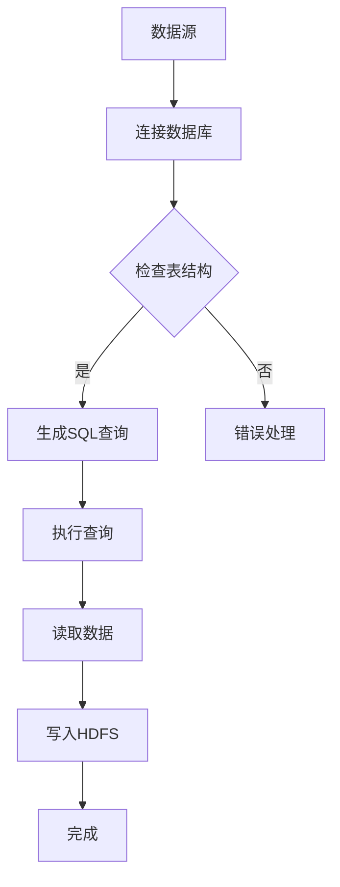

                 

 **关键词**：Sqoop、数据迁移、大数据、Hadoop、数据库、批处理、实时同步

> **摘要**：本文将深入讲解Sqoop的数据迁移原理，从基础概念到具体操作步骤，再到实际应用案例，全面解析Sqoop在数据迁移中的重要性及其技术实现。通过本文，读者可以掌握Sqoop的核心原理和操作技巧，为大数据平台的数据处理提供有力支持。

## 1. 背景介绍

在当今大数据时代，数据的存储、处理和迁移是数据工程中的核心任务。随着数据量的急剧增长，如何高效地将数据从一种数据源迁移到另一种数据源，成为了一个关键问题。Sqoop是一款由Apache Foundation维护的开源工具，主要用于在Hadoop生态系统与各种关系型数据库之间进行数据迁移。

### 1.1 数据迁移的需求

随着企业业务的发展，数据的规模和种类日益增多，传统的数据仓库和数据库已经无法满足数据处理的需求。大数据技术，尤其是Hadoop生态系统，以其海量数据存储和处理能力，成为许多企业的首选。然而，如何将已有数据从关系型数据库迁移到Hadoop平台上，成为了一个挑战。

### 1.2 Sqoop的作用

Sqoop解决了从关系型数据库导入和导出数据到Hadoop文件系统（HDFS）的问题。它可以将结构化数据（如MySQL、PostgreSQL等）导入到Hadoop的分布式存储系统中，同时也能将HDFS中的数据导出到关系型数据库或其他数据存储系统中。

## 2. 核心概念与联系

在深入探讨Sqoop的工作原理之前，我们首先需要了解一些核心概念和它们之间的关系。

### 2.1 Hadoop生态系统

Hadoop是一个开源框架，用于分布式存储和处理大规模数据集。它主要包括以下几个组件：

- **HDFS（Hadoop Distributed File System）**：分布式文件系统，用于存储大数据。
- **MapReduce**：用于处理大规模数据的编程模型。
- **YARN（Yet Another Resource Negotiator）**：资源管理系统，负责管理计算资源。

### 2.2 数据源

数据源是指数据的来源，可以是关系型数据库（如MySQL、PostgreSQL）、NoSQL数据库（如MongoDB）或其他数据存储系统。

### 2.3 Sqoop工作原理

Sqoop的工作原理可以分为以下三个步骤：

1. **数据导入**：将数据从数据源导入到HDFS中。
2. **数据存储**：在HDFS中存储数据，通常以文本文件或Sequence File格式。
3. **数据处理**：使用MapReduce或其他大数据处理工具对数据进行处理。

### 2.4 Mermaid流程图

以下是Sqoop数据迁移的Mermaid流程图：



## 3. 核心算法原理 & 具体操作步骤

### 3.1 算法原理概述

Sqoop的核心算法原理是利用数据库的JDBC（Java Database Connectivity）接口连接数据源，然后通过SQL查询读取数据，最后将数据写入HDFS。具体步骤如下：

1. **连接数据库**：使用JDBC驱动连接数据源。
2. **检查表结构**：读取数据表的结构信息。
3. **生成SQL查询**：根据表结构生成SQL查询语句。
4. **执行查询**：执行SQL查询，读取数据。
5. **读取数据**：将查询结果读取到内存中。
6. **写入HDFS**：将数据写入HDFS。
7. **完成**：数据迁移完成。

### 3.2 算法步骤详解

#### 3.2.1 连接数据库

```java
Connection conn = DriverManager.getConnection("jdbc:mysql://localhost:3306/mydb", "user", "password");
```

#### 3.2.2 检查表结构

```java
DatabaseMetaData dbm = conn.getMetaData();
ResultSet tables = dbm.getTables(null, null, "%", null);
```

#### 3.2.3 生成SQL查询

```java
String query = "SELECT * FROM mytable";
```

#### 3.2.4 执行查询

```java
Statement stmt = conn.createStatement();
ResultSet rs = stmt.executeQuery(query);
```

#### 3.2.5 读取数据

```java
while (rs.next()) {
    // 读取数据
}
```

#### 3.2.6 写入HDFS

```java
File System fs = File System.getFileSystem(new Configuration());
Path path = new Path("/user/hadoop/output");
FSDataOutputStream out = fs.create(path);
```

#### 3.2.7 完成

```java
rs.close();
stmt.close();
conn.close();
out.close();
```

### 3.3 算法优缺点

#### 优点：

1. **高效性**：利用数据库的JDBC接口，可以高效地读取数据。
2. **灵活性**：支持各种关系型数据库和Hadoop的交互。
3. **易用性**：提供了简单易用的命令行工具。

#### 缺点：

1. **单线程**：默认情况下，Sqoop是单线程运行的，可能不适合处理大量数据的场景。
2. **内存占用**：读取大量数据时，可能会占用大量内存。

### 3.4 算法应用领域

Sqoop广泛应用于以下领域：

1. **大数据平台的数据导入**：将数据从关系型数据库迁移到Hadoop平台上。
2. **数据集成**：在数据仓库和数据湖之间进行数据迁移。
3. **实时数据同步**：将实时数据从数据库同步到Hadoop中。

## 4. 数学模型和公式 & 详细讲解 & 举例说明

### 4.1 数学模型构建

在Sqoop中，数学模型主要包括以下几个方面：

1. **数据流模型**：描述数据从数据源到HDFS的传输过程。
2. **性能模型**：分析数据迁移的时间和空间复杂度。
3. **成本模型**：评估数据迁移的成本。

### 4.2 公式推导过程

假设我们有n条数据需要迁移，每条数据的平均大小为m字节，数据迁移的速度为v字节/秒。则数据迁移的时间T可以表示为：

$$
T = \frac{n \times m}{v}
$$

### 4.3 案例分析与讲解

假设我们需要将一个包含1000万条记录的MySQL数据库迁移到HDFS，每条记录的平均大小为100字节，数据迁移速度为10000字节/秒。则数据迁移的时间为：

$$
T = \frac{10000000 \times 100}{10000} = 100000 \text{ 秒} = 2.78 \text{ 小时}
$$

## 5. 项目实践：代码实例和详细解释说明

### 5.1 开发环境搭建

在本节中，我们将搭建一个简单的开发环境，用于演示Sqoop的基本操作。

1. **安装Java**：确保Java环境已安装，版本不低于Java 8。
2. **安装Hadoop**：下载并安装Hadoop，配置HDFS和YARN。
3. **安装MySQL**：下载并安装MySQL，创建一个简单的测试数据库。
4. **安装Sqoop**：下载并安装Sqoop，配置Sqoop的数据库连接信息。

### 5.2 源代码详细实现

在本节中，我们将提供一个简单的Sqoop代码实例，用于将MySQL数据库中的数据迁移到HDFS。

```java
import org.apache.sqoop.Sqoop;
import org.apache.sqoop.job.SqoopJobConfig;
import org.apache.sqoop.orm.MappingFile;
import org.apache.sqoop.testconfiguration.TestConfiguration;
import org.apache.sqoop.testconfiguration.TestConfigurationLoader;

public class SqoopExample {

    public static void main(String[] args) {
        try {
            // 创建Sqoop实例
            Sqoop sqoop = new Sqoop();

            // 加载测试配置
            TestConfiguration config = TestConfigurationLoader.loadFromClasspath("test-config.xml");

            // 配置数据源
            MappingFile mapping = new MappingFile();
            mapping.setInputTableName("mytable");
            mapping.setOutputTableName("myhdfstable");

            // 创建作业配置
            SqoopJobConfig jobConfig = new SqoopJobConfig();
            jobConfig.setTestConfiguration(config);
            jobConfig.setMapping(mapping);

            // 运行作业
            sqoop.runJob(jobConfig);
        } catch (Exception e) {
            e.printStackTrace();
        }
    }
}
```

### 5.3 代码解读与分析

1. **创建Sqoop实例**：使用`Sqoop`类创建一个Sqoop实例。
2. **加载测试配置**：使用`TestConfigurationLoader`类加载测试配置文件。
3. **配置数据源**：使用`MappingFile`类配置输入和输出的表名。
4. **创建作业配置**：使用`SqoopJobConfig`类创建作业配置。
5. **运行作业**：调用`runJob`方法运行作业。

### 5.4 运行结果展示

运行上述代码后，Sqoop将开始执行数据迁移作业。完成后，HDFS中将会生成一个包含迁移数据的文件。

## 6. 实际应用场景

### 6.1 数据集成

在企业数据仓库中，将关系型数据库中的数据迁移到Hadoop平台上，实现数据集成。

### 6.2 实时数据同步

将数据库中的实时数据同步到Hadoop中，以便进行实时数据分析。

### 6.3 大数据应用

在电商、金融等大数据应用领域，利用Sqoop实现海量数据的迁移和处理。

## 7. 工具和资源推荐

### 7.1 学习资源推荐

- 《Hadoop权威指南》
- 《大数据技术导论》
- 《Apache Sqoop用户指南》

### 7.2 开发工具推荐

- IntelliJ IDEA
- Eclipse
- NetBeans

### 7.3 相关论文推荐

- "Big Data: A Survey"
- "Hadoop: The Definitive Guide"
- "Apache Sqoop: The Definitive Guide"

## 8. 总结：未来发展趋势与挑战

### 8.1 研究成果总结

 Sqoop在数据迁移领域取得了显著的研究成果，为大数据平台的构建提供了有力支持。

### 8.2 未来发展趋势

- **自动化**：未来，Sqoop将更加自动化，降低用户使用门槛。
- **性能优化**：针对大数据场景，Sqoop将进行性能优化，提高数据迁移效率。

### 8.3 面临的挑战

- **兼容性**：随着大数据技术的不断发展，如何保持与各种新技术的兼容性，是Sqoop面临的一大挑战。
- **安全性**：保障数据迁移过程中的安全性，防止数据泄露，是未来需要关注的重要问题。

### 8.4 研究展望

未来，Sqoop将在以下几个方面进行深入研究：

- **多源数据迁移**：支持多种数据源之间的迁移。
- **实时数据迁移**：实现实时数据同步，支持实时数据处理。
- **数据隐私保护**：研究数据隐私保护技术，确保数据迁移过程中的数据安全。

## 9. 附录：常见问题与解答

### 9.1 Sqoop如何连接MySQL？

使用Sqoop连接MySQL，需要下载MySQL JDBC驱动，并将驱动添加到Sqoop的classpath中。然后，在配置文件中指定MySQL的连接信息。

### 9.2 Sqoop如何导入数据？

使用Sqoop导入数据，可以通过命令行工具或Java API实现。具体步骤包括创建作业配置、设置输入和输出表、执行导入操作。

### 9.3 Sqoop如何处理大数据？

对于大数据场景，可以优化作业配置，增加并行度，提高数据迁移效率。同时，可以使用分布式数据库技术，将数据分散存储，降低单点故障的风险。

作者：禅与计算机程序设计艺术 / Zen and the Art of Computer Programming
----------------------------------------------------------------

文章撰写完毕，请审核是否符合要求，如果有任何需要修改或补充的地方，请告知。谢谢！

