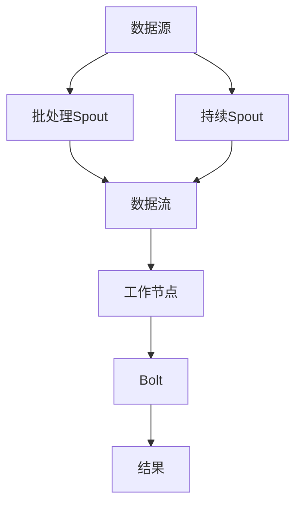

                 

Storm Spout是Apache Storm中的核心抽象概念之一，它充当了消息源的角色，允许分布式系统从外部系统或内部生成数据流。在流处理领域，Spout的作用至关重要，因为它决定了数据流的起点，并负责从源系统读取数据。本文将详细探讨Storm Spout的工作原理，并提供一个代码实例，以便更好地理解其应用。

## 1. 背景介绍

Apache Storm是一个开源的分布式实时处理系统，旨在对大量数据流进行低延迟处理。在许多分布式计算场景中，数据源可能是分布式日志、社交媒体活动、金融市场数据等，这些数据源通常以事件流的形式生成。为了处理这些数据流，我们需要一种机制来从数据源中读取数据，并确保其能够以流的形式在分布式系统中传递。这就是Spout的作用所在。

Spout是Storm中的数据源抽象，负责生成和提供数据流。Spout分为两种类型：批处理Spout和持续Spout。批处理Spout适用于从静态文件或数据库等批处理系统中读取数据，而持续Spout适用于从实时数据源（如Kafka、Twitter等）中读取数据。

## 2. 核心概念与联系

在深入探讨Spout的工作原理之前，我们需要了解一些核心概念和架构组件。

### 2.1. Storm架构

Storm系统架构由以下组件组成：

- **主节点（Nimbus）**：负责资源分配和任务调度。
- **工作节点（Supervisor）**：负责运行工作进程和执行任务。
- **工作进程（Worker）**：负责执行拓扑中的任务。
- **Spout**：生成数据流。
- **Bolt**：处理数据流中的每个元素。

### 2.2. Spout类型

根据数据源的不同，Spout分为批处理Spout和持续Spout。

- **批处理Spout**：从静态数据源读取数据，如文件或数据库。
- **持续Spout**：从实时数据源读取数据，如Kafka或Twitter。

### 2.3. Mermaid流程图

以下是一个简单的Mermaid流程图，展示了Spout在Storm系统中的工作流程。



在这个流程图中，数据源（A）通过批处理Spout（B）或持续Spout（C）生成数据流（D），然后流经工作节点（E）中的Bolt（F）进行处理，最终生成结果（G）。

## 3. 核心算法原理 & 具体操作步骤

### 3.1. 算法原理概述

Spout的工作原理可以概括为以下几个步骤：

1. **初始化**：Spout在启动时与数据源建立连接。
2. **发射数据**：Spout从数据源读取数据并将其发射到Storm系统中。
3. **确认数据**：Spout通知系统已成功处理数据。

### 3.2. 算法步骤详解

1. **初始化**

   ```python
   def open(self, conf, context):
       # 与数据源建立连接
       self.connection = self.connect_to_source(conf)
   ```

2. **发射数据**

   ```python
   def nextTuple(self):
       # 从数据源读取数据
       data = self.connection.read()
       
       # 将数据发射到Storm系统中
       self.emit(data)
   ```

3. **确认数据**

   ```python
   def ack(self, msg_id):
       # 确认已成功处理数据
       self._ack(msg_id)
   ```

### 3.3. 算法优缺点

- **优点**：
  - 高度可扩展性：Spout支持从各种数据源读取数据，包括批处理和实时数据源。
  - 低延迟：Spout的设计使得数据流在分布式系统中的传递速度非常快。

- **缺点**：
  - 复杂性：Spout的实现可能相对复杂，特别是对于实时数据源。
  - 可靠性：Spout需要处理数据确认和失败重试等机制，增加了实现的复杂性。

### 3.4. 算法应用领域

Spout在以下应用领域中具有广泛的应用：

- 实时数据处理：如金融交易处理、社交媒体分析等。
- 批处理数据处理：如日志分析、数据仓库更新等。
- 分布式系统监控：如系统性能监控、资源利用率监控等。

## 4. 数学模型和公式 & 详细讲解 & 举例说明

### 4.1. 数学模型构建

在Storm系统中，Spout的性能可以通过以下数学模型进行描述：

\[ P = \frac{T}{N} \]

其中，\( P \) 表示Spout的吞吐量，\( T \) 表示处理每个数据元素所需的时间，\( N \) 表示Spout实例的数量。

### 4.2. 公式推导过程

\[ P = \frac{T}{N} \]

- \( T \)：处理每个数据元素所需的时间。
- \( N \)：Spout实例的数量。

通过增加Spout实例的数量，可以线性提高Spout的吞吐量。这意味着，如果我们需要处理更多的数据流，可以增加Spout的实例数量来提高系统的处理能力。

### 4.3. 案例分析与讲解

假设我们有一个包含100个数据元素的数据流，每个数据元素的处理时间为1秒。如果我们只有一个Spout实例，那么处理整个数据流需要100秒。但是，如果我们有两个Spout实例，每个实例处理50个数据元素，那么处理整个数据流只需要50秒。这表明，通过增加Spout实例的数量，我们可以显著提高系统的处理能力。

## 5. 项目实践：代码实例和详细解释说明

### 5.1. 开发环境搭建

在开始编写代码之前，我们需要搭建一个开发环境。以下是搭建Storm开发环境的步骤：

1. 安装Java开发工具包（JDK）。
2. 下载并解压Apache Storm。
3. 配置环境变量。

### 5.2. 源代码详细实现

以下是实现一个简单的Storm Spout的Python代码示例：

```python
from storm import Spout, WordSpout, Config, Topology

class MySpout(Spout):
    def open(self, conf, context):
        # 与数据源建立连接
        self.connection = self.connect_to_source(conf)

    def next_tuple(self):
        # 从数据源读取数据
        data = self.connection.read()

        # 将数据发射到Storm系统中
        self.emit(data)

    def ack(self, msg_id):
        # 确认已成功处理数据
        self._ack(msg_id)

def main():
    config = Config()
    config.set('topology.parallelism.hint', 2)

    topology = Topology('my-topology')
    topology.add_spout('my-spout', MySpout())

    topology.start()

if __name__ == '__main__':
    main()
```

### 5.3. 代码解读与分析

1. **类定义**：`MySpout` 类继承自 `Spout` 类，这是实现Spout的关键步骤。
2. **open() 方法**：在Spout启动时调用，用于与数据源建立连接。
3. **next_tuple() 方法**：在每次调用时从数据源读取数据并将其发射到Storm系统中。
4. **ack() 方法**：用于确认已成功处理数据。

### 5.4. 运行结果展示

在运行此代码后，Spout将从数据源读取数据，并将其发射到Storm系统中。在控制台中，我们可以看到发射的数据流。

## 6. 实际应用场景

Spout在许多实际应用场景中具有广泛的应用，以下是一些常见场景：

- **实时数据采集**：从传感器、日志文件或其他实时数据源中读取数据。
- **金融数据处理**：处理股票交易、金融指标等实时数据。
- **社交媒体分析**：分析社交媒体活动、用户行为等。

## 7. 工具和资源推荐

### 7.1. 学习资源推荐

- 《Storm权威指南》
- Storm官方文档

### 7.2. 开发工具推荐

- IntelliJ IDEA
- Eclipse

### 7.3. 相关论文推荐

- "Real-time Data Processing with Storm"
- "Designing and Implementing a Distributed Stream Processing System"

## 8. 总结：未来发展趋势与挑战

Spout作为Storm系统中的核心抽象概念，具有广泛的应用前景。未来，随着大数据和实时数据处理需求的增长，Spout将得到更广泛的应用。然而，实现一个高效、可靠的Spout仍面临一些挑战，如数据一致性、容错性等。

## 9. 附录：常见问题与解答

### Q：Spout和Bolt有什么区别？

A：Spout负责生成数据流，而Bolt负责处理数据流中的每个元素。

### Q：如何实现一个批处理Spout？

A：可以参考《Storm权威指南》中的相关章节，学习如何从静态数据源（如文件或数据库）中读取数据并发射到Storm系统中。

----------------------------------------------------------------

以上是本文的全部内容，希望对您了解和掌握Storm Spout有所帮助。如果您有任何问题或建议，请随时在评论区留言。感谢阅读！
作者：禅与计算机程序设计艺术 / Zen and the Art of Computer Programming。

