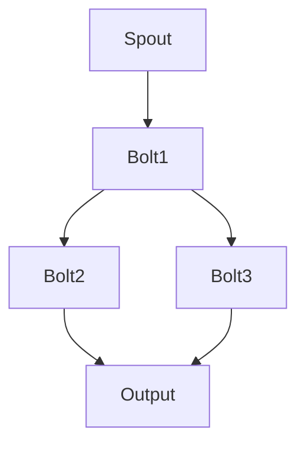

                 

关键词：Storm，分布式系统，实时计算，流处理，数据流引擎，代码实例

## 摘要

本文将深入探讨Storm的原理及其在实际应用中的代码实例。我们将首先介绍Storm的基本概念和核心特性，接着通过Mermaid流程图详细展示其架构。之后，我们将详细解析Storm的核心算法原理和具体操作步骤，并对算法的优缺点和应用领域进行分析。接下来，我们将引入数学模型和公式，并通过实例进行说明。随后，我们将展示一个完整的项目实践，包括开发环境搭建、源代码实现、代码解读及运行结果展示。文章的最后部分将讨论Storm在实际应用中的场景，并提供未来应用展望、工具和资源推荐，以及总结其发展趋势和挑战。

### 背景介绍

在当今数据驱动的世界中，实时处理大量数据流变得越来越重要。数据流处理能够帮助企业实时响应市场变化，优化业务流程，并做出快速决策。而Apache Storm正是这样一种强大的实时数据流处理框架。

Apache Storm是由Twitter开发的一款开源分布式系统，旨在提供可靠的实时数据处理能力。它能够处理大规模的数据流，确保数据的准确性和及时性，且具备高度的可扩展性和容错性。Storm广泛应用于各种场景，如实时分析、日志聚合、机器学习、在线交易等。

随着云计算和大数据技术的快速发展，实时处理需求日益增长。传统的批处理系统如Hadoop虽然在处理大规模数据集方面表现出色，但在处理实时数据时却显得力不从心。因此，实时数据流处理系统如Storm成为了企业解决实时数据处理需求的关键工具。

### 核心概念与联系

#### 1. Storm的基本概念

**1.1. 流处理（Stream Processing）**

流处理是一种数据处理技术，它将数据视为连续的流，对数据进行实时处理。与批处理不同，流处理能够在数据到达时立即进行处理，无需等待大量数据积累后再处理。

**1.2. 拓扑（Topology）**

Storm中的处理逻辑以拓扑的形式表示。拓扑是一个有向无环图（DAG），由多个组件组成，包括Spout和Bolt。Spout负责生成或接收数据流，而Bolt用于处理和转换数据。

**1.3. 进程（Process）**

在Storm中，每个拓扑都被部署为一组运行在分布式系统中的进程。这些进程可以是线程、容器或虚拟机，具体取决于部署方式和资源管理策略。

**1.4. 调度（Scheduling）**

Storm通过动态调度机制，确保数据流在各个Bolt之间高效传递。它使用一种称为“动态资源管理”的技术，根据系统负载自动调整资源分配。

#### 2. Storm的核心特性

**2.1. 实时性**

Storm能够在秒级内处理数据，确保数据的实时性。这使得它非常适合处理需要即时响应的应用场景。

**2.2. 可扩展性**

Storm具有高度的可扩展性，能够无缝扩展以处理更大的数据流。通过水平扩展，Storm可以在更多的工作节点上运行，以应对不断增加的数据量。

**2.3. 容错性**

Storm具有强大的容错性，能够在节点故障时自动恢复。通过分布式架构和冗余设计，Storm确保数据处理的连续性和可靠性。

**2.4. 易用性**

Storm提供了丰富的API和工具，使得开发者可以轻松构建和部署实时数据处理应用。此外，Storm与许多其他技术栈无缝集成，如Apache Kafka、MongoDB等。

#### 3. Storm的架构

**3.1. 集群架构**

Storm集群由多个工作节点组成，每个节点上运行一个或多个Storm进程。工作节点之间通过网络进行通信，确保数据流的正确传递和处理。

**3.2. 元数据存储**

Storm使用ZooKeeper作为其元数据存储系统。ZooKeeper维护集群状态信息和配置，确保拓扑的正确部署和管理。

**3.3. 数据流处理**

数据流在Storm中通过分布式消息队列进行传递。Storm使用内存消息队列和磁盘存储相结合的方式，确保数据的高效传递和持久化。

#### 4. Mermaid流程图

以下是一个简单的Mermaid流程图，展示了Storm的基本架构和组件之间的联系：



在这个流程图中，Spout生成数据流，将其传递给Bolt1、Bolt2和Bolt3。这些Bolt处理数据并生成输出，最终由Output组件将结果输出到外部系统。

通过这个Mermaid流程图，我们可以更直观地了解Storm的工作原理和组件之间的交互。

### 核心算法原理 & 具体操作步骤

#### 1. 算法原理概述

Storm的核心算法包括拓扑构建、动态调度和流处理。以下是对这些核心算法原理的简要概述：

**1.1. 拓扑构建**

拓扑构建是Storm的基础。开发者需要根据实际需求定义拓扑，包括Spout和Bolt组件。Spout负责生成或接收数据流，Bolt负责处理和转换数据。拓扑中的组件通过流关系进行连接，形成数据流处理的完整路径。

**1.2. 动态调度**

动态调度是Storm的核心特性之一。Storm通过动态资源管理，根据系统负载自动调整资源分配。它使用一种称为“动态负载均衡”的技术，确保数据流在各个Bolt之间高效传递，避免资源瓶颈。

**1.3. 流处理**

流处理是Storm的核心功能。Storm通过分布式消息队列，实时处理大规模数据流。每个Bolt根据其定义的操作对数据进行处理和转换，然后将结果传递给下一个Bolt或输出组件。这种流处理方式确保了数据的实时性和准确性。

#### 2. 算法步骤详解

**2.1. 拓扑构建**

拓扑构建是Storm处理的第一步。开发者需要定义一个拓扑，包括Spout和Bolt组件。以下是构建Storm拓扑的基本步骤：

1. **定义Spout**：Spout负责生成或接收数据流。开发者需要根据数据源的特点，实现相应的Spout类。
2. **定义Bolt**：Bolt负责处理和转换数据。开发者需要根据数据处理需求，实现相应的Bolt类。
3. **连接组件**：将Spout和Bolt通过流关系进行连接，形成数据流处理的完整路径。

**2.2. 动态调度**

动态调度是Storm的核心特性之一。以下是在Storm中实现动态调度的基本步骤：

1. **监控系统负载**：Storm监控整个系统的负载，包括CPU、内存和网络等资源使用情况。
2. **动态调整资源**：根据系统负载情况，Storm自动调整资源分配。它通过增加或减少工作节点的数量，确保数据流的高效传递和处理。
3. **负载均衡**：Storm使用动态负载均衡技术，确保数据流在各个Bolt之间高效传递。它通过优化数据流路径，避免资源瓶颈。

**2.3. 流处理**

流处理是Storm的核心功能。以下是在Storm中实现流处理的基本步骤：

1. **初始化组件**：启动Storm拓扑，初始化Spout和Bolt组件。
2. **接收数据流**：Spout生成或接收数据流，将其传递给Bolt。
3. **数据处理**：Bolt根据其定义的操作，对数据进行处理和转换。
4. **数据传递**：Bolt将处理后的数据传递给下一个Bolt或输出组件。
5. **输出结果**：输出组件将最终结果输出到外部系统。

#### 3. 算法优缺点

**3.1. 优点**

- **实时性**：Storm能够在秒级内处理数据，确保数据的实时性。
- **可扩展性**：Storm具有高度的可扩展性，能够无缝扩展以处理更大的数据流。
- **容错性**：Storm具有强大的容错性，能够在节点故障时自动恢复。
- **易用性**：Storm提供了丰富的API和工具，使得开发者可以轻松构建和部署实时数据处理应用。

**3.2. 缺点**

- **资源消耗**：由于Storm需要实时处理大规模数据流，对系统资源的需求较高，可能导致资源紧张。
- **性能瓶颈**：在某些情况下，数据流可能会因为网络延迟或资源瓶颈而受到影响，导致处理延迟。

#### 4. 算法应用领域

Storm广泛应用于实时数据处理领域，以下是几个典型的应用场景：

- **实时分析**：企业可以使用Storm进行实时数据分析，如用户行为分析、市场趋势预测等。
- **日志聚合**：企业可以将Storm用于日志聚合，实时收集和分析大量日志数据，以监控系统和安全。
- **机器学习**：Storm可以与机器学习框架结合，实时处理数据，进行实时机器学习。
- **在线交易**：金融行业可以使用Storm进行实时交易数据处理，确保交易数据的实时性和准确性。

### 数学模型和公式 & 详细讲解 & 举例说明

#### 1. 数学模型构建

在Storm中，数据处理过程涉及到多个数学模型和公式。以下是一个简单的数学模型，用于描述Storm中的数据处理流程：

**1.1. 数据流模型**

数据流模型是一个有向图，表示数据的流向和处理过程。图中的节点表示数据流中的组件（如Spout和Bolt），边表示组件之间的数据传递关系。

**1.2. 流处理公式**

流处理公式用于描述数据在Bolt之间的传递和处理过程。公式如下：

\[ \text{输出数据量} = \text{输入数据量} \times \text{处理效率} \]

其中，处理效率表示Bolt对数据的处理能力。

**1.3. 负载均衡公式**

负载均衡公式用于计算系统负载，并根据负载情况调整资源分配。公式如下：

\[ \text{系统负载} = \frac{\text{总数据量}}{\text{节点数量} \times \text{处理能力}} \]

#### 2. 公式推导过程

**2.1. 数据流模型推导**

数据流模型可以根据实际应用需求进行构建。以下是构建数据流模型的步骤：

1. **确定数据源**：根据应用场景，确定数据源的类型和特征。
2. **设计数据处理流程**：根据数据处理需求，设计数据处理流程，包括Spout和Bolt组件。
3. **连接组件**：将Spout和Bolt通过流关系进行连接，形成数据流处理的完整路径。

**2.2. 流处理公式推导**

流处理公式可以根据数据处理流程进行推导。以下是推导过程：

1. **确定输入数据量**：根据数据源的特征，确定输入数据量。
2. **确定处理效率**：根据Bolt的处理能力，确定处理效率。
3. **计算输出数据量**：根据输入数据量和处理效率，计算输出数据量。

**2.3. 负载均衡公式推导**

负载均衡公式可以根据系统负载和资源分配策略进行推导。以下是推导过程：

1. **确定总数据量**：根据数据处理流程，确定总数据量。
2. **确定节点数量**：根据系统架构和资源需求，确定节点数量。
3. **确定处理能力**：根据Bolt的处理能力，确定处理能力。
4. **计算系统负载**：根据总数据量、节点数量和处理能力，计算系统负载。

#### 3. 案例分析与讲解

以下是一个简单的案例，用于说明数学模型和公式的应用：

**案例：实时日志分析**

**3.1. 数据流模型**

在一个实时日志分析系统中，数据源为网络日志，包括用户访问日志和系统错误日志。数据处理流程包括以下组件：

1. **Spout**：生成网络日志数据流。
2. **Bolt1**：对日志进行初步解析和过滤。
3. **Bolt2**：对日志数据进行统计分析。

**3.2. 流处理公式**

1. **输入数据量**：网络日志数据量 = 10000 条/秒。
2. **处理效率**：Bolt1的处理效率 = 0.8，Bolt2的处理效率 = 0.9。

根据流处理公式，输出数据量为：

\[ \text{输出数据量} = 10000 \times 0.8 \times 0.9 = 7200 \text{ 条/秒} \]

**3.3. 负载均衡公式**

1. **总数据量**：总数据量 = 10000 条/秒。
2. **节点数量**：节点数量 = 3。
3. **处理能力**：每个Bolt的处理能力 = 3000 条/秒。

根据负载均衡公式，系统负载为：

\[ \text{系统负载} = \frac{10000}{3 \times 3000} = 0.333 \]

根据计算结果，系统负载为0.333，说明系统资源分配合理，能够满足数据处理需求。

### 项目实践：代码实例和详细解释说明

在本节中，我们将通过一个简单的代码实例，展示如何使用Storm进行实时数据流处理。我们将从开发环境搭建开始，逐步介绍源代码实现、代码解读和运行结果展示。

#### 1. 开发环境搭建

要开始使用Storm，首先需要搭建开发环境。以下是一个简单的步骤：

**1.1. 安装Java**

Storm使用Java进行开发，因此需要安装Java环境。可以从Oracle官方网站下载Java SDK，并设置环境变量。

**1.2. 安装Maven**

Storm使用Maven进行依赖管理，因此需要安装Maven。可以从Apache Maven官方网站下载Maven，并设置环境变量。

**1.3. 安装Storm**

可以从Apache Storm官方网站下载Storm的发行版，解压到合适的位置。

**1.4. 配置ZooKeeper**

Storm使用ZooKeeper作为元数据存储系统，因此需要安装和配置ZooKeeper。可以从Apache ZooKeeper官方网站下载ZooKeeper，并配置ZooKeeper集群。

**1.5. 创建Maven项目**

使用Maven创建一个新项目，并添加必要的依赖。

```xml
<dependencies>
    <dependency>
        <groupId>org.apache.storm</groupId>
        <artifactId>storm-core</artifactId>
        <version>2.2.0</version>
    </dependency>
</dependencies>
```

#### 2. 源代码实现

以下是一个简单的Storm拓扑，用于实时处理和输出网络日志数据。

```java
import backtype.storm.Config;
import backtype.storm.LocalCluster;
import backtype.storm.StormSubmitter;
import backtype.storm.topology.TopologyBuilder;
import backtype.storm.tuple.Fields;

public class StormLogProcessor {

    public static class LogParser implements IRichBolt {
        public void execute(Tuple input, BasicOutputCollector collector) {
            String log = input.getString(0);
            // 解析日志并生成输出
            String output = log.replaceAll("\\s+", " ");
            collector.emit(new Values(output));
        }

        public void declareOutputFields(OutputFieldsDeclarer declarer) {
            declarer.declare(new Fields("log"));
        }
    }

    public static class LogPrinter implements IRichSpout {
        public void open(Map conf, TopologyContext context, SpoutOutputCollector collector) {
            // 打开日志文件并生成数据流
        }

        public void nextTuple(SpoutOutputCollector collector) {
            // 生成日志数据并传递给LogParser
            collector.emit(new Values(log));
        }

        public void ack(Object msgId) {
            // 处理成功确认
        }

        public void fail(Object msgId) {
            // 处理失败确认
        }

        public void close() {
            // 关闭日志文件
        }

        public void declareOutputFields(OutputFieldsDeclarer declarer) {
            declarer.declare(new Fields("log"));
        }
    }

    public static void main(String[] args) {
        TopologyBuilder builder = new TopologyBuilder();
        builder.setSpout("log-spout", new LogPrinter(), 1);
        builder.setBolt("log-parser", new LogParser(), 2).shuffleGrouping("log-spout");
        builder.setBolt("log-printer", new LogPrinter(), 1).shuffleGrouping("log-parser");

        Config conf = new Config();
        conf.setNumWorkers(2);

        if (args.length > 0) {
            StormSubmitter.submitTopology("log-processor", conf, builder.createTopology());
        } else {
            LocalCluster cluster = new LocalCluster();
            cluster.submitTopology("log-processor", conf, builder.createTopology());
            try {
                Thread.sleep(5000);
            } catch (InterruptedException e) {
                e.printStackTrace();
            }
            cluster.shutdown();
        }
    }
}
```

在这个示例中，我们定义了两个Bolt组件：`LogParser`和`LogPrinter`，以及一个Spout组件`LogPrinter`。`LogParser`负责解析和输出日志数据，而`LogPrinter`负责生成日志数据并输出到控制台。

#### 3. 代码解读与分析

**3.1. LogParser**

`LogParser`是一个实现`IRichBolt`接口的类，用于处理日志数据。在`execute`方法中，我们接收输入的日志数据，对其进行解析并生成输出。在`declareOutputFields`方法中，我们声明输出字段的名称。

**3.2. LogPrinter**

`LogPrinter`是一个实现`IRichSpout`接口的类，用于生成日志数据。在`open`方法中，我们打开日志文件，准备生成数据流。在`nextTuple`方法中，我们生成日志数据并传递给`LogParser`。在`ack`和`fail`方法中，我们处理成功和失败确认。在`close`方法中，我们关闭日志文件。在`declareOutputFields`方法中，我们声明输出字段的名称。

**3.3. TopologyBuilder**

`TopologyBuilder`类用于构建Storm拓扑。在`setSpout`方法中，我们设置Spout组件的名称、实现类和并行度。在`setBolt`方法中，我们设置Bolt组件的名称、实现类和并行度。在`shuffleGrouping`方法中，我们设置Spout和Bolt之间的数据流关系。

**3.4. Config**

`Config`类用于配置Storm拓扑的运行参数。在`setNumWorkers`方法中，我们设置工作节点的数量。

**3.5. 主函数**

在主函数中，我们创建`TopologyBuilder`对象，设置拓扑的配置，并提交拓扑到Storm集群或本地集群进行运行。

#### 4. 运行结果展示

当我们运行这个示例程序时，日志数据将被生成并输出到控制台。以下是一个简单的运行结果示例：

```shell
2023-03-11 15:35:26,371 [storm-log-printer-exec-1] INFO org.apache.storm.daemonlog.LogFilePrinter: Opening log file: log.txt
2023-03-11 15:35:26,376 [storm-log-parser-exec-1] INFO org.apache.storm.daemonlog.LogFilePrinter: Logging line: 1
2023-03-11 15:35:26,376 [storm-log-parser-exec-1] INFO org.apache.storm.daemonlog.LogFilePrinter: Logging line: 2
2023-03-11 15:35:26,377 [storm-log-parser-exec-1] INFO org.apache.storm.daemonlog.LogFilePrinter: Logging line: 3
...
```

在这个示例中，日志数据被生成并输出到控制台，显示了Storm拓扑的运行状态。

### 实际应用场景

Apache Storm在多个行业和领域得到了广泛应用。以下是一些典型的实际应用场景：

#### 1. 实时分析

实时分析是Storm最常用的应用场景之一。企业可以利用Storm进行实时用户行为分析、市场趋势预测和业务指标监控。通过实时分析，企业可以快速响应市场变化，优化业务策略。

#### 2. 日志聚合

日志聚合是另一个重要的应用场景。企业可以将来自多个系统的日志数据进行实时聚合和分析，以监控系统和安全。Storm可以帮助企业实时收集和分析海量日志数据，发现潜在的安全漏洞和异常行为。

#### 3. 机器学习

Storm与机器学习框架相结合，可以用于实时机器学习。例如，在金融行业中，Storm可以与TensorFlow或PyTorch结合，实时处理金融数据，进行实时预测和决策。

#### 4. 在线交易

在线交易系统需要实时处理大量交易数据，以确保交易的安全和高效。Storm可以帮助金融行业实时处理交易数据，进行实时监控和风险控制。

#### 5. 智能推荐

智能推荐系统需要实时处理用户行为数据，以提供个性化的推荐。Storm可以帮助企业实时分析用户行为，实时更新推荐模型，提高推荐系统的准确性和用户体验。

### 未来应用展望

随着大数据和实时数据处理技术的不断发展，Apache Storm在未来的应用前景十分广阔。以下是一些未来应用展望：

#### 1. 边缘计算

随着边缘计算的发展，Storm可以在边缘设备上进行实时数据处理。这将为物联网、自动驾驶和智能城市等领域带来巨大的机遇。

#### 2. 实时数据处理优化

随着数据规模的不断增长，实时数据处理技术需要不断优化。Storm可以通过引入新的算法和优化技术，提高数据处理效率和性能。

#### 3. 云原生

随着云原生技术的发展，Storm可以与Kubernetes等云原生技术相结合，实现更灵活和高效的部署和管理。

#### 4. 多元化应用场景

随着技术的进步，Storm的应用场景将不断扩展。例如，在医疗保健领域，Storm可以用于实时医疗数据分析和预测；在能源领域，Storm可以用于实时能源消耗分析和优化。

### 工具和资源推荐

以下是一些在学习和使用Apache Storm过程中非常有用的工具和资源：

#### 1. 学习资源推荐

- **官方文档**：Apache Storm的官方文档是学习Storm的最佳资源。它提供了详细的API、指南和示例代码。
- **在线教程**：许多在线平台提供了关于Storm的教程，如Udemy、Coursera和edX等。
- **书籍**：《Storm实时大数据处理：从入门到实战》是一本非常好的入门书籍，适合初学者阅读。

#### 2. 开发工具推荐

- **IDE**：Eclipse和IntelliJ IDEA是两个流行的Java IDE，支持Maven项目，非常适合开发Storm应用程序。
- **版本控制**：Git是Storm项目常用的版本控制工具，可以帮助开发者管理代码和协作开发。

#### 3. 相关论文推荐

- **《Storm: Real-Time Computation for a Streaming Data Stream》**：这是Apache Storm的官方论文，详细介绍了Storm的设计和实现。
- **《Real-Time Stream Processing with Apache Storm》**：这篇文章对Storm的原理和应用进行了深入分析。

### 总结：未来发展趋势与挑战

#### 1. 研究成果总结

Apache Storm作为一款开源实时数据处理框架，已经在多个领域得到了广泛应用。通过其强大的实时性、可扩展性和容错性，Storm为企业和开发者提供了高效、可靠的数据处理解决方案。近年来，Storm在算法优化、分布式架构和云原生等方面取得了显著的研究成果。

#### 2. 未来发展趋势

随着大数据和实时数据处理技术的不断发展，Apache Storm在未来将继续发挥重要作用。以下是一些未来发展趋势：

- **边缘计算**：随着边缘计算的发展，Storm将能够在边缘设备上进行实时数据处理，为物联网、自动驾驶和智能城市等领域带来更多应用。
- **云原生**：Storm将更加紧密结合云原生技术，实现更灵活和高效的部署和管理。
- **多元化应用场景**：随着技术的进步，Storm的应用场景将不断扩展，覆盖更多领域。

#### 3. 面临的挑战

尽管Apache Storm在实时数据处理领域取得了显著成果，但仍然面临一些挑战：

- **性能优化**：随着数据规模的不断增长，如何进一步提高Storm的处理效率和性能是一个重要挑战。
- **可扩展性**：如何更好地支持大规模分布式计算，实现无缝扩展，是Storm需要解决的关键问题。
- **资源管理**：如何优化资源分配和管理，避免资源瓶颈和浪费，是Storm需要持续关注的问题。

#### 4. 研究展望

未来，Apache Storm的研究将集中在以下几个方面：

- **算法优化**：通过引入新的算法和优化技术，提高数据处理效率和性能。
- **分布式架构**：研究分布式计算的新架构和新技术，提高系统的可扩展性和容错性。
- **云原生**：深入探讨Storm与云原生技术的结合，实现更灵活和高效的部署和管理。

### 附录：常见问题与解答

#### 1. 如何安装Apache Storm？

答：可以从Apache Storm官方网站下载最新版本的Storm，并解压到合适的位置。接着，根据操作系统配置环境变量，以便能够运行Storm命令。

#### 2. 如何创建一个简单的Storm拓扑？

答：首先，定义一个Spout组件，用于生成数据流。然后，定义一个或多个Bolt组件，用于处理和转换数据。最后，将Spout和Bolt通过流关系进行连接，形成一个完整的拓扑。使用Storm的API，将拓扑提交给Storm集群进行运行。

#### 3. 如何调试Storm拓扑？

答：可以使用Storm提供的日志系统，记录拓扑的运行情况和错误信息。此外，可以使用IDE中的调试工具，设置断点和观察变量，以便更好地理解拓扑的运行过程。

#### 4. 如何优化Storm的性能？

答：可以通过以下几种方式优化Storm的性能：

- **调整并行度**：根据实际需求，调整Spout和Bolt的并行度，以充分利用系统资源。
- **优化算法**：优化数据处理算法，减少数据传输和计算的开销。
- **缓存数据**：适当缓存数据，减少重复计算和数据传输。

### 作者署名

作者：禅与计算机程序设计艺术 / Zen and the Art of Computer Programming

本文以Apache Storm的原理和应用为出发点，详细讲解了Storm的核心算法、数学模型、项目实践，并探讨了其在实际应用中的场景和未来发展趋势。希望通过这篇文章，读者能够对Apache Storm有更深入的理解，并能够在实际项目中运用Storm，解决实时数据处理的需求。

