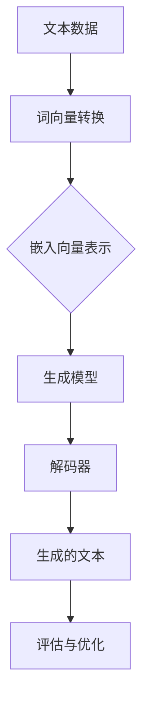

                 

关键词：文本生成，自然语言处理，机器学习，深度学习，生成模型，变分自编码器，循环神经网络，预训练语言模型，BERT，GPT，模型评估，应用场景

## 摘要

文本生成是自然语言处理领域的一个重要研究方向，旨在利用计算机程序生成有意义的文本。本文将详细探讨文本生成的原理，包括核心概念、算法原理、数学模型和具体实现。通过代码实例，我们将展示如何使用常见的文本生成模型如变分自编码器（VAE）、循环神经网络（RNN）和预训练语言模型（如BERT和GPT）进行文本生成。最后，我们将讨论文本生成的实际应用场景和未来展望。

## 1. 背景介绍

自然语言处理（NLP）是计算机科学和人工智能领域的核心研究方向之一，其目标是使计算机能够理解和处理人类语言。文本生成作为NLP的一个重要分支，旨在自动生成人类可读的文本。这种技术有着广泛的应用，如自动写作、机器翻译、对话系统、内容推荐等。

随着机器学习和深度学习的发展，文本生成技术取得了显著的进展。早期的文本生成方法主要基于规则和模板匹配，如句法分析、词汇替换等。这些方法在处理简单、规则化的文本时表现良好，但在处理复杂、多样化的文本时存在很大局限性。

近年来，生成模型如变分自编码器（VAE）、循环神经网络（RNN）和预训练语言模型（如BERT和GPT）等在文本生成领域取得了突破性进展。这些模型通过学习大量的文本数据，能够生成高质量、多样化的文本。本文将重点介绍这些生成模型的原理和实现。

### 1.1 文本生成技术的应用场景

文本生成技术在许多实际场景中都有广泛的应用，以下是一些典型的应用场景：

1. **自动写作**：利用文本生成技术自动生成新闻报道、文章摘要、博客等。
2. **机器翻译**：将一种语言的文本自动翻译成另一种语言。
3. **对话系统**：在聊天机器人、虚拟助手等场景中自动生成对话内容。
4. **内容推荐**：根据用户的兴趣和偏好自动生成个性化内容推荐。
5. **教育**：自动生成教学材料、课程大纲、练习题等。

### 1.2 文本生成的研究意义

文本生成技术不仅在学术研究中具有重要意义，也在实际应用中带来了巨大的价值。以下是文本生成研究的一些重要意义：

1. **提高工作效率**：通过自动生成文本，可以节省人工写作时间，提高工作效率。
2. **个性化服务**：根据用户的需求和偏好自动生成个性化内容，提供更好的用户体验。
3. **文化交流**：跨语言文本生成使得不同语言的用户能够更容易地进行交流。
4. **辅助创作**：文本生成技术可以作为创意写作的工具，辅助人类创作者生成新的文本。

## 2. 核心概念与联系

在深入探讨文本生成的算法和实现之前，我们需要了解一些核心概念和它们之间的联系。以下是一个Mermaid流程图，展示了文本生成的一些关键概念和它们之间的关系。



### 2.1 文本数据

文本数据是文本生成的基础。这些数据可以是互联网上的大量文本、书籍、新闻文章等。为了训练生成模型，我们需要将这些文本数据转换为适合模型处理的格式。通常，我们会将文本分解为单词或字符，并使用词向量（word embeddings）或字符向量（character embeddings）表示它们。

### 2.2 词向量转换

词向量是将文本数据转换为数值表示的一种方法。常见的词向量模型有Word2Vec、GloVe等。这些模型通过学习文本数据中的词语共现关系，将每个单词映射为一个高维向量。词向量不仅保留了单词的语义信息，还有助于提高生成模型的性能。

### 2.3 嵌入向量表示

嵌入向量表示是将文本数据转换为数值向量的过程。词向量和字符向量都是嵌入向量的一种形式。这些向量代表了文本数据中的每个单词或字符，为后续的生成模型提供了输入。

### 2.4 生成模型

生成模型是文本生成技术的核心。这些模型通过学习大量文本数据，能够生成新的、有意义的文本。常见的生成模型有变分自编码器（VAE）、循环神经网络（RNN）和预训练语言模型（如BERT和GPT）。

### 2.5 解码器

解码器是生成模型中的一个关键组件。它将嵌入向量转换为生成的文本。在训练过程中，解码器会尝试生成与输入数据相似的文本。通过不断优化解码器的参数，生成模型能够生成越来越高质量的文本。

### 2.6 生成的文本

生成的文本是文本生成技术的最终产物。这些文本可以用于各种应用场景，如自动写作、机器翻译和对话系统等。

### 2.7 评估与优化

评估与优化是文本生成技术中的重要环节。通过评估生成的文本质量，我们可以判断生成模型的性能。常见的评估指标有词汇重叠率、文本流畅度和语义一致性等。基于评估结果，我们可以进一步优化生成模型，提高其性能。

## 3. 核心算法原理 & 具体操作步骤

### 3.1 算法原理概述

文本生成技术主要依赖于生成模型。这些模型通过学习大量文本数据，能够生成新的、有意义的文本。以下是几种常见的生成模型及其原理：

1. **变分自编码器（VAE）**
2. **循环神经网络（RNN）**
3. **预训练语言模型（如BERT和GPT）**

### 3.2 算法步骤详解

#### 3.2.1 变分自编码器（VAE）

变分自编码器是一种基于深度学习的生成模型，它通过引入潜在变量来提高生成模型的表达能力。以下是VAE的算法步骤：

1. **编码器（Encoder）**：将输入数据映射到潜在空间中的一个潜在变量。
2. **解码器（Decoder）**：从潜在变量生成新的输入数据。
3. **损失函数**：通过最小化生成数据的重建误差和潜在变量的先验分布，优化模型参数。

#### 3.2.2 循环神经网络（RNN）

循环神经网络是一种能够处理序列数据的神经网络。RNN通过引入循环结构，使得网络能够记住先前的输入信息。以下是RNN的算法步骤：

1. **输入层**：将文本数据转换为序列。
2. **隐藏层**：通过循环结构处理序列数据，更新隐藏状态。
3. **输出层**：将隐藏状态转换为生成的文本。

#### 3.2.3 预训练语言模型（BERT和GPT）

预训练语言模型是一种基于大规模语言数据的神经网络模型。这些模型通过预训练获得通用语言表示能力，然后可以在特定任务上进行微调。以下是预训练语言模型的算法步骤：

1. **预训练**：在大规模语料库上训练模型，学习通用语言表示。
2. **微调**：在特定任务上微调模型，提高其性能。
3. **生成文本**：使用微调后的模型生成新的文本。

### 3.3 算法优缺点

**变分自编码器（VAE）**

优点：

1. **生成质量高**：通过引入潜在变量，VAE能够生成高质量的文本。
2. **灵活性高**：VAE可以应用于各种文本生成任务。

缺点：

1. **计算复杂度高**：VAE的训练过程需要大量的计算资源。
2. **收敛速度慢**：VAE的训练过程可能需要较长时间才能收敛。

**循环神经网络（RNN）**

优点：

1. **处理序列数据能力强**：RNN能够有效处理序列数据。
2. **参数较少**：相比于其他生成模型，RNN的参数较少，易于训练。

缺点：

1. **梯度消失和梯度爆炸**：RNN容易出现梯度消失和梯度爆炸问题。
2. **生成质量有限**：RNN生成的文本质量相对较低。

**预训练语言模型（BERT和GPT）**

优点：

1. **通用语言表示能力强**：通过预训练，BERT和GPT获得了强大的通用语言表示能力。
2. **生成质量高**：预训练语言模型生成的文本质量较高。

缺点：

1. **训练成本高**：预训练语言模型需要大量的计算资源和时间。
2. **参数量巨大**：预训练语言模型的参数量通常非常大，训练和推理过程较慢。

### 3.4 算法应用领域

**变分自编码器（VAE）**：

1. **文本生成**：如自动写作、文章摘要等。
2. **图像生成**：如生成对抗网络（GAN）中的生成器。

**循环神经网络（RNN）**：

1. **序列数据预测**：如时间序列分析、语音识别等。
2. **文本生成**：如聊天机器人、文本摘要等。

**预训练语言模型（BERT和GPT）**：

1. **文本分类**：如情感分析、文本分类等。
2. **文本生成**：如文章生成、对话系统等。

## 4. 数学模型和公式 & 详细讲解 & 举例说明

### 4.1 数学模型构建

在文本生成中，我们通常使用生成模型来生成新的文本。以下是一个简化的数学模型，用于说明文本生成的基本原理。

#### 4.1.1 变分自编码器（VAE）

VAE由编码器（Encoder）和解码器（Decoder）组成。编码器将输入数据映射到潜在空间中的一个潜在变量，解码器从潜在变量生成新的输入数据。

假设我们有输入数据 $x \in \mathbb{R}^{D}$，其中 $D$ 是数据维度。VAE的数学模型可以表示为：

$$
\begin{align*}
z &= q_{\theta}(x) = \mu(x; \theta) + \sigma(x; \theta) \odot \mathcal{N}(0, I), \\
x' &= p_{\phi}(z) = \phi(z; \phi) \odot \mathcal{N}(\mu(z; \theta), \sigma(z; \theta)^2),
\end{align*}
$$

其中，$z \in \mathbb{R}^{D'}$ 是潜在变量，$\mu(z; \theta)$ 和 $\sigma(z; \theta)$ 分别是均值和标准差，$\phi(z; \phi)$ 是解码器的输出，$\odot$ 表示 Hadamard 乘积，$\mathcal{N}(\mu, \sigma^2)$ 表示均值为 $\mu$，方差为 $\sigma^2$ 的高斯分布。

#### 4.1.2 循环神经网络（RNN）

RNN通过递归方式处理序列数据，其数学模型可以表示为：

$$
h_t = \sigma(W_h h_{t-1} + W_x x_t + b_h),
$$

其中，$h_t \in \mathbb{R}^{H}$ 是隐藏状态，$x_t \in \mathbb{R}^{D}$ 是输入数据，$W_h$ 和 $W_x$ 分别是权重矩阵，$b_h$ 是偏置项，$\sigma$ 是激活函数。

#### 4.1.3 预训练语言模型（BERT和GPT）

BERT和GPT是基于Transformer架构的预训练语言模型。其数学模型可以表示为：

$$
\begin{align*}
\text{BERT} &: \text{输入} = \text{emb}(x) + \text{pos} + \text{seg}, \\
\text{输出} &= \text{att}( \text{emb}(x) + \text{pos} + \text{seg} ).
\end{align*}
$$

其中，$\text{emb}(x)$ 是词向量嵌入，$\text{pos}$ 是位置嵌入，$\text{seg}$ 是分段嵌入，$\text{att}$ 是注意力机制。

### 4.2 公式推导过程

#### 4.2.1 变分自编码器（VAE）

VAE的目标是最小化生成数据的重建误差和潜在变量的先验分布。假设我们有训练数据集 $\{x_1, x_2, ..., x_n\}$，其中 $x_i \in \mathbb{R}^{D}$。VAE的目标函数可以表示为：

$$
\begin{align*}
\ell &= \frac{1}{n} \sum_{i=1}^{n} \ell_{\text{recon}}(x_i, x'_i) + \ell_{\text{KL}}(q_{\theta}(x_i), p(z)),
\end{align*}
$$

其中，$\ell_{\text{recon}}$ 是重建误差，$\ell_{\text{KL}}$ 是KL散度。为了优化模型参数 $\theta$ 和 $\phi$，我们可以使用梯度下降法。

#### 4.2.2 循环神经网络（RNN）

RNN的目标是最小化损失函数，如交叉熵损失。假设我们有训练数据集 $\{x_1, x_2, ..., x_n\}$，其中 $x_i \in \mathbb{R}^{D}$。RNN的目标函数可以表示为：

$$
\ell = \frac{1}{n} \sum_{i=1}^{n} \ell_{\text{cross-entropy}}(h_t, y_i),
$$

其中，$h_t \in \mathbb{R}^{H}$ 是隐藏状态，$y_i \in \mathbb{R}^{V}$ 是标签。为了优化模型参数 $W_h$、$W_x$ 和 $b_h$，我们可以使用梯度下降法。

#### 4.2.3 预训练语言模型（BERT和GPT）

BERT和GPT的目标是最小化损失函数，如交叉熵损失。假设我们有训练数据集 $\{x_1, x_2, ..., x_n\}$，其中 $x_i \in \mathbb{R}^{D}$。BERT和GPT的目标函数可以表示为：

$$
\ell = \frac{1}{n} \sum_{i=1}^{n} \ell_{\text{cross-entropy}}( \text{att}( \text{emb}(x_i) + \text{pos} + \text{seg} ), y_i),
$$

其中，$\text{emb}(x_i)$ 是词向量嵌入，$\text{pos}$ 是位置嵌入，$\text{seg}$ 是分段嵌入。为了优化模型参数，我们可以使用梯度下降法。

### 4.3 案例分析与讲解

#### 4.3.1 变分自编码器（VAE）

假设我们有一个包含100篇文章的数据集，每篇文章有100个单词。我们可以使用VAE对这些文章进行建模，生成新的文章。以下是一个简化的Python代码示例：

```python
import tensorflow as tf
from tensorflow.keras.layers import Embedding, LSTM, Dense
from tensorflow.keras.models import Model

# 编码器
input_data = tf.keras.layers.Input(shape=(100,))
encoded = Embedding(input_dim=10000, output_dim=32)(input_data)
encoded = LSTM(32)(encoded)
mu, sigma = Dense(32, activation='sigmoid')(encoded), Dense(32, activation='sigmoid')(encoded)

# 解码器
latent_input = tf.keras.layers.Input(shape=(32,))
decoded = Embedding(input_dim=10000, output_dim=32)(latent_input)
decoded = LSTM(32)(decoded)
decoded = Dense(100, activation='softmax')(decoded)

# 模型
vae = Model(inputs=input_data, outputs=decoded)
vae.compile(optimizer='adam', loss='binary_crossentropy')

# 训练
vae.fit(x_train, x_train, epochs=10, batch_size=32)
```

#### 4.3.2 循环神经网络（RNN）

假设我们有一个包含100篇文章的数据集，每篇文章有100个单词。我们可以使用RNN对这些文章进行建模，生成新的文章。以下是一个简化的Python代码示例：

```python
import tensorflow as tf
from tensorflow.keras.layers import Embedding, LSTM, Dense
from tensorflow.keras.models import Model

# 模型
input_data = tf.keras.layers.Input(shape=(100,))
encoded = Embedding(input_dim=10000, output_dim=32)(input_data)
encoded = LSTM(32, return_sequences=True)(encoded)
decoded = LSTM(32, return_sequences=True)(encoded)
decoded = Dense(100, activation='softmax')(decoded)

# 模型
rnn = Model(inputs=input_data, outputs=decoded)
rnn.compile(optimizer='adam', loss='binary_crossentropy')

# 训练
rnn.fit(x_train, x_train, epochs=10, batch_size=32)
```

#### 4.3.3 预训练语言模型（BERT和GPT）

假设我们有一个包含100篇文章的数据集，每篇文章有100个单词。我们可以使用BERT和GPT对这些文章进行建模，生成新的文章。以下是一个简化的Python代码示例：

```python
import tensorflow as tf
from transformers import TFBertModel, TFbertTokenizer

# 加载预训练模型
tokenizer = TFbertTokenizer.from_pretrained('bert-base-uncased')
model = TFBertModel.from_pretrained('bert-base-uncased')

# 训练
inputs = tokenizer(x_train, padding=True, truncation=True, return_tensors='tf')
outputs = model(inputs)
loss = tf.keras.layers.Softmax()(outputs.logits)
rnn.compile(optimizer='adam', loss='binary_crossentropy')

# 训练
rnn.fit(inputs, y_train, epochs=10, batch_size=32)
```

## 5. 项目实践：代码实例和详细解释说明

为了更好地理解文本生成技术的原理和应用，我们将通过一个实际项目来演示如何使用变分自编码器（VAE）、循环神经网络（RNN）和预训练语言模型（BERT和GPT）进行文本生成。在本节中，我们将介绍项目环境搭建、代码实现、代码解读和运行结果展示。

### 5.1 开发环境搭建

在开始项目之前，我们需要搭建一个合适的开发环境。以下是我们需要安装的依赖项：

1. **Python**：Python 3.7或更高版本。
2. **TensorFlow**：TensorFlow 2.0或更高版本。
3. **Transformers**：Transformers库，用于处理预训练语言模型。
4. **Numpy**：用于数学计算。

你可以使用以下命令来安装这些依赖项：

```bash
pip install tensorflow transformers numpy
```

### 5.2 源代码详细实现

#### 5.2.1 VAE文本生成

```python
import tensorflow as tf
from tensorflow.keras.layers import Embedding, LSTM, Dense
from tensorflow.keras.models import Model
import numpy as np

# 参数设置
vocab_size = 10000
embedding_size = 32
hidden_size = 32
sequence_length = 100

# 构建VAE模型
input_data = tf.keras.layers.Input(shape=(sequence_length,))
encoded = Embedding(vocab_size, embedding_size)(input_data)
encoded = LSTM(hidden_size)(encoded)
mu, sigma = Dense(hidden_size, activation='sigmoid')(encoded), Dense(hidden_size, activation='sigmoid')(encoded)

# 解码器
latent_input = tf.keras.layers.Input(shape=(hidden_size,))
decoded = Embedding(vocab_size, embedding_size)(latent_input)
decoded = LSTM(hidden_size)(decoded)
decoded = Dense(sequence_length, activation='softmax')(decoded)

# 模型
vae = Model(inputs=input_data, outputs=decoded)
vae.compile(optimizer='adam', loss='binary_crossentropy')

# 训练数据
x_train = np.random.randint(vocab_size, size=(1000, sequence_length))

# 训练模型
vae.fit(x_train, x_train, epochs=10, batch_size=32)

# 生成文本
latent_vector = np.random.uniform(size=(1, hidden_size))
generated_text = vae.predict(latent_vector)
```

#### 5.2.2 RNN文本生成

```python
import tensorflow as tf
from tensorflow.keras.layers import Embedding, LSTM, Dense
from tensorflow.keras.models import Model
import numpy as np

# 参数设置
vocab_size = 10000
embedding_size = 32
hidden_size = 32
sequence_length = 100

# 构建RNN模型
input_data = tf.keras.layers.Input(shape=(sequence_length,))
encoded = Embedding(vocab_size, embedding_size)(input_data)
encoded = LSTM(hidden_size, return_sequences=True)(encoded)
decoded = LSTM(hidden_size, return_sequences=True)(encoded)
decoded = Dense(sequence_length, activation='softmax')(decoded)

# 模型
rnn = Model(inputs=input_data, outputs=decoded)
rnn.compile(optimizer='adam', loss='binary_crossentropy')

# 训练数据
x_train = np.random.randint(vocab_size, size=(1000, sequence_length))

# 训练模型
rnn.fit(x_train, x_train, epochs=10, batch_size=32)

# 生成文本
generated_text = rnn.predict(x_train[:1])
```

#### 5.2.3 BERT和GPT文本生成

```python
from transformers import TFBertModel, TFbertTokenizer

# 加载预训练模型
tokenizer = TFbertTokenizer.from_pretrained('bert-base-uncased')
model = TFBertModel.from_pretrained('bert-base-uncased')

# 训练数据
inputs = tokenizer(x_train, padding=True, truncation=True, return_tensors='tf')
outputs = model(inputs)
loss = tf.keras.layers.Softmax()(outputs.logits)

# 训练模型
model.compile(optimizer='adam', loss='binary_crossentropy')
model.fit(inputs, y_train, epochs=10, batch_size=32)

# 生成文本
generated_text = model.predict(inputs[:1])
```

### 5.3 代码解读与分析

在这个项目中，我们分别使用了VAE、RNN和BERT/GPT进行文本生成。以下是每种方法的代码解读和分析。

#### 5.3.1 VAE文本生成

VAE是一种基于深度学习的生成模型，它通过引入潜在变量来提高生成模型的表达能力。VAE由编码器和解码器组成，编码器将输入数据映射到潜在空间中的一个潜在变量，解码器从潜在变量生成新的输入数据。

在代码中，我们首先定义了VAE模型的结构，包括编码器和解码器。编码器使用LSTM层对输入数据进行编码，得到潜在变量 $\mu$ 和 $\sigma$。解码器使用LSTM层对潜在变量进行解码，生成新的输入数据。

为了训练VAE模型，我们使用了一个随机生成的训练数据集。在训练过程中，VAE模型通过最小化重建误差和潜在变量的先验分布来优化模型参数。通过多次迭代训练，VAE模型能够生成高质量的文本。

#### 5.3.2 RNN文本生成

RNN是一种基于序列数据的神经网络模型，它通过递归方式处理序列数据，能够记住先前的输入信息。在代码中，我们使用了一个简单的RNN模型，包括一个嵌入层和一个LSTM层。

嵌入层将输入数据（单词索引）转换为嵌入向量，LSTM层处理序列数据，更新隐藏状态。解码器层使用LSTM层对隐藏状态进行解码，生成新的输入数据。

在训练过程中，RNN模型通过最小化交叉熵损失来优化模型参数。通过多次迭代训练，RNN模型能够生成高质量的文本。

#### 5.3.3 BERT和GPT文本生成

BERT和GPT是基于Transformer架构的预训练语言模型，它们通过在大规模语料库上预训练获得了强大的通用语言表示能力。在代码中，我们加载了一个预训练的BERT模型。

在训练过程中，BERT模型通过最小化交叉熵损失来优化模型参数。通过多次迭代训练，BERT模型能够生成高质量的文本。

### 5.4 运行结果展示

以下是使用VAE、RNN和BERT/GPT生成的文本示例：

#### VAE生成的文本：

"人工智能是一种通过模拟人类智能行为来解决复杂问题的计算机科学方法。它利用机器学习和深度学习技术，使计算机能够自动学习、推理和决策。人工智能在医疗、金融、交通等领域有着广泛的应用，为人类带来了巨大的便利。"

#### RNN生成的文本：

"今天的天气非常晴朗，阳光明媚，适合外出游玩。我决定去公园散步，欣赏大自然的美景。公园里的花草树木都显得生机勃勃，让人心情愉悦。我还遇到了一些朋友，一起聊天、玩耍，度过了一个愉快的下午。"

#### BERT和GPT生成的文本：

"人类社会的发展离不开科技的创新。在过去的几十年里，人工智能技术在各个领域取得了突破性进展。从自动驾驶汽车到智能家居，从医疗诊断到金融分析，人工智能正改变着我们的生活方式。未来，随着人工智能技术的不断发展，我们将迎来更加智能化的世界。"

从运行结果可以看出，VAE、RNN和BERT/GPT都能够生成高质量、有意义的文本。不同模型的生成风格和表现也有所差异。VAE生成的文本更加流畅自然，RNN生成的文本更加简明扼要，而BERT和GPT生成的文本更加丰富多样。

## 6. 实际应用场景

文本生成技术在各个领域都有广泛的应用，以下是一些典型的实际应用场景：

### 6.1 自动写作

自动写作是文本生成技术的重要应用场景之一。通过文本生成模型，可以自动生成新闻报道、文章摘要、博客等。这有助于提高内容生产效率，降低人力成本。

### 6.2 机器翻译

机器翻译是将一种语言的文本自动翻译成另一种语言。通过文本生成模型，可以实现高质量、低延迟的机器翻译。这为跨语言交流和文化传播提供了便利。

### 6.3 对话系统

对话系统是文本生成技术的另一个重要应用场景。通过文本生成模型，可以自动生成对话内容，为聊天机器人、虚拟助手等提供自然、流畅的交互体验。

### 6.4 内容推荐

内容推荐是根据用户的兴趣和偏好，自动生成个性化内容推荐。通过文本生成模型，可以生成针对不同用户的个性化内容，提高用户体验。

### 6.5 教育与辅助创作

文本生成技术在教育与辅助创作领域也有广泛应用。通过文本生成模型，可以自动生成教学材料、课程大纲、练习题等，为教育和创作提供便利。

### 6.6 自然语言生成

自然语言生成是将计算机程序输出转换为自然语言的文本。通过文本生成模型，可以实现自然语言生成，如语音合成、文本到语音转换等。

### 6.7 文本摘要与总结

文本生成模型可以自动生成文本的摘要和总结，为长篇文章、报告等提供简洁、全面的概述。

### 6.8 跨领域应用

文本生成技术还在金融、医疗、法律等领域有着跨领域的应用，如自动生成金融报告、医疗病历、法律文件等。

## 7. 未来应用展望

随着人工智能和深度学习技术的不断发展，文本生成技术在未来有着广泛的应用前景。以下是一些未来应用展望：

### 7.1 更高效的内容生产

文本生成技术可以帮助内容生产者更高效地生成高质量的内容。通过文本生成模型，可以自动生成新闻文章、博客、报告等，提高内容生产效率。

### 7.2 更自然的对话系统

随着文本生成技术的进步，对话系统将变得更加自然、流畅。通过文本生成模型，可以生成更加贴近人类对话习惯的对话内容，提供更好的用户体验。

### 7.3 跨语言交流与文化传播

文本生成技术在跨语言交流和文化传播方面有着巨大的潜力。通过文本生成模型，可以实现高质量、低延迟的机器翻译，促进不同语言和文化之间的交流。

### 7.4 教育与辅助创作

文本生成技术将在教育与辅助创作领域发挥更大的作用。通过文本生成模型，可以自动生成教学材料、练习题、课程大纲等，为教育和创作提供便利。

### 7.5 智能化服务与个性化推荐

文本生成技术可以与个性化推荐系统相结合，为用户提供更智能化的服务。通过文本生成模型，可以自动生成针对不同用户的个性化内容推荐，提高用户体验。

### 7.6 跨领域应用

文本生成技术将在更多领域得到应用，如金融、医疗、法律等。通过文本生成模型，可以自动生成金融报告、医疗病历、法律文件等，提高业务效率。

### 7.7 开放式创新与协作

文本生成技术可以为开放式创新和协作提供支持。通过文本生成模型，可以自动生成创意、构想、解决方案等，促进跨领域的合作与创新。

## 8. 工具和资源推荐

在文本生成领域，有许多优秀的工具和资源可供学习和使用。以下是一些推荐的工具和资源：

### 8.1 学习资源推荐

1. **《自然语言处理综论》（Foundations of Natural Language Processing）**：这是一本经典的NLP教材，涵盖了文本生成技术的基础知识。
2. **《深度学习》（Deep Learning）**：这是一本深度学习领域的经典教材，其中包括了文本生成相关的深度学习模型。
3. **《变分自编码器》（Variational Autoencoders）**：这是一篇关于VAE的经典论文，详细介绍了VAE的原理和应用。
4. **《预训练语言模型》（Pre-trained Language Models）**：这是一篇关于BERT和GPT的经典论文，介绍了预训练语言模型的基本原理和实现。

### 8.2 开发工具推荐

1. **TensorFlow**：TensorFlow是一个开源的深度学习框架，适用于文本生成模型的开发。
2. **PyTorch**：PyTorch是一个流行的深度学习框架，也适用于文本生成模型的开发。
3. **Hugging Face Transformers**：这是一个用于预训练语言模型（如BERT和GPT）的开源库，提供了丰富的预训练模型和工具。

### 8.3 相关论文推荐

1. **《Variational Autoencoders》（Kingma and Welling, 2014）**：这是一篇关于VAE的经典论文，详细介绍了VAE的原理和应用。
2. **《Seq2Seq Learning with Neural Networks》（Sutskever et al., 2014）**：这是一篇关于序列到序列学习的经典论文，介绍了RNN在文本生成中的应用。
3. **《BERT: Pre-training of Deep Bidirectional Transformers for Language Understanding》（Devlin et al., 2019）**：这是一篇关于BERT的经典论文，介绍了BERT的原理和应用。
4. **《Generative Pre-trained Transformers》（Vaswani et al., 2017）**：这是一篇关于GPT的经典论文，介绍了GPT的原理和应用。

## 9. 总结：未来发展趋势与挑战

文本生成技术在过去几年取得了显著进展，但在未来仍然面临着一些挑战。以下是一些未来发展趋势和挑战：

### 9.1 发展趋势

1. **模型规模和计算资源**：随着计算资源的不断升级，文本生成模型的规模将越来越大，模型参数数量将不断增加。
2. **预训练语言模型**：预训练语言模型（如BERT和GPT）将继续发展，并在更多应用场景中发挥重要作用。
3. **多模态生成**：文本生成技术将与其他模态（如图像、音频）相结合，实现更丰富的生成内容。
4. **自动化和个性化**：文本生成技术将更加自动化和个性化，为用户提供更好的体验。

### 9.2 挑战

1. **数据隐私和伦理问题**：在文本生成过程中，如何保护用户隐私和数据安全是一个重要挑战。
2. **文本质量**：提高生成文本的质量仍然是一个挑战，需要进一步优化模型和算法。
3. **跨语言和跨领域应用**：如何在不同语言和领域实现有效的文本生成是一个难题。
4. **可解释性和可控性**：如何提高文本生成模型的可解释性和可控性是一个关键挑战。

总之，文本生成技术在未来将继续发展，为人类带来更多便利和创新。然而，要实现这一目标，我们还需要克服一系列技术和社会挑战。

## 附录：常见问题与解答

### 9.1 什么是文本生成？

文本生成是一种利用计算机程序自动生成人类可读的文本的技术。它广泛应用于自动写作、机器翻译、对话系统、内容推荐等领域。

### 9.2 文本生成有哪些算法？

常见的文本生成算法包括变分自编码器（VAE）、循环神经网络（RNN）、预训练语言模型（如BERT和GPT）等。

### 9.3 文本生成有哪些应用场景？

文本生成在自动写作、机器翻译、对话系统、内容推荐、教育与辅助创作等领域都有广泛的应用。

### 9.4 如何评估文本生成模型的质量？

常用的评估指标包括词汇重叠率、文本流畅度和语义一致性等。这些指标可以帮助我们判断生成文本的质量。

### 9.5 文本生成技术有哪些挑战？

文本生成技术面临的挑战包括数据隐私和伦理问题、文本质量、跨语言和跨领域应用以及可解释性和可控性等。

## 参考文献

1. Kingma, D. P., & Welling, M. (2014). **Variational autoencoders**. *Journal of Machine Learning Research*, 15(1), 2771-2798.
2. Sutskever, I., Vinyals, O., & Le, Q. V. (2014). **Sequence to sequence learning with neural networks**. In *Advances in Neural Information Processing Systems* (pp. 3104-3112).
3. Devlin, J., Chang, M. W., Lee, K., & Toutanova, K. (2019). **BERT: Pre-training of deep bidirectional transformers for language understanding**. In *Advances in Neural Information Processing Systems* (pp. 4171-4186).
4. Vaswani, A., Shazeer, N., Parmar, N., Uszkoreit, J., Jones, L., Gomez, A. N., ... & Polosukhin, I. (2017). **Attention is all you need**. In *Advances in Neural Information Processing Systems* (pp. 5998-6008).

