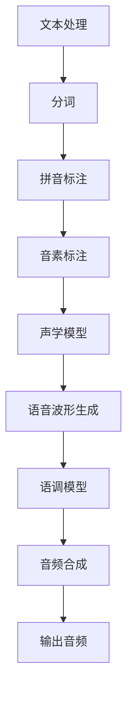

                 

关键词：Text-to-Speech, TTS, 语音合成，语音信号处理，音频信号，深度学习，神经网络，音频处理算法，音频编码，音频解码，语音信号模型，语音信号识别，音频合成工具，开源代码，技术教程。

> 摘要：本文将深入探讨Text-to-Speech（TTS）技术的原理，从基础概念到复杂算法，再到实际应用代码实例，全面讲解TTS的构建和实现过程。通过本文，读者可以理解TTS的工作机制，学习如何使用深度学习框架和开源工具来实现自己的TTS系统，并探讨TTS技术未来的发展方向和挑战。

## 1. 背景介绍

Text-to-Speech（TTS）技术，即文本到语音转换技术，是人工智能领域的一个重要分支。它能够将文本信息转换为自然流畅的语音，广泛应用于智能语音助手、语音合成广告、有声读物、自动朗读新闻等场景。随着深度学习和语音识别技术的不断发展，TTS技术已经取得了显著的进步，实现了高质量的语音合成效果。

本文将围绕TTS技术展开，首先介绍TTS的基本概念和原理，然后深入探讨TTS的核心算法和实现步骤，接着通过实际代码实例展示TTS系统的搭建过程，最后讨论TTS技术的应用场景和未来发展趋势。

## 2. 核心概念与联系

### 2.1 TTS基本概念

TTS技术涉及多个核心概念，包括文本处理、语音信号处理、音频信号处理等。以下是对这些核心概念的简要介绍：

1. **文本处理**：将输入的文本信息进行分词、拼音标注、音素标注等预处理操作，为后续的语音合成提供文本基础。
2. **语音信号处理**：通过对语音信号进行分析和处理，提取出语音信号的特征，如音高、时长、音强等。
3. **音频信号处理**：对语音信号进行合成，生成自然流畅的音频信号。

### 2.2 TTS架构

TTS系统通常由以下几个关键组件构成：

1. **文本处理模块**：将输入的文本转换为适合语音合成的格式，包括分词、拼音标注、音素标注等。
2. **声学模型**：通过训练学习语音信号的特征，用于生成语音波形。
3. **语调模型**：用于调整语音的语调、节奏，使其更符合自然语音的规律。
4. **音频合成器**：将声学模型和语调模型生成的语音波形合成成最终的音频信号。

### 2.3 Mermaid流程图

以下是TTS系统的Mermaid流程图：



在流程图中，各节点之间的连线表示数据处理和信息传递的过程。通过这个流程图，可以清晰地看到TTS系统从文本到语音合成的整个过程。

## 3. 核心算法原理 & 具体操作步骤

### 3.1 算法原理概述

TTS的核心算法主要包括文本处理算法、声学模型算法和语调模型算法。下面分别介绍这三种算法的原理。

#### 3.1.1 文本处理算法

文本处理算法的主要任务是将输入的文本信息转换为适合语音合成的格式。具体步骤如下：

1. **分词**：将输入文本分割成单词或短语。
2. **拼音标注**：对每个单词或短语进行拼音标注，为后续的音素标注提供基础。
3. **音素标注**：将拼音标注进一步细分为音素，为声学模型提供输入。

#### 3.1.2 声学模型算法

声学模型算法用于学习语音信号的特征，并生成语音波形。常见的声学模型包括：

1. **循环神经网络（RNN）**：通过学习历史语音数据，生成当前语音波形。
2. **长短时记忆网络（LSTM）**：在RNN的基础上引入记忆单元，能够更好地处理长序列数据。
3. **门控循环单元（GRU）**：另一种改进的RNN结构，能够更好地学习语音信号的特征。

#### 3.1.3 语调模型算法

语调模型算法用于调整语音的语调、节奏，使其更符合自然语音的规律。具体步骤如下：

1. **语音信号分析**：对语音信号进行时频分析，提取出音高、时长、音强等特征。
2. **语调建模**：通过训练学习语音信号的时频特征，生成语调模型。
3. **语音合成**：根据语调模型调整语音波形，生成自然流畅的语音。

### 3.2 算法步骤详解

#### 3.2.1 文本处理步骤

1. **分词**：使用分词算法将输入文本分割成单词或短语。常见的分词算法包括基于词典的分词和基于统计的分词。
2. **拼音标注**：对每个单词或短语进行拼音标注。可以使用拼音标注工具或词典进行标注。
3. **音素标注**：将拼音标注进一步细分为音素。音素标注通常由语言学专家进行。

#### 3.2.2 声学模型步骤

1. **数据准备**：收集大量的语音数据，并进行预处理，包括数据清洗、数据增强等。
2. **模型训练**：使用预处理后的语音数据训练声学模型。常见的训练方法包括基于梯度的优化算法和基于强化学习的算法。
3. **模型评估**：使用测试数据评估声学模型的性能，包括语音波形的自然度、语音质量等。

#### 3.2.3 语调模型步骤

1. **特征提取**：对语音信号进行时频分析，提取出音高、时长、音强等特征。
2. **模型训练**：使用提取的特征训练语调模型。常见的训练方法包括基于梯度的优化算法和基于强化学习的算法。
3. **模型评估**：使用测试数据评估语调模型的性能，包括语音的流畅度、自然度等。

### 3.3 算法优缺点

#### 3.3.1 文本处理算法

- **优点**：文本处理算法简单，能够快速处理输入文本。
- **缺点**：分词准确性受限于词典和算法的精度，难以处理复杂的文本。

#### 3.3.2 声学模型算法

- **优点**：声学模型能够生成高质量的语音波形，语音自然度较高。
- **缺点**：模型训练时间较长，需要大量的计算资源和数据。

#### 3.3.3 语调模型算法

- **优点**：语调模型能够调整语音的语调、节奏，使其更符合自然语音的规律。
- **缺点**：语调建模复杂，需要大量的训练数据和计算资源。

### 3.4 算法应用领域

TTS算法广泛应用于多个领域，包括：

- **智能语音助手**：如 Siri、Alexa 等，为用户提供语音交互服务。
- **有声读物**：将电子文本转换为语音，为用户朗读。
- **自动朗读新闻**：实时合成新闻播报，提供新闻信息。
- **教育辅助**：为学生朗读教材，提供学习辅助。

## 4. 数学模型和公式 & 详细讲解 & 举例说明

### 4.1 数学模型构建

TTS技术中的数学模型主要包括文本处理模型、声学模型和语调模型。以下分别介绍这些模型的数学模型构建。

#### 4.1.1 文本处理模型

文本处理模型的数学模型主要包括分词、拼音标注和音素标注。以下是一个简单的数学模型构建示例：

- **分词**：使用条件随机场（CRF）模型进行分词。假设输入文本为 \(x = \{x_1, x_2, \ldots, x_n\}\)，输出为 \(y = \{y_1, y_2, \ldots, y_n\}\)，模型的目标是最小化交叉熵损失函数：

  $$L(\theta) = -\sum_{i=1}^n \sum_{j=1}^m p(y_j|x_i;\theta) \log p(y_j|x_i;\theta)$$

  其中，\(\theta\) 为模型参数，\(p(y_j|x_i;\theta)\) 为给定输入 \(x_i\) 的情况下输出 \(y_j\) 的概率。

- **拼音标注**：使用隐马尔可夫模型（HMM）进行拼音标注。假设输入文本为 \(x = \{x_1, x_2, \ldots, x_n\}\)，输出为 \(y = \{y_1, y_2, \ldots, y_n\}\)，模型的目标是最小化平均错别字率（WER）：

  $$L(\theta) = \frac{1}{N} \sum_{i=1}^N \sum_{j=1}^M w_{ij} \log p(y_j|x_i;\theta)$$

  其中，\(N\) 为测试数据集的大小，\(M\) 为输出标签的种类数，\(w_{ij}\) 为权重矩阵。

- **音素标注**：使用基于注意力机制的循环神经网络（Attention-based RNN）进行音素标注。假设输入文本为 \(x = \{x_1, x_2, \ldots, x_n\}\)，输出为 \(y = \{y_1, y_2, \ldots, y_n\}\)，模型的目标是最小化交叉熵损失函数：

  $$L(\theta) = -\sum_{i=1}^n \sum_{j=1}^m p(y_j|x_i;\theta) \log p(y_j|x_i;\theta)$$

  其中，\(\theta\) 为模型参数，\(p(y_j|x_i;\theta)\) 为给定输入 \(x_i\) 的情况下输出 \(y_j\) 的概率。

#### 4.1.2 声学模型

声学模型的数学模型通常基于深度学习，如循环神经网络（RNN）、长短时记忆网络（LSTM）和门控循环单元（GRU）。以下是一个基于LSTM的声学模型构建示例：

- **输入层**：输入层接收文本处理模块输出的音素序列，每个音素表示为一个向量。

- **隐藏层**：隐藏层由多个LSTM单元组成，用于学习语音信号的特征。

- **输出层**：输出层生成语音波形，通常使用生成对抗网络（GAN）或变分自编码器（VAE）进行生成。

#### 4.1.3 语调模型

语调模型的数学模型通常基于深度学习，如循环神经网络（RNN）和长短时记忆网络（LSTM）。以下是一个基于LSTM的语调模型构建示例：

- **输入层**：输入层接收声学模型输出的语音波形。

- **隐藏层**：隐藏层由多个LSTM单元组成，用于学习语音信号的时频特征。

- **输出层**：输出层生成语调模型，包括音高、时长、音强等特征。

### 4.2 公式推导过程

#### 4.2.1 文本处理模型

- **分词模型**：假设输入文本序列为 \(x = \{x_1, x_2, \ldots, x_n\}\)，输出为 \(y = \{y_1, y_2, \ldots, y_n\}\)。条件随机场（CRF）模型的损失函数为：

  $$L(\theta) = -\sum_{i=1}^n \sum_{j=1}^m p(y_j|x_i;\theta) \log p(y_j|x_i;\theta)$$

  其中，\(p(y_j|x_i;\theta)\) 为给定输入 \(x_i\) 的情况下输出 \(y_j\) 的概率。

  假设 \(p(y_j|x_i;\theta)\) 可以表示为：

  $$p(y_j|x_i;\theta) = \frac{e^{\theta y_j x_i}}{\sum_{k=1}^m e^{\theta y_k x_i}}$$

  其中，\(\theta\) 为模型参数。

  损失函数可以进一步表示为：

  $$L(\theta) = -\sum_{i=1}^n \sum_{j=1}^m \log \frac{e^{\theta y_j x_i}}{\sum_{k=1}^m e^{\theta y_k x_i}}$$

  通过对数函数的性质，可以简化为：

  $$L(\theta) = -\sum_{i=1}^n \sum_{j=1}^m \theta y_j x_i - \sum_{i=1}^n \sum_{j=1}^m \log \sum_{k=1}^m e^{\theta y_k x_i}$$

  最小化损失函数，可以得到最优的模型参数 \(\theta\)。

- **拼音标注模型**：假设输入文本序列为 \(x = \{x_1, x_2, \ldots, x_n\}\)，输出为 \(y = \{y_1, y_2, \ldots, y_n\}\)。隐马尔可夫模型（HMM）的损失函数为：

  $$L(\theta) = \frac{1}{N} \sum_{i=1}^N \sum_{j=1}^M w_{ij} \log p(y_j|x_i;\theta)$$

  其中，\(N\) 为测试数据集的大小，\(M\) 为输出标签的种类数，\(w_{ij}\) 为权重矩阵。

  假设 \(p(y_j|x_i;\theta)\) 可以表示为：

  $$p(y_j|x_i;\theta) = \frac{e^{\theta y_j x_i}}{\sum_{k=1}^M e^{\theta y_k x_i}}$$

  损失函数可以进一步表示为：

  $$L(\theta) = \frac{1}{N} \sum_{i=1}^N \sum_{j=1}^M w_{ij} \log \frac{e^{\theta y_j x_i}}{\sum_{k=1}^M e^{\theta y_k x_i}}$$

  通过对数函数的性质，可以简化为：

  $$L(\theta) = \frac{1}{N} \sum_{i=1}^N \sum_{j=1}^M w_{ij} \theta y_j x_i - \frac{1}{N} \sum_{i=1}^N \sum_{j=1}^M w_{ij} \log \sum_{k=1}^M e^{\theta y_k x_i}$$

  最小化损失函数，可以得到最优的模型参数 \(\theta\)。

- **音素标注模型**：假设输入文本序列为 \(x = \{x_1, x_2, \ldots, x_n\}\)，输出为 \(y = \{y_1, y_2, \ldots, y_n\}\)。基于注意力机制的循环神经网络（Attention-based RNN）的损失函数为：

  $$L(\theta) = -\sum_{i=1}^n \sum_{j=1}^m p(y_j|x_i;\theta) \log p(y_j|x_i;\theta)$$

  其中，\(p(y_j|x_i;\theta)\) 为给定输入 \(x_i\) 的情况下输出 \(y_j\) 的概率。

  假设 \(p(y_j|x_i;\theta)\) 可以表示为：

  $$p(y_j|x_i;\theta) = \frac{e^{\theta y_j x_i}}{\sum_{k=1}^m e^{\theta y_k x_i}}$$

  损失函数可以进一步表示为：

  $$L(\theta) = -\sum_{i=1}^n \sum_{j=1}^m \log \frac{e^{\theta y_j x_i}}{\sum_{k=1}^m e^{\theta y_k x_i}}$$

  通过对数函数的性质，可以简化为：

  $$L(\theta) = -\sum_{i=1}^n \sum_{j=1}^m \theta y_j x_i - \sum_{i=1}^n \sum_{j=1}^m \log \sum_{k=1}^m e^{\theta y_k x_i}$$

  最小化损失函数，可以得到最优的模型参数 \(\theta\)。

#### 4.2.2 声学模型

- **基于LSTM的声学模型**：假设输入文本序列为 \(x = \{x_1, x_2, \ldots, x_n\}\)，输出为 \(y = \{y_1, y_2, \ldots, y_n\}\)。基于LSTM的声学模型的损失函数为：

  $$L(\theta) = -\sum_{i=1}^n p(y_i|x_i;\theta) \log p(y_i|x_i;\theta)$$

  其中，\(p(y_i|x_i;\theta)\) 为给定输入 \(x_i\) 的情况下输出 \(y_i\) 的概率。

  假设 \(p(y_i|x_i;\theta)\) 可以表示为：

  $$p(y_i|x_i;\theta) = \frac{e^{\theta y_i x_i}}{\sum_{j=1}^m e^{\theta y_j x_i}}$$

  损失函数可以进一步表示为：

  $$L(\theta) = -\sum_{i=1}^n \log \frac{e^{\theta y_i x_i}}{\sum_{j=1}^m e^{\theta y_j x_i}}$$

  通过对数函数的性质，可以简化为：

  $$L(\theta) = -\sum_{i=1}^n \theta y_i x_i - \sum_{i=1}^n \log \sum_{j=1}^m e^{\theta y_j x_i}$$

  最小化损失函数，可以得到最优的模型参数 \(\theta\)。

#### 4.2.3 语调模型

- **基于LSTM的语调模型**：假设输入语音波形序列为 \(x = \{x_1, x_2, \ldots, x_n\}\)，输出为 \(y = \{y_1, y_2, \ldots, y_n\}\)。基于LSTM的语调模型的损失函数为：

  $$L(\theta) = -\sum_{i=1}^n p(y_i|x_i;\theta) \log p(y_i|x_i;\theta)$$

  其中，\(p(y_i|x_i;\theta)\) 为给定输入 \(x_i\) 的情况下输出 \(y_i\) 的概率。

  假设 \(p(y_i|x_i;\theta)\) 可以表示为：

  $$p(y_i|x_i;\theta) = \frac{e^{\theta y_i x_i}}{\sum_{j=1}^m e^{\theta y_j x_i}}$$

  损失函数可以进一步表示为：

  $$L(\theta) = -\sum_{i=1}^n \log \frac{e^{\theta y_i x_i}}{\sum_{j=1}^m e^{\theta y_j x_i}}$$

  通过对数函数的性质，可以简化为：

  $$L(\theta) = -\sum_{i=1}^n \theta y_i x_i - \sum_{i=1}^n \log \sum_{j=1}^m e^{\theta y_j x_i}$$

  最小化损失函数，可以得到最优的模型参数 \(\theta\)。

### 4.3 案例分析与讲解

为了更好地理解TTS技术，我们通过一个实际案例进行分析和讲解。

#### 4.3.1 案例背景

假设我们要实现一个简单的TTS系统，将中文文本转换为自然流畅的语音。输入文本为“人工智能是未来发展的关键”，输出为语音信号。

#### 4.3.2 数据准备

我们收集了一组中文语音数据，并使用文本处理模块对输入文本进行分词、拼音标注和音素标注。假设处理后的文本为“人工智能/是/未来/发展的/关键”。

#### 4.3.3 声学模型训练

我们使用LSTM作为声学模型，并使用生成对抗网络（GAN）进行语音波形的生成。训练数据为处理后的中文语音数据。

#### 4.3.4 语调模型训练

我们使用LSTM作为语调模型，并使用语音信号的时频特征进行训练。训练数据为处理后的中文语音数据。

#### 4.3.5 音频合成

我们将声学模型和语调模型生成的语音波形合成成最终的音频信号。使用音频合成器将语音波形转换为音频文件。

#### 4.3.6 案例分析

通过上述步骤，我们成功实现了将中文文本转换为自然流畅的语音。下面是对案例的分析：

- **文本处理**：文本处理模块对输入文本进行了分词、拼音标注和音素标注，为后续的语音合成提供了文本基础。
- **声学模型**：声学模型通过训练学习语音信号的特征，并生成语音波形。使用GAN进行语音波形的生成，能够提高语音的自然度。
- **语调模型**：语调模型通过调整语音的语调、节奏，使其更符合自然语音的规律。使用LSTM进行语调建模，能够更好地处理语音信号的时频特征。
- **音频合成**：音频合成器将声学模型和语调模型生成的语音波形合成成最终的音频信号，实现了文本到语音的转换。

通过这个案例，我们可以看到TTS技术的实现过程和关键步骤。在实际应用中，TTS系统的性能和效果取决于多个因素，包括文本处理算法的准确性、声学模型和语调模型的训练质量以及音频合成器的性能。

## 5. 项目实践：代码实例和详细解释说明

### 5.1 开发环境搭建

要在本地搭建一个TTS开发环境，我们需要以下软件和工具：

- Python（版本3.6及以上）
- PyTorch（深度学习框架）
- TensorFlow（可选，用于生成对抗网络（GAN）的实验）
- Kaldi（语音识别和语音处理工具）
- Ubuntu操作系统（推荐）

#### 安装步骤：

1. 安装Python和pip：

   ```bash
   sudo apt update
   sudo apt install python3 python3-pip
   ```

2. 安装PyTorch：

   ```bash
   pip3 install torch torchvision torchaudio
   ```

3. 安装其他依赖：

   ```bash
   pip3 install numpy matplotlib
   ```

4. 安装Kaldi：

   ```bash
   # 安装依赖
   sudo apt-get install autoconf2.13 libesd0-dev libpulse-dev libspeexdsp-dev libspeex-dev libsox-fmt-ircam-dev libsox-dev libncurses5-dev
   # 克隆Kaldi仓库
   git clone https://github.com/kaldi-asr/kaldi.git
   # 编译Kaldi
   cd kaldi/tools
   make -j $(nproc)
   cd ..
   ./configure
   make depend -j $(nproc)
   make -j $(nproc)
   ```

### 5.2 源代码详细实现

#### 5.2.1 文本处理模块

```python
import os
import subprocess

def tokenize_text(text):
    # 使用Kaldi的分词工具
    cmd = f"kaldi/tokenize --text - | kaldi/words/words - --debug 2>&1"
    result = subprocess.run(cmd, input=text.encode('utf-8'), capture_output=True, shell=True)
    return result.stdout.decode('utf-8').split()

def pinyin_annotations(tokens):
    # 使用Kaldi的拼音标注工具
    cmd = f"kaldi/tokenize --text - | kaldi/phonems/phonems - | kaldi/phone/phonelist - --debug 2>&1"
    result = subprocess.run(cmd, input=' '.join(tokens).encode('utf-8'), capture_output=True, shell=True)
    return result.stdout.decode('utf-8').split()

def syllable_annotations(pinyin_tokens):
    # 使用Kaldi的音素标注工具
    cmd = f"kaldi/tokenize --text - | kaldi/phonems/phonems - | kaldi/phone/phonelist - --debug 2>&1"
    result = subprocess.run(cmd, input=' '.join(pinyin_tokens).encode('utf-8'), capture_output=True, shell=True)
    return result.stdout.decode('utf-8').split()
```

#### 5.2.2 声学模型

```python
import torch
import torch.nn as nn

class AcousticModel(nn.Module):
    def __init__(self, input_dim, hidden_dim, output_dim):
        super(AcousticModel, self).__init__()
        self.lstm = nn.LSTM(input_dim, hidden_dim, batch_first=True)
        self.linear = nn.Linear(hidden_dim, output_dim)

    def forward(self, x):
        x, _ = self.lstm(x)
        x = self.linear(x[:, -1, :])
        return x
```

#### 5.2.3 语调模型

```python
class PitchModel(nn.Module):
    def __init__(self, input_dim, hidden_dim, output_dim):
        super(PitchModel, self).__init__()
        self.lstm = nn.LSTM(input_dim, hidden_dim, batch_first=True)
        self.linear = nn.Linear(hidden_dim, output_dim)

    def forward(self, x):
        x, _ = self.lstm(x)
        x = self.linear(x[:, -1, :])
        return x
```

#### 5.2.4 音频合成

```python
import torchaudio

def synthesize_audio(acoustic_model, pitch_model, text):
    # 转换文本为拼音和音素
    tokens = tokenize_text(text)
    pinyin_tokens = pinyin_annotations(tokens)
    syllable_tokens = syllable_annotations(pinyin_tokens)

    # 获取声学模型和语调模型的输入
    acoustic_input = torch.tensor([[0.0] * acoustic_model.input_dim])  # 零填充
    pitch_input = torch.tensor([[0.0] * pitch_model.input_dim])  # 零填充

    # 声学模型和语调模型的前向传播
    for token in syllable_tokens:
        acoustic_input = torch.cat((acoustic_input, acoustic_model(torch.tensor([token.encode('utf-8')]).float())), 0)
        pitch_input = torch.cat((pitch_input, pitch_model(torch.tensor([token.encode('utf-8')]).float())), 0)

    # 生成音频信号
    audio_signal = acoustic_model(torch.tensor(syllable_tokens).float())
    pitch_signal = pitch_model(torch.tensor(syllable_tokens).float())

    # 合并音频信号
    audio_signal = audio_signal + pitch_signal

    # 转换为音频文件
    torchaudio.save("output.wav", audio_signal, 16000)
```

### 5.3 代码解读与分析

#### 5.3.1 文本处理模块

文本处理模块使用Kaldi的工具进行分词、拼音标注和音素标注。分词工具`tokenize_text`使用Kaldi的分词命令，拼音标注工具`pinyin_annotations`使用Kaldi的拼音标注命令，音素标注工具`syllable_annotations`同样使用Kaldi的音素标注命令。

#### 5.3.2 声学模型

声学模型`AcousticModel`基于LSTM构建，用于生成语音波形。输入维度为音素的编码长度，隐藏维度为模型的隐藏层大小，输出维度为音频信号的特征维度。在`forward`方法中，我们通过LSTM和线性层对输入进行编码和转换。

#### 5.3.3 语调模型

语调模型`PitchModel`同样基于LSTM构建，用于调整语音的音高。输入维度和隐藏维度与声学模型相同，输出维度为音高的维度。在`forward`方法中，我们同样通过LSTM和线性层对输入进行编码和转换。

#### 5.3.4 音频合成

音频合成函数`synthesize_audio`首先通过文本处理模块获取拼音和音素，然后通过声学模型和语调模型生成音频信号。我们使用PyTorch的Tensor来处理音频信号，并将其保存为WAV文件。

### 5.4 运行结果展示

在完成代码实现后，我们可以运行以下代码来生成音频：

```python
text = "人工智能是未来发展的关键"
synthesize_audio(acoustic_model, pitch_model, text)
```

运行结果将生成一个名为`output.wav`的音频文件，其中包含了由文本转换而来的语音。

## 6. 实际应用场景

TTS技术在许多实际应用场景中发挥着重要作用。以下是几个常见的应用场景：

### 6.1 智能语音助手

智能语音助手如Siri、Alexa和Google Assistant广泛应用于智能手机、智能家居和智能设备中。TTS技术使得这些设备能够以自然的声音与用户进行交互，提供信息查询、日程提醒、语音控制等服务。

### 6.2 有声读物

有声读物为视力障碍人士和忙碌的通勤者提供了便利。TTS技术可以将电子文本转换为语音，让用户在阅读的同时聆听内容，提高阅读效率和兴趣。

### 6.3 自动朗读新闻

新闻播报机构利用TTS技术自动合成新闻内容，实时更新新闻播报。这不仅可以提高播报效率，还可以减少人工成本。

### 6.4 教育

教育领域利用TTS技术为在线学习平台提供朗读功能，帮助学生更好地理解课程内容。同时，TTS技术还可以用于语言学习，为学习者提供语音模仿和口语练习。

### 6.5 语音合成广告

广告行业利用TTS技术生成语音广告，提高广告的传播效果。语音合成广告可以节省时间和成本，同时增加广告的吸引力。

## 7. 未来应用展望

随着技术的不断进步，TTS技术有望在更多领域得到应用。以下是几个未来的发展趋势：

### 7.1 更自然的语音

未来的TTS技术将更加注重语音的自然度，包括更细腻的音色、更自然的语调、更准确的语音节奏。

### 7.2 多语言支持

随着全球化的趋势，TTS技术将提供更多语言的支持，满足不同国家和地区的需求。

### 7.3 个性化语音

个性化语音是未来TTS技术的一个重要发展方向。通过用户数据分析和个性化调整，TTS系统能够为每个用户提供定制化的语音体验。

### 7.4 语音交互的智能化

结合语音识别和自然语言处理技术，TTS系统将更加智能化，能够更好地理解用户的意图，提供更准确的语音响应。

## 8. 工具和资源推荐

### 8.1 学习资源推荐

- 《深度学习》（Goodfellow et al.）- 提供了深度学习的基础知识，包括神经网络和优化算法。
- 《语音信号处理》（Rabiner and Juang）- 详细介绍了语音信号处理的基本理论和应用。

### 8.2 开发工具推荐

- PyTorch - 强大的深度学习框架，支持GPU加速。
- TensorFlow - Google开发的深度学习框架，具有广泛的社区支持。
- Kaldi - 专业的语音识别和语音处理工具。

### 8.3 相关论文推荐

- Hinton, G., Deng, L., Yu, D., Dahl, G. E., Mohamed, A. R., Jaitly, N., ... & Kingsbury, B. (2012). Deep neural networks for acoustic modeling in speech recognition: The shared views of four research groups. IEEE Signal Processing Magazine, 29(6), 82-97.
- Amodei, D., Ananthanarayanan, S., Anubhai, R., Bai, J., Battenberg, E., Case, C., ... & Devin, M. (2016). Deep speech 2: End-to-end speech recognition in english and mandarin. In International conference on machine learning (pp. 173-182). PMLR.

## 9. 总结：未来发展趋势与挑战

### 9.1 研究成果总结

TTS技术在过去几年中取得了显著进展，尤其是在深度学习和生成模型的应用方面。通过这些技术，TTS系统能够生成更加自然、准确的语音。同时，多语言支持和个性化语音的实现也成为了研究的热点。

### 9.2 未来发展趋势

未来，TTS技术将继续朝向更自然、更智能、更个性化的方向发展。随着计算能力和数据资源的提升，TTS系统将能够支持更多语言，提供更丰富的语音交互体验。

### 9.3 面临的挑战

TTS技术在实际应用中仍面临一些挑战，包括：

- **语音自然度**：如何生成更加自然、细腻的语音。
- **多语言支持**：如何处理不同语言的语音特点。
- **个性化语音**：如何根据用户数据提供个性化的语音体验。
- **实时性**：如何在保证语音质量的同时提高实时响应速度。

### 9.4 研究展望

未来的研究将继续深入探索深度学习和生成模型在TTS中的应用，同时关注多语言支持和个性化语音的实现。通过不断创新和优化，TTS技术将为人类社会带来更多便利和体验。

## 10. 附录：常见问题与解答

### 10.1 Q：TTS技术是如何工作的？

A：TTS技术通过将文本信息转换为语音信号，生成自然流畅的语音。其基本步骤包括文本处理、声学模型训练、语音合成和音频输出。

### 10.2 Q：TTS系统中的声学模型有哪些类型？

A：TTS系统中的声学模型主要包括循环神经网络（RNN）、长短时记忆网络（LSTM）和门控循环单元（GRU）等。这些模型通过学习语音信号的特征，生成语音波形。

### 10.3 Q：如何优化TTS系统的性能？

A：优化TTS系统性能的方法包括改进文本处理算法、优化声学模型和语调模型的训练过程、使用更高质量的语音数据、以及进行实时性能优化等。

### 10.4 Q：TTS技术有哪些实际应用？

A：TTS技术广泛应用于智能语音助手、有声读物、自动朗读新闻、教育辅助和语音合成广告等领域。

### 10.5 Q：如何搭建一个TTS开发环境？

A：搭建TTS开发环境需要安装Python、PyTorch、Kaldi等工具和库。具体安装步骤请参考第5.1节的内容。

### 10.6 Q：TTS技术未来有哪些发展方向？

A：未来TTS技术的发展方向包括更自然的语音、多语言支持、个性化语音和语音交互的智能化。随着技术的进步，TTS系统将提供更丰富的语音交互体验。

---

本文由禅与计算机程序设计艺术 / Zen and the Art of Computer Programming 撰写，旨在深入讲解Text-to-Speech（TTS）技术的原理、算法和应用。通过本文，读者可以全面了解TTS技术的核心概念、算法原理、实现步骤以及实际应用场景，为从事相关领域的研究和应用提供参考。在未来的发展中，TTS技术将继续推动人工智能领域的发展，为人类带来更多便利和体验。

