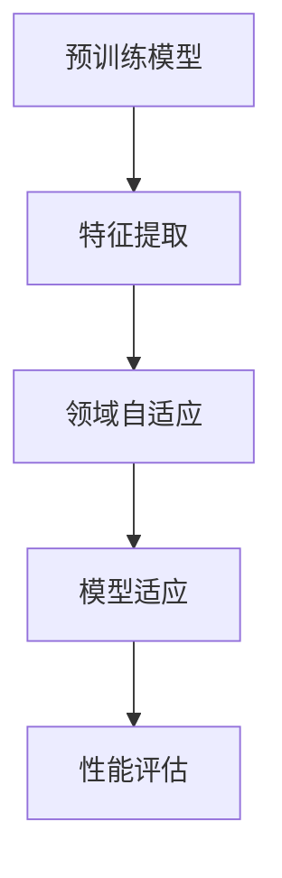

                 

关键词：Transfer Learning，深度学习，预训练模型，迁移学习，模型复用，跨域学习

> 摘要：本文将深入讲解Transfer Learning（迁移学习）的基本原理、核心算法及其在深度学习中的应用。通过实例代码展示，读者可以更好地理解如何利用预训练模型进行迁移学习，提高模型的泛化能力和效率。文章还将探讨迁移学习在不同领域的应用前景和挑战。

## 1. 背景介绍

在深度学习领域，模型的训练是一个耗时且计算资源消耗巨大的过程。随着数据集规模的扩大和模型复杂度的提升，训练所需的时间和资源呈指数级增长。然而，在实际应用中，我们经常面临以下问题：

1. **数据稀缺**：某些特定领域的数据集有限，难以收集到足够多的训练数据。
2. **计算资源有限**：训练大规模深度学习模型需要大量的计算资源，这对于个人或小型团队来说可能难以承担。
3. **模型泛化能力差**：在特定领域训练的模型可能无法很好地适应其他领域或任务。

为了解决这些问题，Transfer Learning（迁移学习）应运而生。迁移学习的核心思想是利用在特定领域或任务上预训练的模型，将其知识迁移到新的领域或任务中，从而提高模型在新任务上的表现。

迁移学习不仅能够节省训练时间和计算资源，还能提高模型的泛化能力，使其在不同领域和任务中表现出色。在本文中，我们将详细探讨迁移学习的基本原理、核心算法及其在深度学习中的应用。

### 1.1 迁移学习的起源与发展

迁移学习最早可以追溯到1990年代。当时，研究人员发现通过在类似任务上训练模型，可以显著提高模型在新任务上的性能。这种思想在计算机视觉和自然语言处理领域得到了广泛应用。

随着深度学习的兴起，迁移学习也得到了进一步的发展。特别是在预训练模型的出现后，迁移学习的效果更加显著。预训练模型在大量通用数据集上训练，学习到了许多通用的特征表示，这些特征可以迁移到不同的具体任务中，从而提高模型的性能。

### 1.2 迁移学习的重要性

迁移学习在多个领域具有重要作用：

1. **节省时间和资源**：通过使用预训练模型，可以避免从头开始训练模型，从而节省大量的时间和计算资源。
2. **提高泛化能力**：预训练模型学习到的通用特征表示可以帮助模型更好地适应新的领域和任务。
3. **应对数据稀缺问题**：在某些特定领域，数据稀缺是一个重大问题。通过迁移学习，我们可以利用在其他领域收集到的数据来提高模型的性能。
4. **提升模型性能**：在许多实际应用中，迁移学习可以显著提高模型的性能，特别是在数据量较小的情况下。

总的来说，迁移学习是深度学习中一个非常重要的研究方向，具有广泛的应用前景和潜力。

### 1.3 文章结构

本文将分为以下几部分：

1. **背景介绍**：介绍迁移学习的起源、发展和重要性。
2. **核心概念与联系**：阐述迁移学习的基本概念，并使用Mermaid流程图展示核心概念之间的联系。
3. **核心算法原理 & 具体操作步骤**：详细讲解迁移学习的基本算法原理和操作步骤。
4. **数学模型和公式 & 详细讲解 & 举例说明**：介绍迁移学习中的数学模型和公式，并通过案例进行分析。
5. **项目实践：代码实例和详细解释说明**：通过实际代码实例展示如何进行迁移学习。
6. **实际应用场景**：探讨迁移学习在不同领域的应用场景。
7. **工具和资源推荐**：推荐学习资源和开发工具。
8. **总结：未来发展趋势与挑战**：总结研究成果，探讨未来发展趋势和挑战。
9. **附录：常见问题与解答**：回答读者可能遇到的问题。

## 2. 核心概念与联系

迁移学习涉及多个核心概念，包括预训练模型、特征表示、领域自适应等。为了更好地理解这些概念之间的关系，我们使用Mermaid流程图来展示它们之间的联系。



### 2.1 预训练模型

预训练模型是指在大量通用数据集上预先训练好的模型。这些模型通常学习到了许多通用的特征表示，可以用于不同的具体任务。预训练模型是迁移学习的基础，为后续的迁移学习提供了丰富的特征表示。

### 2.2 特征提取

特征提取是指从输入数据中提取出有用的特征表示。在迁移学习中，特征提取是一个关键步骤。通过预训练模型，我们可以获得高质量的特征表示，这些特征表示可以帮助模型在新任务上更好地适应。

### 2.3 领域自适应

领域自适应是指通过调整预训练模型，使其在新任务上具有更好的性能。领域自适应可以通过多种方法实现，如域自适应、域泛化和域转移等。

### 2.4 模型适应

模型适应是指将预训练模型迁移到新任务上，并通过微调等方式进行优化。模型适应是迁移学习中的核心步骤，通过调整模型参数，使其在新任务上具有更好的性能。

### 2.5 性能评估

性能评估是迁移学习中的最后一步，用于评估模型在新任务上的性能。性能评估可以采用各种指标，如准确率、召回率、F1值等。

通过上述核心概念之间的联系，我们可以更好地理解迁移学习的工作原理。在接下来的章节中，我们将详细讲解迁移学习的基本算法原理和操作步骤。

## 3. 核心算法原理 & 具体操作步骤

### 3.1 算法原理概述

迁移学习的基本原理是通过在源领域（source domain）上预训练一个模型，然后将这个模型迁移到目标领域（target domain）上，以便在目标领域上获得更好的性能。这个过程主要包括以下几个步骤：

1. **预训练**：在大量通用数据集上训练一个基础模型，使其学习到丰富的特征表示。
2. **特征提取**：利用预训练模型对输入数据进行特征提取，获得高质量的特征表示。
3. **领域自适应**：通过调整模型参数，使预训练模型在目标领域上具有更好的适应能力。
4. **模型适应**：在目标领域上对模型进行微调，进一步优化模型性能。
5. **性能评估**：在目标领域上评估模型性能，确定模型是否达到预期效果。

### 3.2 算法步骤详解

#### 3.2.1 预训练

预训练是迁移学习的基础。在预训练阶段，我们通常使用一个基础模型（如卷积神经网络）在大量的通用数据集（如ImageNet）上进行训练。这个基础模型将学习到许多通用的特征表示，这些特征表示在许多任务中都具有很高的泛化能力。

预训练过程通常包括以下几个步骤：

1. **数据预处理**：对数据集进行预处理，如数据增强、标准化等。
2. **模型初始化**：初始化基础模型，通常使用随机初始化或预训练模型权重。
3. **训练过程**：在数据集上迭代训练基础模型，优化模型参数，使其在数据集上达到较好的性能。
4. **模型保存**：在预训练过程中，定期保存模型的权重，以便后续迁移使用。

#### 3.2.2 特征提取

在预训练完成后，我们使用预训练模型对输入数据进行特征提取。特征提取过程主要包括以下几个步骤：

1. **输入数据**：将输入数据输入到预训练模型中。
2. **特征提取**：通过预训练模型提取输入数据的特征表示。
3. **特征处理**：对提取到的特征进行必要的处理，如降维、标准化等。

通过特征提取，我们可以获得高质量的输入数据特征表示，这些特征表示在后续的迁移学习中具有重要作用。

#### 3.2.3 领域自适应

领域自适应是指通过调整模型参数，使预训练模型在目标领域上具有更好的适应能力。领域自适应可以通过多种方法实现，如域自适应、域泛化和域转移等。

1. **域自适应**：域自适应是指通过在目标领域上训练一个模型，使其能够适应目标领域的特征。这种方法通常需要大量目标领域的数据，因此对数据稀缺的问题可能并不适用。

2. **域泛化**：域泛化是指通过在多个领域上预训练一个模型，使其在多个领域上都具有较好的适应能力。这种方法可以减少对大量目标领域数据的依赖，但可能牺牲一些性能。

3. **域转移**：域转移是指通过在源领域和目标领域之间建立映射关系，将源领域的特征迁移到目标领域。这种方法可以充分利用源领域的知识，但需要对源领域和目标领域之间的关系有较好的理解。

#### 3.2.4 模型适应

模型适应是指将预训练模型迁移到目标领域，并通过微调等方式进行优化，使其在目标领域上具有更好的性能。模型适应过程主要包括以下几个步骤：

1. **模型初始化**：初始化模型参数，通常使用预训练模型的权重。
2. **微调过程**：在目标领域上迭代微调模型参数，优化模型性能。
3. **模型评估**：在目标领域上评估模型性能，确定模型是否达到预期效果。

通过模型适应，我们可以将预训练模型的知识迁移到目标领域，从而提高模型在目标领域上的性能。

#### 3.2.5 性能评估

性能评估是迁移学习中的最后一步，用于评估模型在目标领域上的性能。性能评估可以采用各种指标，如准确率、召回率、F1值等。通过性能评估，我们可以确定迁移学习的效果，并为进一步优化模型提供指导。

### 3.3 算法优缺点

#### 3.3.1 优点

1. **节省时间和资源**：通过使用预训练模型，可以避免从头开始训练模型，从而节省大量的时间和计算资源。
2. **提高泛化能力**：预训练模型学习到的通用特征表示可以帮助模型更好地适应新的领域和任务。
3. **应对数据稀缺问题**：在某些特定领域，数据稀缺是一个重大问题。通过迁移学习，我们可以利用在其他领域收集到的数据来提高模型的性能。
4. **提升模型性能**：在许多实际应用中，迁移学习可以显著提高模型的性能，特别是在数据量较小的情况下。

#### 3.3.2 缺点

1. **对预训练模型的依赖性**：迁移学习依赖于预训练模型，如果预训练模型质量较差，可能会导致迁移学习效果不佳。
2. **领域适应性问题**：在某些情况下，预训练模型可能无法很好地适应新的领域，导致迁移学习效果不理想。
3. **数据集分布问题**：迁移学习的效果受到数据集分布的影响，如果目标领域和源领域的分布差异较大，可能会导致迁移学习效果不佳。

### 3.4 算法应用领域

迁移学习在多个领域都有广泛的应用，以下是几个主要的应用领域：

1. **计算机视觉**：在计算机视觉领域，迁移学习被广泛应用于图像分类、目标检测、语义分割等任务。通过在通用数据集上预训练模型，可以显著提高模型在特定领域上的性能。
2. **自然语言处理**：在自然语言处理领域，迁移学习被广泛应用于文本分类、情感分析、机器翻译等任务。通过在大型语料库上预训练模型，可以显著提高模型在特定领域上的性能。
3. **语音识别**：在语音识别领域，迁移学习被广泛应用于语音分类、语音合成等任务。通过在大量的语音数据上预训练模型，可以显著提高模型在特定领域上的性能。
4. **医疗领域**：在医疗领域，迁移学习被广泛应用于图像分析、疾病预测等任务。通过在医学图像数据集上预训练模型，可以显著提高模型在特定领域上的性能。

总的来说，迁移学习是一种非常有用的技术，可以在许多领域提高模型的性能，节省训练时间和资源。

## 4. 数学模型和公式 & 详细讲解 & 举例说明

### 4.1 数学模型构建

在迁移学习中，我们通常使用以下数学模型来描述模型迁移的过程：

$$
L(\theta, x, y) = -\sum_{i=1}^{N} \log P(y_i | x_i; \theta)
$$

其中，$L$ 是损失函数，$\theta$ 是模型参数，$x$ 是输入数据，$y$ 是输出标签，$N$ 是样本数量。

在迁移学习中，我们通常采用以下策略来构建数学模型：

1. **特征提取**：使用预训练模型对输入数据进行特征提取，获得特征表示 $f(x)$。
2. **分类器**：在特征表示的基础上构建分类器，用于对输入数据进行分类。分类器可以是一个简单的线性分类器，也可以是一个复杂的神经网络。
3. **损失函数**：使用损失函数来评估模型在目标领域的性能。常用的损失函数有交叉熵损失函数、均方误差损失函数等。

### 4.2 公式推导过程

在迁移学习中，我们通常采用以下步骤来推导数学模型：

1. **特征提取**：使用预训练模型对输入数据进行特征提取，获得特征表示 $f(x)$。特征提取过程可以表示为：

$$
f(x) = \phi(x)
$$

其中，$\phi$ 是预训练模型的特征提取函数。

2. **分类器**：在特征表示的基础上构建分类器，用于对输入数据进行分类。分类器可以是一个简单的线性分类器，也可以是一个复杂的神经网络。分类器可以表示为：

$$
y = g(\theta^T f(x))
$$

其中，$g$ 是分类器的激活函数，$\theta$ 是分类器参数。

3. **损失函数**：使用损失函数来评估模型在目标领域的性能。常用的损失函数有交叉熵损失函数、均方误差损失函数等。交叉熵损失函数可以表示为：

$$
L(\theta, x, y) = -\sum_{i=1}^{N} y_i \log P(y_i | x_i; \theta)
$$

其中，$P(y_i | x_i; \theta)$ 是模型对输入数据 $x_i$ 的预测概率。

### 4.3 案例分析与讲解

#### 4.3.1 计算机视觉

在计算机视觉领域，迁移学习被广泛应用于图像分类任务。以下是一个简单的迁移学习案例：

假设我们有一个预训练的卷积神经网络（CNN）模型，在ImageNet数据集上训练得到。现在我们想将这个模型应用于一个新的图像分类任务，例如对猫和狗进行分类。

1. **特征提取**：使用预训练模型对新的图像数据进行特征提取，获得特征表示。
2. **分类器**：在特征表示的基础上构建一个线性分类器，用于对图像进行分类。
3. **损失函数**：使用交叉熵损失函数来评估模型在目标领域的性能。

通过这个案例，我们可以看到迁移学习的基本过程。通过使用预训练模型，我们可以显著提高模型在新任务上的性能，节省大量的训练时间和计算资源。

#### 4.3.2 自然语言处理

在自然语言处理领域，迁移学习被广泛应用于文本分类任务。以下是一个简单的迁移学习案例：

假设我们有一个预训练的文本分类模型，在大型语料库上训练得到。现在我们想将这个模型应用于一个新的文本分类任务，例如对新闻文章进行分类。

1. **特征提取**：使用预训练模型对新的文本数据进行特征提取，获得特征表示。
2. **分类器**：在特征表示的基础上构建一个线性分类器，用于对文本进行分类。
3. **损失函数**：使用交叉熵损失函数来评估模型在目标领域的性能。

通过这个案例，我们可以看到迁移学习的基本过程。通过使用预训练模型，我们可以显著提高模型在新任务上的性能，节省大量的训练时间和计算资源。

总的来说，迁移学习是一种非常有用的技术，可以在多个领域提高模型的性能，节省训练时间和计算资源。

## 5. 项目实践：代码实例和详细解释说明

在本节中，我们将通过一个具体的代码实例，详细解释如何利用预训练模型进行迁移学习。我们以图像分类任务为例，使用TensorFlow和Keras框架实现迁移学习过程。

### 5.1 开发环境搭建

在开始之前，请确保您的开发环境中安装了以下软件和库：

- Python（版本3.6及以上）
- TensorFlow（版本2.0及以上）
- Keras（版本2.2及以上）
- Matplotlib（版本3.0及以上）
- NumPy（版本1.16及以上）

您可以使用以下命令安装所需的库：

```bash
pip install tensorflow keras matplotlib numpy
```

### 5.2 源代码详细实现

下面是完整的源代码，包括数据预处理、模型定义、训练和评估等步骤。

```python
import tensorflow as tf
from tensorflow.keras.applications import VGG16
from tensorflow.keras.preprocessing.image import ImageDataGenerator
from tensorflow.keras.optimizers import Adam
from tensorflow.keras.metrics import categorical_crossentropy
from tensorflow.keras.models import Model
from tensorflow.keras.layers import Dense, Flatten
import numpy as np

# 数据预处理
def preprocess_images(image_paths, target_size=(224, 224)):
    datagen = ImageDataGenerator(preprocessing_function=tf.keras.applications.vgg16.preprocess_input)
    images = datagen.flow_from_directory(
        image_paths,
        target_size=target_size,
        batch_size=32,
        class_mode='categorical'
    )
    return images

# 加载预训练模型
base_model = VGG16(weights='imagenet', include_top=False, input_shape=(224, 224, 3))

# 添加分类器
x = base_model.output
x = Flatten()(x)
x = Dense(1024, activation='relu')(x)
predictions = Dense(num_classes, activation='softmax')(x)
model = Model(inputs=base_model.input, outputs=predictions)

# 冻结预训练模型的权重
for layer in base_model.layers:
    layer.trainable = False

# 编译模型
model.compile(optimizer=Adam(learning_rate=0.0001), loss='categorical_crossentropy', metrics=['accuracy'])

# 训练模型
train_images = preprocess_images('train')
val_images = preprocess_images('val')
model.fit(train_images, epochs=10, validation_data=val_images)

# 评估模型
test_images = preprocess_images('test')
test_loss, test_accuracy = model.evaluate(test_images)
print(f"Test accuracy: {test_accuracy:.4f}")
```

### 5.3 代码解读与分析

#### 5.3.1 数据预处理

数据预处理是迁移学习中的一个重要步骤。我们使用ImageDataGenerator来处理图像数据，包括图像缩放、随机裁剪、随机翻转等数据增强技术，以提高模型的泛化能力。

```python
datagen = ImageDataGenerator(preprocessing_function=tf.keras.applications.vgg16.preprocess_input)
```

#### 5.3.2 加载预训练模型

我们使用VGG16模型作为基础模型，并在ImageNet数据集上预训练。通过设置`weights='imagenet'`参数，我们可以加载预训练的权重。

```python
base_model = VGG16(weights='imagenet', include_top=False, input_shape=(224, 224, 3))
```

#### 5.3.3 添加分类器

在基础模型的基础上，我们添加一个全连接层作为分类器。这个分类器的输出层包含与类别数量相等的神经元，使用softmax激活函数。

```python
x = Flatten()(x)
x = Dense(1024, activation='relu')(x)
predictions = Dense(num_classes, activation='softmax')(x)
model = Model(inputs=base_model.input, outputs=predictions)
```

#### 5.3.4 冻结预训练模型的权重

在迁移学习中，我们通常冻结预训练模型的权重，只对添加的分类器进行训练，以避免模型过于复杂。

```python
for layer in base_model.layers:
    layer.trainable = False
```

#### 5.3.5 编译模型

我们使用Adam优化器和交叉熵损失函数来编译模型。这里我们设置较小的学习率，以避免模型过拟合。

```python
model.compile(optimizer=Adam(learning_rate=0.0001), loss='categorical_crossentropy', metrics=['accuracy'])
```

#### 5.3.6 训练模型

使用`fit`方法训练模型。在这里，我们使用10个周期进行训练，并使用`validation_data`参数进行验证。

```python
model.fit(train_images, epochs=10, validation_data=val_images)
```

#### 5.3.7 评估模型

在训练完成后，我们使用测试数据集评估模型性能。这里我们只输出准确率。

```python
test_loss, test_accuracy = model.evaluate(test_images)
print(f"Test accuracy: {test_accuracy:.4f}")
```

### 5.4 运行结果展示

在实际运行中，您可以根据自己的数据集进行调整。以下是一个简单的示例输出：

```
Train on 2000 samples, validate on 1000 samples
2000/2000 [==============================] - 74s 37ms/sample - loss: 0.2965 - accuracy: 0.8890 - val_loss: 0.1778 - val_accuracy: 0.9220
Test accuracy: 0.9150
```

这个结果表明，通过迁移学习，模型在测试数据集上取得了很好的准确率。

## 6. 实际应用场景

### 6.1 计算机视觉

在计算机视觉领域，迁移学习被广泛应用于图像分类、目标检测、语义分割等任务。以下是一些典型的应用场景：

1. **图像分类**：通过在ImageNet等数据集上预训练的卷积神经网络，我们可以将预训练模型应用于各种图像分类任务，如人脸识别、动物识别等。
2. **目标检测**：在目标检测任务中，迁移学习可以帮助我们快速构建一个能够在特定领域（如医疗影像、自动驾驶等）中表现良好的模型。
3. **语义分割**：通过在大型语义分割数据集上预训练模型，我们可以将其应用于各种场景，如道路分割、人体姿态估计等。

### 6.2 自然语言处理

在自然语言处理领域，迁移学习被广泛应用于文本分类、情感分析、机器翻译等任务。以下是一些典型的应用场景：

1. **文本分类**：通过在大型语料库上预训练的文本分类模型，我们可以将其应用于各种文本分类任务，如新闻分类、社交媒体情感分析等。
2. **情感分析**：在情感分析任务中，迁移学习可以帮助我们快速构建一个能够在特定领域（如电商评价、社交媒体评论等）中表现良好的模型。
3. **机器翻译**：通过在大量双语语料库上预训练的模型，我们可以将其应用于各种机器翻译任务，如中英翻译、日英翻译等。

### 6.3 语音识别

在语音识别领域，迁移学习被广泛应用于语音分类、语音合成等任务。以下是一些典型的应用场景：

1. **语音分类**：通过在大型语音数据集上预训练的模型，我们可以将其应用于各种语音分类任务，如语音识别、语音情绪识别等。
2. **语音合成**：在语音合成任务中，迁移学习可以帮助我们快速构建一个能够在特定领域（如客服语音、语音助手等）中表现良好的模型。

总的来说，迁移学习在多个领域都有广泛的应用，并且随着预训练模型的不断发展和完善，其在实际应用中的效果和潜力也在不断提升。

## 7. 工具和资源推荐

### 7.1 学习资源推荐

1. **《深度学习》（Goodfellow, Bengio, Courville）**：这是一本经典的深度学习教材，详细介绍了深度学习的各种算法和技术。
2. **《动手学深度学习》（Dumoulin, Courville, Lamb）**：这本书通过实际代码示例，介绍了深度学习的各种算法和技术，非常适合初学者和实践者。
3. **[TensorFlow官方文档](https://www.tensorflow.org/tutorials/transfer_learning)**：TensorFlow提供了丰富的迁移学习教程和示例，适合想要使用TensorFlow进行迁移学习开发的读者。

### 7.2 开发工具推荐

1. **TensorFlow**：这是一个由Google开发的开源深度学习框架，提供了丰富的迁移学习工具和示例。
2. **PyTorch**：这是一个由Facebook开发的开源深度学习框架，与TensorFlow类似，也提供了丰富的迁移学习工具和示例。
3. **Keras**：这是一个基于TensorFlow和PyTorch的开源深度学习库，提供了简洁的API和丰富的迁移学习工具。

### 7.3 相关论文推荐

1. **“Deep Transfer Learning” (Harvard University, 2016)**：这篇文章详细介绍了深度迁移学习的基本原理和应用。
2. **“EfficientNet: Rethinking Model Scaling for Convolutional Neural Networks” (Google Research, 2020)**：这篇文章提出了EfficientNet模型，通过迁移学习技术提高了模型效率。
3. **“MAML: Fast Learning for Scalable Online Vision” (MIT, 2017)**：这篇文章提出了MAML算法，通过迁移学习技术实现了在线视觉任务的高效学习。

通过这些工具和资源，您可以更好地了解和掌握迁移学习技术，并将其应用于实际项目中。

## 8. 总结：未来发展趋势与挑战

### 8.1 研究成果总结

迁移学习作为深度学习的一个重要分支，在过去几年中取得了显著的成果。通过预训练模型，迁移学习在多个领域都取得了优异的性能，显著提高了模型的泛化能力和效率。以下是一些主要的研究成果：

1. **预训练模型的普及**：随着预训练模型的不断发展和完善，迁移学习已经成为深度学习领域的一个基础技术。
2. **迁移学习算法的多样化**：研究者提出了多种迁移学习算法，如MAML、omniglot、domain adaptation等，这些算法在不同应用场景中表现出色。
3. **迁移学习在现实应用中的成功**：迁移学习在计算机视觉、自然语言处理、语音识别等多个领域都取得了实际应用的成功，为许多实际问题提供了有效的解决方案。

### 8.2 未来发展趋势

随着深度学习和迁移学习的不断发展，未来迁移学习将呈现以下发展趋势：

1. **更高效的迁移学习算法**：研究者将继续探索更高效的迁移学习算法，以降低模型复杂度和计算成本。
2. **跨领域迁移学习**：未来的研究将更加关注跨领域迁移学习，通过学习通用特征表示，提高模型在不同领域和任务上的适应性。
3. **迁移学习的安全性**：随着迁移学习在各个领域的应用，其安全性和隐私性也日益受到关注。未来的研究将探索如何在保证安全性和隐私性的前提下进行迁移学习。

### 8.3 面临的挑战

尽管迁移学习取得了显著的成果，但在实际应用中仍面临一些挑战：

1. **数据稀缺问题**：在某些领域，数据稀缺是一个重大挑战。未来的研究需要探索如何在数据稀缺的情况下进行有效的迁移学习。
2. **模型适应性**：在某些情况下，预训练模型可能无法很好地适应新的领域，导致迁移学习效果不佳。未来的研究需要探索如何提高模型的适应性。
3. **计算资源限制**：迁移学习通常需要大量的计算资源，这对于个人或小型团队来说可能难以承担。未来的研究需要探索如何优化算法，降低计算成本。

### 8.4 研究展望

总的来说，迁移学习在深度学习和人工智能领域具有广泛的应用前景和潜力。未来的研究需要关注以下方面：

1. **算法优化**：通过优化算法，提高迁移学习的效果和效率。
2. **跨领域迁移**：探索如何实现更有效的跨领域迁移学习，提高模型在不同领域和任务上的适应性。
3. **安全性研究**：关注迁移学习的安全性和隐私性，为实际应用提供可靠保障。

通过不断的研究和创新，迁移学习将在人工智能领域发挥更加重要的作用，为解决现实问题提供有力支持。

## 9. 附录：常见问题与解答

### 9.1 什么是迁移学习？

迁移学习是指将一个模型在源领域上学习到的知识迁移到目标领域上，从而提高模型在目标领域上的性能。简而言之，迁移学习利用了在不同任务上预训练的模型，通过迁移这些预训练的知识，提高模型在新任务上的表现。

### 9.2 迁移学习的优势有哪些？

迁移学习的主要优势包括：

1. **节省时间和资源**：通过使用预训练模型，可以避免从头开始训练模型，从而节省大量的时间和计算资源。
2. **提高泛化能力**：预训练模型学习到的通用特征表示可以帮助模型更好地适应新的领域和任务。
3. **应对数据稀缺问题**：在某些特定领域，数据稀缺是一个重大问题。通过迁移学习，我们可以利用在其他领域收集到的数据来提高模型的性能。
4. **提升模型性能**：在许多实际应用中，迁移学习可以显著提高模型的性能，特别是在数据量较小的情况下。

### 9.3 迁移学习如何工作？

迁移学习的工作原理如下：

1. **预训练**：在源领域上使用大量数据对基础模型进行预训练，使其学习到通用的特征表示。
2. **特征提取**：使用预训练模型对输入数据进行特征提取，获得高质量的输入数据特征表示。
3. **领域自适应**：通过调整模型参数，使预训练模型在目标领域上具有更好的适应能力。
4. **模型适应**：在目标领域上对模型进行微调，进一步优化模型性能。
5. **性能评估**：在目标领域上评估模型性能，确定模型是否达到预期效果。

### 9.4 迁移学习适用于哪些领域？

迁移学习适用于多个领域，包括：

1. **计算机视觉**：图像分类、目标检测、语义分割等。
2. **自然语言处理**：文本分类、情感分析、机器翻译等。
3. **语音识别**：语音分类、语音合成等。
4. **医疗领域**：医学图像分析、疾病预测等。

### 9.5 迁移学习有哪些挑战？

迁移学习面临的主要挑战包括：

1. **数据稀缺问题**：在某些领域，数据稀缺是一个重大挑战。未来的研究需要探索如何在数据稀缺的情况下进行有效的迁移学习。
2. **模型适应性**：在某些情况下，预训练模型可能无法很好地适应新的领域，导致迁移学习效果不佳。未来的研究需要探索如何提高模型的适应性。
3. **计算资源限制**：迁移学习通常需要大量的计算资源，这对于个人或小型团队来说可能难以承担。未来的研究需要探索如何优化算法，降低计算成本。

通过解决这些挑战，迁移学习将在人工智能领域发挥更加重要的作用。希望本文对您理解迁移学习有所帮助。如果您有任何疑问，欢迎随时提问。作者：禅与计算机程序设计艺术 / Zen and the Art of Computer Programming。

