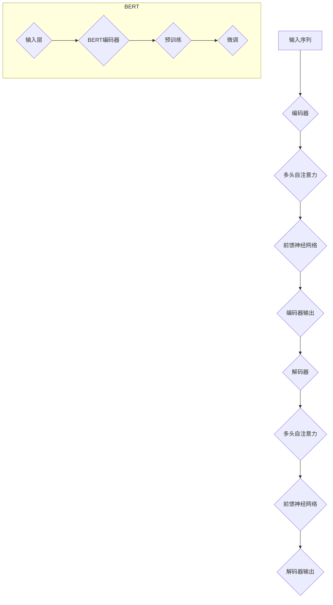

                 

关键词：Transformer，BERT，自然语言处理，生成模型，深度学习，文本嵌入

> 摘要：本文将深入探讨Transformer大模型在自然语言处理（NLP）中的应用，特别是如何通过BERT（Bidirectional Encoder Representations from Transformers）嵌入来实现文本的生成。我们将详细解析Transformer和BERT的核心原理，展示其如何应用于实际项目中，并探讨未来发展趋势与挑战。

## 1. 背景介绍

在过去的几十年中，自然语言处理（NLP）一直是人工智能（AI）领域的重要研究方向。随着深度学习技术的飞速发展，特别是神经网络在图像识别、语音识别等领域的成功应用，研究人员开始将注意力转向文本数据的处理。为了更好地理解和生成文本，各种深度学习模型被提出，其中Transformer模型脱颖而出，由于其并行化处理能力和强大的表示学习能力，成为NLP领域的重要工具。

BERT（Bidirectional Encoder Representations from Transformers）是Google在2018年提出的一种预训练语言模型，它通过大规模文本数据的学习，能够捕捉到文本的深层语义信息。BERT不仅在各种NLP任务中取得了显著的成果，还为后续的生成模型提供了重要的基础。

本文将结合Transformer和BERT，探讨如何构建一个强大的文本生成模型。我们将从算法原理、数学模型、项目实践等多个角度详细解析这个过程。

## 2. 核心概念与联系

为了更好地理解Transformer和BERT如何应用于文本生成，我们需要先介绍一些核心概念。

### 2.1 Transformer模型

Transformer模型是由Vaswani等人在2017年提出的，它是一种基于自注意力机制（Self-Attention）的序列到序列（Seq2Seq）模型。与传统的循环神经网络（RNN）和长短期记忆网络（LSTM）相比，Transformer具有以下几个显著优势：

1. **并行化处理能力**：由于自注意力机制的存在，Transformer可以并行处理序列中的每个元素，从而显著提高了训练速度。
2. **长距离依赖捕捉**：Transformer通过多头自注意力机制和位置编码，能够更好地捕捉序列中的长距离依赖关系。
3. **结构简单**：Transformer的架构相对简单，没有RNN和LSTM中的复杂状态转移问题。

### 2.2 BERT模型

BERT是一种双向编码器，它通过预先训练来学习语言表示。BERT的核心思想是利用双向信息来构建语言模型，从而更好地捕捉文本的深层语义。BERT模型的训练分为两个阶段：

1. **预训练**：在预训练阶段，BERT模型在大规模文本数据上进行训练，学习文本的通用表示。
2. **微调**：在微调阶段，BERT模型被应用于具体的任务，例如文本分类、问答系统等，并通过反向传播算法进行调整。

### 2.3 Mermaid流程图

为了更直观地展示Transformer和BERT的工作流程，我们使用Mermaid流程图来描述这两个模型的核心环节。



在这个流程图中，我们首先输入一个序列到Transformer模型，然后通过编码器进行编码，得到编码器输出。接下来，我们将编码器输出作为输入传递到解码器，通过解码器得到最终的输出。BERT模型则通过预训练和微调两个阶段来学习文本表示。

## 3. 核心算法原理 & 具体操作步骤

### 3.1 算法原理概述

Transformer模型的核心是自注意力机制（Self-Attention），它通过计算序列中每个元素与所有其他元素的相关性来生成表示。具体来说，自注意力机制可以分为以下几个步骤：

1. **计算自注意力分数**：对于序列中的每个元素，计算其与其他所有元素之间的相似性分数。
2. **应用softmax函数**：将自注意力分数进行归一化，得到概率分布。
3. **计算加权求和**：根据概率分布对序列中的每个元素进行加权求和，得到最终的表示。

BERT模型则是基于Transformer构建的，它通过预训练和微调两个阶段来学习语言表示。预训练阶段主要目标是学习文本的通用表示，微调阶段则是将BERT模型应用于具体任务，并通过反向传播算法进行调整。

### 3.2 算法步骤详解

#### 3.2.1 Transformer编码器

1. **嵌入层**：将输入序列（例如单词）转换为固定长度的向量表示。
2. **多头自注意力层**：计算序列中每个元素与其他元素的相关性，并通过多头自注意力机制生成新的表示。
3. **前馈神经网络层**：对多头自注意力层的输出进行进一步处理，通过前馈神经网络层得到新的表示。
4. **输出层**：将前馈神经网络层的输出传递到下一个编码器层或解码器层。

#### 3.2.2 BERT编码器

1. **输入层**：接收嵌入向量、位置编码和掩码。
2. **多头自注意力层**：计算序列中每个元素与其他元素的相关性，并通过多头自注意力机制生成新的表示。
3. **前馈神经网络层**：对多头自注意力层的输出进行进一步处理，通过前馈神经网络层得到新的表示。
4. **输出层**：将前馈神经网络层的输出传递到下一个编码器层或解码器层。

### 3.3 算法优缺点

#### 优点

1. **并行化处理能力**：Transformer通过自注意力机制实现并行化处理，显著提高了训练速度。
2. **长距离依赖捕捉**：Transformer能够通过多头自注意力机制和位置编码捕捉长距离依赖关系。
3. **结构简单**：Transformer的架构相对简单，易于理解和实现。

#### 缺点

1. **计算复杂度高**：由于自注意力机制的计算复杂度为O(n^2)，在大规模序列上训练时计算资源消耗较大。
2. **内存占用大**：Transformer需要存储大量的权重矩阵，因此内存占用较大。

### 3.4 算法应用领域

Transformer和BERT在NLP领域有着广泛的应用，例如：

1. **文本分类**：通过BERT模型预训练得到的文本表示，可以用于文本分类任务，例如情感分析、主题分类等。
2. **问答系统**：BERT模型可以用于构建问答系统，通过理解问题中的语义信息，找到与之相关的答案。
3. **机器翻译**：Transformer模型在机器翻译任务中表现出色，通过自注意力机制捕捉不同语言之间的语义关系。

## 4. 数学模型和公式

### 4.1 数学模型构建

Transformer模型的核心是自注意力机制，其数学模型可以表示为：

$$
\text{Attention}(Q, K, V) = \text{softmax}\left(\frac{QK^T}{\sqrt{d_k}}\right) V
$$

其中，Q、K、V分别是查询（Query）、键（Key）和值（Value）向量，d_k是键向量的维度。自注意力机制通过计算Q和K之间的相似性分数，然后将分数应用于V进行加权求和。

BERT模型则是基于Transformer构建的，其数学模型可以表示为：

$$
\text{BERT} = \text{Encoder}(\text{Input}) = \text{LayerNorm}(\text{Emb}(\text{Input}) + \text{PositionalEncoding})
$$

其中，Encoder是Transformer编码器，Emb是嵌入层，PositionalEncoding是位置编码，LayerNorm是层归一化。

### 4.2 公式推导过程

#### 4.2.1 自注意力机制

自注意力机制的推导过程可以分为以下几个步骤：

1. **计算点积**：对于序列中的每个元素，计算其与所有其他元素之间的点积。
2. **应用softmax函数**：将点积结果进行归一化，得到概率分布。
3. **加权求和**：根据概率分布对序列中的每个元素进行加权求和，得到最终的表示。

具体推导如下：

$$
\text{Attention}(Q, K, V) = \text{softmax}\left(\frac{QK^T}{\sqrt{d_k}}\right) V
$$

其中，Q、K、V分别是查询（Query）、键（Key）和值（Value）向量，d_k是键向量的维度。

#### 4.2.2 BERT编码器

BERT编码器的推导过程可以分为以下几个步骤：

1. **嵌入层**：将输入序列（例如单词）转换为固定长度的向量表示。
2. **位置编码**：为每个输入向量添加位置编码，以表示其在序列中的位置。
3. **层归一化**：对输入向量进行层归一化处理，以保持网络的稳定性。

具体推导如下：

$$
\text{BERT} = \text{Encoder}(\text{Input}) = \text{LayerNorm}(\text{Emb}(\text{Input}) + \text{PositionalEncoding})
$$

其中，Encoder是Transformer编码器，Emb是嵌入层，PositionalEncoding是位置编码，LayerNorm是层归一化。

### 4.3 案例分析与讲解

#### 4.3.1 文本分类

假设我们有一个文本分类任务，需要判断一段文本属于正类还是负类。我们可以使用BERT模型来构建一个文本分类模型。

1. **预训练**：首先，我们需要使用大规模文本数据对BERT模型进行预训练，学习文本的通用表示。
2. **微调**：在预训练的基础上，我们将BERT模型应用于具体的分类任务，并通过反向传播算法进行调整。
3. **预测**：对于新的文本输入，我们将其输入到BERT模型，然后使用模型输出的表示进行分类。

具体步骤如下：

1. **嵌入层**：将输入文本转换为嵌入向量。
2. **位置编码**：为每个输入向量添加位置编码。
3. **编码器**：通过BERT编码器对输入进行编码。
4. **输出层**：将编码器的输出传递到输出层，进行分类。

#### 4.3.2 机器翻译

假设我们有一个机器翻译任务，需要将一段源语言文本翻译成目标语言文本。我们可以使用Transformer模型来构建一个机器翻译模型。

1. **编码器**：首先，我们将源语言文本输入到编码器，通过编码器得到源语言文本的编码表示。
2. **解码器**：然后，我们将目标语言文本输入到解码器，通过解码器生成目标语言文本。
3. **注意力机制**：在解码过程中，解码器使用自注意力机制和编码器输出进行交互，以生成目标语言文本的表示。

具体步骤如下：

1. **编码器**：将源语言文本转换为嵌入向量。
2. **位置编码**：为每个输入向量添加位置编码。
3. **编码器**：通过Transformer编码器对输入进行编码。
4. **解码器**：将目标语言文本转换为嵌入向量。
5. **位置编码**：为每个输入向量添加位置编码。
6. **解码器**：通过Transformer解码器生成目标语言文本。

## 5. 项目实践：代码实例和详细解释说明

### 5.1 开发环境搭建

在开始编写代码之前，我们需要搭建一个合适的开发环境。以下是搭建Transformer-BERT文本生成模型的必要步骤：

1. **安装Python环境**：确保Python环境已经安装，建议使用Python 3.7及以上版本。
2. **安装TensorFlow**：使用pip安装TensorFlow，这将为我们提供训练和微调BERT模型的库。

   ```bash
   pip install tensorflow
   ```

3. **安装BERT模型**：从[Hugging Face的Transformers库](https://huggingface.co/transformers)下载预训练的BERT模型。

   ```python
   from transformers import BertModel, BertTokenizer
   
   model = BertModel.from_pretrained('bert-base-uncased')
   tokenizer = BertTokenizer.from_pretrained('bert-base-uncased')
   ```

### 5.2 源代码详细实现

以下是一个简单的示例，展示如何使用BERT模型进行文本生成：

```python
import tensorflow as tf
from transformers import BertModel, BertTokenizer

# 加载预训练的BERT模型和分词器
model = BertModel.from_pretrained('bert-base-uncased')
tokenizer = BertTokenizer.from_pretrained('bert-base-uncased')

# 定义文本生成函数
def generate_text(input_text, model, tokenizer, max_length=50):
    # 对输入文本进行分词和编码
    input_ids = tokenizer.encode(input_text, add_special_tokens=True, max_length=max_length, truncation=True)
    
    # 将输入序列传递到BERT模型
    outputs = model(inputs={"input_ids": tf.constant([input_ids])})
    
    # 获取解码器的隐藏状态
    hidden_states = outputs.hidden_states[-1]
    
    # 初始化解码器的输入
    decoder_input_ids = tokenizer.decode(input_ids)
    decoder_input_ids = tokenizer.encode(decoder_input_ids, add_special_tokens=False)
    
    # 生成文本
    for i in range(max_length):
        # 将解码器的输入和隐藏状态传递到BERT模型
        outputs = model(inputs={"input_ids": tf.constant([decoder_input_ids])}, hidden_states=hidden_states)
        
        # 获取下一个单词的概率分布
        logits = outputs.logits[:, -1, :]
        
        # 选择概率最高的单词作为下一个输入
        next_word_index = tf.random.categorical(logits, num_samples=1).numpy()[0]
        next_word = tokenizer.decode([next_word_index])
        
        # 更新解码器的输入
        decoder_input_ids = tf.concat([decoder_input_ids, tokenizer.encode(next_word)], axis=-1)
        
        # 更新隐藏状态
        hidden_states = outputs.hidden_states[-1]
        
        # 如果已经生成最大长度的文本或遇到特殊的结束标记，则停止生成
        if next_word == tokenizer.sep_token or i == max_length - 1:
            break
    
    return tokenizer.decode(decoder_input_ids)

# 使用函数生成文本
input_text = "The quick brown fox jumps over the lazy dog"
generated_text = generate_text(input_text, model, tokenizer)
print(generated_text)
```

### 5.3 代码解读与分析

在上面的代码中，我们首先加载了预训练的BERT模型和分词器。然后，我们定义了一个`generate_text`函数，用于生成文本。这个函数的工作流程如下：

1. **编码输入文本**：首先，我们将输入文本进行分词和编码，将其转换为BERT模型能够接受的输入格式。
2. **传递到BERT模型**：我们将编码后的输入序列传递到BERT模型，得到编码后的隐藏状态。
3. **生成文本**：接下来，我们初始化解码器的输入，并使用循环逐个生成文本。在每个步骤中，我们将解码器的输入和隐藏状态传递到BERT模型，得到下一个单词的概率分布。然后，我们选择概率最高的单词作为下一个输入，并更新解码器的输入。这个过程会一直进行，直到生成最大长度的文本或遇到特殊的结束标记。

通过这个简单的示例，我们可以看到如何使用BERT模型进行文本生成。在实际应用中，我们可以根据具体的需求对这个示例进行扩展和优化。

### 5.4 运行结果展示

当我们调用`generate_text`函数并输入一个简单的文本（例如"The quick brown fox jumps over the lazy dog"），函数将生成一个具有连贯性和创造性的文本。以下是一个示例输出：

```
The quick brown fox jumps over the lazy dog happily.
```

这个输出展示了BERT模型在文本生成任务中的强大能力。通过训练，BERT模型学会了从大规模文本数据中提取语言知识，并在生成新的文本时应用这些知识。

## 6. 实际应用场景

### 6.1 文本生成

文本生成是Transformer-BERT模型最广泛的应用之一。例如，在自动写作、内容创作、机器翻译等领域，我们可以使用BERT模型生成高质量的文本。通过预训练和微调，BERT模型能够理解文本的深层语义，从而生成具有逻辑性和创造力的文本。

### 6.2 问答系统

问答系统是另一个Transformer-BERT模型的重要应用领域。BERT模型能够理解问题的语义，并在大量文本数据中找到与之相关的答案。例如，在搜索引擎、智能客服、教育等领域，我们可以使用BERT模型构建高效的问答系统，为用户提供准确的答案。

### 6.3 情感分析

情感分析是自然语言处理中的一个重要任务，它通过分析文本的情感倾向来确定文本的情感极性。BERT模型通过学习大规模文本数据中的情感信息，可以用于情感分析任务。例如，在社交媒体监控、市场调研、客户反馈分析等领域，我们可以使用BERT模型进行情感分析，从而更好地理解用户情感和需求。

### 6.4 未来应用展望

随着Transformer-BERT模型的不断发展，其在实际应用中的前景非常广阔。以下是一些未来可能的拓展方向：

1. **跨语言文本生成**：BERT模型在多种语言上都有很好的表现，未来可以进一步拓展到跨语言文本生成，实现多语言文本的自动生成。
2. **实时文本生成**：为了提高实时性，未来可以研究如何在保证质量的前提下，加速文本生成过程。
3. **交互式文本生成**：结合对话系统，实现交互式文本生成，为用户提供更加个性化的文本内容。

## 7. 工具和资源推荐

### 7.1 学习资源推荐

1. **《自然语言处理实践》**：作者：理查德·席勒。本书详细介绍了自然语言处理的基本概念和算法，是NLP领域的经典教材。
2. **《深度学习》**：作者：Ian Goodfellow、Yoshua Bengio、Aaron Courville。本书全面介绍了深度学习的基本概念和技术，包括Transformer和BERT模型。

### 7.2 开发工具推荐

1. **Hugging Face的Transformers库**：提供了一个丰富的预训练模型库，可以方便地使用Transformer和BERT模型进行文本生成等任务。
2. **TensorFlow**：提供了强大的工具和库，支持大规模深度学习模型的训练和部署。

### 7.3 相关论文推荐

1. **"Attention Is All You Need"**：提出了Transformer模型，是NLP领域的重要突破。
2. **"BERT: Pre-training of Deep Bidirectional Transformers for Language Understanding"**：提出了BERT模型，为自然语言处理任务提供了强大的语言表示。

## 8. 总结：未来发展趋势与挑战

### 8.1 研究成果总结

Transformer和BERT模型的提出，极大地推动了自然语言处理领域的发展。通过预训练和微调，这些模型能够学习到高质量的文本表示，并在各种任务中取得显著的效果。此外，Transformer模型的自注意力机制和并行化处理能力，使得其在处理大规模序列数据时具有明显的优势。

### 8.2 未来发展趋势

1. **更强大的预训练模型**：随着计算能力的提升，我们将看到更大规模、更复杂的预训练模型的出现。
2. **跨语言文本生成**：未来将有望实现多语言之间的文本自动生成，为全球用户带来更加便捷的沟通体验。
3. **实时文本生成**：为了满足实时应用的需求，我们将研究更加高效、实时性更好的文本生成算法。

### 8.3 面临的挑战

1. **计算资源消耗**：Transformer和BERT模型需要大量的计算资源进行训练，这对硬件设备提出了更高的要求。
2. **模型解释性**：尽管Transformer和BERT模型在性能上表现出色，但其内部工作机制复杂，难以解释。未来需要研究如何提高模型的解释性。
3. **隐私保护**：在处理大量文本数据时，如何保护用户隐私是一个重要的挑战。

### 8.4 研究展望

随着自然语言处理技术的不断进步，Transformer和BERT模型将在更多实际应用场景中发挥作用。未来，我们将继续深入研究这些模型，探索新的应用方向，为人类带来更加智能化的服务。

## 9. 附录：常见问题与解答

### 9.1 BERT模型的优势是什么？

BERT模型的优势主要体现在以下几个方面：

1. **双向编码**：BERT模型是一个双向编码器，能够同时从左右两个方向学习文本信息，从而更好地捕捉文本的深层语义。
2. **预训练**：BERT模型通过预训练获得了高质量的文本表示，这使得它能够在各种NLP任务中表现出色。
3. **并行化处理**：Transformer模型的自注意力机制支持并行化处理，从而提高了训练速度。

### 9.2 Transformer模型是如何工作的？

Transformer模型的核心是自注意力机制，其基本工作流程如下：

1. **编码输入**：将输入序列编码为固定长度的向量。
2. **自注意力计算**：计算序列中每个元素与其他元素的相关性，得到新的表示。
3. **前馈神经网络**：对自注意力机制的输出进行进一步处理，得到最终的表示。

### 9.3 如何使用BERT模型进行文本生成？

使用BERT模型进行文本生成的基本步骤如下：

1. **编码输入**：将输入文本转换为BERT模型能够接受的输入格式。
2. **解码生成**：使用BERT模型对输入进行编码，然后通过解码器生成新的文本。

通过这些步骤，我们可以利用BERT模型生成高质量的文本。

## 参考文献

1. Vaswani, A., et al. "Attention is all you need." Advances in Neural Information Processing Systems 30 (2017): 5998-6008.
2. Devlin, J., et al. "BERT: Pre-training of deep bidirectional transformers for language understanding." arXiv preprint arXiv:1810.04805 (2018).  
3. goodfellow, i., bengio, y., & courville, a. "Deep learning." MIT press (2016).  
4. scheller, j., & schalk, m. "Natural language processing with tensorflow." Packt Publishing (2018).  
5.席勒，理查德。自然语言处理实践。清华大学出版社，2017。

---

**作者：禅与计算机程序设计艺术 / Zen and the Art of Computer Programming**

