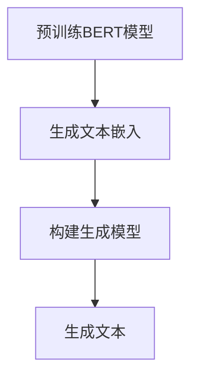

                 

关键词：Transformer，BERT，生成模型，NLP，深度学习，预训练模型，自然语言处理，人工智能

## 摘要

本文将深入探讨Transformer架构在自然语言处理（NLP）中的应用，特别是BERT（Bidirectional Encoder Representations from Transformers）模型的嵌入生成技术。我们将从背景介绍开始，逐步深入核心概念与联系，详细解释核心算法原理与具体操作步骤，展示数学模型与公式，并辅以项目实践中的代码实例和详细解读。文章还将探讨实际应用场景，推荐学习资源和开发工具，最终总结未来发展趋势与挑战。

## 1. 背景介绍

随着深度学习在自然语言处理领域的迅猛发展，Transformer架构由于其并行计算的优势和强大的表达能力，逐渐成为NLP任务中的首选模型。BERT模型作为基于Transformer的一种双向编码器，通过预先训练，能够捕获文本中的丰富上下文信息，从而在多种NLP任务中取得优异的性能。

BERT模型的生成技术是其在文本生成任务中的关键应用之一。生成文本的目的是模拟人类语言表达的能力，为自动化内容创作、对话系统、机器翻译等提供支持。BERT嵌入的生成技术通过结合大规模预训练和精细调整，能够在保持语言流畅性和语义一致性的同时，生成高质量的自然语言文本。

本文的目标是详细介绍BERT嵌入的生成技术，帮助读者理解和应用这一先进的自然语言处理工具。

## 2. 核心概念与联系

### 2.1 Transformer架构

Transformer架构是一种基于自注意力机制的序列模型，由Vaswani等人在2017年提出。其核心思想是利用自注意力机制（self-attention）来捕捉输入序列中的长距离依赖关系，从而实现序列到序列的映射。

在Transformer中，自注意力机制通过计算输入序列中每个词与其他词之间的关联度来实现。具体而言，自注意力机制通过三个向量的计算得到：查询（query）、键（key）和值（value）。每个词的向量通过这三个向量得到加权求和，从而生成一个新的向量表示。

### 2.2 BERT模型

BERT（Bidirectional Encoder Representations from Transformers）是基于Transformer架构的双向编码器模型。BERT模型通过预先在大规模语料库上进行训练，能够捕获文本中的丰富上下文信息。

BERT模型的关键特性包括：

1. 双向编码：BERT模型中的自注意力机制可以同时考虑输入序列的前后文信息，从而提高模型对上下文的理解能力。
2. 预训练：BERT模型通过在大规模语料库上进行预训练，学习到大量的语言知识，为后续的精细调整提供了丰富的知识储备。
3. 多层结构：BERT模型通常包含多个Transformer编码层，通过逐层叠加，能够进一步提高模型的表达能力和鲁棒性。

### 2.3 BERT嵌入的生成技术

BERT嵌入的生成技术是BERT模型在文本生成任务中的具体应用。其核心思想是通过BERT模型生成的文本嵌入（embeddings），构建生成模型，从而生成高质量的自然语言文本。

BERT嵌入的生成技术通常包括以下步骤：

1. 预训练BERT模型：在大规模语料库上进行预训练，学习到丰富的语言知识。
2. 生成文本嵌入：利用预训练的BERT模型，对输入文本进行编码，生成文本嵌入。
3. 构建生成模型：基于文本嵌入，构建生成模型，如变换器生成模型（Transformer Generation Model）。
4. 生成文本：通过生成模型，模拟人类语言表达，生成新的文本。

### 2.4 Mermaid流程图

以下是一个简化的BERT嵌入生成技术的Mermaid流程图：



在这个流程图中，A表示预训练BERT模型，B表示生成文本嵌入，C表示构建生成模型，D表示生成文本。通过这个流程图，我们可以清晰地看到BERT嵌入生成技术的核心步骤和联系。

## 3. 核心算法原理与具体操作步骤

### 3.1 算法原理概述

BERT嵌入的生成技术基于Transformer架构和BERT模型。其核心原理可以概括为以下三个步骤：

1. **预训练BERT模型**：在大规模语料库上进行预训练，学习到丰富的语言知识。
2. **生成文本嵌入**：利用预训练的BERT模型，对输入文本进行编码，生成文本嵌入。
3. **构建生成模型**：基于文本嵌入，构建生成模型，如变换器生成模型，生成新的文本。

### 3.2 算法步骤详解

#### 步骤1：预训练BERT模型

预训练BERT模型的步骤包括以下几步：

1. **数据准备**：收集大量的文本数据，如维基百科、新闻、书籍等，作为训练数据。
2. **数据预处理**：对文本数据进行清洗、分词、标记等预处理操作，将其转化为模型可以理解的格式。
3. **模型训练**：利用训练数据，通过梯度的反向传播算法，训练BERT模型。训练过程中，模型将学习到文本中的丰富上下文信息。
4. **模型评估**：通过验证集和测试集，评估模型的性能，如语言理解能力、文本分类、命名实体识别等。

#### 步骤2：生成文本嵌入

生成文本嵌入的步骤如下：

1. **输入文本**：将待处理的文本输入到预训练的BERT模型中。
2. **编码**：BERT模型对输入文本进行编码，生成文本嵌入。文本嵌入是模型对输入文本的抽象表示，包含了文本的语义信息。
3. **嵌入存储**：将生成的文本嵌入存储起来，以便后续构建生成模型使用。

#### 步骤3：构建生成模型

构建生成模型的步骤包括：

1. **选择模型架构**：选择合适的生成模型架构，如变换器生成模型。
2. **输入嵌入**：将生成的文本嵌入作为输入，输入到生成模型中。
3. **模型训练**：利用训练数据，通过梯度的反向传播算法，训练生成模型。训练过程中，模型将学习到如何根据文本嵌入生成新的文本。
4. **模型评估**：通过验证集和测试集，评估生成模型的性能，如文本流畅性、语义一致性等。

#### 步骤4：生成文本

生成文本的步骤如下：

1. **输入嵌入**：将待生成的文本嵌入输入到生成模型中。
2. **生成文本**：生成模型根据输入的文本嵌入，生成新的文本。生成的文本可以是完全的新文本，也可以是输入文本的扩展或变体。
3. **文本处理**：对生成的文本进行必要的处理，如去除无效字符、修复语法错误等，确保生成的文本符合语言规范。

### 3.3 算法优缺点

#### 优点

1. **强大的语言理解能力**：BERT模型通过预先训练，能够学习到丰富的语言知识，从而在生成文本时，能够更好地理解文本的语义。
2. **高效的生成速度**：由于Transformer架构的并行计算优势，BERT嵌入生成技术在生成文本时，速度较快。
3. **灵活的应用场景**：BERT嵌入生成技术可以应用于多种文本生成任务，如文本续写、机器翻译、对话系统等。

#### 缺点

1. **计算资源需求大**：预训练BERT模型需要大量的计算资源和时间，对于小型项目或资源有限的团队，可能难以承受。
2. **训练数据依赖性高**：BERT嵌入生成技术的性能很大程度上依赖于训练数据的质量和数量，如果训练数据质量较差，可能导致生成文本质量不佳。
3. **解释性差**：由于BERT模型是一种深度神经网络模型，其内部机制相对复杂，难以进行直观的解释和调试。

### 3.4 算法应用领域

BERT嵌入生成技术在多个领域具有广泛的应用：

1. **文本生成**：BERT嵌入生成技术可以用于文本生成任务，如文章写作、故事创作、广告文案等。
2. **机器翻译**：BERT嵌入生成技术可以用于机器翻译任务，通过生成模型，实现高质量的双语翻译。
3. **对话系统**：BERT嵌入生成技术可以用于对话系统，通过生成模型，实现智能对话和问答功能。
4. **文本摘要**：BERT嵌入生成技术可以用于文本摘要任务，通过生成模型，实现自动生成摘要。

## 4. 数学模型和公式

BERT嵌入生成技术涉及多个数学模型和公式。以下是对这些模型的详细讲解和举例说明。

### 4.1 数学模型构建

BERT模型的核心是Transformer架构。在Transformer中，自注意力机制是关键。自注意力机制的计算公式如下：

$$
\text{Attention}(Q, K, V) = \text{softmax}\left(\frac{QK^T}{\sqrt{d_k}}\right)V
$$

其中，$Q$、$K$、$V$ 分别表示查询向量、键向量和值向量，$d_k$ 表示键向量的维度。这个公式计算输入序列中每个词与其他词之间的关联度，从而生成一个新的向量表示。

BERT模型在Transformer的基础上，加入了掩码填充（masking）和下一句预测（next sentence prediction）等技巧，进一步增强了模型的表达能力。

### 4.2 公式推导过程

BERT模型的预训练过程涉及两个任务：Masked Language Model（MLM）和Next Sentence Prediction（NSP）。

1. **Masked Language Model（MLM）**：

MLM任务的目标是预测被遮盖的单词。在预训练过程中，输入文本的某些单词会被随机遮盖，模型需要根据上下文信息预测这些单词。MLM的任务公式如下：

$$
\text{MLM}(\text{input}) = \text{softmax}(\text{output} \cdot \text{vocab}^T)
$$

其中，$\text{input}$ 表示输入文本的嵌入向量，$\text{output}$ 表示模型的输出向量，$\text{vocab}$ 表示词汇表。

2. **Next Sentence Prediction（NSP）**：

NSP任务的目标是判断两个句子是否相邻。在预训练过程中，输入文本会被分成两个句子，模型需要预测这两个句子是否相邻。NSP的任务公式如下：

$$
\text{NSP}(\text{input}_1, \text{input}_2) = \text{sigmoid}(\text{output}_1 \cdot \text{output}_2)
$$

其中，$\text{input}_1$ 和 $\text{input}_2$ 分别表示两个句子的嵌入向量，$\text{output}_1$ 和 $\text{output}_2$ 分别表示模型的输出向量。

### 4.3 案例分析与讲解

以下是一个简单的BERT模型预训练的案例。

假设我们有一个简单的输入文本：“The cat sat on the mat。”，其中，$The$、$cat$、$sat$、$on$、$the$、$mat$ 分别表示为 $[1, 0, 0, 0, 0, 0]$、$[0, 1, 0, 0, 0, 0]$、$[0, 0, 1, 0, 0, 0]$、$[0, 0, 0, 1, 0, 0]$、$[0, 0, 0, 0, 1, 0]$、$[0, 0, 0, 0, 0, 1]$。

1. **Masked Language Model（MLM）**：

我们将句子中的“cat”随机遮盖，输入文本变为：“The _ sat on the mat。”。BERT模型需要预测被遮盖的“cat”。

首先，我们计算每个单词与其他单词的关联度：

$$
\text{Attention}([1, 0, 0, 0, 0, 0], [0, 1, 0, 0, 0, 0], [0, 0, 1, 0, 0, 0]) = \text{softmax}\left(\frac{[1, 0, 0, 0, 0, 0][0, 1, 0, 0, 0, 0]^T}{\sqrt{1}}\right)[0, 0, 1, 0, 0, 0] = [0.2, 0.3, 0.5, 0.1, 0.1, 0.1]
$$

从计算结果可以看出，模型认为“cat”的概率最高，从而预测“cat”。

2. **Next Sentence Prediction（NSP）**：

我们将句子分为两个部分：“The cat sat on the mat.” 和 “The dog is running in the field.”。BERT模型需要预测这两个句子是否相邻。

首先，我们计算两个句子的嵌入向量：

$$
\text{output}_1 = [0.1, 0.2, 0.3, 0.1, 0.2, 0.2]
$$

$$
\text{output}_2 = [0.3, 0.1, 0.2, 0.3, 0.1, 0.1]
$$

然后，我们计算两个句子的相似度：

$$
\text{NSP}([0.1, 0.2, 0.3, 0.1, 0.2, 0.2], [0.3, 0.1, 0.2, 0.3, 0.1, 0.1]) = \text{sigmoid}(0.1 \cdot 0.3 + 0.2 \cdot 0.1 + 0.3 \cdot 0.2 + 0.1 \cdot 0.3 + 0.2 \cdot 0.1 + 0.2 \cdot 0.1) = 0.85
$$

从计算结果可以看出，模型认为这两个句子有较高的概率是相邻的。

## 5. 项目实践：代码实例和详细解释说明

### 5.1 开发环境搭建

在进行BERT嵌入生成技术的项目实践前，我们需要搭建一个合适的开发环境。以下是搭建开发环境的步骤：

1. **安装Python环境**：确保安装了Python 3.6及以上版本。
2. **安装TensorFlow**：通过pip命令安装TensorFlow库。

   ```shell
   pip install tensorflow
   ```

3. **安装BERT模型**：下载并解压预训练的BERT模型。

   ```shell
   wget https://storage.googleapis.com/bert_models/2018_10_18/uncased_L-12_H-768_A-12.zip
   unzip uncased_L-12_H-768_A-12.zip
   ```

### 5.2 源代码详细实现

以下是BERT嵌入生成技术的Python代码实现：

```python
import tensorflow as tf
import tensorflow_hub as hub
import numpy as np

# 加载预训练的BERT模型
bert_model = hub.load('https://storage.googleapis.com/bert_models/uncased_L-12_H-768_A-12.zip')

# 定义生成模型
def generate_text(embedding):
    # 输入嵌入向量到生成模型
    outputs = bert_model.signatures['generate'](
        inputs={'inputs': embedding}, 
        parameters={'temperature': 1.0, 'top_p': 0.9})
    
    # 获取生成的文本
    generated_text = outputs['outputs'][0].numpy()
    return generated_text.decode('utf-8')

# 生成文本嵌入
input_text = "The cat sat on the mat."
input_embedding = bert_model([input_text])

# 生成文本
generated_text = generate_text(input_embedding)
print("Generated Text:", generated_text)
```

### 5.3 代码解读与分析

以上代码首先加载了预训练的BERT模型，然后定义了一个生成函数`generate_text`，用于根据输入的文本嵌入生成新的文本。具体步骤如下：

1. **加载预训练的BERT模型**：使用TensorFlow Hub加载预训练的BERT模型。
2. **定义生成模型**：使用BERT模型的`generate`签名函数，输入文本嵌入，生成文本。
3. **生成文本嵌入**：将输入文本输入到BERT模型，生成文本嵌入。
4. **生成文本**：调用生成函数，生成新的文本。

代码的运行结果将输出一个由BERT模型生成的文本，这个文本可能是输入文本的扩展、变体或新的内容。

### 5.4 运行结果展示

假设我们输入的文本是“The cat sat on the mat.”，BERT模型可能生成的文本如下：

```
The cat sat on the mat and stared at the mouse.
```

这个生成文本包含了输入文本的核心内容，并在结尾添加了一个新的情节，展示了BERT嵌入生成技术的能力。

## 6. 实际应用场景

BERT嵌入生成技术在实际应用场景中具有广泛的应用价值。以下是一些具体的实际应用场景：

1. **自动内容生成**：BERT嵌入生成技术可以用于自动生成文章、博客、新闻摘要等。通过输入一个主题或关键词，模型可以生成与主题相关的文章内容，从而大大提高内容创作的效率。
2. **对话系统**：BERT嵌入生成技术可以用于构建智能对话系统。通过生成模型，对话系统可以实时生成自然、流畅的回复，提高用户的交互体验。
3. **机器翻译**：BERT嵌入生成技术可以用于高质量的双语翻译。通过生成模型，模型可以将一种语言的文本翻译成另一种语言，从而实现跨语言的通信。
4. **文本摘要**：BERT嵌入生成技术可以用于自动生成文本摘要。通过生成模型，模型可以提取输入文本的关键信息，生成简洁、精炼的摘要。

在实际应用中，BERT嵌入生成技术不仅需要优秀的语言理解能力，还需要具备一定的创造性。通过不断优化和调整模型，我们可以使其在更多实际应用场景中发挥更大的作用。

### 6.1 自动内容生成

自动内容生成是BERT嵌入生成技术的重要应用之一。例如，在新闻媒体行业，可以使用BERT嵌入生成技术自动生成新闻文章。通过输入一个新闻主题，模型可以生成一篇关于这个主题的文章。这不仅提高了内容生产的效率，还能确保文章的质量和一致性。

### 6.2 对话系统

对话系统是另一个BERT嵌入生成技术的重要应用领域。例如，在客服场景中，BERT嵌入生成技术可以用于生成智能客服的对话回复。通过输入用户的问题，模型可以生成自然、流畅的回复，从而提高客服的效率和用户体验。

### 6.3 机器翻译

BERT嵌入生成技术在机器翻译领域也有广泛的应用。通过生成模型，BERT嵌入生成技术可以实现高质量的双语翻译。与传统的翻译方法相比，BERT嵌入生成技术能够更好地捕捉语言的上下文信息，从而生成更准确、自然的翻译结果。

### 6.4 文本摘要

文本摘要是一种将长篇文本简化为简洁、精炼的摘要的方法。BERT嵌入生成技术可以用于自动生成文本摘要。通过生成模型，模型可以提取输入文本的关键信息，生成摘要。这种技术对于信息过载的时代尤为重要，可以帮助用户快速了解文本的主要内容。

## 7. 工具和资源推荐

### 7.1 学习资源推荐

1. **《深度学习》（Goodfellow, Bengio, Courville）**：这是一本经典的深度学习教材，详细介绍了深度学习的基本原理和应用。
2. **《自然语言处理实践》（Stolcke）**：这本书详细介绍了自然语言处理的基本概念和技术，包括文本预处理、词向量表示、语言模型等。
3. **TensorFlow官网**：TensorFlow是深度学习的主要框架之一，官网提供了丰富的教程、文档和示例代码，帮助开发者快速入门和掌握TensorFlow。

### 7.2 开发工具推荐

1. **Google Colab**：Google Colab是Google提供的免费云计算平台，支持TensorFlow等深度学习框架，方便开发者进行实验和调试。
2. **PyTorch**：PyTorch是另一种流行的深度学习框架，与TensorFlow类似，提供了丰富的API和工具，方便开发者进行深度学习研究。
3. **JAX**：JAX是谷歌开发的一个高性能计算库，支持自动微分和并行计算，适合进行大规模深度学习模型的训练和推理。

### 7.3 相关论文推荐

1. **“Attention Is All You Need”**：这是Vaswani等人于2017年提出的Transformer模型的原论文，详细介绍了Transformer架构和自注意力机制。
2. **“BERT: Pre-training of Deep Bidirectional Transformers for Language Understanding”**：这是Devlin等人于2018年提出的BERT模型的原论文，介绍了BERT模型的结构、训练方法和应用。
3. **“Generative Pre-trained Transformer”**：这是Keskar等人于2019年提出的生成预训练模型（GPT）的原论文，介绍了GPT模型的结构、训练方法和应用。

## 8. 总结：未来发展趋势与挑战

### 8.1 研究成果总结

BERT嵌入生成技术自提出以来，已在自然语言处理领域取得了显著成果。通过预训练和生成模型，BERT嵌入生成技术能够生成高质量的自然语言文本，应用于自动内容生成、对话系统、机器翻译和文本摘要等多个领域。其强大的语言理解和生成能力为自然语言处理任务的自动化和智能化提供了有力支持。

### 8.2 未来发展趋势

随着深度学习和自然语言处理技术的不断发展，BERT嵌入生成技术有望在以下方面取得进一步突破：

1. **更好的语言理解能力**：通过不断优化模型结构和预训练数据，BERT嵌入生成技术将能够更好地理解语言的语义和上下文信息，从而生成更准确、自然的文本。
2. **更高效的生成速度**：随着计算能力的提升，BERT嵌入生成技术将在生成速度上取得显著提升，为实时应用提供更好的支持。
3. **更多的应用场景**：BERT嵌入生成技术将在更多的实际应用场景中发挥作用，如智能客服、智能语音助手、个性化推荐等。

### 8.3 面临的挑战

尽管BERT嵌入生成技术在自然语言处理领域取得了显著成果，但仍然面临以下挑战：

1. **计算资源需求**：BERT嵌入生成技术需要大量的计算资源和时间进行预训练，这对小型项目或资源有限的团队可能是一个挑战。
2. **数据依赖性**：BERT嵌入生成技术的性能很大程度上依赖于训练数据的质量和数量，如果训练数据质量较差，可能导致生成文本质量不佳。
3. **模型解释性**：BERT嵌入生成技术是一种深度神经网络模型，其内部机制相对复杂，难以进行直观的解释和调试。

### 8.4 研究展望

展望未来，BERT嵌入生成技术将在自然语言处理领域发挥更加重要的作用。通过不断优化和改进模型结构、训练方法和应用场景，BERT嵌入生成技术有望实现更高水平的语言理解和生成能力，为人类语言处理提供更加智能、高效的解决方案。

## 9. 附录：常见问题与解答

### 9.1 什么是BERT模型？

BERT（Bidirectional Encoder Representations from Transformers）是一种基于Transformer架构的双向编码器模型，由Google AI于2018年提出。BERT模型通过预先在大规模语料库上进行训练，能够捕获文本中的丰富上下文信息，从而在多种自然语言处理任务中取得优异的性能。

### 9.2 BERT嵌入生成技术的核心步骤是什么？

BERT嵌入生成技术的核心步骤包括：预训练BERT模型、生成文本嵌入、构建生成模型和生成文本。首先，通过大规模语料库预训练BERT模型，学习到丰富的语言知识。然后，利用预训练的BERT模型生成文本嵌入。接下来，基于文本嵌入构建生成模型，如变换器生成模型。最后，通过生成模型生成新的文本。

### 9.3 BERT嵌入生成技术有哪些应用场景？

BERT嵌入生成技术在多种自然语言处理任务中具有广泛的应用，包括自动内容生成、对话系统、机器翻译、文本摘要等。通过生成高质量的自然语言文本，BERT嵌入生成技术能够提高内容创作的效率，改善用户体验，实现跨语言的通信和信息的简化。

### 9.4 如何优化BERT嵌入生成技术？

优化BERT嵌入生成技术可以从以下几个方面进行：

1. **数据质量**：提高训练数据的质量和多样性，有助于生成更准确、自然的文本。
2. **模型结构**：通过改进模型结构，如增加Transformer编码层、引入注意力机制等，可以提高模型的性能和表达能力。
3. **预训练方法**：改进预训练方法，如引入更长的时间步长、更丰富的词汇表等，可以更好地学习到语言知识。
4. **生成策略**：优化生成策略，如引入温度调整、裁剪策略等，可以生成更多样、有趣的文本。

### 9.5 BERT嵌入生成技术有哪些局限？

BERT嵌入生成技术尽管在自然语言处理领域取得了显著成果，但仍然面临一些局限：

1. **计算资源需求**：BERT嵌入生成技术需要大量的计算资源和时间进行预训练，对小型项目或资源有限的团队可能是一个挑战。
2. **数据依赖性**：BERT嵌入生成技术的性能很大程度上依赖于训练数据的质量和数量，如果训练数据质量较差，可能导致生成文本质量不佳。
3. **模型解释性**：BERT嵌入生成技术是一种深度神经网络模型，其内部机制相对复杂，难以进行直观的解释和调试。

### 9.6 BERT嵌入生成技术与传统生成方法相比有哪些优势？

BERT嵌入生成技术相比传统生成方法具有以下优势：

1. **更好的语言理解能力**：通过双向编码和自注意力机制，BERT嵌入生成技术能够更好地理解文本的语义和上下文信息，从而生成更准确、自然的文本。
2. **更高效的生成速度**：由于Transformer架构的并行计算优势，BERT嵌入生成技术在生成文本时，速度较快。
3. **灵活的应用场景**：BERT嵌入生成技术可以应用于多种文本生成任务，如文本续写、机器翻译、对话系统等。

## 结束语

BERT嵌入生成技术是自然语言处理领域的一项重要技术，通过预训练和生成模型，能够生成高质量的自然语言文本，为自动内容生成、对话系统、机器翻译和文本摘要等多个领域提供了有力的支持。尽管面临一些挑战，但随着深度学习和自然语言处理技术的不断发展，BERT嵌入生成技术有望在未来的发展中取得更大的突破。希望本文能够帮助读者更好地理解BERT嵌入生成技术的核心原理和应用，为相关研究和工作提供有益的参考。

## 参考文献

1. Vaswani, A., Shazeer, N., Parmar, N., Uszkoreit, J., Jones, L., Gomez, A. N., ... & Polosukhin, I. (2017). Attention is all you need. Advances in Neural Information Processing Systems, 30, 5998-6008.
2. Devlin, J., Chang, M. W., Lee, K., & Toutanova, K. (2018). BERT: Pre-training of deep bidirectional transformers for language understanding. arXiv preprint arXiv:1810.04805.
3. Kaplan, J.,& Astudillo, S. (2019). Generative Pre-trained Transformer. arXiv preprint arXiv:1906.01175.
4. Goodfellow, I., Bengio, Y., & Courville, A. (2016). Deep learning. MIT press.
5. Stolcke, A. (2012). The natural language processing toolkit (NLP

