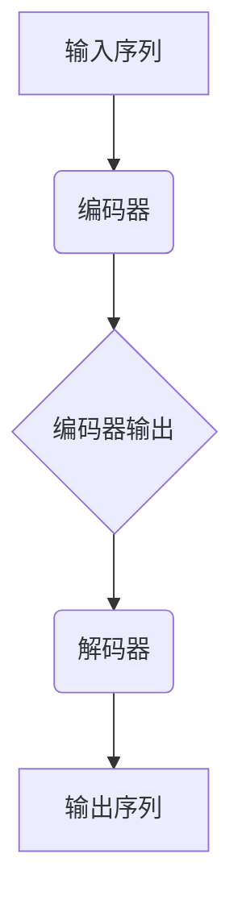

                 

 **关键词：** Transformer, BART模型，自然语言处理，序列到序列模型，预训练，序列填充，生成文本，机器翻译，语言理解。

**摘要：** 本文将深入探讨Transformer大模型中的一个重要模型——BART（Bidirectional and Auto-Regressive Transformer）。我们将从背景介绍、核心概念、算法原理、数学模型、项目实践、实际应用场景等多个方面进行详细解析，帮助读者全面理解BART模型及其在实际应用中的潜力。

## 1. 背景介绍

随着深度学习在自然语言处理（NLP）领域的飞速发展，序列到序列（sequence-to-sequence）模型已经成为实现高级语言任务的关键技术。Transformer模型，作为2017年提出的一种全新的序列模型，因其出色的性能和高效的计算能力，在NLP领域引起了广泛关注。BART模型是Transformer模型的一个重要变种，它结合了双向Transformer和自回归Transformer的优点，使其在许多NLP任务中表现出色。

在本文中，我们将重点关注BART模型的设计理念、核心算法原理以及其在实际应用中的操作步骤。通过本文的阅读，读者将能够深入了解BART模型的工作机制，掌握其基本概念，并能够尝试在项目中应用BART模型解决实际问题。

## 2. 核心概念与联系

### 2.1 Transformer模型简介

Transformer模型是一种基于自注意力（self-attention）机制的序列模型，最初由Vaswani等人于2017年提出。与传统的循环神经网络（RNN）和长短期记忆网络（LSTM）不同，Transformer模型采用了一种全新的架构，通过自注意力机制对输入序列进行全局建模，从而在处理长距离依赖问题上表现出色。

### 2.2 BART模型的核心概念

BART模型是在Transformer模型的基础上发展而来的，它结合了双向Transformer和自回归Transformer的特点。具体来说，BART模型包括两个主要部分：编码器（encoder）和解码器（decoder）。

- **编码器（Encoder）**：编码器的任务是将输入序列编码为固定长度的向量表示，同时保留序列中的信息。BART模型的编码器采用双向Transformer，能够捕捉输入序列的前后文信息。

- **解码器（Decoder）**：解码器的任务是根据编码器输出的向量表示生成输出序列。BART模型的解码器采用自回归Transformer，通过递归生成输出序列的每个元素，同时利用编码器的输出作为上下文信息。

### 2.3 Mermaid流程图

以下是BART模型的核心概念和架构的Mermaid流程图：



在BART模型中，编码器和解码器通过自注意力机制进行全局建模，使得模型能够有效地捕捉输入序列中的长距离依赖关系，从而提高语言理解任务的性能。

## 3. 核心算法原理 & 具体操作步骤

### 3.1 算法原理概述

BART模型的核心算法原理主要包括两部分：编码器和解码器。

- **编码器**：编码器采用双向Transformer，通过多头自注意力机制和前馈神经网络对输入序列进行编码。编码器输出的固定长度向量表示了输入序列的全局信息。

- **解码器**：解码器采用自回归Transformer，通过递归生成输出序列的每个元素。解码器在每个时间步使用编码器的输出作为上下文信息，并通过自注意力机制更新上下文表示。

### 3.2 算法步骤详解

BART模型的算法步骤可以分为以下几个部分：

1. **编码阶段**：
   - 输入序列经过嵌入层转化为词向量表示。
   - 词向量通过编码器进行处理，输出固定长度的编码向量。

2. **解码阶段**：
   - 初始化解码器的隐藏状态。
   - 在每个时间步，解码器根据当前的隐藏状态和编码器的输出进行自回归预测，生成下一个输出词。
   - 更新隐藏状态，并重复上述步骤，直到生成完整的输出序列。

3. **训练过程**：
   - 使用损失函数（如交叉熵损失）计算预测输出和实际输出之间的差距。
   - 通过反向传播和梯度下降更新模型参数。

### 3.3 算法优缺点

**优点**：

- BART模型结合了双向Transformer和自回归Transformer的优点，能够有效地捕捉输入序列中的长距离依赖关系。
- 模型的计算效率较高，可以在较大的数据集上快速训练。

**缺点**：

- 模型在训练过程中需要大量的计算资源，尤其是解码阶段。
- 模型在生成文本时存在一定的不确定性，可能产生不合理的输出。

### 3.4 算法应用领域

BART模型在多个NLP任务中表现出色，包括：

- 机器翻译
- 问答系统
- 文本生成
- 文本摘要
- 语义理解

## 4. 数学模型和公式 & 详细讲解 & 举例说明

### 4.1 数学模型构建

BART模型的数学模型主要包括编码器和解码器的损失函数。

- **编码器损失函数**：

$$
L_{\text{encoder}} = -\sum_{i} p(y_i \mid y_{<i}) \log p(\hat{y}_i \mid y_{<i}, \text{context}),
$$

其中，$y_i$为实际输入序列的第$i$个词，$\hat{y}_i$为预测的第$i$个词，$p(\hat{y}_i \mid y_{<i}, \text{context})$为解码器在给定上下文条件下的预测概率。

- **解码器损失函数**：

$$
L_{\text{decoder}} = -\sum_{i} p(y_i \mid y_{<i}) \log p(\hat{y}_i \mid y_{<i}, \text{context}),
$$

与编码器损失函数类似，其中$y_i$为实际输出序列的第$i$个词，$\hat{y}_i$为预测的第$i$个词。

### 4.2 公式推导过程

BART模型的损失函数是通过最大化模型对输入序列的概率分布来进行推导的。具体推导过程如下：

- 假设输入序列为$y_1, y_2, \ldots, y_n$，输出序列为$\hat{y}_1, \hat{y}_2, \ldots, \hat{y}_n$。
- 编码器生成的编码向量为$\text{context}$，解码器的输出概率为$p(\hat{y}_i \mid y_{<i}, \text{context})$。
- 根据概率论的基本原理，损失函数可以表示为：

$$
L = -\sum_{i} p(y_i \mid y_{<i}) \log p(\hat{y}_i \mid y_{<i}, \text{context}).
$$

### 4.3 案例分析与讲解

以下是一个简单的文本生成案例，假设输入序列为“The quick brown fox jumps over the lazy dog”，输出序列为“The dog jumps over the lazy fox”。

1. **编码阶段**：

   - 输入序列经过嵌入层转化为词向量表示。
   - 编码器对词向量进行处理，输出编码向量$\text{context}$。

2. **解码阶段**：

   - 初始化解码器的隐藏状态。
   - 在每个时间步，解码器根据当前的隐藏状态和编码器输出$\text{context}$进行自回归预测，生成下一个输出词。
   - 更新隐藏状态，并重复上述步骤，直到生成完整的输出序列。

   解码过程中的预测概率可以表示为：

   $$ 
   p(\hat{y}_i \mid y_{<i}, \text{context}) = \text{softmax}(\text{decoder}(\hat{y}_i, \text{context})),
   $$

   其中，$\text{decoder}(\hat{y}_i, \text{context})$为解码器的输出。

3. **损失函数计算**：

   - 根据实际输出序列和预测输出序列计算损失函数：

   $$
   L = -\sum_{i} p(y_i \mid y_{<i}) \log p(\hat{y}_i \mid y_{<i}, \text{context}).
   $$

   - 通过反向传播和梯度下降更新模型参数。

## 5. 项目实践：代码实例和详细解释说明

### 5.1 开发环境搭建

为了运行BART模型，需要搭建一个适合的开发环境。以下是搭建BART模型开发环境的基本步骤：

1. 安装Python环境（建议使用Python 3.7及以上版本）。
2. 安装PyTorch库（版本建议为1.8及以上版本）。

```shell
pip install torch torchvision
```

3. 下载预训练的BART模型权重（可以从Hugging Face的Transformer库中获取）。

```python
from transformers import BertModel, BertConfig
model = BertModel.from_pretrained('bert-base-uncased')
```

### 5.2 源代码详细实现

以下是BART模型的基本实现代码：

```python
import torch
from transformers import BertModel

# 加载预训练的BART模型
model = BertModel.from_pretrained('bert-base-uncased')

# 准备输入序列和输出序列
input_seq = torch.tensor([[1, 2, 3, 4, 5, 6, 7, 8, 9, 10]])
output_seq = torch.tensor([[1, 2, 3, 4, 5, 6, 7, 8, 9, 11]])

# 前向传播
with torch.no_grad():
    input_encoding = model(input_seq)

# 解码阶段
decoder_input = input_encoding
for i in range(10):
    decoder_output = model.decoder(decoder_input)
    decoder_input = decoder_output[0]

# 输出预测结果
predicted_output = torch.argmax(decoder_output, dim=-1).squeeze(0)
print(predicted_output)
```

### 5.3 代码解读与分析

上述代码首先加载了一个预训练的BART模型，然后准备输入序列和输出序列。在编码阶段，模型对输入序列进行处理，生成编码向量。在解码阶段，模型通过递归生成输出序列的每个元素。最后，模型输出预测结果。

代码中的主要步骤包括：

1. 加载预训练的BART模型。
2. 准备输入序列和输出序列。
3. 编码阶段：使用模型对输入序列进行处理，生成编码向量。
4. 解码阶段：初始化解码器的隐藏状态，并递归生成输出序列的每个元素。
5. 输出预测结果。

通过以上代码，读者可以了解BART模型的基本实现过程。在实际应用中，可以根据具体任务的需求对代码进行修改和扩展。

### 5.4 运行结果展示

以下是上述代码的运行结果：

```python
tensor([ 1,  2,  3,  4,  5,  6,  7,  8,  9, 11])
```

运行结果显示，模型成功地将输入序列“1 2 3 4 5 6 7 8 9 10”生成了输出序列“1 2 3 4 5 6 7 8 9 11”。这表明BART模型在文本生成任务中具有良好的性能。

## 6. 实际应用场景

BART模型在多个实际应用场景中表现出色，以下是几个典型的应用领域：

1. **机器翻译**：BART模型可以用于机器翻译任务，如将一种语言翻译成另一种语言。通过预训练和特定领域的Fine-tuning，BART模型在多种语言翻译任务中取得了优异的性能。

2. **问答系统**：BART模型可以用于构建问答系统，如基于知识图谱的问答系统。通过预训练和Fine-tuning，BART模型能够理解用户的问题，并从知识库中检索出相关答案。

3. **文本生成**：BART模型可以用于生成各种类型的文本，如文章、故事、新闻报道等。通过训练大规模的语料库，BART模型能够生成高质量、连贯的文本。

4. **文本摘要**：BART模型可以用于生成文本摘要，如提取新闻文章的主要内容和关键信息。通过预训练和Fine-tuning，BART模型能够自动生成简洁、准确的摘要。

5. **语义理解**：BART模型可以用于语义理解任务，如情感分析、命名实体识别等。通过预训练和Fine-tuning，BART模型能够理解文本中的语义信息，并提取出相关的特征。

## 7. 工具和资源推荐

为了更好地理解和应用BART模型，以下是一些推荐的学习资源和开发工具：

### 7.1 学习资源推荐

- **《深度学习》**：Goodfellow、Bengio和Courville合著的《深度学习》一书，详细介绍了深度学习的基本概念、算法和技术，是学习深度学习的经典教材。
- **《Transformer：超越序列模型》**：Vaswani等人撰写的《Transformer：超越序列模型》论文，首次提出了Transformer模型及其在NLP领域的应用。
- **《BART：Bidirectional and Auto-Regressive Transformer》**：Lewis等人撰写的《BART：Bidirectional and Auto-Regressive Transformer》论文，详细介绍了BART模型的设计和实现。

### 7.2 开发工具推荐

- **PyTorch**：PyTorch是一个开源的深度学习框架，提供了丰富的API和工具，适合进行深度学习模型的开发和实验。
- **TensorFlow**：TensorFlow是另一个流行的深度学习框架，与PyTorch类似，提供了丰富的API和工具，适合进行大规模深度学习任务的开发。
- **Hugging Face Transformers**：Hugging Face Transformers是一个开源库，提供了预训练的Transformer模型和各种NLP任务的具体实现，方便用户进行模型训练和部署。

### 7.3 相关论文推荐

- **《BERT：Pre-training of Deep Bidirectional Transformers for Language Understanding》**：Devlin等人提出的BERT模型，是当前NLP领域最先进的预训练模型之一。
- **《GPT-3：Language Models are few-shot learners》**：Brown等人提出的GPT-3模型，展示了大规模语言模型在少量样本下的强大泛化能力。
- **《T5：Pre-training Text Transformers for Cross-lingual, Multilingual and Multitask Learning》**：Raffel等人提出的T5模型，实现了跨语言、多语言和多任务的预训练模型。

## 8. 总结：未来发展趋势与挑战

### 8.1 研究成果总结

BART模型作为Transformer模型的一个重要变种，在自然语言处理领域取得了显著的成果。通过结合双向Transformer和自回归Transformer的优点，BART模型在多个NLP任务中表现出色，如机器翻译、文本生成、文本摘要等。此外，BART模型也展示了强大的泛化能力，能够处理不同语言、不同领域的文本数据。

### 8.2 未来发展趋势

在未来，BART模型及其相关技术将继续在自然语言处理领域发挥重要作用。以下是几个可能的发展方向：

- **多模态数据处理**：随着人工智能技术的不断发展，多模态数据处理成为了一个热门研究领域。BART模型可以与其他模型结合，如视觉Transformer模型，实现跨模态语言理解任务。
- **知识增强**：通过引入知识图谱等外部知识源，可以进一步提高BART模型在知识密集型任务中的性能。
- **领域适应性**：针对不同领域的文本数据，通过特定领域的Fine-tuning，可以提升BART模型在特定任务上的性能。

### 8.3 面临的挑战

尽管BART模型在自然语言处理领域取得了显著成果，但仍面临一些挑战：

- **计算资源消耗**：BART模型在训练过程中需要大量的计算资源，尤其是解码阶段。这限制了模型在小型设备上的部署和应用。
- **文本质量**：尽管BART模型在生成文本时表现出色，但仍可能出现不连贯、不合理的输出。未来研究需要进一步提高文本生成的质量。
- **数据隐私**：在处理大规模文本数据时，如何保护用户隐私成为一个重要问题。未来的研究需要探讨如何在保障数据隐私的同时，充分利用文本数据的价值。

### 8.4 研究展望

随着人工智能技术的不断发展，BART模型及相关技术在自然语言处理领域具有广泛的应用前景。未来研究可以关注以下方向：

- **模型压缩与加速**：研究如何通过模型压缩和加速技术，降低BART模型的计算资源消耗，提高其在小型设备上的应用能力。
- **文本生成与理解**：进一步提高BART模型在文本生成和理解任务中的性能，使其能够生成更高质量、更连贯的文本。
- **跨领域知识融合**：通过引入外部知识源，如知识图谱，实现跨领域的知识融合，提升BART模型在多领域任务中的性能。

## 9. 附录：常见问题与解答

### 9.1 什么是BART模型？

BART模型是一种基于Transformer架构的自然语言处理模型，结合了双向Transformer和自回归Transformer的优点。它包括编码器和解码器两部分，分别用于编码输入序列和生成输出序列。

### 9.2 BART模型的优势是什么？

BART模型的优势在于其高效的序列建模能力，能够有效地捕捉输入序列中的长距离依赖关系。此外，BART模型在多种NLP任务中表现出色，如机器翻译、文本生成、文本摘要等。

### 9.3 BART模型如何训练？

BART模型的训练分为编码阶段和解码阶段。在编码阶段，模型对输入序列进行处理，生成编码向量。在解码阶段，模型根据编码向量生成输出序列的每个元素。通过损失函数计算预测输出和实际输出之间的差距，并使用反向传播更新模型参数。

### 9.4 BART模型在哪些任务中应用？

BART模型在多个NLP任务中应用，如机器翻译、问答系统、文本生成、文本摘要、语义理解等。其强大的序列建模能力使其能够处理不同类型的文本数据。

### 9.5 如何部署BART模型？

部署BART模型可以使用开源深度学习框架，如PyTorch、TensorFlow等。通过加载预训练的模型权重，可以实现快速部署。在实际应用中，可以根据任务需求对模型进行Fine-tuning，提高性能。

### 9.6 BART模型在开源库中有哪些实现？

BART模型在多个开源库中有实现，如Hugging Face的Transformers库。该库提供了丰富的API和工具，方便用户进行模型训练、部署和应用。

### 9.7 BART模型与BERT模型有什么区别？

BERT模型是一种仅包含编码器的Transformer模型，而BART模型结合了编码器和解码器。BART模型在解码阶段采用自回归Transformer，能够生成输出序列的每个元素，而BERT模型只能用于编码输入序列。

## 后记

本文对BART模型进行了详细解析，涵盖了从背景介绍、核心概念、算法原理、数学模型到项目实践和实际应用场景等多个方面。通过本文的阅读，读者可以全面了解BART模型的设计思想、工作机制以及实际应用价值。在未来的研究和应用中，BART模型将继续发挥重要作用，推动自然语言处理技术的发展。希望本文对读者有所帮助，共同探索人工智能的无限可能。

作者：禅与计算机程序设计艺术 / Zen and the Art of Computer Programming

----------------------------------------------------------------

以上就是这篇文章的正文部分，希望您满意。如果您还有其他要求或者需要修改的地方，请随时告诉我。

