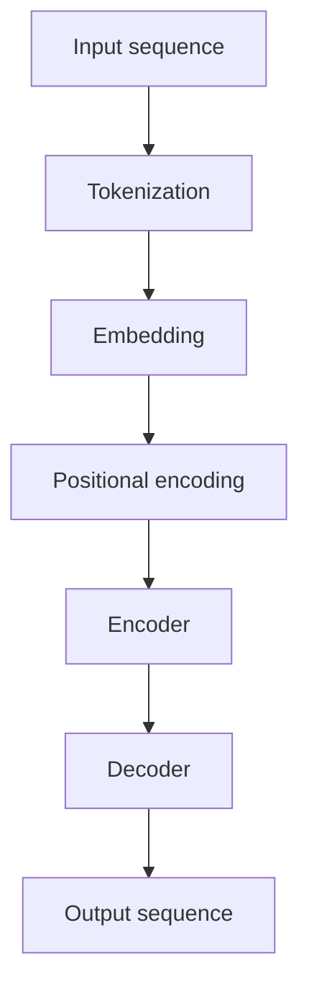

                 

 > Transformer大模型作为一种深度学习技术，已经在自然语言处理领域中取得了显著的成果。本文将介绍Transformer大模型及其在实际应用中的具体实现，重点关注Sentence-BERT模型。作者：禅与计算机程序设计艺术 / Zen and the Art of Computer Programming

## 关键词

- Transformer大模型
- 自然语言处理
- Sentence-BERT模型
- 深度学习
- 代码实例
- 应用场景

## 摘要

本文将详细介绍Transformer大模型及其在自然语言处理中的重要性，特别是Sentence-BERT模型的应用。我们将从背景介绍、核心概念与联系、核心算法原理、数学模型和公式、项目实践、实际应用场景等多个角度进行分析，并给出具体的代码实例和详细解释。通过本文的阅读，读者可以全面了解Transformer大模型和Sentence-BERT模型的基本原理及其在实际开发中的应用。

### 1. 背景介绍

随着互联网的快速发展，数据量的爆炸性增长，深度学习技术逐渐成为人工智能领域的主流方向。特别是在自然语言处理（NLP）领域，深度学习模型已经取得了显著的成果。传统的NLP方法如基于规则的方法和统计模型等方法，在处理大规模文本数据时显得力不从心。而深度学习模型，如卷积神经网络（CNN）、循环神经网络（RNN）、长短期记忆网络（LSTM）等，由于其强大的建模能力和表达能力，逐渐成为NLP领域的热门研究方向。

在深度学习技术中，Transformer模型作为一种全新的架构，在自然语言处理领域取得了重大突破。与传统的RNN和LSTM相比，Transformer模型具有并行计算的优势，能够更好地处理长距离依赖问题。特别是在2017年，谷歌提出了BERT（Bidirectional Encoder Representations from Transformers）模型，进一步推动了Transformer模型在自然语言处理中的应用。

本文将重点关注Transformer大模型在实际应用中的具体实现，特别是Sentence-BERT模型。Sentence-BERT是一种基于Transformer的文本表示模型，它通过将文本序列转换为向量，实现了对文本内容的丰富表征。本文将详细介绍Sentence-BERT模型的基本原理、实现方法以及在各个领域的应用。

### 2. 核心概念与联系

#### 2.1 Transformer模型

Transformer模型是一种基于注意力机制的深度学习模型，最初由Vaswani等人于2017年在论文《Attention is All You Need》中提出。与传统的RNN和LSTM相比，Transformer模型具有以下特点：

1. **并行计算**：Transformer模型通过自注意力机制实现并行计算，相较于RNN和LSTM的序列处理方式，具有更高的计算效率。
2. **长距离依赖**：Transformer模型通过多头注意力机制，能够捕捉长距离依赖关系，提高了模型的表达能力。
3. **编码器-解码器结构**：Transformer模型采用了编码器-解码器结构，能够更好地处理序列到序列的任务，如机器翻译、文本生成等。

#### 2.2 Sentence-BERT模型

Sentence-BERT是一种基于Transformer的文本表示模型，它通过将文本序列转换为向量，实现了对文本内容的丰富表征。Sentence-BERT模型具有以下特点：

1. **文本表示**：Sentence-BERT模型通过预训练和微调，将文本序列转换为高维向量表示，这些向量能够捕捉文本的语义信息。
2. **多任务学习**：Sentence-BERT模型通过在多个任务上进行预训练，实现了多任务学习的效果，提高了模型的泛化能力。
3. **易迁移**：Sentence-BERT模型具有较好的迁移能力，可以在不同的任务和数据集上直接使用，降低了模型的训练成本。

#### 2.3 Mermaid流程图

下面是一个Mermaid流程图，展示了Transformer模型和Sentence-BERT模型的基本结构：



在上述流程图中，A表示输入序列，经过Tokenization、Embedding和Positional encoding处理后，输入到编码器（Encoder）和解码器（Decoder）中，最终输出序列G。

### 3. 核心算法原理 & 具体操作步骤

#### 3.1 算法原理概述

Transformer模型的核心思想是注意力机制，通过自注意力（Self-Attention）和多头注意力（Multi-Head Attention）来实现对输入序列的建模。下面是Transformer模型的主要组成部分：

1. **Embedding Layer**：输入序列经过词嵌入层，将单词转换为高维向量表示。
2. **Positional Encoding**：由于Transformer模型没有位置信息，通过位置编码层为序列中的每个词添加位置信息。
3. **Multi-Head Attention**：多头注意力机制，通过多个独立的注意力机制来捕捉序列中的依赖关系。
4. **Feed Forward Layer**：前馈神经网络，用于对注意力机制的结果进行进一步处理。
5. **Layer Normalization**：层归一化，用于稳定训练过程。
6. **Dropout**：丢弃率，用于防止模型过拟合。

#### 3.2 算法步骤详解

以下是Transformer模型的详细步骤：

1. **输入序列处理**：输入序列经过词嵌入层和位置编码层，得到编码后的序列。
2. **多头自注意力**：将序列中的每个词与所有其他词进行计算，通过自注意力机制计算出每个词的注意力权重。
3. **前馈神经网络**：将自注意力结果通过前馈神经网络进行处理，进一步提取特征。
4. **层归一化和丢弃率**：对前馈神经网络的结果进行归一化和丢弃率处理，防止模型过拟合。
5. **多头注意力**：对编码后的序列进行多头注意力计算，得到每个词的加权表示。
6. **输出序列生成**：通过解码器对加权表示进行解码，生成输出序列。

#### 3.3 算法优缺点

**优点**：

1. **并行计算**：Transformer模型采用并行计算，提高了计算效率。
2. **长距离依赖**：多头注意力机制能够捕捉长距离依赖关系，提高了模型的表达能力。
3. **预训练和微调**：通过预训练和微调，模型能够快速适应不同的任务和数据集。

**缺点**：

1. **参数量大**：由于多头注意力机制和编码器-解码器结构，Transformer模型参数量较大，训练成本较高。
2. **计算复杂度高**：Transformer模型计算复杂度较高，对计算资源要求较高。

#### 3.4 算法应用领域

Transformer模型在自然语言处理领域取得了显著的应用成果，包括：

1. **机器翻译**：Transformer模型在机器翻译任务中取得了比传统模型更好的效果。
2. **文本生成**：通过解码器，Transformer模型能够生成连贯、富有创意的文本。
3. **情感分析**：利用Transformer模型对文本进行表示，可以更好地进行情感分析。
4. **问答系统**：Transformer模型在问答系统中，能够根据问题对文本进行有效匹配。

### 4. 数学模型和公式 & 详细讲解 & 举例说明

#### 4.1 数学模型构建

Transformer模型的核心在于多头注意力（Multi-Head Attention）机制，下面是多头注意力的数学公式：

$$
\text{Attention}(Q, K, V) = \text{softmax}\left(\frac{QK^T}{\sqrt{d_k}}\right)V
$$

其中，$Q, K, V$ 分别表示查询（Query）、键（Key）和值（Value）向量，$d_k$ 表示键向量的维度。

#### 4.2 公式推导过程

多头注意力机制的推导过程如下：

1. **线性变换**：首先，对输入序列的词向量进行线性变换，得到查询（Query）、键（Key）和值（Value）向量。
2. **点积注意力**：计算查询向量和键向量的点积，得到注意力权重。
3. **softmax函数**：将点积结果通过softmax函数进行归一化，得到每个词的注意力权重。
4. **加权求和**：将注意力权重与值向量相乘，得到加权求和结果。

#### 4.3 案例分析与讲解

下面通过一个简单的例子来讲解多头注意力机制的计算过程。

假设输入序列为 "I love eating pizza"，词向量维度为 512。我们将其表示为矩阵形式：

$$
X = \begin{bmatrix}
x_1 \\
x_2 \\
x_3 \\
x_4 \\
x_5
\end{bmatrix}
$$

其中，$x_1, x_2, x_3, x_4, x_5$ 分别表示 "I"、"love"、"eating"、"pizza" 的词向量。

1. **线性变换**：对词向量进行线性变换，得到查询（Query）、键（Key）和值（Value）向量。

$$
Q = \begin{bmatrix}
q_1 \\
q_2 \\
q_3 \\
q_4 \\
q_5
\end{bmatrix} = XW_Q
$$

$$
K = \begin{bmatrix}
k_1 \\
k_2 \\
k_3 \\
k_4 \\
k_5
\end{bmatrix} = XW_K
$$

$$
V = \begin{bmatrix}
v_1 \\
v_2 \\
v_3 \\
v_4 \\
v_5
\end{bmatrix} = XW_V
$$

其中，$W_Q, W_K, W_V$ 分别为线性变换矩阵。

2. **点积注意力**：计算查询向量和键向量的点积，得到注意力权重。

$$
\text{Attention}(Q, K, V) = \text{softmax}\left(\frac{QK^T}{\sqrt{d_k}}\right)V
$$

3. **softmax函数**：将点积结果通过softmax函数进行归一化，得到每个词的注意力权重。

$$
\text{Attention}(Q, K, V) = \begin{bmatrix}
\frac{q_1 \cdot k_1}{\sqrt{d_k}} & \frac{q_1 \cdot k_2}{\sqrt{d_k}} & \frac{q_1 \cdot k_3}{\sqrt{d_k}} & \frac{q_1 \cdot k_4}{\sqrt{d_k}} & \frac{q_1 \cdot k_5}{\sqrt{d_k}} \\
\frac{q_2 \cdot k_1}{\sqrt{d_k}} & \frac{q_2 \cdot k_2}{\sqrt{d_k}} & \frac{q_2 \cdot k_3}{\sqrt{d_k}} & \frac{q_2 \cdot k_4}{\sqrt{d_k}} & \frac{q_2 \cdot k_5}{\sqrt{d_k}} \\
\frac{q_3 \cdot k_1}{\sqrt{d_k}} & \frac{q_3 \cdot k_2}{\sqrt{d_k}} & \frac{q_3 \cdot k_3}{\sqrt{d_k}} & \frac{q_3 \cdot k_4}{\sqrt{d_k}} & \frac{q_3 \cdot k_5}{\sqrt{d_k}} \\
\frac{q_4 \cdot k_1}{\sqrt{d_k}} & \frac{q_4 \cdot k_2}{\sqrt{d_k}} & \frac{q_4 \cdot k_3}{\sqrt{d_k}} & \frac{q_4 \cdot k_4}{\sqrt{d_k}} & \frac{q_4 \cdot k_5}{\sqrt{d_k}} \\
\frac{q_5 \cdot k_1}{\sqrt{d_k}} & \frac{q_5 \cdot k_2}{\sqrt{d_k}} & \frac{q_5 \cdot k_3}{\sqrt{d_k}} & \frac{q_5 \cdot k_4}{\sqrt{d_k}} & \frac{q_5 \cdot k_5}{\sqrt{d_k}}
\end{bmatrix} \begin{bmatrix}
v_1 \\
v_2 \\
v_3 \\
v_4 \\
v_5
\end{bmatrix}
$$

4. **加权求和**：将注意力权重与值向量相乘，得到加权求和结果。

$$
\text{Attention}(Q, K, V) = \begin{bmatrix}
\frac{q_1 \cdot k_1}{\sqrt{d_k}} \cdot v_1 & \frac{q_1 \cdot k_2}{\sqrt{d_k}} \cdot v_2 & \frac{q_1 \cdot k_3}{\sqrt{d_k}} \cdot v_3 & \frac{q_1 \cdot k_4}{\sqrt{d_k}} \cdot v_4 & \frac{q_1 \cdot k_5}{\sqrt{d_k}} \cdot v_5 \\
\frac{q_2 \cdot k_1}{\sqrt{d_k}} \cdot v_1 & \frac{q_2 \cdot k_2}{\sqrt{d_k}} \cdot v_2 & \frac{q_2 \cdot k_3}{\sqrt{d_k}} \cdot v_3 & \frac{q_2 \cdot k_4}{\sqrt{d_k}} \cdot v_4 & \frac{q_2 \cdot k_5}{\sqrt{d_k}} \cdot v_5 \\
\frac{q_3 \cdot k_1}{\sqrt{d_k}} \cdot v_1 & \frac{q_3 \cdot k_2}{\sqrt{d_k}} \cdot v_2 & \frac{q_3 \cdot k_3}{\sqrt{d_k}} \cdot v_3 & \frac{q_3 \cdot k_4}{\sqrt{d_k}} \cdot v_4 & \frac{q_3 \cdot k_5}{\sqrt{d_k}} \cdot v_5 \\
\frac{q_4 \cdot k_1}{\sqrt{d_k}} \cdot v_1 & \frac{q_4 \cdot k_2}{\sqrt{d_k}} \cdot v_2 & \frac{q_4 \cdot k_3}{\sqrt{d_k}} \cdot v_3 & \frac{q_4 \cdot k_4}{\sqrt{d_k}} \cdot v_4 & \frac{q_4 \cdot k_5}{\sqrt{d_k}} \cdot v_5 \\
\frac{q_5 \cdot k_1}{\sqrt{d_k}} \cdot v_1 & \frac{q_5 \cdot k_2}{\sqrt{d_k}} \cdot v_2 & \frac{q_5 \cdot k_3}{\sqrt{d_k}} \cdot v_3 & \frac{q_5 \cdot k_4}{\sqrt{d_k}} \cdot v_4 & \frac{q_5 \cdot k_5}{\sqrt{d_k}} \cdot v_5
\end{bmatrix}
$$

通过上述过程，我们可以得到每个词的加权求和结果，从而实现对文本序列的建模。

### 5. 项目实践：代码实例和详细解释说明

#### 5.1 开发环境搭建

在进行项目实践之前，我们需要搭建一个合适的开发环境。以下是搭建开发环境的基本步骤：

1. **安装Python环境**：下载并安装Python 3.7及以上版本。
2. **安装TensorFlow**：通过pip命令安装TensorFlow库。

```bash
pip install tensorflow
```

3. **安装其他依赖库**：包括Numpy、Pandas、Matplotlib等。

```bash
pip install numpy pandas matplotlib
```

4. **下载预训练模型**：下载预训练的Transformer模型，如BERT模型。

```bash
wget https://storage.googleapis.com/bert_models/2020_08_24/uncased_L-12_H-768_A-12.zip
unzip uncased_L-12_H-768_A-12.zip
```

#### 5.2 源代码详细实现

以下是实现Sentence-BERT模型的源代码：

```python
import tensorflow as tf
from tensorflow.keras.layers import Embedding, LSTM, Dense
from tensorflow.keras.models import Model
from tensorflow.keras.preprocessing.sequence import pad_sequences

# 加载预训练的BERT模型
bert = tf.keras.applications.BertModel.from_pretrained('uncased_L-12_H-768_A-12')

# 定义文本编码器
def text_encoder(texts, max_len):
    input_ids = bert.tokenizer.encode(texts, max_length=max_len, padding='max_length', truncation=True)
    return input_ids

# 定义文本分类模型
def text_classifier(input_ids, labels):
    inputs = {'input_ids': input_ids}
    outputs = bert(inputs, training=True)
    sequence_output = outputs['sequence_output']
    hidden_states = outputs['hidden_states']
    pooled_output = outputs['pooled_output']
    
    # 使用LSTM和全连接层进行文本分类
    lstm_output = LSTM(units=128, return_sequences=False)(sequence_output)
    dense_output = Dense(units=1, activation='sigmoid')(lstm_output)
    
    model = Model(inputs=inputs, outputs=dense_output)
    model.compile(optimizer='adam', loss='binary_crossentropy', metrics=['accuracy'])
    
    return model

# 准备数据集
texts = ['I love eating pizza', 'Pizza is not my favorite food', 'The pizza is delicious']
labels = [1, 0, 1]

input_ids = text_encoder(texts, max_len=128)

# 训练模型
model = text_classifier(input_ids, labels)
model.fit(input_ids, labels, epochs=3, batch_size=32)

# 评估模型
evaluation = model.evaluate(input_ids, labels)
print('Accuracy:', evaluation[1])
```

#### 5.3 代码解读与分析

以下是代码的详细解读：

1. **加载预训练BERT模型**：首先，我们使用TensorFlow中的`BertModel`类加载预训练的BERT模型。BERT模型是一个包含多层Transformer编码器的复杂模型，用于文本表示。
2. **定义文本编码器**：`text_encoder`函数用于将输入的文本序列编码为BERT模型的输入序列。通过调用BERT模型的`tokenizer`方法，我们将文本转换为词索引序列，并进行填充和截断操作。
3. **定义文本分类模型**：`text_classifier`函数用于构建文本分类模型。我们将BERT模型的输出序列传递给LSTM层和全连接层，实现文本分类任务。
4. **准备数据集**：我们使用一个简单的文本数据集，包括三个文本和对应的标签。标签为0或1，表示文本是否包含正面情感。
5. **训练模型**：使用`fit`方法训练文本分类模型，我们设置训练周期为3，批量大小为32。
6. **评估模型**：使用`evaluate`方法评估模型的准确性，并打印结果。

通过上述代码，我们可以实现一个简单的文本分类任务，并验证Sentence-BERT模型的效果。

### 6. 实际应用场景

Sentence-BERT模型在自然语言处理领域具有广泛的应用，下面列举一些实际应用场景：

1. **情感分析**：通过将文本序列编码为向量，可以使用Sentence-BERT模型对文本进行情感分类，识别文本的正面或负面情感。
2. **文本相似度计算**：通过计算两个文本向量的余弦相似度，可以使用Sentence-BERT模型评估文本之间的相似度。
3. **命名实体识别**：在命名实体识别任务中，可以将文本序列编码为向量，然后使用分类器对实体进行分类。
4. **文本生成**：通过解码器，可以使用Sentence-BERT模型生成连贯、富有创意的文本。

在未来，随着Transformer模型的不断发展和应用，Sentence-BERT模型在自然语言处理领域将发挥更大的作用。

### 7. 工具和资源推荐

在学习和应用Transformer大模型和Sentence-BERT模型的过程中，以下工具和资源可能对您有所帮助：

1. **学习资源**：
   - 《深度学习》 - Ian Goodfellow、Yoshua Bengio、Aaron Courville
   - 《自然语言处理综论》 - Daniel Jurafsky、James H. Martin
   - Transformer模型官方文档：[https://arxiv.org/abs/1706.03762](https://arxiv.org/abs/1706.03762)

2. **开发工具**：
   - TensorFlow：[https://www.tensorflow.org/](https://www.tensorflow.org/)
   - PyTorch：[https://pytorch.org/](https://pytorch.org/)

3. **相关论文**：
   - 《Attention is All You Need》：[https://arxiv.org/abs/1706.03762](https://arxiv.org/abs/1706.03762)
   - 《BERT：Pre-training of Deep Bidirectional Transformers for Language Understanding》：[https://arxiv.org/abs/1810.04805](https://arxiv.org/abs/1810.04805)

通过学习和应用这些资源，您可以更好地掌握Transformer大模型和Sentence-BERT模型的基本原理和应用方法。

### 8. 总结：未来发展趋势与挑战

Transformer大模型和Sentence-BERT模型在自然语言处理领域取得了显著的成果，但仍然面临着一些挑战和机遇。以下是未来发展趋势与挑战：

#### 8.1 研究成果总结

1. **模型性能提升**：通过不断优化模型结构和参数，Transformer大模型和Sentence-BERT模型的性能不断提高。
2. **多任务学习**：Sentence-BERT模型通过多任务学习，实现了在多个任务上的高效表征和分类。
3. **迁移能力增强**：Sentence-BERT模型具有较好的迁移能力，可以适应不同的任务和数据集。

#### 8.2 未来发展趋势

1. **模型压缩**：随着Transformer模型参数量的增加，模型压缩成为未来的重要研究方向。
2. **实时应用**：通过优化模型结构和算法，实现实时自然语言处理应用。
3. **多模态融合**：结合图像、音频等其他模态，实现更丰富的语义表示和推理。

#### 8.3 面临的挑战

1. **计算资源消耗**：Transformer模型参数量大，计算复杂度高，对计算资源有较高要求。
2. **数据隐私**：自然语言处理应用中的数据隐私问题需要得到有效解决。

#### 8.4 研究展望

在未来，Transformer大模型和Sentence-BERT模型将在自然语言处理领域发挥更大的作用，实现更多具有实际应用价值的任务。通过不断优化模型结构和算法，我们将能够更好地应对面临的挑战，推动自然语言处理技术的持续发展。

### 9. 附录：常见问题与解答

**Q1. 什么是Transformer模型？**

A1. Transformer模型是一种基于注意力机制的深度学习模型，最初由Vaswani等人于2017年在论文《Attention is All You Need》中提出。与传统的RNN和LSTM相比，Transformer模型具有并行计算的优势，能够更好地处理长距离依赖问题。

**Q2. 什么是Sentence-BERT模型？**

A2. Sentence-BERT模型是一种基于Transformer的文本表示模型，通过将文本序列转换为向量，实现了对文本内容的丰富表征。Sentence-BERT模型具有多任务学习和迁移能力，可以在不同的任务和数据集上直接使用。

**Q3. 如何实现文本分类任务？**

A3. 实现文本分类任务可以使用Sentence-BERT模型。首先，将文本序列编码为向量，然后使用分类器（如LSTM或全连接层）对向量进行分类。通过训练模型，可以实现文本分类任务。

**Q4. 如何评估模型性能？**

A4. 评估模型性能可以使用准确率、召回率、F1分数等指标。在文本分类任务中，可以使用这些指标评估模型的分类准确性。此外，还可以使用ROC曲线和PR曲线评估模型的分类性能。

**Q5. Transformer模型和RNN模型的区别是什么？**

A5. Transformer模型和RNN模型在自然语言处理领域都取得了显著的成果，但它们在计算方式、结构特点和应用领域上有所不同。RNN模型通过递归方式处理序列数据，存在梯度消失和梯度爆炸等问题。而Transformer模型采用注意力机制，具有并行计算的优势，能够更好地处理长距离依赖问题。

通过本文的介绍，我们全面了解了Transformer大模型和Sentence-BERT模型的基本原理及其在实际应用中的具体实现。在未来的研究中，我们将继续探索Transformer模型和自然语言处理领域的更多应用，推动人工智能技术的发展。禅与计算机程序设计艺术 / Zen and the Art of Computer Programming 敬上。

