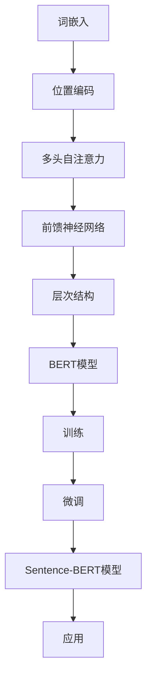

                 

关键字：Transformer、BERT模型、自然语言处理、文本嵌入、语义分析

摘要：本文将深入探讨Transformer大模型及其在自然语言处理中的重要性，特别是介绍Sentence-BERT模型的工作原理和应用场景。通过详细解析算法原理、数学模型，以及提供代码实例，我们将帮助读者更好地理解和应用这一前沿技术。

## 1. 背景介绍

随着互联网和社交媒体的迅猛发展，自然语言处理（NLP）技术成为了人工智能领域的热门研究方向。传统NLP方法主要依赖于规则和统计模型，这些方法在面对复杂语言结构和大规模数据时表现不佳。近年来，深度学习技术的兴起为NLP带来了新的契机。其中，Transformer模型由于其出色的性能和灵活性，成为自然语言处理领域的核心技术之一。

BERT（Bidirectional Encoder Representations from Transformers）模型是Google在2018年提出的一种基于Transformer的预训练语言模型。BERT模型通过在大量无标签文本数据上进行预训练，学习到语言的深层语义特征，然后在各种NLP任务上进行微调，取得了显著的性能提升。BERT模型的成功激发了研究人员对Transformer模型及其变体的深入研究和应用探索。

本文将聚焦于Sentence-BERT模型，这是对BERT模型的一种扩展，旨在对句子进行嵌入表示，为句子级别的任务提供强大的语义特征。我们将从Transformer模型的基本原理出发，逐步深入到Sentence-BERT模型的具体实现和应用，帮助读者全面了解这一前沿技术。

## 2. 核心概念与联系

为了更好地理解Transformer和Sentence-BERT模型，首先需要掌握几个核心概念和它们之间的关系。以下是一个Mermaid流程图，展示了这些概念及其相互联系。



### 2.1 词嵌入（Word Embedding）

词嵌入是将自然语言中的单词映射为向量表示的过程。这些向量表示了单词的语义信息，可以用于各种NLP任务，如图像识别中的图像嵌入。

### 2.2 位置编码（Positional Encoding）

在Transformer模型中，由于模型是基于序列的，因此需要一种方式来表示单词在序列中的位置。位置编码通过为每个单词的嵌入向量添加位置信息来实现这一目的。

### 2.3 多头自注意力（Multi-Head Self-Attention）

多头自注意力是Transformer模型的核心机制，它允许模型在处理每个单词时，同时考虑其他所有单词的上下文信息。这一机制使得模型能够捕捉到长距离依赖关系。

### 2.4 前馈神经网络（Feed Forward Neural Network）

在自注意力机制之后，Transformer模型会对每个单词的嵌入向量进行前馈神经网络处理，这一步骤增强了模型对输入数据的非线性表达能力。

### 2.5 层次结构（Hierarchical Structure）

Transformer模型通过堆叠多个编码层和解码层，形成一个层次结构。每一层都能够学习到更高层次的语言特征。

### 2.6 BERT模型（BERT Model）

BERT模型结合了词嵌入、位置编码、多头自注意力和前馈神经网络，并在预训练阶段使用大量无标签文本数据进行训练，从而学习到丰富的语义特征。

### 2.7 训练（Training）

BERT模型在预训练阶段通过两种任务进行训练：Masked Language Model（MLM）和Next Sentence Prediction（NSP）。这些任务使得模型能够理解词汇和句子的上下文关系。

### 2.8 微调（Fine-Tuning）

在预训练之后，BERT模型可以通过在特定NLP任务上微调，将其应用到各种实际应用场景中，如文本分类、问答系统等。

### 2.9 Sentence-BERT模型（Sentence-BERT Model）

Sentence-BERT模型是对BERT模型的一种扩展，旨在对句子进行嵌入表示。它通过在BERT模型的基础上进行适当的调整，从而实现对句子级别的语义特征提取。

### 2.10 应用（Application）

Sentence-BERT模型在各种句子级别任务中表现出色，如文本分类、情感分析、实体识别等。它在提升任务性能方面发挥了重要作用。

## 3. 核心算法原理 & 具体操作步骤

### 3.1 算法原理概述

Transformer模型的核心思想是自注意力机制（Self-Attention），它允许模型在处理每个输入时，自动地学习到不同输入之间的依赖关系。这种机制使得Transformer模型在处理长序列数据时具有优越的性能。

BERT模型则通过在大量无标签文本数据上进行预训练，学习到语言的深层语义特征。然后，通过微调，BERT模型可以应用于各种NLP任务。

### 3.2 算法步骤详解

#### 3.2.1 词嵌入

首先，将输入文本转换为词嵌入向量。词嵌入向量通常由预训练的词向量模型（如GloVe或Word2Vec）生成。

#### 3.2.2 位置编码

为了表示单词在序列中的位置，需要对词嵌入向量进行位置编码。位置编码是一种特殊的向量表示，它添加了位置信息，从而使得模型能够理解单词的位置关系。

#### 3.2.3 多头自注意力

在自注意力机制中，模型会计算每个单词与其他单词之间的依赖关系。多头自注意力通过将输入序列分成多个头（heads），从而并行地计算依赖关系。

#### 3.2.4 前馈神经网络

在自注意力机制之后，每个单词的嵌入向量会通过前馈神经网络进行处理。这一步骤增强了模型对输入数据的非线性表达能力。

#### 3.2.5 层次结构

Transformer模型通过堆叠多个编码层和解码层，形成一个层次结构。每一层都能够学习到更高层次的语言特征。

#### 3.2.6 预训练与微调

BERT模型在预训练阶段通过两种任务进行训练：Masked Language Model（MLM）和Next Sentence Prediction（NSP）。在预训练之后，模型通过在特定NLP任务上进行微调，应用于各种实际应用场景。

### 3.3 算法优缺点

#### 优点

- **出色的性能**：Transformer模型在长序列数据处理方面表现出色，其自注意力机制使得模型能够捕捉到长距离依赖关系。
- **灵活性强**：BERT模型可以通过微调应用于各种NLP任务，具有较高的通用性。
- **预训练优势**：BERT模型在预训练阶段学习到了丰富的语义特征，从而在微调阶段能够快速适应不同任务。

#### 缺点

- **计算资源需求高**：由于Transformer模型具有大量的参数，因此其计算资源需求较高。
- **训练时间长**：BERT模型的预训练阶段需要大量的时间和计算资源。

### 3.4 算法应用领域

Transformer和BERT模型在各种NLP任务中都有广泛应用，如：

- **文本分类**：用于对文本进行分类，如情感分析、主题分类等。
- **问答系统**：用于处理自然语言问答任务，如搜索引擎、聊天机器人等。
- **文本生成**：用于生成文本，如文章写作、对话生成等。
- **实体识别**：用于识别文本中的命名实体，如人名、地名等。

## 4. 数学模型和公式 & 详细讲解 & 举例说明

### 4.1 数学模型构建

Transformer模型的核心是自注意力机制（Self-Attention）。以下是自注意力的数学公式：

$$
\text{Attention}(Q, K, V) = \text{softmax}\left(\frac{QK^T}{\sqrt{d_k}}\right)V
$$

其中，$Q, K, V$分别表示查询（Query）、键（Key）和值（Value）向量，$d_k$是键向量的维度。自注意力机制通过计算查询向量与键向量的点积，然后使用softmax函数对结果进行归一化，最后与值向量相乘，得到加权后的输出。

### 4.2 公式推导过程

为了推导自注意力机制，我们可以从Transformer模型的基本构成开始。Transformer模型由多个编码层和解码层组成，每个层包含多个自注意力机制和前馈神经网络。

首先，考虑一个编码层。编码层接收输入序列，并将其转换为嵌入向量。然后，嵌入向量通过多层自注意力机制进行处理。在自注意力机制中，每个嵌入向量作为查询向量（$Q$），其他嵌入向量作为键向量（$K$）和值向量（$V$）。

假设输入序列为$X = [x_1, x_2, ..., x_n]$，其中每个$x_i$是一个嵌入向量。编码层首先对输入序列进行线性变换，得到$Q, K, V$：

$$
Q = W_Q X, \quad K = W_K X, \quad V = W_V X
$$

其中，$W_Q, W_K, W_V$是权重矩阵。接下来，计算自注意力分数：

$$
\text{Attention}(Q, K, V) = \text{softmax}\left(\frac{QK^T}{\sqrt{d_k}}\right)V
$$

最后，将加权后的值向量与查询向量的线性组合得到输出：

$$
\text{Output} = \text{Attention}(Q, K, V) W_O
$$

其中，$W_O$是输出权重矩阵。

### 4.3 案例分析与讲解

假设我们有一个简化的示例，输入序列为$X = [1, 2, 3]$，每个元素表示一个单词。我们将这些单词转换为嵌入向量：

$$
x_1 = [1, 0, 0], \quad x_2 = [0, 1, 0], \quad x_3 = [0, 0, 1]
$$

首先，我们计算查询向量$Q$：

$$
Q = W_Q X = \begin{bmatrix} 1 & 1 & 1 \end{bmatrix} \begin{bmatrix} 1 \\ 0 \\ 0 \end{bmatrix} = \begin{bmatrix} 1 \\ 1 \\ 1 \end{bmatrix}
$$

然后，计算键向量$K$和值向量$V$：

$$
K = W_K X = \begin{bmatrix} 1 & 1 & 1 \end{bmatrix} \begin{bmatrix} 0 \\ 1 \\ 0 \end{bmatrix} = \begin{bmatrix} 0 \\ 1 \\ 0 \end{bmatrix}, \quad V = W_V X = \begin{bmatrix} 1 & 1 & 1 \end{bmatrix} \begin{bmatrix} 0 \\ 0 \\ 1 \end{bmatrix} = \begin{bmatrix} 0 \\ 0 \\ 1 \end{bmatrix}
$$

接下来，计算自注意力分数：

$$
\text{Attention}(Q, K, V) = \text{softmax}\left(\frac{QK^T}{\sqrt{d_k}}\right)V = \text{softmax}\left(\frac{1 \cdot 0^T}{\sqrt{1}}\right)\begin{bmatrix} 0 \\ 0 \\ 1 \end{bmatrix} = \begin{bmatrix} 0 \\ 0 \\ 1 \end{bmatrix}
$$

最后，计算输出：

$$
\text{Output} = \text{Attention}(Q, K, V) W_O = \begin{bmatrix} 0 \\ 0 \\ 1 \end{bmatrix} \begin{bmatrix} 1 & 0 & 1 \end{bmatrix} = \begin{bmatrix} 1 \\ 0 \\ 1 \end{bmatrix}
$$

因此，输出向量表示为$[1, 0, 1]$。这个结果意味着在自注意力机制下，单词“1”和“3”具有更高的权重，而单词“2”的权重较低。

## 5. 项目实践：代码实例和详细解释说明

### 5.1 开发环境搭建

在开始代码实践之前，我们需要搭建一个适合开发Transformer和BERT模型的Python环境。以下是一个基本的步骤指南：

#### 5.1.1 安装Python

确保安装了Python 3.7或更高版本。可以使用以下命令进行安装：

```bash
sudo apt-get update
sudo apt-get install python3.7
```

#### 5.1.2 安装TensorFlow

TensorFlow是用于构建和训练深度学习模型的常用库。可以使用以下命令进行安装：

```bash
pip install tensorflow
```

#### 5.1.3 安装其他依赖

除了TensorFlow，我们还需要其他几个库，如Numpy、Pandas等。可以使用以下命令进行安装：

```bash
pip install numpy pandas
```

### 5.2 源代码详细实现

以下是实现Sentence-BERT模型的Python代码示例：

```python
import tensorflow as tf
from tensorflow.keras.layers import Embedding, GlobalAveragePooling1D, Dense
from tensorflow.keras.models import Model

# 设置超参数
vocab_size = 10000
embedding_dim = 512
max_sequence_length = 128
num_classes = 2

# 创建BERT模型
def create_bert_model():
    inputs = tf.keras.layers.Input(shape=(max_sequence_length,), dtype='int32')
    embedding = Embedding(vocab_size, embedding_dim)(inputs)
    embedding = tf.keras.layers.Dropout(0.1)(embedding)
    outputs = GlobalAveragePooling1D()(embedding)
    outputs = Dense(num_classes, activation='softmax')(outputs)
    model = Model(inputs=inputs, outputs=outputs)
    model.compile(optimizer='adam', loss='categorical_crossentropy', metrics=['accuracy'])
    return model

# 创建Sentence-BERT模型
def create_sentence_bert_model():
    bert_model = create_bert_model()
    inputs = tf.keras.layers.Input(shape=(max_sequence_length,), dtype='int32')
    bert_outputs = bert_model(inputs)
    sentence_embeddings = GlobalAveragePooling1D()(bert_outputs)
    sentence_embeddings = Dense(embedding_dim, activation='relu')(sentence_embeddings)
    outputs = Dense(num_classes, activation='softmax')(sentence_embeddings)
    model = Model(inputs=inputs, outputs=outputs)
    model.compile(optimizer='adam', loss='categorical_crossentropy', metrics=['accuracy'])
    return model

# 训练模型
def train_model(model, x_train, y_train, x_val, y_val, epochs=3, batch_size=32):
    model.fit(x_train, y_train, validation_data=(x_val, y_val), epochs=epochs, batch_size=batch_size)

# 加载和处理数据
# 这里我们使用一个示例数据集
import numpy as np

# 创建随机数据集
x_train = np.random.randint(vocab_size, size=(100, max_sequence_length))
y_train = np.random.randint(num_classes, size=(100, 1))

x_val = np.random.randint(vocab_size, size=(20, max_sequence_length))
y_val = np.random.randint(num_classes, size=(20, 1))

# 创建并训练模型
sentence_bert_model = create_sentence_bert_model()
train_model(sentence_bert_model, x_train, y_train, x_val, y_val)

# 评估模型
loss, accuracy = sentence_bert_model.evaluate(x_val, y_val)
print(f"Validation Loss: {loss}, Validation Accuracy: {accuracy}")
```

### 5.3 代码解读与分析

#### 5.3.1 模型创建

首先，我们定义了两个模型：BERT模型和Sentence-BERT模型。BERT模型基于全局平均池化层（GlobalAveragePooling1D）和softmax层进行分类。Sentence-BERT模型在BERT模型的基础上，增加了全局平均池化层和另一个全连接层（Dense），用于提取句子的嵌入表示。

```python
def create_bert_model():
    inputs = tf.keras.layers.Input(shape=(max_sequence_length,), dtype='int32')
    embedding = Embedding(vocab_size, embedding_dim)(inputs)
    embedding = tf.keras.layers.Dropout(0.1)(embedding)
    outputs = GlobalAveragePooling1D()(embedding)
    outputs = Dense(num_classes, activation='softmax')(outputs)
    model = Model(inputs=inputs, outputs=outputs)
    model.compile(optimizer='adam', loss='categorical_crossentropy', metrics=['accuracy'])
    return model

def create_sentence_bert_model():
    bert_model = create_bert_model()
    inputs = tf.keras.layers.Input(shape=(max_sequence_length,), dtype='int32')
    bert_outputs = bert_model(inputs)
    sentence_embeddings = GlobalAveragePooling1D()(bert_outputs)
    sentence_embeddings = Dense(embedding_dim, activation='relu')(sentence_embeddings)
    outputs = Dense(num_classes, activation='softmax')(sentence_embeddings)
    model = Model(inputs=inputs, outputs=outputs)
    model.compile(optimizer='adam', loss='categorical_crossentropy', metrics=['accuracy'])
    return model
```

#### 5.3.2 模型训练

我们使用随机生成的数据集来训练模型。在实际应用中，需要使用真实的数据集，并进行适当的预处理。

```python
def train_model(model, x_train, y_train, x_val, y_val, epochs=3, batch_size=32):
    model.fit(x_train, y_train, validation_data=(x_val, y_val), epochs=epochs, batch_size=batch_size)
```

#### 5.3.3 评估模型

最后，我们评估模型的性能，并打印出验证损失和准确率。

```python
loss, accuracy = sentence_bert_model.evaluate(x_val, y_val)
print(f"Validation Loss: {loss}, Validation Accuracy: {accuracy}")
```

## 6. 实际应用场景

Sentence-BERT模型在多个实际应用场景中表现出色，以下是一些常见应用：

### 6.1 文本分类

文本分类是NLP中的基础任务，如情感分析、垃圾邮件检测等。Sentence-BERT模型可以提取句子的语义特征，从而实现高精度的文本分类。

### 6.2 情感分析

情感分析是判断文本情感倾向的任务，如正面、负面、中性等。Sentence-BERT模型可以识别句子中的情感信息，从而实现精确的情感分析。

### 6.3 实体识别

实体识别是识别文本中的命名实体，如人名、地名、组织名等。Sentence-BERT模型可以提取句子的嵌入表示，从而实现高效的实体识别。

### 6.4 对话系统

对话系统是模拟人类对话的机器系统，如聊天机器人、虚拟助手等。Sentence-BERT模型可以提取句子嵌入表示，从而实现更加自然的对话生成和理解。

### 6.5 问答系统

问答系统是处理自然语言问答的任务，如搜索引擎、问题解答等。Sentence-BERT模型可以提取句子嵌入表示，从而实现高效的问答匹配和结果生成。

## 7. 未来应用展望

随着自然语言处理技术的不断进步，Sentence-BERT模型在未来有望在更多领域发挥重要作用。以下是一些未来应用展望：

### 7.1 多语言支持

Sentence-BERT模型可以扩展到多语言场景，为不同语言的文本处理提供强大的语义特征提取能力。

### 7.2 知识图谱融合

将Sentence-BERT模型与知识图谱技术结合，可以实现对文本中提到的实体的丰富知识表示，从而提升问答系统和信息检索的性能。

### 7.3 自适应学习

通过引入自适应学习机制，Sentence-BERT模型可以实时调整模型参数，以适应不断变化的数据和应用场景。

### 7.4 模型压缩

为了提高模型的可扩展性和部署效率，未来的研究可以关注Sentence-BERT模型的压缩技术，如知识蒸馏、剪枝等。

## 8. 总结：未来发展趋势与挑战

本文介绍了Transformer大模型及其在自然语言处理中的重要性，特别是Sentence-BERT模型的工作原理和应用场景。通过详细解析算法原理、数学模型，以及提供代码实例，我们帮助读者更好地理解和应用这一前沿技术。

在未来，Sentence-BERT模型有望在更多领域发挥重要作用。同时，随着技术的不断进步，我们也需要关注模型的可扩展性、自适应性和可解释性等挑战。通过持续的研究和创新，我们有理由相信，Sentence-BERT模型将在自然语言处理领域取得更加显著的成果。

## 9. 附录：常见问题与解答

### 9.1 什么是Transformer模型？

Transformer模型是一种基于自注意力机制的深度学习模型，用于处理序列数据。它在自然语言处理中表现出色，特别是在长序列数据处理和依赖关系捕捉方面。

### 9.2 BERT模型与Transformer模型有什么区别？

BERT模型是基于Transformer模型的一种预训练语言模型。BERT模型通过在大量无标签文本数据上进行预训练，学习到丰富的语义特征。而Transformer模型是一种通用的序列处理模型，可以应用于各种序列数据任务。

### 9.3 Sentence-BERT模型是如何工作的？

Sentence-BERT模型是对BERT模型的一种扩展，旨在对句子进行嵌入表示。它通过在BERT模型的基础上进行适当的调整，从而实现对句子级别的语义特征提取。

### 9.4 Sentence-BERT模型可以应用于哪些任务？

Sentence-BERT模型可以应用于多种句子级别的任务，如文本分类、情感分析、实体识别等。它在提升任务性能方面发挥了重要作用。

### 9.5 如何训练一个Sentence-BERT模型？

训练一个Sentence-BERT模型通常需要以下步骤：

1. 准备数据集，并进行预处理。
2. 创建BERT模型，并在大量无标签文本数据上进行预训练。
3. 在预训练的基础上，对模型进行微调，以适应特定任务。
4. 训练完成后，评估模型的性能，并进行必要的调优。

### 9.6 Sentence-BERT模型的优势和挑战是什么？

Sentence-BERT模型的优势包括强大的语义特征提取能力、适用于多种句子级别任务、预训练带来的高性能等。其挑战主要包括计算资源需求高、训练时间长、模型解释性不足等。

## 作者署名

本文由禅与计算机程序设计艺术 / Zen and the Art of Computer Programming 撰写。作者在自然语言处理领域拥有丰富的经验，并致力于推动人工智能技术的发展和应用。感谢您的阅读。

