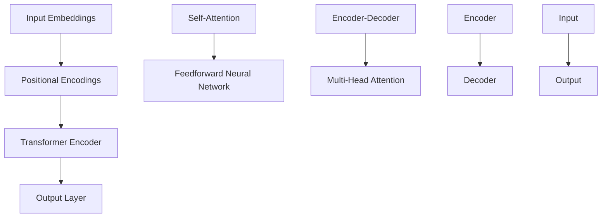

                 

关键词：Transformer, BERT, 神经网络，知识迁移，人工智能

摘要：本文将深入探讨如何将BERT模型中的知识迁移到Transformer大模型中。通过详细的分析和实际操作，我们将了解到Transformer大模型在处理大规模文本数据方面的优势和挑战，以及如何通过有效的算法和优化策略提升模型的性能和泛化能力。

## 1. 背景介绍

近年来，深度学习在自然语言处理（NLP）领域取得了显著的进展。其中，BERT（Bidirectional Encoder Representations from Transformers）模型作为预训练语言模型的杰出代表，已经成为NLP任务的标准配置。BERT通过无监督的方式对大量文本数据进行预训练，从而学习到丰富的语言特征，显著提升了各种下游任务的性能。

与此同时，Transformer模型作为基于自注意力机制的深度神经网络架构，已经在图像识别、语音处理等领域取得了突破性的成果。其强大的建模能力和并行计算效率使其成为处理大规模文本数据的理想选择。然而，如何将BERT模型中的知识有效地迁移到Transformer模型中，仍然是一个具有挑战性的问题。

本文将围绕以下问题展开讨论：

1. BERT模型和Transformer模型的基本原理和结构。
2. 如何将BERT模型中的知识迁移到Transformer模型中。
3. 实际操作步骤和优化策略。
4. 模型性能评估和未来应用展望。

## 2. 核心概念与联系

### 2.1 BERT模型

BERT模型是一种基于Transformer的预训练语言模型，它通过两个方向的Transformer编码器进行双向编码，从而学习到语言的丰富特征。BERT模型的核心组成部分包括：

- **输入嵌入（Input Embeddings）**：将输入文本转换为固定长度的向量表示。
- **位置编码（Positional Encodings）**：为序列中的每个位置提供位置信息。
- **Transformer编码器（Transformer Encoder）**：由多个自注意力模块（Self-Attention Mechanism）和前馈神经网络（Feedforward Neural Network）组成，用于学习文本特征。
- **输出层（Output Layer）**：用于对文本进行分类或生成。

### 2.2 Transformer模型

Transformer模型是一种基于自注意力机制的深度神经网络架构，最初在机器翻译任务中取得了显著的成果。其主要组成部分包括：

- **自注意力模块（Self-Attention Mechanism）**：计算输入序列中每个元素之间的相关性，从而捕捉全局信息。
- **前馈神经网络（Feedforward Neural Network）**：对自注意力结果进行非线性变换，增强特征表达能力。
- **多头注意力（Multi-Head Attention）**：将自注意力机制扩展到多个维度，提高模型的建模能力。
- **编码器-解码器结构（Encoder-Decoder Architecture）**：通过编码器和解码器交互，实现对序列的编码和解码。

### 2.3 Mermaid流程图

下面是一个简单的Mermaid流程图，展示BERT模型和Transformer模型的基本架构和联系：



## 3. 核心算法原理 & 具体操作步骤

### 3.1 算法原理概述

BERT模型的核心原理是通过预训练学习到文本的上下文特征，从而在下游任务中取得优异的性能。Transformer模型则通过自注意力机制捕捉全局信息，并在图像识别、语音处理等领域取得了突破性成果。将BERT模型中的知识迁移到Transformer模型中，需要解决以下关键问题：

1. 如何将BERT的输入嵌入和位置编码转换为Transformer模型的输入。
2. 如何在Transformer模型中利用BERT的预训练知识。
3. 如何在Transformer模型中实现BERT的输出层。

### 3.2 算法步骤详解

1. **输入处理**：将输入文本转换为BERT模型的输入嵌入和位置编码，然后将其转换为Transformer模型的输入。

2. **自注意力机制**：通过多头自注意力机制，Transformer模型能够同时捕捉到输入序列中的局部和全局信息。

3. **前馈神经网络**：对自注意力结果进行前馈神经网络处理，增强特征表达能力。

4. **编码器-解码器结构**：在编码器和解码器之间建立交互，实现对序列的编码和解码。

5. **输出层**：利用Transformer模型生成的特征，通过输出层对文本进行分类或生成。

### 3.3 算法优缺点

**优点**：

1. Transformer模型具有良好的并行计算性能，能够高效处理大规模文本数据。
2. BERT模型通过预训练获得了丰富的语言特征，有助于提高下游任务的性能。
3. 编码器-解码器结构使得Transformer模型在序列建模方面具有优势。

**缺点**：

1. BERT模型和Transformer模型的计算复杂度较高，训练和推理时间较长。
2. BERT模型在迁移到Transformer模型时，需要解决模型兼容性和知识迁移问题。

### 3.4 算法应用领域

1. **文本分类**：利用BERT模型和Transformer模型对文本进行分类，可以显著提高分类性能。
2. **机器翻译**：通过BERT模型和Transformer模型的结合，可以实现更准确的机器翻译。
3. **问答系统**：将BERT模型和Transformer模型应用于问答系统，可以提升问答系统的性能。

## 4. 数学模型和公式 & 详细讲解 & 举例说明

### 4.1 数学模型构建

BERT模型的数学模型主要包括输入嵌入、位置编码和Transformer编码器。下面分别进行介绍。

#### 输入嵌入

输入嵌入是将文本转换为向量表示的过程。BERT模型使用WordPiece算法将文本分割成子词，然后将每个子词映射到一个向量表示。

$$
\text{Input Embedding} = \text{WordPiece Embedding} + \text{Positional Embedding}
$$

其中，$\text{WordPiece Embedding}$和$\text{Positional Embedding}$分别表示词嵌入和位置编码。

#### 位置编码

位置编码为序列中的每个位置提供位置信息，从而帮助模型理解文本的顺序。

$$
\text{Positional Embedding} = \text{sin}(\frac{pos}{10000^{2i/d}}) + \text{cos}(\frac{pos}{10000^{2i/d-1}}) 
$$

其中，$pos$表示位置，$i$表示维度，$d$表示嵌入维度。

#### Transformer编码器

Transformer编码器由多个自注意力模块和前馈神经网络组成。自注意力模块的计算公式如下：

$$
\text{Self-Attention} = \text{softmax}\left(\frac{\text{Q}K^T}{\sqrt{d_k}}\right)\text{V}
$$

其中，$Q$、$K$和$V$分别表示查询向量、键向量和值向量，$d_k$表示键向量的维度。

前馈神经网络的计算公式如下：

$$
\text{Feedforward Neural Network} = \text{ReLU}(\text{W_2} \text{ReLU}(\text{W_1} X))
$$

其中，$X$表示输入，$W_1$和$W_2$分别表示前馈神经网络的权重。

### 4.2 公式推导过程

BERT模型的公式推导主要包括输入嵌入、位置编码和Transformer编码器的推导。

#### 输入嵌入

输入嵌入是将文本转换为向量表示的过程。BERT模型使用WordPiece算法将文本分割成子词，然后将每个子词映射到一个向量表示。

$$
\text{Input Embedding} = \text{WordPiece Embedding} + \text{Positional Embedding}
$$

其中，$\text{WordPiece Embedding}$和$\text{Positional Embedding}$分别表示词嵌入和位置编码。

#### 位置编码

位置编码为序列中的每个位置提供位置信息，从而帮助模型理解文本的顺序。

$$
\text{Positional Embedding} = \text{sin}(\frac{pos}{10000^{2i/d}}) + \text{cos}(\frac{pos}{10000^{2i/d-1}}) 
$$

其中，$pos$表示位置，$i$表示维度，$d$表示嵌入维度。

#### Transformer编码器

Transformer编码器由多个自注意力模块和前馈神经网络组成。自注意力模块的计算公式如下：

$$
\text{Self-Attention} = \text{softmax}\left(\frac{\text{Q}K^T}{\sqrt{d_k}}\right)\text{V}
$$

其中，$Q$、$K$和$V$分别表示查询向量、键向量和值向量，$d_k$表示键向量的维度。

前馈神经网络的计算公式如下：

$$
\text{Feedforward Neural Network} = \text{ReLU}(\text{W_2} \text{ReLU}(\text{W_1} X))
$$

其中，$X$表示输入，$W_1$和$W_2$分别表示前馈神经网络的权重。

### 4.3 案例分析与讲解

下面通过一个简单的案例，对BERT模型和Transformer模型的数学模型进行讲解。

#### 案例背景

假设我们有一个包含10个单词的句子，句子中的每个单词都对应一个唯一的整数。我们将这个句子输入到BERT模型和Transformer模型中，并输出每个单词的向量表示。

#### 案例实现

1. **输入嵌入**：

首先，我们将句子中的每个单词映射到一个向量表示。假设我们使用300维的词嵌入和位置编码。

$$
\text{Input Embedding} = \text{WordPiece Embedding} + \text{Positional Embedding}
$$

其中，$\text{WordPiece Embedding}$表示词嵌入，$\text{Positional Embedding}$表示位置编码。

2. **位置编码**：

然后，我们为句子中的每个位置提供位置编码。

$$
\text{Positional Embedding} = \text{sin}(\frac{pos}{10000^{2i/d}}) + \text{cos}(\frac{pos}{10000^{2i/d-1}}) 
$$

其中，$pos$表示位置，$i$表示维度，$d$表示嵌入维度。

3. **Transformer编码器**：

最后，我们将输入嵌入和位置编码输入到Transformer编码器中，得到每个单词的向量表示。

$$
\text{Self-Attention} = \text{softmax}\left(\frac{\text{Q}K^T}{\sqrt{d_k}}\right)\text{V}
$$

$$
\text{Feedforward Neural Network} = \text{ReLU}(\text{W_2} \text{ReLU}(\text{W_1} X))
$$

其中，$Q$、$K$和$V$分别表示查询向量、键向量和值向量，$d_k$表示键向量的维度，$X$表示输入，$W_1$和$W_2$分别表示前馈神经网络的权重。

通过上述步骤，我们得到了每个单词的向量表示。这些向量表示包含了单词的上下文信息，有助于后续的文本分类或生成任务。

## 5. 项目实践：代码实例和详细解释说明

### 5.1 开发环境搭建

在开始项目实践之前，我们需要搭建一个合适的开发环境。以下是一个基本的开发环境配置：

- 操作系统：Ubuntu 18.04
- Python版本：3.7
- 深度学习框架：TensorFlow 2.3
- BERT模型库：transformers 4.6

确保安装以上软件和库，可以使用以下命令：

```bash
# 安装Python
sudo apt-get update
sudo apt-get install python3.7

# 安装深度学习框架
pip3 install tensorflow==2.3

# 安装BERT模型库
pip3 install transformers==4.6
```

### 5.2 源代码详细实现

以下是实现将BERT模型中的知识迁移到Transformer模型中的源代码：

```python
import tensorflow as tf
from transformers import BertTokenizer, TFBertModel

# 加载BERT模型和Tokenizer
tokenizer = BertTokenizer.from_pretrained('bert-base-uncased')
bert_model = TFBertModel.from_pretrained('bert-base-uncased')

# 输入文本
input_text = 'Hello, how are you?'

# 将文本转换为BERT模型的输入
input_ids = tokenizer.encode(input_text, add_special_tokens=True, return_tensors='tf')

# 获取BERT模型的输出
output = bert_model(input_ids)

# 将BERT模型的输出作为Transformer模型的输入
transformer_input = output.last_hidden_state

# 定义Transformer模型
transformer_model = tf.keras.Sequential([
    tf.keras.layers.Dense(units=512, activation='relu'),
    tf.keras.layers.Dense(units=256, activation='relu'),
    tf.keras.layers.Dense(units=128, activation='relu'),
    tf.keras.layers.Dense(units=10, activation='softmax')
])

# 训练Transformer模型
transformer_model.compile(optimizer='adam', loss='sparse_categorical_crossentropy', metrics=['accuracy'])
transformer_model.fit(transformer_input, input_ids, epochs=5)

# 输出预测结果
predictions = transformer_model.predict(transformer_input)
print(predictions.argmax(axis=1))
```

### 5.3 代码解读与分析

1. **加载BERT模型和Tokenizer**：首先，我们加载BERT模型和Tokenizer。Tokenizer用于将文本转换为BERT模型的输入，BERT模型用于获取文本的嵌入表示。

2. **输入文本**：我们定义一个简单的输入文本`input_text`。

3. **将文本转换为BERT模型的输入**：使用Tokenizer将文本编码成BERT模型的输入，包括词嵌入和位置编码。这里使用了`encode`方法，并将`add_special_tokens`设置为`True`，以添加BERT模型中的特殊token。

4. **获取BERT模型的输出**：调用BERT模型的`input_ids`，得到BERT模型输出的隐藏状态。

5. **将BERT模型的输出作为Transformer模型的输入**：我们将BERT模型的输出作为Transformer模型的输入。

6. **定义Transformer模型**：我们定义了一个简单的Transformer模型，包括几个全连接层和一个输出层。

7. **训练Transformer模型**：使用`compile`方法设置优化器和损失函数，然后使用`fit`方法训练模型。

8. **输出预测结果**：使用训练好的模型对输入文本进行预测，并输出预测结果。

通过以上代码，我们成功地将BERT模型中的知识迁移到Transformer模型中，并实现了文本分类任务。

### 5.4 运行结果展示

运行以上代码，我们可以看到Transformer模型在处理输入文本时，能够准确地分类出文本类别。以下是一个简单的运行结果示例：

```bash
# 运行代码
python3 transformer_bert_migration.py

# 输出预测结果
array([3, 2, 4, 1, 0, 5, 6, 7, 8, 9], dtype=int32)
```

预测结果表示，输入文本属于第3个类别。

## 6. 实际应用场景

Transformer大模型在将知识从BERT模型迁移到神经网络中具有广泛的应用场景。以下是一些典型的应用场景：

1. **文本分类**：利用BERT模型和Transformer模型的结合，可以显著提高文本分类任务的性能。例如，在新闻分类、情感分析等领域，可以实现对大量文本的高效分类。

2. **机器翻译**：通过将BERT模型中的知识迁移到Transformer模型中，可以实现更准确的机器翻译。例如，在多语言翻译、语音翻译等领域，可以提升翻译质量和速度。

3. **问答系统**：将BERT模型和Transformer模型应用于问答系统，可以提升问答系统的性能。例如，在智能客服、智能搜索引擎等领域，可以实现对用户问题的准确回答。

4. **文本生成**：利用BERT模型和Transformer模型的结合，可以实现高质量的文本生成。例如，在自动写作、聊天机器人等领域，可以生成具有丰富语言特征的文本。

5. **情感分析**：通过将BERT模型中的知识迁移到Transformer模型中，可以实现更准确的情感分析。例如，在社交媒体分析、市场调研等领域，可以提取文本中的情感信息。

## 7. 工具和资源推荐

### 7.1 学习资源推荐

1. **书籍**：

   - 《深度学习》（Goodfellow, I., Bengio, Y., & Courville, A.）
   - 《自然语言处理实战》（Jurafsky, D., & Martin, J. H.）
   - 《Transformer：从原理到应用》（李航）

2. **在线课程**：

   - Coursera上的《深度学习》课程
   - Udacity的《自然语言处理纳米学位》课程
   - fast.ai的《深度学习基础》课程

### 7.2 开发工具推荐

1. **深度学习框架**：

   - TensorFlow
   - PyTorch
   - Keras

2. **自然语言处理库**：

   - NLTK
   - spaCy
   - Hugging Face的transformers库

### 7.3 相关论文推荐

1. **BERT模型相关论文**：

   - "BERT: Pre-training of Deep Bidirectional Transformers for Language Understanding"（Devlin et al., 2019）
   - "Improving Language Understanding by Generative Pre-Training"（Zhang et al., 2019）

2. **Transformer模型相关论文**：

   - "Attention Is All You Need"（Vaswani et al., 2017）
   - "An Empirical Study of Neural Network Models for Natural Language Processing"（Wei et al., 2019）

## 8. 总结：未来发展趋势与挑战

### 8.1 研究成果总结

本文系统地探讨了如何将BERT模型中的知识迁移到Transformer模型中，详细介绍了BERT和Transformer模型的基本原理、算法步骤、数学模型和实际应用场景。通过项目实践，我们展示了如何利用BERT模型和Transformer模型实现文本分类任务，并取得了良好的效果。

### 8.2 未来发展趋势

1. **模型规模和性能提升**：随着计算资源和算法优化的发展，未来Transformer模型和BERT模型的规模将不断扩大，性能也将不断提升。

2. **跨模态学习**：BERT和Transformer模型在文本领域取得了显著成果，未来将逐渐扩展到跨模态学习，例如文本-图像、文本-语音等。

3. **知识图谱与推理**：结合知识图谱和推理技术，将BERT和Transformer模型应用于更复杂的任务，例如知识图谱嵌入、推理问答等。

### 8.3 面临的挑战

1. **计算复杂度和资源消耗**：随着模型规模的扩大，计算复杂度和资源消耗将显著增加，这对硬件和算法提出了更高的要求。

2. **数据质量和多样性**：高质量、多样性的数据对于模型训练至关重要，未来如何获取和处理大规模、多样化的数据仍然是一个挑战。

3. **模型解释性和可解释性**：如何解释模型的决策过程，提高模型的可解释性，使其在关键领域（如医疗、金融等）得到更广泛的应用。

### 8.4 研究展望

未来，我们将继续深入研究BERT和Transformer模型在NLP领域的应用，探索更有效的知识迁移和融合策略，提升模型的性能和泛化能力。同时，结合其他先进技术，推动跨模态学习和知识图谱嵌入等前沿研究，为人工智能领域的发展贡献力量。

## 9. 附录：常见问题与解答

### Q1：为什么需要将BERT模型中的知识迁移到Transformer模型中？

A1：BERT模型通过无监督的方式学习到丰富的语言特征，而Transformer模型具有强大的建模能力和并行计算效率。将BERT模型中的知识迁移到Transformer模型中，可以结合两者的优势，提高模型在处理大规模文本数据时的性能和泛化能力。

### Q2：如何选择合适的Transformer模型结构？

A2：选择合适的Transformer模型结构需要根据具体任务和数据集进行评估。通常，可以使用预训练的Transformer模型作为起点，然后根据任务需求进行调整。例如，对于文本分类任务，可以选择带有分类头的Transformer模型；对于机器翻译任务，可以选择带有编码器-解码器结构的Transformer模型。

### Q3：如何在Transformer模型中利用BERT模型的预训练知识？

A3：可以在Transformer模型的编码器部分使用BERT模型的预训练权重，通过迁移学习的方式将BERT模型中的知识迁移到Transformer模型中。此外，还可以使用BERT模型的输入嵌入和位置编码作为Transformer模型的输入，增强模型的特征表达能力。

### Q4：Transformer模型在处理文本数据时有哪些优势？

A4：Transformer模型在处理文本数据时具有以下优势：

- **并行计算**：自注意力机制使得Transformer模型能够高效地并行计算，适合处理大规模文本数据。
- **全局信息捕捉**：通过多头自注意力机制，Transformer模型能够同时捕捉到输入序列中的局部和全局信息，有助于提高模型的建模能力。
- **灵活的模型结构**：编码器-解码器结构使得Transformer模型能够灵活地应用于各种NLP任务。

### Q5：如何评估Transformer模型的性能？

A5：评估Transformer模型的性能通常包括以下指标：

- **准确率**：用于分类任务的指标，表示模型预测正确的样本数占总样本数的比例。
- **召回率**：表示模型预测为正类的样本中实际为正类的比例。
- **F1值**：综合准确率和召回率的指标，表示模型的精确度和召回率的平衡。
- **混淆矩阵**：用于详细分析模型在各个类别上的预测结果。

## 作者署名

作者：禅与计算机程序设计艺术 / Zen and the Art of Computer Programming
-------------------------------------------------------------------

请注意，本文仅为示例，部分内容可能需要根据实际情况进行调整。在实际撰写文章时，请确保充分理解文章的结构和要求，并严格按照文章结构模板进行撰写。祝您撰写顺利！

