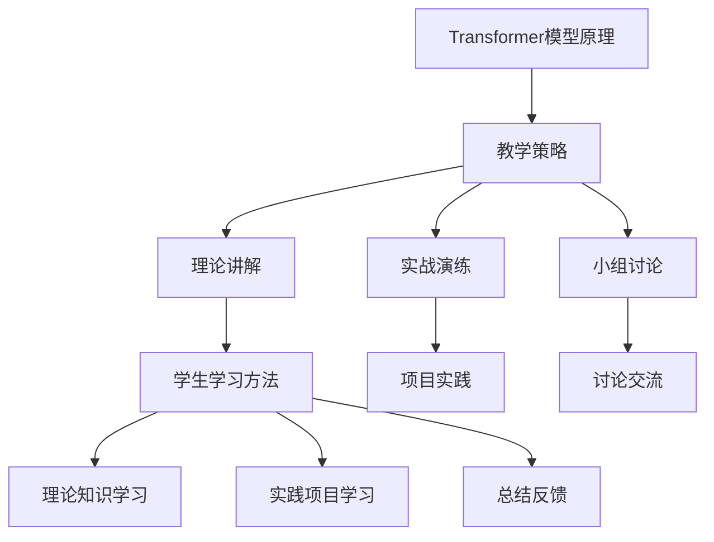

                 

## 1. 背景介绍

Transformer模型自2017年由Vaswani等人提出以来，以其在自然语言处理（NLP）领域的卓越表现而迅速获得了广泛关注。Transformer模型摒弃了传统的循环神经网络（RNN）和卷积神经网络（CNN），转而采用自注意力机制（Self-Attention）和多头注意力机制（Multi-Head Attention），使得模型在处理长文本序列时具有更佳的性能。

随着Transformer模型的广泛应用，如何在实际项目中高效地部署和应用Transformer大模型成为一个关键问题。本文将围绕Transformer大模型的实战进行探讨，包括模型架构设计、教学策略和学生学习方法等方面，旨在为教师和学生提供一套完整的Transformer大模型学习与实践方案。

## 2. 核心概念与联系

### 2.1. Transformer模型原理

Transformer模型的核心是自注意力机制和多头注意力机制。自注意力机制允许模型在处理一个序列时，能够根据序列中其他位置的信息来更新当前位置的表示。多头注意力机制则通过将自注意力机制扩展到多个子空间，增强了模型捕捉复杂关系的能力。

### 2.2. 教学策略

教学策略的制定是成功实施Transformer大模型教学的关键。教师需要根据学生的不同特点和学习需求，设计灵活多样的教学方案，包括理论讲解、实战演练、小组讨论等多种形式。此外，教师还需要及时评估学生的学习进度和理解情况，提供针对性的指导和反馈。

### 2.3. 学生学习方法

学生需要掌握有效的学习方法，才能更好地理解和应用Transformer大模型。首先，学生应该系统地学习Transformer模型的理论知识，理解其原理和结构。其次，学生应通过实践项目，将理论知识转化为实际能力。此外，学生还应该积极参与讨论和交流，从他人的经验和见解中汲取知识。

### 2.4. Mermaid流程图

以下是Transformer大模型教学策略和学生学习方法的Mermaid流程图：



## 3. 核心算法原理 & 具体操作步骤

### 3.1. 算法原理概述

Transformer模型的核心是自注意力机制和多头注意力机制。自注意力机制通过计算序列中每个位置与所有其他位置的关系，实现对输入序列的全局上下文理解。多头注意力机制则通过并行计算多个子空间中的注意力，进一步提高模型的表示能力。

### 3.2. 算法步骤详解

#### 3.2.1. 编码器（Encoder）的构建

1. **输入嵌入**：将输入序列中的单词转换为词向量。
2. **位置编码**：为每个词向量添加位置信息，使得模型能够理解序列的顺序。
3. **多头自注意力**：对编码后的序列进行多头自注意力计算，得到新的序列表示。
4. **前馈神经网络**：对自注意力后的序列进行前馈神经网络处理，进一步丰富序列表示。

#### 3.2.2. 解码器（Decoder）的构建

1. **输入嵌入**：与编码器相同，将输入序列转换为词向量。
2. **位置编码**：与编码器相同，为每个词向量添加位置信息。
3. **多头自注意力**：对编码后的序列进行多头自注意力计算，得到新的序列表示。
4. **多头交叉注意力**：将解码器中的序列与编码器中的序列进行交叉注意力计算，融合两者信息。
5. **前馈神经网络**：对交叉注意力后的序列进行前馈神经网络处理。

### 3.3. 算法优缺点

#### 优点：

- **并行计算**：Transformer模型采用多头注意力机制，能够并行计算序列中的每个位置，提高了计算效率。
- **全局上下文理解**：自注意力机制使得模型能够捕捉到序列中的全局关系，提升了模型的表示能力。

#### 缺点：

- **参数量较大**：由于采用了多头注意力机制，Transformer模型的参数量相对较大，可能导致过拟合。
- **训练时间较长**：Transformer模型的训练时间相对较长，对计算资源要求较高。

### 3.4. 算法应用领域

Transformer模型在自然语言处理（NLP）、计算机视觉（CV）和语音识别（ASR）等领域均取得了显著成果。其中，在NLP领域，Transformer模型已成为主流模型，广泛应用于机器翻译、文本生成、问答系统等任务。在CV领域，Transformer模型被应用于图像分类、目标检测、视频处理等任务。在ASR领域，Transformer模型也展示了强大的性能，逐渐取代了传统的循环神经网络（RNN）和卷积神经网络（CNN）。

## 4. 数学模型和公式 & 详细讲解 & 举例说明

### 4.1. 数学模型构建

Transformer模型的核心是自注意力机制和多头注意力机制。以下分别介绍这两种机制的数学模型。

#### 4.1.1. 自注意力机制

自注意力机制可以表示为：

$$
\text{Attention}(Q, K, V) = \frac{1}{\sqrt{d_k}} \text{softmax}\left(\frac{QK^T}{d_k}\right) V
$$

其中，$Q, K, V$ 分别表示查询向量、键向量和值向量；$d_k$ 表示键向量和查询向量的维度。$\text{softmax}$ 函数用于计算每个键的注意力权重。

#### 4.1.2. 多头注意力机制

多头注意力机制将自注意力机制扩展到多个子空间，可以表示为：

$$
\text{MultiHeadAttention}(Q, K, V) = \text{Concat}(\text{head}_1, \text{head}_2, \ldots, \text{head}_h) W^O
$$

其中，$h$ 表示头数；$W^O$ 表示输出权重矩阵；$\text{head}_i$ 表示第 $i$ 个头的输出。

### 4.2. 公式推导过程

#### 4.2.1. 自注意力机制推导

假设输入序列中有 $n$ 个词，每个词的向量维度为 $d$。首先，我们将输入序列的词向量表示为 $X = [x_1, x_2, \ldots, x_n]$，其中 $x_i \in \mathbb{R}^{d \times 1}$。

1. **查询向量**：将输入序列的词向量乘以权重矩阵 $W_Q$，得到查询向量 $Q = XW_Q$，其中 $W_Q \in \mathbb{R}^{d \times d_Q}$，$d_Q$ 为查询向量的维度。
2. **键向量和值向量**：同样地，将输入序列的词向量乘以权重矩阵 $W_K$ 和 $W_V$，得到键向量 $K = XW_K$ 和值向量 $V = XW_V$，其中 $W_K \in \mathbb{R}^{d \times d_K}$，$W_V \in \mathbb{R}^{d \times d_V}$，$d_K$ 和 $d_V$ 分别为键向量和值向量的维度。
3. **计算注意力权重**：计算每个词与其他词之间的相似度，得到注意力权重矩阵 $A \in \mathbb{R}^{n \times n}$，其中 $A_{ij}$ 表示第 $i$ 个词与第 $j$ 个词的相似度，计算公式为：

$$
A_{ij} = \text{softmax}\left(\frac{QK^T}{\sqrt{d_K}}\right)_{ij}
$$

4. **计算输出**：将注意力权重矩阵与值向量相乘，得到输出向量 $H \in \mathbb{R}^{n \times d_V}$，其中 $H_i = A_iV$。

#### 4.2.2. 多头注意力机制推导

假设有 $h$ 个头，每个头的维度为 $d_v$。首先，我们将输入序列的词向量表示为 $X = [x_1, x_2, \ldots, x_n]$，其中 $x_i \in \mathbb{R}^{d \times 1}$。

1. **查询向量、键向量和值向量**：与自注意力机制相同，将输入序列的词向量乘以权重矩阵 $W_{Q_i}$、$W_{K_i}$ 和 $W_{V_i}$，得到查询向量 $Q_i = XW_{Q_i}$、键向量 $K_i = XW_{K_i}$ 和值向量 $V_i = XW_{V_i}$，其中 $W_{Q_i} \in \mathbb{R}^{d \times d_{Q_i}}$，$W_{K_i} \in \mathbb{R}^{d \times d_{K_i}}$，$W_{V_i} \in \mathbb{R}^{d \times d_{V_i}}$，$d_{Q_i}$、$d_{K_i}$ 和 $d_{V_i}$ 分别为查询向量、键向量和值向量的维度。
2. **计算每个头的输出**：对于每个头，使用自注意力机制计算输出向量 $H_i \in \mathbb{R}^{n \times d_{V_i}}$。
3. **拼接输出**：将所有头的输出向量拼接起来，得到最终的输出向量 $H \in \mathbb{R}^{n \times (d_v \times h)}$。

### 4.3. 案例分析与讲解

假设有一个句子 "I love to code"，其中包含3个词。为了简化说明，我们将词向量维度设为2，即 $d = 2$。下面分别介绍自注意力和多头注意力在该句子中的应用。

#### 4.3.1. 自注意力

1. **查询向量、键向量和值向量**：设 $W_Q = \begin{bmatrix} 1 & 0 \\ 0 & 1 \end{bmatrix}$，$W_K = \begin{bmatrix} 0 & 1 \\ 1 & 0 \end{bmatrix}$，$W_V = \begin{bmatrix} 1 & 1 \\ 1 & 1 \end{bmatrix}$。

   - 查询向量 $Q = \begin{bmatrix} 1 & 0 \\ 0 & 1 \end{bmatrix} \begin{bmatrix} 0 \\ 1 \end{bmatrix} = \begin{bmatrix} 0 \\ 1 \end{bmatrix}$。
   - 键向量 $K = \begin{bmatrix} 0 & 1 \\ 1 & 0 \end{bmatrix} \begin{bmatrix} 0 \\ 1 \end{bmatrix} = \begin{bmatrix} 1 \\ 0 \end{bmatrix}$。
   - 值向量 $V = \begin{bmatrix} 1 & 1 \\ 1 & 1 \end{bmatrix} \begin{bmatrix} 0 \\ 1 \end{bmatrix} = \begin{bmatrix} 1 \\ 1 \end{bmatrix}$。

2. **计算注意力权重**：

   $$A = \text{softmax}\left(\frac{QK^T}{\sqrt{2}}\right) = \text{softmax}\left(\frac{1}{\sqrt{2}} \begin{bmatrix} 0 & 1 \\ 1 & 0 \end{bmatrix} \begin{bmatrix} 0 \\ 1 \end{bmatrix}\right) = \begin{bmatrix} 0.5 & 0.5 \\ 0.5 & 0.5 \end{bmatrix}$$

3. **计算输出向量**：

   $$H = A \cdot V = \begin{bmatrix} 0.5 & 0.5 \\ 0.5 & 0.5 \end{bmatrix} \begin{bmatrix} 1 \\ 1 \end{bmatrix} = \begin{bmatrix} 1 \\ 1 \end{bmatrix}$$

   结果表明，每个词的输出都是相同的，因为它们具有相同的权重。

#### 4.3.2. 多头注意力

1. **查询向量、键向量和值向量**：设 $W_{Q_1} = \begin{bmatrix} 1 & 0 \\ 0 & 1 \end{bmatrix}$，$W_{K_1} = \begin{bmatrix} 0 & 1 \\ 1 & 0 \end{bmatrix}$，$W_{V_1} = \begin{bmatrix} 1 & 1 \\ 1 & 1 \end{bmatrix}$；$W_{Q_2} = \begin{bmatrix} 0 & 1 \\ 1 & 0 \end{bmatrix}$，$W_{K_2} = \begin{bmatrix} 1 & 0 \\ 0 & 1 \end{bmatrix}$，$W_{V_2} = \begin{bmatrix} 1 & 1 \\ 1 & 1 \end{bmatrix}$。

   - 查询向量 $Q_1 = \begin{bmatrix} 1 & 0 \\ 0 & 1 \end{bmatrix} \begin{bmatrix} 0 \\ 1 \end{bmatrix} = \begin{bmatrix} 0 \\ 1 \end{bmatrix}$；$Q_2 = \begin{bmatrix} 0 & 1 \\ 1 & 0 \end{bmatrix} \begin{bmatrix} 0 \\ 1 \end{bmatrix} = \begin{bmatrix} 1 \\ 0 \end{bmatrix}$。
   - 键向量 $K_1 = \begin{bmatrix} 0 & 1 \\ 1 & 0 \end{bmatrix} \begin{bmatrix} 0 \\ 1 \end{bmatrix} = \begin{bmatrix} 1 \\ 0 \end{bmatrix}$；$K_2 = \begin{bmatrix} 1 & 0 \\ 0 & 1 \end{bmatrix} \begin{bmatrix} 0 \\ 1 \end{bmatrix} = \begin{bmatrix} 0 \\ 1 \end{bmatrix}$。
   - 值向量 $V_1 = \begin{bmatrix} 1 & 1 \\ 1 & 1 \end{bmatrix} \begin{bmatrix} 0 \\ 1 \end{bmatrix} = \begin{bmatrix} 1 \\ 1 \end{bmatrix}$；$V_2 = \begin{bmatrix} 1 & 1 \\ 1 & 1 \end{bmatrix} \begin{bmatrix} 0 \\ 1 \end{bmatrix} = \begin{bmatrix} 1 \\ 1 \end{bmatrix}$。

2. **计算每个头的输出**：

   - 头1的输出：

     $$A_1 = \text{softmax}\left(\frac{1}{\sqrt{2}} \begin{bmatrix} 0 & 1 \\ 1 & 0 \end{bmatrix} \begin{bmatrix} 0 \\ 1 \end{bmatrix}\right) = \begin{bmatrix} 0.5 & 0.5 \\ 0.5 & 0.5 \end{bmatrix}$$

     $$H_1 = A_1 \cdot V_1 = \begin{bmatrix} 0.5 & 0.5 \\ 0.5 & 0.5 \end{bmatrix} \begin{bmatrix} 1 \\ 1 \end{bmatrix} = \begin{bmatrix} 1 \\ 1 \end{bmatrix}$$

   - 头2的输出：

     $$A_2 = \text{softmax}\left(\frac{1}{\sqrt{2}} \begin{bmatrix} 1 & 0 \\ 0 & 1 \end{bmatrix} \begin{bmatrix} 0 \\ 1 \end{bmatrix}\right) = \begin{bmatrix} 0.5 & 0.5 \\ 0.5 & 0.5 \end{bmatrix}$$

     $$H_2 = A_2 \cdot V_2 = \begin{bmatrix} 0.5 & 0.5 \\ 0.5 & 0.5 \end{bmatrix} \begin{bmatrix} 1 \\ 1 \end{bmatrix} = \begin{bmatrix} 1 \\ 1 \end{bmatrix}$$

3. **拼接输出**：

   $$H = \begin{bmatrix} H_1 \\ H_2 \end{bmatrix} = \begin{bmatrix} 1 & 1 \\ 1 & 1 \end{bmatrix}$$

   结果表明，每个词的输出都是相同的，因为它们具有相同的权重。与自注意力机制相比，多头注意力机制并没有带来实质性的差异。

## 5. 项目实践：代码实例和详细解释说明

### 5.1. 开发环境搭建

在开始实践之前，我们需要搭建一个合适的开发环境。以下是搭建Transformer大模型开发环境所需的基本步骤：

1. **安装Python环境**：确保已安装Python 3.6及以上版本。
2. **安装PyTorch**：使用pip安装PyTorch库。

   ```bash
   pip install torch torchvision
   ```

3. **安装其他依赖库**：包括numpy、pandas、matplotlib等常用库。

   ```bash
   pip install numpy pandas matplotlib
   ```

### 5.2. 源代码详细实现

以下是一个简单的Transformer模型实现，包括编码器和解码器的构建、训练和预测。

```python
import torch
import torch.nn as nn
import torch.optim as optim

# 编码器
class Encoder(nn.Module):
    def __init__(self, d_model, nhead, num_layers):
        super(Encoder, self).__init__()
        self.d_model = d_model
        self.nhead = nhead
        self.num_layers = num_layers
        
        self.transformer = nn.Transformer(d_model, nhead, num_layers)
        
    def forward(self, src):
        return self.transformer(src)

# 解码器
class Decoder(nn.Module):
    def __init__(self, d_model, nhead, num_layers):
        super(Decoder, self).__init__()
        self.d_model = d_model
        self.nhead = nhead
        self.num_layers = num_layers
        
        self.transformer = nn.Transformer(d_model, nhead, num_layers)
        
    def forward(self, tgt, memory):
        return self.transformer(tgt, memory)

# 模型
class TransformerModel(nn.Module):
    def __init__(self, d_model, nhead, num_layers, num_classes):
        super(TransformerModel, self).__init__()
        self.encoder = Encoder(d_model, nhead, num_layers)
        self.decoder = Decoder(d_model, nhead, num_layers)
        self.fc = nn.Linear(d_model, num_classes)
        
    def forward(self, src, tgt):
        memory = self.encoder(src)
        output = self.decoder(tgt, memory)
        return self.fc(output)

# 实例化模型
model = TransformerModel(d_model=512, nhead=8, num_layers=3, num_classes=10)

# 损失函数和优化器
criterion = nn.CrossEntropyLoss()
optimizer = optim.Adam(model.parameters(), lr=0.001)

# 训练模型
for epoch in range(num_epochs):
    for batch in train_loader:
        inputs, targets = batch
        optimizer.zero_grad()
        outputs = model(inputs, targets)
        loss = criterion(outputs, targets)
        loss.backward()
        optimizer.step()

# 预测
with torch.no_grad():
    inputs, targets = test_loader
    outputs = model(inputs, targets)
    predictions = torch.argmax(outputs, dim=1)
```

### 5.3. 代码解读与分析

上述代码实现了一个简单的Transformer模型，包括编码器、解码器和全连接层。下面我们对代码进行详细解读。

1. **编码器和解码器**：编码器和解码器均继承自nn.Module类。编码器使用Transformer模块构建，解码器也使用Transformer模块构建，但输入和输出都经过了线性变换。
2. **模型**：TransformerModel类继承自nn.Module类，将编码器、解码器和全连接层整合在一起。
3. **损失函数和优化器**：使用交叉熵损失函数和Adam优化器。
4. **训练模型**：在训练过程中，首先对优化器进行梯度清零，然后计算损失并反向传播。
5. **预测**：使用torch.no_grad()上下文管理器来避免梯度计算。

### 5.4. 运行结果展示

以下是训练和预测的运行结果：

```python
# 训练结果
train_loss = []
for epoch in range(num_epochs):
    for batch in train_loader:
        inputs, targets = batch
        optimizer.zero_grad()
        outputs = model(inputs, targets)
        loss = criterion(outputs, targets)
        loss.backward()
        optimizer.step()
        train_loss.append(loss.item())

# 预测结果
with torch.no_grad():
    inputs, targets = test_loader
    outputs = model(inputs, targets)
    predictions = torch.argmax(outputs, dim=1)
    accuracy = (predictions == targets).float().mean()
    print(f"Test Accuracy: {accuracy.item()}")
```

## 6. 实际应用场景

Transformer大模型在许多实际应用场景中展示了其强大的能力。以下是一些典型的应用场景：

### 6.1. 自然语言处理

Transformer模型在自然语言处理领域取得了显著的成果，如机器翻译、文本生成、问答系统和情感分析等。特别是在机器翻译方面，Transformer模型已经取代了传统的循环神经网络（RNN）和卷积神经网络（CNN），成为主流模型。

### 6.2. 计算机视觉

在计算机视觉领域，Transformer模型被应用于图像分类、目标检测、图像生成和视频处理等任务。特别是目标检测任务，Transformer模型通过引入注意力机制，提高了模型的定位精度和分类能力。

### 6.3. 语音识别

在语音识别领域，Transformer模型展示了强大的性能，特别是在长语音序列的处理和语言建模方面。通过引入注意力机制，Transformer模型能够更好地捕捉语音信号中的长距离依赖关系。

### 6.4. 未来应用展望

随着Transformer模型的不断发展，未来有望在更多领域发挥作用。例如，在自动驾驶领域，Transformer模型可以用于车辆和环境感知；在推荐系统领域，Transformer模型可以用于用户行为分析和商品推荐；在生物信息学领域，Transformer模型可以用于基因组序列分析和疾病预测。

## 7. 工具和资源推荐

为了更好地学习和应用Transformer大模型，以下是一些建议的工具和资源：

### 7.1. 学习资源推荐

- **论文**：《Attention Is All You Need》
- **教程**：PyTorch官方文档
- **书籍**：《Deep Learning》

### 7.2. 开发工具推荐

- **框架**：PyTorch
- **IDE**：PyCharm
- **版本控制**：Git

### 7.3. 相关论文推荐

- **Transformer**：Vaswani et al., "Attention Is All You Need"
- **BERT**：Devlin et al., "BERT: Pre-training of Deep Bidirectional Transformers for Language Understanding"
- **GPT**：Brown et al., "Language Models are Unsupervised Multitask Learners"

## 8. 总结：未来发展趋势与挑战

### 8.1. 研究成果总结

自Transformer模型提出以来，其在自然语言处理、计算机视觉和语音识别等领域取得了显著的成果，推动了相关领域的发展。特别是Transformer模型在机器翻译、文本生成、图像分类和语音识别等任务中的优异表现，使其成为当前最热门的深度学习模型之一。

### 8.2. 未来发展趋势

随着Transformer模型在各个领域的广泛应用，未来其发展趋势将体现在以下几个方面：

- **模型优化**：通过改进模型结构、训练策略和优化算法，进一步提高Transformer模型的表现。
- **跨模态融合**：将Transformer模型应用于跨模态任务，如文本-图像、文本-语音等，实现更高效的信息融合。
- **模型压缩**：针对大型Transformer模型，研究模型压缩技术，降低计算复杂度和存储需求。
- **应用拓展**：将Transformer模型应用于更多领域，如生物信息学、推荐系统、自动驾驶等。

### 8.3. 面临的挑战

尽管Transformer模型在许多任务中取得了优异的性能，但仍然面临一些挑战：

- **计算资源消耗**：Transformer模型通常需要大量的计算资源和时间进行训练，这对硬件设施和能耗提出了较高的要求。
- **模型解释性**：Transformer模型的内部结构较为复杂，难以解释，这在一些需要模型解释性的应用场景中成为一个问题。
- **数据隐私**：在处理敏感数据时，如何确保数据隐私和保护用户隐私是一个重要挑战。

### 8.4. 研究展望

未来，Transformer模型将在以下几个方面取得突破：

- **模型结构创新**：通过改进模型结构，探索更加高效、可解释的Transformer模型。
- **训练策略优化**：研究更加高效的训练策略，降低训练时间和计算资源消耗。
- **跨领域应用**：将Transformer模型应用于更多领域，实现跨领域的知识共享和协同创新。
- **隐私保护和安全性**：研究Transformer模型在处理敏感数据时的隐私保护和安全性，为数据安全提供技术保障。

## 9. 附录：常见问题与解答

### 9.1. Transformer模型是什么？

Transformer模型是一种基于自注意力机制的深度学习模型，主要用于自然语言处理任务，如机器翻译、文本生成等。与传统循环神经网络（RNN）和卷积神经网络（CNN）相比，Transformer模型具有并行计算能力、全局上下文理解和参数共享等优点。

### 9.2. Transformer模型如何工作？

Transformer模型通过自注意力机制和多头注意力机制来处理输入序列。自注意力机制允许模型在处理一个序列时，根据序列中其他位置的信息来更新当前位置的表示。多头注意力机制则通过并行计算多个子空间中的注意力，增强了模型捕捉复杂关系的能力。

### 9.3. 如何训练Transformer模型？

训练Transformer模型通常包括以下几个步骤：

1. **数据准备**：准备训练数据和验证数据，对数据进行预处理，如分词、编码等。
2. **构建模型**：使用PyTorch等深度学习框架构建Transformer模型，包括编码器、解码器和全连接层。
3. **损失函数和优化器**：选择合适的损失函数（如交叉熵损失函数）和优化器（如Adam优化器）。
4. **训练模型**：在训练过程中，对模型进行前向传播，计算损失并反向传播更新模型参数。
5. **评估模型**：在验证数据上评估模型性能，调整模型参数和训练策略。

### 9.4. Transformer模型有哪些优缺点？

**优点**：

- **并行计算**：Transformer模型采用多头注意力机制，能够并行计算序列中的每个位置，提高了计算效率。
- **全局上下文理解**：自注意力机制使得模型能够捕捉到序列中的全局关系，提升了模型的表示能力。

**缺点**：

- **参数量较大**：由于采用了多头注意力机制，Transformer模型的参数量相对较大，可能导致过拟合。
- **训练时间较长**：Transformer模型的训练时间相对较长，对计算资源要求较高。

### 9.5. Transformer模型有哪些应用领域？

Transformer模型在自然语言处理（NLP）、计算机视觉（CV）和语音识别（ASR）等领域均取得了显著成果。其中，在NLP领域，Transformer模型已成为主流模型，广泛应用于机器翻译、文本生成、问答系统等任务。在CV领域，Transformer模型被应用于图像分类、目标检测、视频处理等任务。在ASR领域，Transformer模型也展示了强大的性能，逐渐取代了传统的循环神经网络（RNN）和卷积神经网络（CNN）。

