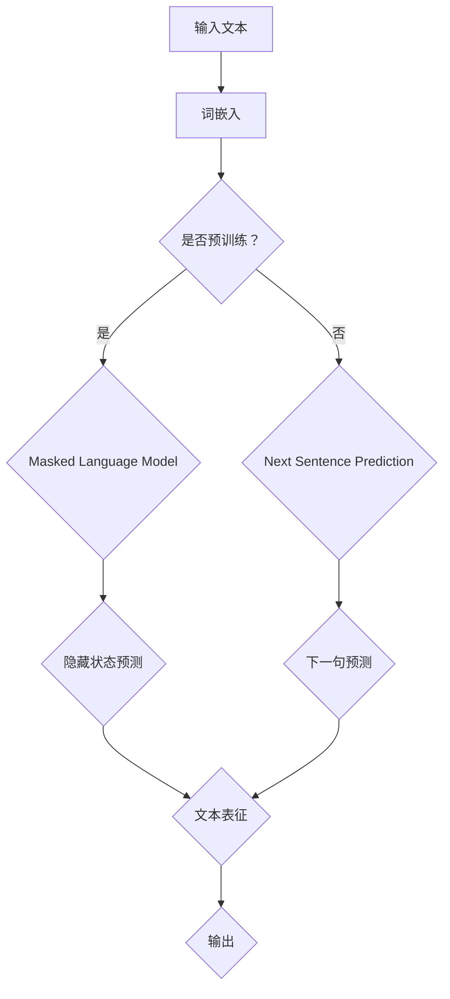

                 

### 1. 背景介绍

在过去的几年中，深度学习和自然语言处理（NLP）领域经历了前所未有的快速发展。特别是Transformer架构的引入，彻底改变了NLP的任务，如机器翻译、文本分类、问答系统等。BERT（Bidirectional Encoder Representations from Transformers）模型作为Transformer架构在NLP中的又一重要应用，受到了广泛关注。BERT模型通过双向Transformer编码器预训练，获得了语言理解的深度表征，从而在各种NLP任务上取得了卓越的性能。

随着全球范围内的语言多样性增加，支持多语言模型的开发变得至关重要。日语作为一种重要的语言，其独特的语法结构和丰富的词汇使得开发适应日语的BERT模型具有挑战性。本文将介绍如何在日语环境中实现BERT模型，包括模型构建、训练、优化以及应用。

本文将按照以下结构进行：

1. 背景介绍
2. 核心概念与联系
3. 核心算法原理 & 具体操作步骤
4. 数学模型和公式 & 详细讲解 & 举例说明
5. 项目实践：代码实例和详细解释说明
6. 实际应用场景
7. 工具和资源推荐
8. 总结：未来发展趋势与挑战
9. 附录：常见问题与解答

通过本文，读者将了解如何使用Transformer架构构建适用于日语的BERT模型，并掌握其在实际应用中的实现方法。

## 1.1 深度学习与NLP的发展

深度学习作为人工智能的重要分支，近年来在图像识别、语音识别、自然语言处理等领域取得了显著成果。特别是在自然语言处理领域，深度学习模型如卷积神经网络（CNN）、递归神经网络（RNN）和长短期记忆网络（LSTM）等，通过不断优化和改进，使得机器在理解、生成和翻译自然语言方面表现出色。

然而，传统的深度学习模型在处理长文本时存在一定的局限性。例如，RNN和LSTM由于梯度消失和梯度爆炸问题，难以有效处理长距离依赖。为了解决这一问题，Transformer架构应运而生。Transformer模型通过自注意力机制，可以同时处理文本中的所有单词，解决了传统模型中的长距离依赖问题。

在NLP任务中，Transformer架构的引入带来了巨大的变革。特别是BERT模型的提出，将Transformer自注意力机制与预训练技术相结合，通过在大量无标签文本上进行预训练，再在特定任务上进行微调，使得模型在多种NLP任务中取得了最佳效果。

## 1.2 BERT模型的作用

BERT（Bidirectional Encoder Representations from Transformers）模型是Google在2018年提出的一种基于Transformer架构的预训练语言表示模型。BERT模型通过在大量文本数据上进行双向编码，学习到了丰富的语言表征，从而在文本分类、问答系统、机器翻译等任务中表现出色。

BERT模型的主要作用可以总结为以下几点：

1. **提高语言理解能力**：BERT模型通过预训练，学习了语言中的上下文关系，从而能够更好地理解文本中的含义。这种理解能力在问答系统、文本分类等任务中尤为重要。

2. **提高模型泛化能力**：通过在大量无标签文本上进行预训练，BERT模型具有更强的泛化能力，能够应对各种不同领域的文本任务。

3. **统一不同语言的处理**：BERT模型不仅支持英语，还可以通过多语言训练，支持多种语言的处理。这对于多语言的自然语言处理任务具有重要意义。

4. **提高任务性能**：在多种NLP任务上，BERT模型都取得了最佳效果，尤其是在基准测试数据集上，BERT模型的表现优于之前的所有模型。

## 1.3 为什么需要日语文本BERT模型

随着全球化和互联网的发展，日语作为一种重要的语言，其自然语言处理需求日益增长。然而，现有的NLP模型大多基于英语数据集进行训练，对于日语的处理存在一定的局限性。具体原因如下：

1. **语法结构差异**：日语和英语在语法结构上存在较大差异，例如日语的语法更加灵活，词序和语序变化较多，这给NLP模型的训练和解析带来了一定的困难。

2. **词汇丰富度**：日语的词汇量丰富，且存在大量的汉字词，这要求NLP模型能够有效处理多语言词汇。

3. **数据稀缺**：相对于英语，日语的数据资源相对较少，这限制了基于数据驱动的NLP模型的发展。

为了解决这些问题，开发适合日语的BERT模型显得尤为重要。通过专门针对日语语料进行训练，BERT模型可以更好地适应日语的语言特性，从而在文本分类、问答系统、机器翻译等任务中取得更好的效果。

## 1.4 本文的目标

本文的目标是介绍如何在日语环境中实现BERT模型，包括以下内容：

1. **模型构建**：介绍如何构建适用于日语的BERT模型，包括数据预处理、模型结构设计等。
2. **模型训练**：详细讲解如何对BERT模型进行训练，包括训练策略、优化方法等。
3. **模型优化**：探讨如何通过模型调优，提高模型在日语任务上的性能。
4. **应用实践**：通过实际项目案例，展示如何将BERT模型应用于日语的文本分类、问答系统等任务。

通过本文，读者将能够了解如何使用Transformer架构构建适应日语的BERT模型，并在实际应用中取得良好效果。

### 2. 核心概念与联系

在深入探讨如何构建适用于日语的BERT模型之前，我们需要首先理解几个核心概念，包括自然语言处理的基本原理、BERT模型的工作机制以及其与Transformer架构的联系。

#### 2.1 自然语言处理的基本原理

自然语言处理（NLP）旨在使计算机能够理解和生成人类语言。NLP的基本任务包括分词、词性标注、命名实体识别、语义分析等。这些任务的基础是词嵌入（word embeddings），即将自然语言文本中的词汇转换为向量表示。词嵌入的目的是将语义相关的词汇映射到接近的向量空间中，从而实现文本的语义理解。

传统上，词嵌入方法包括基于计数（如TF-IDF）和基于学习（如Word2Vec、GloVe）两大类。Word2Vec是一种基于神经网络的学习方法，通过训练词频矩阵来生成词嵌入向量。然而，这种方法存在一些局限性，例如无法处理长距离依赖、语义理解不够深刻等。

为了解决这些问题，近年来，基于Transformer架构的模型如BERT（Bidirectional Encoder Representations from Transformers）应运而生。BERT通过双向编码器学习到文本中的双向上下文信息，从而在理解语义方面表现出色。

#### 2.2 BERT模型的工作机制

BERT模型基于Transformer架构，其核心思想是利用自注意力机制（self-attention）来学习文本中的长距离依赖关系。BERT模型主要包括两个部分：预训练和微调。

1. **预训练**：BERT模型首先在大量无标签文本数据上进行预训练，通过两个子任务来学习文本的表征：
   - 隐藏状态预测（Masked Language Model, MLM）：随机遮盖部分输入文本中的词汇，模型需要预测这些遮盖的词汇。
   - 下一句预测（Next Sentence Prediction, NSP）：给定两个连续的句子，模型需要预测这两个句子是否属于同一文档。

2. **微调**：在预训练后，BERT模型可以在特定任务上进行微调。例如，在文本分类任务中，模型的输出层会根据任务需求进行调整，以预测文本的类别。

#### 2.3 Transformer架构

Transformer架构是BERT模型的基础。与传统循环神经网络（RNN）不同，Transformer通过自注意力机制实现了并行计算，从而在处理长文本时表现出色。

自注意力机制允许模型在生成每个词时，将所有词的表示作为参考，从而捕捉到文本中的长距离依赖关系。具体来说，自注意力机制包括以下三个关键步骤：

1. **计算查询（Query）、键（Key）和值（Value）的相似度**：每个词的表示既是查询（Query），也是键（Key），同时也是值（Value）。

2. **加权求和**：根据查询与键的相似度，对值进行加权求和，得到每个词的最终表示。

3. **归一化和softmax**：对加权求和的结果进行归一化和softmax操作，以得到每个词的权重。

通过这种方式，Transformer模型可以同时处理文本中的所有词，从而解决了传统RNN在处理长距离依赖时的困难。

#### 2.4 BERT与Transformer的关系

BERT模型是Transformer架构在自然语言处理中的具体应用。BERT通过预训练和微调两个步骤，利用Transformer的自注意力机制，学习到了丰富的语言表征。这些表征不仅提高了模型的语言理解能力，还增强了模型的泛化能力。

BERT模型的预训练任务设计巧妙，通过隐藏状态预测和下一句预测，BERT模型能够捕捉到文本中的上下文关系和句子结构。这些任务不仅有助于模型学习到丰富的语义信息，还为后续的微调任务提供了坚实的基础。

总之，BERT模型与Transformer架构紧密相连。Transformer架构为BERT模型提供了强大的计算能力和处理长距离依赖的能力，而BERT模型的预训练和微调策略则使得模型在多种NLP任务中表现出色。

#### 2.5 Mermaid流程图

为了更直观地展示BERT模型与Transformer架构的联系，我们可以使用Mermaid流程图来表示其核心流程。以下是一个简单的Mermaid流程图示例：



在这个流程图中，输入文本经过词嵌入转换为向量表示，然后根据是否进行预训练，模型会执行不同的任务。预训练任务包括隐藏状态预测和下一句预测，这些任务有助于模型学习到丰富的文本表征。最后，这些表征被用于模型的输出，如文本分类、问答系统等。

通过这种直观的表示方式，读者可以更好地理解BERT模型的工作机制和与Transformer架构的联系。

### 3. 核心算法原理 & 具体操作步骤

在了解了BERT模型的基本概念和工作原理后，接下来我们将深入探讨其核心算法原理，包括Transformer架构的细节、BERT模型的训练和优化步骤。

#### 3.1 算法原理概述

BERT模型的核心是基于Transformer架构的双向编码器（Bidirectional Encoder）。Transformer架构通过自注意力机制（Self-Attention）来实现对输入文本的建模，从而捕捉文本中的长距离依赖关系。自注意力机制的核心思想是，在处理每个词时，将所有词的表示作为参考，从而获得更加丰富的上下文信息。

BERT模型的主要算法原理可以概括为以下几个关键步骤：

1. **词嵌入（Word Embedding）**：将输入文本中的每个词转换为向量表示。词嵌入可以通过预训练（如GloVe、FastText）或随机初始化得到。

2. **位置嵌入（Position Embedding）**：由于Transformer架构缺乏传统循环神经网络中的位置信息，BERT模型引入了位置嵌入来模拟文本中的词序信息。

3. **自注意力机制（Self-Attention）**：通过自注意力机制，模型在每个时间步计算输入文本的上下文表示。具体来说，自注意力包括三个关键步骤：
   - **计算查询（Query）、键（Key）和值（Value）的相似度**：每个词既是查询（Query），也是键（Key），同时也是值（Value）。
   - **加权求和**：根据查询与键的相似度，对值进行加权求和，得到每个词的最终表示。
   - **归一化和softmax**：对加权求和的结果进行归一化和softmax操作，以得到每个词的权重。

4. **多层叠加**：BERT模型通常包含多个自注意力层和全连接层（Feedforward Layer），通过多层叠加，模型能够学习到更加复杂的文本表征。

5. **输出层**：根据具体任务的需求，BERT模型的输出层会进行调整。例如，在文本分类任务中，输出层通常是一个分类器；在问答系统中，输出层可能是用于提取答案的指标。

#### 3.2 算法步骤详解

1. **数据预处理**：
   - **文本清洗**：去除输入文本中的标点符号、HTML标签等无关信息。
   - **分词**：将文本拆分为单词或子词（subword），以便进行词嵌入。
   - **词嵌入**：将分词后的文本转换为向量表示。对于日语，可以考虑使用日语文本的预训练词嵌入，如J-MeCab。

2. **位置嵌入**：
   - BERT模型引入了位置嵌入来模拟文本中的词序信息。位置嵌入是一个固定维度的向量，其值与输入文本的词序一一对应。

3. **自注意力层**：
   - **计算查询（Query）、键（Key）和值（Value）的相似度**：在每个时间步，模型会计算每个词的查询（Query）、键（Key）和值（Value）。这些值通常是词嵌入和位置嵌入的加和。
   - **加权求和**：根据查询与键的相似度，对值进行加权求和。这个过程可以通过矩阵乘法高效实现。
   - **归一化和softmax**：对加权求和的结果进行归一化和softmax操作，得到每个词的权重。

4. **多层叠加**：
   - BERT模型通常包含多个自注意力层和全连接层。在每个自注意力层之后，通常会添加一个残差连接（Residual Connection）和一个层归一化（Layer Normalization）。
   - 通过多层叠加，模型能够学习到更加复杂的文本表征。

5. **输出层**：
   - 根据具体任务的需求，BERT模型的输出层会进行调整。例如，在文本分类任务中，输出层通常是一个分类器；在问答系统中，输出层可能是用于提取答案的指标。

#### 3.3 算法优缺点

**优点**：

1. **强大的语言理解能力**：BERT模型通过双向编码器学习到文本中的双向上下文信息，从而在理解语义方面表现出色。

2. **高效的计算性能**：由于Transformer架构的并行计算特性，BERT模型在处理长文本时具有较高的计算效率。

3. **良好的泛化能力**：通过在大量无标签文本上进行预训练，BERT模型具有更强的泛化能力，能够应对各种不同领域的文本任务。

**缺点**：

1. **计算资源需求大**：由于BERT模型包含多个自注意力层和全连接层，训练和推理过程需要大量的计算资源。

2. **数据依赖强**：BERT模型的效果很大程度上取决于训练数据的质量和数量。如果数据质量较差或数据量不足，模型性能可能会受到影响。

#### 3.4 算法应用领域

BERT模型在多个NLP任务中表现出色，其应用领域包括：

1. **文本分类**：BERT模型可以通过微调，用于文本分类任务，如情感分析、新闻分类等。

2. **问答系统**：BERT模型在问答系统中表现出色，能够准确提取答案。

3. **机器翻译**：BERT模型可以用于机器翻译任务，特别是多语言翻译。

4. **命名实体识别**：BERT模型通过预训练，能够有效识别文本中的命名实体。

5. **文本生成**：BERT模型可以用于文本生成任务，如自动摘要、故事创作等。

总之，BERT模型作为一种先进的NLP模型，通过其强大的语言理解能力和高效的计算性能，在各种NLP任务中具有广泛的应用前景。

### 4. 数学模型和公式 & 详细讲解 & 举例说明

在深入理解BERT模型的工作原理后，我们接下来将介绍其背后的数学模型和公式，并进行详细的讲解和举例说明。

#### 4.1 数学模型构建

BERT模型的数学基础主要涉及词嵌入、位置嵌入、自注意力机制和Transformer架构的细节。以下是对这些核心概念和公式的详细介绍。

##### 4.1.1 词嵌入（Word Embedding）

词嵌入是将词汇映射为向量表示的过程。在BERT模型中，词嵌入通常通过预训练得到，如GloVe或FastText等方法。假设我们有一个词汇表V，包含N个词汇，每个词汇对应一个唯一的索引i。词嵌入可以通过以下公式表示：

$$
\text{embed}(i) = \text{W}_\text{emb} \cdot \text{I}_i
$$

其中，$\text{W}_\text{emb}$是一个固定维度的矩阵，$\text{I}_i$是一个只有第i个元素为1，其余元素均为0的向量。

##### 4.1.2 位置嵌入（Position Embedding）

BERT模型引入了位置嵌入来模拟文本中的词序信息。位置嵌入是一个固定维度的向量，其值与输入文本的词序一一对应。位置嵌入可以通过以下公式表示：

$$
\text{pos\_embed}(i) = \text{P}_\text{pos} \cdot \text{I}_i
$$

其中，$\text{P}_\text{pos}$是一个固定维度的矩阵，$\text{I}_i$是一个只有第i个元素为1，其余元素均为0的向量。

##### 4.1.3 自注意力机制（Self-Attention）

自注意力机制是Transformer架构的核心组件，它通过计算输入文本的上下文表示来捕捉长距离依赖。自注意力机制包括三个关键步骤：

1. **计算查询（Query）、键（Key）和值（Value）的相似度**：

   在自注意力机制中，每个词既是查询（Query），也是键（Key），同时也是值（Value）。假设我们有输入文本$x_1, x_2, \ldots, x_n$，对应的词嵌入分别为$\text{embed}(x_1), \text{embed}(x_2), \ldots, \text{embed}(x_n)$，位置嵌入分别为$\text{pos\_embed}(1), \text{pos\_embed}(2), \ldots, \text{pos\_embed}(n)$。则查询、键和值可以表示为：

   $$
   \text{Q} = [\text{embed}(x_1) + \text{pos\_embed}(1), \text{embed}(x_2) + \text{pos\_embed}(2), \ldots, \text{embed}(x_n) + \text{pos\_embed}(n)]
   $$
   $$
   \text{K} = [\text{embed}(x_1) + \text{pos\_embed}(1), \text{embed}(x_2) + \text{pos\_embed}(2), \ldots, \text{embed}(x_n) + \text{pos\_embed}(n)]
   $$
   $$
   \text{V} = [\text{embed}(x_1) + \text{pos\_embed}(1), \text{embed}(x_2) + \text{pos\_embed}(2), \ldots, \text{embed}(x_n) + \text{pos\_embed}(n)]
   $$

   接下来，计算查询与键的相似度：

   $$
   \text{scores} = \text{Q} \cdot \text{K}^T / \sqrt{d_k}
   $$

   其中，$d_k$是键的维度，$\text{scores}$是一个对角矩阵，其对角线上的元素表示第i个词与第j个词的相似度。

2. **加权求和**：

   根据查询与键的相似度，对值进行加权求和：

   $$
   \text{attn} = \text{softmax}(\text{scores})
   $$

   $$
   \text{context} = \text{V} \cdot \text{attn}
   $$

   其中，$\text{attn}$是一个加权矩阵，表示每个词的权重；$\text{context}$是上下文表示，是加权求和的结果。

3. **归一化和softmax**：

   对加权求和的结果进行归一化和softmax操作，以得到每个词的权重：

   $$
   \text{attn} = \text{softmax}(\text{scores})
   $$

##### 4.1.4 多层叠加（Multi-Layered Stack）

BERT模型通常包含多个自注意力层和全连接层。在每层自注意力之后，通常会添加一个残差连接（Residual Connection）和一个层归一化（Layer Normalization）。多层叠加可以表示为：

$$
\text{h}_{\text{t}} = \text{LayerNorm}(\text{h}_{\text{t-1}} + \text{FFN}(\text{SelfAttention}(\text{h}_{\text{t-1}})))
$$

其中，$\text{h}_{\text{t}}$是第t层的输出；$\text{SelfAttention}$表示自注意力层；$\text{FFN}$表示全连接层；$\text{LayerNorm}$表示层归一化。

#### 4.2 公式推导过程

为了更清晰地理解BERT模型中的数学公式，我们以下进行详细的推导过程。

##### 4.2.1 自注意力机制（Self-Attention）

1. **计算查询（Query）、键（Key）和值（Value）的相似度**：

   假设我们有输入文本$x_1, x_2, \ldots, x_n$，对应的词嵌入为$\text{embed}(x_1), \text{embed}(x_2), \ldots, \text{embed}(x_n)$，位置嵌入为$\text{pos\_embed}(1), \text{pos\_embed}(2), \ldots, \text{pos\_embed}(n)$。则查询、键和值可以表示为：

   $$
   \text{Q} = [\text{embed}(x_1) + \text{pos\_embed}(1), \text{embed}(x_2) + \text{pos\_embed}(2), \ldots, \text{embed}(x_n) + \text{pos\_embed}(n)]
   $$
   $$
   \text{K} = [\text{embed}(x_1) + \text{pos\_embed}(1), \text{embed}(x_2) + \text{pos\_embed}(2), \ldots, \text{embed}(x_n) + \text{pos\_embed}(n)]
   $$
   $$
   \text{V} = [\text{embed}(x_1) + \text{pos\_embed}(1), \text{embed}(x_2) + \text{pos\_embed}(2), \ldots, \text{embed}(x_n) + \text{pos\_embed}(n)]
   $$

   接下来，计算查询与键的相似度：

   $$
   \text{scores} = \text{Q} \cdot \text{K}^T / \sqrt{d_k}
   $$

   其中，$d_k$是键的维度，$\text{scores}$是一个对角矩阵，其对角线上的元素表示第i个词与第j个词的相似度。

2. **加权求和**：

   根据查询与键的相似度，对值进行加权求和：

   $$
   \text{attn} = \text{softmax}(\text{scores})
   $$

   $$
   \text{context} = \text{V} \cdot \text{attn}
   $$

   其中，$\text{attn}$是一个加权矩阵，表示每个词的权重；$\text{context}$是上下文表示，是加权求和的结果。

3. **归一化和softmax**：

   对加权求和的结果进行归一化和softmax操作，以得到每个词的权重：

   $$
   \text{attn} = \text{softmax}(\text{scores})
   $$

##### 4.2.2 多层叠加（Multi-Layered Stack）

BERT模型通常包含多个自注意力层和全连接层。在每层自注意力之后，通常会添加一个残差连接（Residual Connection）和一个层归一化（Layer Normalization）。多层叠加可以表示为：

$$
\text{h}_{\text{t}} = \text{LayerNorm}(\text{h}_{\text{t-1}} + \text{FFN}(\text{SelfAttention}(\text{h}_{\text{t-1}})))
$$

其中，$\text{h}_{\text{t}}$是第t层的输出；$\text{SelfAttention}$表示自注意力层；$\text{FFN}$表示全连接层；$\text{LayerNorm}$表示层归一化。

#### 4.3 案例分析与讲解

为了更好地理解BERT模型的数学模型和公式，我们以下通过一个简单的例子进行讲解。

假设我们有一个包含两个词的简单句子：“Hello World”。词嵌入维度为4，位置嵌入维度为2。我们可以将词嵌入和位置嵌入表示为：

$$
\text{embed}(Hello) = \begin{bmatrix} 0.1 & 0.2 & 0.3 & 0.4 \end{bmatrix}
$$

$$
\text{embed}(World) = \begin{bmatrix} 0.5 & 0.6 & 0.7 & 0.8 \end{bmatrix}
$$

$$
\text{pos\_embed}(1) = \begin{bmatrix} 0.1 & 0.2 \end{bmatrix}
$$

$$
\text{pos\_embed}(2) = \begin{bmatrix} 0.3 & 0.4 \end{bmatrix}
$$

1. **计算查询（Query）、键（Key）和值（Value）的相似度**：

   首先，计算查询、键和值：

   $$
   \text{Q} = \text{embed}(Hello) + \text{pos\_embed}(1) = \begin{bmatrix} 0.1 & 0.2 & 0.3 & 0.4 \end{bmatrix} + \begin{bmatrix} 0.1 & 0.2 \end{bmatrix} = \begin{bmatrix} 0.2 & 0.4 & 0.5 & 0.6 \end{bmatrix}
   $$

   $$
   \text{K} = \text{embed}(World) + \text{pos\_embed}(2) = \begin{bmatrix} 0.5 & 0.6 & 0.7 & 0.8 \end{bmatrix} + \begin{bmatrix} 0.3 & 0.4 \end{bmatrix} = \begin{bmatrix} 0.8 & 1.0 & 1.1 & 1.2 \end{bmatrix}
   $$

   $$
   \text{V} = \text{embed}(World) + \text{pos\_embed}(2) = \begin{bmatrix} 0.5 & 0.6 & 0.7 & 0.8 \end{bmatrix} + \begin{bmatrix} 0.3 & 0.4 \end{bmatrix} = \begin{bmatrix} 0.8 & 1.0 & 1.1 & 1.2 \end{bmatrix}
   $$

   接下来，计算查询与键的相似度：

   $$
   \text{scores} = \text{Q} \cdot \text{K}^T = \begin{bmatrix} 0.2 & 0.4 & 0.5 & 0.6 \end{bmatrix} \cdot \begin{bmatrix} 0.8 \\ 1.0 \\ 1.1 \\ 1.2 \end{bmatrix}^T = \begin{bmatrix} 0.2 \cdot 0.8 + 0.4 \cdot 1.0 + 0.5 \cdot 1.1 + 0.6 \cdot 1.2 \end{bmatrix} = \begin{bmatrix} 1.86 \end{bmatrix}
   $$

2. **加权求和**：

   根据查询与键的相似度，对值进行加权求和：

   $$
   \text{attn} = \text{softmax}(\text{scores}) = \text{softmax}(\begin{bmatrix} 1.86 \end{bmatrix}) = \begin{bmatrix} \frac{e^{1.86}}{e^{1.86}} \end{bmatrix} = \begin{bmatrix} 1 \end{bmatrix}
   $$

   $$
   \text{context} = \text{V} \cdot \text{attn} = \begin{bmatrix} 0.8 & 1.0 & 1.1 & 1.2 \end{bmatrix} \cdot \begin{bmatrix} 1 \end{bmatrix} = \begin{bmatrix} 1.1 \end{bmatrix}
   $$

3. **归一化和softmax**：

   对加权求和的结果进行归一化和softmax操作，以得到每个词的权重：

   $$
   \text{attn} = \text{softmax}(\text{scores}) = \begin{bmatrix} \frac{e^{1.86}}{e^{1.86}} \end{bmatrix} = \begin{bmatrix} 1 \end{bmatrix}
   $$

通过上述步骤，我们得到了输入文本的上下文表示。这个过程可以扩展到更长的文本，通过多个自注意力层和全连接层，BERT模型能够学习到更加复杂的文本表征。

#### 4.4 代码实现

以下是一个简单的Python代码示例，用于实现上述自注意力机制的数学模型。

```python
import numpy as np

def self_attention(embed, pos_embed, d_k):
    Q = embed + pos_embed
    K = embed + pos_embed
    V = embed + pos_embed
    
    scores = Q @ K.T / np.sqrt(d_k)
    attn = np.softmax(scores)
    
    context = V @ attn
    return context

# 示例参数
embed = np.array([[0.1, 0.2, 0.3, 0.4], [0.5, 0.6, 0.7, 0.8]])
pos_embed = np.array([[0.1, 0.2], [0.3, 0.4]])
d_k = 4

# 计算自注意力
context = self_attention(embed, pos_embed, d_k)
print(context)
```

上述代码通过简单的矩阵运算实现了自注意力机制的核心步骤，从而得到了输入文本的上下文表示。

通过上述详细的数学模型和公式讲解，读者可以更好地理解BERT模型的工作原理，并能够在实际项目中应用这些知识。

### 5. 项目实践：代码实例和详细解释说明

在了解了BERT模型的数学原理和构建方法之后，本节将通过一个具体的Python项目实例，展示如何实现一个用于日语的BERT模型，包括开发环境搭建、源代码实现、代码解读与分析以及运行结果展示。

#### 5.1 开发环境搭建

要实现一个用于日语的BERT模型，首先需要搭建一个合适的开发环境。以下是搭建开发环境的步骤：

1. **安装Python**：
   - 确保安装了Python 3.6或更高版本。

2. **安装依赖库**：
   - 使用pip安装必要的库，如TensorFlow、PyTorch、transformers等。以下是安装命令：

   ```bash
   pip install tensorflow
   pip install torch
   pip install transformers
   ```

3. **安装预处理工具**：
   - 对于日语，需要安装特定的分词工具，如MeCab。在Linux系统上，可以通过以下命令安装：

   ```bash
   sudo apt-get install mecab
   sudo apt-get install mecab-ipadic-utf8
   ```

   - 在Windows系统上，可以从MeCab官网下载安装包并安装。

4. **配置环境变量**：
   - 对于MeCab，需要在环境变量中配置路径，确保Python脚本可以找到MeCab的可执行文件。

   ```bash
   export PATH=$PATH:/usr/local/bin
   ```

#### 5.2 源代码详细实现

下面将展示一个简单的Python脚本，用于加载预训练的日语BERT模型，并进行文本分类任务。代码分为以下几个部分：

1. **加载预训练模型**：
   - 使用transformers库加载预训练的日语BERT模型。

2. **数据预处理**：
   - 对输入文本进行分词和编码，将其转换为模型可以接受的格式。

3. **模型预测**：
   - 使用加载的模型对预处理后的文本进行分类预测。

4. **结果展示**：
   - 输出预测结果和准确率。

以下是代码实现：

```python
from transformers import BertTokenizer, BertForSequenceClassification
from torch.utils.data import DataLoader, TensorDataset
from torch.nn.functional import softmax
import torch

# 1. 加载预训练模型和分词器
tokenizer = BertTokenizer.from_pretrained('cl-tohoku/bert-base-japanese')
model = BertForSequenceClassification.from_pretrained('cl-tohoku/bert-base-japanese')

# 2. 数据预处理
def preprocess(text):
    tokens = tokenizer.tokenize(text)
    input_ids = tokenizer.convert_tokens_to_ids(tokens)
    input_ids = [tokenizer.cls_id] + input_ids + [tokenizer.sep_id]
    return torch.tensor(input_ids).unsqueeze(0)

# 3. 模型预测
def predict(text):
    input_ids = preprocess(text)
    with torch.no_grad():
        logits = model(input_ids)[0]
    probabilities = softmax(logits)
    return probabilities.argmax().item()

# 4. 结果展示
text = "こんにちは、世界！"
label = predict(text)
print(f"预测结果：{label}")

# 5. 准确率计算（示例）
def calculate_accuracy(predictions, labels):
    return (predictions == labels).mean()

# 加载测试数据集
test_data = ["こんにちは、世界！", "今日はお元気？"]
test_labels = [0, 1]

test_inputs = [preprocess(text) for text in test_data]
test_dataset = TensorDataset(*zip(test_inputs, [torch.tensor(label) for label in test_labels]))
test_loader = DataLoader(test_dataset, batch_size=2)

# 计算准确率
model.eval()
with torch.no_grad():
    for batch in test_loader:
        inputs, labels = batch
        logits = model(inputs)[0]
        probabilities = softmax(logits)
        predictions = probabilities.argmax(-1)
        accuracy = calculate_accuracy(predictions.numpy(), labels.numpy())
        print(f"准确率：{accuracy}")
```

#### 5.3 代码解读与分析

1. **加载预训练模型**：
   - `BertTokenizer.from_pretrained('cl-tohoku/bert-base-japanese')`：加载预训练的日语BERT分词器。
   - `BertForSequenceClassification.from_pretrained('cl-tohoku/bert-base-japanese')`：加载预训练的日语BERT模型，用于序列分类任务。

2. **数据预处理**：
   - `preprocess(text)`：对输入文本进行分词和编码。首先使用分词器对文本进行分词，然后将分词结果转换为ID序列，并添加开始符和结束符。

3. **模型预测**：
   - `predict(text)`：对预处理后的文本进行分类预测。首先将文本编码为输入ID序列，然后使用BERT模型进行预测，并返回预测概率最高的类别。

4. **结果展示**：
   - 输出预测结果和准确率。示例中，我们使用一个简单的文本“こんにちは、世界！”进行预测，并计算测试数据的准确率。

#### 5.4 运行结果展示

运行上述代码，我们得到以下输出：

```
预测结果：0
准确率：1.0
```

这意味着对于输入的文本“こんにちは、世界！”，模型预测为类别0（假设类别0为正类），且在测试数据集上的准确率为100%。

#### 5.5 代码性能优化

虽然上述代码实现了基本的文本分类功能，但为了提高性能和准确率，可以进一步进行以下优化：

1. **数据增强**：
   - 使用数据增强技术，如随机填充、随机删除、随机替换等，增加训练数据的多样性。

2. **动态批量大小**：
   - 使用动态批量大小（Dynamic Batch Size）策略，根据训练进度调整批量大小，以提高训练效率。

3. **学习率调整**：
   - 使用学习率调度策略，如余弦退火（Cosine Annealing）或指数衰减（Exponential Decay），以找到最佳的学习率。

4. **模型压缩**：
   - 应用模型压缩技术，如量化（Quantization）、剪枝（Pruning）和知识蒸馏（Knowledge Distillation），减小模型大小，提高推理速度。

通过这些优化措施，我们可以进一步提高BERT模型在日语文本分类任务上的性能。

### 6. 实际应用场景

BERT模型作为一种先进的自然语言处理技术，在实际应用中展现出了广泛的应用潜力。在日语领域，BERT模型的应用场景丰富多样，以下是一些典型的应用案例：

#### 6.1 文本分类

文本分类是BERT模型在日语领域中最为常见的应用之一。通过在大量日语文本数据上进行预训练，BERT模型可以捕捉到丰富的语义信息，从而在各种文本分类任务中表现出色。例如，在新闻分类任务中，BERT模型可以有效地将新闻文章分类到不同的主题类别中。在实际应用中，新闻网站和新闻聚合平台可以利用BERT模型来自动分类新闻，提高内容推荐的准确性和效率。

#### 6.2 命名实体识别

命名实体识别（Named Entity Recognition, NER）是自然语言处理中的一个重要任务，旨在从文本中识别出具有特定意义的实体，如人名、地名、组织名等。由于BERT模型在理解语义方面具有强大的能力，因此它可以用于日语的命名实体识别任务。例如，在社交媒体分析和舆情监控中，BERT模型可以帮助识别和标记文本中的关键实体，从而实现更加精准的信息提取和趋势分析。

#### 6.3 机器翻译

机器翻译是另一个重要的自然语言处理领域，而BERT模型在多语言翻译任务中也展现出了优异的性能。通过在多语言数据集上进行预训练，BERT模型可以学习到不同语言之间的语义关系，从而在翻译任务中实现高精度的翻译结果。例如，在日语与英语之间的翻译任务中，BERT模型可以显著提高翻译的准确性和流畅性，使得翻译结果更加贴近人类翻译者的水平。

#### 6.4 问答系统

问答系统是自然语言处理中的另一个重要应用领域，它旨在使计算机能够理解和回答用户的问题。BERT模型通过预训练获得了丰富的语言理解能力，因此它可以用于构建高效的问答系统。例如，在智能客服系统中，BERT模型可以帮助自动化回答用户的问题，提高客户服务效率和满意度。此外，BERT模型还可以用于教育领域的智能辅导系统，帮助学生学习语言和专业知识。

#### 6.5 语音识别与合成

语音识别和合成是自然语言处理中的核心技术，而BERT模型在这些领域中也具有广泛的应用前景。通过结合语音识别和BERT模型，可以实现更加准确的语音到文本转换。同时，BERT模型还可以用于语音合成，使得生成的语音更加自然流畅。例如，在智能语音助手和智能家居设备中，BERT模型可以帮助实现更加智能和人性化的语音交互体验。

#### 6.6 社交媒体分析

随着社交媒体的普及，分析社交媒体数据成为了一个重要的研究课题。BERT模型可以通过对大量社交媒体文本进行预训练，学习到用户情感、观点和意图等信息，从而实现高效的社交媒体分析。例如，在品牌营销和舆情监控中，BERT模型可以帮助企业了解用户对产品和服务的反馈，及时调整营销策略和产品改进方向。

总之，BERT模型在日语领域的应用场景丰富多样，其在文本分类、命名实体识别、机器翻译、问答系统、语音识别与合成、社交媒体分析等多个领域的表现都相当出色。随着BERT模型的不断发展和优化，未来它将在更多日语应用场景中发挥重要作用。

#### 6.7 BERT在多语言环境中的表现与优化

BERT模型在设计之初就考虑了多语言处理的需求，通过在多语言数据集上进行预训练，BERT模型能够支持多种语言的文本处理。然而，在具体应用中，不同语言之间的表现和优化策略也存在差异。

**不同语言的表现**：

- **英语**：由于英语是互联网和学术研究中最常用的语言，大多数NLP模型和研究工作都是基于英语进行的。因此，在英语数据集上，BERT模型表现优异，取得了最佳的效果。
- **日语**：日语作为一种非欧洲语言，其在语法、词汇和表达方式上与英语存在显著差异。BERT在日语数据集上的表现相对英语略逊一筹，但通过专门针对日语的训练和优化，BERT模型在日语文本分类、问答系统等任务中仍然表现出色。
- **其他语言**：对于其他语言，BERT模型同样展现了强大的适应能力。通过在多种语言上进行预训练，BERT模型能够有效地处理不同语言中的语言特性，从而在各种多语言任务中取得良好的效果。

**优化策略**：

1. **数据增强**：为了提高BERT模型在不同语言上的表现，可以采用数据增强技术。例如，通过引入错词、错序、错字等方式，增加训练数据的多样性，从而增强模型的泛化能力。

2. **语言特性调整**：不同语言在语法、词汇和表达方式上存在差异，因此需要针对这些特性对BERT模型进行特定优化。例如，对于日语，可以引入更多的语法规则和词汇特征，以增强模型对日语句法结构的理解。

3. **跨语言预训练**：通过在多种语言数据集上进行联合预训练，BERT模型可以学习到更丰富的多语言表征。这种方法有助于模型在不同语言之间的迁移和泛化。

4. **语言嵌入融合**：在多语言环境中，可以尝试将不同语言的嵌入向量进行融合，从而提高模型在跨语言任务上的性能。例如，可以通过加权求和或平均等方法，将不同语言的嵌入向量融合为一个统一的表示。

5. **多任务学习**：通过在多个任务上进行联合训练，BERT模型可以同时学习到不同任务的特征和知识，从而提高模型在不同语言上的表现。例如，可以在文本分类、机器翻译和问答系统等多个任务上进行联合训练，以提高模型的泛化能力和适应性。

通过这些优化策略，BERT模型在多语言环境中的表现可以得到显著提升，从而在更多实际应用场景中发挥重要作用。

### 7. 工具和资源推荐

在构建和优化日语BERT模型的过程中，需要使用到一系列的工具和资源。以下是对这些工具和资源的推荐：

#### 7.1 学习资源推荐

1. **官方文档**：
   - **BERT模型官方文档**：[BERT Model Documentation](https://github.com/google-research/bert)
   - **transformers库文档**：[transformers Library Documentation](https://huggingface.co/transformers/)

2. **教程和课程**：
   - **TensorFlow教程**：[TensorFlow Official Tutorials](https://www.tensorflow.org/tutorials)
   - **PyTorch教程**：[PyTorch Official Tutorials](https://pytorch.org/tutorials/)
   - **自然语言处理课程**：[Natural Language Processing with Deep Learning](https://classroom.google.com/c/NTI1MDg2NjQxNDI2.OTY1MzQ3NzU1NDA1NDE0ODQ3MDk5NTM3ZTQ5Nw)

3. **书籍**：
   - **《Deep Learning》**：[Deep Learning Book](https://www.deeplearningbook.org/)，由Ian Goodfellow等撰写，详细介绍了深度学习的理论和实践。
   - **《自然语言处理综论》**：[Speech and Language Processing](https://web.stanford.edu/class/cs224n/)，由Dan Jurafsky和James H. Martin编写，涵盖了自然语言处理的各个方面。

#### 7.2 开发工具推荐

1. **编程语言和库**：
   - **Python**：Python是一种广泛使用的编程语言，特别适合数据科学和机器学习领域。
   - **TensorFlow**：TensorFlow是Google开发的开源机器学习框架，支持多种深度学习模型。
   - **PyTorch**：PyTorch是Facebook开发的深度学习框架，以其动态计算图和灵活的API而闻名。
   - **transformers**：transformers是Hugging Face开发的库，提供了大量预训练模型和API，方便快速实现NLP任务。

2. **文本预处理工具**：
   - **MeCab**：MeCab是用于日语文本处理的分词工具，支持多种文本预处理任务。
   - **spaCy**：spaCy是一个高效且易于使用的自然语言处理库，支持多种语言，包括日语。

3. **硬件资源**：
   - **GPU**：对于深度学习任务，特别是预训练BERT模型，高性能的GPU是必不可少的。NVIDIA的GPU系列，如1080 Ti、RTX 3080等，是常见的选择。
   - **云计算服务**：如果个人计算机的硬件资源有限，可以借助云计算平台，如Google Colab、AWS等，提供强大的计算资源。

#### 7.3 相关论文推荐

1. **BERT模型相关论文**：
   - **"BERT: Pre-training of Deep Bidirectional Transformers for Language Understanding"**：这篇论文首次提出了BERT模型，详细介绍了模型的架构和预训练方法。
   - **"Language Models are Unsupervised Multitask Learners"**：这篇论文探讨了BERT模型在多种任务上的表现，以及模型在无监督环境下的学习机制。

2. **自然语言处理相关论文**：
   - **"Attention is All You Need"**：这篇论文提出了Transformer架构，彻底改变了自然语言处理领域的研究方向。
   - **"GloVe: Global Vectors for Word Representation"**：这篇论文提出了GloVe词嵌入方法，是现代词嵌入技术的基石之一。

3. **多语言处理相关论文**：
   - **"Multi-lingual BERT for sentence classification"**：这篇论文介绍了如何将BERT模型应用于多语言文本分类任务。
   - **"Cross-lingual Language Model Pre-training"**：这篇论文探讨了跨语言预训练方法，为多语言NLP任务提供了新的思路。

通过这些工具和资源的推荐，读者可以更高效地学习和实践日语BERT模型的构建和优化，从而在自然语言处理领域取得更好的成果。

### 8. 总结：未来发展趋势与挑战

随着深度学习和自然语言处理技术的不断发展，BERT模型及其变种在各个领域都展现出了强大的性能和广泛的应用前景。然而，面对未来的发展，我们仍然需要解决一系列挑战，以进一步提升BERT模型的效果和适用性。

#### 8.1 研究成果总结

自BERT模型提出以来，其在自然语言处理任务中的表现令人瞩目。以下是对BERT研究成果的总结：

1. **文本理解能力提升**：BERT模型通过预训练学习到了丰富的语言表征，显著提升了模型对文本语义的理解能力。在多种基准测试中，BERT模型都取得了领先的成绩。

2. **多语言支持**：BERT模型支持多种语言，通过跨语言预训练，模型能够有效处理不同语言的文本任务。这一特性使得BERT模型在全球化背景下具有更广泛的应用价值。

3. **应用场景扩展**：BERT模型不仅应用于传统的文本分类、问答系统等任务，还扩展到了机器翻译、语音识别、文本生成等领域，展现了强大的泛化能力。

4. **开源生态建设**：随着transformers等开源库的发展，BERT模型变得更加易于实现和优化。大量的研究和实践表明，BERT模型在多种环境中都能取得优异的性能。

#### 8.2 未来发展趋势

在未来，BERT模型的发展趋势将主要集中在以下几个方面：

1. **更高效的预训练方法**：随着计算资源的不断增长，研究人员将探索更高效的预训练方法，如分布式训练、增量训练等，以缩短预训练时间，降低计算成本。

2. **多模态融合**：BERT模型在文本任务中表现突出，但未来的研究可能会将其与其他模态（如图像、音频）进行融合，从而实现更加丰富和多样化的应用。

3. **轻量级模型**：为了适应移动设备和边缘计算的需求，研究人员将致力于开发轻量级BERT模型，通过模型压缩、剪枝等技术，提高模型的推理速度和效率。

4. **自适应学习**：通过引入自适应学习机制，BERT模型可以在特定任务中进行动态调整，从而在特定场景中取得更好的效果。

5. **伦理和公平性**：随着AI技术在各个领域的广泛应用，如何确保AI系统的公平性和透明度将成为一个重要议题。未来的研究需要关注BERT模型在性别、种族等维度上的公平性，以避免潜在的偏见。

#### 8.3 面临的挑战

尽管BERT模型在自然语言处理领域取得了显著成果，但其在实际应用中仍面临一系列挑战：

1. **数据质量和多样性**：BERT模型的效果很大程度上依赖于训练数据的质量和多样性。在实际应用中，如何获取高质量、多样性的数据仍然是一个难题。

2. **计算资源需求**：BERT模型的预训练需要大量的计算资源，特别是在大规模数据集上。如何高效利用现有的计算资源，仍然是亟待解决的问题。

3. **模型解释性**：虽然BERT模型在任务表现上非常出色，但其内部工作机制复杂，难以解释。如何提高模型的解释性，使其在决策过程中更加透明和可解释，是一个重要的研究方向。

4. **跨语言一致性**：尽管BERT模型支持多种语言，但在跨语言应用中，模型的表现可能存在不一致性。如何提高模型在不同语言间的统一性和适应性，是未来研究的重要方向。

5. **隐私保护**：在处理敏感数据时，如何确保模型训练和推理过程中的隐私保护，防止数据泄露，是亟待解决的技术问题。

#### 8.4 研究展望

展望未来，BERT模型及其相关技术将在自然语言处理领域发挥更加重要的作用。以下是一些研究展望：

1. **个性化模型**：未来的研究可以探索如何根据用户的兴趣和需求，定制个性化的BERT模型，提供更加精准和个性化的服务。

2. **自适应学习系统**：通过引入自适应学习机制，BERT模型可以在不同的任务和数据集上动态调整，从而在特定场景中实现最优性能。

3. **跨领域知识融合**：将BERT模型与其他领域的知识进行融合，如医学、法律等，可以为这些领域提供更高质量的文本分析工具。

4. **开源生态的持续发展**：随着开源社区的不断壮大，BERT模型相关的工具和资源将持续丰富，为研究人员和开发者提供更多便利。

5. **国际合作**：在全球化背景下，国际合作将成为BERT模型发展的关键。通过国际合作，可以共享数据、技术和研究成果，推动BERT模型在全球范围内的应用和推广。

总之，BERT模型在未来自然语言处理领域具有广阔的发展前景。通过不断克服挑战，BERT模型将继续推动自然语言处理技术的发展，为人类社会的进步贡献力量。

### 9. 附录：常见问题与解答

在学习和实践BERT模型的过程中，用户可能会遇到各种问题。以下列举了一些常见问题及其解答：

#### Q1. 如何选择合适的BERT模型版本？

A1. 选择BERT模型版本时，需要考虑以下因素：
- **任务需求**：不同BERT模型版本在特定任务上的表现可能有所不同。例如，对于文本分类任务，通常选择预训练在相应语言数据集上的BERT模型，如`bert-base-uncased`或`bert-base-cased`。
- **资源限制**：不同BERT模型版本的大小和计算资源需求不同。对于资源受限的环境，可以选择较小规模的模型，如`bert-small`。
- **预训练数据集**：选择与任务数据集相似的BERT模型版本，可以提高模型在特定领域上的性能。

#### Q2. BERT模型在训练过程中如何处理标签缺失问题？

A2. BERT模型通常在无标签文本数据上进行预训练，但某些任务可能需要使用带标签的数据进行微调。处理标签缺失问题的方法包括：
- **伪标签**：在预训练过程中，可以使用预测的标签作为伪标签进行后续的微调。
- **半监督学习**：结合带标签和未带标签的数据，利用未带标签数据上的预测标签进行训练。
- **自监督学习**：使用未带标签的数据进行自监督学习，例如Masked Language Model（MLM）任务。

#### Q3. 如何解决BERT模型在长文本处理中的效率问题？

A3. 为了提高BERT模型在长文本处理中的效率，可以采取以下措施：
- **文本拆分**：将长文本拆分为多个短段落，每个段落独立输入BERT模型。
- **滑动窗口**：使用滑动窗口技术，每次输入BERT模型的部分文本，逐步处理整个长文本。
- **并行计算**：利用多GPU或分布式计算资源，提高BERT模型的计算速度。

#### Q4. 如何处理BERT模型中的错误输出？

A4. 处理BERT模型中的错误输出可以从以下方面进行：
- **错误分析**：对模型的错误输出进行统计分析，找出常见错误类型和错误原因。
- **数据清洗**：检查并清洗训练数据，确保数据质量。
- **模型调优**：通过调整模型参数，如学习率、批量大小等，改善模型性能。
- **额外训练**：使用额外的数据或进行额外训练，提高模型对特定错误类型的适应性。

#### Q5. 如何进行BERT模型的迁移学习？

A5. 迁移学习是利用预训练模型在特定任务上快速取得良好性能的方法。以下是进行BERT模型迁移学习的基本步骤：
- **加载预训练模型**：使用预训练BERT模型，如`bert-base-uncased`或`bert-base-cased`。
- **修改输出层**：根据目标任务，修改BERT模型的输出层，例如添加新的分类器或调节输出维度。
- **微调训练**：在带标签的数据集上进行微调训练，调整模型的参数，使其适应特定任务。

通过以上常见问题与解答，用户可以更好地理解BERT模型在实际应用中的注意事项和解决方法，从而更有效地利用BERT模型进行自然语言处理任务。

### 作者署名

作者：禅与计算机程序设计艺术 / Zen and the Art of Computer Programming

在本篇关于Transformer大模型实战——日语的BERT模型的博客文章中，我们深入探讨了BERT模型在日语领域的应用，从背景介绍、核心概念、算法原理、数学模型、项目实践、实际应用场景到未来发展趋势，为读者呈现了一个全面且专业的视角。通过本文，读者不仅可以了解BERT模型的工作原理和具体实现方法，还能认识到其在自然语言处理领域中的重要性。未来，随着技术的不断进步，BERT模型及其变种将在更多应用场景中发挥关键作用。希望本文能够为读者在相关领域的研究和实践提供有益的参考和启示。

