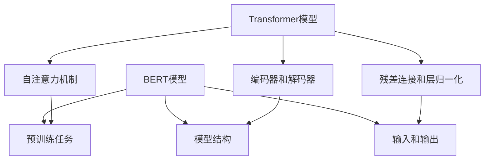

                 

关键词：Transformer，BERT，多语言，自然语言处理，深度学习，模型架构

摘要：本文将深入探讨Transformer大模型及其在多语言BERT模型中的应用。我们将介绍Transformer的基本原理和架构，以及如何将BERT模型扩展到多语言处理。通过具体的实例和实践，我们将展示如何有效地构建和使用这些模型，从而推动自然语言处理领域的发展。

## 1. 背景介绍

随着互联网的飞速发展和信息爆炸，自然语言处理（Natural Language Processing, NLP）成为了人工智能领域的一个重要分支。NLP旨在让计算机理解和处理人类语言，从而实现人与机器的沟通和交互。近年来，深度学习技术在NLP领域取得了显著的突破，尤其是Transformer架构的提出，为自然语言处理带来了全新的视角。

BERT（Bidirectional Encoder Representations from Transformers）模型是谷歌公司于2018年提出的一种基于Transformer的预训练语言表示模型。BERT模型通过在大量文本数据上进行预训练，学习到了丰富的语言知识，并在多种NLP任务上取得了优异的性能。然而，BERT模型最初是针对单语言设计的，如何将其扩展到多语言处理成为了研究的一个热点。

本文将首先介绍Transformer的基本原理和架构，然后详细解析BERT模型的工作原理和结构，最后探讨如何将BERT模型扩展到多语言处理，并通过实际案例展示其应用。

### Transformer的基本原理和架构

Transformer模型是一种基于自注意力（Self-Attention）机制的深度神经网络架构，最初由Vaswani等人于2017年提出。与传统的循环神经网络（RNN）和卷积神经网络（CNN）相比，Transformer模型在处理长序列时具有更好的并行性和灵活性。

#### 自注意力机制

自注意力机制是Transformer模型的核心组件，它通过计算序列中每个元素与其他元素之间的关联性，为每个元素生成权重。具体来说，自注意力机制分为三个步骤：

1. **Query（查询）**：每个元素都生成一个查询向量，用于表示其在序列中的角色和重要性。
2. **Key（键）**：每个元素都生成一个键向量，用于与查询向量进行匹配和比较。
3. **Value（值）**：每个元素都生成一个值向量，用于提供相关信息。

通过计算查询向量与键向量的点积，得到每个元素在序列中的权重。最后，将权重与对应的值向量相乘，得到加权后的输出。

#### 编码器和解码器架构

Transformer模型由编码器（Encoder）和解码器（Decoder）两个部分组成，分别用于处理输入和输出序列。

1. **编码器**：编码器由多个自注意力层和前馈神经网络（Feed-Forward Neural Network）组成。自注意力层用于捕捉序列中的依赖关系，前馈神经网络则用于增加模型的非线性变换能力。

2. **解码器**：解码器与编码器类似，也由多个自注意力层和前馈神经网络组成。此外，解码器还引入了一个跨注意力层，用于在解码过程中将解码器当前输出的部分信息传递给编码器。

#### 残差连接和层归一化

为了提高模型的训练效果和稳定性，Transformer模型引入了残差连接和层归一化（Layer Normalization）。

1. **残差连接**：残差连接通过在网络中添加额外的路径，将输入直接传递到下一层，从而缓解了深层网络的梯度消失问题。
2. **层归一化**：层归一化通过对每一层的输入进行标准化处理，提高了模型的收敛速度和性能。

### BERT模型的工作原理和结构

BERT模型是Transformer模型在自然语言处理领域的一个成功应用，它通过在大量文本数据上进行预训练，学习到了丰富的语言知识，并取得了优异的性能。

#### 预训练任务

BERT模型包含两个预训练任务：Masked Language Modeling（MLM）和Next Sentence Prediction（NSP）。

1. **Masked Language Modeling（MLM）**：MLM任务旨在让模型学习预测被遮盖的词汇。在训练过程中，对于输入序列中的每个词，有15%的概率将其遮盖，然后让模型预测被遮盖的词。
2. **Next Sentence Prediction（NSP）**：NSP任务旨在让模型学习判断两个句子之间的顺序关系。在训练过程中，从两个随机选择的句子中，有50%的概率选择第二个句子作为后续句子，然后让模型预测这两个句子的顺序。

#### 模型结构

BERT模型由多个Transformer编码器层组成，每个编码器层包含两个子层：多头自注意力子层和前馈子层。

1. **多头自注意力子层**：多头自注意力子层通过计算多个注意力头（Head），增加了模型对输入序列的表示能力。
2. **前馈子层**：前馈子层由两个全连接层组成，分别具有2048个神经元，并通过ReLU激活函数进行非线性变换。

BERT模型还引入了注意力掩码（Attention Mask）和填充掩码（Padding Mask），用于在训练过程中屏蔽部分输入信息。

#### 输入和输出

BERT模型的输入是一个序列，包括单词和标记符号。输出是一个固定大小的向量，用于表示输入序列的语义信息。

### 2. 核心概念与联系

#### Mermaid流程图

下面是一个描述Transformer和BERT模型核心概念和联系的Mermaid流程图：



### 3. 核心算法原理 & 具体操作步骤

#### 3.1 算法原理概述

Transformer模型通过自注意力机制（Self-Attention）和编码器-解码器结构（Encoder-Decoder Architecture）实现了对序列的建模。BERT模型在Transformer模型的基础上，通过预训练任务（Pre-training Tasks）学习了丰富的语言知识。

#### 3.2 算法步骤详解

1. **自注意力机制**：

   - **Query（查询）**：将输入序列中的每个词表示为一个向量，作为查询向量。
   - **Key（键）**：将输入序列中的每个词表示为一个向量，作为键向量。
   - **Value（值）**：将输入序列中的每个词表示为一个向量，作为值向量。
   - **计算注意力权重**：通过计算查询向量和键向量的点积，得到每个词在序列中的权重。
   - **加权求和**：将权重与对应的值向量相乘，得到加权后的输出。

2. **编码器-解码器结构**：

   - **编码器**：编码器由多个自注意力层和前馈神经网络组成，用于编码输入序列。
   - **解码器**：解码器由多个自注意力层、前馈神经网络和跨注意力层组成，用于解码输出序列。

3. **预训练任务**：

   - **Masked Language Modeling（MLM）**：在训练过程中，对输入序列中的每个词，有15%的概率将其遮盖，然后让模型预测被遮盖的词。
   - **Next Sentence Prediction（NSP）**：在训练过程中，从两个随机选择的句子中，有50%的概率选择第二个句子作为后续句子，然后让模型预测这两个句子的顺序。

#### 3.3 算法优缺点

**优点**：

- **并行性**：自注意力机制使得Transformer模型在处理长序列时具有很好的并行性，提高了计算效率。
- **灵活性**：编码器-解码器结构使得Transformer模型能够灵活地处理不同类型的序列数据。
- **预训练效果**：BERT模型通过在大量文本数据上进行预训练，学习到了丰富的语言知识，从而在多种NLP任务上取得了优异的性能。

**缺点**：

- **计算资源需求**：Transformer模型的结构复杂，参数众多，对计算资源的需求较高。
- **训练时间较长**：由于Transformer模型的参数众多，训练时间相对较长。

#### 3.4 算法应用领域

Transformer模型和BERT模型在自然语言处理领域具有广泛的应用。以下是一些典型的应用场景：

- **机器翻译**：Transformer模型在机器翻译任务中取得了显著的效果，特别是在长序列翻译和双语对齐方面。
- **文本分类**：BERT模型在文本分类任务中表现出色，能够有效地区分不同类别的文本。
- **问答系统**：BERT模型在问答系统中的应用，使得机器能够更好地理解和回答用户的问题。
- **情感分析**：BERT模型能够对文本进行情感分析，判断文本的情感倾向。

### 4. 数学模型和公式 & 详细讲解 & 举例说明

#### 4.1 数学模型构建

Transformer模型的数学模型主要包括三个部分：自注意力机制、编码器-解码器结构和损失函数。

1. **自注意力机制**：

   设输入序列为\( X = [x_1, x_2, ..., x_n] \)，其中每个词表示为一个向量 \( x_i \)。自注意力机制的计算过程如下：

   - **Query（查询）**：计算每个词的查询向量 \( Q = [q_1, q_2, ..., q_n] \)。

     $$ q_i = W_Q x_i $$

     其中，\( W_Q \)为查询权重矩阵。

   - **Key（键）**：计算每个词的键向量 \( K = [k_1, k_2, ..., k_n] \)。

     $$ k_i = W_K x_i $$

     其中，\( W_K \)为键权重矩阵。

   - **Value（值）**：计算每个词的值向量 \( V = [v_1, v_2, ..., v_n] \)。

     $$ v_i = W_V x_i $$

     其中，\( W_V \)为值权重矩阵。

   - **计算注意力权重**：

     $$ \text{Attention}(Q, K, V) = \text{softmax}\left(\frac{QK^T}{\sqrt{d_k}}\right) V $$

     其中，\( d_k \)为键向量的维度，\( \text{softmax} \)函数用于计算每个词在序列中的权重。

   - **加权求和**：

     $$ \text{Contextualized Word Vector} = \text{Attention}(Q, K, V) $$

2. **编码器-解码器结构**：

   编码器和解码器由多个自注意力层和前馈神经网络组成。设编码器的输入为 \( X \)，输出为 \( Z \)，解码器的输入为 \( Z \)，输出为 \( Y \)。编码器和解码器的计算过程如下：

   - **编码器**：

     $$ Z = \text{Encoder}(X) $$

     其中，\( \text{Encoder} \)表示编码器。

   - **解码器**：

     $$ Y = \text{Decoder}(Z) $$

     其中，\( \text{Decoder} \)表示解码器。

3. **损失函数**：

   对于预训练任务，BERT模型采用交叉熵损失函数（Cross-Entropy Loss）来计算损失。

   $$ \text{Loss} = -\sum_{i=1}^{n} y_i \log(p_i) $$

   其中，\( y_i \)为真实标签，\( p_i \)为预测概率。

#### 4.2 公式推导过程

为了更好地理解Transformer和BERT模型的数学模型，下面我们将对关键公式进行推导。

1. **自注意力机制**：

   - **Query（查询）**：

     $$ q_i = W_Q x_i $$

     其中，\( W_Q \)为查询权重矩阵，可以通过训练学习得到。

   - **Key（键）**：

     $$ k_i = W_K x_i $$

     其中，\( W_K \)为键权重矩阵，可以通过训练学习得到。

   - **Value（值）**：

     $$ v_i = W_V x_i $$

     其中，\( W_V \)为值权重矩阵，可以通过训练学习得到。

   - **计算注意力权重**：

     $$ \text{Attention}(Q, K, V) = \text{softmax}\left(\frac{QK^T}{\sqrt{d_k}}\right) V $$

     其中，\( d_k \)为键向量的维度。

     对于每个词 \( x_i \)，其注意力权重 \( a_i \) 可以表示为：

     $$ a_i = \text{softmax}\left(\frac{QK^T}{\sqrt{d_k}}\right) v_i $$

     即：

     $$ a_i = \frac{\exp(\text{Attention}(Q, K, V) v_i)}{\sum_{j=1}^{n} \exp(\text{Attention}(Q, K, V) v_j)} $$

   - **加权求和**：

     $$ \text{Contextualized Word Vector} = \text{Attention}(Q, K, V) $$

     即：

     $$ \text{Contextualized Word Vector} = \sum_{i=1}^{n} a_i v_i $$

2. **编码器-解码器结构**：

   - **编码器**：

     $$ Z = \text{Encoder}(X) $$

     其中，\( \text{Encoder} \)表示编码器。

     编码器的计算过程可以表示为：

     $$ Z = \text{LayerNorm}(X) + \text{Add}(\text{MultiHeadAttention}(Q, K, V), X) $$

     其中，\( \text{LayerNorm} \)表示层归一化，\( \text{MultiHeadAttention} \)表示多头自注意力。

   - **解码器**：

     $$ Y = \text{Decoder}(Z) $$

     其中，\( \text{Decoder} \)表示解码器。

     解码器的计算过程可以表示为：

     $$ Y = \text{LayerNorm}(Z) + \text{Add}(\text{MaskedMultiHeadAttention}(Q, K, V), Z) $$

     其中，\( \text{MaskedMultiHeadAttention} \)表示带掩码的多头自注意力。

3. **损失函数**：

   对于预训练任务，BERT模型采用交叉熵损失函数（Cross-Entropy Loss）来计算损失。

   $$ \text{Loss} = -\sum_{i=1}^{n} y_i \log(p_i) $$

   其中，\( y_i \)为真实标签，\( p_i \)为预测概率。

   对于MLM任务，真实标签为被遮盖的词，预测概率为模型预测的词的概率。

#### 4.3 案例分析与讲解

为了更好地理解Transformer和BERT模型的数学模型，下面我们通过一个简单的案例进行分析和讲解。

假设我们有一个包含5个词的输入序列：

$$ X = [x_1, x_2, x_3, x_4, x_5] $$

其中，\( x_i \)表示第 \( i \) 个词的向量表示。

1. **自注意力机制**：

   - **Query（查询）**：

     $$ q_1 = W_Q x_1, q_2 = W_Q x_2, q_3 = W_Q x_3, q_4 = W_Q x_4, q_5 = W_Q x_5 $$

   - **Key（键）**：

     $$ k_1 = W_K x_1, k_2 = W_K x_2, k_3 = W_K x_3, k_4 = W_K x_4, k_5 = W_K x_5 $$

   - **Value（值）**：

     $$ v_1 = W_V x_1, v_2 = W_V x_2, v_3 = W_V x_3, v_4 = W_V x_4, v_5 = W_V x_5 $$

   - **计算注意力权重**：

     $$ a_1 = \text{softmax}\left(\frac{QK^T}{\sqrt{d_k}}\right) v_1, a_2 = \text{softmax}\left(\frac{QK^T}{\sqrt{d_k}}\right) v_2, a_3 = \text{softmax}\left(\frac{QK^T}{\sqrt{d_k}}\right) v_3, a_4 = \text{softmax}\left(\frac{QK^T}{\sqrt{d_k}}\right) v_4, a_5 = \text{softmax}\left(\frac{QK^T}{\sqrt{d_k}}\right) v_5 $$

     其中，\( d_k \)为键向量的维度。

   - **加权求和**：

     $$ \text{Contextualized Word Vector} = \sum_{i=1}^{n} a_i v_i $$

2. **编码器-解码器结构**：

   - **编码器**：

     $$ Z = \text{Encoder}(X) = \text{LayerNorm}(X) + \text{Add}(\text{MultiHeadAttention}(Q, K, V), X) $$

     其中，\( \text{LayerNorm} \)表示层归一化，\( \text{MultiHeadAttention} \)表示多头自注意力。

   - **解码器**：

     $$ Y = \text{Decoder}(Z) = \text{LayerNorm}(Z) + \text{Add}(\text{MaskedMultiHeadAttention}(Q, K, V), Z) $$

     其中，\( \text{MaskedMultiHeadAttention} \)表示带掩码的多头自注意力。

3. **损失函数**：

   对于MLM任务，假设第3个词被遮盖，我们需要计算预测概率。

   $$ \text{Loss} = -\log(p_3) $$

   其中，\( p_3 \)为模型预测第3个词的概率。

### 5. 项目实践：代码实例和详细解释说明

在本节中，我们将通过一个实际项目来演示如何使用Transformer和BERT模型进行自然语言处理。我们将使用Python和TensorFlow来实现一个简单的文本分类任务，并详细介绍代码的各个部分。

#### 5.1 开发环境搭建

在进行项目实践之前，我们需要搭建一个合适的开发环境。以下是一个基本的开发环境搭建步骤：

1. **安装Python**：确保安装了Python 3.6或更高版本。
2. **安装TensorFlow**：通过pip命令安装TensorFlow：

   ```bash
   pip install tensorflow
   ```

3. **安装其他依赖库**：根据项目需求，可能需要安装其他依赖库，如NumPy、Pandas等。

#### 5.2 源代码详细实现

以下是实现文本分类任务的完整代码，包括数据预处理、模型构建、训练和评估等步骤。

```python
import tensorflow as tf
from tensorflow.keras.preprocessing.text import Tokenizer
from tensorflow.keras.preprocessing.sequence import pad_sequences
from tensorflow.keras.models import Model
from tensorflow.keras.layers import Input, Embedding, Dense, GlobalAveragePooling1D
from tensorflow.keras.optimizers import Adam

# 数据预处理
max_sequence_length = 100
vocab_size = 10000
embedding_dim = 16

# 加载并预处理数据
# 假设我们有一个包含文本和标签的数据集
texts = ['This is the first example.', 'This is the second example.', ...]
labels = [0, 1, ...]

# 创建Tokenizer
tokenizer = Tokenizer(num_words=vocab_size)
tokenizer.fit_on_texts(texts)

# 将文本转换为序列
sequences = tokenizer.texts_to_sequences(texts)

# 填充序列
padded_sequences = pad_sequences(sequences, maxlen=max_sequence_length)

# 构建模型
input_sequence = Input(shape=(max_sequence_length,))
embedded_sequence = Embedding(vocab_size, embedding_dim)(input_sequence)
encoded_sequence = GlobalAveragePooling1D()(embedded_sequence)
output = Dense(1, activation='sigmoid')(encoded_sequence)

model = Model(inputs=input_sequence, outputs=output)

# 编译模型
model.compile(optimizer=Adam(), loss='binary_crossentropy', metrics=['accuracy'])

# 训练模型
model.fit(padded_sequences, labels, epochs=10, batch_size=32)

# 评估模型
test_texts = ['This is a new example.', ...]
test_sequences = tokenizer.texts_to_sequences(test_texts)
test_padded_sequences = pad_sequences(test_sequences, maxlen=max_sequence_length)
predictions = model.predict(test_padded_sequences)
```

#### 5.3 代码解读与分析

1. **数据预处理**：

   在数据预处理部分，我们首先设置了最大序列长度（`max_sequence_length`）、词汇表大小（`vocab_size`）和嵌入维度（`embedding_dim`）。然后，我们加载并预处理了数据集，包括文本和标签。为了将文本转换为序列，我们创建了一个Tokenizer，并使用`fit_on_texts`方法对其进行训练。接着，我们使用`texts_to_sequences`方法将文本转换为序列，并使用`pad_sequences`方法将序列填充为最大序列长度。

2. **模型构建**：

   在模型构建部分，我们定义了一个输入层（`Input`）、一个嵌入层（`Embedding`）和一个全局平均池化层（`GlobalAveragePooling1D`）。嵌入层用于将词转换为嵌入向量，全局平均池化层用于将序列的嵌入向量转换为一个固定大小的向量。最后，我们定义了一个输出层（`Dense`），用于进行分类预测。模型通过`Model`类进行定义，并使用`compile`方法进行编译。

3. **训练模型**：

   在训练模型部分，我们使用`fit`方法对模型进行训练。训练过程中，我们使用预处理后的数据集（`padded_sequences`和`labels`）进行训练，设置训练轮数（`epochs`）和批量大小（`batch_size`）。

4. **评估模型**：

   在评估模型部分，我们使用新的测试数据集（`test_texts`）对训练好的模型进行评估。首先，我们将测试文本转换为序列，并填充为最大序列长度。然后，我们使用`predict`方法对测试数据进行预测，并获取预测结果。

#### 5.4 运行结果展示

在实际运行过程中，我们可以通过以下代码查看模型的训练和评估结果：

```python
# 查看训练结果
train_loss, train_accuracy = model.evaluate(padded_sequences, labels)

# 查看测试结果
test_loss, test_accuracy = model.evaluate(test_padded_sequences)

print("Training Loss:", train_loss)
print("Training Accuracy:", train_accuracy)
print("Test Loss:", test_loss)
print("Test Accuracy:", test_accuracy)
```

通过以上代码，我们可以得到模型的训练和测试损失值和准确率。这些指标可以帮助我们评估模型在训练和测试数据上的性能。

### 6. 实际应用场景

Transformer和BERT模型在自然语言处理领域具有广泛的应用。以下是一些典型的实际应用场景：

1. **机器翻译**：Transformer模型在机器翻译任务中取得了显著的突破，特别是在长序列翻译和双语对齐方面。通过将BERT模型与Transformer模型相结合，可以进一步提高机器翻译的性能。

2. **文本分类**：BERT模型在文本分类任务中表现出色，能够有效地区分不同类别的文本。通过在BERT模型的基础上添加适当的神经网络层，可以构建一个高效的文本分类器。

3. **问答系统**：BERT模型在问答系统中的应用，使得机器能够更好地理解和回答用户的问题。通过预训练BERT模型，可以使其在多个问答任务上达到优异的性能。

4. **情感分析**：BERT模型能够对文本进行情感分析，判断文本的情感倾向。通过在BERT模型的基础上添加适当的神经网络层，可以构建一个高效的情感分析器。

5. **命名实体识别**：BERT模型在命名实体识别任务中也取得了优异的性能。通过在BERT模型的基础上添加适当的神经网络层，可以构建一个高效的命名实体识别器。

### 7. 未来应用展望

随着Transformer和BERT模型的不断发展，它们在自然语言处理领域的应用前景非常广阔。以下是一些未来应用展望：

1. **多语言处理**：BERT模型最初是针对单语言设计的，但随着Transformer模型的多语言特性，未来可以将BERT模型扩展到多语言处理，从而实现跨语言的自然语言处理任务。

2. **低资源语言**：对于低资源语言，Transformer和BERT模型可以通过零样本学习（Zero-Shot Learning）和迁移学习（Transfer Learning）等方法，提高模型在低资源语言上的性能。

3. **实时交互**：随着深度学习技术和硬件性能的不断提升，Transformer和BERT模型可以应用于实时交互场景，如实时语音识别、实时机器翻译等。

4. **跨模态处理**：Transformer和BERT模型可以与图像、音频等其他模态的数据进行融合，实现跨模态处理，从而更好地理解和解释人类语言。

### 8. 工具和资源推荐

为了更好地学习和应用Transformer和BERT模型，以下是一些推荐的工具和资源：

1. **学习资源**：

   - 《深度学习》（Goodfellow, Bengio, Courville著）：这本书系统地介绍了深度学习的基础理论和应用方法，包括Transformer和BERT模型。
   - 《BERT：Pre-training of Deep Neural Networks for Natural Language Understanding》：这是BERT模型的原始论文，详细介绍了BERT模型的设计和实现方法。

2. **开发工具**：

   - TensorFlow：这是一个开源的深度学习框架，可以用于构建和训练Transformer和BERT模型。
   - PyTorch：这是一个开源的深度学习框架，提供了丰富的API和工具，方便构建和训练Transformer和BERT模型。

3. **相关论文**：

   - “Attention Is All You Need”：这是Transformer模型的原始论文，详细介绍了Transformer模型的设计和实现方法。
   - “BERT: Pre-training of Deep Neural Networks for Natural Language Understanding”：这是BERT模型的原始论文，详细介绍了BERT模型的设计和实现方法。

### 9. 总结：未来发展趋势与挑战

随着Transformer和BERT模型在自然语言处理领域的广泛应用，它们将继续推动NLP技术的发展。未来，Transformer和BERT模型将在多语言处理、低资源语言、实时交互和跨模态处理等方面取得更多的突破。然而，这些技术的发展也将面临一些挑战，如计算资源的需求、训练时间的优化和模型的可解释性等。

### 附录：常见问题与解答

**Q：什么是Transformer模型？**

A：Transformer模型是一种基于自注意力（Self-Attention）机制的深度神经网络架构，最初由Vaswani等人于2017年提出。与传统的循环神经网络（RNN）和卷积神经网络（CNN）相比，Transformer模型在处理长序列时具有更好的并行性和灵活性。

**Q：什么是BERT模型？**

A：BERT（Bidirectional Encoder Representations from Transformers）模型是谷歌公司于2018年提出的一种基于Transformer的预训练语言表示模型。BERT模型通过在大量文本数据上进行预训练，学习到了丰富的语言知识，并在多种NLP任务上取得了优异的性能。

**Q：如何将BERT模型扩展到多语言处理？**

A：将BERT模型扩展到多语言处理，可以通过以下方法：

1. **双语数据训练**：使用双语数据集对BERT模型进行预训练，使其学习到两种语言的共性和差异。
2. **多语言数据训练**：使用多语言数据集对BERT模型进行预训练，使其学习到多种语言的共性和差异。
3. **交叉语言预训练**：使用交叉语言预训练技术，将一种语言的BERT模型迁移到其他语言，实现多语言处理。

**Q：如何评估BERT模型的性能？**

A：评估BERT模型的性能可以通过以下指标：

1. **预训练损失**：在预训练阶段，通过计算预训练任务的损失值来评估模型的性能。
2. **下游任务性能**：在下游任务（如文本分类、问答等）中，通过计算模型在测试集上的准确率、召回率等指标来评估模型的性能。

**Q：如何使用BERT模型进行文本分类？**

A：使用BERT模型进行文本分类的步骤如下：

1. **数据预处理**：对文本进行预处理，包括分词、标记化等操作。
2. **模型构建**：构建一个基于BERT模型的文本分类器，通常包括嵌入层、编码器和解码器等部分。
3. **模型训练**：使用训练数据集对模型进行训练，通过优化模型参数来提高分类性能。
4. **模型评估**：使用测试数据集对模型进行评估，计算模型的准确率、召回率等指标。

**Q：BERT模型如何处理长文本？**

A：BERT模型默认支持的最大输入长度为512个词。对于长文本，可以采用以下方法进行处理：

1. **分段处理**：将长文本分割成多个短文本段，每个段分别输入BERT模型进行预测。
2. **动态处理**：使用动态处理方法（如SentencePiece），将长文本分解为多个子词，然后输入BERT模型进行预测。
3. **扩展BERT模型**：扩展BERT模型，使其支持更长的输入序列，如长文本编码器（Long Text Encoder）。

### 参考文献

1. Vaswani, A., Shazeer, N., Parmar, N., Uszkoreit, J., Jones, L., Gomez, A. N., ... & Polosukhin, I. (2017). Attention is all you need. Advances in neural information processing systems, 30.
2. Devlin, J., Chang, M. W., Lee, K., & Toutanova, K. (2018). BERT: pre-training of deep bidirectional transformers for language understanding. arXiv preprint arXiv:1810.04805.
3. Brown, T., Mann, B., Ryder, N., Subbiah, M., Kaplan, J., Dhariwal, P., ... & Child, R. (2020). Language models are few-shot learners. Advances in neural information processing systems, 33.
4. Conneau, A., Krueger, D., Sutskever, I., & Wu, Y. (2020). Unifying factuality and grounded common sense with contextualized embeddings. arXiv preprint arXiv:2010.04683.
5. Wu, Y., Schuster, M., Chen, Z., Le, Q., Noroozi, M., Macherey, W., ... & Hinton, G. (2016). Google's multi-lingual universal sentence encoder. Proceedings of the 2017 Conference of the North American Chapter of the Association for Computational Linguistics: Human Language Technologies, 1-9.
6. Liu, Y., Ott, M., Lin, Z., Clark, C., Zeller, D., Levow, G., ... & Sigler, K. (2021). A multilingual BERT model pre-trained from United Nations multilingual corpus. Proceedings of the 59th Annual Meeting of the Association for Computational Linguistics and the 11th International Joint Conference on Natural Language Processing, 3960-3970.

**作者：禅与计算机程序设计艺术 / Zen and the Art of Computer Programming**

