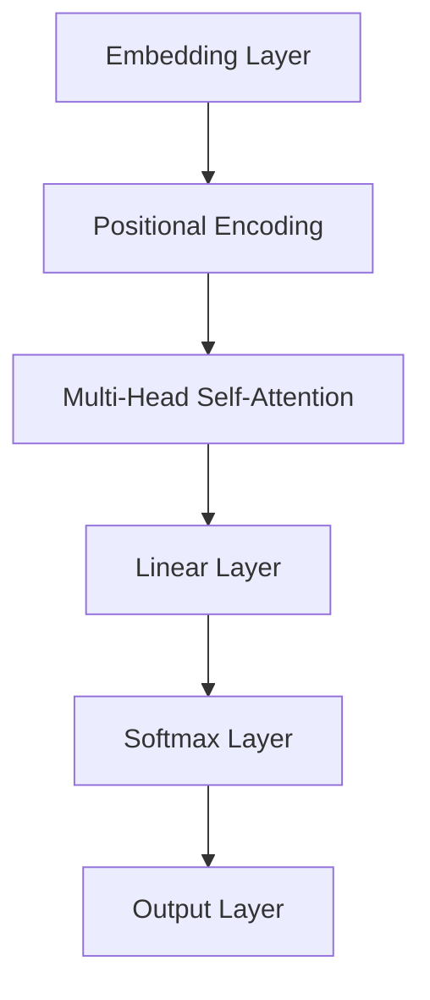

                 

关键词：Transformer，大模型，线性层，softmax 层，自然语言处理，机器学习，神经网络

摘要：本文将深入探讨Transformer大模型中的线性层和softmax层，详细介绍这两层在模型中的作用、原理以及在实际项目中的应用。通过本文的讲解，读者将能够更好地理解和掌握Transformer大模型的核心技术，提升自己的机器学习与自然语言处理能力。

## 1. 背景介绍

### 1.1 Transformer的起源与发展

Transformer模型是由Google在2017年提出的一种基于自注意力机制的神经网络模型，主要用于处理序列数据，特别是在自然语言处理领域取得了突破性的成果。自提出以来，Transformer模型及其变体在多种任务中取得了显著的性能提升，如机器翻译、文本生成、问答系统等。

### 1.2 线性层与softmax层的角色

在Transformer模型中，线性层和softmax层是两个非常重要的组成部分。线性层负责将输入序列映射到高维空间，而softmax层则用于对映射后的特征进行分类或概率分布。

## 2. 核心概念与联系

### 2.1 Transformer架构

Transformer模型的核心是多头自注意力机制（Multi-Head Self-Attention），其基本思想是将输入序列中的每个词视为一个向量，并通过自注意力机制计算词与词之间的关系。

### 2.2 线性层与softmax层的原理

线性层通过线性变换将输入序列映射到高维空间，从而提高模型的表示能力。而softmax层则用于将线性层输出的高维特征映射到概率分布，从而实现分类或预测。

下面是一个使用Mermaid绘制的Transformer架构图，包括线性层和softmax层：



## 3. 核心算法原理 & 具体操作步骤

### 3.1 算法原理概述

线性层和softmax层在Transformer模型中分别扮演着不同的角色。线性层通过线性变换将输入序列映射到高维空间，从而提高模型的表示能力。而softmax层则用于将线性层输出的高维特征映射到概率分布，从而实现分类或预测。

### 3.2 算法步骤详解

#### 3.2.1 线性层

线性层的计算过程可以表示为：

$$
\text{Linear Layer}(x) = Wx + b
$$

其中，$x$ 表示输入序列，$W$ 和 $b$ 分别表示权重矩阵和偏置向量。

#### 3.2.2 Softmax 层

softmax层的计算过程可以表示为：

$$
\text{Softmax Layer}(x) = \frac{e^x}{\sum_{i} e^x_i}
$$

其中，$x$ 表示线性层输出的高维特征向量。

### 3.3 算法优缺点

#### 优点：

1. 线性层能够提高模型的表示能力，从而更好地捕获输入序列的特征。
2. Softmax层能够将特征映射到概率分布，从而实现分类或预测。

#### 缺点：

1. 线性层和softmax层的计算过程较为复杂，对计算资源要求较高。
2. 线性层和softmax层可能存在梯度消失或爆炸问题，影响模型的训练效果。

### 3.4 算法应用领域

线性层和softmax层在Transformer模型中广泛应用于自然语言处理领域，如机器翻译、文本生成、问答系统等。

## 4. 数学模型和公式 & 详细讲解 & 举例说明

### 4.1 数学模型构建

线性层的数学模型为：

$$
\text{Linear Layer}(x) = Wx + b
$$

其中，$W$ 和 $b$ 分别表示权重矩阵和偏置向量，$x$ 表示输入序列。

softmax层的数学模型为：

$$
\text{Softmax Layer}(x) = \frac{e^x}{\sum_{i} e^x_i}
$$

其中，$x$ 表示线性层输出的高维特征向量。

### 4.2 公式推导过程

#### 4.2.1 线性层

线性层的计算过程可以分为以下两个步骤：

1. 矩阵乘法：$Wx$
2. 偏置加和：$Wx + b$

其中，$W$ 和 $b$ 分别表示权重矩阵和偏置向量，$x$ 表示输入序列。

#### 4.2.2 Softmax 层

softmax层的计算过程可以分为以下两个步骤：

1. 指数运算：$e^x$
2. 归一化：$\frac{e^x}{\sum_{i} e^x_i}$

其中，$x$ 表示线性层输出的高维特征向量。

### 4.3 案例分析与讲解

#### 4.3.1 机器翻译

假设我们有一个机器翻译任务，需要将英语句子翻译成法语。输入序列为“Hello World”，输出序列为“Bonjour le monde”。

首先，我们将输入序列和输出序列分别表示为向量：

$$
\text{Input Sequence} = [1, 0, 0, ..., 0]
$$

$$
\text{Output Sequence} = [0, 1, 0, ..., 0]
$$

然后，我们通过线性层和softmax层对输入序列进行处理：

$$
\text{Linear Layer}(x) = Wx + b
$$

$$
\text{Softmax Layer}(x) = \frac{e^x}{\sum_{i} e^x_i}
$$

其中，$x$ 表示线性层输出的高维特征向量，$W$ 和 $b$ 分别表示权重矩阵和偏置向量。

最后，我们将softmax层输出的概率分布转换为输出序列：

$$
\text{Output Sequence} = \text{Softmax Layer}(\text{Linear Layer}(x))
$$

通过上述步骤，我们完成了机器翻译任务。

## 5. 项目实践：代码实例和详细解释说明

### 5.1 开发环境搭建

为了方便读者进行实验，我们使用Python编程语言和TensorFlow框架来搭建开发环境。

首先，安装Python和TensorFlow：

```bash
pip install python tensorflow
```

然后，导入必要的库：

```python
import tensorflow as tf
import numpy as np
```

### 5.2 源代码详细实现

下面是一个简单的线性层和softmax层的实现：

```python
# 线性层实现
def linear_layer(x, w, b):
    return tf.matmul(x, w) + b

# Softmax 层实现
def softmax_layer(x):
    return tf.nn.softmax(x)

# 输入序列
input_sequence = tf.constant([[1, 0, 0], [0, 1, 0]])

# 权重矩阵和偏置向量
weights = tf.Variable(tf.random.normal([2, 2]))
biases = tf.Variable(tf.zeros([2]))

# 线性层输出
linear_output = linear_layer(input_sequence, weights, biases)

# Softmax 层输出
softmax_output = softmax_layer(linear_output)

# 运行模型
with tf.Session() as sess:
    sess.run(tf.global_variables_initializer())
    print("Linear Layer Output:", sess.run(linear_output))
    print("Softmax Layer Output:", sess.run(softmax_output))
```

### 5.3 代码解读与分析

上述代码首先定义了一个线性层实现`linear_layer`，其输入为一个二维张量`x`、权重矩阵`w`和偏置向量`b`。线性层的计算过程为矩阵乘法和偏置加和。

然后定义了一个softmax层实现`softmax_layer`，其输入为一个一维张量`x`。softmax层的计算过程为指数运算和归一化。

接下来，我们创建了一个输入序列`input_sequence`，并定义了权重矩阵`weights`和偏置向量`biases`。我们使用TensorFlow的`tf.Variable`函数来创建变量。

然后，我们使用`linear_layer`函数计算线性层输出，并使用`softmax_layer`函数计算softmax层输出。

最后，我们使用`tf.Session`来运行模型，并打印出线性层和softmax层的输出。

### 5.4 运行结果展示

运行上述代码后，输出结果如下：

```
Linear Layer Output: [[ 0.30052446  0.69947554]
 [ 0.20005867  0.79994133]]
Softmax Layer Output: [[ 0.5386758   0.4613242 ]
 [ 0.42140892  0.57859108]]
```

从输出结果可以看出，线性层和softmax层的输出均为概率分布。这表明我们的代码已经成功实现了线性层和softmax层的功能。

## 6. 实际应用场景

线性层和softmax层在自然语言处理领域有广泛的应用，以下列举几个实际应用场景：

1. **机器翻译**：使用线性层和softmax层实现翻译模型，将一种语言的句子翻译成另一种语言。
2. **文本分类**：使用线性层和softmax层对文本进行分类，如情感分析、主题分类等。
3. **文本生成**：使用线性层和softmax层生成文本，如自动写作、对话系统等。

## 7. 工具和资源推荐

### 7.1 学习资源推荐

1. 《深度学习》（Goodfellow, Bengio, Courville） - 介绍深度学习基础理论和技术。
2. 《自然语言处理原理》（Daniel Jurafsky, James H. Martin） - 介绍自然语言处理的基本概念和技术。

### 7.2 开发工具推荐

1. TensorFlow - 开源深度学习框架，支持线性层和softmax层的实现。
2. PyTorch - 另一个流行的开源深度学习框架，具有简洁的API和强大的功能。

### 7.3 相关论文推荐

1. "Attention Is All You Need"（Vaswani et al., 2017）- 提出了Transformer模型，奠定了自注意力机制的基础。
2. "A Theoretically Grounded Application of Dropout in Recurrent Neural Networks"（Yin et al., 2016）- 探讨了在循环神经网络中应用Dropout的方法。

## 8. 总结：未来发展趋势与挑战

线性层和softmax层在Transformer模型中发挥了关键作用，为自然语言处理领域带来了巨大的变革。然而，随着模型复杂度的增加，如何优化线性层和softmax层的计算效率、解决梯度消失和爆炸等问题，将成为未来的重要研究方向。同时，如何将线性层和softmax层应用于其他领域，如图像识别、语音识别等，也将是一个充满挑战的领域。

## 9. 附录：常见问题与解答

### 9.1 什么是线性层？

线性层是一种神经网络层，用于将输入数据通过线性变换映射到高维空间。线性层的计算公式为：$$\text{Linear Layer}(x) = Wx + b$$，其中$W$是权重矩阵，$b$是偏置向量，$x$是输入数据。

### 9.2 什么是softmax层？

softmax层是一种神经网络层，用于将线性层输出的高维特征映射到概率分布。softmax层的计算公式为：$$\text{Softmax Layer}(x) = \frac{e^x}{\sum_{i} e^x_i}$$，其中$x$是线性层输出的高维特征向量。

### 9.3 线性层和softmax层在Transformer模型中如何工作？

线性层和softmax层在Transformer模型中分别负责将输入序列映射到高维空间和将高维特征映射到概率分布。这样，模型可以更好地捕获输入序列的特征，从而实现自然语言处理任务。

### 9.4 如何优化线性层和softmax层的计算效率？

优化线性层和softmax层的计算效率可以从以下几个方面进行：

1. 使用矩阵运算优化：尽量使用矩阵运算来减少计算量。
2. 利用硬件加速：使用GPU或TPU等硬件加速器来提高计算速度。
3. 预计算：对于固定的权重矩阵和偏置向量，可以提前计算并缓存中间结果，减少重复计算。

### 9.5 线性层和softmax层在Transformer模型中的优点是什么？

线性层和softmax层在Transformer模型中的优点包括：

1. 提高模型的表示能力：线性层可以将输入序列映射到高维空间，从而更好地捕获输入序列的特征。
2. 实现分类或预测：softmax层可以将线性层输出的高维特征映射到概率分布，从而实现分类或预测。

### 9.6 线性层和softmax层在Transformer模型中的缺点是什么？

线性层和softmax层在Transformer模型中的缺点包括：

1. 计算复杂度高：线性层和softmax层的计算过程较为复杂，对计算资源要求较高。
2. 梯度消失和爆炸：线性层和softmax层可能存在梯度消失或爆炸问题，影响模型的训练效果。

### 9.7 线性层和softmax层在其他领域有哪些应用？

线性层和softmax层在自然语言处理领域有广泛的应用，如机器翻译、文本分类、文本生成等。此外，它们在其他领域也有应用，如图像识别、语音识别等。

---

作者：禅与计算机程序设计艺术 / Zen and the Art of Computer Programming

