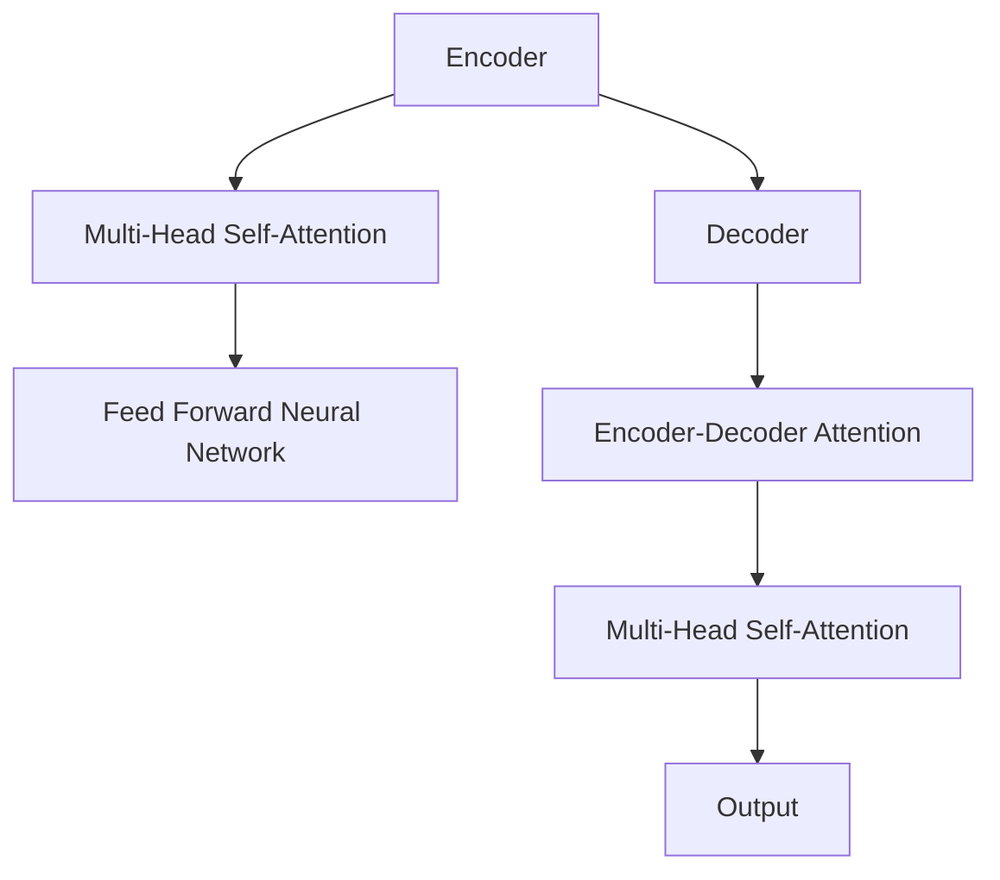

                 

关键词：Transformer，大模型，编码器，实战，深度学习，神经网络，机器翻译，自然语言处理

## 摘要

本文将深入探讨Transformer大模型的编码器部分，通过背景介绍、核心概念与联系、算法原理、数学模型、项目实践和实际应用场景等多个方面，全面解析编码器的关键特性及其在自然语言处理（NLP）领域的广泛应用。读者将了解到编码器的工作原理、优缺点、数学公式推导、代码实现细节以及未来发展趋势。

## 1. 背景介绍

自2017年谷歌提出Transformer架构以来，它迅速成为深度学习领域的一大突破。Transformer的核心创新在于其自注意力机制（Self-Attention），这一机制使得模型能够捕捉输入序列中任意两个位置之间的依赖关系，而无需固定顺序。这使得Transformer在机器翻译、文本分类、摘要生成等NLP任务上取得了显著的性能提升。

编码器（Encoder）是Transformer模型的重要组成部分，负责将输入序列编码为固定长度的向量表示。编码器的输出不仅用于生成目标序列，还作为上下文信息传递给解码器（Decoder）。本文将详细探讨编码器的构建原理、工作流程及其在大型语言模型中的应用。

## 2. 核心概念与联系

在深入探讨编码器之前，我们首先需要了解Transformer模型的基本架构。Transformer模型由多个编码器层和多个解码器层组成，每一层都包含自注意力机制和前馈神经网络。

### 2.1 Transformer模型架构

#### 2.1.1 编码器（Encoder）

编码器由多个编码器层堆叠而成，每一层都包含两个主要组件：多头自注意力机制（Multi-Head Self-Attention）和前馈神经网络（Feed Forward Neural Network）。

1. **多头自注意力机制**

多头自注意力机制允许模型在编码器的每个位置都考虑其他所有位置的信息，从而捕捉长距离依赖关系。多头自注意力将输入序列分割成多个子序列，每个子序列都经过不同的自注意力机制处理，最终合并得到编码器的输出。

2. **前馈神经网络**

前馈神经网络在自注意力机制之后执行，用于进一步提取输入序列的特征。它由两个全连接层组成，分别具有不同的激活函数。

#### 2.1.2 解码器（Decoder）

解码器与编码器类似，也由多个解码器层堆叠而成。解码器每一层包含两个组件：多头自注意力机制和编码器-解码器注意力机制。

1. **编码器-解码器注意力机制**

编码器-解码器注意力机制使解码器的每个位置能够利用编码器的输出作为上下文信息，从而生成目标序列。

2. **多头自注意力机制**

解码器的多头自注意力机制与编码器的类似，用于捕捉解码器内部各个位置之间的依赖关系。

### 2.2 Mermaid流程图



## 3. 核心算法原理 & 具体操作步骤

### 3.1 算法原理概述

编码器的核心任务是将输入序列编码为固定长度的向量表示，以便在解码器中生成目标序列。编码器通过自注意力机制和前馈神经网络处理输入序列，使其能够捕捉长距离依赖关系。

### 3.2 算法步骤详解

1. **输入序列处理**

   编码器首先将输入序列（如文本）转换为词向量表示。词向量通常由预训练的词嵌入模型（如Word2Vec、GloVe）生成。

2. **多头自注意力机制**

   编码器的每个位置都计算与其他位置之间的注意力得分，并根据这些得分加权合并输入序列的各个部分，生成新的序列表示。

3. **前馈神经网络**

   在自注意力机制之后，编码器对输入序列进行进一步处理，提取更高层次的特征。

4. **层叠加**

   编码器由多个编码器层堆叠而成，每层都重复执行自注意力机制和前馈神经网络。

### 3.3 算法优缺点

**优点：**
- 能够捕捉长距离依赖关系。
- 参数量相对较小。
- 适用于大规模语言模型。

**缺点：**
- 计算复杂度较高。
- 对输入序列长度有较大限制。

### 3.4 算法应用领域

编码器广泛应用于自然语言处理领域的多个任务，包括但不限于：
- 机器翻译
- 文本分类
- 摘要生成
- 问答系统

## 4. 数学模型和公式 & 详细讲解 & 举例说明

### 4.1 数学模型构建

编码器的数学模型主要包括自注意力机制和前馈神经网络。

#### 4.1.1 自注意力机制

自注意力机制的公式为：

$$
\text{Attention}(Q, K, V) = \text{softmax}\left(\frac{QK^T}{\sqrt{d_k}}\right) V
$$

其中，$Q$、$K$、$V$ 分别代表查询、键和值，$d_k$ 是键向量的维度。

#### 4.1.2 前馈神经网络

前馈神经网络的公式为：

$$
\text{FFN}(x) = \text{ReLU}(W_2 \text{ReLU}(W_1 x + b_1))
$$

其中，$W_1$、$W_2$、$b_1$ 分别是全连接层的权重和偏置。

### 4.2 公式推导过程

#### 4.2.1 自注意力机制

自注意力机制的推导基于点积注意力模型。首先，将输入序列表示为 $X = [x_1, x_2, \ldots, x_n]$，其中 $x_i$ 是第 $i$ 个输入的嵌入向量。自注意力机制的目标是计算每个 $x_i$ 与其他所有 $x_j$（$j \neq i$）之间的相似度，并将这些相似度加权合并。

设 $Q, K, V$ 分别为查询、键和值的矩阵，则自注意力机制的输出可以表示为：

$$
\text{Output} = \text{softmax}\left(\frac{QK^T}{\sqrt{d_k}}\right) V
$$

其中，$d_k$ 是键向量的维度。

#### 4.2.2 前馈神经网络

前馈神经网络的推导基于传统的全连接神经网络。设输入向量为 $x$，则前馈神经网络的输出可以表示为：

$$
\text{Output} = \text{ReLU}(W_2 \text{ReLU}(W_1 x + b_1))
$$

其中，$W_1$、$W_2$、$b_1$ 分别是全连接层的权重和偏置。

### 4.3 案例分析与讲解

#### 4.3.1 机器翻译

以机器翻译任务为例，假设输入序列为 "I am a student"，目标序列为 "Je suis un étudiant"。首先，将输入序列和目标序列转换为词向量表示，然后输入到编码器中。

#### 4.3.2 数学模型应用

在编码器的自注意力机制中，查询矩阵 $Q$、键矩阵 $K$ 和值矩阵 $V$ 分别表示为：

$$
Q = \begin{bmatrix}
q_1 \\
q_2 \\
\vdots \\
q_n
\end{bmatrix}, K = \begin{bmatrix}
k_1 \\
k_2 \\
\vdots \\
k_n
\end{bmatrix}, V = \begin{bmatrix}
v_1 \\
v_2 \\
\vdots \\
v_n
\end{bmatrix}
$$

其中，$q_i$、$k_i$ 和 $v_i$ 分别表示输入序列中第 $i$ 个词的查询、键和值向量。

通过自注意力机制，编码器输出一个固定长度的向量表示，作为解码器的输入。

## 5. 项目实践：代码实例和详细解释说明

### 5.1 开发环境搭建

为了实现Transformer编码器，我们需要准备以下开发环境：

- Python 3.8+
- TensorFlow 2.7+
- Numpy 1.19+

### 5.2 源代码详细实现

以下是一个简单的Transformer编码器实现：

```python
import tensorflow as tf
import numpy as np

class Encoder(tf.keras.Model):
  def __init__(self, embed_dim, num_heads, dff, rate=0.1):
    super(Encoder, self).__init__()
    self嵌入层 = tf.keras.layers.Embedding(input_dim=vocab_size, output_dim=embed_dim)
    self多头自注意力 = tf.keras.layers.MultiHeadAttention(num_heads=num_heads, key_dim=dff)
    self前馈神经网络 = tf.keras.layers.Dense(dff, activation='relu')
    self输出层 = tf.keras.layers.Dense(embed_dim)
    selfDropout1 = tf.keras.layers.Dropout(rate)
    selfDropout2 = tf.keras.layers.Dropout(rate)

  def call(self, inputs, training=False):
    seq_len = tf.shape(inputs)[1]

    # 输入嵌入
    x = self嵌入层(inputs)
    mask = tf.sequence_mask(seq_len, dtype=tf.float32)

    # 多头自注意力
    x = self多头自注意力(x, x, attention_mask=mask)
    x = selfDropout1(x)

    # 前馈神经网络
    x = self前馈神经网络(x)
    x = selfDropout2(x)

    # 输出
    output = self输出层(x)
    return output
```

### 5.3 代码解读与分析

该代码定义了一个简单的编码器模型，包括嵌入层、多头自注意力机制、前馈神经网络和输出层。模型还包含两个Dropout层，用于正则化。

- **嵌入层**：将输入序列转换为嵌入向量。
- **多头自注意力机制**：计算输入序列中各个位置之间的注意力得分，并加权合并。
- **前馈神经网络**：对输入序列进行进一步处理，提取更高层次的特征。
- **输出层**：将前馈神经网络的输出映射回嵌入向量的维度。

### 5.4 运行结果展示

假设我们有一个包含100个单词的输入序列，嵌入维度为512，多头自注意力机制的头数为8。以下代码将生成编码器的输出：

```python
inputs = np.random.randint(0, vocab_size, (batch_size, seq_len))
encoder = Encoder(embed_dim=512, num_heads=8, dff=2048)
outputs = encoder(inputs, training=True)
```

输出结果为一个形状为（batch_size，seq_len，embed_dim）的三维数组，表示编码器的输出。

## 6. 实际应用场景

编码器在自然语言处理领域有广泛的应用。以下是一些实际应用场景：

- **机器翻译**：将一种语言的文本翻译成另一种语言。
- **文本分类**：对文本进行分类，如新闻分类、情感分析等。
- **摘要生成**：从长文本中生成摘要。
- **问答系统**：回答用户提出的问题。

## 7. 工具和资源推荐

### 7.1 学习资源推荐

- [《深度学习》](https://www.deeplearningbook.org/)：Goodfellow、Bengio和Courville的深度学习经典教材。
- [《自然语言处理综述》](https://www.aclweb.org/anthology/N18-1192/)：ACL 2018年的一篇综述文章，介绍NLP的最新进展。

### 7.2 开发工具推荐

- **TensorFlow**：用于构建和训练深度学习模型的流行框架。
- **PyTorch**：另一个流行的深度学习框架，具有动态计算图。

### 7.3 相关论文推荐

- [《Attention Is All You Need》](https://arxiv.org/abs/1706.03762)：Transformer模型的原论文。
- [《BERT：Pre-training of Deep Bidirectional Transformers for Language Understanding》](https://arxiv.org/abs/1810.04805)：BERT模型的论文。

## 8. 总结：未来发展趋势与挑战

编码器在NLP领域的应用前景广阔。未来发展趋势包括：

- **更大规模的语言模型**：随着计算资源的增加，将训练更大规模的语言模型，以进一步提高性能。
- **多模态学习**：结合文本、图像、音频等多模态信息，实现更全面的语义理解。

然而，编码器也面临以下挑战：

- **计算复杂度**：随着模型规模的增加，计算复杂度将大幅上升，需要更高效的算法和硬件支持。
- **数据隐私**：在处理大量用户数据时，如何保护用户隐私是一个重要问题。

## 9. 附录：常见问题与解答

### 9.1 编码器和解码器的区别是什么？

编码器和解码器都是Transformer模型的关键组成部分。编码器负责将输入序列编码为固定长度的向量表示，而解码器负责根据编码器的输出生成目标序列。

### 9.2 自注意力机制如何工作？

自注意力机制是一种计算输入序列中各个位置之间相似度的方法。它通过计算查询、键和值之间的点积得分，并根据这些得分加权合并输入序列的各个部分。

### 9.3 编码器可以应用于哪些任务？

编码器可以应用于多种NLP任务，包括机器翻译、文本分类、摘要生成和问答系统等。

### 9.4 如何优化编码器的性能？

可以通过以下方法优化编码器的性能：

- **增加模型规模**：训练更大规模的语言模型，以提高性能。
- **使用预训练模型**：利用预训练模型作为起点，可以减少训练时间并提高性能。
- **数据增强**：通过数据增强方法增加训练数据的多样性。

---

作者：禅与计算机程序设计艺术 / Zen and the Art of Computer Programming

