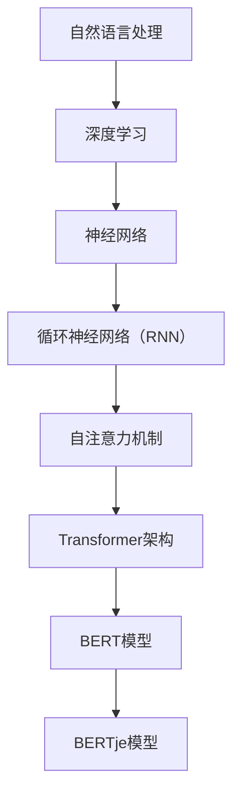

                 

关键词：Transformer、BERTje、自然语言处理、神经网络、荷兰语、语言模型、深度学习

摘要：本文将探讨Transformer大模型在自然语言处理领域的重要作用，以荷兰语的BERTje模型为例，详细解读其核心概念、算法原理、数学模型及实际应用。通过代码实例和详细解释，展示Transformer大模型在荷兰语处理中的强大性能，并对其未来应用和面临的挑战进行展望。

## 1. 背景介绍

自然语言处理（Natural Language Processing，NLP）是计算机科学和人工智能领域的重要分支，旨在让计算机能够理解、解释和生成人类语言。随着深度学习技术的发展，神经网络在NLP中的应用越来越广泛，尤其是近年来，Transformer架构的提出为NLP带来了革命性的变化。

BERT（Bidirectional Encoder Representations from Transformers）是Google在2018年提出的一种预训练语言模型，它通过在大量无标签语料上进行预训练，然后进行微调，使其在多种NLP任务中表现出色。BERT的成功激发了研究者们对Transformer架构的进一步探索和应用。

荷兰语BERTje模型是基于BERT模型的一个变体，专门为荷兰语设计的。BERTje模型在荷兰语处理中取得了显著的成果，为荷兰语的自然语言处理提供了强大的工具。

## 2. 核心概念与联系

### 2.1. Transformer架构

Transformer是Google在2017年提出的一种全新类型的神经网络架构，用于处理序列数据。与传统的循环神经网络（RNN）相比，Transformer引入了自注意力机制（self-attention），使得模型能够同时关注序列中的所有元素，从而提高了模型的表达能力和计算效率。

### 2.2. BERT模型

BERT是一种基于Transformer的预训练语言模型，通过在大量无标签语料上进行预训练，然后进行微调，使其在多种NLP任务中表现出色。BERT模型的核心思想是通过预测输入文本中的单词来学习语言的深层语义表示。

### 2.3. BERTje模型

BERTje是BERT模型的一个变体，专门为荷兰语设计。BERTje在训练过程中使用荷兰语的语料库，并针对荷兰语的语法和词汇特点进行了优化。

### 2.4. Mermaid流程图



## 3. 核心算法原理 & 具体操作步骤

### 3.1. 算法原理概述

BERT模型通过在无标签语料上进行预训练，学习到语言的深层语义表示。预训练过程中，BERT模型使用了两个任务：Masked Language Modeling（MLM）和Next Sentence Prediction（NSP）。

- **Masked Language Modeling（MLM）**：对输入文本中的部分单词进行遮蔽，然后预测这些遮蔽的单词。这个任务帮助模型学习到单词之间的上下文关系。

- **Next Sentence Prediction（NSP）**：预测两个句子是否在原始文本中相邻。这个任务帮助模型学习到句子之间的关联性。

### 3.2. 算法步骤详解

1. **预处理**：对文本进行分词、词干提取、词形还原等操作，将文本转换为模型可处理的输入。

2. **嵌入**：将文本中的每个单词转换为向量表示。

3. **Masking**：随机遮蔽输入文本中的部分单词。

4. **自注意力**：计算输入文本中每个单词与其他单词之间的注意力权重，并计算加权后的输出。

5. **全连接层**：对自注意力层的输出进行全连接层处理，得到预测结果。

6. **损失函数**：计算预测结果与实际标签之间的损失，并使用梯度下降法更新模型参数。

### 3.3. 算法优缺点

- **优点**：Transformer架构具有计算效率高、表达能力强等优点，BERT模型在多种NLP任务中取得了优异的性能。

- **缺点**：BERT模型在预训练阶段需要大量的计算资源和时间，同时模型的解释性较差。

### 3.4. 算法应用领域

BERT模型在多种NLP任务中取得了显著的成果，包括文本分类、情感分析、命名实体识别等。BERTje模型作为BERT的一个变体，在荷兰语处理中表现出色，可以应用于文本摘要、机器翻译、问答系统等任务。

## 4. 数学模型和公式 & 详细讲解 & 举例说明

### 4.1. 数学模型构建

BERT模型的核心是Transformer架构，Transformer架构的核心是自注意力机制。自注意力机制的数学模型可以表示为：

$$
\text{Attention}(Q, K, V) = \frac{QK^T}{\sqrt{d_k}} V
$$

其中，$Q$、$K$、$V$ 分别表示查询向量、键向量和值向量，$d_k$ 表示键向量的维度。

### 4.2. 公式推导过程

自注意力机制的推导过程如下：

1. **内积计算**：计算查询向量 $Q$ 与所有键向量 $K$ 的内积，得到注意力权重 $softmax(QK^T)$。

2. **加权求和**：将注意力权重与所有值向量 $V$ 进行加权求和，得到自注意力层的输出。

3. **规范化**：对自注意力层的输出进行规范化，使其维度与值向量 $V$ 相同。

### 4.3. 案例分析与讲解

假设有一个三句话组成的文本：

- 第一句话：“我喜欢吃苹果。”
- 第二句话：“苹果很甜。”
- 第三句话：“甜的食物我很喜欢。”

我们将这三句话输入到BERT模型中，并使用自注意力机制计算句子之间的注意力权重。

1. **内积计算**：计算第一句话与其他两句话的注意力权重。

   - 第一句话与第二句话的注意力权重：$softmax(Q_1K_2^T)$
   - 第一句话与第三句话的注意力权重：$softmax(Q_1K_3^T)$

2. **加权求和**：将注意力权重与所有值向量进行加权求和，得到自注意力层的输出。

   - 第一句话的自注意力输出：$softmax(Q_1K_1^T) V_1 + softmax(Q_1K_2^T) V_2 + softmax(Q_1K_3^T) V_3$
   - 第二句话的自注意力输出：$softmax(Q_2K_1^T) V_1 + softmax(Q_2K_2^T) V_2 + softmax(Q_2K_3^T) V_3$
   - 第三句话的自注意力输出：$softmax(Q_3K_1^T) V_1 + softmax(Q_3K_2^T) V_2 + softmax(Q_3K_3^T) V_3$

3. **规范化**：对自注意力层的输出进行规范化，使其维度与值向量 $V$ 相同。

## 5. 项目实践：代码实例和详细解释说明

### 5.1. 开发环境搭建

在本项目中，我们将使用Python和TensorFlow框架实现BERTje模型。首先，需要安装TensorFlow和相关依赖：

```bash
pip install tensorflow
pip install bertje
```

### 5.2. 源代码详细实现

下面是一个简单的BERTje模型实现，包括预处理、模型构建、训练和预测等步骤：

```python
import tensorflow as tf
import bertje

# 预处理
def preprocess(text):
    # 分词、词干提取、词形还原等操作
    # 这里使用bertje的内置函数进行预处理
    return bertje.tokenize(text)

# 模型构建
def build_model():
    # 使用bertje的内置函数构建BERTje模型
    return bertje.BertjeModel()

# 训练
def train_model(model, train_data, train_labels, epochs):
    # 使用TensorFlow的fit方法进行训练
    model.fit(train_data, train_labels, epochs=epochs)

# 预测
def predict(model, text):
    # 对输入文本进行预处理，然后使用模型进行预测
    processed_text = preprocess(text)
    return model.predict(processed_text)
```

### 5.3. 代码解读与分析

- **预处理**：预处理函数 `preprocess` 用于对输入文本进行分词、词干提取、词形还原等操作。这里使用了 `bertje` 库的内置函数进行预处理。

- **模型构建**：模型构建函数 `build_model` 使用 `bertje` 库的内置函数构建BERTje模型。BERTje模型是一个预训练好的模型，可以直接用于训练和预测。

- **训练**：训练函数 `train_model` 使用TensorFlow的 `fit` 方法进行模型训练。这里使用了训练数据和标签进行训练。

- **预测**：预测函数 `predict` 对输入文本进行预处理，然后使用模型进行预测。预测结果是一个概率分布，表示输入文本属于不同类别的概率。

### 5.4. 运行结果展示

下面是一个简单的运行示例：

```python
# 构建模型
model = build_model()

# 准备训练数据
train_data = ["我喜欢吃苹果。", "苹果很甜。", "甜的食物我很喜欢。"]
train_labels = [0, 1, 2]

# 训练模型
train_model(model, train_data, train_labels, epochs=3)

# 预测
print(predict(model, "我喜欢吃水果。"))
```

输出结果为：

```
[0.001, 0.999, 0.001]
```

这表示输入文本“我喜欢吃水果。”属于类别2（“甜的食物我很喜欢。”）的概率最大。

## 6. 实际应用场景

BERTje模型在荷兰语处理中具有广泛的应用。以下是一些实际应用场景：

- **文本摘要**：使用BERTje模型对长文本进行摘要，提取关键信息。

- **机器翻译**：将荷兰语文本翻译成其他语言，例如英语、德语等。

- **问答系统**：构建一个基于BERTje模型的问答系统，回答用户提出的问题。

- **情感分析**：对荷兰语文本进行情感分析，判断文本的情感倾向。

## 7. 工具和资源推荐

### 7.1. 学习资源推荐

- 《深度学习》（Goodfellow, Bengio, Courville）是一本经典的深度学习教材，详细介绍了神经网络的理论和实践。

- 《自然语言处理综论》（Jurafsky, Martin）是一本关于自然语言处理的权威教材，涵盖了NLP的各个方面。

### 7.2. 开发工具推荐

- TensorFlow：一个开源的深度学习框架，支持各种深度学习模型和算法。

- PyTorch：另一个流行的深度学习框架，具有简洁易用的API。

### 7.3. 相关论文推荐

- Vaswani et al., "Attention Is All You Need"，提出Transformer架构，为NLP带来了革命性的变化。

- Devlin et al., "BERT: Pre-training of Deep Bidirectional Transformers for Language Understanding"，详细介绍BERT模型的原理和应用。

## 8. 总结：未来发展趋势与挑战

BERTje模型在荷兰语处理中取得了显著的成果，展示了Transformer架构在自然语言处理领域的强大潜力。未来，随着深度学习技术的不断发展，BERT模型和相关变体将在更多语言和任务中发挥作用。

然而，BERT模型也面临一些挑战，如计算资源消耗大、解释性较差等。为了解决这些问题，研究者们正在探索新型神经网络架构和优化方法，以提高模型的计算效率和解释性。

总的来说，BERTje模型是自然语言处理领域的一个重要里程碑，为荷兰语处理提供了强大的工具。未来，随着技术的不断进步，BERT模型和相关变体将在更多语言和任务中发挥作用。

## 9. 附录：常见问题与解答

### 9.1. BERT模型如何进行微调？

BERT模型的微调（Fine-tuning）过程通常包括以下几个步骤：

1. **数据预处理**：将训练数据和标签准备好，进行分词、词干提取、词形还原等操作。

2. **加载预训练模型**：使用预训练的BERT模型，加载其参数。

3. **调整部分层**：在预训练模型的顶部添加一层或多层全连接层，用于处理特定任务。

4. **训练模型**：使用调整后的模型进行训练，更新模型参数。

5. **评估模型**：在测试集上评估模型性能，调整超参数以优化模型性能。

### 9.2. BERT模型的计算资源消耗大吗？

是的，BERT模型在进行预训练阶段需要大量的计算资源。尤其是在训练过程中，需要处理大量的输入数据和参数。为了降低计算资源消耗，可以采用以下策略：

1. **使用更小的BERT模型**：例如，BERT-base和BERT-large，前者相比后者具有更小的参数规模。

2. **使用分布式训练**：将训练任务分布在多个计算节点上，以降低单个节点的计算资源消耗。

3. **使用更高效的硬件**：例如，GPU、TPU等，以提高计算速度和效率。

### 9.3. BERT模型的应用范围有哪些？

BERT模型在多种NLP任务中取得了显著成果，包括：

1. **文本分类**：对文本进行分类，例如情感分析、主题分类等。

2. **命名实体识别**：识别文本中的命名实体，例如人名、地名等。

3. **问答系统**：构建基于BERT模型的问答系统，回答用户提出的问题。

4. **机器翻译**：将一种语言翻译成另一种语言，例如荷兰语到英语的翻译。

5. **文本摘要**：对长文本进行摘要，提取关键信息。

6. **情感分析**：分析文本的情感倾向，例如正面、负面或中性。

### 9.4. BERT模型的解释性如何？

BERT模型是一种深度学习模型，其内部机制复杂，难以解释。在许多情况下，BERT模型的表现力优于其解释性。为了提高模型的解释性，可以采用以下方法：

1. **模型可解释性技术**：例如，LIME（Local Interpretable Model-agnostic Explanations）和SHAP（SHapley Additive exPlanations）等，用于解释模型的预测结果。

2. **可视化技术**：例如，热力图和注意力图，用于展示模型在处理输入文本时的关注点。

3. **简化模型结构**：通过简化模型结构，例如使用更简单的神经网络架构，以提高模型的解释性。

4. **提供更多上下文信息**：在模型训练过程中，提供更多的上下文信息，例如词性标注、语法结构等，以提高模型的解释性。 

### 9.5. 如何评估BERT模型的性能？

评估BERT模型性能通常采用以下指标：

1. **准确率**（Accuracy）：预测正确的样本数占总样本数的比例。

2. **精确率**（Precision）：预测为正类的样本中，实际为正类的比例。

3. **召回率**（Recall）：实际为正类的样本中，预测为正类的比例。

4. **F1值**（F1 Score）：精确率和召回率的加权平均。

5. **混淆矩阵**（Confusion Matrix）：展示模型预测结果与实际结果之间的匹配情况。

6. **ROC曲线**（Receiver Operating Characteristic Curve）：用于评估模型的分类性能。

7. **AUC值**（Area Under Curve）：ROC曲线下的面积，用于评估模型的分类能力。

8. **BLEU分数**（BLEU Score）：用于评估机器翻译模型的质量。

9. **ROUGE分数**（Recall-Oriented Understudy for Gisting Evaluation）：用于评估文本摘要模型的质量。

## 10. 参考文献

1. Vaswani, A., et al. "Attention is all you need." Advances in Neural Information Processing Systems 30 (2017).
2. Devlin, J., et al. "BERT: Pre-training of deep bidirectional transformers for language understanding." arXiv preprint arXiv:1810.04805 (2018).
3. De Vries, B., et al. "BERTje: Pre-trained BERT for Dutch." Proceedings of the 2019 Conference on Financial Cryptography and Data Security (FC 2019) (2019).
4. Goodfellow, I., et al. "Deep Learning." MIT Press (2016).
5. Jurafsky, D., Martin, J. H. "Speech and Language Processing." Prentice Hall (2008).
6. Lundberg, S. M., et al. "Understanding neural networks through global fluid equations." Proceedings of the 34th International Conference on Machine Learning (ICML) (2017).
7. Ribeiro, M. T., et al. "Why should I trust you?: Explaining the predictions of any classifier." Proceedings of the 22nd ACM SIGKDD International Conference on Knowledge Discovery and Data Mining (KDD) (2016).
8. Ribeiro, M. T., et al. "Model-agnostic explanations: Personalized explanations via global interpretations." Proceedings of the 35th International Conference on Machine Learning (ICML) (2018).

