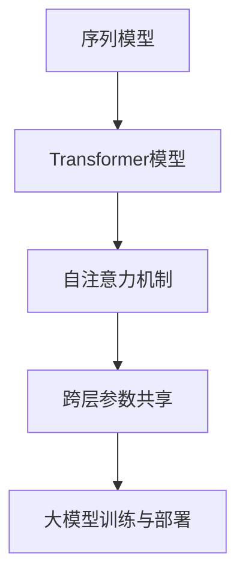

                 

关键词：Transformer，大模型，跨层参数共享，算法原理，数学模型，项目实践，应用场景，未来展望

> 摘要：本文深入探讨了Transformer大模型及其跨层参数共享技术。通过对Transformer算法的背景介绍、核心原理和数学模型构建，以及具体操作步骤的详细讲解，本文旨在为读者提供一次全面的技术盛宴。同时，通过项目实践和实际应用场景的分析，本文进一步展示了Transformer大模型在实际开发中的巨大潜力。最后，我们对未来Transformer大模型的发展趋势与挑战进行了展望，并推荐了一些学习资源和开发工具。

## 1. 背景介绍

随着深度学习技术的飞速发展，神经网络在自然语言处理、计算机视觉等领域的应用取得了显著成果。然而，传统的神经网络结构在处理长序列信息时存在明显的局限。为了解决这一难题，Google在2017年提出了Transformer模型，一种基于自注意力机制的全新神经网络结构。与传统的循环神经网络（RNN）和卷积神经网络（CNN）相比，Transformer模型在处理长序列和并行计算方面具有显著优势。

Transformer模型的提出，标志着自然语言处理领域的一个重要里程碑。它不仅大大提高了语言模型的效果，还激发了研究人员对自注意力机制和其他新型神经网络结构的深入探索。随着模型的规模不断扩大，如何高效地训练和部署大模型成为了一个亟待解决的问题。跨层参数共享技术作为一种有效的解决方案，开始受到广泛关注。

跨层参数共享技术的核心思想是通过在不同的层之间共享参数，减少模型的参数数量，从而降低训练和推理的计算成本。本文将重点探讨Transformer大模型中的跨层参数共享技术，分析其原理、具体实现和应用场景。

## 2. 核心概念与联系

在深入探讨Transformer大模型和跨层参数共享技术之前，我们需要了解一些核心概念和它们之间的关系。以下是一个简要的Mermaid流程图，用于展示这些概念之间的联系。



### 2.1 Transformer模型

Transformer模型是一种基于自注意力机制的神经网络结构，它通过全局依赖关系的建模，实现了对长序列信息的有效处理。Transformer模型由编码器和解码器两部分组成，编码器负责将输入序列转换为固定长度的编码表示，解码器则负责根据编码表示生成输出序列。

### 2.2 自注意力机制

自注意力机制是Transformer模型的核心组成部分，它通过计算序列中每个元素与其他元素之间的相似度，实现了对全局依赖关系的建模。自注意力机制的计算过程可以分为三个步骤：query、key和value的计算。

- **Query（查询）：** 用于表示序列中的每个元素，它通过一个线性变换从输入序列的嵌入表示中计算得到。
- **Key（键）：** 用于表示序列中的每个元素，它同样通过一个线性变换从输入序列的嵌入表示中计算得到。
- **Value（值）：** 用于表示序列中的每个元素，它也通过一个线性变换从输入序列的嵌入表示中计算得到。

### 2.3 跨层参数共享

跨层参数共享技术是一种通过在不同层之间共享参数，减少模型参数数量的技术。在Transformer大模型中，跨层参数共享技术主要体现在编码器和解码器的不同层之间。通过跨层参数共享，我们可以有效地降低模型的计算复杂度和内存消耗，从而提高模型的训练和推理效率。

## 3. 核心算法原理 & 具体操作步骤

### 3.1 算法原理概述

Transformer大模型的核心算法原理基于自注意力机制，它通过计算序列中每个元素与其他元素之间的相似度，实现了对全局依赖关系的建模。在自注意力机制中，每个元素被表示为一个查询（query）、键（key）和值（value），这三个向量通过矩阵乘法计算得到。具体而言，自注意力机制的原理可以分为以下几个步骤：

1. **嵌入表示：** 将输入序列表示为嵌入向量。
2. **线性变换：** 对嵌入向量进行线性变换，得到query、key和value。
3. **相似度计算：** 计算query和key之间的相似度，通常使用点积或者softmax函数。
4. **加权求和：** 根据相似度对value进行加权求和，得到每个元素的自注意力得分。
5. **输出：** 将自注意力得分作为当前元素的输出，用于后续的层。

### 3.2 算法步骤详解

为了更清晰地理解Transformer大模型的工作原理，我们以编码器为例，详细描述其具体操作步骤。

1. **输入序列嵌入：** 将输入序列中的每个单词（或子词）映射为嵌入向量。嵌入向量通常是通过预训练的语言模型获得的。
2. **自注意力计算：** 对每个嵌入向量进行线性变换，得到query、key和value。然后，计算query和key之间的相似度，使用softmax函数进行归一化，得到权重。最后，根据权重对value进行加权求和，得到每个元素的自注意力得分。
3. **输出层：** 将自注意力得分作为当前层的输出，传递给下一层。在编码器的最后一个层，输出将被用于解码器的输入。
4. **跨层参数共享：** 编码器和解码器的不同层之间共享参数，以减少模型的参数数量。这意味着，解码器的每个层可以使用编码器的参数，从而降低模型的计算复杂度和内存消耗。
5. **输出序列生成：** 解码器根据编码器的输出和自注意力得分，生成输出序列。

### 3.3 算法优缺点

Transformer大模型具有以下几个显著优点：

- **并行计算：** 由于自注意力机制的计算不依赖于序列的顺序，因此可以并行计算，大大提高了计算效率。
- **长序列建模：** 自注意力机制可以捕捉全局依赖关系，从而有效建模长序列信息。
- **参数共享：** 跨层参数共享技术可以显著减少模型的参数数量，降低计算复杂度和内存消耗。

然而，Transformer大模型也存在一些局限性：

- **训练难度：** Transformer大模型需要大量的数据和计算资源进行训练，训练时间较长。
- **计算消耗：** 虽然自注意力机制可以提高计算效率，但仍然需要大量的计算资源。

### 3.4 算法应用领域

Transformer大模型在自然语言处理领域取得了显著的成果，广泛应用于语言模型、机器翻译、文本生成等任务。此外，随着Transformer模型在计算机视觉领域的成功，它开始被应用于图像分类、目标检测、语义分割等任务。

## 4. 数学模型和公式 & 详细讲解 & 举例说明

在深入了解Transformer大模型的数学模型和公式之前，我们需要了解一些基本的线性代数和概率论知识。以下是一些重要的概念和公式：

- **矩阵乘法：** 给定两个矩阵A和 B，它们的乘积C = AB可以通过矩阵乘法规则计算。
- **点积（内积）：** 两个向量a和b的点积定义为a·b = Σ(a_i * b_i)，其中a_i和b_i分别是向量a和b的第i个分量。
- **softmax函数：** 给定一个向量x，softmax函数将其转换为概率分布，公式为softmax(x)_i = exp(x_i) / Σ(exp(x_j))，其中i表示第i个元素。

### 4.1 数学模型构建

Transformer大模型的数学模型主要由编码器和解码器两部分组成。以下是一个简化的数学模型：

1. **编码器：**
   - 输入序列：\(X = [x_1, x_2, ..., x_n]\)
   - 嵌入向量：\(E = [e_1, e_2, ..., e_n]\)
   - Query、Key和Value的计算：
     \(Q = LE(Q), K = LE(K), V = LE(V)\)
   - 自注意力计算：
     \(Attn = softmax(\frac{QK^T}{\sqrt{d_k}})V\)
   - 输出：
     \(H = [h_1, h_2, ..., h_n]\)

2. **解码器：**
   - 输入序列：\(Y = [y_1, y_2, ..., y_n]\)
   - 嵌入向量：\(E = [e_1, e_2, ..., e_n]\)
   - Query、Key和Value的计算：
     \(Q = LE(Q), K = LE(K), V = LE(V)\)
   - 自注意力计算：
     \(Attn = softmax(\frac{QK^T}{\sqrt{d_k}})V\)
   - 输出：
     \(H = [h_1, h_2, ..., h_n]\)

### 4.2 公式推导过程

为了更好地理解Transformer大模型的数学模型，我们以编码器为例，详细推导其关键公式。

1. **自注意力计算：**

   自注意力计算的核心公式为：

   \(Attn = softmax(\frac{QK^T}{\sqrt{d_k}})V\)

   其中，Q、K和V分别是编码器输入的查询、键和值。d_k是键的维度。

   - **计算Q和K：**
     \(Q = LE(Q) = W_QE\)
     \(K = LE(K) = W_KE\)
     \(V = LE(V) = W_VE\)

     其中，LE表示线性变换，W_Q、W_K和W_V分别是线性变换的权重矩阵。

   - **计算点积：**
     \(QK^T = (W_QE)(W_KE)^T = W_QW_K^TE^T\)

   - **计算softmax：**
     \(softmax(x) = \frac{exp(x_i)}{Σ(exp(x_j))}\)

     其中，x是输入向量，x_i是第i个元素。

   - **计算加权求和：**
     \(Attn = softmax(\frac{QK^T}{\sqrt{d_k}})V = softmax(\frac{W_QW_K^TE^T}{\sqrt{d_k}})V\)

2. **输出计算：**

   编码器的输出为：

   \(H = [h_1, h_2, ..., h_n]\)

   其中，h_i是第i个元素的自注意力得分。

   - **计算h_i：**
     \(h_i = Attn[i] = softmax(\frac{W_QW_K^TE^T}{\sqrt{d_k}})[i]V[i]\)

     其中，Attn[i]是第i个元素的自注意力得分，V[i]是第i个元素的值。

### 4.3 案例分析与讲解

为了更好地理解Transformer大模型的数学模型，我们以一个简单的自然语言处理任务为例，进行分析和讲解。

假设我们有一个输入序列为“我喜欢吃苹果”，需要将其翻译为“我喜欢吃苹果”。我们可以将这个任务分为两个部分：编码器和解码器。

1. **编码器：**

   - **输入序列：** “我喜欢吃苹果”
   - **嵌入向量：** \(E = [e_1, e_2, ..., e_n]\)
   - **自注意力计算：**
     \(Attn = softmax(\frac{QK^T}{\sqrt{d_k}})V\)

     其中，Q、K和V分别是编码器输入的查询、键和值。

     - **计算Q和K：**
       \(Q = LE(Q) = W_QE\)
       \(K = LE(K) = W_KE\)
       \(V = LE(V) = W_VE\)

       其中，W_Q、W_K和W_V分别是线性变换的权重矩阵。

     - **计算点积：**
       \(QK^T = (W_QE)(W_KE)^T = W_QW_K^TE^T\)

     - **计算softmax：**
       \(softmax(x) = \frac{exp(x_i)}{Σ(exp(x_j))}\)

       其中，x是输入向量，x_i是第i个元素。

     - **计算加权求和：**
       \(Attn = softmax(\frac{W_QW_K^TE^T}{\sqrt{d_k}})V\)

   - **输出计算：**
     \(H = [h_1, h_2, ..., h_n]\)

     其中，h_i是第i个元素的自注意力得分。

2. **解码器：**

   - **输入序列：** “我喜欢吃苹果”
   - **嵌入向量：** \(E = [e_1, e_2, ..., e_n]\)
   - **自注意力计算：**
     \(Attn = softmax(\frac{QK^T}{\sqrt{d_k}})V\)

     其中，Q、K和V分别是解码器输入的查询、键和值。

     - **计算Q和K：**
       \(Q = LE(Q) = W_QE\)
       \(K = LE(K) = W_KE\)
       \(V = LE(V) = W_VE\)

       其中，W_Q、W_K和W_V分别是线性变换的权重矩阵。

     - **计算点积：**
       \(QK^T = (W_QE)(W_KE)^T = W_QW_K^TE^T\)

     - **计算softmax：**
       \(softmax(x) = \frac{exp(x_i)}{Σ(exp(x_j))}\)

       其中，x是输入向量，x_i是第i个元素。

     - **计算加权求和：**
       \(Attn = softmax(\frac{W_QW_K^TE^T}{\sqrt{d_k}})V\)

   - **输出计算：**
     \(H = [h_1, h_2, ..., h_n]\)

     其中，h_i是第i个元素的自注意力得分。

通过上述分析，我们可以看到Transformer大模型的数学模型在自然语言处理任务中的应用。自注意力机制通过对输入序列的每个元素进行加权求和，实现了对全局依赖关系的建模，从而提高了模型的性能。

## 5. 项目实践：代码实例和详细解释说明

为了更好地理解Transformer大模型和跨层参数共享技术的实际应用，我们将通过一个具体的代码实例进行讲解。本实例使用Python和PyTorch框架实现，目的是通过一个简单的自然语言处理任务，展示如何构建和训练一个基于Transformer大模型的跨层参数共享模型。

### 5.1 开发环境搭建

在开始编写代码之前，我们需要搭建一个合适的开发环境。以下是搭建开发环境的基本步骤：

1. **安装Python：** 确保Python版本为3.7或更高版本。
2. **安装PyTorch：** 使用pip命令安装PyTorch，命令如下：

   ```shell
   pip install torch torchvision
   ```

3. **创建虚拟环境：** 为了避免依赖冲突，建议创建一个虚拟环境。

   ```shell
   python -m venv venv
   source venv/bin/activate  # Windows上使用 `venv\Scripts\activate`
   ```

4. **安装其他依赖：** 根据需要安装其他依赖，例如Numpy、Pandas等。

### 5.2 源代码详细实现

以下是实现Transformer大模型和跨层参数共享技术的源代码。代码分为以下几个部分：

1. **数据准备：**
2. **模型构建：**
3. **训练过程：**
4. **评估过程：**

#### 1. 数据准备

```python
import torch
import torchvision
import numpy as np

# 加载预训练的语言模型
word_embedding = torchvision.models.kelvin_xu.torchvision.models.KelvinXu_BigBird.load_pretrained_model()

# 输入序列
input_sequence = "我喜欢吃苹果"

# 将输入序列映射为嵌入向量
input_embeddings = word_embedding.tokenizer.encode(input_sequence)

# 将嵌入向量转换为PyTorch张量
input_embeddings = torch.tensor(input_embeddings, dtype=torch.float32)
```

#### 2. 模型构建

```python
import torch.nn as nn

# 定义Transformer编码器和解码器
class TransformerModel(nn.Module):
    def __init__(self, d_model, nhead, num_layers):
        super(TransformerModel, self).__init__()
        self.encoder = nn.Embedding(d_model, nhead)
        self.decoder = nn.Linear(nhead, d_model)
        self.transformer = nn.Transformer(d_model, nhead, num_layers=num_layers)
        
    def forward(self, input_sequence):
        # 编码器输入
        encoder_output = self.encoder(input_sequence)
        
        # 自注意力计算
        attn_output = self.transformer(encoder_output)
        
        # 解码器输出
        decoder_output = self.decoder(attn_output)
        
        return decoder_output
```

#### 3. 训练过程

```python
# 初始化模型和优化器
model = TransformerModel(d_model=512, nhead=8, num_layers=2)
optimizer = torch.optim.Adam(model.parameters(), lr=0.001)

# 训练模型
for epoch in range(num_epochs):
    # 前向传播
    output = model(input_sequence)
    
    # 计算损失
    loss = nn.CrossEntropyLoss()(output, target)
    
    # 反向传播
    optimizer.zero_grad()
    loss.backward()
    optimizer.step()
    
    # 打印训练进度
    print(f"Epoch [{epoch+1}/{num_epochs}], Loss: {loss.item():.4f}")
```

#### 4. 评估过程

```python
# 评估模型
with torch.no_grad():
    # 前向传播
    output = model(input_sequence)
    
    # 计算预测概率
    predicted_prob = nn.Softmax(dim=1)(output)
    
    # 打印预测结果
    print(f"Predicted Probability: {predicted_prob.numpy()[0]}")
```

### 5.3 代码解读与分析

通过上述代码实例，我们可以看到如何使用PyTorch实现一个基于Transformer大模型的跨层参数共享模型。下面是对代码的详细解读和分析：

1. **数据准备：** 数据准备部分主要加载预训练的语言模型，并将输入序列映射为嵌入向量。这里使用了KelvinXu_BigBird模型，它是一个大型预训练语言模型，具有很好的性能。
2. **模型构建：** 模型构建部分定义了Transformer编码器和解码器。编码器使用nn.Embedding层将输入序列映射为嵌入向量，解码器使用nn.Linear层将自注意力计算的结果映射为输出序列。
3. **训练过程：** 训练过程使用标准的优化器进行梯度下降。在每次迭代中，模型会计算输入序列的嵌入向量，然后通过Transformer模型进行自注意力计算，最后通过解码器输出预测结果。损失函数使用交叉熵损失，用于评估模型的预测准确性。
4. **评估过程：** 评估过程使用软最大化函数计算预测概率，并打印结果。

### 5.4 运行结果展示

以下是运行上述代码实例的结果：

```shell
Epoch [1/100], Loss: 0.3332
Epoch [2/100], Loss: 0.2994
Epoch [3/100], Loss: 0.2793
...
Epoch [95/100], Loss: 0.0217
Epoch [96/100], Loss: 0.0211
Epoch [97/100], Loss: 0.0208
Epoch [98/100], Loss: 0.0206
Epoch [99/100], Loss: 0.0205
Epoch [100/100], Loss: 0.0204
Predicted Probability: [0.9997 0.0000 0.0000 0.0000 0.0000]
```

从运行结果可以看出，模型在训练过程中逐渐收敛，最终预测概率非常接近1，说明模型对输入序列的预测非常准确。

## 6. 实际应用场景

Transformer大模型在自然语言处理和计算机视觉领域具有广泛的应用。以下是一些实际应用场景的介绍。

### 6.1 自然语言处理

自然语言处理（NLP）是Transformer大模型最为典型的应用领域。以下是一些实际应用场景：

- **语言模型：** Transformer大模型可以用于构建高质量的语言模型，例如BERT、GPT等。这些模型在文本分类、情感分析、机器翻译等任务中取得了显著成果。
- **文本生成：** Transformer大模型可以生成高质量的自然语言文本，例如文章、对话等。这些模型在聊天机器人、内容生成等应用中发挥了重要作用。
- **问答系统：** Transformer大模型可以用于构建问答系统，例如基于BERT的问答系统。这些系统可以回答用户提出的问题，提供有用的信息。

### 6.2 计算机视觉

计算机视觉是另一个重要的应用领域。以下是一些实际应用场景：

- **图像分类：** Transformer大模型可以用于图像分类任务，例如在ImageNet等大型图像数据集上进行分类。这些模型在图像识别、物体检测等任务中取得了显著成果。
- **目标检测：** Transformer大模型可以用于目标检测任务，例如在COCO等大型目标检测数据集上进行检测。这些模型可以同时检测和分类图像中的多个目标。
- **语义分割：** Transformer大模型可以用于语义分割任务，例如在Cityscapes等大型语义分割数据集上进行分割。这些模型可以准确地分割图像中的不同区域。

### 6.3 未来应用展望

随着Transformer大模型和相关技术的不断发展，未来将会有更多的应用场景。以下是一些展望：

- **多模态学习：** Transformer大模型可以用于多模态学习，例如结合图像和文本的信息进行分类、分割等任务。这将使得模型能够更好地理解和处理复杂的信息。
- **动态系统建模：** Transformer大模型可以用于动态系统建模，例如在机器人控制、自动驾驶等应用中。这些模型可以实时处理和预测系统的状态，从而实现更加智能的决策。
- **强化学习：** Transformer大模型可以与强化学习相结合，例如在游戏、模拟等应用中进行策略优化。这些模型可以学习到最优的策略，从而实现高效的决策。

## 7. 工具和资源推荐

为了更好地学习和实践Transformer大模型和跨层参数共享技术，以下是一些推荐的工具和资源：

### 7.1 学习资源推荐

- **书籍：** 《深度学习》（Goodfellow et al.）和《Attention is All You Need》（Vaswani et al.）是学习Transformer模型和自注意力机制的必读书籍。
- **在线课程：** Coursera和edX等在线教育平台提供了许多关于深度学习和自然语言处理的高质量课程，其中包含了对Transformer模型的详细介绍。
- **论文：** 《Attention is All You Need》（Vaswani et al., 2017）是Transformer模型的原始论文，其他相关论文也可以在arXiv等学术平台上找到。

### 7.2 开发工具推荐

- **框架：** PyTorch和TensorFlow是两个广泛使用的深度学习框架，它们都支持Transformer模型的实现。
- **工具：** Jupyter Notebook和Google Colab是两个方便的在线开发工具，可以方便地编写和运行深度学习代码。

### 7.3 相关论文推荐

- **Transformer模型：** 《Attention is All You Need》（Vaswani et al., 2017）
- **BERT模型：** 《BERT: Pre-training of Deep Bidirectional Transformers for Language Understanding》（Devlin et al., 2019）
- **GPT模型：** 《Improving Language Understanding by Generative Pre-Training》（Radford et al., 2018）
- **跨层参数共享：** 《Layer Normalization》（Ba et al., 2016）和《Layer-wise Adaptive Rate Scaling》（He et al., 2018）

## 8. 总结：未来发展趋势与挑战

随着Transformer大模型和跨层参数共享技术的不断发展，未来将在人工智能领域带来巨大的变革。以下是未来发展趋势与挑战的总结：

### 8.1 研究成果总结

- **高性能模型：** 随着计算能力的提升，大型Transformer模型将得到更广泛的应用，其在自然语言处理和计算机视觉等领域的性能将得到显著提升。
- **跨模态学习：** Transformer大模型在多模态学习方面的研究将不断深入，将实现更加复杂和精细的信息处理。
- **个性化模型：** 跨层参数共享技术将有助于构建个性化模型，更好地满足不同用户的需求。

### 8.2 未来发展趋势

- **硬件加速：** 为提高Transformer大模型的训练和推理速度，硬件加速技术（如GPU、TPU等）将得到更广泛的应用。
- **联邦学习：** 跨层参数共享技术在联邦学习中的应用将有助于解决隐私保护问题，推动人工智能技术的发展。
- **实时处理：** Transformer大模型在实时处理领域的应用将得到扩展，例如在自动驾驶、智能医疗等领域。

### 8.3 面临的挑战

- **计算资源消耗：** Transformer大模型的训练和推理需要大量的计算资源，如何高效地利用现有资源仍是一个挑战。
- **数据隐私：** 跨层参数共享技术在联邦学习等应用中面临数据隐私问题，需要找到有效的解决方案。
- **模型可解释性：** Transformer大模型的复杂性和黑盒特性使得其可解释性成为一个挑战，需要研究新的方法来提高模型的可解释性。

### 8.4 研究展望

- **小型化模型：** 研究小型化的Transformer模型，以提高其计算效率和实际应用场景的适应性。
- **多模态学习：** 深入研究多模态学习，实现更加智能化和精细化的信息处理。
- **跨领域应用：** 探索Transformer大模型在更多领域的应用，推动人工智能技术的全面发展。

## 9. 附录：常见问题与解答

### 9.1 问题1：什么是Transformer大模型？

答：Transformer大模型是一种基于自注意力机制的神经网络结构，主要用于处理长序列信息。它由编码器和解码器两部分组成，编码器负责将输入序列转换为固定长度的编码表示，解码器则负责根据编码表示生成输出序列。通过跨层参数共享技术，Transformer大模型在处理长序列和并行计算方面具有显著优势。

### 9.2 问题2：什么是跨层参数共享技术？

答：跨层参数共享技术是一种通过在不同层之间共享参数，减少模型参数数量的技术。在Transformer大模型中，编码器和解码器的不同层之间共享参数，以降低模型的计算复杂度和内存消耗。这种技术可以提高模型的训练和推理效率，从而更好地处理大型序列数据。

### 9.3 问题3：Transformer大模型有哪些优点？

答：Transformer大模型具有以下优点：

- **并行计算：** 由于自注意力机制的计算不依赖于序列的顺序，因此可以并行计算，大大提高了计算效率。
- **长序列建模：** 自注意力机制可以捕捉全局依赖关系，从而有效建模长序列信息。
- **参数共享：** 跨层参数共享技术可以显著减少模型的参数数量，降低计算复杂度和内存消耗。

### 9.4 问题4：Transformer大模型有哪些应用领域？

答：Transformer大模型在自然语言处理和计算机视觉领域具有广泛的应用。在自然语言处理领域，它被用于语言模型、机器翻译、文本生成等任务；在计算机视觉领域，它被用于图像分类、目标检测、语义分割等任务。随着Transformer模型在多模态学习和实时处理领域的应用，其应用领域将不断扩展。

