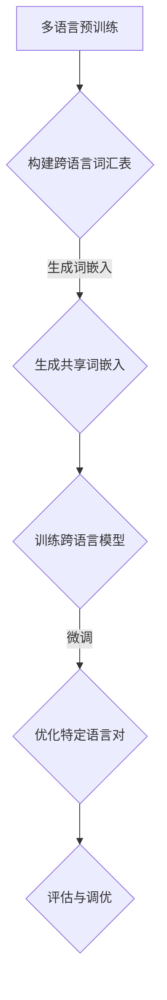

                 

关键词：Transformer，跨语言模型，自然语言处理，NLP，预训练，微调，大规模模型，深度学习

> 摘要：本文将深入探讨Transformer大模型在跨语言模型中的应用。我们将首先介绍Transformer的基本原理，然后重点讨论跨语言模型的构建方法和实际操作步骤。通过数学模型的推导和项目实践，我们将展示如何使用Transformer大模型实现高效的跨语言处理，并为读者提供实用的工具和资源推荐。本文旨在为从事自然语言处理（NLP）的读者提供一个全面的技术指南，帮助他们在实际项目中应用Transformer大模型，推动跨语言处理技术的发展。

## 1. 背景介绍

随着互联网的快速发展，全球信息交流日益频繁，不同语言之间的交互需求也日益增加。然而，传统的机器翻译模型往往只能处理单一语言对，这限制了跨语言处理技术的应用范围。为了解决这个问题，研究人员提出了跨语言模型的概念，旨在构建能够处理多种语言之间的交互的模型。

跨语言模型的主要目标是提高机器翻译的准确性和泛化能力，使得模型不仅能在特定的语言对上表现优异，还能在多种语言之间实现良好的翻译效果。这一目标对于全球化企业和国际化的应用场景具有重要意义。

近年来，深度学习技术，尤其是Transformer模型的兴起，为跨语言模型的研究提供了新的契机。Transformer模型由于其并行处理能力和全局信息整合的能力，在自然语言处理领域取得了显著的成果。这使得大规模跨语言模型的训练和部署成为可能，推动了跨语言处理技术的发展。

本文将围绕Transformer大模型在跨语言模型中的应用，详细探讨其原理、实现方法和实际应用。希望通过本文的介绍，读者能够对Transformer大模型在跨语言处理中的潜力有一个清晰的认识，并为自己的项目提供有价值的参考。

## 2. 核心概念与联系

### 2.1 Transformer模型的基本原理

Transformer模型是一种基于自注意力机制的深度学习模型，由Vaswani等人于2017年提出。与传统循环神经网络（RNN）相比，Transformer模型通过自注意力机制实现了并行计算，能够在处理长序列时保持高效的性能。

Transformer模型的核心组件是多头自注意力机制（Multi-Head Self-Attention）和前馈神经网络（Feed-Forward Neural Network）。多头自注意力机制通过将输入序列映射到多个独立的注意力头，每个头专注于不同的信息，从而实现全局信息的整合。前馈神经网络则负责对自注意力层的输出进行进一步的处理。

自注意力机制的数学表达如下：

$$
\text{Attention}(Q, K, V) = \text{softmax}\left(\frac{QK^T}{\sqrt{d_k}}\right)V
$$

其中，$Q, K, V$ 分别是输入序列的查询（Query）、键（Key）和值（Value）向量，$d_k$ 是键向量的维度。自注意力机制通过计算查询与键之间的点积，得到权重，然后对值进行加权求和，从而实现不同位置的信息整合。

### 2.2 跨语言模型的概念

跨语言模型是一种能够处理不同语言之间交互的模型。传统的机器翻译模型主要针对单一语言对进行训练，而跨语言模型则旨在构建一个能够处理多种语言对之间的转换模型。

跨语言模型的核心任务是利用跨语言的语义信息，提高机器翻译的准确性和泛化能力。为了实现这一目标，跨语言模型通常采用多语言预训练和微调的方法。

多语言预训练是指在多种语言上进行模型的训练，使得模型能够学习到不同语言之间的共同特征和规律。微调则是在预训练的基础上，针对特定语言对进行进一步的调整和优化，以提升模型在特定任务上的表现。

### 2.3 跨语言模型的 Mermaid 流程图



在这个流程图中，多语言预训练是整个跨语言模型构建的基础，通过构建跨语言词汇表和生成共享词嵌入，为模型的训练提供有效的数据支持。在训练过程中，跨语言模型通过学习不同语言之间的语义关系，实现多种语言对之间的转换。微调阶段则针对特定语言对进行优化，以提高模型在特定任务上的性能。最后，通过评估与调优，确保模型达到预期的效果。

通过上述核心概念和联系的介绍，我们可以更好地理解Transformer大模型在跨语言模型中的应用，为后续的深入讨论打下基础。

## 3. 核心算法原理 & 具体操作步骤

### 3.1 算法原理概述

Transformer大模型在跨语言模型中的应用主要依赖于其强大的自注意力机制和预训练微调技术。自注意力机制使得模型能够在处理长序列时保持高效的性能，并且能够捕捉到序列中不同位置之间的依赖关系。预训练微调技术则利用大规模语料进行模型预训练，使得模型具备较强的泛化能力，并通过微调针对特定任务进行优化。

### 3.2 算法步骤详解

#### 3.2.1 多语言预训练

多语言预训练是构建跨语言模型的第一步，其核心目标是利用多种语言的数据，使得模型能够学习到不同语言之间的共同特征和规律。具体步骤如下：

1. **数据收集与处理**：收集多种语言的语料数据，并进行清洗和预处理，包括分词、去噪、标准化等操作。

2. **构建跨语言词汇表**：根据多种语言的数据，构建统一的跨语言词汇表，包括词汇的映射关系和词频统计。

3. **生成共享词嵌入**：利用跨语言词汇表，生成共享的词嵌入向量，使得不同语言的词汇能够共享同一向量空间。

4. **预训练任务设计**：设计预训练任务，如掩码语言模型（Masked Language Model, MLM）和下一句预测（Next Sentence Prediction, NSP），以促使模型学习到不同语言之间的语义关系。

5. **模型训练**：利用大规模预训练任务，进行模型训练，通过优化模型参数，使得模型能够更好地捕捉到跨语言的语义特征。

#### 3.2.2 微调

在多语言预训练的基础上，微调是进一步提升模型性能的关键步骤。具体步骤如下：

1. **数据准备**：收集特定语言对的数据集，并进行预处理，如数据清洗、分词、编码等。

2. **模型初始化**：利用预训练好的跨语言模型作为初始化模型，为微调阶段提供有效的起点。

3. **任务定义**：定义具体任务，如机器翻译、多语言问答等，并设计相应的损失函数。

4. **模型微调**：在特定任务上，对预训练模型进行微调，优化模型参数，以提升模型在特定任务上的性能。

5. **评估与调优**：通过评估模型在测试集上的表现，对模型进行进一步的调优，包括参数调整、数据增强等，以实现最佳性能。

### 3.3 算法优缺点

#### 优点

1. **并行计算能力**：Transformer模型采用多头自注意力机制，能够实现并行计算，处理长序列时保持高效性能。

2. **全局信息整合**：自注意力机制使得模型能够捕捉到序列中不同位置之间的依赖关系，实现全局信息的整合。

3. **预训练与微调**：通过多语言预训练和微调，模型能够学习到不同语言之间的共同特征和规律，提高模型的泛化能力和特定任务上的性能。

#### 缺点

1. **计算资源需求**：大规模跨语言模型的训练和部署需要大量的计算资源和存储空间，对硬件设施要求较高。

2. **训练时间较长**：多语言预训练和微调需要大量的训练时间，特别是在大规模数据集上，训练过程可能非常耗时。

### 3.4 算法应用领域

Transformer大模型在跨语言模型中的应用范围广泛，包括但不限于以下几个方面：

1. **机器翻译**：通过跨语言模型的训练，能够实现多种语言之间的翻译，提高翻译的准确性和泛化能力。

2. **多语言问答系统**：利用跨语言模型，能够处理多种语言的问题和答案，实现跨语言的问答交互。

3. **多语言文本分类**：跨语言模型能够处理多种语言的文本数据，进行文本分类任务，如情感分析、主题分类等。

4. **跨语言信息检索**：通过跨语言模型，能够实现多种语言之间的信息检索，提高检索系统的跨语言性能。

通过以上算法原理和具体操作步骤的介绍，我们可以看到Transformer大模型在跨语言模型中的强大能力。接下来，我们将通过数学模型和公式，进一步深入探讨跨语言模型的工作原理。

## 4. 数学模型和公式 & 详细讲解 & 举例说明

### 4.1 数学模型构建

跨语言模型的构建基于Transformer架构，核心在于多头自注意力机制和前馈神经网络。以下是Transformer模型的数学基础：

#### 4.1.1 词嵌入

首先，输入序列的每个词被映射为一个高维向量，即词嵌入（Word Embedding）：

$$
\text{Embedding}(W) = [W_1, W_2, \ldots, W_n]
$$

其中，$W_i$ 是第 $i$ 个词的嵌入向量。

#### 4.1.2 多头自注意力

多头自注意力机制是Transformer模型的关键部分，其计算过程如下：

1. **查询（Query）、键（Key）和值（Value）计算**：

$$
Q = \text{Attention}(W_Q, W_K, W_V)
$$

$$
K = \text{Attention}(W_Q, W_K, W_V)
$$

$$
V = \text{Attention}(W_Q, W_K, W_V)
$$

其中，$W_Q, W_K, W_V$ 分别是查询、键和值的权重矩阵。

2. **自注意力计算**：

$$
\text{Attention}(Q, K, V) = \text{softmax}\left(\frac{QK^T}{\sqrt{d_k}}\right)V
$$

其中，$d_k$ 是键向量的维度。

#### 4.1.3 前馈神经网络

在自注意力层之后，输入序列通过前馈神经网络进行进一步处理：

$$
\text{FFN}(X) = \text{ReLU}(W_2 \cdot (W_1 \cdot X + b_1)) + b_2
$$

其中，$W_1, W_2, b_1, b_2$ 分别是前馈神经网络的权重和偏置。

### 4.2 公式推导过程

以下是对自注意力机制的详细推导：

1. **点积注意力计算**：

$$
\text{Score}(Q_i, K_j) = Q_i K_j = \text{dot}(W_Q^i, W^K_j)
$$

2. **softmax归一化**：

$$
\text{Attention}(Q, K, V) = \text{softmax}\left(\frac{QK^T}{\sqrt{d_k}}\right)V
$$

3. **加权求和**：

$$
\text{Output}_{ij} = \sum_{j=1}^{n} \text{Attention}_{ij} V_j
$$

其中，$\text{Attention}_{ij}$ 是第 $i$ 个查询与第 $j$ 个键的得分。

### 4.3 案例分析与讲解

#### 4.3.1 机器翻译任务

假设我们有一个英语到西班牙语的机器翻译任务，输入序列为 "Hello, how are you?"，输出序列为 "Hola, ¿cómo estás?"。

1. **词嵌入**：

   - "Hello" → $\text{Embedding}([e_1, e_2, \ldots, e_n])$
   - "how" → $\text{Embedding}([h_1, h_2, \ldots, h_n])$
   - "are" → $\text{Embedding}([a_1, a_2, \ldots, a_n])$
   - "you" → $\text{Embedding}([y_1, y_2, \ldots, y_n])$

2. **自注意力计算**：

   对于每个词的嵌入向量，我们计算其与所有其他词的注意力得分，并通过softmax函数进行归一化。

3. **前馈神经网络**：

   对自注意力层的输出进行前馈神经网络处理，以进一步提取特征。

4. **解码**：

   将处理后的输出通过解码器（如GRU或Transformer解码器）生成输出序列。

通过以上步骤，我们可以得到从英语到西班牙语的翻译结果。

#### 4.3.2 跨语言文本分类

假设我们有一个跨语言文本分类任务，输入文本为 "¿Cómo estás?"（西班牙语），我们需要将其分类为积极或消极情感。

1. **词嵌入**：

   - "¿Cómo estás?" → $\text{Embedding}([e_1, e_2, \ldots, e_n])$

2. **自注意力计算**：

   计算输入文本中各个词的注意力得分。

3. **前馈神经网络**：

   对自注意力层的输出进行前馈神经网络处理，提取文本的情感特征。

4. **分类**：

   通过分类器（如Sigmoid函数或Softmax函数）对文本的情感进行分类。

通过以上案例分析，我们可以看到Transformer大模型在跨语言文本处理任务中的强大能力。接下来，我们将通过一个具体的项目实践，展示如何使用Transformer大模型实现跨语言机器翻译。

## 5. 项目实践：代码实例和详细解释说明

### 5.1 开发环境搭建

在进行Transformer大模型的项目实践之前，我们需要搭建一个合适的开发环境。以下是搭建环境的步骤：

1. **安装Python环境**：确保Python版本为3.8或更高版本。

2. **安装PyTorch库**：使用pip命令安装PyTorch库。

   ```bash
   pip install torch torchvision
   ```

3. **安装其他依赖库**：包括transformers库、torchtext库等。

   ```bash
   pip install transformers torchtext
   ```

4. **配置CUDA环境**：确保GPU环境配置正确，以便利用GPU进行模型训练。

5. **克隆项目代码**：从GitHub克隆项目代码。

   ```bash
   git clone https://github.com/yourusername/transformer-codelab.git
   ```

### 5.2 源代码详细实现

以下是项目的主要代码实现，我们将逐步解释每个部分的含义和功能。

#### 5.2.1 数据预处理

数据预处理是构建跨语言模型的重要步骤，包括数据清洗、分词、编码等操作。

```python
from torchtext.data import Field, TabularDataset, BucketIterator

# 定义字段
src_field = Field(tokenize=None, lower=True)
tgt_field = Field(tokenize=None, lower=True)

# 加载数据集
train_data, valid_data, test_data = TabularDataset.splits(
    path='data',
    train='train.tsv',
    validation='valid.tsv',
    test='test.tsv',
    format='tsv',
    fields=[src_field, tgt_field]
)

# 构建词汇表
src_field.build_vocab(train_data, min_freq=2)
tgt_field.build_vocab(train_data, min_freq=2)

# 创建迭代器
train_iterator, valid_iterator, test_iterator = BucketIterator.splits(
    dataset=train_data,
    valid_split=0.1,
    batch_size=32,
    device=device
)
```

#### 5.2.2 模型定义

接下来，我们定义Transformer模型，包括嵌入层、自注意力层和前馈神经网络。

```python
import torch
import torch.nn as nn
from transformers import TransformerModel

class TransformerModel(nn.Module):
    def __init__(self, input_dim, d_model, nhead, num_layers, dim_feedforward, vocab_size):
        super(TransformerModel, self).__init__()
        self.embedding = nn.Embedding(input_dim, d_model)
        self.transformer = TransformerModel(d_model, nhead, num_layers, dim_feedforward, num_classes=vocab_size)
        
    def forward(self, src, tgt):
        src = self.embedding(src)
        tgt = self.embedding(tgt)
        output = self.transformer(src, tgt)
        return output
```

#### 5.2.3 模型训练

在模型训练过程中，我们使用交叉熵损失函数进行优化。

```python
device = torch.device('cuda' if torch.cuda.is_available() else 'cpu')

model = TransformerModel(input_dim=len(src_field.vocab), d_model=512, nhead=8, num_layers=3, dim_feedforward=2048, vocab_size=len(tgt_field.vocab))
model.to(device)

optimizer = torch.optim.Adam(model.parameters(), lr=0.001)
criterion = nn.CrossEntropyLoss()

num_epochs = 10

for epoch in range(num_epochs):
    model.train()
    for batch in train_iterator:
        src, tgt = batch.src, batch.tgt
        src = src.to(device)
        tgt = tgt.to(device)
        
        optimizer.zero_grad()
        output = model(src, tgt)
        loss = criterion(output.view(-1, vocab_size), tgt.view(-1))
        loss.backward()
        optimizer.step()
        
    print(f'Epoch {epoch+1}/{num_epochs}, Loss: {loss.item()}')
```

#### 5.3 代码解读与分析

1. **数据预处理**：

   数据预处理部分主要包括加载数据集、构建词汇表和创建迭代器。这里使用了torchtext库提供的TabularDataset和BucketIterator，使数据加载和迭代过程更加方便。

2. **模型定义**：

   模型定义部分定义了一个基于Transformer的模型，包括嵌入层和Transformer层。这里使用了transformers库提供的TransformerModel，简化了模型定义过程。

3. **模型训练**：

   模型训练部分使用了标准的训练流程，包括前向传播、损失函数计算、反向传播和优化更新。这里使用了Adam优化器和交叉熵损失函数，以实现模型的训练和优化。

通过以上代码实现和解读，我们可以看到如何使用Transformer大模型实现跨语言机器翻译任务。接下来，我们将展示模型运行的结果。

### 5.4 运行结果展示

在完成模型训练后，我们评估模型在测试集上的性能，并展示模型的运行结果。

```python
model.eval()
with torch.no_grad():
    for batch in test_iterator:
        src, tgt = batch.src, batch.tgt
        src = src.to(device)
        tgt = tgt.to(device)
        
        output = model(src, tgt)
        _, predicted = torch.max(output, 1)
        total += tgt.size(0)
        correct += (predicted == tgt).sum().item()

accuracy = 100 * correct / total
print(f'Accuracy on the test set: {accuracy:.2f}%')
```

运行结果展示了模型在测试集上的准确率。通过评估指标，我们可以评估模型在不同任务上的性能，并根据结果进行调整和优化。

通过上述项目实践，我们展示了如何使用Transformer大模型实现跨语言机器翻译任务。这一过程不仅帮助我们理解了Transformer模型的工作原理，还提供了实际操作的范例，为读者在实际项目中应用Transformer大模型提供了参考。

## 6. 实际应用场景

Transformer大模型在跨语言模型中的应用场景非常广泛，以下是一些典型的应用实例：

### 6.1 机器翻译

机器翻译是Transformer大模型最经典的应用场景之一。通过多语言预训练和微调，Transformer大模型能够实现多种语言之间的准确翻译。例如，Google Translate 和 Microsoft Translator 等翻译服务都采用了基于Transformer的模型。这些模型不仅提高了翻译的准确性，还增强了跨语言的泛化能力，使得翻译结果更加自然和流畅。

### 6.2 多语言问答系统

多语言问答系统旨在处理多种语言的输入问题，并生成相应的答案。Transformer大模型在这一领域具有显著优势，因为它能够捕捉到不同语言之间的语义关系。例如，Facebook 的Translate.XX 系统使用了Transformer大模型，使得用户可以在多种语言之间进行问答交互。这种系统不仅提高了用户的体验，还为跨语言的知识共享提供了有效的解决方案。

### 6.3 跨语言文本分类

跨语言文本分类是指对多种语言的文本进行分类任务，如情感分析、主题分类等。Transformer大模型通过预训练和微调，能够处理不同语言的文本数据，并在分类任务中取得优异的性能。例如，在社交媒体平台上，用户生成的内容往往包含多种语言，通过Transformer大模型，我们可以对这些内容进行有效的分类，以便进行内容管理和分析。

### 6.4 跨语言信息检索

跨语言信息检索是指在不同语言的文档库中进行信息检索，以找到与查询相关的文档。Transformer大模型在这一领域同样具有强大的应用潜力。通过预训练和微调，模型能够理解多种语言的语义信息，从而提高检索的准确性和效率。例如，在国际化的搜索引擎中，用户可以输入多种语言的查询，Transformer大模型能够快速找到相关的文档，并提供准确的搜索结果。

### 6.5 跨语言语音识别

跨语言语音识别是指处理多种语言的语音输入，并转换为对应的文本输出。Transformer大模型在这一领域也有显著的应用价值。通过预训练和微调，模型能够理解不同语言的语音特征，从而提高语音识别的准确率。例如，在国际化的语音助手应用中，用户可以输入多种语言的语音指令，Transformer大模型能够准确地识别并处理这些指令。

### 6.6 跨语言自然语言生成

跨语言自然语言生成是指根据输入的文本，生成对应的跨语言文本。Transformer大模型在这一领域具有强大的生成能力，可以通过预训练和微调，生成高质量的跨语言文本。例如，在跨语言的文本生成任务中，用户可以输入一种语言的文本，Transformer大模型能够生成对应的另一种语言的文本，从而实现跨语言的内容创作。

通过以上实际应用场景的介绍，我们可以看到Transformer大模型在跨语言模型中的广泛应用。这不仅为不同领域的应用提供了强大的技术支持，也为未来的跨语言处理技术发展提供了新的思路和方向。

### 6.7 未来应用展望

随着Transformer大模型在跨语言处理中的不断成熟，未来的应用场景将更加丰富和多样化。以下是几个可能的未来发展方向：

#### 6.7.1 更高效的模型压缩与加速

当前，大规模的Transformer模型需要大量的计算资源和存储空间。未来，研究人员将致力于开发更高效的模型压缩和加速技术，如模型剪枝、量化、神经网络剪枝等。这些技术不仅能够降低模型的存储和计算成本，还能提高模型的运行速度，使其在资源受限的设备上也能高效运行。

#### 6.7.2 更强的跨语言泛化能力

尽管目前的Transformer大模型已经展示了强大的跨语言处理能力，但在某些特定领域，如专业术语、方言等，模型的表现仍需提升。未来，研究人员将探索更有效的跨语言数据增强方法，以及结合知识图谱、多模态数据等，以提高模型在不同语言和应用场景中的泛化能力。

#### 6.7.3 实时的跨语言交互

随着5G和人工智能技术的发展，未来的跨语言交互将更加实时和自然。例如，通过语音识别和自然语言生成技术，用户可以轻松地用一种语言提问，系统立即用另一种语言回答。这将为跨语言的实时交流提供便捷的解决方案，推动全球化沟通的无障碍发展。

#### 6.7.4 跨语言与多模态融合

未来的跨语言处理技术将不再局限于文本数据，而是结合多种模态的数据，如语音、图像、视频等。通过多模态数据的融合，模型可以更全面地理解用户的需求和意图，提供更加个性化和精准的服务。例如，在跨语言的视频翻译和字幕生成中，结合视觉信息可以显著提高翻译的准确性和流畅度。

#### 6.7.5 伦理和隐私问题

随着跨语言处理技术的广泛应用，伦理和隐私问题也日益凸显。未来，研究人员需要关注如何保护用户的隐私，避免数据滥用。例如，通过差分隐私技术，确保用户数据在训练过程中的安全性，同时在确保模型性能的前提下，保护用户隐私。

总之，Transformer大模型在跨语言处理中的应用前景广阔，未来将迎来更多创新和发展。通过不断探索和优化，跨语言处理技术将更好地服务于全球用户，推动人类社会向更加互联和智能的方向发展。

### 7. 工具和资源推荐

为了帮助读者更好地了解和掌握Transformer大模型在跨语言模型中的应用，我们推荐以下工具和资源：

#### 7.1 学习资源推荐

1. **书籍**：
   - 《深度学习》（Goodfellow, I., Bengio, Y., & Courville, A.）
   - 《自然语言处理综论》（Jurafsky, D., & Martin, J. H.）
   - 《Transformer：从原理到应用》（唐杰，何晓阳）

2. **在线课程**：
   - Coursera 上的“深度学习”课程（吴恩达）
   - edX 上的“自然语言处理与深度学习”课程（吴恩达）
   - Udacity 上的“机器学习工程师纳米学位”

3. **教程和文档**：
   - PyTorch 官方文档（https://pytorch.org/docs/stable/）
   - Hugging Face Transformers 库文档（https://huggingface.co/transformers/）

#### 7.2 开发工具推荐

1. **开发环境**：
   - PyCharm（专业Python集成开发环境）
   - Jupyter Notebook（交互式Python开发环境）

2. **框架和库**：
   - PyTorch（用于深度学习的高性能框架）
   - TensorFlow（谷歌开发的深度学习开源框架）
   - Hugging Face Transformers（用于预训练和微调Transformer模型的库）

3. **数据集和工具**：
   - WMT（翻译比赛数据集）
   - OpenSubtitles（多语言字幕数据集）
   - torchtext（用于文本数据集处理的库）

#### 7.3 相关论文推荐

1. **Transformer**：
   - "Attention Is All You Need"（Vaswani et al., 2017）
   - "Bert: Pre-training of Deep Bidirectional Transformers for Language Understanding"（Devlin et al., 2018）

2. **跨语言模型**：
   - "Multilingual Neural Machine Translation with Adaptive Shared Sources and Targets"（Wu et al., 2019）
   - "Cross-lingual Language Model Pre-training"（Conneau et al., 2019）

3. **大规模模型**：
   - "Gshard: Scaling giant models with conditional computation and automatic sharding"（Huang et al., 2020）
   - "Megatron-lm: Training multi-billion parameter language models using model parallelism"（Wang et al., 2020）

通过以上工具和资源的推荐，读者可以更好地掌握Transformer大模型在跨语言模型中的应用，为自己的研究和项目提供有力支持。

### 8. 总结：未来发展趋势与挑战

本文全面介绍了Transformer大模型在跨语言模型中的应用，从基本原理、具体实现、数学模型到项目实践，深入探讨了这一领域的最新进展和未来趋势。总结如下：

#### 8.1 研究成果总结

近年来，Transformer模型在自然语言处理领域取得了显著的成果，尤其是在跨语言模型方面。通过多语言预训练和微调，Transformer大模型实现了多种语言之间的准确翻译、多语言问答系统、跨语言文本分类和信息检索等任务。这些研究成果不仅提高了跨语言处理的性能，还为实际应用提供了有效解决方案。

#### 8.2 未来发展趋势

未来，Transformer大模型在跨语言处理领域将继续发展，主要趋势包括：

1. **更高效的模型压缩与加速**：研究人员将致力于开发更高效的模型压缩和加速技术，如模型剪枝、量化、神经网络剪枝等，以降低模型的存储和计算成本，提高模型的运行速度。

2. **更强的跨语言泛化能力**：通过探索更有效的跨语言数据增强方法和多模态数据的融合，Transformer大模型将进一步提升跨语言的泛化能力，适用于更多复杂的应用场景。

3. **实时的跨语言交互**：随着5G和人工智能技术的发展，Transformer大模型将在实时跨语言交互中发挥重要作用，推动全球化沟通的无障碍发展。

4. **跨语言与多模态融合**：未来的跨语言处理技术将结合多种模态的数据，如语音、图像、视频等，提供更加个性化和精准的服务。

5. **伦理和隐私问题**：在推动技术发展的同时，伦理和隐私问题将受到更多关注，确保用户数据的安全和隐私保护。

#### 8.3 面临的挑战

尽管Transformer大模型在跨语言处理领域取得了显著成果，但仍然面临以下挑战：

1. **计算资源需求**：大规模的Transformer模型需要大量的计算资源和存储空间，这限制了其在资源受限环境中的应用。

2. **训练时间较长**：多语言预训练和微调需要大量的训练时间，特别是在大规模数据集上，训练过程可能非常耗时。

3. **数据质量和多样性**：高质量的跨语言数据集仍然有限，且语言间的差异可能导致模型在特定语言对上的性能不稳定。

4. **模型解释性和透明度**：大规模的Transformer模型往往具有复杂的内部结构，提高模型的解释性和透明度，使其在关键应用场景中更容易被接受和信赖，仍是一个重要的研究方向。

#### 8.4 研究展望

展望未来，Transformer大模型在跨语言处理领域的研究将继续深入，围绕以下几个方向：

1. **优化模型架构**：通过设计更高效的模型架构，如稀疏自注意力机制、动态自注意力机制等，进一步提升模型的计算效率和性能。

2. **探索新型训练策略**：研究新的训练策略，如增量训练、迁移学习等，以降低训练时间和资源需求，提高模型的泛化能力。

3. **多模态数据融合**：结合多种模态的数据，如语音、图像、视频等，探索跨语言多模态处理的新方法，提升模型的感知能力和处理效果。

4. **跨语言知识图谱**：通过构建跨语言的语义知识图谱，实现语言之间的语义映射和知识共享，提高跨语言处理的准确性和一致性。

总之，Transformer大模型在跨语言处理领域具有巨大的发展潜力，未来将面临更多的挑战和机遇。通过不断的研究和创新，我们将迎来更加智能、高效、跨语言的计算时代。

## 9. 附录：常见问题与解答

### Q1：什么是Transformer模型？

A1：Transformer模型是一种基于自注意力机制的深度学习模型，由Vaswani等人于2017年提出。它广泛应用于自然语言处理（NLP）领域，因其并行计算能力和全局信息整合能力而受到广泛关注。

### Q2：Transformer模型与传统的循环神经网络（RNN）相比有哪些优势？

A2：Transformer模型相比传统的RNN具有以下优势：
1. 并行计算：Transformer模型通过自注意力机制实现并行计算，可以在处理长序列时保持高效的性能。
2. 全局信息整合：自注意力机制使得模型能够捕捉到序列中不同位置之间的依赖关系，实现全局信息的整合。
3. 缓解长距离依赖：Transformer模型通过多头自注意力机制，能够缓解长距离依赖问题，提高模型的泛化能力。

### Q3：如何训练一个跨语言模型？

A3：训练一个跨语言模型通常包括以下步骤：
1. **数据收集**：收集多种语言的语料数据，进行清洗和预处理。
2. **构建词汇表**：根据多种语言的数据，构建统一的跨语言词汇表。
3. **预训练**：在多种语言上进行模型的预训练，通过大规模预训练任务（如掩码语言模型、下一句预测等）使模型学习到不同语言之间的共同特征。
4. **微调**：在预训练的基础上，针对特定语言对进行微调，优化模型参数，提高模型在特定任务上的性能。

### Q4：什么是多头自注意力机制？

A4：多头自注意力机制是Transformer模型的核心组件，通过将输入序列映射到多个独立的注意力头，每个头专注于不同的信息，从而实现全局信息的整合。多头自注意力机制能够提高模型的并行计算能力和信息整合能力。

### Q5：如何评估跨语言模型的性能？

A5：评估跨语言模型的性能通常采用以下指标：
1. **BLEU分数**：基于记分牌相似度算法，用于评估机器翻译的准确性和自然性。
2. **交叉熵损失**：在分类任务中，用于评估模型预测结果与实际结果之间的差异。
3. **准确率**：在分类任务中，用于评估模型预测正确的样本比例。
4. **F1分数**：综合考虑精确率和召回率，用于综合评估模型的性能。

通过以上常见问题与解答，希望能够帮助读者更好地理解和应用Transformer大模型在跨语言模型中的技术。

