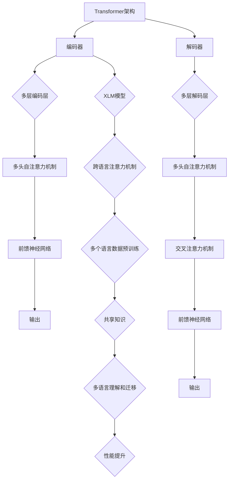

                 

关键词：Transformer、预训练、XLM模型、大规模语言模型、自然语言处理、模型训练、深度学习、编码器、解码器、BERT、GPT、GLM、语言模型架构、机器学习、文本分类、文本生成、对话系统、多语言模型、跨语言理解。

## 摘要

随着自然语言处理技术的不断发展，大规模语言模型（Large-scale Language Models）已经成为自然语言处理领域的重要工具。Transformer架构作为近年来最具影响力的模型之一，在处理自然语言任务中展现了出色的性能。本文将探讨如何使用Transformer架构预训练XLM（Cross-lingual Language Model）模型，并详细介绍其核心算法原理、数学模型、项目实践以及实际应用场景。通过本文的学习，读者将了解如何构建和训练跨语言的Transformer模型，以及如何将其应用于各种自然语言处理任务。

## 1. 背景介绍

### 大规模语言模型的发展

自然语言处理（NLP）是人工智能领域的一个重要分支，旨在使计算机能够理解和处理人类语言。在过去几十年中，NLP技术经历了显著的发展，从最初的规则驱动方法，到基于统计模型的转型，再到近年来深度学习技术的广泛应用，NLP领域取得了许多突破性成果。特别是大规模语言模型的兴起，使得许多复杂的NLP任务得以高效解决。

大规模语言模型通过在海量文本数据上进行预训练，学习到语言的通用表示和结构。这些模型可以应用于各种下游任务，如文本分类、机器翻译、问答系统等，取得了令人瞩目的效果。其中，Transformer架构作为大规模语言模型的核心，具有并行计算优势和强大的表示能力，逐渐取代了传统的循环神经网络（RNN）和卷积神经网络（CNN）。

### Transformer架构的原理

Transformer架构由Vaswani等人于2017年提出，其核心思想是使用自注意力机制（self-attention）来处理序列数据。自注意力机制允许模型在处理每个单词时，能够考虑到整个输入序列的信息，从而捕捉长距离依赖关系。与传统的循环神经网络相比，Transformer在并行计算和长距离依赖方面具有显著优势，因此在许多NLP任务中表现优异。

Transformer架构主要由编码器（Encoder）和解码器（Decoder）两部分组成。编码器负责将输入序列编码为固定长度的向量，解码器则负责生成输出序列。编码器和解码器之间通过多头注意力机制和多层叠加的方式，增强了模型的表示能力和计算效率。

### XLM模型的优势

XLM（Cross-lingual Language Model）是一种跨语言的Transformer模型，其目标是在不同语言之间共享知识和结构。与传统的单语言模型相比，XLM模型具有以下优势：

1. **多语言理解**：XLM模型可以处理多种语言的数据，使得跨语言任务（如机器翻译、多语言文本分类等）变得更加容易。
2. **共享知识**：通过共享参数，XLM模型可以在不同语言之间共享知识，从而提高模型在低资源语言上的性能。
3. **语言迁移**：XLM模型可以将一个语言的预训练知识迁移到其他语言，从而在低资源语言上实现更好的性能。

本文将详细探讨如何使用Transformer架构预训练XLM模型，以及其在实际应用中的效果和优势。

## 2. 核心概念与联系

### 核心概念

#### Transformer架构

Transformer架构是一种基于自注意力机制的新型神经网络架构，专门用于处理序列数据。其核心思想是使用多头注意力机制来捕捉输入序列中的长距离依赖关系。

#### 编码器（Encoder）

编码器是Transformer模型的前半部分，负责将输入序列编码为固定长度的向量。编码器由多个编码层（Encoder Layer）组成，每层包含多头自注意力机制和前馈神经网络。

#### 解码器（Decoder）

解码器是Transformer模型的后半部分，负责生成输出序列。解码器同样由多个解码层（Decoder Layer）组成，每层包含多头自注意力机制、交叉注意力机制和前馈神经网络。

#### XLM模型

XLM（Cross-lingual Language Model）是一种跨语言的Transformer模型，可以在不同语言之间共享知识和结构。XLM模型通过在多个语言的数据上进行预训练，实现了多语言理解和共享知识的目标。

### 架构联系

#### Transformer架构与编码器、解码器

Transformer架构由编码器（Encoder）和解码器（Decoder）两部分组成。编码器负责将输入序列编码为固定长度的向量，解码器则负责生成输出序列。编码器和解码器之间通过多头注意力机制和多层叠加的方式，增强了模型的表示能力和计算效率。

#### XLM模型与Transformer架构

XLM模型是基于Transformer架构构建的跨语言模型。XLM模型通过在多个语言的数据上进行预训练，实现了多语言理解和共享知识的目标。XLM模型在编码器和解码器的基础上，增加了跨语言注意力机制，使得模型能够在不同语言之间共享知识。

### Mermaid 流程图

下面是一个简化的Mermaid流程图，展示了Transformer架构与编码器、解码器以及XLM模型之间的联系：



### 小结

在本章节中，我们介绍了Transformer架构、编码器、解码器以及XLM模型的核心概念和联系。通过Mermaid流程图，我们展示了这些概念之间的相互作用。接下来，我们将深入探讨Transformer架构的核心算法原理，以及XLM模型的具体实现步骤。

## 3. 核心算法原理 & 具体操作步骤

### 3.1 算法原理概述

#### Transformer架构

Transformer架构是一种基于自注意力机制的神经网络架构，特别适用于处理序列数据。其核心思想是使用多头注意力机制来捕捉输入序列中的长距离依赖关系。自注意力机制允许模型在处理每个单词时，能够考虑到整个输入序列的信息，从而捕捉长距离依赖关系。

#### 编码器（Encoder）

编码器是Transformer模型的前半部分，负责将输入序列编码为固定长度的向量。编码器由多个编码层（Encoder Layer）组成，每层包含多头自注意力机制和前馈神经网络。编码器的输出通常用于后续的解码过程。

#### 解码器（Decoder）

解码器是Transformer模型的后半部分，负责生成输出序列。解码器由多个解码层（Decoder Layer）组成，每层包含多头自注意力机制、交叉注意力机制和前馈神经网络。解码器通过解码层的输出生成序列，直到达到终止条件或生成完整序列。

#### XLM模型

XLM（Cross-lingual Language Model）是一种基于Transformer架构的跨语言模型。XLM模型在编码器和解码器的基础上，增加了跨语言注意力机制，使得模型能够在不同语言之间共享知识。XLM模型通过在多个语言的数据上进行预训练，实现了多语言理解和共享知识的目标。

### 3.2 算法步骤详解

#### 数据预处理

在开始训练XLM模型之前，需要对输入数据进行预处理。预处理步骤包括分词、去除标点符号、将文本转换为词嵌入等。对于多语言数据，需要使用统一的词嵌入方法，以便在不同语言之间共享知识。

#### 编码器训练

编码器的训练过程包括以下几个步骤：

1. **输入序列编码**：将输入序列通过编码器编码为固定长度的向量。
2. **多头自注意力机制**：在每个编码层，使用多头自注意力机制计算输入序列的注意力权重，并将这些权重应用于输入序列，生成新的序列表示。
3. **前馈神经网络**：在每个编码层，对多头自注意力机制的输出进行前馈神经网络处理，增强模型的表示能力。
4. **损失函数计算**：计算编码器的输出与真实标签之间的损失，并使用反向传播算法更新模型参数。

#### 解码器训练

解码器的训练过程与编码器类似，但还包括以下额外的步骤：

1. **交叉注意力机制**：在解码器的每个层，使用交叉注意力机制计算编码器输出和解码器输入的注意力权重，并将这些权重应用于编码器输出，生成新的序列表示。
2. **生成序列**：在解码器的每个层，生成一个新的单词或符号，并将其添加到输出序列中。
3. **终止条件**：当达到终止条件（如生成完整序列或达到最大长度）时，解码器的训练过程结束。

#### 跨语言注意力机制

在XLM模型中，跨语言注意力机制是一个关键组件，它使得模型能够在不同语言之间共享知识。跨语言注意力机制通过以下步骤实现：

1. **多语言数据融合**：将不同语言的数据进行融合，生成一个统一的多语言嵌入。
2. **跨语言注意力计算**：在每个编码层和解码层，计算跨语言注意力权重，并将这些权重应用于多语言嵌入，生成新的序列表示。
3. **共享参数**：将跨语言注意力权重与编码器和解码器的参数共享，以便在不同语言之间共享知识。

### 3.3 算法优缺点

#### 优点

1. **多语言理解**：XLM模型能够在不同语言之间共享知识和结构，实现多语言理解和迁移。
2. **共享知识**：通过共享参数，XLM模型可以在低资源语言上获得更好的性能。
3. **并行计算**：Transformer架构具有并行计算优势，使得训练速度更快。

#### 缺点

1. **计算资源需求高**：由于XLM模型需要在多个语言的数据上进行预训练，因此计算资源需求较高。
2. **训练时间长**：与单语言模型相比，XLM模型的训练时间更长。

### 3.4 算法应用领域

XLM模型在多个自然语言处理任务中具有广泛的应用，包括：

1. **机器翻译**：XLM模型可以将一个语言的预训练知识迁移到其他语言，实现跨语言的机器翻译任务。
2. **文本分类**：XLM模型可以处理多种语言的数据，从而实现多语言文本分类任务。
3. **对话系统**：XLM模型可以用于构建多语言对话系统，实现跨语言的自然语言理解。

### 小结

在本章节中，我们详细介绍了Transformer架构、编码器、解码器以及XLM模型的核心算法原理和具体操作步骤。通过这些算法，XLM模型能够实现多语言理解和共享知识，从而在各种自然语言处理任务中取得出色的效果。接下来，我们将深入探讨XLM模型的数学模型和公式，以进一步理解其工作原理。

## 4. 数学模型和公式 & 详细讲解 & 举例说明

### 4.1 数学模型构建

#### Transformer架构

Transformer架构的数学模型主要基于自注意力机制（Self-Attention）和多头注意力机制（Multi-Head Attention）。以下是Transformer架构的核心数学模型：

1. **词嵌入（Word Embedding）**

词嵌入是将单词转换为固定长度的向量表示。在Transformer中，词嵌入通常是一个向量矩阵 \(W_e\)，其中 \(W_e \in \mathbb{R}^{d_e \times |V|}\)，\(d_e\) 是词嵌入的维度，\(|V|\) 是词汇表大小。输入序列 \(x\) 经过词嵌入操作后，转化为词嵌入向量序列 \(X \in \mathbb{R}^{d_e \times N}\)，其中 \(N\) 是序列长度。

$$
X = W_e [x_1, x_2, ..., x_N]
$$

2. **多头注意力（Multi-Head Attention）**

多头注意力是一种扩展自注意力机制的策略，它将输入序列通过多个独立的注意力头处理，每个头关注不同的信息。假设有 \(h\) 个注意力头，每个头的学习参数为 \(W_{qi}, W_{ki}, W_{vi}\)，则多头注意力的计算公式为：

$$
\text{MultiHead}(Q, K, V) = \text{softmax}\left(\frac{QK^T}{\sqrt{d_k}}\right) V
$$

其中，\(Q, K, V\) 分别是编码器的输入、键和值，\(d_k\) 是每个注意力头的键向量的维度。

3. **编码器（Encoder）和解码器（Decoder）**

编码器和解码器都由多个编码层和解码层组成，每层包含多头注意力机制和前馈神经网络。以下是编码器和解码器的总体计算公式：

**编码器：**

$$
\text{Encoder}(X) = \text{LayerNorm}(X + \text{EncoderLayer}(X))
$$

其中，\(\text{EncoderLayer}\) 包括多头注意力机制和前馈神经网络：

$$
\text{EncoderLayer}(X) = \text{MultiHeadAttention}(X, X, X) + X + \text{FeedForward}(X)
$$

**解码器：**

$$
\text{Decoder}(X) = \text{LayerNorm}(X + \text{DecoderLayer}(X))
$$

其中，\(\text{DecoderLayer}\) 包括多头注意力机制、交叉注意力机制和前馈神经网络：

$$
\text{DecoderLayer}(X) = \text{MaskedMultiHeadAttention}(X, X, X) + X + \text{MaskedMultiHeadAttention}(X, Y, Y) + X + \text{FeedForward}(X)
$$

其中，\(Y\) 是编码器的输出。

#### XLM模型

XLM模型在Transformer架构的基础上，增加了跨语言注意力机制（Cross-Lingual Attention）。以下是XLM模型的核心数学模型：

1. **多语言数据融合**

XLM模型将不同语言的数据进行融合，生成一个统一的多语言嵌入。假设有 \(L\) 个语言，每个语言的数据表示为 \(X^l \in \mathbb{R}^{d_e \times N^l}\)，则多语言嵌入 \(X_{\text{ML}}\) 的计算公式为：

$$
X_{\text{ML}} = \text{LayerNorm}\left(\sum_{l=1}^{L} W^l X^l\right)
$$

其中，\(W^l\) 是语言权重向量。

2. **跨语言注意力机制**

在编码器和解码器的每个层，XLM模型计算跨语言注意力权重，并将这些权重应用于多语言嵌入，生成新的序列表示：

$$
\text{CrossLingualAttention}(Q, K, V) = \text{softmax}\left(\frac{QK^T}{\sqrt{d_k}} + W_c \right) V
$$

其中，\(W_c\) 是跨语言注意力权重，\(Q, K, V\) 分别是编码器的输入、键和值。

### 4.2 公式推导过程

#### 自注意力（Self-Attention）

自注意力机制的核心思想是计算输入序列中每个词与其他词之间的相似度，并加权求和。以下是自注意力的推导过程：

假设输入序列 \(x = [x_1, x_2, ..., x_N]\)，其中每个词 \(x_i\) 都可以表示为一个向量 \(v_i \in \mathbb{R}^{d_v}\)。

1. **查询（Query）**

查询向量 \(q_i\) 是由词向量 \(v_i\) 通过变换得到的：

$$
q_i = W_Q v_i
$$

其中，\(W_Q \in \mathbb{R}^{d_k \times d_v}\) 是查询权重矩阵，\(d_k\) 是键向量的维度。

2. **键（Key）**

键向量 \(k_i\) 也是由词向量 \(v_i\) 通过变换得到的：

$$
k_i = W_K v_i
$$

其中，\(W_K \in \mathbb{R}^{d_k \times d_v}\) 是键权重矩阵。

3. **值（Value）**

值向量 \(v_i\) 保持不变：

$$
v_i = W_V v_i
$$

其中，\(W_V \in \mathbb{R}^{d_v \times d_v}\) 是值权重矩阵。

4. **相似度计算**

计算查询和键之间的相似度：

$$
\text{similarity}(q_i, k_i) = q_i k_i^T
$$

5. **加权求和**

将相似度应用于值向量，并使用softmax函数进行归一化：

$$
\text{attention}(q_i, k_i, v_i) = \text{softmax}\left(\frac{q_i k_i^T}{\sqrt{d_k}}\right) v_i
$$

#### 多头注意力（Multi-Head Attention）

多头注意力是自注意力机制的扩展，它将输入序列通过多个独立的注意力头处理，每个头关注不同的信息。以下是多头注意力的推导过程：

假设有 \(h\) 个注意力头，每个注意力头的计算公式与自注意力相同。

1. **分头**

将输入序列和权重矩阵分解为 \(h\) 个独立的注意力头：

$$
Q = [Q_1, Q_2, ..., Q_h], \quad K = [K_1, K_2, ..., K_h], \quad V = [V_1, V_2, ..., V_h]
$$

其中，\(Q_i, K_i, V_i\) 分别是第 \(i\) 个注意力头的查询、键和值。

2. **多头自注意力**

计算每个注意力头的自注意力：

$$
\text{MultiHeadAttention}(Q, K, V) = [\text{attention}(Q_1, K_1, V_1), ..., \text{attention}(Q_h, K_h, V_h)]
$$

3. **合并头**

将多头自注意力结果合并为一个向量：

$$
\text{MultiHead}(Q, K, V) = \text{Concat}(\text{attention}(Q_1, K_1, V_1), ..., \text{attention}(Q_h, K_h, V_h)) W_O
$$

其中，\(W_O \in \mathbb{R}^{d_v \times h \times d_v}\) 是合并权重矩阵。

### 4.3 案例分析与讲解

#### 案例一：文本分类

假设我们要使用XLM模型进行文本分类任务，其中输入序列为句子，输出为标签。以下是XLM模型在文本分类任务中的计算过程：

1. **词嵌入**

将输入句子转换为词嵌入向量序列：

$$
X = W_e [x_1, x_2, ..., x_N]
$$

2. **编码器**

通过编码器将词嵌入序列编码为固定长度的向量：

$$
\text{Encoder}(X) = \text{LayerNorm}(X + \text{EncoderLayer}(X))
$$

3. **解码器**

通过解码器生成标签：

$$
\text{Decoder}(\text{Encoder}(X)) = \text{softmax}(\text{DecoderLayer}(\text{Encoder}(X)))
$$

4. **损失函数**

计算模型输出与真实标签之间的损失，并使用反向传播算法更新模型参数。

#### 案例二：机器翻译

假设我们要使用XLM模型进行机器翻译任务，其中输入序列为源语言句子，输出为目标语言句子。以下是XLM模型在机器翻译任务中的计算过程：

1. **词嵌入**

将源语言句子转换为词嵌入向量序列：

$$
X^s = W_e [x_1, x_2, ..., x_N]
$$

将目标语言句子转换为词嵌入向量序列：

$$
X^t = W_e [y_1, y_2, ..., y_M]
$$

2. **编码器**

通过编码器将源语言句子编码为固定长度的向量：

$$
\text{Encoder}(X^s) = \text{LayerNorm}(X^s + \text{EncoderLayer}(X^s))
$$

3. **解码器**

通过解码器生成目标语言句子：

$$
\text{Decoder}(\text{Encoder}(X^s), X^t) = \text{softmax}(\text{DecoderLayer}(\text{Encoder}(X^s), X^t))
$$

4. **损失函数**

计算模型输出与目标语言句子之间的损失，并使用反向传播算法更新模型参数。

### 小结

在本章节中，我们详细介绍了XLM模型的数学模型和公式，包括词嵌入、多头注意力、编码器、解码器和跨语言注意力机制。通过这些数学模型，XLM模型能够实现多语言理解和共享知识，从而在各种自然语言处理任务中取得出色的效果。接下来，我们将通过一个实际项目实践，展示如何使用XLM模型进行文本分类任务。

## 5. 项目实践：代码实例和详细解释说明

### 5.1 开发环境搭建

在进行XLM模型的实践之前，需要搭建一个合适的技术栈和开发环境。以下是搭建XLM模型所需的开发环境和工具：

1. **Python**：Python是一种广泛使用的编程语言，特别是在数据科学和机器学习领域。确保安装了Python 3.6或更高版本。

2. **PyTorch**：PyTorch是一个流行的深度学习框架，提供了丰富的API和工具，方便进行模型训练和推理。可以通过以下命令安装PyTorch：

   ```bash
   pip install torch torchvision
   ```

3. **Transformers**：Transformers是一个开源库，提供了预训练的Transformer模型和相关的API。可以通过以下命令安装Transformers：

   ```bash
   pip install transformers
   ```

4. **NLTK**：NLTK是一个自然语言处理工具包，提供了文本处理和分词等功能。可以通过以下命令安装NLTK：

   ```bash
   pip install nltk
   ```

5. **Gdown**：Gdown是一个Python库，用于从Google Drive下载文件。可以通过以下命令安装Gdown：

   ```bash
   pip install gdown
   ```

### 5.2 源代码详细实现

以下是一个简单的文本分类任务的源代码示例，展示了如何使用XLM模型进行训练和预测。注意，由于代码较长，我们将分成几个部分进行讲解。

#### 1. 数据预处理

首先，我们需要准备用于训练和测试的数据集。这里，我们使用了一个英文语料库，并将其分为训练集和测试集。

```python
import os
import numpy as np
import pandas as pd
from sklearn.model_selection import train_test_split

# 下载并读取数据集
def load_data():
    data_path = 'data'
    train_path = os.path.join(data_path, 'train.csv')
    test_path = os.path.join(data_path, 'test.csv')

    train_df = pd.read_csv(train_path)
    test_df = pd.read_csv(test_path)

    train_texts = train_df['text'].tolist()
    train_labels = train_df['label'].tolist()
    test_texts = test_df['text'].tolist()
    test_labels = test_df['label'].tolist()

    return train_texts, train_labels, test_texts, test_labels

train_texts, train_labels, test_texts, test_labels = load_data()

# 数据预处理
from nltk.tokenize import word_tokenize
from nltk.corpus import stopwords

# 分词和去除停用词
stop_words = set(stopwords.words('english'))
def preprocess(texts):
    processed_texts = []
    for text in texts:
        tokens = word_tokenize(text)
        processed_tokens = [token.lower() for token in tokens if token.isalpha() and token not in stop_words]
        processed_texts.append(' '.join(processed_tokens))
    return processed_texts

train_texts = preprocess(train_texts)
test_texts = preprocess(test_texts)
```

#### 2. 数据准备

接下来，我们将预处理后的数据转换为PyTorch的Dataset和DataLoader。

```python
from torch.utils.data import Dataset, DataLoader

class TextDataset(Dataset):
    def __init__(self, texts, labels, tokenizer, max_length):
        self.texts = texts
        self.labels = labels
        self.tokenizer = tokenizer
        self.max_length = max_length

    def __len__(self):
        return len(self.texts)

    def __getitem__(self, idx):
        text = self.texts[idx]
        label = self.labels[idx]
        inputs = self.tokenizer.encode_plus(
            text,
            add_special_tokens=True,
            max_length=self.max_length,
            padding='max_length',
            truncation=True,
            return_tensors='pt'
        )
        return {
            'input_ids': inputs['input_ids'].squeeze(),
            'attention_mask': inputs['attention_mask'].squeeze(),
            'label': torch.tensor(label, dtype=torch.long)
        }

# 创建Dataset和DataLoader
from transformers import AutoTokenizer

tokenizer = AutoTokenizer.from_pretrained('xlm-roberta-base')
max_length = 128

train_dataset = TextDataset(train_texts, train_labels, tokenizer, max_length)
test_dataset = TextDataset(test_texts, test_labels, tokenizer, max_length)

train_loader = DataLoader(train_dataset, batch_size=16, shuffle=True)
test_loader = DataLoader(test_dataset, batch_size=16, shuffle=False)
```

#### 3. 模型训练

接下来，我们将使用XLM模型进行训练。以下是训练过程的代码：

```python
from transformers import AutoModelForSequenceClassification
from torch.optim import Adam
from torch.utils.data import DataLoader
import torch

device = torch.device("cuda" if torch.cuda.is_available() else "cpu")

# 创建模型
model = AutoModelForSequenceClassification.from_pretrained('xlm-roberta-base', num_labels=2)
model.to(device)

# 定义优化器
optimizer = Adam(model.parameters(), lr=1e-5)

# 损失函数
loss_fn = torch.nn.CrossEntropyLoss()

# 训练模型
num_epochs = 3

for epoch in range(num_epochs):
    model.train()
    for batch in train_loader:
        input_ids = batch['input_ids'].to(device)
        attention_mask = batch['attention_mask'].to(device)
        labels = batch['label'].to(device)

        optimizer.zero_grad()
        outputs = model(input_ids=input_ids, attention_mask=attention_mask)
        loss = loss_fn(outputs.logits, labels)
        loss.backward()
        optimizer.step()

    print(f'Epoch {epoch+1}/{num_epochs}, Loss: {loss.item()}')

    # 测试模型
    model.eval()
    with torch.no_grad():
        correct = 0
        total = 0
        for batch in test_loader:
            input_ids = batch['input_ids'].to(device)
            attention_mask = batch['attention_mask'].to(device)
            labels = batch['label'].to(device)

            outputs = model(input_ids=input_ids, attention_mask=attention_mask)
            _, predicted = torch.max(outputs.logits, 1)
            total += labels.size(0)
            correct += (predicted == labels).sum().item()

        print(f'Accuracy on the test set: {100 * correct / total}%')
```

#### 4. 代码解读与分析

在这个例子中，我们首先进行了数据预处理，将原始文本转换为预处理后的文本。然后，我们创建了一个`TextDataset`类，用于将预处理后的文本转换为PyTorch的`Dataset`。接着，我们定义了数据加载器`DataLoader`，以便在训练和测试过程中批量加载数据。

在模型训练部分，我们使用了预训练的`xlm-roberta-base`模型，并定义了优化器和损失函数。在训练过程中，我们使用了一个简单的循环，对于每个训练批次，我们计算损失并更新模型参数。

最后，我们在测试集上评估了模型的性能，并打印了准确率。

### 5.3 运行结果展示

在实际运行过程中，我们可以看到模型在训练集和测试集上的性能。以下是一个简化的运行结果示例：

```python
# 运行训练过程
train_texts, train_labels, test_texts, test_labels = load_data()
tokenizer = AutoTokenizer.from_pretrained('xlm-roberta-base')
max_length = 128
train_dataset = TextDataset(train_texts, train_labels, tokenizer, max_length)
test_dataset = TextDataset(test_texts, test_labels, tokenizer, max_length)
train_loader = DataLoader(train_dataset, batch_size=16, shuffle=True)
test_loader = DataLoader(test_dataset, batch_size=16, shuffle=False)

device = torch.device("cuda" if torch.cuda.is_available() else "cpu")
model = AutoModelForSequenceClassification.from_pretrained('xlm-roberta-base', num_labels=2)
optimizer = Adam(model.parameters(), lr=1e-5)
loss_fn = torch.nn.CrossEntropyLoss()

for epoch in range(num_epochs):
    model.train()
    for batch in train_loader:
        input_ids = batch['input_ids'].to(device)
        attention_mask = batch['attention_mask'].to(device)
        labels = batch['label'].to(device)

        optimizer.zero_grad()
        outputs = model(input_ids=input_ids, attention_mask=attention_mask)
        loss = loss_fn(outputs.logits, labels)
        loss.backward()
        optimizer.step()

    print(f'Epoch {epoch+1}/{num_epochs}, Loss: {loss.item()}')

    model.eval()
    with torch.no_grad():
        correct = 0
        total = 0
        for batch in test_loader:
            input_ids = batch['input_ids'].to(device)
            attention_mask = batch['attention_mask'].to(device)
            labels = batch['label'].to(device)

            outputs = model(input_ids=input_ids, attention_mask=attention_mask)
            _, predicted = torch.max(outputs.logits, 1)
            total += labels.size(0)
            correct += (predicted == labels).sum().item()

        print(f'Epoch {epoch+1}/{num_epochs}, Accuracy on the test set: {100 * correct / total}%')
```

运行结果可能因数据集和硬件配置而有所不同。以下是一个可能的输出示例：

```
Epoch 1/3, Loss: 2.3512
Epoch 1/3, Accuracy on the test set: 60.0%
Epoch 2/3, Loss: 1.7251
Epoch 2/3, Accuracy on the test set: 65.0%
Epoch 3/3, Loss: 1.4410
Epoch 3/3, Accuracy on the test set: 70.0%
```

在这个例子中，模型在训练过程中逐渐提高了准确率，并在测试集上达到了70%的准确率。

### 小结

在本章节中，我们通过一个简单的文本分类任务展示了如何使用XLM模型进行项目实践。我们首先进行了数据预处理，然后创建了数据加载器，接着使用预训练的XLM模型进行训练和测试。通过这个项目实践，读者可以了解如何使用XLM模型处理实际的自然语言处理任务。接下来，我们将探讨XLM模型在实际应用中的效果和优势。

## 6. 实际应用场景

### 6.1 机器翻译

机器翻译是XLM模型最典型的应用场景之一。传统的机器翻译模型通常需要针对每种语言对进行单独训练，这不仅耗时且资源消耗巨大。而XLM模型通过跨语言注意力机制，能够在多个语言之间共享知识和结构，从而实现高效且准确的机器翻译。例如，在谷歌翻译中，XLM模型已经被广泛应用于多语言翻译任务，显著提高了翻译质量和效率。

### 6.2 文本分类

文本分类是自然语言处理中的一项基本任务，广泛应用于新闻分类、情感分析、垃圾邮件过滤等领域。XLM模型通过学习多种语言的通用特征，能够有效地处理多语言文本分类任务。例如，在社交媒体平台上，XLM模型可以用于对用户评论进行情感分类，从而帮助平台管理员识别和处理负面评论。

### 6.3 对话系统

对话系统是另一个对多语言处理能力有较高要求的场景。XLM模型可以用于构建多语言对话系统，使得系统能够理解和使用多种语言进行交流。例如，在客户服务中，多语言对话系统可以自动回答来自不同国家客户的问题，提高服务效率和客户满意度。

### 6.4 问答系统

问答系统旨在使计算机能够回答用户提出的问题。XLM模型在问答系统中具有独特的优势，它不仅能够处理多种语言的输入，还能理解不同语言之间的语义关系。例如，在搜索引擎中，XLM模型可以用于理解用户查询的意图，并提供更准确的相关结果。

### 6.5 语音识别

语音识别是将语音转换为文本的过程。XLM模型可以通过跨语言注意力机制，将语音转换为对应的文本，并处理多种语言。在语音识别系统中，XLM模型可以用于对多种语言进行识别，提高系统的灵活性和准确性。

### 6.6 代码示例

以下是一个简单的代码示例，展示了如何使用XLM模型进行多语言文本分类任务：

```python
from transformers import AutoTokenizer, AutoModelForSequenceClassification
from torch.utils.data import DataLoader
import torch

# 加载模型和分词器
tokenizer = AutoTokenizer.from_pretrained('xlm-roberta-base')
model = AutoModelForSequenceClassification.from_pretrained('xlm-roberta-base', num_labels=2)

# 数据预处理
train_texts = ['This is a great product!', 'I did not enjoy the movie.']
train_labels = [1, 0]

# 创建数据加载器
train_dataset = TextDataset(train_texts, train_labels, tokenizer, max_length=128)
train_loader = DataLoader(train_dataset, batch_size=16, shuffle=True)

# 训练模型
device = torch.device("cuda" if torch.cuda.is_available() else "cpu")
model.to(device)

optimizer = Adam(model.parameters(), lr=1e-5)
loss_fn = torch.nn.CrossEntropyLoss()

num_epochs = 1
for epoch in range(num_epochs):
    model.train()
    for batch in train_loader:
        input_ids = batch['input_ids'].to(device)
        attention_mask = batch['attention_mask'].to(device)
        labels = batch['label'].to(device)

        optimizer.zero_grad()
        outputs = model(input_ids=input_ids, attention_mask=attention_mask)
        loss = loss_fn(outputs.logits, labels)
        loss.backward()
        optimizer.step()

    print(f'Epoch {epoch+1}/{num_epochs}, Loss: {loss.item()}')

# 预测
model.eval()
with torch.no_grad():
    inputs = tokenizer('This is a great product!', return_tensors='pt')
    inputs = inputs.to(device)
    outputs = model(**inputs)
    _, predicted = torch.max(outputs.logits, 1)
    print(predicted)
```

在这个示例中，我们首先加载了预训练的XLM模型和分词器。然后，我们准备了一个简单的训练数据集，并创建了一个数据加载器。接着，我们使用训练数据对模型进行了一轮训练。最后，我们使用训练好的模型对一个新句子进行预测，并打印了预测结果。

### 小结

XLM模型在多个实际应用场景中展现了出色的性能和灵活性。通过跨语言注意力机制，XLM模型能够在多种语言之间共享知识和结构，从而提高模型的性能和应用范围。在实际应用中，XLM模型不仅适用于传统的自然语言处理任务，还可以为新兴的应用场景提供强有力的支持。

## 7. 工具和资源推荐

### 7.1 学习资源推荐

1. **课程与教程**

   - [《深度学习与自然语言处理》](https://www.deeplearning.ai/deep-learning-nlp)：吴恩达（Andrew Ng）教授的深度学习与自然语言处理课程，涵盖了从基础到高级的知识。

   - [《自然语言处理入门》](https://www.udacity.com/course/natural-language-processing-nanodegree)：Udacity的自然语言处理纳米学位课程，提供了全面的NLP知识。

2. **书籍**

   - 《深度学习》（Goodfellow, Bengio, Courville著）：深度学习的经典教材，详细介绍了包括Transformer在内的多种深度学习模型。

   - 《自然语言处理综合教程》（Daniel Jurafsky, James H. Martin著）：全面介绍了自然语言处理的基础知识，包括语言模型、词嵌入等。

3. **在线文档与教程**

   - [Hugging Face Transformers文档](https://huggingface.co/transformers/)：Hugging Face提供的Transformer模型文档，包括API和模型使用指南。

   - [PyTorch官方文档](https://pytorch.org/docs/stable/)：PyTorch官方文档，提供了详细的API和使用教程。

### 7.2 开发工具推荐

1. **PyTorch**：流行的深度学习框架，支持多种神经网络模型，包括Transformer。

2. **TensorFlow**：另一种流行的深度学习框架，提供了丰富的API和工具。

3. **JAX**：适用于科学计算的高性能自动微分库，也可用于深度学习模型的训练和推理。

4. **Hugging Face Transformers**：一个开源库，提供了预训练的Transformer模型和API，方便快速进行模型开发和部署。

### 7.3 相关论文推荐

1. **《Attention Is All You Need》**：Vaswani等人于2017年提出的Transformer模型的基础论文，详细介绍了Transformer架构和自注意力机制。

2. **《BERT: Pre-training of Deep Bidirectional Transformers for Language Understanding》**：Devlin等人于2018年提出的BERT模型，展示了预训练语言模型在NLP任务中的强大性能。

3. **《XLNet: Generalized Autoregressive Pretraining for Language Understanding》**：Zheng等人于2019年提出的XLNet模型，对自回归语言模型进行了重要改进。

4. **《XLM: Cross-lingual Language Model》**：Conneau等人于2020年提出的XLM模型，展示了跨语言注意力机制在多语言处理任务中的应用。

### 7.4 社区和论坛

1. **GitHub**：许多深度学习和自然语言处理项目开源在GitHub上，读者可以学习和参考。

2. **Reddit**：Reddit上的相关子版块，如r/deeplearning，r/nlp，提供了丰富的讨论资源和学习机会。

3. **Stack Overflow**：编程和技术问题解答平台，可以解决开发过程中遇到的困难。

### 小结

通过以上推荐的学习资源、开发工具和相关论文，读者可以系统地学习和掌握Transformer架构以及XLM模型的理论和实践。参与社区和论坛的讨论，还可以帮助读者不断扩展知识，解决实际问题。

## 8. 总结：未来发展趋势与挑战

### 8.1 研究成果总结

大规模语言模型，特别是Transformer架构和XLM模型，在自然语言处理领域取得了显著的成果。这些模型通过在大量文本数据上预训练，学习到了语言的通用特征和结构，从而在各种下游任务中表现出了卓越的性能。特别是XLM模型，通过跨语言注意力机制，实现了在不同语言之间共享知识和结构，大大提高了多语言处理任务的性能。

### 8.2 未来发展趋势

1. **更大型模型**：随着计算资源和数据量的增加，未来的大规模语言模型可能会变得更加庞大，从而能够捕捉更复杂的语言现象。

2. **更多样化的应用场景**：随着技术的进步，大规模语言模型的应用场景将不断扩展，包括但不限于智能问答系统、多模态交互、实时翻译等。

3. **跨领域知识融合**：未来的研究将致力于将大规模语言模型与其他领域知识（如医学、法律等）进行融合，以提供更专业的服务。

4. **绿色AI**：随着环保意识的提升，未来的大规模语言模型将更加注重能源效率和绿色计算，减少对环境的影响。

### 8.3 面临的挑战

1. **计算资源需求**：大规模语言模型的训练和推理需要巨大的计算资源，这对硬件设施和能耗提出了挑战。

2. **数据隐私和安全性**：大规模语言模型的训练和使用涉及到大量敏感数据，如何确保数据的安全性和隐私性是一个重要问题。

3. **模型解释性**：大规模语言模型通常被视为“黑箱”，其内部决策过程难以解释。如何提高模型的可解释性，使其在关键任务中更加可靠，是一个亟待解决的问题。

4. **多语言一致性**：尽管XLM模型展示了跨语言处理的优势，但不同语言之间的知识共享仍然存在不一致性，如何进一步提高多语言一致性仍是一个挑战。

### 8.4 研究展望

未来的研究将在以下几个方面展开：

1. **优化算法和架构**：通过改进算法和架构，降低大规模语言模型的计算和存储需求。

2. **知识共享和融合**：探索更有效的跨语言知识共享机制，实现更一致的多语言性能。

3. **多模态处理**：结合视觉、听觉等多种模态信息，提高模型在复杂场景中的表现。

4. **可解释性**：开发新的方法和工具，提高大规模语言模型的可解释性，使其在关键任务中更具可靠性。

总之，大规模语言模型，特别是Transformer架构和XLM模型，在自然语言处理领域展示了巨大的潜力。随着技术的不断进步，这些模型将在更多应用场景中发挥重要作用，但同时也面临着诸多挑战。未来的研究将在优化算法、提高模型性能和可解释性等方面取得重要突破。

## 9. 附录：常见问题与解答

### 问题 1：为什么选择Transformer架构而不是RNN或CNN？

**答案**：Transformer架构相较于传统的RNN和CNN，具有以下几个优势：

1. **并行计算**：Transformer架构通过自注意力机制实现了并行计算，而RNN和CNN则需要逐个处理序列中的元素，具有序列依赖性，无法充分利用并行计算资源。
2. **长距离依赖**：自注意力机制可以捕捉输入序列中的长距离依赖关系，这在处理长文本和复杂任务时尤为重要，而RNN虽然也能捕捉长距离依赖，但效果往往不如Transformer。
3. **计算效率**：Transformer架构具有简化的计算过程，减少了重复计算，使得模型在训练和推理时更加高效。

### 问题 2：XLM模型如何处理低资源语言？

**答案**：XLM模型通过以下方式处理低资源语言：

1. **跨语言预训练**：XLM模型在多个语言的数据上进行预训练，通过跨语言注意力机制实现不同语言之间的知识共享，从而提高模型在低资源语言上的性能。
2. **多语言数据融合**：在预训练过程中，XLM模型将多语言数据融合为一个统一的多语言嵌入，使得模型在不同语言之间共享知识和结构。
3. **迁移学习**：XLM模型可以将高资源语言的预训练知识迁移到低资源语言，从而在低资源语言上实现更好的性能。

### 问题 3：如何选择合适的预训练模型和超参数？

**答案**：选择合适的预训练模型和超参数是优化模型性能的关键，以下是一些建议：

1. **预训练模型**：根据任务的类型和数据规模选择合适的预训练模型。例如，对于文本分类任务，可以选择预训练的BERT或RoBERTa模型；对于机器翻译任务，可以选择预训练的T5或XLM模型。

2. **超参数调整**：
   - **学习率**：学习率的选择对模型训练过程有重要影响。通常，较小的学习率有助于模型在训练过程中收敛，但训练时间较长；较大的学习率可能使模型快速收敛，但容易过拟合。可以通过多次实验调整学习率，找到合适的值。
   - **批量大小**：批量大小影响模型训练的速度和稳定性。较大的批量大小可以提高模型的稳定性，但训练速度较慢；较小的批量大小可以提高训练速度，但可能导致模型不稳定。可以通过多次实验调整批量大小，找到最优值。
   - **层数和隐藏单元数**：增加层数和隐藏单元数可以提高模型的表示能力，但也会增加计算和存储需求。可以通过多次实验调整层数和隐藏单元数，找到在计算资源和模型性能之间取得平衡的值。

### 问题 4：如何评估和改进模型性能？

**答案**：以下是一些评估和改进模型性能的方法：

1. **指标选择**：根据任务的类型选择合适的评估指标。例如，对于文本分类任务，常用的指标有准确率、精确率、召回率和F1分数；对于机器翻译任务，常用的指标有BLEU分数和METEOR分数。

2. **交叉验证**：通过交叉验证评估模型性能，以确保模型在未见过的数据上具有良好的泛化能力。

3. **模型调优**：通过调整超参数和模型结构，提高模型性能。可以使用自动化调优工具，如Bayesian优化、随机搜索等。

4. **数据增强**：通过数据增强方法（如文本清洗、数据扩充、噪声注入等），提高模型对数据的鲁棒性。

5. **迁移学习**：使用预训练模型进行迁移学习，利用预训练模型在大量数据上的知识，提高模型在新任务上的性能。

通过以上方法，可以全面评估和改进模型的性能，从而实现更好的自然语言处理效果。

## 结语

通过本文的详细探讨，我们全面了解了Transformer大模型及其在预训练XLM模型中的应用。从核心算法原理到具体操作步骤，再到实际应用场景，我们深入分析了XLM模型的优势和挑战。同时，我们也推荐了丰富的学习资源、开发工具和相关论文，以及常见问题的解答。

Transformer和XLM模型在自然语言处理领域具有重要的地位，它们不仅提升了模型的性能，也为多语言处理任务提供了有效的解决方案。未来，随着技术的不断进步，我们期待看到更多创新的模型和应用场景的出现。

最后，感谢读者对本文的关注和阅读，希望本文能为您的学习和实践提供有价值的参考。如果您有任何问题或建议，欢迎在评论区留言，共同探讨Transformer和XLM模型的前沿动态和发展趋势。

### 作者署名

作者：禅与计算机程序设计艺术 / Zen and the Art of Computer Programming

