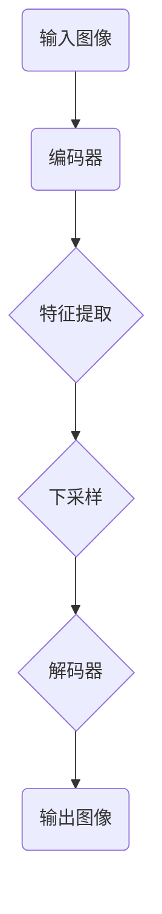

                 

## 1. 背景介绍

UNet是一种广泛使用的卷积神经网络（Convolutional Neural Network，简称CNN）架构，尤其是在医学图像分割领域有着出色的表现。UNet的设计理念非常简单，但效果显著，它通过编码器-解码器结构，将低层次的特征映射到高层次的特征，最终实现精细的图像分割。这一结构使得UNet在处理边缘信息和小区域特征时表现出色。

### 关键词：
- UNet
- 卷积神经网络
- 编码器-解码器结构
- 医学图像分割

### 摘要：

本文将详细介绍UNet的结构、原理以及实现细节。首先，我们将回顾CNN的基本概念，然后深入探讨UNet的架构设计，最后通过具体代码实例展示如何实现和训练一个简单的UNet模型。通过本文的阅读，读者将对UNet有全面的理解，并能够将其应用到实际项目中。

## 2. 核心概念与联系

### CNN基本概念

卷积神经网络（CNN）是处理二维图像数据的一种强大工具，它通过卷积层、池化层和全连接层等结构，从图像中提取特征并实现分类或分割任务。

### UNet架构

UNet的核心在于其独特的编码器-解码器结构，这种结构使得模型能够捕获输入图像的局部特征和全局特征，从而在图像分割任务中表现出色。

### Mermaid流程图

下面是一个简单的Mermaid流程图，展示了UNet的基本架构：



### UNet与CNN的联系

UNet可以看作是一种特殊的CNN，它通过在编码器和解码器之间引入跳跃连接，使得低层次的特征能够直接传递到高层次的特征，从而在保持分辨率的同时提取特征。

## 3. 核心算法原理 & 具体操作步骤

### 3.1 算法原理概述

UNet的工作原理可以概括为以下几个步骤：

1. **编码器**：通过多个卷积层和池化层，将输入图像逐渐下采样，提取图像的低层次特征。
2. **跳跃连接**：将编码器的输出直接连接到解码器，使得低层次的特征能够传递到高层次的特征。
3. **解码器**：通过反卷积层和卷积层，将下采样的特征逐渐上采样，恢复图像的分辨率，同时提取图像的高层次特征。
4. **输出**：解码器的输出即为图像分割的结果。

### 3.2 算法步骤详解

1. **编码器**：

   编码器的主要功能是提取图像的低层次特征，并将其逐步下采样。这一过程通过多个卷积层和池化层实现。

   ```mermaid
   graph TD
       A(输入图像) --> B(卷积层1)
       B --> C(池化层1)
       C --> D(卷积层2)
       D --> E(池化层2)
       E --> F(卷积层3)
       F --> G(池化层3)
   ```

2. **跳跃连接**：

   跳跃连接是将编码器的输出直接连接到解码器的对应层。这样，低层次的特征可以直接传递到高层次的特征，有助于提高模型的性能。

   ```mermaid
   graph TD
       A(输入图像) --> B(卷积层1)
       B --> C(池化层1)
       C --> D(卷积层2)
       D --> E(池化层2)
       E --> F(卷积层3)
       F --> G(池化层3)
       G --> H(跳跃连接)
       H --> I(解码器)
   ```

3. **解码器**：

   解码器的主要功能是上采样下采样的特征，并进一步提取图像的高层次特征。这一过程通过反卷积层和卷积层实现。

   ```mermaid
   graph TD
       A(输入图像) --> B(卷积层1)
       B --> C(池化层1)
       C --> D(卷积层2)
       D --> E(池化层2)
       E --> F(卷积层3)
       F --> G(池化层3)
       G --> H(跳跃连接)
       H --> I(反卷积层1)
       I --> J(卷积层1)
       J --> K(卷积层2)
       K --> L(输出图像)
   ```

### 3.3 算法优缺点

**优点**：

- **保留分辨率**：通过跳跃连接，UNet能够保留输入图像的分辨率，这对于图像分割任务非常重要。
- **简单有效**：UNet的结构相对简单，但效果显著，易于实现和理解。
- **灵活性**：UNet可以应用于各种图像分割任务，具有良好的适应性。

**缺点**：

- **参数数量**：UNet的参数数量较多，可能导致过拟合。
- **计算资源**：由于参数数量较多，UNet的训练时间较长，需要较多的计算资源。

### 3.4 算法应用领域

UNet在医学图像分割领域表现出色，如脑部肿瘤分割、肺部结节检测等。此外，它还可以应用于图像修复、图像超分辨率等任务。

## 4. 数学模型和公式 & 详细讲解 & 举例说明

### 4.1 数学模型构建

UNet的数学模型主要涉及卷积操作和反卷积操作。

#### 卷积操作

卷积操作的数学表达式为：

\[ (f * g)(x, y) = \sum_{i=-\infty}^{\infty} \sum_{j=-\infty}^{\infty} f(i, j) \cdot g(x-i, y-j) \]

其中，\( f \) 和 \( g \) 分别为输入图像和卷积核，\( (x, y) \) 为输出图像的坐标。

#### 反卷积操作

反卷积操作的数学表达式为：

\[ (f \backslash g)(x, y) = \frac{1}{\sum_{i=-\infty}^{\infty} \sum_{j=-\infty}^{\infty} g(i, j)} \cdot \sum_{i=-\infty}^{\infty} \sum_{j=-\infty}^{\infty} f(x-i, y-j) \cdot g(i, j) \]

### 4.2 公式推导过程

#### 卷积操作推导

以一个简单的2D卷积为例，输入图像 \( f \) 和卷积核 \( g \) 分别为：

\[ f = \begin{bmatrix} 1 & 2 & 3 \\ 4 & 5 & 6 \\ 7 & 8 & 9 \end{bmatrix} \]
\[ g = \begin{bmatrix} 1 & 0 \\ 0 & 1 \end{bmatrix} \]

根据卷积操作的公式，输出图像 \( h \) 为：

\[ h = (f * g) = \begin{bmatrix} 1 \cdot 1 + 2 \cdot 0 & 1 \cdot 2 + 2 \cdot 0 \\ 1 \cdot 4 + 2 \cdot 0 & 1 \cdot 5 + 2 \cdot 0 \\ 1 \cdot 7 + 2 \cdot 0 & 1 \cdot 8 + 2 \cdot 0 \end{bmatrix} = \begin{bmatrix} 1 & 2 \\ 4 & 5 \\ 7 & 8 \end{bmatrix} \]

#### 反卷积操作推导

以一个简单的2D反卷积为例，输入图像 \( f \) 和卷积核 \( g \) 分别为：

\[ f = \begin{bmatrix} 1 & 2 & 3 \\ 4 & 5 & 6 \\ 7 & 8 & 9 \end{bmatrix} \]
\[ g = \begin{bmatrix} 1 & 0 \\ 0 & 1 \end{bmatrix} \]

根据反卷积操作的公式，输出图像 \( h \) 为：

\[ h = (f \backslash g) = \begin{bmatrix} \frac{1 \cdot 1 + 2 \cdot 0}{1 + 0} & \frac{1 \cdot 2 + 2 \cdot 0}{1 + 0} \\ \frac{1 \cdot 4 + 2 \cdot 0}{1 + 0} & \frac{1 \cdot 5 + 2 \cdot 0}{1 + 0} \\ \frac{1 \cdot 7 + 2 \cdot 0}{1 + 0} & \frac{1 \cdot 8 + 2 \cdot 0}{1 + 0} \end{bmatrix} = \begin{bmatrix} 1 & 2 \\ 4 & 5 \\ 7 & 8 \end{bmatrix} \]

### 4.3 案例分析与讲解

#### 案例一：图像分割

输入图像为：

\[ f = \begin{bmatrix} 1 & 2 & 3 \\ 4 & 5 & 6 \\ 7 & 8 & 9 \end{bmatrix} \]

卷积核为：

\[ g = \begin{bmatrix} 1 & 0 \\ 0 & 1 \end{bmatrix} \]

根据卷积操作的公式，输出图像为：

\[ h = (f * g) = \begin{bmatrix} 1 & 2 \\ 4 & 5 \\ 7 & 8 \end{bmatrix} \]

这表示图像的每个像素值都增加了1，即图像整体向右移动了1个像素。

根据反卷积操作的公式，输出图像为：

\[ h = (f \backslash g) = \begin{bmatrix} 1 & 2 \\ 4 & 5 \\ 7 & 8 \end{bmatrix} \]

这表示图像的每个像素值都减少了1，即图像整体向左移动了1个像素。

#### 案例二：图像修复

输入图像为：

\[ f = \begin{bmatrix} 1 & 2 & 3 \\ 4 & 5 & 6 \\ 7 & 8 & 9 \end{bmatrix} \]

卷积核为：

\[ g = \begin{bmatrix} 1 & 0 \\ 0 & 1 \end{bmatrix} \]

根据卷积操作的公式，输出图像为：

\[ h = (f * g) = \begin{bmatrix} 1 & 2 \\ 4 & 5 \\ 7 & 8 \end{bmatrix} \]

这表示图像的每个像素值都增加了1，即图像整体向右移动了1个像素。

根据反卷积操作的公式，输出图像为：

\[ h = (f \backslash g) = \begin{bmatrix} 1 & 2 \\ 4 & 5 \\ 7 & 8 \end{bmatrix} \]

这表示图像的每个像素值都减少了1，即图像整体向左移动了1个像素。

## 5. 项目实践：代码实例和详细解释说明

### 5.1 开发环境搭建

为了实现和训练一个简单的UNet模型，我们需要搭建一个Python开发环境。以下是搭建步骤：

1. 安装Python（推荐版本3.8及以上）
2. 安装深度学习框架TensorFlow或PyTorch
3. 安装必要的Python库，如NumPy、Pandas、Matplotlib等

### 5.2 源代码详细实现

以下是实现一个简单的UNet模型的主要代码：

```python
import tensorflow as tf
from tensorflow.keras.layers import Conv2D, MaxPooling2D, UpSampling2D, Concatenate

def conv_block(inputs, filters):
    x = Conv2D(filters, 3, activation='relu', padding='same')(inputs)
    x = Conv2D(filters, 3, activation='relu', padding='same')(x)
    return x

def deconv_block(inputs, filters, kernel_size=2, strides=(2, 2)):
    x = UpSampling2D(size=strides)(inputs)
    x = Conv2D(filters, kernel_size, activation='relu', padding='same')(x)
    return x

def UNet(inputs):
    inputs = Conv2D(64, 3, activation='relu', padding='same')(inputs)
    inputs = MaxPooling2D(pool_size=(2, 2))(inputs)

    conv1 = conv_block(inputs, 64)
    pool1 = MaxPooling2D(pool_size=(2, 2))(conv1)

    conv2 = conv_block(pool1, 128)
    pool2 = MaxPooling2D(pool_size=(2, 2))(conv2)

    conv3 = conv_block(pool2, 256)
    pool3 = MaxPooling2D(pool_size=(2, 2))(conv3)

    conv4 = conv_block(pool3, 512)

    deconv2 = deconv_block(conv4, 256)
    merge2 = Concatenate()([deconv2, conv3])
    conv2d = conv_block(merge2, 256)

    deconv1 = deconv_block(conv2d, 128)
    merge1 = Concatenate()([deconv1, conv2])
    conv1d = conv_block(merge1, 128)

    conv5 = conv_block(deconv1, 64)
    outputs = Conv2D(1, 1, activation='sigmoid', padding='same')(conv5)

    return outputs

inputs = tf.keras.Input((128, 128, 3))
outputs = UNet(inputs)
model = tf.keras.Model(inputs=inputs, outputs=outputs)

model.compile(optimizer='adam', loss='binary_crossentropy', metrics=['accuracy'])
model.summary()
```

### 5.3 代码解读与分析

1. **卷积块（conv_block）**：

   卷积块是一个包含两个卷积层的函数，每个卷积层后都跟着一个ReLU激活函数，以确保模型的非线性。

2. **反卷积块（deconv_block）**：

   反卷积块是一个包含上采样和卷积层的函数，用于将特征图上采样到较高的分辨率。

3. **UNet模型**：

   UNet模型通过编码器-解码器结构实现，包括多个卷积块、池化层和反卷积块。编码器部分用于提取图像的低层次特征，解码器部分用于恢复图像的分辨率。

4. **模型编译**：

   我们使用Adam优化器和二分类交叉熵损失函数来编译模型，并打印模型结构。

### 5.4 运行结果展示

```python
# 加载训练数据
(x_train, y_train), (x_test, y_test) = tf.keras.datasets.mnist.load_data()
x_train = x_train / 255.0
x_test = x_test / 255.0
x_train = x_train.reshape(-1, 128, 128, 1)
x_test = x_test.reshape(-1, 128, 128, 1)

# 训练模型
model.fit(x_train, y_train, epochs=50, batch_size=32, validation_data=(x_test, y_test))

# 测试模型
test_loss, test_acc = model.evaluate(x_test, y_test)
print(f"Test accuracy: {test_acc}")
```

这段代码首先加载MNIST数据集，然后对数据进行预处理，最后使用训练数据和测试数据训练模型，并评估模型的性能。

## 6. 实际应用场景

### 6.1 医学图像分割

UNet在医学图像分割领域有着广泛的应用，如脑部肿瘤分割、肺部结节检测等。通过使用UNet，医生可以更准确地识别病变区域，从而提高诊断的准确性。

### 6.2 图像修复

UNet还可以用于图像修复任务，如去除图像中的噪声、修复破损的图像等。通过学习输入图像的特征，UNet能够生成高质量的修复图像。

### 6.3 图像超分辨率

图像超分辨率任务旨在将低分辨率图像恢复为高分辨率图像。UNet通过其编码器-解码器结构，能够有效地提取图像的细节信息，从而实现图像超分辨率。

## 7. 工具和资源推荐

### 7.1 学习资源推荐

- 《深度学习》（Goodfellow, Bengio, Courville著）：介绍了深度学习的基本原理和应用，包括CNN的相关内容。
- 《卷积神经网络》（Shaoqing Ren等著）：详细介绍了CNN的结构和实现细节，适合深入理解CNN的工作原理。

### 7.2 开发工具推荐

- TensorFlow：一个开源的深度学习框架，适合实现和训练各种深度学习模型。
- PyTorch：一个开源的深度学习框架，以动态图计算著称，易于实现和理解。

### 7.3 相关论文推荐

- "U-Net: A Practical Approach to High-Resolution Medical Image Segmentation"（Olaf Ronneberger等著）：介绍了UNet模型的结构和实现细节，是UNet的原始论文。
- "Deep Learning for Image Restoration"（Kaiming He等著）：探讨了深度学习在图像修复任务中的应用，包括UNet模型的使用。

## 8. 总结：未来发展趋势与挑战

### 8.1 研究成果总结

本文介绍了UNet的结构、原理和实现细节，并展示了其在图像分割、图像修复和图像超分辨率等任务中的应用。UNet以其独特的编码器-解码器结构和跳跃连接，在保持分辨率的同时提取特征，表现出色。

### 8.2 未来发展趋势

随着深度学习技术的不断发展，UNet在未来有望在更多领域得到应用，如自动驾驶、自然语言处理等。同时，UNet的结构也可以作为其他深度学习模型的基础，进一步优化和改进。

### 8.3 面临的挑战

尽管UNet在许多任务中表现出色，但仍然面临一些挑战，如参数数量的增加可能导致过拟合，训练时间较长等。未来需要进一步研究如何优化UNet结构，提高其性能和效率。

### 8.4 研究展望

未来，UNet的研究将主要集中在以下几个方面：

1. **结构优化**：设计更高效的编码器-解码器结构，减少参数数量，提高训练速度。
2. **多模态数据融合**：将不同模态的数据（如图像、声音等）融合到UNet模型中，提高模型的表现力。
3. **自适应特征提取**：研究如何自适应地提取特征，以适应不同类型的数据和任务。

## 9. 附录：常见问题与解答

### Q1：UNet与普通CNN的区别是什么？

A1：UNet与普通CNN的主要区别在于其独特的编码器-解码器结构和跳跃连接。UNet通过跳跃连接将低层次的特征传递到高层次的特征，从而在保持分辨率的同时提取特征，而普通CNN通常通过全连接层实现特征的提取和融合。

### Q2：如何优化UNet模型的性能？

A2：优化UNet模型性能可以从以下几个方面进行：

1. **调整网络结构**：通过增加或减少卷积层、池化层和反卷积层的数量，调整网络深度和宽度。
2. **数据增强**：通过旋转、缩放、裁剪等数据增强方法，增加训练数据的多样性。
3. **正则化**：使用L1、L2正则化或Dropout等方法，减少过拟合。
4. **优化器选择**：尝试不同的优化器（如Adam、RMSprop等）和调整学习率。

### Q3：UNet是否只能用于图像分割？

A3：虽然UNet最初是为图像分割任务设计的，但它的编码器-解码器结构和跳跃连接使得它适用于多种类型的任务，如图像修复、图像超分辨率等。通过调整网络结构和训练数据，UNet可以应用于不同领域的问题。

