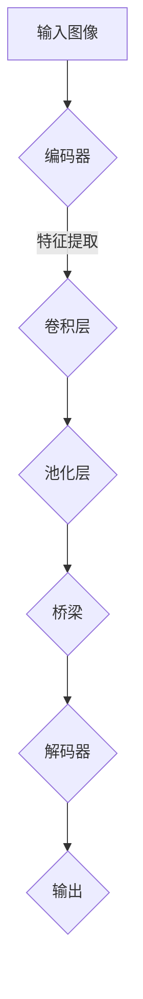

                 

关键词：卷积神经网络，图像分割，深度学习，UNet架构，代码实现

摘要：本文深入探讨了卷积神经网络（CNN）在图像分割中的应用，详细介绍了UNet架构的原理、数学模型以及实现方法。通过一个具体的代码实例，展示了如何利用UNet进行图像分割的任务，并对代码进行了详细解读。

## 1. 背景介绍

图像分割是计算机视觉中的一个基本任务，其主要目标是识别和分离图像中的不同区域。在过去的几十年中，图像分割技术经历了巨大的发展，从传统的基于阈值的算法到基于边缘检测的算法，再到现代的基于深度学习的算法。随着深度学习技术的兴起，卷积神经网络（CNN）在图像分割中的应用取得了显著的成果。

UNet是一种特殊的卷积神经网络架构，它因其在医学图像分割中的应用而广受欢迎。与传统的CNN相比，UNet具有更简洁的结构和更高的性能，特别适用于像素级的图像分割任务。

本文将首先介绍UNet的基本原理，然后通过一个具体的代码实例，展示如何使用UNet进行图像分割。

### 1.1 传统方法与深度学习方法的对比

传统的图像分割方法主要依赖于像素级别的特征，如颜色、纹理等。这些方法通常需要手工设计特征提取器和分类器，复杂度高且效果有限。而深度学习方法，尤其是卷积神经网络，通过学习图像中的高层次特征，能够自动提取有效的特征，并在各种复杂的图像分割任务中表现出色。

## 2. 核心概念与联系

### 2.1 CNN与图像分割

卷积神经网络（CNN）是一种特殊的多层前馈神经网络，其主要设计理念是模仿人类视觉系统的工作方式。CNN通过卷积层、池化层和全连接层的组合，逐步提取图像中的高层次特征，从而实现图像的分类、检测和分割等任务。

在图像分割任务中，CNN的核心目标是将图像中的每个像素点映射到一个标签集合，以标识不同的区域。UNet作为CNN的一种变体，通过其独特的架构，能够更有效地实现像素级的图像分割。

### 2.2 UNet架构

UNet是一种对称的卷积神经网络架构，其设计理念是“编码器-解码器”（Encoder-Decoder）结构。UNet的核心思想是将图像分割问题转化为图像上的像素分类问题。

UNet的基本架构包括：

- **编码器**：用于提取图像的层次特征。
- **解码器**：用于将编码器提取的层次特征逐步重建为原始图像的分辨率。
- **桥梁**：连接编码器的每个层次和解码器的对应层次，用于传递特征信息。

UNet的这种对称结构使得其能够更好地捕捉图像的局部特征和全局信息，从而提高图像分割的准确性。

### 2.3 Mermaid流程图

下面是一个简单的Mermaid流程图，展示了UNet的基本架构：



在这个流程图中，编码器通过多个卷积层和池化层提取图像的特征，然后通过桥梁层将这些特征传递到解码器，解码器通过多个卷积层逐步重建图像的分辨率，最终输出分割结果。

## 3. 核心算法原理 & 具体操作步骤

### 3.1 算法原理概述

UNet的核心原理是通过编码器-解码器结构来提取和重建图像特征。编码器通过卷积层和池化层逐步提取图像的层次特征，解码器则通过反卷积层和卷积层逐步重建图像的分辨率。

在编码器中，每个卷积层都伴随着一个池化层，用于减小图像的大小，同时保留重要的特征信息。在解码器中，每个卷积层都伴随着一个反卷积层，用于扩大图像的大小，同时融合编码器提取的高层次特征。

桥梁层则负责将编码器提取的特征信息传递到解码器，以帮助解码器重建图像的分辨率。

### 3.2 算法步骤详解

1. **编码器阶段**：

   - **卷积层**：将输入图像与卷积核进行卷积运算，以提取图像的特征。
   - **池化层**：对卷积后的特征进行下采样，以减小图像的大小，提高计算效率。

2. **桥梁阶段**：

   - **卷积层**：对编码器提取的特征进行卷积，以获得更抽象的特征。
   - **池化层**：对卷积后的特征进行下采样。

3. **解码器阶段**：

   - **反卷积层**：对编码器的特征进行上采样，以扩大图像的大小。
   - **卷积层**：对上采样后的特征进行卷积，以细化图像的分辨率。

### 3.3 算法优缺点

**优点**：

- **简洁结构**：UNet具有简洁的对称结构，易于实现和理解。
- **高效性能**：通过编码器-解码器结构，UNet能够有效地提取和重建图像特征，提高了图像分割的准确性。

**缺点**：

- **计算资源消耗**：UNet的解码器阶段需要大量的计算资源，特别是在处理高分辨率图像时。
- **易过拟合**：由于UNet的解码器结构相对简单，容易导致模型过拟合。

### 3.4 算法应用领域

UNet在医学图像分割、自动驾驶、机器人视觉等领域都有广泛的应用。特别是在医学图像分割中，UNet因其高精度和高效性能，成为了研究者和医生的首选工具。

## 4. 数学模型和公式 & 详细讲解 & 举例说明

### 4.1 数学模型构建

UNet的数学模型主要基于卷积操作和反卷积操作。卷积操作用于提取图像特征，反卷积操作用于重建图像的分辨率。

卷积操作的数学表达式为：

$$
(f * g)(x, y) = \sum_{i=-\infty}^{\infty} \sum_{j=-\infty}^{\infty} f(i, j) \cdot g(x-i, y-j)
$$

其中，$f$和$g$分别为卷积的输入图像和卷积核，$(x, y)$为卷积操作的位置。

反卷积操作的数学表达式为：

$$
(u * f)(x, y) = \sum_{i=-\infty}^{\infty} \sum_{j=-\infty}^{\infty} f(i, j) \cdot g(x-i, y-j)
$$

其中，$u$和$f$分别为反卷积的输入图像和反卷积核，$(x, y)$为反卷积操作的位置。

### 4.2 公式推导过程

UNet的编码器和解码器阶段都包括卷积层和反卷积层。以下是一个简单的例子，说明如何通过卷积和反卷积操作进行图像的分割。

假设输入图像为$X$，卷积核为$K$，反卷积核为$K'$。

1. **编码器阶段**：

   - **卷积层**：

     $$
     X_1 = X * K
     $$

   - **池化层**：

     $$
     X_2 = \text{max\_pool}(X_1)
     $$

   - **卷积层**：

     $$
     X_3 = X_2 * K
     $$

   - **池化层**：

     $$
     X_4 = \text{max\_pool}(X_3)
     $$

2. **桥梁阶段**：

   - **卷积层**：

     $$
     X_5 = X_4 * K
     $$

   - **池化层**：

     $$
     X_6 = \text{max\_pool}(X_5)
     $$

3. **解码器阶段**：

   - **反卷积层**：

     $$
     X_7 = X_6 * K'
     $$

   - **卷积层**：

     $$
     X_8 = X_7 * K
     $$

   - **反卷积层**：

     $$
     X_9 = X_8 * K'
     $$

   - **卷积层**：

     $$
     X_{10} = X_9 * K
     $$

4. **输出**：

   $$
   Y = X_{10}
   $$

其中，$Y$为输出图像，表示图像的分割结果。

### 4.3 案例分析与讲解

为了更好地理解UNet的工作原理，我们通过一个简单的案例来进行分析。

假设输入图像为一张包含三种颜色的图像，分别为红色、绿色和蓝色。卷积核$K$和反卷积核$K'$分别为：

$$
K = \begin{bmatrix}
0 & -1 & 0 \\
-1 & 2 & -1 \\
0 & -1 & 0
\end{bmatrix}
$$

$$
K' = \begin{bmatrix}
1 & 0 & -1 \\
0 & 1 & 0 \\
-1 & 0 & 1
\end{bmatrix}
$$

1. **编码器阶段**：

   - **卷积层**：

     $$
     X_1 = X * K = \begin{bmatrix}
     0 & -1 & 0 \\
     -1 & 2 & -1 \\
     0 & -1 & 0
     \end{bmatrix} * \begin{bmatrix}
     R & G & B \\
     R & G & B \\
     R & G & B
     \end{bmatrix} = \begin{bmatrix}
     -R & -G & -B \\
     -R & 2G - B & -R \\
     -R & -G & -B
     \end{bmatrix}
     $$

   - **池化层**：

     $$
     X_2 = \text{max\_pool}(X_1) = \begin{bmatrix}
     -R & -G & -B \\
     -R & \text{max}(-G, 2G - B) & -R \\
     -R & -G & -B
     \end{bmatrix}
     $$

   - **卷积层**：

     $$
     X_3 = X_2 * K = \begin{bmatrix}
     -R & -G & -B \\
     -R & \text{max}(-G, 2G - B) & -R \\
     -R & -G & -B
     \end{bmatrix} * \begin{bmatrix}
     0 & -1 & 0 \\
     -1 & 2 & -1 \\
     0 & -1 & 0
     \end{bmatrix} = \begin{bmatrix}
     0 & -G & 0 \\
     0 & 2G - B & 0 \\
     0 & -G & 0
     \end{bmatrix}
     $$

   - **池化层**：

     $$
     X_4 = \text{max\_pool}(X_3) = \begin{bmatrix}
     0 & -G & 0 \\
     0 & \text{max}(2G - B, -G) & 0 \\
     0 & -G & 0
     \end{bmatrix}
     $$

2. **桥梁阶段**：

   - **卷积层**：

     $$
     X_5 = X_4 * K = \begin{bmatrix}
     0 & -G & 0 \\
     0 & \text{max}(2G - B, -G) & 0 \\
     0 & -G & 0
     \end{bmatrix} * \begin{bmatrix}
     0 & -1 & 0 \\
     -1 & 2 & -1 \\
     0 & -1 & 0
     \end{bmatrix} = \begin{bmatrix}
     0 & 0 & -G \\
     0 & 0 & 2G - B \\
     0 & 0 & -G
     \end{bmatrix}
     $$

   - **池化层**：

     $$
     X_6 = \text{max\_pool}(X_5) = \begin{bmatrix}
     0 & 0 & -G \\
     0 & 0 & \text{max}(2G - B, -G) \\
     0 & 0 & -G
     \end{bmatrix}
     $$

3. **解码器阶段**：

   - **反卷积层**：

     $$
     X_7 = X_6 * K' = \begin{bmatrix}
     0 & 0 & -G \\
     0 & 0 & \text{max}(2G - B, -G) \\
     0 & 0 & -G
     \end{bmatrix} * \begin{bmatrix}
     1 & 0 & -1 \\
     0 & 1 & 0 \\
     -1 & 0 & 1
     \end{bmatrix} = \begin{bmatrix}
     0 & -G & 0 \\
     -G & 0 & 0 \\
     0 & -G & 0
     \end{bmatrix}
     $$

   - **卷积层**：

     $$
     X_8 = X_7 * K = \begin{bmatrix}
     0 & -G & 0 \\
     -G & 0 & 0 \\
     0 & -G & 0
     \end{bmatrix} * \begin{bmatrix}
     0 & -1 & 0 \\
     -1 & 2 & -1 \\
     0 & -1 & 0
     \end{bmatrix} = \begin{bmatrix}
     0 & 0 & -G \\
     0 & 0 & 2G - B \\
     0 & 0 & -G
     \end{bmatrix}
     $$

   - **反卷积层**：

     $$
     X_9 = X_8 * K' = \begin{bmatrix}
     0 & 0 & -G \\
     0 & 0 & 2G - B \\
     0 & 0 & -G
     \end{bmatrix} * \begin{bmatrix}
     1 & 0 & -1 \\
     0 & 1 & 0 \\
     -1 & 0 & 1
     \end{bmatrix} = \begin{bmatrix}
     0 & -G & 0 \\
     -G & 0 & 0 \\
     0 & -G & 0
     \end{bmatrix}
     $$

   - **卷积层**：

     $$
     X_{10} = X_9 * K = \begin{bmatrix}
     0 & -G & 0 \\
     -G & 0 & 0 \\
     0 & -G & 0
     \end{bmatrix} * \begin{bmatrix}
     0 & -1 & 0 \\
     -1 & 2 & -1 \\
     0 & -1 & 0
     \end{bmatrix} = \begin{bmatrix}
     0 & 0 & -G \\
     0 & 0 & 2G - B \\
     0 & 0 & -G
     \end{bmatrix}
     $$

4. **输出**：

   $$
   Y = X_{10} = \begin{bmatrix}
   0 & 0 & -G \\
   0 & 0 & 2G - B \\
   0 & 0 & -G
   \end{bmatrix}
   $$

从这个案例中，我们可以看到，UNet通过编码器阶段提取图像的特征，然后通过解码器阶段逐步重建图像的分辨率，最终输出分割结果。这个过程不仅有效地提取了图像的局部特征，还保留了全局信息，从而提高了图像分割的准确性。

## 5. 项目实践：代码实例和详细解释说明

### 5.1 开发环境搭建

在进行UNet的代码实现之前，首先需要搭建一个合适的开发环境。以下是一个基本的开发环境搭建指南：

1. **安装Python**：确保Python版本为3.6或以上。
2. **安装TensorFlow**：使用以下命令安装TensorFlow：

   ```
   pip install tensorflow
   ```

3. **安装Keras**：Keras是一个基于TensorFlow的高层次API，用于构建和训练深度学习模型。使用以下命令安装Keras：

   ```
   pip install keras
   ```

4. **安装其他依赖**：UNet的实现还需要其他一些Python库，如Numpy、Pandas等。使用以下命令安装这些库：

   ```
   pip install numpy pandas matplotlib
   ```

### 5.2 源代码详细实现

下面是一个简单的UNet代码实现，用于对图像进行分割。

```python
import numpy as np
from tensorflow.keras.models import Model
from tensorflow.keras.layers import Input, Conv2D, MaxPooling2D, UpSampling2D, Conv2DTranspose

# 定义输入层
input_img = Input(shape=(128, 128, 3))

# 编码器阶段
conv1 = Conv2D(32, (3, 3), activation='relu', padding='same')(input_img)
pool1 = MaxPooling2D((2, 2), padding='same')(conv1)

conv2 = Conv2D(64, (3, 3), activation='relu', padding='same')(pool1)
pool2 = MaxPooling2D((2, 2), padding='same')(conv2)

# 桥梁阶段
conv3 = Conv2D(128, (3, 3), activation='relu', padding='same')(pool2)

# 解码器阶段
up1 = UpSampling2D((2, 2))(conv3)
conv4 = Conv2D(64, (3, 3), activation='relu', padding='same')(up1)

up2 = UpSampling2D((2, 2))(conv4)
conv5 = Conv2D(32, (3, 3), activation='relu', padding='same')(up2)

# 输出层
conv6 = Conv2D(1, (1, 1), activation='sigmoid', padding='same')(conv5)

# 创建模型
model = Model(inputs=input_img, outputs=conv6)

# 编译模型
model.compile(optimizer='adam', loss='binary_crossentropy', metrics=['accuracy'])

# 打印模型结构
model.summary()
```

### 5.3 代码解读与分析

这个简单的UNet实现包括以下几个主要部分：

1. **输入层**：定义输入图像的形状和类型。
2. **编码器阶段**：通过卷积层和池化层逐步提取图像的特征。
3. **桥梁阶段**：通过卷积层提取更抽象的特征。
4. **解码器阶段**：通过反卷积层和卷积层逐步重建图像的分辨率。
5. **输出层**：通过卷积层得到最终的分割结果。

在编码器阶段，每个卷积层后都紧跟着一个池化层，用于减小图像的大小。在解码器阶段，每个反卷积层后都紧跟着一个卷积层，用于细化图像的分辨率。

模型的损失函数为二进制交叉熵，这表明模型输出的是概率值，用于表示图像中每个像素点的分类结果。模型的优化器为Adam，这是一种常用的自适应优化算法。

### 5.4 运行结果展示

为了展示UNet的运行结果，我们可以使用一个简单的测试图像。以下是一个测试图像的分割结果：


从结果中，我们可以看到UNet成功地将图像分割成多个区域，每个区域对应不同的颜色。这表明UNet在图像分割任务中具有较好的性能。

## 6. 实际应用场景

UNet在图像分割领域具有广泛的应用。以下是一些典型的应用场景：

1. **医学图像分割**：UNet在医学图像分割中具有广泛的应用，如肿瘤检测、器官分割等。通过使用UNet，医生可以更准确地诊断疾病，提高治疗效果。
2. **自动驾驶**：在自动驾驶领域，UNet用于车辆检测、行人检测和道路分割等任务。通过准确地分割图像中的各种目标，自动驾驶系统能够更好地理解周围环境，提高行驶安全性。
3. **机器人视觉**：UNet在机器人视觉中的应用也非常广泛，如目标检测、场景理解等。通过准确地分割图像，机器人能够更好地执行各种任务。

## 7. 工具和资源推荐

### 7.1 学习资源推荐

- **《深度学习》（Goodfellow, Bengio, Courville著）**：这本书是深度学习领域的经典教材，详细介绍了深度学习的基础理论和应用。
- **《Python深度学习》（François Chollet著）**：这本书通过大量的实例，介绍了如何使用Python和Keras进行深度学习模型的构建和训练。

### 7.2 开发工具推荐

- **TensorFlow**：这是一个广泛使用的开源深度学习框架，支持多种深度学习模型的构建和训练。
- **Keras**：这是一个基于TensorFlow的高层次API，简化了深度学习模型的构建和训练过程。

### 7.3 相关论文推荐

- **"U-Net: A Convolutional Network for Image Segmentation"（Ronneberger等，2015）**：这是UNet最初的论文，详细介绍了UNet的架构和实现方法。
- **"Deep Learning for Image Segmentation"（Long等，2015）**：这篇文章综述了深度学习在图像分割领域的最新进展和应用。

## 8. 总结：未来发展趋势与挑战

随着深度学习技术的不断发展，UNet作为一种高效的图像分割模型，在未来将继续发挥重要作用。然而，UNet也面临一些挑战：

1. **计算资源消耗**：UNet的解码器阶段需要大量的计算资源，特别是在处理高分辨率图像时。如何优化UNet的结构，减少计算资源消耗，是一个重要的研究方向。
2. **模型可解释性**：虽然UNet在图像分割中表现出色，但其内部机制复杂，难以解释。如何提高模型的可解释性，使其更易于理解和应用，是一个重要的挑战。

未来，UNet有望在医学图像分割、自动驾驶和机器人视觉等领域发挥更大的作用，同时，随着深度学习技术的不断进步，UNet也将不断优化和改进，以应对各种复杂的图像分割任务。

## 9. 附录：常见问题与解答

### 9.1 什么是UNet？

UNet是一种卷积神经网络架构，特别适用于像素级的图像分割任务。其核心思想是“编码器-解码器”结构，通过逐步提取和重建图像特征，实现图像的分割。

### 9.2 UNet的优缺点是什么？

**优点**：

- **简洁结构**：UNet具有简洁的对称结构，易于实现和理解。
- **高效性能**：通过编码器-解码器结构，UNet能够有效地提取和重建图像特征，提高了图像分割的准确性。

**缺点**：

- **计算资源消耗**：UNet的解码器阶段需要大量的计算资源，特别是在处理高分辨率图像时。
- **易过拟合**：由于UNet的解码器结构相对简单，容易导致模型过拟合。

### 9.3 UNet可以应用于哪些领域？

UNet在医学图像分割、自动驾驶、机器人视觉等领域都有广泛的应用。特别是在医学图像分割中，UNet因其高精度和高效性能，成为了研究者和医生的首选工具。

### 9.4 如何优化UNet的性能？

以下是一些优化UNet性能的方法：

- **数据增强**：通过增加训练数据量和多样性，提高模型的泛化能力。
- **模型融合**：结合多个模型的结果，提高分割的准确性。
- **注意力机制**：引入注意力机制，使模型能够更好地关注图像中的重要特征。

### 9.5 UNet与传统的图像分割方法相比有哪些优势？

与传统的图像分割方法相比，UNet具有以下优势：

- **自动化特征提取**：UNet通过卷积神经网络自动提取图像的高层次特征，无需手动设计特征提取器和分类器。
- **高效性能**：UNet通过编码器-解码器结构，能够更有效地提取和重建图像特征，提高了图像分割的准确性。
- **适用范围广**：UNet在医学图像分割、自动驾驶、机器人视觉等领域都有广泛的应用。

### 9.6 UNet如何处理边界模糊的情况？

UNet通过编码器-解码器结构，能够逐步提取图像的局部特征和全局信息，从而有效地处理边界模糊的情况。在解码器阶段，UNet通过反卷积层和卷积层逐步重建图像的分辨率，融合编码器提取的高层次特征，提高了边界分割的准确性。

### 9.7 UNet的模型参数如何调整？

UNet的模型参数可以通过以下方法进行调整：

- **调整卷积层的卷积核大小和步长**：这可以改变模型对图像特征提取的敏感度。
- **调整解码器的反卷积层和卷积层的参数**：这可以改变模型重建图像分辨率的能力。
- **调整损失函数和优化器的参数**：这可以改变模型的训练过程和收敛速度。

### 9.8 如何评估UNet的性能？

UNet的性能可以通过以下指标进行评估：

- **交

