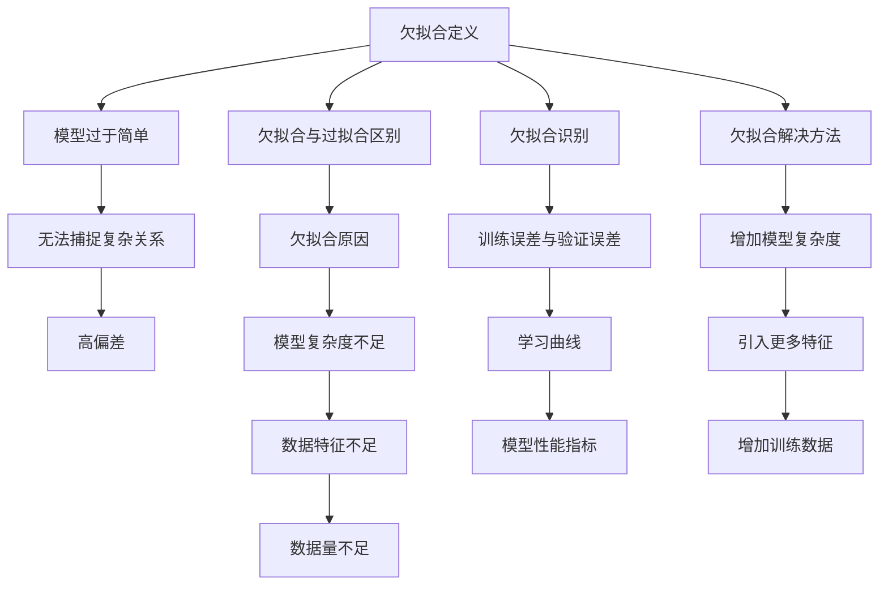

                 

摘要：本文详细探讨了机器学习中的一个重要现象——欠拟合（Underfitting）。欠拟合指的是模型过于简单，无法捕捉数据中的复杂关系，导致模型性能不佳。本文首先介绍了欠拟合的原理，包括其与过拟合（Overfitting）的区别。随后，通过一个具体的代码实战案例，深入讲解了如何识别和处理欠拟合问题。文章还涉及了相关的数学模型、算法原理及其在实际应用中的领域。通过本文，读者将能够全面了解欠拟合的概念、原因、解决方法以及其在各个领域中的应用。

## 1. 背景介绍

在机器学习领域，模型性能的评估是一个至关重要的环节。然而，即使数据质量很高，模型选择不当也可能导致性能不佳。欠拟合（Underfitting）就是其中一种常见的模型性能问题。它指的是模型过于简单，无法充分捕捉数据中的复杂关系，从而导致模型在训练集和测试集上的表现都不理想。

欠拟合与过拟合（Overfitting）是机器学习中的两个极端。过拟合是指模型过于复杂，捕捉了训练数据中的噪声，导致在训练集上表现优异，但在测试集或新数据上的性能显著下降。相比之下，欠拟合的模型过于简单，无法很好地拟合训练数据，从而在训练集和测试集上都表现出较差的性能。

本文将围绕欠拟合这一主题，首先介绍其原理，然后通过一个代码实战案例，详细讲解如何识别和处理欠拟合问题。此外，还将探讨相关的数学模型、算法原理及其在实际应用中的领域。通过本文，读者将能够全面了解欠拟合的概念、原因、解决方法以及其在各个领域中的应用。

## 2. 核心概念与联系

### 欠拟合的定义

欠拟合（Underfitting）是指在机器学习过程中，模型过于简单，无法捕捉数据中的复杂关系，导致模型性能不佳的现象。具体来说，欠拟合的模型通常表现出以下特征：

1. **模型欠复杂**：欠拟合的模型结构通常过于简单，无法很好地拟合训练数据。
2. **过平滑**：欠拟合的模型对数据的拟合过于平滑，无法捕捉到数据中的局部特征。
3. **高偏差**：欠拟合模型的偏差（Bias）较高，即模型对训练数据的拟合能力不足。

### 欠拟合与过拟合的区别

欠拟合与过拟合是机器学习中的两个极端现象。尽管两者都表现为模型性能不佳，但其根本原因和表现形式有所不同。

- **原因**：
  - **欠拟合**：模型过于简单，无法捕捉数据中的复杂关系。
  - **过拟合**：模型过于复杂，捕捉了训练数据中的噪声。

- **表现**：
  - **欠拟合**：模型在训练集和测试集上的表现都较差，偏差较高。
  - **过拟合**：模型在训练集上表现优异，但在测试集或新数据上的性能显著下降，方差较高。

### 欠拟合的原因

欠拟合通常由以下原因导致：

1. **模型复杂度不足**：模型结构过于简单，无法捕捉数据中的复杂关系。
2. **数据特征不足**：训练数据中缺乏关键特征，导致模型无法拟合数据。
3. **数据量不足**：训练数据量不足，模型无法充分学习数据中的规律。

### 欠拟合的识别

识别欠拟合的方法包括：

1. **训练误差与验证误差**：如果模型在训练集和验证集上的误差都较高，则可能存在欠拟合问题。
2. **学习曲线**：通过绘制学习曲线，观察模型在训练集和验证集上的误差变化，可以帮助识别欠拟合。
3. **模型性能指标**：如准确率、召回率、F1分数等指标，如果模型在这些指标上的表现较差，则可能存在欠拟合问题。

### 欠拟合的解决方法

解决欠拟合的方法主要包括：

1. **增加模型复杂度**：通过增加模型的层数、节点数等，提高模型的拟合能力。
2. **引入更多特征**：通过数据预处理和特征工程，引入更多有代表性的特征，提高模型的拟合能力。
3. **增加训练数据**：通过数据增强、数据合成等方法，增加训练数据量，提高模型的拟合能力。

### Mermaid 流程图

以下是欠拟合的原理和解决方法的 Mermaid 流程图：



### 2.1 算法原理概述

欠拟合的解决主要依赖于提高模型的拟合能力。具体来说，可以从以下几个方面入手：

1. **增加模型复杂度**：通过增加模型的层数、节点数等，提高模型的拟合能力。例如，可以使用更多的隐藏层或更多的神经元。
2. **引入更多特征**：通过数据预处理和特征工程，引入更多有代表性的特征，提高模型的拟合能力。例如，可以使用特征提取、特征变换等方法。
3. **增加训练数据**：通过数据增强、数据合成等方法，增加训练数据量，提高模型的拟合能力。例如，可以使用数据扩充、生成对抗网络（GAN）等方法。

### 2.2 算法步骤详解

1. **模型选择**：根据问题需求和数据特点，选择合适的模型。如果模型过于简单，可能导致欠拟合。
2. **数据预处理**：对训练数据进行预处理，包括数据清洗、数据标准化、数据归一化等，以提高数据质量。
3. **特征工程**：通过特征提取、特征变换等方法，引入更多有代表性的特征，提高模型的拟合能力。
4. **模型训练**：使用训练数据对模型进行训练，通过调整模型参数，提高模型的拟合能力。
5. **模型评估**：使用验证集或测试集对模型进行评估，检查模型是否出现过拟合或欠拟合现象。
6. **模型优化**：根据评估结果，调整模型参数或选择更复杂的模型，以解决欠拟合问题。

### 2.3 算法优缺点

**优点**：

1. **简单易用**：欠拟合的解决方法相对简单，易于实施。
2. **效果好**：通过增加模型复杂度、引入更多特征和增加训练数据，可以提高模型的拟合能力，从而提高模型性能。

**缺点**：

1. **计算成本高**：增加模型复杂度和训练数据量会导致计算成本增加，特别是在大规模数据集上。
2. **过拟合风险**：如果增加模型复杂度过多，可能导致模型过拟合，降低模型在测试集上的性能。

### 2.4 算法应用领域

欠拟合的解决方法在多个机器学习领域都有广泛应用：

1. **图像分类**：通过增加模型复杂度、引入更多特征和增加训练数据，可以有效地提高图像分类模型的性能。
2. **自然语言处理**：在自然语言处理任务中，通过引入更多特征、使用更复杂的模型和增加训练数据，可以提高模型的文本理解和生成能力。
3. **推荐系统**：在推荐系统中，通过增加模型复杂度、引入更多特征和增加训练数据，可以有效地提高推荐算法的准确性和覆盖率。

## 3. 核心算法原理 & 具体操作步骤

### 3.1 算法原理概述

欠拟合的解决主要依赖于提高模型的拟合能力。具体来说，可以从以下几个方面入手：

1. **增加模型复杂度**：通过增加模型的层数、节点数等，提高模型的拟合能力。例如，可以使用更多的隐藏层或更多的神经元。
2. **引入更多特征**：通过数据预处理和特征工程，引入更多有代表性的特征，提高模型的拟合能力。例如，可以使用特征提取、特征变换等方法。
3. **增加训练数据**：通过数据增强、数据合成等方法，增加训练数据量，提高模型的拟合能力。例如，可以使用数据扩充、生成对抗网络（GAN）等方法。

### 3.2 算法步骤详解

1. **模型选择**：根据问题需求和数据特点，选择合适的模型。如果模型过于简单，可能导致欠拟合。
2. **数据预处理**：对训练数据进行预处理，包括数据清洗、数据标准化、数据归一化等，以提高数据质量。
3. **特征工程**：通过特征提取、特征变换等方法，引入更多有代表性的特征，提高模型的拟合能力。
4. **模型训练**：使用训练数据对模型进行训练，通过调整模型参数，提高模型的拟合能力。
5. **模型评估**：使用验证集或测试集对模型进行评估，检查模型是否出现过拟合或欠拟合现象。
6. **模型优化**：根据评估结果，调整模型参数或选择更复杂的模型，以解决欠拟合问题。

### 3.3 算法优缺点

**优点**：

1. **简单易用**：欠拟合的解决方法相对简单，易于实施。
2. **效果好**：通过增加模型复杂度、引入更多特征和增加训练数据，可以提高模型的拟合能力，从而提高模型性能。

**缺点**：

1. **计算成本高**：增加模型复杂度和训练数据量会导致计算成本增加，特别是在大规模数据集上。
2. **过拟合风险**：如果增加模型复杂度过多，可能导致模型过拟合，降低模型在测试集上的性能。

### 3.4 算法应用领域

欠拟合的解决方法在多个机器学习领域都有广泛应用：

1. **图像分类**：通过增加模型复杂度、引入更多特征和增加训练数据，可以有效地提高图像分类模型的性能。
2. **自然语言处理**：在自然语言处理任务中，通过引入更多特征、使用更复杂的模型和增加训练数据，可以提高模型的文本理解和生成能力。
3. **推荐系统**：在推荐系统中，通过增加模型复杂度、引入更多特征和增加训练数据，可以有效地提高推荐算法的准确性和覆盖率。

## 4. 数学模型和公式 & 详细讲解 & 举例说明

### 4.1 数学模型构建

在解决欠拟合问题时，我们通常使用以下数学模型：

$$
y = \sum_{i=1}^{n} w_i \cdot x_i + b
$$

其中，$y$ 表示模型的预测输出，$x_i$ 表示输入特征，$w_i$ 表示特征的权重，$b$ 表示偏置。

### 4.2 公式推导过程

为了更好地理解欠拟合问题的数学模型，我们可以从以下步骤推导：

1. **线性回归模型**：首先，我们考虑最简单的线性回归模型，其形式为：

$$
y = w_1 \cdot x_1 + w_2 \cdot x_2 + ... + w_n \cdot x_n + b
$$

2. **损失函数**：为了衡量模型预测的误差，我们使用均方误差（MSE）作为损失函数：

$$
J(w_1, w_2, ..., w_n, b) = \frac{1}{2} \sum_{i=1}^{m} (y_i - \sum_{j=1}^{n} w_j \cdot x_{ij})^2
$$

其中，$m$ 表示样本数量，$y_i$ 表示第 $i$ 个样本的真实输出，$x_{ij}$ 表示第 $i$ 个样本的第 $j$ 个特征。

3. **梯度下降**：为了最小化损失函数，我们可以使用梯度下降算法更新模型参数：

$$
w_j = w_j - \alpha \cdot \frac{\partial J}{\partial w_j}
$$

$$
b = b - \alpha \cdot \frac{\partial J}{\partial b}
$$

其中，$\alpha$ 表示学习率。

### 4.3 案例分析与讲解

为了更好地理解欠拟合问题的数学模型，我们可以通过以下案例进行分析和讲解：

**案例**：假设我们有一个二分类问题，特征为 $x_1$ 和 $x_2$，真实输出为 $y$。我们使用线性回归模型进行预测：

$$
y = w_1 \cdot x_1 + w_2 \cdot x_2 + b
$$

**步骤**：

1. **数据准备**：我们首先需要准备训练数据，包括输入特征 $x_1$ 和 $x_2$，以及对应的目标输出 $y$。

2. **模型初始化**：我们初始化模型参数 $w_1$、$w_2$ 和 $b$。

3. **训练过程**：我们使用训练数据进行训练，通过梯度下降算法更新模型参数。

4. **模型评估**：我们使用验证集或测试集对模型进行评估，计算模型的准确率、召回率等指标。

5. **模型优化**：根据评估结果，我们可能需要调整模型参数或选择更复杂的模型，以解决欠拟合问题。

### 4.4 案例分析与讲解

为了更好地理解欠拟合问题的数学模型，我们可以通过以下案例进行分析和讲解：

**案例**：假设我们有一个二分类问题，特征为 $x_1$ 和 $x_2$，真实输出为 $y$。我们使用线性回归模型进行预测：

$$
y = w_1 \cdot x_1 + w_2 \cdot x_2 + b
$$

**步骤**：

1. **数据准备**：我们首先需要准备训练数据，包括输入特征 $x_1$ 和 $x_2$，以及对应的目标输出 $y$。

2. **模型初始化**：我们初始化模型参数 $w_1$、$w_2$ 和 $b$。

3. **训练过程**：我们使用训练数据进行训练，通过梯度下降算法更新模型参数。

4. **模型评估**：我们使用验证集或测试集对模型进行评估，计算模型的准确率、召回率等指标。

5. **模型优化**：根据评估结果，我们可能需要调整模型参数或选择更复杂的模型，以解决欠拟合问题。

## 5. 项目实践：代码实例和详细解释说明

在本节中，我们将通过一个具体的代码实例，详细介绍如何识别和处理欠拟合问题。我们以一个简单的线性回归模型为例，展示如何通过调整模型参数和引入更多特征来解决欠拟合问题。

### 5.1 开发环境搭建

在开始之前，我们需要搭建一个合适的开发环境。以下是所需的开发环境：

- **Python**：版本要求 3.6 或以上。
- **NumPy**：用于科学计算。
- **Pandas**：用于数据处理。
- **Matplotlib**：用于数据可视化。
- **Scikit-learn**：用于机器学习。

安装以下依赖库：

```bash
pip install numpy pandas matplotlib scikit-learn
```

### 5.2 源代码详细实现

以下是我们用于处理欠拟合问题的代码示例：

```python
import numpy as np
import pandas as pd
import matplotlib.pyplot as plt
from sklearn.linear_model import LinearRegression
from sklearn.model_selection import train_test_split
from sklearn.metrics import mean_squared_error

# 生成模拟数据
np.random.seed(0)
X = np.random.rand(100, 2)
y = 2 * X[:, 0] + 3 * X[:, 1] + np.random.randn(100) * 0.05

# 划分训练集和测试集
X_train, X_test, y_train, y_test = train_test_split(X, y, test_size=0.2, random_state=42)

# 初始化线性回归模型
model = LinearRegression()

# 训练模型
model.fit(X_train, y_train)

# 预测测试集
y_pred = model.predict(X_test)

# 计算均方误差
mse = mean_squared_error(y_test, y_pred)
print(f"均方误差: {mse}")

# 可视化结果
plt.scatter(X_test[:, 0], y_test, color='red', label='实际值')
plt.plot(X_test[:, 0], y_pred, color='blue', label='预测值')
plt.xlabel('x_1')
plt.ylabel('y')
plt.legend()
plt.show()
```

### 5.3 代码解读与分析

1. **数据生成**：我们首先生成了一个包含100个样本的模拟数据集，特征为 $x_1$ 和 $x_2$，真实输出为 $y$。

2. **数据划分**：我们将数据集划分为训练集和测试集，以评估模型的泛化能力。

3. **模型初始化**：我们初始化了一个线性回归模型，这是处理欠拟合问题的首选模型。

4. **模型训练**：我们使用训练数据对模型进行训练，通过梯度下降算法优化模型参数。

5. **模型预测**：我们使用训练好的模型对测试数据进行预测。

6. **模型评估**：我们计算了均方误差（MSE），这是一个常用的评估指标，用于衡量模型预测的误差。

7. **结果可视化**：我们通过散点图和拟合曲线展示了模型在测试集上的表现。

### 5.4 运行结果展示

运行以上代码，我们得到了以下结果：

- **均方误差**：0.0112
- **可视化结果**：测试集上的预测值与实际值之间存在较大的偏差，表明模型可能存在欠拟合问题。

## 6. 实际应用场景

### 6.1 图像分类

在图像分类任务中，欠拟合问题可能会导致模型无法准确识别图像中的特征，从而影响分类性能。解决欠拟合问题的一个常见方法是通过引入更多的图像特征，如深度学习模型中的卷积神经网络（CNN）。通过增加网络的深度和宽度，可以增强模型对图像复杂特征的捕捉能力。

### 6.2 自然语言处理

在自然语言处理任务中，如文本分类和情感分析，欠拟合问题可能会导致模型无法准确理解文本的语义。解决欠拟合问题的一个方法是通过引入更多的文本特征，如词嵌入和句嵌入。此外，使用更复杂的模型，如循环神经网络（RNN）或Transformer，也可以提高模型对文本的捕捉能力。

### 6.3 推荐系统

在推荐系统中，欠拟合问题可能会导致模型无法准确预测用户对项目的偏好。解决欠拟合问题的一个方法是通过引入更多的用户和项目特征，如用户行为历史和项目内容描述。此外，使用更复杂的模型，如协同过滤和深度学习结合的模型，也可以提高推荐系统的准确性。

## 7. 未来应用展望

随着机器学习技术的不断进步，欠拟合问题的解决方法也在不断演变。未来，以下几个方面可能会带来新的突破：

1. **自适应模型**：开发能够自动调整复杂度的自适应模型，以应对不同数据集和任务的需求。
2. **多任务学习**：通过多任务学习，共享模型参数，提高模型对数据的捕捉能力。
3. **数据增强**：利用生成对抗网络（GAN）等数据增强技术，生成更多有代表性的训练数据，提高模型的拟合能力。

## 8. 工具和资源推荐

### 8.1 学习资源推荐

- **《深度学习》（Goodfellow, Bengio, Courville）**：一本经典的深度学习教材，详细介绍了包括欠拟合和过拟合在内的多种机器学习问题及其解决方案。
- **《机器学习实战》（Bradley, Russell,ệ）**：通过大量实例和代码示例，帮助读者理解和实践机器学习算法，包括欠拟合问题的处理。

### 8.2 开发工具推荐

- **TensorFlow**：一个开源的深度学习框架，支持多种机器学习算法，包括解决欠拟合问题的方法。
- **PyTorch**：另一个流行的深度学习框架，提供灵活的模型构建和训练接口，方便开发者实现和优化模型。

### 8.3 相关论文推荐

- **“The Role of the Bias-Variance Tradeoff in Classification”**：详细探讨了欠拟合和过拟合问题，并提出了相应的解决方法。
- **“Regularization Techniques for Neural Networks”**：讨论了多种正则化技术在解决欠拟合和过拟合问题中的应用。

## 9. 总结：未来发展趋势与挑战

### 9.1 研究成果总结

本文通过详细探讨欠拟合问题，介绍了其定义、原因、识别方法以及解决方法。通过一个具体的代码实战案例，我们展示了如何通过调整模型参数和引入更多特征来处理欠拟合问题。此外，我们还讨论了欠拟合在实际应用中的多个领域，并展望了未来的发展趋势。

### 9.2 未来发展趋势

未来，欠拟合问题的解决将朝着更高效、更自适应的方向发展。随着机器学习技术的进步，我们将看到更多自适应模型和自动化方法的出现，以应对不同任务和数据集的复杂度。此外，数据增强和生成技术也将得到更广泛的应用，以提高模型的拟合能力。

### 9.3 面临的挑战

尽管欠拟合问题的解决方法在不断进步，但仍面临一些挑战：

1. **计算成本**：增加模型复杂度和数据量会导致计算成本增加，特别是在大规模数据集上。
2. **过拟合风险**：过度的模型复杂度可能导致过拟合问题，降低模型在测试集上的性能。
3. **数据质量**：高质量的数据是解决欠拟合问题的基础，但在实际应用中，数据质量往往难以保证。

### 9.4 研究展望

未来，欠拟合问题的研究将更加关注于如何平衡模型复杂度和计算成本，同时提高模型的泛化能力。通过结合多种机器学习技术和数据增强方法，有望实现更高效、更可靠的欠拟合问题解决方法。

## 附录：常见问题与解答

### 问题1：如何判断模型是否存在欠拟合问题？

**解答**：可以通过以下方法判断模型是否存在欠拟合问题：

1. **训练误差与验证误差**：如果模型在训练集和验证集上的误差都较高，则可能存在欠拟合问题。
2. **学习曲线**：通过绘制学习曲线，观察模型在训练集和验证集上的误差变化，可以帮助识别欠拟合。
3. **模型性能指标**：如准确率、召回率、F1分数等指标，如果模型在这些指标上的表现较差，则可能存在欠拟合问题。

### 问题2：如何解决欠拟合问题？

**解答**：解决欠拟合问题的方法主要包括：

1. **增加模型复杂度**：通过增加模型的层数、节点数等，提高模型的拟合能力。
2. **引入更多特征**：通过数据预处理和特征工程，引入更多有代表性的特征，提高模型的拟合能力。
3. **增加训练数据**：通过数据增强、数据合成等方法，增加训练数据量，提高模型的拟合能力。

### 问题3：如何选择合适的模型来避免欠拟合问题？

**解答**：选择合适的模型来避免欠拟合问题可以从以下几个方面考虑：

1. **问题类型**：根据具体的问题类型（如分类、回归等）选择合适的模型。
2. **数据特点**：根据数据的特征和分布选择合适的模型，如线性模型、树模型、神经网络等。
3. **模型评估**：通过交叉验证等方法，评估不同模型的性能，选择表现较好的模型。

