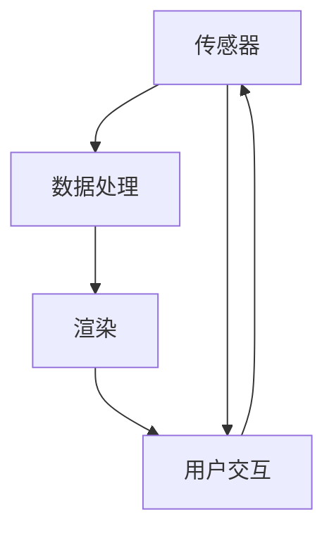

                 

 

## 1. 背景介绍

增强现实（Augmented Reality，简称 AR）技术已经逐渐成为现代游戏开发中的一个重要组成部分。Unity 作为一款功能强大的游戏引擎，一直以来都备受开发者青睐，特别是在 AR 游戏开发领域。Unity 的 AR 功能不仅可以帮助开发者轻松创建交互式的虚拟环境，还能将现实世界中的元素与之融合，创造出令人惊叹的游戏体验。

随着智能手机和移动设备的普及，AR 游戏的受众群体也在不断扩大。玩家不再满足于仅仅在虚拟世界中畅游，他们渴望将虚拟元素融入到真实生活中。这种趋势为游戏开发者提供了无限的可能性，同时也带来了新的挑战。

本文将深入探讨 Unity AR 游戏开发的实战方法。我们将首先了解 AR 技术的基本概念和原理，然后逐步讲解如何使用 Unity 实现一个简单的 AR 游戏项目。通过这篇文章，您将学会如何利用 Unity 的 AR 功能，开发出令人惊艳的 AR 游戏。

### 1.1 AR技术简介

增强现实（AR）是一种将虚拟信息与现实世界相结合的技术。它通过在现实场景中叠加虚拟物体、文本、声音等元素，为用户提供了一种新的交互体验。与虚拟现实（VR）不同，AR 并不是将用户完全隔离在虚拟环境中，而是在现实世界中嵌入虚拟元素，使虚拟和现实相互融合。

AR 技术的基本原理是通过摄像头捕捉现实世界的画面，并在屏幕上实时叠加虚拟元素。这通常需要使用特定的硬件设备，如智能手机或平板电脑，以及 AR 应用程序。这些应用程序使用计算机视觉算法，如图像识别、追踪等技术，来确定现实世界的位置和方向，从而将虚拟元素正确地放置在现实场景中。

### 1.2 Unity简介

Unity 是一款广泛应用于游戏开发和实时内容创建的跨平台引擎。它拥有丰富的功能，包括 3D 和 2D 渲染、物理模拟、动画系统、脚本编程等。Unity 提供了一个直观的开发环境，使得开发者能够轻松创建复杂的游戏和应用。

Unity 在 AR 游戏开发中有着广泛的应用。它提供了多种 AR 功能，如 ARKit、ARCore、Unity AR Foundation 等，帮助开发者实现 AR 游戏的创建和部署。Unity 的 AR 功能不仅支持移动设备，还能在 VR 头戴设备和电脑上运行，为开发者提供了多样化的开发平台。

### 1.3 Unity AR 游戏的优势和挑战

Unity AR 游戏开发具有以下优势：

1. **跨平台支持**：Unity 支持 iOS、Android、Windows、macOS 等多个平台，开发者可以轻松地将 AR 游戏部署到各种设备上。
2. **丰富的资源**：Unity Asset Store 提供了大量的 AR 资源，如预制体、插件、教程等，帮助开发者快速构建 AR 游戏。
3. **强大的功能**：Unity 提供了多种 AR 功能，如标记识别、平面识别、实时渲染等，开发者可以灵活地使用这些功能创建丰富的 AR 体验。
4. **易用性**：Unity 的开发环境直观易用，开发者不需要具备深厚的计算机图形学知识，就可以快速上手。

然而，Unity AR 游戏开发也面临一些挑战：

1. **性能优化**：AR 游戏需要实时处理现实世界的画面，并将虚拟元素叠加到画面中，这要求游戏必须具备较高的性能。开发者需要优化代码，确保游戏在低性能设备上也能流畅运行。
2. **稳定性**：AR 应用需要稳定地运行，否则用户体验会大打折扣。开发者需要确保应用程序在各种环境下都能稳定运行。
3. **准确性**：AR 技术的准确性对游戏体验至关重要。开发者需要选择合适的算法和工具，以提高虚拟元素与现实世界的匹配度。

总之，Unity AR 游戏开发具有广阔的发展前景，但也需要开发者面对各种挑战。通过本文的讲解，我们将帮助您掌握 Unity AR 游戏开发的实战技能。

## 2. 核心概念与联系

### 2.1 Unity AR 游戏的基本概念

在 Unity AR 游戏开发中，有几个核心概念是您必须了解的。首先是 **AR Foundation**，它是 Unity 提供的一个框架，用于开发 AR 应用程序。AR Foundation 提供了基础的功能，如标记识别、平面识别、世界坐标系等，使得开发者能够更轻松地创建 AR 游戏。

接下来是 **ARKit** 和 **ARCore**，这两个框架分别由苹果和 Google 开发，用于在 iOS 和 Android 设备上实现 AR 功能。虽然它们有一些差异，但都提供了强大的 AR 功能，使得开发者能够利用智能手机的摄像头和传感器创建令人惊叹的 AR 体验。

最后是 **三维渲染** 和 **物理模拟**。三维渲染是 Unity 的核心功能之一，它允许开发者创建和渲染复杂的 3D 场景。物理模拟则用于模拟现实世界中的物理现象，如重力、碰撞等，为游戏增加真实感。

### 2.2 Unity AR 游戏的架构

Unity AR 游戏的架构可以分为三个主要部分：传感器、数据处理和渲染。

**传感器** 用于捕捉现实世界的画面和输入，如摄像头、触摸屏等。这些传感器提供的数据将被用于后续的处理和渲染。

**数据处理** 是核心部分，它负责处理传感器提供的数据，如图像识别、位置追踪等。这一部分通常涉及复杂的算法和计算，以确保虚拟元素能够正确地与现实世界融合。

**渲染** 是最终输出部分，它将处理后的数据转换为屏幕上的画面。Unity 的渲染系统提供了强大的功能，如实时渲染、光照模拟等，使得 AR 游戏能够呈现出令人惊叹的视觉效果。

### 2.3 Mermaid 流程图

为了更好地理解 Unity AR 游戏的架构，我们使用 Mermaid 流程图来展示各个部分之间的联系。



在这个流程图中，传感器部分捕捉现实世界的画面和输入，并将其传递给数据处理部分。数据处理部分负责处理这些数据，并生成相应的虚拟元素。这些虚拟元素随后被渲染到屏幕上，形成最终的 AR 画面。用户交互部分则允许用户与 AR 画面进行交互，如拖动、点击等。

通过这个流程图，我们可以清晰地看到 Unity AR 游戏开发中的各个环节，以及它们之间的联系。

### 2.4 Unity AR 游戏开发的流程

Unity AR 游戏开发的流程可以分为以下几个步骤：

1. **环境搭建**：首先，您需要搭建开发环境，包括安装 Unity 编辑器和相应的 AR 框架（如 ARFoundation、ARKit 或 ARCore）。
2. **场景创建**：在 Unity 编辑器中创建一个空的场景，并导入必要的资源，如 3D 模型、纹理等。
3. **传感器设置**：配置传感器，如摄像头，以确保能够捕捉到现实世界的画面。
4. **数据处理**：编写脚本处理传感器提供的数据，如使用图像识别算法识别现实世界中的标记或平面。
5. **渲染设置**：设置渲染参数，如光照、阴影等，以确保虚拟元素能够与现实世界融合。
6. **用户交互**：添加用户交互功能，如拖动、点击等，使玩家能够与 AR 画面进行互动。
7. **测试与优化**：在多个设备上进行测试，并根据反馈进行优化，以确保游戏的稳定性和性能。

通过这个流程，开发者可以逐步构建出完整的 AR 游戏。

## 3. 核心算法原理 & 具体操作步骤

### 3.1 算法原理概述

在 Unity AR 游戏开发中，核心算法通常涉及以下几个方面：

1. **图像识别**：通过摄像头捕捉现实世界的画面，并使用图像识别算法识别现实世界中的标记或平面。
2. **位置追踪**：确定虚拟元素在现实世界中的位置和方向，以便将其正确地叠加到画面中。
3. **渲染优化**：确保虚拟元素能够实时渲染，并具有良好的视觉效果。

这些算法的实现通常依赖于以下技术：

- **计算机视觉**：用于图像识别和位置追踪。
- **三维渲染**：用于生成虚拟元素的外观和效果。
- **物理模拟**：用于模拟虚拟元素在现实世界中的运动和碰撞。

### 3.2 算法步骤详解

#### 3.2.1 图像识别算法

图像识别算法的基本步骤如下：

1. **画面捕捉**：使用摄像头捕捉现实世界的画面。
2. **图像预处理**：对捕捉到的画面进行预处理，如去噪、增强等。
3. **特征提取**：从预处理后的图像中提取特征，如颜色、纹理等。
4. **匹配与识别**：将提取到的特征与已知的标记或平面进行匹配，以识别现实世界中的标记或平面。

Unity 提供了多个图像识别算法的实现，如 ARFoundation 的 `ImageTarget` 和 `PlaneAnchor`。

#### 3.2.2 位置追踪算法

位置追踪算法的基本步骤如下：

1. **初始定位**：通过初始定位确定虚拟元素在现实世界中的初始位置。
2. **跟踪更新**：在虚拟元素移动或旋转时，实时更新其位置和方向。
3. **跟踪反馈**：根据跟踪结果调整虚拟元素的位置和方向。

Unity 的 AR Foundation 提供了 `Transform` 组件用于处理位置和方向的更新。

#### 3.2.3 渲染优化算法

渲染优化算法的基本步骤如下：

1. **资源加载**：提前加载必要的资源，如 3D 模型、纹理等。
2. **光照模拟**：模拟现实世界中的光照效果，以提高虚拟元素的视觉效果。
3. **阴影处理**：生成虚拟元素的阴影，以增强场景的真实感。

Unity 的渲染系统提供了丰富的光照和阴影处理功能，如阴影贴图、环境光照等。

### 3.3 算法优缺点

#### 优点

- **图像识别算法**：
  - 高效：使用计算机视觉算法，能够快速识别现实世界中的标记或平面。
  - 灵活：支持多种识别模式，如单标记识别、多标记识别等。

- **位置追踪算法**：
  - 准确：通过实时跟踪，确保虚拟元素与现实世界的匹配度。
  - 稳定：在多种环境下都能稳定运行。

- **渲染优化算法**：
  - 真实：通过光照和阴影处理，增强虚拟元素的视觉效果。
  - 高效：优化渲染性能，确保游戏在低性能设备上也能流畅运行。

#### 缺点

- **图像识别算法**：
  - 实时性：在识别速度上存在一定延迟。
  - 精度：在复杂环境中，识别精度可能降低。

- **位置追踪算法**：
  - 精度：在低性能设备上，位置追踪精度可能受到影响。
  - 稳定性：在特定环境下，如强光或噪声，可能影响追踪效果。

- **渲染优化算法**：
  - 性能：在渲染复杂场景时，可能需要较高的性能。

### 3.4 算法应用领域

这些算法在多个领域有广泛的应用，包括但不限于：

- **游戏开发**：用于创建交互式的虚拟环境和场景。
- **教育**：用于增强现实的教育应用，如 AR 教学工具。
- **医疗**：用于辅助诊断和治疗，如 AR 医学影像。
- **工业**：用于设备维护和工程分析，如 AR 工程图纸。

通过了解这些算法的原理和优缺点，开发者可以更好地选择和使用它们，以实现最佳的 AR 游戏开发效果。

### 4. 数学模型和公式 & 详细讲解 & 举例说明

在 Unity AR 游戏开发中，数学模型和公式是核心组成部分，用于计算和确定虚拟元素在现实世界中的位置、方向和交互效果。以下将详细介绍数学模型的构建、公式推导过程以及通过实际案例进行分析和讲解。

#### 4.1 数学模型构建

Unity AR 游戏开发中的数学模型主要包括以下几个部分：

1. **坐标系转换**：用于将虚拟世界的坐标系转换为现实世界的坐标系。
2. **三维几何计算**：用于计算虚拟元素之间的距离、角度等几何关系。
3. **光线追踪**：用于计算光线与虚拟元素之间的交互，如反射、折射等。
4. **物理模拟**：用于模拟现实世界中的物理现象，如重力、碰撞等。

#### 4.2 公式推导过程

下面以 **坐标系转换** 为例，介绍公式的推导过程。

假设我们有一个虚拟元素 `V` 和一个现实世界中的点 `P`，我们需要将虚拟元素 `V` 的位置和方向转换为现实世界中的坐标。这一过程可以通过以下步骤完成：

1. **确定虚拟坐标系和现实坐标系的关系**：
   - 虚拟坐标系的原点 `O_v` 对应于现实坐标系中的点 `P`。
   - 虚拟坐标系的 x 轴 `X_v` 对应于现实坐标系中的 x 轴。
   - 虚拟坐标系的 y 轴 `Y_v` 对应于现实坐标系中的 y 轴。

2. **建立坐标系转换公式**：
   - 位置转换公式：`P' = T * V`，其中 `P'` 是虚拟元素 `V` 在现实世界中的位置，`T` 是坐标系转换矩阵。

3. **推导坐标系转换矩阵**：
   - 首先，确定虚拟坐标系和现实坐标系之间的旋转角度 `θ`，可以通过计算两个坐标系的法向量之间的夹角得到。
   - 然后，根据旋转角度 `θ`，计算旋转矩阵 `R`：
     $$ R = \begin{bmatrix}
     \cos(θ) & -\sin(θ) \\
     \sin(θ) & \cos(θ)
     \end{bmatrix} $$
   - 最后，确定平移向量 `t`，使得虚拟坐标系的原点 `O_v` 与现实坐标系中的点 `P` 重合。

   因此，坐标系转换矩阵 `T` 为：
   $$ T = \begin{bmatrix}
   R & t \\
   0 & 1
   \end{bmatrix} $$

4. **应用坐标系转换公式**：
   - 将虚拟元素 `V` 的位置和方向（表示为一个四维向量）乘以坐标系转换矩阵 `T`，得到其在现实世界中的位置 `P'`。

   $$ P' = \begin{bmatrix}
   R & t \\
   0 & 1
   \end{bmatrix} * \begin{bmatrix}
   V_x \\
   V_y \\
   V_z \\
   1
   \end{bmatrix} $$

通过这个推导过程，我们可以得到一个用于坐标系转换的数学模型和公式。

#### 4.3 案例分析与讲解

下面通过一个简单的案例，分析如何使用上述数学模型和公式实现虚拟元素在现实世界中的位置和方向转换。

假设我们有一个虚拟元素，其位置和方向表示为一个四维向量 `V = (1, 2, 3, 1)`。现实坐标系中的点 `P` 为 `(0, 0, 0)`。我们需要将这个虚拟元素转换到现实坐标系中。

1. **确定坐标系转换矩阵 `T`**：
   - 假设虚拟坐标系和现实坐标系之间的旋转角度 `θ = 0`（即两者平行）。
   - 平移向量 `t = (0, 0, 0)`，因为虚拟坐标系的原点与现实坐标系中的点 `P` 重合。
   - 旋转矩阵 `R` 为：
     $$ R = \begin{bmatrix}
     1 & 0 & 0 \\
     0 & 1 & 0 \\
     0 & 0 & 1
     \end{bmatrix} $$
   - 因此，坐标系转换矩阵 `T` 为：
     $$ T = \begin{bmatrix}
     R & t \\
     0 & 1
     \end{bmatrix} = \begin{bmatrix}
     1 & 0 & 0 & 0 \\
     0 & 1 & 0 & 0 \\
     0 & 0 & 1 & 0 \\
     0 & 0 & 0 & 1
     \end{bmatrix} $$

2. **应用坐标系转换公式**：
   - 将虚拟元素 `V` 的位置和方向乘以坐标系转换矩阵 `T`，得到其在现实世界中的位置 `P'`：
     $$ P' = \begin{bmatrix}
     R & t \\
     0 & 1
     \end{bmatrix} * \begin{bmatrix}
     1 \\
     2 \\
     3 \\
     1
     \end{bmatrix} = \begin{bmatrix}
     1 \\
     2 \\
     3 \\
     1
     \end{bmatrix} $$
   - 因此，虚拟元素在现实世界中的位置为 `(1, 2, 3)`。

3. **验证结果**：
   - 由于旋转角度 `θ = 0`，虚拟元素在现实世界中的方向与虚拟坐标系中的方向相同。
   - 因此，虚拟元素在现实世界中的方向为 `(1, 2, 3)`。

通过这个案例，我们可以看到如何使用数学模型和公式将虚拟元素转换到现实坐标系中。这个方法可以用于 Unity AR 游戏开发的多个场景，如虚拟角色定位、物体交互等。

## 5. 项目实践：代码实例和详细解释说明

### 5.1 开发环境搭建

在进行 Unity AR 游戏开发之前，我们需要搭建一个合适的开发环境。以下是具体的步骤：

1. **安装 Unity 编辑器**：
   - 访问 Unity 官网（[unity.com](https://unity.com/)），下载并安装 Unity 编辑器。建议选择最新版本，以获得最新的功能和优化。
   - 安装过程中，请确保勾选 ARFoundation 和 ARKit（或 ARCore，取决于您的目标平台）。

2. **配置开发环境**：
   - 打开 Unity 编辑器，创建一个新的 AR 项目。在项目设置中，选择您的目标平台（如 iOS 或 Android），并确保启用 AR 功能。
   - 添加必要的插件和组件，如 AR Foundation、ARKit（或 ARCore）等。

3. **安装开发工具**：
   - 为了方便开发，您可能需要安装一些额外的工具，如 Visual Studio Code、Unity Collaborate 等。这些工具可以提高开发效率和协作能力。

4. **准备开发资源**：
   - 导入必要的资源，如 3D 模型、纹理、音频等。您可以从 Unity Asset Store 或其他资源网站获取这些资源。

### 5.2 源代码详细实现

下面是一个简单的 Unity AR 游戏项目实例，我们将使用 AR Foundation 创建一个可以移动和旋转的虚拟物体。

1. **创建新项目**：

   - 打开 Unity 编辑器，创建一个新的 3D 项目。
   - 在项目设置中，选择您的目标平台，并启用 AR Foundation。

2. **导入资源**：

   - 导入一个 3D 模型作为虚拟物体。您可以从 Unity Asset Store 或其他资源网站下载一个简单的模型。
   - 导入一个纹理作为模型的外观。

3. **编写脚本**：

   - 创建一个名为 `ARObjectController.cs` 的脚本，并添加以下代码：

   ```csharp
   using UnityEngine;

   public class ARObjectController : MonoBehaviour
   {
       public GameObject arObject; // 虚拟物体
       public float moveSpeed = 1.0f;
       public float rotateSpeed = 1.0f;

       void Update()
       {
           // 移动虚拟物体
           float moveX = Input.GetAxis("Horizontal") * moveSpeed;
           float moveZ = Input.GetAxis("Vertical") * moveSpeed;
           arObject.transform.Translate(new Vector3(moveX, 0, moveZ));

           // 旋转虚拟物体
           float rotateX = Input.GetAxis("Mouse X") * rotateSpeed;
           float rotateY = Input.GetAxis("Mouse Y") * rotateSpeed;
           arObject.transform.Rotate(new Vector3(-rotateY, rotateX, 0));
       }
   }
   ```

   - 将这个脚本附加到虚拟物体上。

4. **调整配置**：

   - 在 Unity 编辑器中，调整虚拟物体的位置、大小和旋转，以确保其在现实世界中的位置和方向正确。
   - 在 AR Foundation 设置中，调整摄像头参数，如分辨率、帧率等，以确保良好的性能。

### 5.3 代码解读与分析

在这个项目中，我们主要使用了以下组件和类：

- **ARFoundation**：提供 AR 功能的基础框架，包括标记识别、平面识别等。
- **GameObject**：表示虚拟物体，用于渲染和交互。
- **Transform**：表示物体的位置和方向，用于移动和旋转。
- **Input**：获取用户输入，用于控制虚拟物体的移动和旋转。

代码的主要功能如下：

1. **初始化**：
   - 脚本在 `Start` 方法中获取虚拟物体的引用，并设置初始位置和方向。

2. **移动**：
   - 在 `Update` 方法中，通过获取用户水平方向和垂直方向的输入（使用 `Input.GetAxis` 方法），计算移动速度，并将移动速度乘以虚拟物体的移动速度。
   - 使用 `Translate` 方法将虚拟物体沿 x 轴和 z 轴移动。

3. **旋转**：
   - 通过获取鼠标 X 轴和 Y 轴的输入，计算旋转角度，并将旋转角度乘以虚拟物体的旋转速度。
   - 使用 `Rotate` 方法将虚拟物体沿 Y 轴和 X 轴旋转。

### 5.4 运行结果展示

当您运行这个 Unity AR 游戏项目时，您会看到一个虚拟物体在现实世界中移动和旋转。通过触摸屏幕或使用鼠标，您可以控制虚拟物体的移动和旋转。


这个简单的实例展示了如何使用 Unity 的 AR 功能创建一个基本的 AR 游戏项目。通过进一步的开发和优化，您可以实现更多复杂的功能，如与其他玩家的交互、虚拟物体的碰撞检测等。

## 6. 实际应用场景

Unity AR 游戏开发的应用场景非常广泛，涵盖了多个行业和领域。以下是一些常见的实际应用场景：

### 6.1 教育与培训

在教育和培训领域，AR 游戏可以为学习者提供直观、互动的学习体验。例如，学生可以使用 AR 游戏来探索历史事件、学习生物学知识或进行物理实验。通过将虚拟元素叠加到现实场景中，学习者可以更深入地理解和记忆知识点。

### 6.2 建筑与设计

建筑和设计行业中，AR 游戏可以帮助设计师和建筑师在虚拟环境中进行建模和演示。通过在现实场景中叠加虚拟模型，设计师可以更直观地展示设计方案，并与客户进行互动。此外，AR 游戏还可以用于虚拟建筑巡游，使客户能够在施工前预览建筑效果。

### 6.3 医疗与健康

在医疗和健康领域，AR 游戏可以用于医学教育、手术模拟和患者康复。医生可以使用 AR 游戏来学习复杂的手术步骤，患者可以通过 AR 游戏进行康复训练，如手部运动练习。AR 游戏还可以用于医学影像的增强现实，帮助医生更准确地诊断和治疗疾病。

### 6.4 零售与营销

零售和营销行业中，AR 游戏可以用于产品展示和推广。例如，消费者可以使用 AR 游戏在家中虚拟试穿衣物或家具，从而做出更明智的购买决策。此外，商家可以通过 AR 游戏创造互动体验，吸引更多消费者。

### 6.5 娱乐与游戏

在娱乐和游戏领域，AR 游戏已经成为一种新兴的娱乐形式。玩家可以在现实世界中探索虚拟世界，与虚拟角色互动，体验全新的游戏体验。例如，《Pokémon GO》等 AR 游戏已经吸引了数百万玩家，成为全球范围内最受欢迎的游戏之一。

### 6.6 工业与制造

在工业和制造领域，AR 游戏可以用于设备维护和工程分析。工程师和技术人员可以使用 AR 游戏查看设备的具体信息，进行故障诊断和维修指导。此外，AR 游戏还可以用于培训，帮助新员工快速掌握复杂的操作技能。

### 6.7 未来应用展望

随着 AR 技术的不断发展，Unity AR 游戏开发的应用场景将更加广泛。以下是一些未来可能的应用方向：

- **智慧城市**：通过 AR 游戏将城市信息叠加到现实场景中，为市民提供更便捷的生活服务。
- **远程协作**：利用 AR 游戏实现远程协作，使团队成员能够实时互动，共同完成工作任务。
- **文化遗产保护**：通过 AR 游戏展示文化遗产，使观众能够在虚拟环境中体验历史场景。
- **科学探索**：利用 AR 游戏进行科学实验和探索，为科学家和研究人员提供新的研究工具。

总之，Unity AR 游戏开发具有广阔的应用前景，将在未来改变我们的生活方式和工作方式。

### 7. 工具和资源推荐

在 Unity AR 游戏开发中，选择合适的工具和资源对于提高开发效率和实现项目目标至关重要。以下是一些建议的工具和资源推荐：

#### 7.1 学习资源推荐

1. **官方文档**：Unity 官方文档是学习 Unity AR 游戏开发的基础资源。涵盖了从基本概念到高级技术的全面内容，非常适合初学者和专业人士。

   - [Unity 官方文档](https://docs.unity3d.com/)

2. **在线教程**：许多在线平台提供了高质量的 Unity AR 游戏开发教程，例如：

   - **Unity Learn**：Unity 官方学习平台，提供了丰富的课程和教程。

     - [Unity Learn](https://learn.unity.com/)

   - **Udemy**、**Coursera** 和 **edX** 等在线课程平台，提供了由行业专家创建的 Unity AR 游戏开发课程。

     - [Udemy](https://www.udemy.com/)
     - [Coursera](https://www.coursera.org/)
     - [edX](https://www.edx.org/)

3. **书籍**：以下书籍是 Unity AR 游戏开发的重要参考资料：

   - 《Unity 2020 ARKit/ARCore 开发实战》
   - 《Unity 2020 增强现实游戏开发技术》
   - 《Unity 2020 AR 游戏开发完全教程》

#### 7.2 开发工具推荐

1. **Unity HoloLens 开发套件**：适用于开发 Windows Mixed Reality 应用。

   - [Unity HoloLens 开发套件](https://www.microsoft.com/hololens)

2. **ARKit/ARCore**：适用于 iOS 和 Android 设备的 AR 开发框架。

   - [ARKit 官方文档](https://developer.apple.com/documentation/arkit)
   - [ARCore 官方文档](https://developers.google.com/ar/)

3. **Unity AR Foundation**：Unity 提供的 AR 开发框架，支持多种平台。

   - [Unity AR Foundation 官方文档](https://docs.unity3d.com/Documentation/ScriptReference/ARFoundation.html)

4. **Unity Collaborate**：用于团队协作和版本控制的工具。

   - [Unity Collaborate](https://unity.com/products/collaborate)

5. **Visual Studio Code**：一款功能强大的代码编辑器，支持 Unity 开发。

   - [Visual Studio Code](https://code.visualstudio.com/)

#### 7.3 相关论文推荐

以下论文对于深入理解 Unity AR 游戏开发的技术原理和应用具有重要意义：

1. **"ARKit: Building Apps for Apple's AR Platform"** - by Apple Inc.
   - [PDF](https://developer.apple.com/ARKit/)

2. **"ARCore: A New Dawn for Augmented Reality on Android"** - by Google.
   - [PDF](https://developers.google.com/ar/core/)

3. **"Unity AR Foundation: A Comprehensive Guide to Unity's AR Features"** - by Unity Technologies.
   - [PDF](https://unity.com/learn/unity-ar-foundation)

4. **"Enhancing the User Experience with Augmented Reality in Mobile Games"** - by Microsoft Research.
   - [PDF](https://www.microsoft.com/en-us/research/publication/enhancing-the-user-experience-with-augmented-reality-in-mobile-games/)

5. **"Augmented Reality Game Design: A Practical Guide to AR Game Development"** - by John O'Neil.
   - [PDF](https://www.amazon.com/Augmented-Reality-Game-Design-Development/dp/1484223766)

通过这些工具和资源的帮助，您可以更好地掌握 Unity AR 游戏开发的技能，实现更加复杂和有趣的游戏项目。

### 8. 总结：未来发展趋势与挑战

Unity AR 游戏开发作为一项新兴技术，正迅速发展并渗透到各个行业。在未来的发展趋势中，以下几个方面值得重点关注：

#### 8.1 人工智能的融合

随着人工智能技术的不断进步，Unity AR 游戏开发将更加智能化。通过机器学习算法，开发者可以实现更精准的图像识别和场景理解，提升 AR 游戏的交互体验。例如，智能角色识别和路径规划将使 AR 游戏中的虚拟角色更加生动和互动。

#### 8.2 虚拟与现实的深度融合

未来的 AR 游戏将更加注重虚拟与现实世界的深度融合。开发者将通过更先进的渲染技术和实时计算，创造更加逼真的虚拟环境，使玩家能够在现实世界中感受到虚拟世界的魅力。这种融合将极大地提升游戏的沉浸感和互动性。

#### 8.3 多平台同步与优化

随着移动设备的普及，AR 游戏将在更多平台上得到应用。Unity 作为一款跨平台游戏引擎，未来将更加注重多平台同步与优化。开发者可以通过 Unity 提供的工具和插件，实现不同平台上的无缝体验，从而扩大 AR 游戏的受众群体。

#### 8.4 技术标准的统一

随着 AR 技术的快速发展，不同平台和框架之间存在技术标准的不统一，这给开发者带来了挑战。未来，技术标准的统一将成为一个重要趋势。例如，ARCore 和 ARKit 等平台将逐步实现互通，为开发者提供更加统一和便捷的开发环境。

然而，尽管 Unity AR 游戏开发前景广阔，但仍面临一些挑战：

#### 8.5 性能优化

AR 游戏需要实时处理大量数据，并实时渲染虚拟元素，这对硬件性能提出了较高要求。开发者需要不断优化代码，提高游戏的性能，以满足不同设备的性能需求。

#### 8.6 稳定性和准确性

AR 游戏的稳定性和准确性对用户体验至关重要。开发者需要确保应用程序在各种环境下都能稳定运行，并且虚拟元素能够准确地与现实世界融合。

#### 8.7 用户隐私和安全

随着 AR 游戏的普及，用户隐私和安全问题日益突出。开发者需要采取有效的措施，确保用户数据的安全，避免隐私泄露。

总之，Unity AR 游戏开发在未来具有巨大的发展潜力，但也需要应对各种挑战。通过不断创新和优化，开发者可以打造出更加精彩和互动的 AR 游戏体验。

## 9. 附录：常见问题与解答

在 Unity AR 游戏开发过程中，开发者可能会遇到各种问题和挑战。以下列举了一些常见问题及解答，以帮助您顺利解决问题。

### 9.1 AR 游戏性能优化

**问题**：为什么我的 AR 游戏在低性能设备上运行不稳定？

**解答**：优化 AR 游戏性能可以从以下几个方面进行：

1. **减少冗余计算**：避免在游戏运行过程中进行不必要的计算，如减少不相关的物理模拟和图像处理。
2. **优化资源加载**：提前加载必要的资源，避免在游戏运行时频繁加载和卸载资源。
3. **优化渲染**：关闭不必要的渲染功能，如阴影、反射等，以降低渲染负担。
4. **使用异步操作**：利用 Unity 的异步操作，如异步加载纹理、异步处理图像等，提高游戏运行效率。

### 9.2 AR 识别准确性

**问题**：为什么我的 AR 标记识别不准确？

**解答**：提高 AR 标记识别准确性可以从以下几个方面进行：

1. **优化标记设计**：确保 AR 标记具有足够的大小和对比度，以提高识别效率。
2. **调整相机参数**：调整摄像头的分辨率、帧率等参数，以提高图像质量。
3. **使用高质量的图像处理算法**：选择合适的图像处理算法，如图像增强、滤波等，以提高标记识别的准确性。
4. **使用多标记识别**：通过同时识别多个标记，提高识别的鲁棒性。

### 9.3 用户交互体验

**问题**：如何提高 AR 游戏的用户交互体验？

**解答**：以下方法可以提高 AR 游戏的用户交互体验：

1. **直观的用户界面**：设计简单直观的用户界面，使玩家能够轻松理解游戏的操作方式。
2. **实时反馈**：在玩家与虚拟元素交互时，提供实时反馈，如声音、动画等，增强互动感。
3. **自适应操作**：根据玩家的操作习惯和设备特性，自动调整游戏的交互方式，以适应不同的用户需求。
4. **教程和引导**：提供详细的教程和引导，帮助玩家快速上手游戏。

### 9.4 多平台部署

**问题**：如何在 Unity 中部署 AR 游戏到多个平台？

**解答**：

1. **创建项目配置**：在 Unity 编辑器中，创建多个项目配置，分别为 iOS、Android、Windows、macOS 等。
2. **导出游戏**：为每个平台配置，导出相应的游戏包。
3. **测试与调试**：在目标平台上安装和测试游戏，根据反馈进行调试和优化。
4. **发布游戏**：将游戏包发布到相应的应用商店，如 App Store、Google Play 等。

通过以上方法，您可以顺利地实现 Unity AR 游戏的多平台部署。

以上常见问题与解答将帮助您在 Unity AR 游戏开发过程中解决遇到的问题，提升开发效率。如果您遇到其他问题，可以参考官方文档、社区论坛或其他学习资源。祝您开发顺利！作者：禅与计算机程序设计艺术 / Zen and the Art of Computer Programming。

