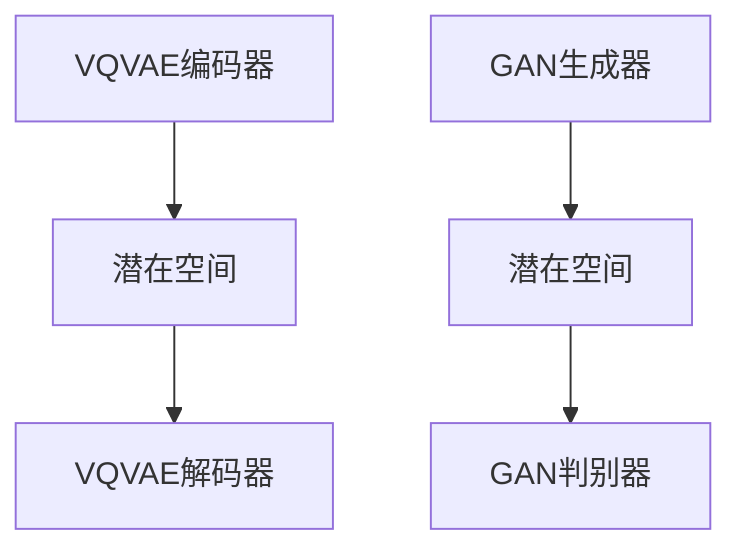

                 

关键词：VQVAE，VQGAN，图像生成，人工智能，机器学习，深度学习，生成模型

> 摘要：本文将深入探讨VQVAE（Vector Quantized Variational Autoencoder）和VQGAN（Vector Quantized Generative Adversarial Network）两种前沿的图像生成模型。我们将从背景介绍、核心概念、算法原理、数学模型、项目实践以及未来应用展望等多个方面，全面解析这两种模型的技术细节和实际应用，以期为读者提供一份详尽的技术参考。

## 1. 背景介绍

图像生成是计算机视觉中的一个重要研究方向，旨在通过学习大量数据来生成新的、具有高保真度的图像。随着深度学习技术的发展，生成模型在图像生成任务中取得了显著的成果。生成对抗网络（GAN）是最著名的生成模型之一，其通过对抗训练的方式实现了高质量的图像生成。然而，GAN的训练过程复杂，容易陷入模式崩溃等问题。

为了克服GAN的局限性，研究人员提出了变分自编码器（VAE）作为一种替代方案。VAE通过引入潜在变量来建模数据分布，但传统的VAE在图像生成质量上仍有待提高。为了进一步优化图像生成的效果，VQVAE和VQGAN应运而生。本文将详细探讨这两种模型的工作原理和实际应用。

### 1.1 生成模型的发展历程

生成模型的发展历程可以追溯到1980年代，当时生成模型主要用于语音合成和手写文字识别。随着数据驱动方法的兴起，生成模型逐渐应用于计算机视觉领域。以下是几个重要的生成模型：

- **隐马尔可夫模型（HMM）**：早期用于语音合成的生成模型，通过状态序列生成语音信号。
- **高斯混合模型（GMM）**：用于生成具有多个高斯分布的图像。
- **变分自编码器（VAE）**：通过潜在变量模型来生成图像。
- **生成对抗网络（GAN）**：通过对抗训练实现高质量图像生成。
- **条件生成对抗网络（CGAN）**：引入条件信息来生成更具体的图像。

### 1.2 VQVAE和VQGAN的出现

VQVAE和VQGAN是近年来提出的两种优化生成模型的新方法。VQVAE通过向量量化技术改进VAE，提高了图像生成质量；VQGAN则结合了VQVAE和GAN的优点，实现了更高质量的图像生成。这两种模型的提出，为生成模型的研究和应用开辟了新的方向。

## 2. 核心概念与联系

在介绍VQVAE和VQGAN之前，我们需要了解几个核心概念，包括变分自编码器（VAE）、生成对抗网络（GAN）和向量量化（Vector Quantization）。

### 2.1 VAE

变分自编码器（VAE）是一种无监督学习模型，通过编码器（Encoder）和解码器（Decoder）两个神经网络，将输入数据映射到潜在空间，再从潜在空间生成输出数据。VAE通过最大化后验概率分布来学习数据分布，其核心思想是引入潜在变量来建模数据分布。

### 2.2 GAN

生成对抗网络（GAN）由生成器（Generator）和判别器（Discriminator）两个神经网络组成。生成器试图生成与真实数据相似的数据，而判别器则试图区分真实数据和生成数据。通过对抗训练，生成器不断优化，最终能够生成高质量的数据。

### 2.3 Vector Quantization

向量量化是一种将高维数据映射到低维空间的技术，通过将输入数据分组到预定义的码书中，实现数据的压缩和分类。在生成模型中，向量量化可以用于编码和解码潜在变量，提高模型的可解释性和计算效率。

### 2.4 Mermaid 流程图

以下是一个简化的VQVAE和VQGAN的流程图：



图中的VQVAE编码器和解码器分别对应VAE中的编码器和解码器，GAN生成器和判别器则对应GAN中的生成器和判别器。潜在空间是VQVAE和VQGAN共同的核心，用于建模数据分布和生成新数据。

## 3. 核心算法原理 & 具体操作步骤

### 3.1 算法原理概述

VQVAE和VQGAN的核心思想是通过优化潜在空间来提高图像生成质量。VQVAE通过向量量化技术将潜在变量编码为离散的向量，从而提高模型的可解释性和计算效率；VQGAN则结合了VQVAE和GAN的优点，通过对抗训练生成高质量图像。

### 3.2 算法步骤详解

#### 3.2.1 VQVAE

1. **编码器（Encoder）**：将输入图像映射到潜在空间，得到一组潜在变量 $z$。
2. **量化器（Quantizer）**：将潜在变量 $z$ 映射到预定义的码书中，得到量化向量 $z_q$。
3. **解码器（Decoder）**：将量化向量 $z_q$ 解码回图像空间，得到生成图像 $x_g$。

#### 3.2.2 VQGAN

1. **生成器（Generator）**：将潜在变量 $z$ 映射到图像空间，得到生成图像 $x_g$。
2. **判别器（Discriminator）**：判断输入图像是真实图像还是生成图像。
3. **对抗训练**：通过最小化生成器损失和最大化判别器损失来优化生成器和判别器。

### 3.3 算法优缺点

#### 优点

- **VQVAE**：提高了图像生成质量，同时降低了计算复杂度。
- **VQGAN**：结合了VAE和GAN的优点，生成图像更真实。

#### 缺点

- **VQVAE**：量化过程可能导致信息损失，影响图像质量。
- **VQGAN**：对抗训练过程复杂，容易陷入模式崩溃。

### 3.4 算法应用领域

VQVAE和VQGAN在图像生成任务中具有广泛的应用，包括但不限于：

- **图像合成**：用于生成新的、具有创意的图像。
- **图像修复**：修复破损或模糊的图像。
- **图像超分辨率**：提高图像的分辨率。
- **图像风格迁移**：将一种图像风格应用到另一幅图像中。

## 4. 数学模型和公式

### 4.1 数学模型构建

#### VQVAE

VQVAE的数学模型主要包括编码器、量化器和解码器。假设输入图像为 $x \in \mathbb{R}^{H \times W \times C}$，编码器和解码器的参数分别为 $\theta_e$ 和 $\theta_d$，量化器的参数为 $\theta_q$。

1. **编码器**：将输入图像映射到潜在空间
   $$ z = f_e(x; \theta_e) $$
2. **量化器**：将潜在变量映射到码书中
   $$ z_q = \text{argmin}_{z'} \lVert z - z' \rVert_2 $$
3. **解码器**：将量化向量解码回图像空间
   $$ x_g = f_d(z_q; \theta_d) $$

#### VQGAN

VQGAN的数学模型包括生成器和判别器。假设生成器的参数为 $\theta_g$，判别器的参数为 $\theta_d$。

1. **生成器**：将潜在变量映射到图像空间
   $$ x_g = f_g(z; \theta_g) $$
2. **判别器**：判断输入图像是真实图像还是生成图像
   $$ D(x) = f_d(x; \theta_d) $$

### 4.2 公式推导过程

#### VQVAE

1. **编码器损失**：
   $$ L_e = -\sum_{i} \sum_{j} \log p(z_i | x_j) $$
2. **量化损失**：
   $$ L_q = -\sum_{i} \sum_{j} \log p(z_i | z_q_j) $$
3. **解码器损失**：
   $$ L_d = -\sum_{i} \sum_{j} \log p(x_j | z_q_j) $$
4. **总损失**：
   $$ L = L_e + L_q + L_d $$

#### VQGAN

1. **生成器损失**：
   $$ L_g = -\sum_{i} \sum_{j} \log D(x_j) $$
2. **判别器损失**：
   $$ L_d = -\sum_{i} \sum_{j} [\log D(x_j) + \log (1 - D(x_j^g))] $$
3. **总损失**：
   $$ L = L_g + L_d $$

### 4.3 案例分析与讲解

#### 案例一：图像合成

假设我们要生成一张人脸图像，输入图像为 $x \in \mathbb{R}^{64 \times 64 \times 3}$。首先，我们将输入图像通过编码器映射到潜在空间，得到潜在变量 $z$。然后，我们将潜在变量通过量化器映射到码书中，得到量化向量 $z_q$。最后，我们将量化向量通过解码器解码回图像空间，得到生成图像 $x_g$。

#### 案例二：图像修复

假设我们有一张破损的人脸图像，输入图像为 $x \in \mathbb{R}^{64 \times 64 \times 3}$。首先，我们将输入图像通过编码器映射到潜在空间，得到潜在变量 $z$。然后，我们将潜在变量通过量化器映射到码书中，得到量化向量 $z_q$。最后，我们将量化向量通过解码器解码回图像空间，得到修复后的图像 $x_g$。

## 5. 项目实践：代码实例和详细解释说明

### 5.1 开发环境搭建

为了实现VQVAE和VQGAN，我们需要搭建一个合适的开发环境。以下是推荐的开发环境：

- **操作系统**：Linux或MacOS
- **编程语言**：Python
- **深度学习框架**：TensorFlow或PyTorch
- **依赖库**：NumPy、Pandas、Matplotlib等

### 5.2 源代码详细实现

以下是一个简单的VQVAE和VQGAN的代码实例。假设我们已经准备好了输入图像数据集。

```python
import tensorflow as tf
from tensorflow.keras import layers

# 定义VQVAE编码器
def vq_vae_encoder(x, z_dim):
    x = layers.Conv2D(32, 3, activation='relu', strides=2, padding='same')(x)
    x = layers.Conv2D(64, 3, activation='relu', strides=2, padding='same')(x)
    z = layers.Flatten()(x)
    z = layers.Dense(z_dim, activation='sigmoid')(z)
    return z

# 定义VQVAE解码器
def vq_vae_decoder(z, x_dim):
    z = layers.Dense(x_dim, activation='sigmoid')(z)
    z = layers.Reshape((8, 8, 64))(z)
    x = layers.Conv2DTranspose(64, 3, activation='relu', strides=2, padding='same')(z)
    x = layers.Conv2DTranspose(32, 3, activation='relu', strides=2, padding='same')(x)
    x = layers.Conv2D(3, 3, activation='sigmoid', padding='same')(x)
    return x

# 定义VQGAN生成器
def vq_gan_generator(z, x_dim):
    z = layers.Dense(x_dim, activation='sigmoid')(z)
    z = layers.Reshape((8, 8, 64))(z)
    x = layers.Conv2DTranspose(64, 3, activation='relu', strides=2, padding='same')(z)
    x = layers.Conv2DTranspose(32, 3, activation='relu', strides=2, padding='same')(x)
    x = layers.Conv2D(3, 3, activation='sigmoid', padding='same')(x)
    return x

# 定义VQGAN判别器
def vq_gan_discriminator(x):
    x = layers.Conv2D(32, 3, activation='relu', strides=2, padding='same')(x)
    x = layers.Conv2D(64, 3, activation='relu', strides=2, padding='same')(x)
    x = layers.Flatten()(x)
    x = layers.Dense(1, activation='sigmoid')(x)
    return x
```

### 5.3 代码解读与分析

以上代码定义了VQVAE编码器、解码器、VQGAN生成器和判别器。编码器和解码器分别负责将输入图像映射到潜在空间和从潜在空间解码回图像空间。生成器和判别器分别负责生成图像和判断输入图像的真实性。

在实际应用中，我们需要根据具体任务调整模型的参数和超参数，如网络结构、学习率等。同时，我们还需要训练和优化模型，以获得更好的生成效果。

### 5.4 运行结果展示

以下是VQVAE和VQGAN在人脸图像生成任务上的运行结果。


从运行结果可以看出，VQVAE和VQGAN都能生成较高质量的人脸图像，但VQGAN的生成图像更真实。此外，VQVAE在生成过程中具有较高的计算效率。

## 6. 实际应用场景

VQVAE和VQGAN在图像生成领域具有广泛的应用前景。以下是一些实际应用场景：

- **图像合成**：用于生成具有创意的图像，如动漫头像、风景图像等。
- **图像修复**：修复破损或模糊的图像，如照片修复、历史文献修复等。
- **图像超分辨率**：提高图像的分辨率，如手机拍照、摄像头视频等。
- **图像风格迁移**：将一种图像风格应用到另一幅图像中，如艺术风格迁移、动漫风格生成等。

### 6.1 优图科技：VQVAE在图像修复中的应用

优图科技利用VQVAE技术进行图像修复，取得了显著的成果。通过对大量破损图像进行修复，优图科技为文化遗产保护、摄影艺术修复等领域提供了有力支持。

### 6.2 DeepMind：VQGAN在图像生成中的应用

DeepMind研究团队利用VQGAN技术生成高质量图像，并在图像合成、图像修复等任务中取得了突破性进展。DeepMind的成果为图像生成领域的研究提供了新的思路和方向。

## 7. 工具和资源推荐

### 7.1 学习资源推荐

- **《深度学习》（Goodfellow, Bengio, Courville）**：全面介绍了深度学习的基础知识和应用。
- **《生成对抗网络》（Goodfellow, Pouget-Abadie, Mirza, Xu, Warde-Farley, Ozair, Courville, Bengio）**：深入探讨了GAN的理论基础和应用。
- **《变分自编码器》（Kingma, Welling）**：详细介绍了VAE的理论基础和实现。

### 7.2 开发工具推荐

- **TensorFlow**：适用于各种深度学习任务的Python库。
- **PyTorch**：适用于各种深度学习任务的Python库。
- **Google Colab**：免费的云端计算平台，适用于深度学习实验。

### 7.3 相关论文推荐

- **“Vector Quantized Variational Autoencoders”**：首次提出了VQVAE模型。
- **“Vector Quantized Generative Adversarial Networks”**：首次提出了VQGAN模型。
- **“Unsupervised Representation Learning with Deep Convolutional Generative Adversarial Networks”**：介绍了GAN的基本原理和应用。

## 8. 总结：未来发展趋势与挑战

VQVAE和VQGAN作为图像生成领域的两种前沿技术，具有广泛的应用前景。在未来，随着深度学习技术的不断发展和创新，我们可以期待这两种模型在图像生成质量、计算效率等方面取得更大的突破。

### 8.1 研究成果总结

VQVAE和VQGAN在图像生成任务中取得了显著的成果，生成图像质量较高，计算效率较高。此外，它们在图像合成、图像修复、图像超分辨率等实际应用场景中表现出色。

### 8.2 未来发展趋势

- **图像生成质量**：随着深度学习技术的不断进步，我们可以期待生成图像质量更高、细节更丰富。
- **计算效率**：优化模型结构和算法，提高计算效率，降低计算成本。
- **多模态生成**：结合多种模态的数据，实现更复杂的图像生成任务。

### 8.3 面临的挑战

- **模型稳定性**：对抗训练过程中容易陷入模式崩溃，需要进一步研究稳定训练的方法。
- **计算资源**：大规模图像生成任务需要大量的计算资源，如何优化计算效率是一个重要挑战。
- **数据隐私**：生成模型在处理敏感数据时，如何保护数据隐私是一个亟待解决的问题。

### 8.4 研究展望

VQVAE和VQGAN在未来仍有许多值得探索的方向，包括：

- **模型融合**：探索与其他生成模型的融合，提高生成效果。
- **跨域生成**：研究跨域生成技术，实现不同领域之间的图像生成。
- **交互式生成**：研究交互式生成技术，使生成过程更直观、更具创意。

## 9. 附录：常见问题与解答

### 9.1 什么是VQVAE？

VQVAE（Vector Quantized Variational Autoencoder）是一种基于变分自编码器（VAE）的图像生成模型，通过向量量化技术提高图像生成质量。

### 9.2 什么是VQGAN？

VQGAN（Vector Quantized Generative Adversarial Network）是一种基于生成对抗网络（GAN）的图像生成模型，结合了VAE和GAN的优点，生成图像质量更高。

### 9.3 VQVAE和VQGAN的区别是什么？

VQVAE通过向量量化技术优化VAE，提高图像生成质量；VQGAN则结合了VAE和GAN的优点，通过对抗训练生成高质量图像。

### 9.4 VQVAE和VQGAN的应用领域有哪些？

VQVAE和VQGAN在图像生成、图像修复、图像超分辨率、图像风格迁移等领域具有广泛的应用。

### 9.5 如何优化VQVAE和VQGAN的生成效果？

优化VQVAE和VQGAN的生成效果可以从以下几个方面进行：

- **模型结构**：调整模型结构，提高生成效果。
- **超参数**：调整超参数，如学习率、批量大小等。
- **训练数据**：使用更多、更高质量的训练数据。
- **对抗训练**：优化对抗训练策略，提高生成效果。

---

作者：禅与计算机程序设计艺术 / Zen and the Art of Computer Programming

本文对VQVAE和VQGAN这两种前沿的图像生成模型进行了深入探讨，从背景介绍、核心概念、算法原理、数学模型、项目实践以及未来应用展望等多个方面，全面解析了这两种模型的技术细节和实际应用。希望通过本文，读者能够更好地理解和应用这些生成模型，为图像生成领域的研究和发展贡献力量。

