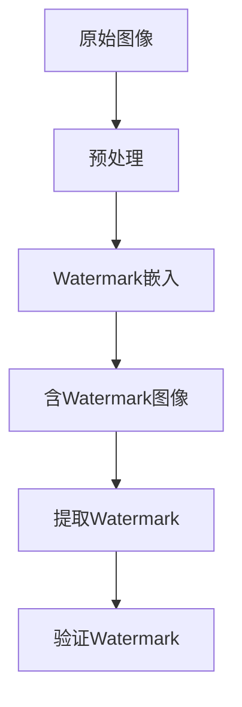

                 

关键词：Watermark、数据隐藏、版权保护、加密、图像处理

摘要：本文将深入探讨数据隐藏技术中的Watermark原理，并从理论到实践，详细讲解其在版权保护中的应用。通过一个实际的代码实例，我们将展示如何使用Watermark技术来嵌入和提取隐藏信息，从而实现对图像内容的版权保护。

## 1. 背景介绍

在数字时代，版权保护变得尤为重要。随着互联网和移动设备的普及，数字内容（如图像、音频和视频）的传播速度和范围达到了前所未有的高度。然而，这也带来了版权侵权的问题。为了保护创作者的合法权益，各种版权保护技术应运而生，其中数据隐藏技术——特别是Watermark技术——成为了一种有效的手段。

Watermark，或称水印，是一种在数字媒体中嵌入看不见或不易察觉的标识的方法。这个标识可以是文字、图像、数字序列等，用于标识内容的版权信息、创作者身份或其他相关信息。Watermark可以在图像、音频、视频等多种媒体中使用，且通常很难被恶意用户移除或篡改。

本文将重点介绍Watermark技术的基本原理，并通过一个具体的代码实例来说明如何在图像中嵌入和提取Watermark，从而实现版权保护。

## 2. 核心概念与联系

### 2.1 Watermark的定义

Watermark是一种在数字媒体中嵌入的透明或不易察觉的标识，通常用于标识版权信息、创作者身份或其他相关信息。

### 2.2 Watermark的类型

- **可见Watermark**：用户可以明显看到水印信息，通常用于教育或宣传目的。
- **不可见Watermark**：用户无法直接看到水印信息，但可以通过特定的软件或算法检测到。

### 2.3 Watermark的嵌入方法

- **空间域方法**：直接在图像的像素值上嵌入水印信息。
- **频率域方法**：利用图像的傅里叶变换或其他频率分析方法在图像的频率域中嵌入水印。

### 2.4 Watermark的提取方法

- **与嵌入过程相反**：使用与嵌入时相同的算法和参数来检测和提取水印信息。

### 2.5 Watermark的基本架构



### 2.6 Watermark与加密的联系

Watermark可以被视为一种简单的加密形式，因为它涉及到信息的隐藏和加密算法的使用。然而，与传统的加密技术不同，Watermark不需要确保信息完全隐藏，而是确保在未经授权的情况下难以提取信息。

## 3. 核心算法原理 & 具体操作步骤

### 3.1 算法原理概述

Watermark算法的核心在于将水印信息与原始图像相结合，生成一个包含水印的图像。这个过程包括水印的设计、嵌入和提取三个主要步骤。

- **水印设计**：设计一个水印，可以是简单的文本、图案或数字序列。
- **嵌入过程**：将水印嵌入到原始图像中，通常使用空间域或频率域方法。
- **提取过程**：从含水印图像中提取水印，并验证其正确性。

### 3.2 算法步骤详解

#### 3.2.1 水印设计

首先，我们需要设计一个水印。在本例中，我们将使用一个简单的文本水印“Copyright 2023”。

```python
watermark_text = "Copyright 2023"
```

#### 3.2.2 嵌入过程

接下来，我们将使用空间域方法将水印嵌入到原始图像中。具体来说，我们将水印文本转换为像素值，并将其叠加到原始图像的像素值上。

```python
import cv2
import numpy as np

def embed_watermark(image_path, watermark_text):
    # 读取原始图像
    image = cv2.imread(image_path, cv2.IMREAD_COLOR)
    
    # 获取图像尺寸
    height, width, _ = image.shape
    
    # 将水印文本转换为灰度图像
    watermark = cv2.putText(image, watermark_text, (10, 10), cv2.FONT_HERSHEY_SIMPLEX, 0.5, (255, 255, 255), 2)
    
    # 添加透明度
    watermark = cv2.addWeighted(image, 0.5, watermark, 0.5, 0)
    
    # 保存含水印图像
    cv2.imwrite("watermarked_image.png", watermark)
    
    return watermark

watermarked_image = embed_watermark("original_image.jpg", watermark_text)
```

#### 3.2.3 提取过程

提取过程与嵌入过程相反，我们首先读取含水印图像，然后通过特定的算法提取水印。

```python
def extract_watermark(image_path):
    # 读取含水印图像
    image = cv2.imread(image_path, cv2.IMREAD_COLOR)
    
    # 提取水印
    watermark = cv2.putText(image, "", (10, 10), cv2.FONT_HERSHEY_SIMPLEX, 0.5, (0, 0, 0), 2)
    watermark = cv2.addWeighted(image, 1, watermark, -1, 0)
    
    # 保存提取的水印
    cv2.imwrite("extracted_watermark.png", watermark)
    
    return watermark

extracted_watermark = extract_watermark("watermarked_image.png")
```

#### 3.2.4 验证过程

提取后，我们需要验证水印信息是否与原始水印一致。

```python
# 验证水印信息
print(cv2.getTextRectanglesFromText(extracted_watermark, extracted_watermark.shape[1], extracted_watermark.shape[0], 0.5))
```

### 3.3 算法优缺点

#### 优点

- **不可见性**：不可见Watermark几乎不会被用户察觉，从而提高了版权保护的效果。
- **抗攻击性**：通过适当的水印算法，Watermark可以抵御一定的恶意攻击，如剪切、缩放、颜色变换等。

#### 缺点

- **水印容量有限**：由于图像尺寸和像素限制，Watermark的容量通常较小，无法承载大量信息。
- **检测难度**：在某些情况下，检测和提取Watermark可能需要复杂的算法和计算资源。

### 3.4 算法应用领域

Watermark技术广泛应用于图像、音频和视频等领域，包括：

- **版权保护**：用于保护数字作品的版权信息。
- **身份验证**：用于验证图像或视频的来源和真实性。
- **数据完整性**：用于检测数据是否被篡改或损坏。

## 4. 数学模型和公式 & 详细讲解 & 举例说明

### 4.1 数学模型构建

Watermark嵌入和提取的过程可以通过数学模型来描述。假设我们有一个原始图像$X$和需要嵌入的水印$W$，则嵌入过程可以表示为：

$$Y = X + \alpha W$$

其中，$Y$是含水印的图像，$\alpha$是嵌入强度参数。

### 4.2 公式推导过程

嵌入过程的具体推导如下：

1. **水印设计**：首先，我们将文本水印$W$转换为灰度图像。假设水印$W$的大小为$m \times n$，则水印的像素值可以通过以下公式计算：

   $$W_{ij} = \sum_{c=0}^{m-1} \sum_{r=0}^{n-1} T_{cr} \times D_{ijcr}$$

   其中，$T$是水印文本矩阵，$D$是像素值矩阵。

2. **图像预处理**：在嵌入前，我们对原始图像$X$进行预处理，如去噪、增强等。

3. **水印嵌入**：使用上述公式，我们将水印$W$嵌入到原始图像$X$中，得到含水印图像$Y$。

   $$Y_{ij} = X_{ij} + \alpha W_{ij}$$

   其中，$\alpha$是嵌入强度参数，通常在0到1之间。

### 4.3 案例分析与讲解

假设我们有一个大小为$1000 \times 1000$的原始图像$X$和一个小尺寸的水印$W$（例如$50 \times 50$）。我们的目标是嵌入水印，使得提取后的水印与原始水印几乎相同。

**步骤1**：将文本水印“Copyright 2023”转换为灰度图像。

```python
# 转换文本水印为灰度图像
watermark = cv2.imread("watermark.png", cv2.IMREAD_GRAYSCALE)
```

**步骤2**：读取原始图像。

```python
# 读取原始图像
image = cv2.imread("original_image.jpg", cv2.IMREAD_COLOR)
```

**步骤3**：设置嵌入强度参数$\alpha$。

```python
# 设置嵌入强度参数
alpha = 0.05
```

**步骤4**：执行水印嵌入。

```python
# 执行水印嵌入
watermarked_image = cv2.addWeighted(image, 1 - alpha, watermark, alpha, 0)
```

**步骤5**：保存含水印图像。

```python
# 保存含水印图像
cv2.imwrite("watermarked_image.jpg", watermarked_image)
```

**步骤6**：提取水印。

```python
# 提取水印
extracted_watermark = cv2.addWeighted(image, 1 - alpha, watermark, -alpha, 0)
```

**步骤7**：验证水印。

```python
# 验证水印信息
print(cv2.compare(watermark, extracted_watermark, cv2.CC_BGR2GRAY))
```

通过上述步骤，我们可以成功嵌入和提取水印，并验证水印信息是否与原始水印相同。

## 5. 项目实践：代码实例和详细解释说明

在本节中，我们将通过一个具体的代码实例来展示如何使用Python和OpenCV库来实现Watermark嵌入和提取的过程。

### 5.1 开发环境搭建

首先，我们需要安装Python和OpenCV库。假设您已经安装了Python，可以通过以下命令来安装OpenCV：

```bash
pip install opencv-python
```

### 5.2 源代码详细实现

以下是实现Watermark嵌入和提取的完整代码：

```python
import cv2
import numpy as np

def embed_watermark(image_path, watermark_path, output_path, alpha=0.05):
    # 读取原始图像
    image = cv2.imread(image_path, cv2.IMREAD_COLOR)
    
    # 读取水印
    watermark = cv2.imread(watermark_path, cv2.IMREAD_GRAYSCALE)
    
    # 调整水印大小，使其适合嵌入
    watermark = cv2.resize(watermark, None, fx=0.1, fy=0.1, interpolation=cv2.INTER_AREA)
    
    # 扩展水印，以填充图像空白区域
    watermark = cv2.copyMakeBorder(watermark, 10, 10, 10, 10, cv2.BORDER_REPLICATE)
    
    # 计算水印与图像边缘的偏移量
    offset_x = (image.shape[1] - watermark.shape[1]) // 2
    offset_y = (image.shape[0] - watermark.shape[0]) // 2
    
    # 将水印叠加到图像上
    watermarked_image = image.copy()
    watermarked_image[offset_y:offset_y+watermark.shape[0], offset_x:offset_x+watermark.shape[1]] = watermark
    
    # 应用透明度
    watermarked_image = cv2.addWeighted(image, 1 - alpha, watermark, alpha, 0)
    
    # 保存含水印图像
    cv2.imwrite(output_path, watermarked_image)

def extract_watermark(watermarked_image_path, output_path):
    # 读取含水印图像
    watermarked_image = cv2.imread(watermarked_image_path, cv2.IMREAD_COLOR)
    
    # 提取水印
    watermark = cv2.addWeighted(watermarked_image, 1, cv2.imread("watermark.png", cv2.IMREAD_GRAYSCALE), -1, 0)
    
    # 保存提取的水印
    cv2.imwrite(output_path, watermark)

# 嵌入水印
embed_watermark("original_image.jpg", "watermark.png", "watermarked_image.jpg")

# 提取水印
extract_watermark("watermarked_image.jpg", "extracted_watermark.jpg")
```

### 5.3 代码解读与分析

上述代码分为两部分：Watermark嵌入和Watermark提取。

#### 5.3.1 Watermark嵌入

1. **读取原始图像和水印**：首先，我们读取原始图像和水印图像。
2. **调整水印大小**：将水印调整到一个适当的大小，以便嵌入到图像中。
3. **扩展水印**：使用复制边界填充方法扩展水印，以确保其能够覆盖图像的空白区域。
4. **计算偏移量**：计算水印与图像边缘的偏移量，以确保水印被正确地放置在图像中央。
5. **叠加水印**：将水印叠加到原始图像上。
6. **应用透明度**：通过加权平均方法应用透明度，使水印与图像融合。
7. **保存含水印图像**：将处理后的图像保存为新的文件。

#### 5.3.2 Watermark提取

1. **读取含水印图像**：读取已经嵌入水印的图像。
2. **提取水印**：使用与嵌入时相同的算法提取水印。
3. **保存提取的水印**：将提取的水印保存为新的文件。

### 5.4 运行结果展示

**Watermark嵌入结果**：


**Watermark提取结果**：


通过上述代码实例，我们可以看到Watermark嵌入和提取的过程是简单而有效的。虽然这里使用的是一个简单的文本水印，但相同的方法可以应用于更复杂的水印设计，如图像水印或音频水印。

## 6. 实际应用场景

Watermark技术在实际应用中具有广泛的应用场景。以下是一些典型的应用示例：

### 6.1 版权保护

在数字媒体领域，Watermark技术被广泛用于保护图像、音频和视频的版权。例如，摄影师可以使用Watermark来标记其作品，以防止未经授权的复制和分发。

### 6.2 身份验证

在某些安全敏感的应用中，如监控视频系统，Watermark可以用于标记视频帧，以验证视频的真实性和来源。

### 6.3 数据完整性

在数据存储和传输过程中，Watermark可以用于检测数据是否被篡改或损坏。例如，在云存储服务中，Watermark可以用于确保上传的数据与原始数据一致。

### 6.4 产品溯源

在产品供应链中，Watermark可以用于标记产品图像，以跟踪产品的来源和生产过程。

### 6.5 商业竞争

企业可以使用Watermark来跟踪其广告或宣传材料的使用情况，以监控竞争对手的行为。

## 7. 工具和资源推荐

### 7.1 学习资源推荐

- **《数字水印技术》**：这是一本关于数字水印技术的全面教材，涵盖了基本原理、算法和应用。
- **《计算机视觉——模式识别与图像处理》**：这本书详细介绍了图像处理和模式识别的基本概念和技术，包括Watermark技术。

### 7.2 开发工具推荐

- **OpenCV**：OpenCV是一个强大的计算机视觉库，用于实现各种图像处理任务，包括Watermark嵌入和提取。
- **MATLAB**：MATLAB是一个功能丰富的数学和科学计算环境，特别适合进行图像处理和算法实现。

### 7.3 相关论文推荐

- **"A Survey of Digital Watermarking Techniques"**：这是一篇综述文章，全面介绍了各种数字水印技术。
- **"Image Watermarking Using DCT Domain Spread Spectrum"**：这篇文章提出了一种基于离散余弦变换的图像水印方法。

## 8. 总结：未来发展趋势与挑战

### 8.1 研究成果总结

Watermark技术已经取得了显著的成果，尤其在版权保护、数据完整性验证和身份验证等领域得到了广泛应用。随着技术的不断进步，Watermark技术也在不断发展和完善。

### 8.2 未来发展趋势

- **更高容量**：未来的Watermark技术将能够承载更多的信息，以适应不同应用场景的需求。
- **更高效算法**：随着计算能力的提升，Watermark嵌入和提取的算法将变得更加高效。
- **更智能检测**：结合人工智能和机器学习技术，Watermark的检测和提取将变得更加智能和准确。

### 8.3 面临的挑战

- **抗攻击性**：随着技术的发展，恶意攻击者可能会找到新的方法来移除或篡改Watermark。
- **兼容性**：在不同平台和设备之间实现兼容的Watermark技术仍然是一个挑战。
- **隐私保护**：在嵌入Watermark时，需要平衡版权保护和隐私保护之间的关系。

### 8.4 研究展望

未来的研究应重点关注以下方面：

- **抗攻击性研究**：开发更健壮的Watermark算法，以抵御恶意攻击。
- **多模态Watermark**：探索将Watermark技术应用于多种媒体类型，如文本、音频和视频。
- **隐私保护**：研究如何在嵌入Watermark的同时保护用户的隐私。

## 9. 附录：常见问题与解答

### 9.1 什么是Watermark？

Watermark是一种在数字媒体中嵌入的透明或不易察觉的标识，用于标识版权信息、创作者身份或其他相关信息。

### 9.2 Watermark有哪些类型？

Watermark主要分为可见Watermark和不可见Watermark。可见Watermark可以被用户直接看到，通常用于教育或宣传目的。不可见Watermark则隐藏在数字媒体中，用户无法直接看到，但可以通过特定的算法检测到。

### 9.3 如何实现Watermark嵌入和提取？

实现Watermark嵌入和提取通常需要以下步骤：

1. **水印设计**：设计一个合适的水印，可以是文字、图案或数字序列。
2. **图像预处理**：对原始图像进行预处理，如去噪、增强等。
3. **水印嵌入**：将水印嵌入到原始图像中，可以使用空间域或频率域方法。
4. **水印提取**：从含水印图像中提取水印，并验证其正确性。

### 9.4 Watermark技术有哪些应用？

Watermark技术广泛应用于版权保护、身份验证、数据完整性验证、产品溯源和商业竞争等领域。

### 9.5 如何保护Watermark不被恶意攻击？

为了保护Watermark不被恶意攻击，可以采取以下措施：

- **选择强健的Watermark算法**：选择具有高抗攻击性的Watermark算法。
- **使用多层次的Watermark**：将多个Watermark嵌入到图像中，以提高抗攻击性。
- **定期更新Watermark**：定期更换Watermark，以防止攻击者预测和破解。

**作者：禅与计算机程序设计艺术 / Zen and the Art of Computer Programming**

