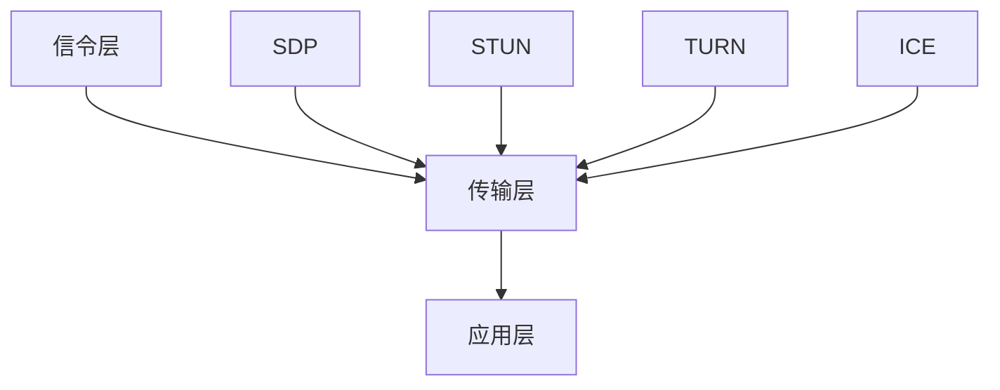

                 

WebRTC（Web Real-Time Communication）是一种支持网页浏览器进行实时语音通话、视频聊天的开放项目，它旨在实现网页上实时通信的无缝体验。随着互联网技术的快速发展，实时通信已成为在线社交、在线教育、远程办公等领域不可或缺的一部分。本文将深入探讨WebRTC的工作原理、实现过程及未来应用前景。

## 关键词
- WebRTC
- 实时通信
- Web浏览器
- SDP（会话描述协议）
- STUN（简单遍历UDP协议）
- TURN（遍历转发协议）
- RTP（实时传输协议）
- ICE（交互式连接建立）

## 摘要
本文将详细介绍WebRTC的核心概念、工作原理及其在浏览器中的实现。通过阅读本文，读者将了解如何利用WebRTC在网页上实现高质量的实时通信功能，并掌握WebRTC在实际项目中的应用方法。

## 1. 背景介绍

### 1.1 WebRTC的起源与发展

WebRTC起源于Google，最初是为了在浏览器上实现高质量的实时视频通话而开发的。2011年，Google将其开源，随后得到业界广泛支持，形成了WebRTC联盟，包括Google、Mozilla、Opera和微软等知名公司。

### 1.2 WebRTC的应用领域

WebRTC在诸多领域都有广泛应用，如视频会议、在线教育、远程医疗、在线直播、实时客服等。它不仅支持网页，还支持移动应用，使得实时通信变得更加便捷。

### 1.3 WebRTC的优势

WebRTC具有以下优势：

- **跨平台**：支持主流浏览器和移动设备，无需额外插件。
- **低延迟**：通过优化协议，实现低延迟的实时通信。
- **高稳定性**：支持网络质量差的环境，通过STUN、TURN等协议解决NAT穿透问题。
- **支持多媒体**：支持音频、视频、数据通道等多种数据传输。

## 2. 核心概念与联系

### 2.1 WebRTC架构

WebRTC的架构可以分为三层：信令层、传输层和应用层。

- **信令层**：负责建立通信连接，处理NAT穿透，交换媒体参数等。
- **传输层**：负责数据传输，包括RTP、RTCP等协议。
- **应用层**：负责实现具体的通信应用，如视频聊天、音频通话等。

### 2.2 关键协议

- **SDP（会话描述协议）**：用于描述会话的媒体类型、格式、带宽等参数。
- **STUN（简单遍历UDP协议）**：用于获取公网IP和端口，解决NAT穿透问题。
- **TURN（遍历转发协议）**：用于在NAT或防火墙后建立中转通道。
- **ICE（交互式连接建立）**：用于在多个STUN/TURN服务器之间建立最佳连接。

### 2.3 Mermaid流程图



## 3. 核心算法原理 & 具体操作步骤

### 3.1 算法原理概述

WebRTC的核心算法包括NAT穿透、信令交换、媒体传输等。

- **NAT穿透**：通过STUN、TURN协议获取公网IP和端口，或建立中转通道。
- **信令交换**：通过SDP交换媒体参数，建立通信连接。
- **媒体传输**：通过RTP传输音频、视频数据，通过RTCP监控通信质量。

### 3.2 算法步骤详解

#### 3.2.1 NAT穿透

1. 客户端通过STUN请求获取自己的公网IP和端口。
2. 客户端发送ICE候选地址给对端。
3. 对端通过STUN或TURN获取公网IP和端口，并发送ICE候选地址给客户端。
4. 双方通过ICE算法选出最佳候选地址建立连接。

#### 3.2.2 信令交换

1. 客户端发送SDP请求给对端。
2. 对端响应SDP，包含支持的媒体类型、格式等。
3. 客户端根据对端的SDP响应调整自己的媒体设置。

#### 3.2.3 媒体传输

1. 客户端将音频、视频数据编码为RTP格式。
2. 客户端发送RTP数据包给对端。
3. 对端解码RTP数据包，播放音频、视频。

### 3.3 算法优缺点

#### 3.3.1 优点

- **跨平台**：无需安装插件，支持主流浏览器和移动设备。
- **低延迟**：优化协议，实现低延迟的实时通信。
- **高稳定性**：通过STUN、TURN等协议解决NAT穿透问题。

#### 3.3.2 缺点

- **兼容性**：部分旧版浏览器不支持WebRTC。
- **配置**：需要一定的配置和调试才能达到最佳性能。

### 3.4 算法应用领域

- **视频会议**：企业、学校、政府等机构的内部沟通。
- **在线教育**：教师与学生的实时互动。
- **远程医疗**：医生与患者的远程诊断。
- **在线直播**：主播与观众的实时互动。
- **实时客服**：客服与客户的实时沟通。

## 4. 数学模型和公式 & 详细讲解 & 举例说明

### 4.1 数学模型构建

WebRTC的数学模型主要包括NAT穿透模型、信令交换模型和媒体传输模型。

### 4.2 公式推导过程

#### 4.2.1 NAT穿透模型

$$
NAT\_IP = STUN\_Server\_IP + STUN\_Server\_Port + Client\_Port
$$

#### 4.2.2 信令交换模型

$$
SDP\_Response = SDP\_Request + Media\_Type + Format + Bandwidth
$$

#### 4.2.3 媒体传输模型

$$
RTP\_Packet = Audio/Video\_Data + RTP\_Header
$$

### 4.3 案例分析与讲解

#### 4.3.1 案例背景

一家公司需要实现员工之间的实时视频会议，选择使用WebRTC技术。

#### 4.3.2 实现步骤

1. 搭建信令服务器，用于处理SDP交换、NAT穿透等信令。
2. 客户端调用WebRTC API，初始化WebRTC连接。
3. 客户端通过STUN获取公网IP和端口，发送ICE候选地址给对端。
4. 对端响应SDP，建立通信连接。
5. 客户端将音频、视频数据编码为RTP格式，发送给对端。
6. 对端解码RTP数据包，播放音频、视频。

## 5. 项目实践：代码实例和详细解释说明

### 5.1 开发环境搭建

1. 安装Node.js，用于搭建信令服务器。
2. 安装WebRTC SDK，如LibWebRTC或WebRTC.js。

### 5.2 源代码详细实现

```javascript
// 引入WebRTC.js库
const webRTC = require('webrtc');

// 初始化WebRTC连接
const connection = webRTC.createConnection();

// 添加NAT穿透
connection.stunServer('stun.l.google.com', 19302);

// 添加信令服务器
connection.signalServer('http://signal-server.example.com');

// 监听连接事件
connection.on('connect', () => {
    console.log('连接成功');
    // 发起SDP请求
    connection.sendSDPRequest({
        audio: {
            type: 'audio',
            codec: 'opus',
            channels: 2,
            rate: 48000
        },
        video: {
            type: 'video',
            codec: 'VP8',
            width: 1280,
            height: 720
        }
    });
});

// 监听SDP响应事件
connection.on('SDPResponse', (response) => {
    console.log('收到SDP响应');
    // 调整媒体设置
    connection.setMedia({
        audio: {
            type: 'audio',
            codec: response.audio.codec,
            channels: response.audio.channels,
            rate: response.audio.rate
        },
        video: {
            type: 'video',
            codec: response.video.codec,
            width: response.video.width,
            height: response.video.height
        }
    });
});

// 监听媒体数据事件
connection.on('media', (media) => {
    console.log('收到媒体数据');
    // 播放音频、视频
    if (media.type === 'audio') {
        // 播放音频
    } else if (media.type === 'video') {
        // 播放视频
    }
});

// 发送媒体数据
connection.sendMedia({
    audio: {
        type: 'audio',
        data: audioData
    },
    video: {
        type: 'video',
        data: videoData
    }
});
```

### 5.3 代码解读与分析

1. 引入WebRTC.js库，初始化WebRTC连接。
2. 添加STUN服务器，用于获取公网IP和端口。
3. 添加信令服务器，用于处理SDP交换等信令。
4. 监听连接事件，发送SDP请求。
5. 监听SDP响应事件，调整媒体设置。
6. 监听媒体数据事件，播放音频、视频。
7. 发送媒体数据，实现实时通信。

## 6. 实际应用场景

### 6.1 视频会议

视频会议是WebRTC最典型的应用场景之一，企业、学校、政府等机构广泛使用WebRTC实现跨地域的实时沟通。

### 6.2 在线教育

在线教育平台利用WebRTC实现教师与学生之间的实时互动，提高教学效果。

### 6.3 远程医疗

远程医疗通过WebRTC实现医生与患者之间的实时诊断，提高医疗资源利用率。

### 6.4 在线直播

在线直播平台通过WebRTC实现主播与观众的实时互动，提高直播体验。

### 6.5 实时客服

实时客服系统通过WebRTC实现客服与客户的实时沟通，提高客户满意度。

## 7. 工具和资源推荐

### 7.1 学习资源推荐

- 《WebRTC 编程指南》
- 《WebRTC 实战》
- 《WebRTC 网络编程》

### 7.2 开发工具推荐

- WebRTC.js
- LibWebRTC
- SimpleWebRTC

### 7.3 相关论文推荐

- "WebRTC: Real-Time Communication Beyond Plug-ins"
- "WebRTC: Enabling Real-Time Communications on the Web"
- "WebRTC: A Protocol for Browser-to-Browser Applications"

## 8. 总结：未来发展趋势与挑战

### 8.1 研究成果总结

WebRTC自开源以来，取得了显著的成果，已成为实时通信领域的重要技术。它支持跨平台、低延迟、高稳定性，广泛应用于多个领域。

### 8.2 未来发展趋势

1. **性能优化**：持续优化协议和算法，提高通信质量。
2. **标准化**：推动WebRTC标准化，提高兼容性。
3. **安全增强**：加强通信安全，保障用户隐私。

### 8.3 面临的挑战

1. **兼容性**：部分旧版浏览器不支持WebRTC。
2. **稳定性**：在高网络负载情况下，如何保证通信质量。

### 8.4 研究展望

WebRTC将继续在实时通信领域发挥重要作用，未来有望实现更高效、更安全的实时通信。

## 9. 附录：常见问题与解答

### 9.1 Q：WebRTC需要安装插件吗？

A：不需要，WebRTC是直接集成在浏览器中的技术，无需安装插件。

### 9.2 Q：WebRTC支持哪些浏览器？

A：WebRTC支持主流浏览器，如Chrome、Firefox、Safari、Edge等。

### 9.3 Q：WebRTC如何处理NAT穿透？

A：WebRTC通过STUN、TURN等协议处理NAT穿透，确保通信双方能够建立连接。

### 9.4 Q：WebRTC如何保证通信质量？

A：WebRTC通过RTP、RTCP等协议实时监控通信质量，并采取相应措施保证通信质量。

作者：禅与计算机程序设计艺术 / Zen and the Art of Computer Programming
----------------------------------------------------------------
这篇文章从背景介绍、核心概念、算法原理、数学模型、项目实践、实际应用场景、工具推荐、未来展望等多个方面全面阐述了WebRTC实时通信技术。希望这篇文章能够为读者在WebRTC开发和应用方面提供有价值的参考和指导。在未来的发展中，WebRTC有望在实时通信领域发挥更加重要的作用，为我们的生活和工作带来更多便利。

