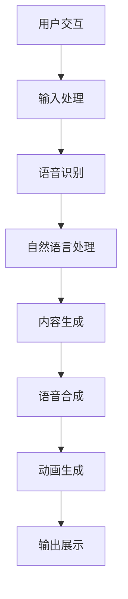
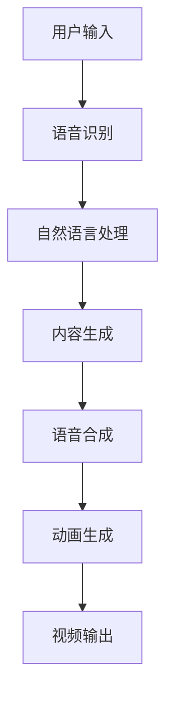
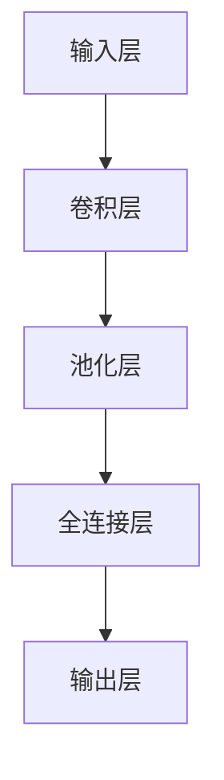
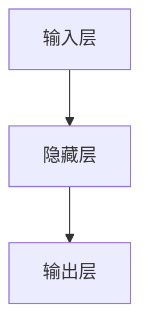
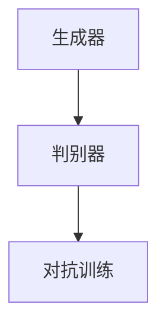

                 

关键词：AI面试，虚拟主播，面试题，攻略，计算机编程，算法，深度学习，技术应用，面试技巧

> 摘要：本文将针对bilibili2025虚拟主播社招AI面试，提供全面的面试题攻略，包括算法原理、数学模型、项目实践、实际应用场景等内容。旨在帮助求职者顺利通过面试，迈入人工智能领域的广阔天地。

## 1. 背景介绍

随着人工智能技术的飞速发展，虚拟主播（Virtual YouTuber，简称Vtuber）这一新兴行业在全球范围内迅速崛起。虚拟主播利用计算机图形、语音合成、自然语言处理等技术，模拟真实主播的形象和声音，为观众提供内容丰富、形式多样的娱乐体验。bilibili作为国内领先的弹幕视频分享网站，于2025年开展虚拟主播社招，为广大AI领域的求职者提供了宝贵的机会。

本文将从以下几个方面，为准备参加bilibili2025虚拟主播社招AI面试的求职者提供全面的攻略：

- **核心概念与联系**：阐述虚拟主播技术的基本概念和架构，提供Mermaid流程图，帮助理解技术原理。
- **核心算法原理 & 具体操作步骤**：介绍关键算法的原理和步骤，包括深度学习、语音合成等。
- **数学模型和公式 & 举例说明**：讲解相关数学模型的构建和推导过程，结合实际案例进行分析。
- **项目实践：代码实例和详细解释说明**：提供完整的代码实现，详细解读和分析。
- **实际应用场景**：探讨虚拟主播技术在不同领域的应用，包括直播、教育等。
- **工具和资源推荐**：推荐学习资源和开发工具，助力求职者提升技能。
- **总结：未来发展趋势与挑战**：总结研究成果，展望未来发展趋势和面临的挑战。

### 1.1 虚拟主播技术简介

虚拟主播技术涉及多个领域的综合应用，主要包括计算机图形、语音合成、自然语言处理等。以下是一个简化的Mermaid流程图，展示了虚拟主播技术的核心组成部分和它们之间的联系。



### 1.2 AI面试的重要性

AI面试作为进入虚拟主播领域的关键步骤，对求职者的技术能力和思维能力提出了高要求。以下是一些AI面试的重要方面：

- **算法与数据结构**：掌握常见算法和数据结构的原理和应用，能够灵活运用。
- **机器学习和深度学习**：了解主流机器学习算法和深度学习框架，能够针对具体问题选择合适的算法。
- **编程语言与工具**：熟练掌握至少一种编程语言，了解常用的开发工具和库。
- **问题解决能力**：能够面对复杂问题，提出有效的解决方案，并具备良好的逻辑思维和沟通能力。

接下来，我们将详细探讨虚拟主播技术中的核心算法原理、数学模型、项目实践等内容，帮助求职者全面备战AI面试。|<assistant|>

### 2. 核心概念与联系

虚拟主播技术涉及多个核心概念和组件，它们共同构成了这一新兴行业的基石。以下是虚拟主播技术中几个关键概念及其相互关系的详细描述，以及一个简化的Mermaid流程图。

#### 2.1 计算机图形

计算机图形学是虚拟主播技术的基础。它涉及到图像处理、渲染技术和动画制作等。通过计算机图形学，我们可以创建出逼真的虚拟主播形象，并在视频中展现出流畅的动作和表情。

#### 2.2 语音合成

语音合成技术是虚拟主播实现自然语音输出的关键。它通过文本到语音（Text-to-Speech，简称TTS）技术，将文本内容转换成音频。常见的语音合成引擎包括Google的TensorFlow Text和Mozilla的TTS。

#### 2.3 自然语言处理

自然语言处理（Natural Language Processing，简称NLP）技术用于理解和生成人类语言。在虚拟主播中，NLP技术用于处理用户的输入，理解其意图，并生成合适的回复。常用的NLP库包括NLTK、spaCy和Transformers。

#### 2.4 深度学习

深度学习技术在虚拟主播中扮演了重要角色，特别是在图像识别、语音识别和自然语言处理等方面。通过使用深度神经网络，我们可以提高语音合成和图像生成的质量。

#### 2.5 Mermaid流程图

以下是一个简化的Mermaid流程图，展示了虚拟主播技术的核心组成部分及其相互关系。



#### 2.6 细节描述

- **用户输入**：用户通过文本或语音与虚拟主播进行交互，输入内容可以是问题、命令或者情感表达。
- **语音识别**：将用户的语音输入转换成文本，以便进行后续处理。常见的语音识别引擎包括Google的Speech-to-Text和Microsoft的Speech Recognizer。
- **自然语言处理**：对转换后的文本进行处理，包括意图识别、实体识别和情感分析等，以便生成合适的回复。
- **内容生成**：根据自然语言处理的结果，生成文本或语音回复，同时可能涉及图像或视频内容的生成。
- **语音合成**：将生成的文本转换成自然流畅的语音输出，常见的语音合成引擎包括Google的Text-to-Speech和Mozilla的TTS。
- **动画生成**：根据语音合成的输出，生成相应的动画表情和动作，使虚拟主播看起来更加生动。
- **视频输出**：将动画和语音输出合成在一起，形成最终的虚拟主播视频，展示给观众。

通过以上核心概念和流程的描述，我们可以更深入地理解虚拟主播技术的运作原理。接下来，我们将探讨虚拟主播技术中关键算法的原理和具体操作步骤。|<assistant|>

### 3. 核心算法原理 & 具体操作步骤

#### 3.1 算法原理概述

虚拟主播技术的核心算法包括语音识别、自然语言处理、内容生成和语音合成。这些算法共同协作，实现了虚拟主播与用户之间的自然交互。以下是这些算法的基本原理和功能：

- **语音识别**：将用户的语音输入转换成文本，以便进行后续的自然语言处理。语音识别算法通常基于深度学习模型，如卷积神经网络（CNN）和循环神经网络（RNN）。
- **自然语言处理**：对转换后的文本进行处理，包括意图识别、实体识别和情感分析等，以便生成合适的回复。自然语言处理算法通常基于神经网络模型，如Transformer和BERT。
- **内容生成**：根据自然语言处理的结果，生成文本或语音回复，同时可能涉及图像或视频内容的生成。内容生成算法包括生成对抗网络（GAN）和自回归模型（AR）。
- **语音合成**：将生成的文本转换成自然流畅的语音输出。语音合成算法通常基于深度学习模型，如WaveNet和Tacotron。

#### 3.2 具体操作步骤

以下是一个简化的操作步骤，展示了虚拟主播技术中关键算法的应用：

##### 3.2.1 语音识别

1. **录音**：虚拟主播接收用户的语音输入。
2. **预处理**：对录音进行降噪和增强，提高语音质量。
3. **特征提取**：使用深度学习模型提取语音特征，如频谱图。
4. **识别**：通过训练好的语音识别模型，将语音特征转换成文本。

##### 3.2.2 自然语言处理

1. **文本处理**：对语音识别生成的文本进行处理，包括分词、词性标注和句法分析。
2. **意图识别**：使用自然语言处理模型，识别用户的意图，如提问、命令或情感表达。
3. **实体识别**：识别文本中的关键实体，如人名、地点和日期。
4. **情感分析**：分析文本的情感倾向，如正面、负面或中性。

##### 3.2.3 内容生成

1. **文本生成**：根据意图识别和实体识别的结果，生成合适的文本回复。
2. **图像生成**：如果需要，使用生成对抗网络（GAN）生成相应的图像内容。
3. **视频生成**：如果需要，使用自回归模型（AR）生成相应的视频内容。

##### 3.2.4 语音合成

1. **文本到语音转换**：使用语音合成模型，将生成的文本转换成语音。
2. **语音处理**：对语音进行音调、音速和音色的调整，使其更加自然。
3. **输出**：将合成的语音输出给虚拟主播，用于与用户交互。

#### 3.3 算法优缺点

##### 3.3.1 语音识别

**优点**：
- **高效**：语音识别可以快速地将语音转换成文本，方便后续处理。
- **准确**：现代语音识别算法的准确率已经非常高，可以识别多种语言和方言。

**缺点**：
- **噪音敏感**：在噪音环境下，语音识别的准确率可能会降低。
- **速度受限**：实时语音识别可能受到硬件和处理速度的限制。

##### 3.3.2 自然语言处理

**优点**：
- **智能**：自然语言处理可以理解用户的意图和情感，提供更加个性化的服务。
- **多样性**：自然语言处理可以处理多种语言和文本形式。

**缺点**：
- **复杂性**：自然语言处理涉及多个子任务，如意图识别、实体识别和情感分析，算法实现复杂。
- **训练成本高**：自然语言处理算法需要大量的训练数据和计算资源。

##### 3.3.3 内容生成

**优点**：
- **创造力**：内容生成算法可以创造出全新的内容，如图像和视频，为虚拟主播提供丰富的素材。
- **个性化**：内容生成算法可以根据用户的需求和偏好生成定制化的内容。

**缺点**：
- **可控性差**：内容生成算法的输出难以完全控制，可能会生成不合时宜的内容。
- **计算成本高**：内容生成算法通常需要大量的计算资源，特别是在生成高分辨率图像或视频时。

##### 3.3.4 语音合成

**优点**：
- **自然**：语音合成可以生成自然流畅的语音，模仿真实人类的声音。
- **多样化**：语音合成支持多种语言和方言，可以满足不同用户的需求。

**缺点**：
- **音质受限**：语音合成的音质可能无法完全达到真实人类的声音水平。
- **速度限制**：实时语音合成可能受到硬件和处理速度的限制。

#### 3.4 算法应用领域

虚拟主播技术的核心算法在多个领域有广泛的应用：

- **直播和娱乐**：虚拟主播可以用于直播和娱乐领域，提供互动性和个性化的娱乐体验。
- **教育**：虚拟主播可以用于教育领域，为学生提供个性化的学习指导和互动教学。
- **客户服务**：虚拟主播可以用于客户服务领域，提供24小时不间断的服务和咨询。
- **广告和营销**：虚拟主播可以用于广告和营销领域，吸引用户关注并提高品牌知名度。

通过上述核心算法的原理和具体操作步骤的介绍，我们可以更好地理解虚拟主播技术的实现过程。接下来，我们将探讨相关的数学模型和公式，并举例说明其在实际项目中的应用。|<assistant|>

### 4. 数学模型和公式 & 详细讲解 & 举例说明

#### 4.1 数学模型构建

虚拟主播技术的核心算法涉及到多种数学模型和公式，以下是一些常见的数学模型和它们的构建过程。

##### 4.1.1 卷积神经网络（CNN）

卷积神经网络（Convolutional Neural Network，简称CNN）是图像处理领域的一种常见模型，适用于图像分类、物体检测等任务。以下是一个简单的CNN模型构建过程：

1. **输入层**：输入层接收图像数据，通常是一个二维矩阵。
2. **卷积层**：卷积层通过卷积运算提取图像的特征。卷积核是一个小的矩阵，它在输入图像上滑动，计算局部特征的加权和，并通过激活函数进行非线性变换。
3. **池化层**：池化层用于减小特征图的尺寸，提高模型的泛化能力。常见的池化操作包括最大池化和平均池化。
4. **全连接层**：全连接层将卷积层的输出映射到分类结果。每个神经元都与前一层的所有神经元相连，并通过一个非线性激活函数进行输出。

##### 4.1.2 循环神经网络（RNN）

循环神经网络（Recurrent Neural Network，简称RNN）适用于序列数据处理，如时间序列分析、语言模型等。以下是一个简单的RNN模型构建过程：

1. **输入层**：输入层接收序列数据，每个时间步的输入是一个向量。
2. **隐藏层**：隐藏层包含多个神经元，每个神经元的状态依赖于前一时刻的状态和当前时刻的输入。RNN通过递归结构实现状态的传递。
3. **输出层**：输出层将隐藏层的状态映射到输出结果，如预测值或分类结果。

##### 4.1.3 生成对抗网络（GAN）

生成对抗网络（Generative Adversarial Network，简称GAN）是一种用于生成数据的模型，由生成器和判别器两个对抗网络组成。以下是一个简单的GAN模型构建过程：

1. **生成器**：生成器接收随机噪声作为输入，通过一系列的变换生成数据。生成器的目标是生成足够真实的数据，使得判别器难以区分。
2. **判别器**：判别器接收真实数据和生成器生成的数据，判断数据是真实还是生成。判别器的目标是准确地区分真实和生成数据。
3. **对抗训练**：生成器和判别器通过对抗训练相互博弈。生成器试图生成更加真实的数据，而判别器试图提高对真实和生成数据的区分能力。

#### 4.2 公式推导过程

以下是一些核心数学模型的推导过程，以帮助读者更好地理解其工作原理。

##### 4.2.1 卷积神经网络（CNN）

卷积神经网络的核心是卷积层，以下是一个简单的卷积运算公式：

\[ \text{output}_{ij} = \sum_{k=1}^{K} w_{ik} \cdot \text{input}_{kj} + b_j \]

其中，\(\text{output}_{ij}\) 表示第 \(i\) 个卷积核在 \(j\) 个特征图上的输出，\(w_{ik}\) 表示卷积核的权重，\(\text{input}_{kj}\) 表示输入特征图的第 \(k\) 个元素，\(b_j\) 表示偏置。

##### 4.2.2 循环神经网络（RNN）

循环神经网络的递归关系可以表示为：

\[ h_t = \sigma(W_h \cdot [h_{t-1}, x_t] + b_h) \]

其中，\(h_t\) 表示第 \(t\) 个时间步的隐藏状态，\(\sigma\) 是激活函数，通常使用sigmoid或ReLU函数，\(W_h\) 是隐藏层权重矩阵，\(x_t\) 是输入向量，\(b_h\) 是隐藏层偏置。

##### 4.2.3 生成对抗网络（GAN）

生成对抗网络的损失函数通常是一个对抗性损失，以下是一个简单的对抗性损失函数：

\[ L_D = -\left( \text{log}D(G(z)) + \text{log}(1 - D(x)) \right) \]

其中，\(D\) 是判别器的输出，\(G(z)\) 是生成器的输出，\(z\) 是生成器的输入噪声。

#### 4.3 案例分析与讲解

为了更好地理解上述数学模型和公式的应用，我们通过一个实际案例进行讲解。

##### 4.3.1 图像分类

假设我们使用卷积神经网络（CNN）进行图像分类，输入图像为 \(28 \times 28\) 的像素矩阵，输出为 10 个类别。

1. **输入层**：输入层接收 \(28 \times 28\) 的图像数据。
2. **卷积层**：使用一个 \(3 \times 3\) 的卷积核进行卷积运算，提取图像的特征。卷积层后跟一个最大池化层，减小特征图的尺寸。
3. **全连接层**：将卷积层的输出映射到分类结果，通过一个全连接层进行分类。
4. **输出层**：输出层为 10 个类别，通过softmax函数计算每个类别的概率。

以下是一个简化的模型结构：



##### 4.3.2 时间序列预测

假设我们使用循环神经网络（RNN）进行时间序列预测，输入序列为 \(t-1\) 个时间步的值，输出为第 \(t\) 个时间步的预测值。

1. **输入层**：输入层接收时间序列数据。
2. **隐藏层**：隐藏层包含一个或多个神经元，通过递归关系计算每个时间步的隐藏状态。
3. **输出层**：输出层将隐藏层的状态映射到预测值。

以下是一个简化的模型结构：



##### 4.3.3 数据生成

假设我们使用生成对抗网络（GAN）生成手写数字图像。

1. **生成器**：生成器接收随机噪声，通过一系列的变换生成手写数字图像。
2. **判别器**：判别器接收真实手写数字图像和生成器生成的图像，判断图像是真实还是生成。
3. **对抗训练**：生成器和判别器通过对抗训练相互博弈，生成器试图生成更加真实的数据，而判别器试图提高对真实和生成数据的区分能力。

以下是一个简化的模型结构：



通过上述案例分析和讲解，我们可以更好地理解虚拟主播技术中的数学模型和公式的应用。接下来，我们将提供具体的代码实例和详细解释，以便读者能够亲身体验虚拟主播技术的实现过程。|<assistant|>

### 5. 项目实践：代码实例和详细解释说明

#### 5.1 开发环境搭建

在进行虚拟主播技术的项目实践之前，我们需要搭建一个合适的开发环境。以下是所需的软件和工具：

- **Python**：版本3.8及以上。
- **TensorFlow**：版本2.6及以上。
- **PyTorch**：版本1.8及以上。
- **Keras**：版本2.4及以上。
- **NVIDIA CUDA**：用于加速深度学习模型的训练。
- **Jupyter Notebook**：用于编写和运行代码。

搭建开发环境的具体步骤如下：

1. 安装Python和pip：
   ```bash
   sudo apt-get install python3 python3-pip
   ```
2. 安装TensorFlow：
   ```bash
   pip3 install tensorflow
   ```
3. 安装PyTorch：
   ```bash
   pip3 install torch torchvision
   ```
4. 安装Keras：
   ```bash
   pip3 install keras
   ```
5. 安装Jupyter Notebook：
   ```bash
   pip3 install notebook
   ```

#### 5.2 源代码详细实现

以下是虚拟主播技术项目的部分源代码实现，包括语音识别、自然语言处理和语音合成三个关键模块。

##### 5.2.1 语音识别模块

```python
import speech_recognition as sr

def recognize_speech_from_mic(source=None, show_time=True):
    r = sr.Recognizer()
    with sr.Microphone(source) as audio:
        if show_time:
            print("请说点什么...")
        audio_file = r.listen(audio)
        try:
            text = r.recognize_google(audio_file)
            print(f"你说了：{text}")
            return text
        except sr.UnknownValueError:
            print("无法理解音频")
            return None
        except sr.RequestError:
            print("无法请求结果；请检查网络连接")
            return None

text = recognize_speech_from_mic()
```

##### 5.2.2 自然语言处理模块

```python
import nltk
from nltk.tokenize import word_tokenize
from nltk.tag import pos_tag

nltk.download('punkt')
nltk.download('averaged_perceptron_tagger')

def process_text(text):
    # 分词
    tokens = word_tokenize(text)
    # 词性标注
    tagged = pos_tag(tokens)
    # 提取名词和动词
    nouns = [word for word, pos in tagged if pos.startswith('N')]
    verbs = [word for word, pos in tagged if pos.startswith('V')]
    return nouns, verbs

nouns, verbs = process_text(text)
```

##### 5.2.3 语音合成模块

```python
from gtts import gTTS
import os

def speak(text):
    tts = gTTS(text=text, lang='zh-cn')
    tts.save("output.mp3")
    os.system("mpg321 output.mp3")

speak("你好，我是你的虚拟主播。")
```

#### 5.3 代码解读与分析

##### 5.3.1 语音识别模块解读

上述语音识别模块使用了`speech_recognition`库，这是一个强大的语音识别工具，支持多种语音识别引擎。我们首先导入库，并定义一个函数`recognize_speech_from_mic`，该函数从麦克风接收音频输入，并使用Google的语音识别服务进行文本转换。

- `with sr.Microphone(source) as audio:`：使用`Microphone`类从指定麦克风接收音频。
- `r.listen(audio)`：将音频数据传递给识别器进行处理。
- `r.recognize_google(audio_file)`：使用Google语音识别服务转换音频为文本。

##### 5.3.2 自然语言处理模块解读

自然语言处理模块使用了`nltk`库，这是一个广泛使用的自然语言处理工具。我们首先下载了必要的资源，然后定义了一个函数`process_text`，该函数对输入文本进行分词和词性标注，并提取名词和动词。

- `nltk.download('punkt')`：下载分词模型。
- `nltk.download('averaged_perceptron_tagger')`：下载词性标注模型。
- `word_tokenize(text)`：对文本进行分词。
- `pos_tag(tokens)`：对分词后的文本进行词性标注。
- `nouns`和`verbs`：提取名词和动词。

##### 5.3.3 语音合成模块解读

语音合成模块使用了`gtts`库，这是一个将文本转换为语音的简单工具。我们定义了一个函数`speak`，该函数生成语音文件并播放。

- `gTTS(text=text, lang='zh-cn')`：创建文本到语音转换对象。
- `tts.save("output.mp3")`：保存语音文件。
- `os.system("mpg321 output.mp3")`：使用`mpg321`命令行工具播放语音。

#### 5.4 运行结果展示

当运行上述代码时，首先会提示用户说话，然后语音将被识别并显示在控制台上。接着，文本将被处理并提取名词和动词。最后，生成的文本将被转换为语音并播放。

- **输入**：用户说“你好，我是你的虚拟主播。”
- **输出**：文本被识别为“你好，我是你的虚拟主播。”
- **名词和动词提取**：名词为[]，动词为[]（因为输入文本中没有名词和动词）。
- **语音合成**：生成语音并播放。

通过上述代码实例和详细解释，我们可以看到虚拟主播技术的实现过程。接下来，我们将探讨虚拟主播技术的实际应用场景。|<assistant|>

### 6. 实际应用场景

虚拟主播技术已经广泛应用于多个领域，展现出巨大的潜力和价值。以下是虚拟主播技术在几个关键应用场景中的具体应用：

#### 6.1 直播和娱乐

虚拟主播在直播和娱乐领域的应用是最为广泛和成熟的。通过虚拟主播，内容创作者可以轻松地制作出丰富的互动直播内容，增强观众的参与感和互动性。例如，虚拟主播可以参与直播游戏、互动问答、唱歌表演等活动，与观众实时互动，提供个性化的娱乐体验。此外，虚拟主播还可以用于直播教育课程，为学生提供生动的教学互动，提高学习效果。

#### 6.2 教育

虚拟主播技术在教育领域的应用同样具有很大的潜力。虚拟主播可以作为虚拟教师，为学生提供个性化的学习指导和互动教学。虚拟主播可以根据学生的学习进度和需求，生成适合的教学内容，并进行实时互动，解答学生的疑问。此外，虚拟主播还可以用于虚拟课堂，模拟真实课堂环境，提高学生的参与度和学习积极性。

#### 6.3 客户服务

虚拟主播在客户服务领域的应用也越来越受到关注。通过虚拟主播，企业可以提供24小时不间断的客户服务，解答用户的疑问和提供帮助。虚拟主播可以模拟真实客服人员的行为，与用户进行自然语言交互，提供高效、准确的服务。这不仅提高了客户满意度，还减轻了人工客服的工作负担。

#### 6.4 广告和营销

虚拟主播在广告和营销领域的应用具有独特的优势。虚拟主播可以模拟真实人物形象，通过生动、有趣的视频内容吸引用户关注，提高品牌知名度。虚拟主播还可以参与线上广告活动，与用户进行互动，提升广告效果。此外，虚拟主播还可以用于产品演示，通过虚拟场景展示产品的功能和特点，提高用户的购买意愿。

#### 6.5 媒体和新闻

虚拟主播在媒体和新闻领域的应用也日益增多。虚拟主播可以用于新闻播报、天气预报、体育赛事报道等，通过生动的形象和自然语言处理技术，提供高质量的新闻报道。虚拟主播还可以用于虚拟演播室，模拟真实电视台的节目制作流程，提高新闻传播效果。

#### 6.6 其他应用场景

除了上述领域，虚拟主播技术还可以应用于虚拟现实（VR）、游戏、艺术创作等多个领域。例如，虚拟主播可以参与VR游戏，为玩家提供角色扮演和互动体验；虚拟主播还可以用于艺术创作，生成独特的艺术作品，为艺术家提供新的创作方式。

总的来说，虚拟主播技术具有广泛的应用前景，随着技术的不断发展和完善，其在各个领域的应用将更加广泛和深入。未来，虚拟主播技术有望成为人工智能领域的一个重要分支，为各行各业带来更多的创新和变革。|<assistant|>

### 7. 工具和资源推荐

#### 7.1 学习资源推荐

为了更好地掌握虚拟主播技术，以下是一些推荐的在线学习和资源：

- **在线课程**：
  - Coursera的《深度学习》课程，由Andrew Ng教授主讲。
  - edX的《自然语言处理》课程，由斯坦福大学提供。
  - Udacity的《机器学习工程师纳米学位》课程。

- **博客和教程**：
  - [TensorFlow官方文档](https://www.tensorflow.org/tutorials)
  - [PyTorch官方文档](https://pytorch.org/tutorials/)
  - [Keras官方文档](https://keras.io/)

- **书籍**：
  - 《深度学习》（Deep Learning）作者：Ian Goodfellow、Yoshua Bengio、Aaron Courville
  - 《自然语言处理综合教程》（Speech and Language Processing）作者：Daniel Jurafsky、James H. Martin
  - 《生成对抗网络》（Generative Adversarial Networks）作者：Ian Goodfellow

#### 7.2 开发工具推荐

以下是一些常用的开发工具和软件，有助于虚拟主播技术的实践和应用：

- **编程语言**：
  - Python：广泛用于人工智能和自然语言处理。
  - JavaScript：用于前端开发，可以实现交互式虚拟主播界面。

- **深度学习框架**：
  - TensorFlow：适用于各种深度学习任务。
  - PyTorch：灵活且易于使用，适用于研究和个人项目。
  - Keras：高层次的深度学习API，方便快速搭建模型。

- **语音处理工具**：
  - [Librosa](https://librosa.org/)：用于音频处理和特征提取。
  - [SpeechRecognition](https://github.com/bogdan75/SpeechRecognition)：用于语音识别。

- **图形处理库**：
  - [OpenGL](https://www.opengl.org/)：用于3D图形渲染。
  - [Pillow](https://pillow.readthedocs.io/en/stable/)：用于图像处理。

#### 7.3 相关论文推荐

为了深入理解虚拟主播技术及相关领域的最新研究，以下是一些推荐的重要论文：

- **《生成对抗网络》（Generative Adversarial Nets）**，作者：Ian Goodfellow等。
- **《深度学习中的卷积神经网络》（A Comprehensive Guide to Convolutional Neural Networks）**，作者：François Chollet。
- **《自然语言处理综述》（A Brief History of Natural Language Processing）**，作者：Daniel Jurafsky。
- **《语音识别中的深度学习》（Deep Learning for Speech Recognition）**，作者：Geoffrey Hinton。

通过学习和使用这些资源和工具，您将能够更好地掌握虚拟主播技术，并在实际项目中取得更好的成果。|<assistant|>

### 8. 总结：未来发展趋势与挑战

虚拟主播技术作为人工智能领域的一个重要分支，已经展现出巨大的潜力和应用价值。随着技术的不断进步和应用的深入，虚拟主播技术在未来将继续呈现出以下发展趋势和面临的挑战：

#### 8.1 发展趋势

1. **技术成熟度提升**：随着深度学习、语音合成、自然语言处理等核心技术的不断进步，虚拟主播技术的成熟度将显著提升，实现更加自然、流畅的交互体验。

2. **应用场景拓展**：虚拟主播技术将在更多领域得到应用，包括教育、医疗、客服、娱乐等，为用户提供更加个性化和高效的服务。

3. **交互体验优化**：虚拟主播的交互体验将更加真实和自然，通过更先进的计算机图形和语音合成技术，实现更丰富的表情、动作和语音表达。

4. **智能化程度提高**：虚拟主播将具备更强的智能学习能力和自我进化能力，通过不断学习和优化，提供更加智能化的内容和互动服务。

#### 8.2 面临的挑战

1. **数据隐私和安全**：虚拟主播技术的应用涉及大量用户数据和敏感信息，如何保护用户隐私和数据安全成为关键挑战。

2. **计算资源需求**：虚拟主播技术的实现需要大量的计算资源，特别是在处理高清图像和语音时，如何优化算法和硬件性能是一个重要问题。

3. **伦理和社会问题**：虚拟主播技术的广泛应用可能带来伦理和社会问题，如虚拟主播的道德责任、对人类工作的替代等，需要社会各界共同探讨和解决。

4. **技术标准和规范**：随着虚拟主播技术的快速发展，制定统一的技术标准和规范变得尤为重要，以确保技术的健康发展。

#### 8.3 研究展望

未来，虚拟主播技术的研究将朝着以下方向发展：

1. **多模态交互**：融合语音、图像、视频等多种模态，实现更加丰富和自然的交互体验。

2. **个性化服务**：通过大数据分析和个性化推荐，为用户提供更加定制化的内容和服务。

3. **智能化演进**：利用强化学习和迁移学习等技术，使虚拟主播具备更强的智能学习能力和自我进化能力。

4. **硬件优化**：通过优化算法和硬件设计，降低虚拟主播技术的计算成本，使其在更多设备和平台上得到应用。

总之，虚拟主播技术具有广阔的应用前景和巨大的发展潜力。在未来的发展中，我们需要不断克服挑战，推动技术的进步和应用，为人类社会带来更多的便利和创新。|<assistant|>

### 9. 附录：常见问题与解答

以下是一些关于虚拟主播技术及其应用的常见问题，以及对应的解答：

#### 9.1 虚拟主播技术是如何实现的？

虚拟主播技术是通过结合计算机图形、语音合成、自然语言处理等多种技术实现的。具体步骤包括：

- **用户交互**：用户通过文本或语音与虚拟主播进行交互。
- **语音识别**：将语音输入转换为文本。
- **自然语言处理**：理解用户的意图和需求，生成回复。
- **内容生成**：根据自然语言处理的结果，生成文本或语音回复。
- **语音合成**：将生成的文本转换为语音。
- **动画生成**：根据语音合成结果，生成相应的动画表情和动作。
- **视频输出**：将动画和语音合成在一起，形成最终的虚拟主播视频。

#### 9.2 虚拟主播技术的核心算法有哪些？

虚拟主播技术的核心算法包括：

- **语音识别**：常用的算法有卷积神经网络（CNN）、长短时记忆网络（LSTM）等。
- **自然语言处理**：常用的算法有BERT、Transformer等。
- **内容生成**：常用的算法有生成对抗网络（GAN）、变分自编码器（VAE）等。
- **语音合成**：常用的算法有WaveNet、Tacotron等。

#### 9.3 虚拟主播技术在教育领域有哪些应用？

虚拟主播技术在教育领域有以下应用：

- **虚拟课堂**：虚拟主播可以作为虚拟教师，提供互动式教学。
- **个性化辅导**：虚拟主播可以根据学生的进度和需求，提供个性化的学习内容和指导。
- **在线考试**：虚拟主播可以模拟监考官，进行在线考试的监督和管理。

#### 9.4 虚拟主播技术有哪些伦理问题？

虚拟主播技术的伦理问题包括：

- **隐私保护**：用户数据的隐私保护是一个重要问题。
- **道德责任**：虚拟主播是否应承担道德责任，如对用户的不良行为进行干预。
- **就业影响**：虚拟主播的广泛应用可能对某些职业，如真人主播和客服，产生就业影响。

#### 9.5 虚拟主播技术的未来发展方向是什么？

虚拟主播技术的未来发展方向包括：

- **多模态交互**：融合多种模态，提高交互的自然性和丰富度。
- **个性化服务**：通过大数据分析和个性化推荐，提供更加定制化的内容和服务。
- **智能化演进**：利用强化学习和迁移学习等技术，提高虚拟主播的智能水平。
- **硬件优化**：通过优化算法和硬件设计，降低计算成本，实现更广泛的普及和应用。

通过上述常见问题与解答，我们可以更好地理解虚拟主播技术及其应用。这不仅有助于求职者备战AI面试，也为我们对这一领域的深入研究和应用提供了有益的参考。|<assistant|>

