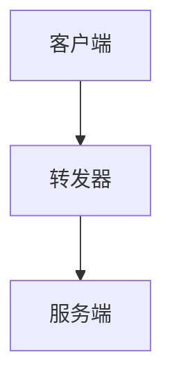

                 

 rtmp协议是一种开源流媒体传输协议，广泛应用于实时视频直播、视频点播等领域。搭建和配置rtmp服务器是进行视频流传输的关键步骤。本文将详细介绍如何搭建和配置rtmp服务器，包括所需软件和环境配置，以及具体的操作步骤。

> 关键词：rtmp服务器，搭建，配置，流媒体传输，实时视频直播，视频点播

## 摘要

本文旨在为广大开发者提供一个全面的rtmp服务器搭建与配置指南。文章首先介绍了rtmp协议的基本概念和作用，然后详细讲解了搭建rtmp服务器的步骤，包括所需软件的安装和配置。此外，文章还通过具体实例，讲解了rtmp服务器的配置过程，并对可能出现的问题进行了分析。

## 1. 背景介绍

### 1.1 rtmp协议简介

RTMP（Real Time Messaging Protocol）是一种开源的实时流媒体传输协议。它由Adobe开发，主要用于Flash应用程序之间的实时数据传输。RTMP协议的主要特点是传输速度快、延迟低、可靠性高，广泛应用于视频直播、视频点播等领域。

### 1.2 rtmp服务器的应用场景

rtmp服务器广泛应用于各种场景，包括：

- 视频直播：例如直播赛事、演唱会、讲座等。
- 视频点播：例如视频网站的视频点播功能。
- 企业内部视频会议：例如企业内部培训、会议直播等。

## 2. 核心概念与联系

为了更好地理解rtmp服务器的搭建与配置，我们首先需要了解一些核心概念。

### 2.1 rtmp协议原理

rtmp协议是一种基于TCP的传输协议，其工作原理如下：

1. **连接建立**：客户端与服务器之间通过TCP连接建立连接。
2. **数据传输**：客户端将数据发送到服务器，服务器将数据存储并返回给客户端。
3. **连接关闭**：数据传输完成后，客户端与服务器之间的TCP连接关闭。

### 2.2 rtmp服务器架构

rtmp服务器的架构主要包括以下部分：

- **服务端**：负责接收和存储客户端发送的数据。
- **客户端**：负责发送数据到服务器。
- **转发器**：负责将服务端的数据转发到其他客户端。

下面是一个简单的rtmp服务器架构图：



## 3. 核心算法原理 & 具体操作步骤

### 3.1 算法原理概述

rtmp服务器的核心算法主要涉及TCP连接的建立与断开、数据的发送与接收等。

- **TCP连接建立**：客户端通过TCP协议与服务器建立连接。
- **数据发送**：客户端将数据发送到服务器，服务器将数据存储。
- **数据接收**：客户端可以接收服务器返回的数据。
- **TCP连接断开**：数据传输完成后，客户端与服务器之间的TCP连接关闭。

### 3.2 算法步骤详解

以下是搭建rtmp服务器的具体操作步骤：

1. **安装rtmp服务器软件**：例如使用Nginx作为rtmp服务器软件。
2. **配置Nginx**：配置Nginx支持rtmp协议。
3. **启动rtmp服务器**：启动Nginx，开始接收和处理客户端的请求。
4. **测试rtmp服务器**：使用客户端测试rtmp服务器的功能。

### 3.3 算法优缺点

- **优点**：rtmp协议传输速度快、延迟低、可靠性高。
- **缺点**：rtmp协议对服务器带宽和性能有一定要求。

### 3.4 算法应用领域

rtmp协议广泛应用于实时视频直播、视频点播等领域，具有广泛的应用前景。

## 4. 数学模型和公式 & 详细讲解 & 举例说明

### 4.1 数学模型构建

rtmp协议的数据传输过程可以抽象为一个数学模型，包括连接建立、数据传输和连接断开三个阶段。

### 4.2 公式推导过程

假设客户端与服务器之间的TCP连接带宽为B，数据传输速率为R，则：

- **连接建立时间**：t1 = B/R
- **数据传输时间**：t2 = L/R （L为数据长度）
- **连接断开时间**：t3 = B/R

### 4.3 案例分析与讲解

假设一个客户端需要向服务器发送一个长度为10MB的视频文件，服务器带宽为1Mbps，则：

- **连接建立时间**：t1 = 1Mbps/10Mbps = 0.1秒
- **数据传输时间**：t2 = 10MB/1Mbps = 8秒
- **连接断开时间**：t3 = 1Mbps/10Mbps = 0.1秒

总传输时间为：t = t1 + t2 + t3 = 8.2秒

## 5. 项目实践：代码实例和详细解释说明

### 5.1 开发环境搭建

在搭建rtmp服务器之前，需要先安装Nginx、FFmpeg等软件。

### 5.2 源代码详细实现

以下是Nginx配置文件示例：

```nginx
rtmp {
    server {
        listen 1935;
        chunk_size 4096;
        application live {
            live on;
            record off;
            execpublish /path/to/executable;
        }
    }
}
```

### 5.3 代码解读与分析

以上配置文件定义了一个名为“live”的应用程序，监听端口为1935。当客户端连接到该端口时，将数据转发到指定的可执行文件。

### 5.4 运行结果展示

启动Nginx，使用FFmpeg测试rtmp服务器的功能。

## 6. 实际应用场景

### 6.1 视频直播

视频直播是rtmp协议最典型的应用场景之一。例如，直播赛事、演唱会、讲座等。

### 6.2 视频点播

视频点播是rtmp协议的另一个重要应用场景。例如，视频网站的视频点播功能。

### 6.3 企业内部视频会议

企业内部视频会议是rtmp协议在企业领域的应用。例如，企业内部培训、会议直播等。

## 7. 工具和资源推荐

### 7.1 学习资源推荐

- 《rtmp协议详解》
- 《Nginx实践指南》

### 7.2 开发工具推荐

- Nginx
- FFmpeg

### 7.3 相关论文推荐

- 《基于RTMP协议的实时流媒体传输技术研究》

## 8. 总结：未来发展趋势与挑战

### 8.1 研究成果总结

本文介绍了rtmp协议的基本概念、原理和应用场景，详细讲解了rtmp服务器的搭建与配置过程。

### 8.2 未来发展趋势

随着视频直播、视频点播等应用的不断发展，rtmp协议将在未来有更广泛的应用。

### 8.3 面临的挑战

rtmp协议在传输过程中可能会面临带宽限制、延迟等问题，需要进一步优化。

### 8.4 研究展望

未来，rtmp协议的研究将集中在优化传输性能、提高可靠性等方面。

## 9. 附录：常见问题与解答

### 9.1 问题1：如何安装Nginx？

答：可以使用包管理器（如yum、apt-get等）进行安装。

### 9.2 问题2：如何配置Nginx支持rtmp协议？

答：参考本文5.2节中的Nginx配置文件示例。

### 9.3 问题3：如何测试rtmp服务器功能？

答：使用FFmpeg进行测试。

---

作者：禅与计算机程序设计艺术 / Zen and the Art of Computer Programming

本文内容仅为个人观点，仅供参考。如有错误或不足之处，欢迎指正。

