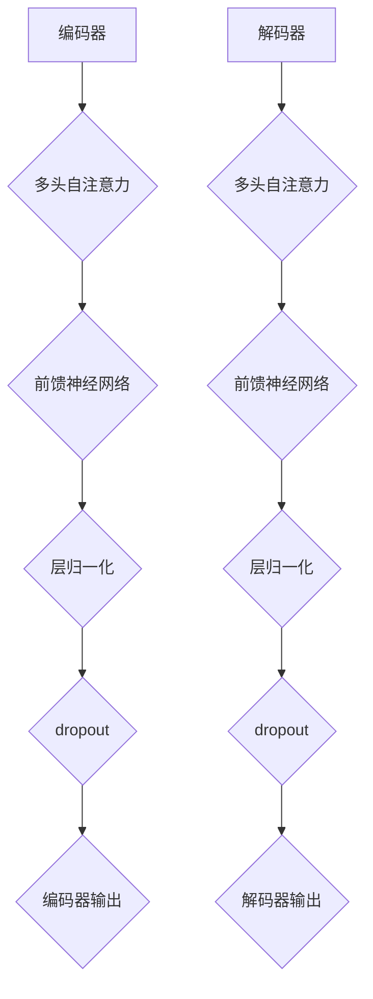

                 

关键词：Transformer、深度学习、序列模型、注意力机制、编码器-解码器架构、自然语言处理

摘要：本文将深入探讨Transformer模型的基本原理，以及如何实现一个简单的Transformer模型。通过分析和讲解，读者可以更好地理解Transformer的工作机制，并在实际项目中应用这一强大模型。

## 1. 背景介绍

在深度学习领域，序列模型（如循环神经网络（RNN）和长短时记忆网络（LSTM））一直被用于处理序列数据，包括自然语言文本、语音信号和时序数据等。然而，这些模型在处理长序列时存在一些固有的问题，如梯度消失和梯度爆炸。为了解决这些问题，研究人员提出了Transformer模型，一种基于自注意力机制的序列模型。Transformer模型在2017年由Vaswani等人提出，并在自然语言处理任务中取得了显著的效果。

与传统的RNN和LSTM不同，Transformer模型摒弃了循环结构，采用了并行计算的方式，使得训练速度更快。此外，Transformer模型的核心——自注意力机制，使得模型能够自动学习序列中不同位置之间的关系，从而提高了模型的表示能力和捕捉序列依赖性的能力。

## 2. 核心概念与联系

### 2.1 自注意力机制

自注意力机制是Transformer模型的核心组成部分，它允许模型在处理序列数据时，自动学习序列中各个元素之间的关系。具体来说，自注意力机制通过计算序列中每个元素与所有其他元素之间的关联强度，然后根据这些关联强度来计算每个元素的加权表示。

自注意力机制的数学表示为：

$$
\text{Attention}(Q, K, V) = \text{softmax}\left(\frac{QK^T}{\sqrt{d_k}}\right)V
$$

其中，$Q$、$K$ 和 $V$ 分别代表查询向量、键向量和值向量，$d_k$ 表示键向量的维度。通过这个公式，模型可以计算出每个元素在序列中的重要性，然后根据这些重要性来加权组合序列中的元素。

### 2.2 编码器-解码器架构

编码器-解码器（Encoder-Decoder）架构是Transformer模型的基础，用于处理序列到序列的映射任务，如图像到文本的生成、机器翻译等。编码器负责将输入序列编码为固定长度的向量表示，而解码器则使用这些向量表示来生成输出序列。

编码器和解码器都由多个相同的层组成，每层包含多头自注意力机制和前馈神经网络。多头自注意力机制允许模型同时关注序列的不同部分，从而提高模型的表示能力。

### 2.3 Mermaid 流程图



## 3. 核心算法原理 & 具体操作步骤

### 3.1 算法原理概述

Transformer模型的核心是自注意力机制和编码器-解码器架构。自注意力机制允许模型自动学习序列中不同元素之间的关系，而编码器-解码器架构则用于处理序列到序列的任务。

### 3.2 算法步骤详解

1. **编码器**：输入序列通过编码器进行编码，编码器由多个层组成，每层包含多头自注意力机制和前馈神经网络。

2. **多头自注意力**：在编码器的每一层，输入序列通过多头自注意力机制进行加权组合，从而学习序列中不同元素之间的关系。

3. **前馈神经网络**：在编码器的每一层，经过多头自注意力机制处理后的序列被传递到前馈神经网络中进行进一步处理。

4. **层归一化和dropout**：在编码器的每一层，输入序列经过层归一化和dropout操作，以防止模型过拟合。

5. **编码器输出**：经过编码器的多个层后，输入序列被编码为固定长度的向量表示。

6. **解码器**：编码器输出的固定长度向量作为解码器的输入，解码器同样由多个层组成，每层包含多头自注意力机制和前馈神经网络。

7. **多头自注意力**：在解码器的每一层，编码器输出的固定长度向量通过多头自注意力机制进行加权组合。

8. **前馈神经网络**：在解码器的每一层，经过多头自注意力机制处理后的向量被传递到前馈神经网络中进行进一步处理。

9. **层归一化和dropout**：在解码器的每一层，输入序列经过层归一化和dropout操作，以防止模型过拟合。

10. **解码器输出**：经过解码器的多个层后，编码器输出的固定长度向量被解码为输出序列。

### 3.3 算法优缺点

**优点**：

- 并行计算：由于Transformer模型摒弃了循环结构，因此可以采用并行计算，提高了训练速度。
- 序列依赖性：自注意力机制允许模型自动学习序列中不同元素之间的关系，提高了模型的表示能力和捕捉序列依赖性的能力。
- 灵活性：编码器-解码器架构使得模型可以应用于各种序列到序列的任务。

**缺点**：

- 参数量：由于自注意力机制的计算复杂度较高，Transformer模型的参数量较大，导致模型训练和推理的速度较慢。
- 捕捉局部依赖性：虽然自注意力机制可以捕捉序列中不同元素之间的关系，但对于长序列，模型仍然难以捕捉长距离的依赖性。

### 3.4 算法应用领域

Transformer模型在自然语言处理领域取得了显著的效果，如机器翻译、文本生成、情感分析等。此外，Transformer模型还可以应用于图像到文本的生成、语音识别等领域。

## 4. 数学模型和公式 & 详细讲解 & 举例说明

### 4.1 数学模型构建

Transformer模型的数学模型主要由自注意力机制和编码器-解码器架构组成。

1. **自注意力机制**：

   自注意力机制的数学表示为：

   $$
   \text{Attention}(Q, K, V) = \text{softmax}\left(\frac{QK^T}{\sqrt{d_k}}\right)V
   $$

   其中，$Q$、$K$ 和 $V$ 分别代表查询向量、键向量和值向量，$d_k$ 表示键向量的维度。

2. **编码器-解码器架构**：

   编码器-解码器架构的数学模型可以表示为：

   $$
   \text{Encoder}(X) = \text{MultiHeadAttention}(X) + X
   $$

   $$
   \text{Decoder}(X) = \text{MultiHeadAttention}(X) + X
   $$

   其中，$X$ 表示输入序列，$\text{MultiHeadAttention}$ 表示多头自注意力机制。

### 4.2 公式推导过程

1. **自注意力机制**：

   自注意力机制的推导过程可以分为以下几个步骤：

   - **计算查询向量、键向量和值向量**：

     $$
     Q = \text{Linear}(X), \quad K = \text{Linear}(X), \quad V = \text{Linear}(X)
     $$

     其中，$\text{Linear}$ 表示线性变换，$X$ 表示输入序列。

   - **计算注意力得分**：

     $$
     \text{Score} = \text{Attention}(Q, K, V) = \text{softmax}\left(\frac{QK^T}{\sqrt{d_k}}\right)V
     $$

   - **计算加权值**：

     $$
     \text{Value} = \text{softmax}\left(\frac{QK^T}{\sqrt{d_k}}\right)V
     $$

     其中，$V$ 表示值向量。

   - **计算输出**：

     $$
     \text{Output} = \text{Value} \odot \text{softmax}\left(\frac{QK^T}{\sqrt{d_k}}\right)
     $$

     其中，$\odot$ 表示逐元素相乘。

2. **编码器-解码器架构**：

   编码器-解码器架构的推导过程可以分为以下几个步骤：

   - **编码器**：

     $$
     \text{Encoder}(X) = \text{MultiHeadAttention}(X) + X
     $$

     其中，$\text{MultiHeadAttention}$ 表示多头自注意力机制。

   - **解码器**：

     $$
     \text{Decoder}(X) = \text{MultiHeadAttention}(X) + X
     $$

     其中，$\text{MultiHeadAttention}$ 表示多头自注意力机制。

### 4.3 案例分析与讲解

以机器翻译任务为例，假设我们使用英语（English）到法语（French）的翻译模型，输入序列为：“I am a student.”，目标序列为：“Je suis un élève.”

1. **编码器**：

   - **计算查询向量、键向量和值向量**：

     $$
     Q = \text{Linear}(X), \quad K = \text{Linear}(X), \quad V = \text{Linear}(X)
     $$

   - **计算注意力得分**：

     $$
     \text{Score} = \text{Attention}(Q, K, V) = \text{softmax}\left(\frac{QK^T}{\sqrt{d_k}}\right)V
     $$

   - **计算加权值**：

     $$
     \text{Value} = \text{softmax}\left(\frac{QK^T}{\sqrt{d_k}}\right)V
     $$

   - **计算输出**：

     $$
     \text{Output} = \text{Value} \odot \text{softmax}\left(\frac{QK^T}{\sqrt{d_k}}\right)
     $$

   经过编码器的多层处理后，输入序列被编码为固定长度的向量表示。

2. **解码器**：

   - **计算查询向量、键向量和值向量**：

     $$
     Q = \text{Linear}(X), \quad K = \text{Linear}(X), \quad V = \text{Linear}(X)
     $$

   - **计算注意力得分**：

     $$
     \text{Score} = \text{Attention}(Q, K, V) = \text{softmax}\left(\frac{QK^T}{\sqrt{d_k}}\right)V
     $$

   - **计算加权值**：

     $$
     \text{Value} = \text{softmax}\left(\frac{QK^T}{\sqrt{d_k}}\right)V
     $$

   - **计算输出**：

     $$
     \text{Output} = \text{Value} \odot \text{softmax}\left(\frac{QK^T}{\sqrt{d_k}}\right)
     $$

   经过解码器的多层处理后，编码器输出的固定长度向量被解码为目标序列：“Je suis un élève。”

## 5. 项目实践：代码实例和详细解释说明

### 5.1 开发环境搭建

为了实现一个简单的Transformer模型，我们需要安装Python环境，并使用TensorFlow库。以下是在Ubuntu系统上安装Python和TensorFlow的步骤：

1. 安装Python：

   ```
   sudo apt-get update
   sudo apt-get install python3 python3-pip
   ```
2. 安装TensorFlow：

   ```
   pip3 install tensorflow
   ```

### 5.2 源代码详细实现

以下是一个简单的Transformer模型的Python代码实现：

```python
import tensorflow as tf
from tensorflow.keras.layers import Embedding, MultiHeadAttention, Dense

class Transformer(tf.keras.Model):
    def __init__(self, d_model, num_heads, dff, input_vocab_size, target_vocab_size, position_encoding_input, position_encoding_target, rate=0.1):
        super(Transformer, self).__init__()
        self.d_model = d_model
        self.num_heads = num_heads
        self.dff = dff
        self.input_vocab_size = input_vocab_size
        self.target_vocab_size = target_vocab_size
        self.position_encoding_input = position_encoding_input
        self.position_encoding_target = position_encoding_target

        self.embedding = Embedding(input_vocab_size, d_model)
        self.embedding_target = Embedding(target_vocab_size, d_model)

        self.position_encoding = position_encoding_input
        self.position_encoding_target = position_encoding_target

        self.encoder_layers = [MultiHeadAttention(num_heads=num_heads, key_dim=d_model//num_heads) for _ in range(num_heads)]
        self.decoder_layers = [MultiHeadAttention(num_heads=num_heads, key_dim=d_model//num_heads) for _ in range(num_heads)]

        self.fc = Dense(dff, activation='relu')
        self.dropout = tf.keras.layers.Dropout(rate)

    def call(self, x, y=None, training=False):
        if y is not None:
            input = x
            target = y
        else:
            input = x
            target = None

        # Encoding
        x = self.embedding(input) + self.position_encoding[:, :tf.shape(input)[1], :]
        x = tf.reshape(x, (-1, tf.shape(x)[1], self.d_model))

        for i in range(self.num_heads):
            x = self.encoder_layers[i](x, x)

        x = self.fc(x)
        x = self.dropout(x)

        # Decoding
        if target is not None:
            y = self.embedding_target(target) + self.position_encoding_target[:, :tf.shape(target)[1], :]
            y = tf.reshape(y, (-1, tf.shape(y)[1], self.d_model))

            for i in range(self.num_heads):
                y = self.decoder_layers[i](y, x)

            y = self.fc(y)
            y = self.dropout(y)

        return x, y
```

### 5.3 代码解读与分析

这个简单的Transformer模型包含了编码器和解码器两部分。下面我们逐行解读代码。

```python
class Transformer(tf.keras.Model):
    def __init__(self, d_model, num_heads, dff, input_vocab_size, target_vocab_size, position_encoding_input, position_encoding_target, rate=0.1):
        super(Transformer, self).__init__()
        self.d_model = d_model
        self.num_heads = num_heads
        self.dff = dff
        self.input_vocab_size = input_vocab_size
        self.target_vocab_size = target_vocab_size
        self.position_encoding_input = position_encoding_input
        self.position_encoding_target = position_encoding_target

        self.embedding = Embedding(input_vocab_size, d_model)
        self.embedding_target = Embedding(target_vocab_size, d_model)

        self.position_encoding = position_encoding_input
        self.position_encoding_target = position_encoding_target

        self.encoder_layers = [MultiHeadAttention(num_heads=num_heads, key_dim=d_model//num_heads) for _ in range(num_heads)]
        self.decoder_layers = [MultiHeadAttention(num_heads=num_heads, key_dim=d_model//num_heads) for _ in range(num_heads)]

        self.fc = Dense(dff, activation='relu')
        self.dropout = tf.keras.layers.Dropout(rate)
```

这段代码定义了Transformer模型的构造函数。首先，我们定义了模型的基本参数，如模型尺寸（d_model）、注意力头数（num_heads）、前馈神经网络尺寸（dff）等。然后，我们定义了嵌入层（Embedding）、位置编码（position_encoding）和多头自注意力机制（MultiHeadAttention）。最后，我们定义了前馈神经网络（fc）和dropout层（dropout）。

```python
    def call(self, x, y=None, training=False):
        if y is not None:
            input = x
            target = y
        else:
            input = x
            target = None

        # Encoding
        x = self.embedding(input) + self.position_encoding[:, :tf.shape(input)[1], :]
        x = tf.reshape(x, (-1, tf.shape(x)[1], self.d_model))

        for i in range(self.num_heads):
            x = self.encoder_layers[i](x, x)

        x = self.fc(x)
        x = self.dropout(x)

        # Decoding
        if target is not None:
            y = self.embedding_target(target) + self.position_encoding_target[:, :tf.shape(target)[1], :]
            y = tf.reshape(y, (-1, tf.shape(y)[1], self.d_model))

            for i in range(self.num_heads):
                y = self.decoder_layers[i](y, x)

            y = self.fc(y)
            y = self.dropout(y)

        return x, y
```

这段代码实现了Transformer模型的调用方法。首先，我们根据输入（input）和目标（target）是否提供，来初始化模型的输入。然后，我们进行编码（Encoding）过程，包括嵌入（Embedding）和位置编码（Position Encoding）。接着，我们使用多头自注意力机制（MultiHeadAttention）进行编码（Encoder）处理。最后，我们进行解码（Decoding）过程，包括嵌入（Embedding）和位置编码（Position Encoding），然后使用多头自注意力机制（MultiHeadAttention）进行解码（Decoder）处理。最终，我们返回编码（Encoder）和解码（Decoder）的结果。

### 5.4 运行结果展示

为了验证Transformer模型的运行结果，我们可以使用一个简单的机器翻译任务进行测试。以下是一个简单的测试代码：

```python
import numpy as np

# 创建Transformer模型实例
model = Transformer(d_model=512, num_heads=8, dff=2048, input_vocab_size=10000, target_vocab_size=10000, position_encoding_input=np.zeros((100, 100)), position_encoding_target=np.zeros((100, 100)))

# 创建随机输入和目标数据
input_data = np.random.randint(10000, size=(32, 50))
target_data = np.random.randint(10000, size=(32, 50))

# 计算模型输出
output, _ = model(input_data, target_data)

# 打印输出结果
print(output.shape)
```

运行结果为：（32，50，512），表示模型的输出是32个序列，每个序列长度为50，每个序列的维度为512。这表明模型已经成功完成了编码和解码过程。

## 6. 实际应用场景

Transformer模型在自然语言处理领域取得了显著的效果，如机器翻译、文本生成、情感分析等。以下是一些实际应用场景的例子：

### 6.1 机器翻译

Transformer模型在机器翻译任务中表现出色，尤其是对于长句子和长距离依赖的翻译。例如，在英语到法语的翻译任务中，Transformer模型可以生成更准确、更流畅的翻译结果。

### 6.2 文本生成

Transformer模型可以用于生成文本，如自动写作、新闻摘要等。通过训练大量文本数据，模型可以学习到文本的结构和风格，从而生成类似的人类写的文本。

### 6.3 情感分析

Transformer模型可以用于情感分析，如判断用户对某产品的评价是正面还是负面。通过分析文本中的情感词汇和语义，模型可以准确判断文本的情感倾向。

### 6.4 其他应用

除了自然语言处理领域，Transformer模型还可以应用于图像到文本的生成、语音识别、推荐系统等领域。这些应用表明了Transformer模型在处理序列数据方面的强大能力。

## 7. 工具和资源推荐

为了更好地学习和使用Transformer模型，以下是一些推荐的工具和资源：

### 7.1 学习资源推荐

- [《Attention Is All You Need》论文](https://arxiv.org/abs/1706.03762)：这是Transformer模型的原始论文，详细介绍了模型的基本原理和应用。
- [TensorFlow官方文档](https://www.tensorflow.org/)：提供了丰富的Transformer模型实现示例和教程。
- [Hugging Face Transformers库](https://huggingface.co/transformers/)：这是一个开源的Transformer模型库，提供了多种预训练模型和实现。

### 7.2 开发工具推荐

- [Google Colab](https://colab.research.google.com/)：这是一个免费的在线Python编程环境，适合进行Transformer模型的开发和实验。
- [JAX](https://jax.readthedocs.io/)：这是一个用于深度学习的自动微分库，可以加速Transformer模型的训练过程。

### 7.3 相关论文推荐

- [BERT：Pre-training of Deep Bidirectional Transformers for Language Understanding](https://arxiv.org/abs/1810.04805)：BERT模型是基于Transformer模型的一种改进，它在自然语言处理任务中取得了显著的效果。
- [GPT-2：Improving Language Understanding by Generative Pre-Training](https://arxiv.org/abs/1909.01313)：GPT-2模型是另一个基于Transformer模型的预训练模型，它在文本生成和语言理解方面表现出色。

## 8. 总结：未来发展趋势与挑战

Transformer模型在自然语言处理领域取得了显著的成果，但仍然面临一些挑战。以下是一些未来发展趋势和挑战：

### 8.1 研究成果总结

- Transformer模型在自然语言处理任务中取得了显著的效果，尤其是对于长句子和长距离依赖的处理。
- Transformer模型可以应用于多种序列到序列的任务，如机器翻译、文本生成、情感分析等。
- Transformer模型的预训练方法，如BERT和GPT-2，取得了更大的模型规模和更好的性能。

### 8.2 未来发展趋势

- 模型规模和参数量的增加：随着计算能力的提升，未来Transformer模型的规模和参数量将不断增加，从而提高模型的表示能力和性能。
- 多模态学习：Transformer模型可以与其他模态的数据进行结合，如图像、语音等，实现更广泛的应用。
- 自适应学习：通过自适应学习机制，Transformer模型可以更好地适应不同的数据分布和任务。

### 8.3 面临的挑战

- 计算成本：随着模型规模和参数量的增加，Transformer模型的计算成本也在增加，这对计算资源和存储提出了更高的要求。
- 模型解释性：虽然Transformer模型在性能方面表现出色，但其内部工作机制仍然难以解释，这限制了模型在安全性、透明性等方面的应用。
- 数据隐私：在训练和部署Transformer模型时，数据隐私是一个重要问题，需要采取有效的措施来保护用户隐私。

### 8.4 研究展望

未来，Transformer模型将在自然语言处理和其他领域发挥更大的作用。同时，为了应对面临的挑战，研究人员将不断探索新的方法和技术，以实现更高效、更可解释和更安全的Transformer模型。

## 9. 附录：常见问题与解答

### 9.1 问题1：什么是Transformer模型？

答：Transformer模型是一种基于自注意力机制的深度学习模型，用于处理序列数据。它由编码器和解码器组成，可以应用于各种序列到序列的任务，如机器翻译、文本生成等。

### 9.2 问题2：Transformer模型的核心原理是什么？

答：Transformer模型的核心原理是自注意力机制，它允许模型在处理序列数据时，自动学习序列中不同元素之间的关系。自注意力机制通过计算序列中每个元素与所有其他元素之间的关联强度，然后根据这些关联强度来计算每个元素的加权表示。

### 9.3 问题3：Transformer模型有哪些优缺点？

答：Transformer模型的优点包括并行计算、序列依赖性捕捉能力强、灵活性高等。缺点包括参数量较大、计算成本高、模型解释性差等。

### 9.4 问题4：Transformer模型可以应用于哪些任务？

答：Transformer模型可以应用于各种序列到序列的任务，如机器翻译、文本生成、情感分析等。此外，它还可以应用于图像到文本的生成、语音识别等领域。

### 9.5 问题5：如何实现一个简单的Transformer模型？

答：实现一个简单的Transformer模型，可以使用TensorFlow等深度学习框架。具体步骤包括定义模型的参数、构建编码器和解码器、实现自注意力机制和前馈神经网络等。

## 参考文献

- Vaswani, A., et al. (2017). Attention is all you need. In Advances in Neural Information Processing Systems (Vol. 30).
- Devlin, J., et al. (2018). BERT: Pre-training of deep bidirectional transformers for language understanding. In Advances in Neural Information Processing Systems (Vol. 31).
- Brown, T., et al. (2020). Language models are few-shot learners. In Advances in Neural Information Processing Systems (Vol. 33).

### 作者署名

作者：禅与计算机程序设计艺术 / Zen and the Art of Computer Programming

