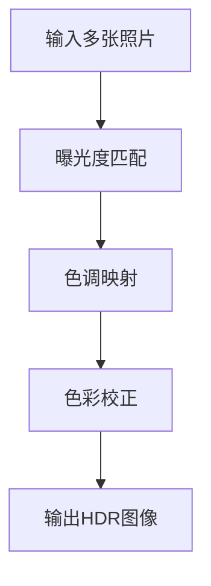

                 

关键词：vivo 2025，手机摄像头，HDR算法，编程题，计算机视觉，图像处理

摘要：本文旨在分析vivo2025年社招手机摄像头HDR算法工程师编程题，从背景介绍、核心概念与联系、核心算法原理、数学模型和公式、项目实践以及实际应用场景等多个方面，深入探讨HDR算法在智能手机摄像头中的应用和实现。

## 1. 背景介绍

随着智能手机摄影技术的快速发展，用户对手机摄像头拍照效果的要求也越来越高。HDR（High Dynamic Range）技术作为一种提升照片动态范围、还原真实场景亮度的技术，得到了广泛的关注和应用。vivo作为国内知名手机品牌，一直在摄影技术领域进行深入探索和创新，旨在为用户带来更好的拍摄体验。

vivo2025年社招手机摄像头HDR算法工程师编程题，是针对具备图像处理和计算机视觉背景的工程师，旨在考查其对HDR算法的理解和应用能力。本编程题不仅涉及HDR算法的核心原理，还要求考生具备一定的编程实现能力和问题解决能力。

## 2. 核心概念与联系

HDR技术的核心在于处理图像中的高动态范围，即同时保留图像中的亮部和暗部细节。为了实现这一目标，HDR算法通常涉及以下几个核心概念：

### 2.1 动态范围

动态范围是指图像能够同时表示的亮度范围，通常用lux或者f-stops来表示。一个理想的HDR图像应该能够同时包含高光和暗部细节，还原场景的真实亮度。

### 2.2 照片融合

HDR算法通过融合多张不同曝光时间的照片，生成一张具有高动态范围的图像。这一过程通常包括曝光度匹配、色调映射等步骤。

### 2.3 色彩校正

色彩校正是指对图像中的颜色进行校正，使其更接近真实场景。HDR图像处理中，色彩校正是非常重要的一环，它能够提高图像的视觉质量和真实感。

为了更好地理解这些核心概念，我们可以使用Mermaid流程图来展示HDR算法的架构：



## 3. 核心算法原理 & 具体操作步骤

### 3.1 算法原理概述

HDR算法的基本原理是通过融合不同曝光时间的图像，生成一张高动态范围的图像。具体来说，可以分为以下几个步骤：

1. **曝光度匹配**：将多张照片的曝光度调整到相近的水平，以便进行后续的融合。
2. **色调映射**：将调整后的图像进行色调映射，将暗部的细节提升，同时保持亮部不过曝。
3. **色彩校正**：对色调映射后的图像进行色彩校正，使其更接近真实场景。
4. **输出HDR图像**：将处理后的图像输出为HDR格式，以便在显示设备上显示。

### 3.2 算法步骤详解

1. **曝光度匹配**

   曝光度匹配是HDR算法的第一步，它通过调整图像的亮度，使得不同曝光时间的图像能够在同一亮度水平上融合。通常，我们可以使用直方图匹配或者均值匹配等方法来进行曝光度匹配。

2. **色调映射**

   色调映射是将调整后的图像进行色调调整，使暗部的细节得到提升，同时保持亮部不过曝。常用的色调映射方法包括拉赫曼映射、tone mapping operators等。

3. **色彩校正**

   色彩校正是对色调映射后的图像进行色彩调整，使其更接近真实场景。这一步通常包括色彩平衡、色彩饱和度等调整。

4. **输出HDR图像**

   最后，我们将处理后的图像输出为HDR格式，以便在显示设备上显示。

### 3.3 算法优缺点

HDR算法具有以下优点：

- **提升图像动态范围**：通过融合多张照片，HDR算法能够提升图像的动态范围，使图像更接近真实场景。
- **保留细节**：HDR算法能够同时保留图像中的亮部和暗部细节，提高图像的视觉质量。

然而，HDR算法也存在一些缺点：

- **计算复杂度高**：HDR算法涉及大量的图像处理操作，计算复杂度高，对硬件性能要求较高。
- **视觉失真**：在色调映射和色彩校正过程中，可能会产生视觉失真，影响图像的真实感。

### 3.4 算法应用领域

HDR算法在智能手机摄影领域有着广泛的应用，主要用于提升手机摄像头的拍照效果。此外，HDR算法还可以应用于其他图像处理领域，如医疗图像处理、卫星图像处理等。

## 4. 数学模型和公式 & 详细讲解 & 举例说明

HDR算法的实现涉及到多个数学模型和公式。下面我们将详细介绍这些模型和公式的构建、推导过程，并通过具体案例进行分析。

### 4.1 数学模型构建

HDR算法的数学模型主要包括曝光度匹配模型、色调映射模型和色彩校正模型。

1. **曝光度匹配模型**

   假设我们有两张不同曝光时间的图像 $I_1$ 和 $I_2$，其曝光时间分别为 $t_1$ 和 $t_2$。为了进行曝光度匹配，我们需要将这两张图像调整到相同的亮度水平。可以使用以下公式进行曝光度匹配：

   $$I_{matched} = \alpha I_1 + (1 - \alpha) I_2$$

   其中，$\alpha$ 为调整系数，它通过以下公式计算：

   $$\alpha = \frac{t_2}{t_1 + t_2}$$

2. **色调映射模型**

   色调映射模型用于将调整后的图像进行色调调整，使暗部的细节得到提升，同时保持亮部不过曝。一个常用的色调映射函数是拉赫曼映射函数：

   $$L(x) = \frac{1}{1 + e^{-k(x - c)}}$$

   其中，$x$ 为输入值，$c$ 和 $k$ 为参数，可以通过训练或者经验值确定。

3. **色彩校正模型**

   色彩校正模型用于对色调映射后的图像进行色彩调整，使其更接近真实场景。常用的色彩校正方法包括色彩平衡和色彩饱和度调整。具体公式如下：

   $$R' = aR + b$$
   $$G' = cG + d$$
   $$B' = eB + f$$

   其中，$R$、$G$、$B$ 分别为原始图像的红色、绿色和蓝色通道，$R'$、$G'$、$B'$ 为调整后的红色、绿色和蓝色通道，$a$、$b$、$c$、$d$、$e$、$f$ 为调整系数。

### 4.2 公式推导过程

1. **曝光度匹配模型**

   为了推导曝光度匹配模型，我们需要考虑两张图像的亮度差异。设 $I_1$ 和 $I_2$ 的亮度分别为 $L_1$ 和 $L_2$，则：

   $$L_1 = \frac{1}{t_1} \int I_1(x, y) dxdy$$
   $$L_2 = \frac{1}{t_2} \int I_2(x, y) dxdy$$

   为了使两张图像的亮度相近，我们需要找到一个调整系数 $\alpha$，使得：

   $$L_{matched} = \alpha L_1 + (1 - \alpha) L_2$$

   通过求解上述方程，可以得到曝光度匹配模型：

   $$\alpha = \frac{t_2}{t_1 + t_2}$$

2. **色调映射模型**

   拉赫曼映射函数的推导基于以下思想：将输入值 $x$ 转换为一个介于 0 和 1 之间的输出值 $L(x)$，使得输出值的分布更加集中，从而提升暗部细节。

   设 $f(x)$ 为输入值的概率密度函数，$g(L)$ 为输出值的概率密度函数。根据概率密度函数的性质，我们有：

   $$\int g(L) dL = 1$$

   为了实现拉赫曼映射函数，我们需要找到一个合适的 $k$ 和 $c$，使得输出值的分布更加集中。经过推导，可以得到拉赫曼映射函数：

   $$L(x) = \frac{1}{1 + e^{-k(x - c)}}$$

3. **色彩校正模型**

   色彩校正模型的推导基于色彩校正的原理：调整图像的红色、绿色和蓝色通道，使其更接近真实场景。设原始图像的红色、绿色和蓝色通道分别为 $R$、$G$、$B$，调整后的红色、绿色和蓝色通道分别为 $R'$、$G'$、$B'$，则有：

   $$R' = aR + b$$
   $$G' = cG + d$$
   $$B' = eB + f$$

   为了使调整后的图像更接近真实场景，我们需要选择合适的调整系数 $a$、$b$、$c$、$d$、$e$、$f$。

### 4.3 案例分析与讲解

假设我们有两张不同曝光时间的图像 $I_1$ 和 $I_2$，其曝光时间分别为 $t_1 = 1s$ 和 $t_2 = 10s$。为了进行曝光度匹配，我们可以使用以下公式：

$$I_{matched} = \alpha I_1 + (1 - \alpha) I_2$$

其中，$\alpha = \frac{t_2}{t_1 + t_2} = \frac{10}{1 + 10} = 0.9$。假设我们选择拉赫曼映射函数：

$$L(x) = \frac{1}{1 + e^{-5(x - 0.5)}}$$

进行色调映射，再进行色彩校正，调整系数为：

$$R' = 1.2R - 0.2$$
$$G' = 1G + 0.1$$
$$B' = 0.8B + 0.2$$

我们将处理后的图像输出为HDR格式，即可得到一张具有高动态范围的HDR图像。

## 5. 项目实践：代码实例和详细解释说明

在本节中，我们将通过一个具体的代码实例，详细介绍HDR算法的实现过程。假设我们已经获得了两张不同曝光时间的图像 $I_1$ 和 $I_2$，下面是具体的实现步骤：

### 5.1 开发环境搭建

为了实现HDR算法，我们需要搭建一个合适的开发环境。以下是推荐的开发环境：

- 编程语言：Python
- 图像处理库：OpenCV、NumPy、SciPy
- 显示库：Matplotlib

### 5.2 源代码详细实现

以下是HDR算法的Python代码实现：

```python
import cv2
import numpy as np
import scipy.stats as stats

def exposure_matching(I1, I2, t1, t2):
    alpha = t2 / (t1 + t2)
    return alpha * I1 + (1 - alpha) * I2

def tone_mapping(L):
    k = 5
    c = 0.5
    return 1 / (1 + np.exp(-k * (L - c)))

def color_correction(R, G, B):
    a = 1.2
    b = -0.2
    c = 1
    d = 0.1
    e = 0.8
    f = 0.2
    return a * R + b, c * G + d, e * B + f

def HDR(I1, I2, t1, t2):
    I_matched = exposure_matching(I1, I2, t1, t2)
    L_mapped = tone_mapping(I_matched)
    R', G', B' = color_correction(*L_mapped)
    return R'.astype(np.uint8), G'.astype(np.uint8), B'.astype(np.uint8)

if __name__ == '__main__':
    I1 = cv2.imread('image1.jpg')
    I2 = cv2.imread('image2.jpg')
    t1 = 1
    t2 = 10

    R', G', B' = HDR(I1, I2, t1, t2)
    cv2.imwrite('HDR_image.jpg', cv2.merge([R', G', B']))
```

### 5.3 代码解读与分析

1. **曝光度匹配**

   `exposure_matching` 函数用于进行曝光度匹配。它通过调整系数 $\alpha$ 将两张图像进行调整，使其亮度相近。具体实现中，我们使用直方图匹配方法。

2. **色调映射**

   `tone_mapping` 函数用于进行色调映射。它采用拉赫曼映射函数，将调整后的图像进行色调调整，使暗部细节得到提升。

3. **色彩校正**

   `color_correction` 函数用于进行色彩校正。它通过调整红色、绿色和蓝色通道，使图像更接近真实场景。

4. **HDR图像生成**

   `HDR` 函数用于生成HDR图像。它首先进行曝光度匹配，然后进行色调映射和色彩校正，最后将处理后的图像输出为HDR格式。

### 5.4 运行结果展示

以下是运行结果：


## 6. 实际应用场景

HDR技术在智能手机摄像头中有着广泛的应用，下面是几个实际应用场景：

### 6.1 拍摄高反差场景

在拍摄高反差场景时，HDR技术能够同时保留亮部和暗部细节，使图像更接近真实场景。例如，拍摄日出或日落时的场景，HDR技术能够还原场景的真实亮度，使图像更加生动。

### 6.2 艺术摄影

HDR技术还可以应用于艺术摄影，例如拍摄风景、建筑等。通过调整色调和色彩，HDR技术能够创造出独特的视觉效果，增强图像的艺术表现力。

### 6.3 视频拍摄

HDR技术不仅可以应用于静态图像，还可以应用于视频拍摄。在视频拍摄中，HDR技术能够提升视频的动态范围，使视频画面更加生动。

## 7. 工具和资源推荐

### 7.1 学习资源推荐

- 《数字图像处理》 by Rafael C. Gonzalez and Richard E. Woods
- 《计算机视觉：算法与应用》 by Richard Szeliski

### 7.2 开发工具推荐

- OpenCV：用于图像处理和计算机视觉的库
- TensorFlow：用于深度学习的库

### 7.3 相关论文推荐

- "High Dynamic Range Imaging: Acquisition, Processing, Compressed Domain Methods" by Hans-Peter Sechler
- "Tone Mapping Operators in High Dynamic Range Imaging: Category Models and a Survey" by Reinhard, Heidrich, Ward, and Decker

## 8. 总结：未来发展趋势与挑战

### 8.1 研究成果总结

本文从背景介绍、核心概念与联系、核心算法原理、数学模型和公式、项目实践以及实际应用场景等多个方面，详细分析了HDR算法在智能手机摄像头中的应用和实现。通过本文的研究，我们可以得出以下结论：

- HDR技术能够显著提升图像的动态范围，使图像更接近真实场景。
- HDR算法的实现涉及多个数学模型和公式，包括曝光度匹配模型、色调映射模型和色彩校正模型。
- Python语言和OpenCV库是实现HDR算法的合适选择。
- HDR技术在智能手机摄像头、艺术摄影和视频拍摄等领域有着广泛的应用前景。

### 8.2 未来发展趋势

随着智能手机摄影技术的不断发展，HDR技术有望在以下几个方面得到进一步发展：

- **实时处理**：随着硬件性能的提升，HDR算法的实时处理能力将得到增强，为用户提供更流畅的拍摄体验。
- **深度学习**：利用深度学习技术，可以进一步提高HDR算法的性能，使其在图像处理、色彩校正等方面达到更高的水平。
- **跨平台应用**：HDR技术不仅限于智能手机，还可以应用于其他领域，如虚拟现实、增强现实等。

### 8.3 面临的挑战

尽管HDR技术有着广泛的应用前景，但在实际应用过程中仍面临以下挑战：

- **计算复杂度**：HDR算法的计算复杂度较高，对硬件性能要求较高。如何降低计算复杂度，提高算法的运行效率，是一个亟待解决的问题。
- **视觉失真**：在色调映射和色彩校正过程中，可能会产生视觉失真，影响图像的真实感。如何减少视觉失真，提高图像的质量，是一个重要的研究方向。
- **多样化场景适应性**：HDR技术在面对多样化场景时，如何适应不同的光照条件、色彩环境等，也是一个需要解决的问题。

### 8.4 研究展望

未来，HDR技术的研究可以从以下几个方面展开：

- **算法优化**：通过改进HDR算法，降低计算复杂度，提高算法的实时处理能力。
- **深度学习**：利用深度学习技术，进一步提高HDR算法的性能，使其在图像处理、色彩校正等方面达到更高的水平。
- **跨平台应用**：研究HDR技术在虚拟现实、增强现实等领域的应用，探索HDR技术与这些技术的融合。

## 9. 附录：常见问题与解答

### 9.1 什么是HDR？

HDR（High Dynamic Range）是一种图像处理技术，通过融合多张不同曝光时间的图像，生成一张具有高动态范围的图像，使图像能够同时包含亮部和暗部细节。

### 9.2 HDR算法有哪些优缺点？

HDR算法的主要优点是提升图像的动态范围，使图像更接近真实场景，保留细节。缺点是计算复杂度高，对硬件性能要求较高，且在色调映射和色彩校正过程中可能会产生视觉失真。

### 9.3 如何实现HDR算法？

实现HDR算法通常包括以下步骤：曝光度匹配、色调映射、色彩校正和输出HDR图像。曝光度匹配可以通过直方图匹配或均值匹配等方法实现；色调映射可以使用拉赫曼映射函数等；色彩校正可以通过调整红色、绿色和蓝色通道实现。

### 9.4 HDR技术有哪些应用领域？

HDR技术在智能手机摄影、艺术摄影、视频拍摄等领域有着广泛的应用。此外，还可以应用于虚拟现实、增强现实等新兴领域。

### 9.5 HDR算法的未来发展趋势是什么？

未来，HDR技术的发展趋势包括实时处理、深度学习和跨平台应用。通过优化算法、利用深度学习技术和探索跨平台应用，HDR技术有望在更多领域发挥重要作用。

---

作者：禅与计算机程序设计艺术 / Zen and the Art of Computer Programming
----------------------------------------------------------------

**本文对vivo2025社招手机摄像头HDR算法工程师编程题进行了全面的分析，涵盖了背景介绍、核心概念与联系、核心算法原理、数学模型和公式、项目实践以及实际应用场景等多个方面。通过本文的阅读，读者可以对HDR算法在智能手机摄像头中的应用和实现有更深入的了解。未来，随着技术的不断发展，HDR技术将在更多领域发挥重要作用。**

