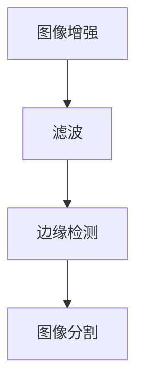
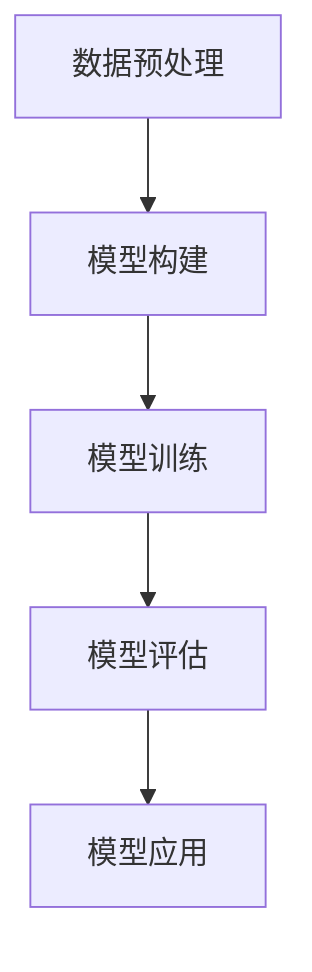
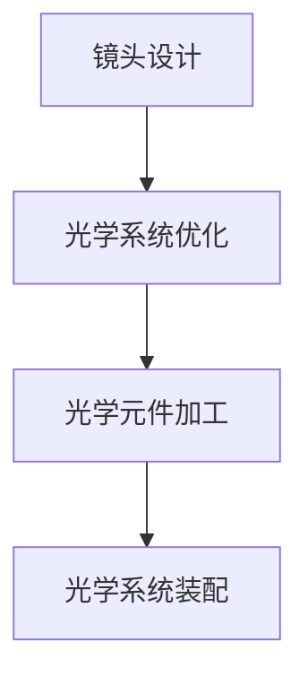

                 

关键词：vivo，计算摄影，2025，社招，面试指南，技术要求，职业发展，算法原理，数学模型，项目实践，应用场景，工具推荐，未来展望

> 摘要：本文旨在为vivo2025计算摄影工程师的社招面试提供详细的指南，从背景介绍、核心概念、算法原理、数学模型、项目实践、应用场景、工具推荐到未来展望，全面解析计算摄影领域的最新技术要求和职业发展趋势。

## 1. 背景介绍

随着智能手机的普及和技术的不断进步，计算摄影已经成为摄影领域的重要研究方向。vivo作为领先的智能手机制造商，持续在计算摄影领域进行深度探索和创新，为用户提供卓越的拍照体验。2025年，vivo将推出一系列全新的计算摄影技术，吸引大量优秀人才加入研发团队。本文将围绕vivo2025计算摄影工程师社招面试，全面解析相关技术和职业发展要求。

### 1.1 计算摄影的发展历程

计算摄影的概念起源于数字图像处理技术，随着计算机技术和图像处理算法的不断发展，计算摄影逐渐成为摄影领域的一个重要分支。从最初的数字图像处理到现代的计算摄影，经历了以下几个重要阶段：

- **数字图像处理阶段**：主要研究如何利用计算机对图像进行增强、滤波、分割等处理。
- **图像融合阶段**：通过多幅图像的融合，提高图像的清晰度和细节。
- **计算成像阶段**：利用计算模型和算法对光线进行精确控制，实现更高质量的成像效果。
- **智能计算摄影阶段**：结合人工智能技术，实现自适应场景识别、智能优化等功能，进一步提升拍照体验。

### 1.2 vivo计算摄影技术的特点

vivo在计算摄影领域不断探索，推出了一系列具有独特特点的技术，如超清夜景、超级HDR、人像模式等。以下为vivo计算摄影技术的几个主要特点：

- **超清夜景**：通过多帧合成和HDR技术，在低光环境下实现清晰、亮丽的夜景照片。
- **超级HDR**：对高动态范围场景进行精确处理，提升照片的亮度和细节。
- **人像模式**：利用深度传感器和人工智能算法，实现精准的人像抠图和背景虚化。

## 2. 核心概念与联系

计算摄影的核心概念包括图像处理算法、深度学习模型、光学设计等。以下将详细阐述这些核心概念及其相互联系，并使用Mermaid流程图进行说明。

### 2.1 图像处理算法

图像处理算法是计算摄影的基础，包括图像增强、滤波、边缘检测等。以下为图像处理算法的主要步骤：

1. **图像增强**：通过对比度调整、亮度优化等手段，提升图像的视觉效果。
2. **滤波**：使用各种滤波器去除图像中的噪声，提高图像质量。
3. **边缘检测**：检测图像中的边缘信息，为后续图像处理提供参考。
4. **图像分割**：将图像分为多个区域，用于后续处理。



### 2.2 深度学习模型

深度学习模型在计算摄影中具有广泛应用，如人脸识别、场景识别等。以下为深度学习模型的主要步骤：

1. **数据预处理**：对输入数据进行归一化、去噪等处理。
2. **模型构建**：使用神经网络结构进行模型构建，如卷积神经网络（CNN）。
3. **模型训练**：使用大量训练数据对模型进行训练，优化模型参数。
4. **模型评估**：使用测试数据对模型进行评估，调整模型参数。
5. **模型应用**：将训练好的模型应用到实际场景中。



### 2.3 光学设计

光学设计是计算摄影的关键，影响图像的清晰度、对比度和色彩还原。以下为光学设计的主要步骤：

1. **镜头设计**：根据成像需求和光学原理，设计镜头结构和材料。
2. **光学系统优化**：通过光学仿真和实验，优化光学系统的性能。
3. **光学元件加工**：加工光学元件，如透镜、滤光片等。
4. **光学系统装配**：将光学元件组装成完整的成像系统。



## 3. 核心算法原理 & 具体操作步骤

### 3.1 算法原理概述

计算摄影的核心算法主要包括图像处理算法和深度学习模型。图像处理算法负责对图像进行预处理、增强、滤波等操作，以提高图像质量。深度学习模型则负责场景识别、人脸检测、人像抠图等功能。

### 3.2 算法步骤详解

1. **图像预处理**：对输入图像进行去噪、增强、对比度调整等操作，以提升图像质量。
2. **图像增强**：使用各种图像增强技术，如对比度增强、亮度调整等，使图像更加清晰。
3. **图像滤波**：使用滤波器去除图像中的噪声，提高图像的清晰度。
4. **边缘检测**：使用边缘检测算法，提取图像中的边缘信息。
5. **图像分割**：将图像分割为多个区域，为后续处理提供基础。
6. **场景识别**：使用深度学习模型，对图像场景进行识别，为图像处理提供指导。
7. **人脸检测**：使用深度学习模型，检测图像中的人脸位置。
8. **人像抠图**：根据人脸检测结果，对图像中的人像进行抠图，实现背景虚化。
9. **图像合成**：将处理后的图像与其他图像进行合成，实现多种效果。

### 3.3 算法优缺点

- **图像处理算法**：优点在于简单易懂、计算效率高；缺点在于处理效果有限，难以应对复杂场景。
- **深度学习模型**：优点在于处理效果优秀、适应性强；缺点在于训练时间较长、计算资源需求高。

### 3.4 算法应用领域

计算摄影算法广泛应用于智能手机、摄像头、虚拟现实等领域，以下为几个典型应用：

- **智能手机**：通过计算摄影技术，提升手机拍照效果，满足用户需求。
- **摄像头**：在安防、监控等领域，利用计算摄影技术实现更高清晰度、更精准的图像识别。
- **虚拟现实**：通过计算摄影技术，实现虚拟场景与现实场景的融合，提升用户体验。

## 4. 数学模型和公式 & 详细讲解 & 举例说明

计算摄影中的数学模型和公式对于理解算法原理和实现应用具有重要意义。以下将详细介绍计算摄影中的数学模型和公式，并通过具体例子进行说明。

### 4.1 数学模型构建

计算摄影中的数学模型主要包括图像处理模型和深度学习模型。以下为两个模型的构建过程：

1. **图像处理模型**：

   - **图像增强模型**：
     $$ g(x, y) = \alpha \cdot f(x, y) + (1 - \alpha) \cdot I_0(x, y) $$
     其中，\( g(x, y) \) 为增强后的图像，\( f(x, y) \) 为原始图像，\( I_0(x, y) \) 为参考图像，\( \alpha \) 为调整系数。
     
   - **图像滤波模型**：
     $$ g(x, y) = \sum_{i, j} w_{i, j} \cdot f(x - i, y - j) $$
     其中，\( g(x, y) \) 为滤波后的图像，\( w_{i, j} \) 为滤波器系数，\( f(x, y) \) 为原始图像。

2. **深度学习模型**：

   - **卷积神经网络（CNN）模型**：
     $$ \text{CNN} = \text{Conv} \stackrel{\text{ReLU}}{\rightarrow} \text{Pool} \stackrel{\text{ReLU}}{\rightarrow} \cdots \stackrel{\text{ReLU}}{\rightarrow} \text{FC} $$
     其中，\( \text{Conv} \) 为卷积层，\( \text{ReLU} \) 为激活函数，\( \text{Pool} \) 为池化层，\( \text{FC} \) 为全连接层。

### 4.2 公式推导过程

以下为图像增强模型和卷积神经网络模型的推导过程：

1. **图像增强模型**：

   - **目标函数**：
     $$ L(g, f, I_0) = \frac{1}{2} \cdot \sum_{x, y} \left[ g(x, y) - f(x, y) \right]^2 + \frac{1}{2} \cdot \sum_{x, y} \left[ g(x, y) - I_0(x, y) \right]^2 $$
     
   - **梯度下降**：
     $$ \frac{\partial L}{\partial g} = \alpha \cdot \frac{\partial L}{\partial f} + (1 - \alpha) \cdot \frac{\partial L}{\partial I_0} $$
     
   - **优化目标**：
     $$ \min_{g} L(g, f, I_0) $$
     
2. **卷积神经网络模型**：

   - **卷积层**：
     $$ (f_{k}^{l+1})(i, j) = \sum_{p, q} w_{k, p, q} \cdot f^{l}(i - p, j - q) + b_k $$
     
   - **池化层**：
     $$ p_{k}^{l+1}(i, j) = \max_{u, v} f_{k}^{l+1}(i - u, j - v) $$
     
   - **全连接层**：
     $$ z_k^{l+1} = \sum_{i, j} w_{k, i, j} \cdot p_{k}^{l+1}(i, j) + b_k $$
     $$ \hat{y}^{l+1} = \sigma(z_k^{l+1}) $$

### 4.3 案例分析与讲解

以下为计算摄影中的两个案例分析和讲解：

1. **超清夜景**：

   - **案例背景**：在低光环境下，传统相机难以拍摄清晰、亮丽的照片。超清夜景技术通过多帧合成和HDR技术，实现低光环境下的高质量成像。
   
   - **数学模型**：
     $$ g(x, y) = \alpha \cdot f(x, y) + (1 - \alpha) \cdot I_0(x, y) $$
     其中，\( g(x, y) \) 为合成后的图像，\( f(x, y) \) 为原始图像，\( I_0(x, y) \) 为参考图像，\( \alpha \) 为调整系数。

2. **人像模式**：

   - **案例背景**：在人像拍摄中，用户希望实现背景虚化、突出人物的效果。人像模式通过深度学习模型和图像处理算法，实现精准的人像抠图和背景虚化。

   - **数学模型**：
     $$ \text{CNN} = \text{Conv} \stackrel{\text{ReLU}}{\rightarrow} \text{Pool} \stackrel{\text{ReLU}}{\rightarrow} \cdots \stackrel{\text{ReLU}}{\rightarrow} \text{FC} $$
     其中，\( \text{CNN} \) 为卷积神经网络模型，用于人脸检测和抠图。

## 5. 项目实践：代码实例和详细解释说明

### 5.1 开发环境搭建

在开始计算摄影项目的实践之前，需要搭建合适的开发环境。以下是开发环境的搭建步骤：

1. **安装Python**：Python是计算摄影项目的主要编程语言，需要安装Python 3.x版本。
2. **安装深度学习框架**：常用的深度学习框架有TensorFlow、PyTorch等，根据项目需求选择合适的框架。
3. **安装图像处理库**：如OpenCV、Pillow等，用于图像处理和增强。
4. **配置GPU支持**：如果项目使用GPU进行计算，需要安装CUDA和cuDNN，以支持GPU加速。

### 5.2 源代码详细实现

以下是一个简单的计算摄影项目示例，使用深度学习模型进行人像抠图。

```python
import cv2
import numpy as np
import tensorflow as tf

# 载入预训练的人像抠图模型
model = tf.keras.models.load_model('h

