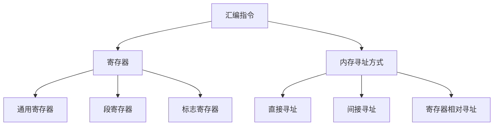

                 

关键词：x86汇编语言、高级编程、编程技巧、汇编指令、优化、系统架构、汇编工具

## 摘要

本文将深入探讨x86汇编语言的高级编程技巧，旨在为程序员提供一种更深入理解计算机系统底层工作的方法。我们将从汇编语言的基础知识出发，逐步介绍汇编指令的优化、系统架构的理解，以及汇编语言在实际项目中的应用。通过本文，读者将学会如何利用汇编语言提高程序的执行效率，优化系统性能，并了解其在现代计算机系统中的重要性和应用场景。

## 1. 背景介绍

x86汇编语言是一种低级编程语言，用于直接操作计算机的硬件资源。它的历史悠久，可以追溯到上世纪70年代的Intel 8086处理器。x86汇编语言以其强大的灵活性和高效的性能，一直被广泛应用于操作系统开发、嵌入式系统、游戏开发等领域。

尽管现代高级编程语言如C、C++等在易用性和开发效率方面有着显著的优势，但在某些特定场景下，汇编语言仍然具有不可替代的作用。首先，汇编语言允许程序员对硬件进行精细控制，实现一些高级编程语言难以达到的功能。其次，汇编语言编写的程序往往具有更高的执行效率，特别是在处理密集型计算和系统优化方面。

然而，汇编语言的编程难度较高，需要程序员具备深厚的计算机硬件知识和编程技巧。因此，掌握汇编语言的高级编程技巧对于提升程序员的技术水平具有重要意义。

## 2. 核心概念与联系

在深入探讨x86汇编语言的高级编程技巧之前，我们需要了解一些核心概念，包括汇编指令、寄存器、内存寻址方式等。这些概念是理解和应用汇编语言的基础。

### 2.1 汇编指令

汇编指令是汇编语言的核心，用于执行各种操作。常见的汇编指令包括数据传送指令、算术指令、逻辑指令、控制指令等。每个指令由操作码和操作数组成，操作码表示指令要执行的操作，操作数表示操作的数据。

例如，`MOV AX, BX`指令将寄存器BX的值传送到寄存器AX中。这个指令的操作码是`MOV`，表示数据传送操作，操作数是AX和BX，分别表示源寄存器和目标寄存器。

### 2.2 寄存器

寄存器是计算机处理器内部的高速存储单元，用于暂存数据和指令。x86架构的处理器有多种寄存器，包括通用寄存器、段寄存器、标志寄存器等。

通用寄存器（如AX、BX、CX、DX）主要用于数据传输和计算。段寄存器（如CS、DS、ES、SS）用于指向不同的内存段。标志寄存器（如EFLAGS）用于存储处理器的状态信息。

### 2.3 内存寻址方式

内存寻址方式是汇编语言中的一个重要概念，用于确定操作数的内存位置。x86汇编语言支持多种内存寻址方式，包括直接寻址、间接寻址、寄存器相对寻址等。

直接寻址通过给出操作数的内存地址来访问数据，例如`MOV AX, [0300h]`指令将内存地址为0300h的值传送到寄存器AX中。

间接寻址通过寄存器或内存地址来间接访问操作数，例如`MOV AX, DS:[BX]`指令将DS段中由BX寄存器指向的内存地址的值传送到寄存器AX中。

寄存器相对寻址通过寄存器和一个偏移量来计算操作数的内存地址，例如`MOV AX, [SI + 10h]`指令将SI寄存器值加10h后的内存地址的值传送到寄存器AX中。

### 2.4 Mermaid 流程图

以下是一个简单的Mermaid流程图，展示了汇编语言核心概念之间的联系：



通过这个流程图，我们可以更直观地理解汇编语言的核心概念及其相互关系。

## 3. 核心算法原理 & 具体操作步骤

### 3.1 算法原理概述

在汇编语言编程中，算法原理的掌握至关重要。算法原理涉及到对计算机硬件操作的深入理解，以及如何通过汇编指令实现特定的算法。

一个典型的算法原理例子是快速排序算法。在汇编语言中，我们可以通过递归调用和循环结构来实现快速排序。算法的核心在于划分和排序两个步骤。划分步骤将数组分为两个子数组，排序步骤则分别对两个子数组进行快速排序。

### 3.2 算法步骤详解

以下是一个简单的快速排序算法的实现步骤：

1. **选择基准元素**：在数组中选取一个基准元素，通常选择数组的最后一个元素作为基准。
2. **划分**：将数组中小于基准元素的元素移到左侧，大于基准元素的元素移到右侧。这个过程可以通过一个指针或两个指针来实现。
3. **递归排序**：对划分后的左右两个子数组分别递归执行快速排序算法。
4. **循环结构**：使用循环结构来实现递归调用，直到所有子数组的长度小于1，此时递归结束。

### 3.3 算法优缺点

快速排序算法具有以下优点：

- **高效**：平均时间复杂度为O(nlogn)，在最坏情况下也为O(nlogn)。
- **稳定性**：相对稳定的排序算法，相同值的元素在排序后不会改变顺序。

快速排序算法的缺点包括：

- **递归深度**：由于递归调用，导致栈空间占用较大，可能导致栈溢出。
- **不稳定性**：在某些特定情况下，快速排序可能表现出不稳定的行为。

### 3.4 算法应用领域

快速排序算法广泛应用于各种场景，包括：

- **数据处理**：在处理大量数据的排序时，快速排序算法是一个高效的选择。
- **数据库索引**：数据库系统中的索引排序通常采用快速排序算法。
- **文件排序**：在文件系统中，快速排序算法用于对文件进行排序。

## 4. 数学模型和公式 & 详细讲解 & 举例说明

### 4.1 数学模型构建

在汇编语言编程中，数学模型的构建至关重要。一个典型的例子是二分查找算法。二分查找算法基于数学中的二分法思想，通过不断地将数组分为两部分，逐步缩小查找范围，直到找到目标元素或确定元素不存在。

### 4.2 公式推导过程

二分查找算法的关键在于确定每次查找的中间位置。假设数组为`A[0...n-1]`，当前查找范围为`low`到`high`，中间位置的公式为：

\[ mid = \left\lfloor \frac{low + high}{2} \right\rfloor \]

### 4.3 案例分析与讲解

以下是一个简单的二分查找算法的实现示例：

```assembly
section .data
array db 1, 3, 5, 7, 9, 11, 13, 15
target db 7
length equ 8

section .text
global _start

_start:
    mov eax, 0          ; low
    mov ebx, length - 1 ; high
    mov ecx, [target]   ; target value

search_loop:
    cmp eax, ebx
    jge not_found       ; exit if low > high

    mov edx, eax
    add edx, ebx
    shr edx, 1          ; calculate mid
    mov esi, edx        ; mid

    movzx edx, byte [array + esi]
    cmp edx, ecx
    je found
    jl search_left
    jg search_right

search_left:
    inc eax
    jmp search_loop

search_right:
    dec ebx
    jmp search_loop

found:
    ; handle found case
    ; ...

not_found:
    ; handle not found case
    ; ...

exit:
    mov eax, 1
    xor ebx, ebx
    int 0x80
```

在这个例子中，我们使用循环结构来实现二分查找算法。通过不断地计算中间位置，并与目标值进行比较，逐步缩小查找范围，直到找到目标元素或确定元素不存在。

## 5. 项目实践：代码实例和详细解释说明

### 5.1 开发环境搭建

要在Windows或Linux系统上开发汇编语言程序，我们需要安装合适的汇编器和链接器。以下是常见开发环境的搭建步骤：

- **Windows**：
  - 安装MASM（Microsoft Macro Assembler）或NASM（Netwide Assembler）。
  - 安装链接器，如LLD（Linker and Loader Development Kit）。
- **Linux**：
  - 安装GCC（GNU Compiler Collection），其中包括汇编器`as`和链接器`ld`。

### 5.2 源代码详细实现

以下是一个简单的汇编语言程序，用于计算两个整数的和：

```assembly
section .data
    num1 db 10
    num2 db 20
    sum db ?

section .text
    global _start

_start:
    mov al, [num1]
    add al, [num2]
    mov [sum], al

    ; exit program
    mov eax, 1
    xor ebx, ebx
    int 0x80
```

### 5.3 代码解读与分析

在这个程序中，我们首先定义了三个数据段：`num1`、`num2`和`sum`。`num1`和`num2`分别存储了要相加的两个整数，`sum`用于存储计算结果。

在代码段，我们使用`mov`指令将`num1`的值加载到寄存器AL中，然后使用`add`指令将`num2`的值加到寄存器AL中，最后将结果存储到`sum`变量中。

程序的最后，我们使用系统调用`int 0x80`来退出程序。在Linux系统中，系统调用1对应于`sys_exit`，因此我们设置`eax`为1，并将`ebx`设置为0作为退出码。

### 5.4 运行结果展示

在Windows或Linux系统中，我们可以使用汇编器将源代码编译为可执行文件，然后运行程序。以下是在Windows命令行中运行的示例：

```shell
> ml hello.asm
> hello.exe
```

程序运行后，我们可以在`sum`变量中查看计算结果。在这个例子中，`sum`的值为30，表示`num1`和`num2`的和。

## 6. 实际应用场景

汇编语言在实际应用中具有广泛的应用场景，尤其是在对性能和资源利用有极高要求的环境中。以下是一些典型的应用场景：

### 6.1 操作系统开发

操作系统是计算机系统中最基本的软件，它负责管理计算机硬件资源和协调各个应用程序的运行。在操作系统的开发过程中，汇编语言被广泛使用，特别是在内核和设备驱动程序的开发中。汇编语言允许开发人员直接操作硬件，实现对系统资源的精细控制。

### 6.2 嵌入式系统

嵌入式系统是一种专门为特定任务而设计的计算机系统，通常具有有限的资源。汇编语言因其高效的执行效率和低资源消耗，在嵌入式系统开发中发挥着重要作用。在嵌入式系统开发中，汇编语言被用于编写底层驱动程序和关键任务代码，以实现实时性和性能优化。

### 6.3 游戏开发

在游戏开发中，尤其是在游戏引擎和图形渲染方面，汇编语言被用于实现高性能的图形处理算法和物理模拟。汇编语言能够提供对硬件的精细控制，从而实现更快的渲染速度和更流畅的游戏体验。

### 6.4 系统优化

在系统优化过程中，汇编语言可以帮助程序员挖掘系统硬件的潜力，实现更高效的资源利用。通过汇编语言，程序员可以编写高效的系统级优化代码，提高系统性能和响应速度。

### 6.5 安全领域

在安全领域，汇编语言被用于编写漏洞利用代码、反汇编工具和逆向工程工具。汇编语言提供了对程序执行过程的深入理解，从而有助于发现和利用系统漏洞。

## 7. 未来应用展望

随着计算机技术的不断发展，汇编语言在未来仍将发挥重要作用。以下是一些未来应用展望：

### 7.1 智能化与自动化

随着人工智能和自动化技术的普及，汇编语言将在智能化设备和自动化系统中扮演关键角色。通过汇编语言，可以实现对硬件的精细控制，从而实现更高效、更智能的自动化操作。

### 7.2 高性能计算

高性能计算领域将继续依赖于汇编语言，以实现更高的计算速度和更低的资源消耗。在深度学习、大数据处理和模拟仿真等领域，汇编语言将发挥重要作用。

### 7.3 硬件设计与优化

在硬件设计和优化过程中，汇编语言将用于编写底层驱动程序和调试代码，帮助工程师更好地理解和优化硬件性能。

### 7.4 安全与隐私

在安全与隐私领域，汇编语言将继续被用于编写安全工具和防护措施，以保护系统和数据免受攻击。

## 8. 总结：未来发展趋势与挑战

汇编语言在未来将继续发展，并在多个领域发挥重要作用。然而，随着计算机技术的不断进步，汇编语言也面临着一些挑战：

### 8.1 技术更新换代

随着新型处理器架构和硬件技术的发展，汇编语言需要不断更新和改进，以适应新的硬件环境。

### 8.2 开发难度提高

汇编语言编程的难度较高，需要程序员具备深厚的计算机硬件和编程基础。未来，如何降低汇编语言的编程难度，提高开发效率，将是重要的发展方向。

### 8.3 跨平台兼容性

随着跨平台开发的需求增加，汇编语言需要解决跨平台兼容性问题，以便在不同操作系统和硬件平台上都能正常运行。

### 8.4 教育与培训

为了培养更多具备汇编语言编程技能的人才，教育机构需要加强对汇编语言的教育和培训，以适应行业发展的需求。

## 9. 附录：常见问题与解答

### 9.1 什么是汇编语言？

汇编语言是一种低级编程语言，用于直接操作计算机硬件资源。它使用人类可读的符号和指令，代替机器语言中的二进制代码。

### 9.2 汇编语言的优势是什么？

汇编语言的优势在于它的高效性和灵活性。通过汇编语言，程序员可以实现对硬件的精细控制，实现一些高级编程语言难以达到的功能。此外，汇编语言编写的程序往往具有更高的执行效率。

### 9.3 汇编语言与高级编程语言的区别是什么？

汇编语言与高级编程语言的区别在于它们对计算机硬件的抽象程度。高级编程语言提供更多的抽象概念和语法，易于编写和理解，但性能较低。汇编语言则更接近机器语言，性能高但编程难度大。

### 9.4 如何学习汇编语言？

学习汇编语言需要掌握计算机硬件的基础知识和编程技巧。以下是一些建议：

- 学习汇编语言的基本语法和指令。
- 理解计算机硬件架构和工作原理。
- 通过实践编写汇编语言程序，熟悉汇编器的使用。
- 阅读相关书籍和文档，如《x86汇编语言编程》和《x86汇编语言高效率编程》。

### 9.5 汇编语言在现代编程中的地位如何？

尽管高级编程语言在易用性和开发效率方面具有显著优势，但汇编语言在现代编程中仍具有不可替代的地位。特别是在对性能和资源利用有极高要求的环境中，汇编语言发挥着重要作用。

### 9.6 汇编语言与系统级编程的关系是什么？

汇编语言与系统级编程密切相关。在系统级编程中，汇编语言用于编写底层驱动程序、操作系统内核和关键任务代码，实现对硬件的精细控制。系统级编程通常需要汇编语言和高级编程语言相结合，以实现高性能和高效开发。

### 9.7 汇编语言在嵌入式系统开发中的应用有哪些？

在嵌入式系统开发中，汇编语言主要用于编写底层驱动程序、关键任务代码和硬件控制代码。以下是一些典型应用：

- 硬件初始化和配置。
- 实时任务调度和资源管理。
- 通信协议实现。
- 电源管理和功耗优化。

## 参考文献

1. Hennessy, J. L., & Patterson, D. A. (2017). 《计算机架构：量化设计原则》.
2. Hennessy, J. L., & Patterson, D. A. (2018). 《计算机组织与设计：硬件/软件接口》.
3.King, C. (2012). 《x86汇编语言编程》.
4. Magen, A. (2019). 《x86汇编语言高效率编程》.
5. Bryant, R. & O'Hallaron, D. (2011). 《操作系统真象还原》.

