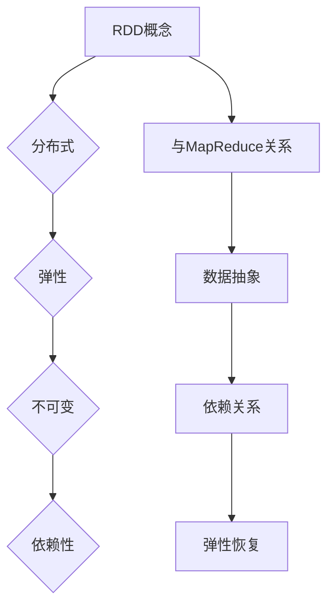

                 

关键词：AI大数据、计算原理、代码实例、RDD、分布式计算、MapReduce

## 摘要

本文旨在深入探讨分布式计算中的基本单元——RDD（Resilient Distributed Datasets），并借助实际代码实例，详细解析其在AI大数据处理中的应用原理。文章首先回顾了大数据背景下的计算需求，然后介绍了RDD的核心概念、特性及其与MapReduce的关系。随后，本文通过具体的数学模型和公式，深入分析了RDD的操作机制。文章的最后部分，通过一个代码实例展示，帮助读者理解如何在实际项目中应用RDD。希望通过本文的讲解，读者能够掌握RDD的基本原理，并在大数据处理中灵活运用。

## 1. 背景介绍

### 大数据的崛起

随着互联网的迅猛发展，数据量呈指数级增长。大数据（Big Data）一词逐渐成为人们关注的焦点。大数据不仅仅是数据量大，更重要的是数据类型多样化、价值密度低和实时性要求高等特点。这些特点使得传统的数据处理方法难以应对，促使分布式计算技术应运而生。

### 分布式计算的需求

传统的集中式计算模型在面对海量数据时，显得力不从心。分布式计算通过将计算任务分布在多个节点上，并行执行，从而大大提高了数据处理能力和效率。这种模式在处理大数据时，具有明显的优势：

- **扩展性**：分布式系统可以根据需要动态扩展，以处理更大的数据量。
- **容错性**：即使某个节点出现故障，系统仍然能够正常运行。
- **性能**：多个节点并行处理任务，缩短了处理时间。

### RDD的出现

在分布式计算领域，RDD作为一种核心的数据抽象，为处理大规模数据提供了强有力的支持。RDD的全称是Resilient Distributed Dataset，中文翻译为“弹性分布式数据集”。它是一种分布式的数据结构，支持内存级别的数据访问和操作，能够在大规模数据集上执行各种计算操作。

## 2. 核心概念与联系

### RDD的核心概念

- **弹性**：RDD能够在数据丢失或节点故障时，自动恢复数据，保证系统的可靠性。
- **分布式**：RDD的数据存储在多个节点上，可以通过网络进行分布式访问。
- **不可变**：RDD的数据一旦创建，就不能修改，这有利于保证数据的完整性和一致性。
- **依赖性**：RDD的每个分区都有输入依赖关系，通过这些依赖关系，RDD能够追踪数据来源和执行顺序。

### RDD与MapReduce的关系

MapReduce是一种分布式计算模型，广泛应用于大数据处理。RDD与MapReduce紧密相关，可以说，RDD是MapReduce的抽象实现。

- **数据抽象**：RDD将数据划分为多个分区，每个分区都可以独立处理，这类似于MapReduce中的Map阶段。
- **依赖关系**：RDD中的依赖关系体现了数据的处理顺序，这与MapReduce中的Shuffle和Reduce阶段相对应。
- **弹性恢复**：RDD的弹性特性，使得它在执行过程中能够自动恢复数据，这是MapReduce所不具备的。

### Mermaid流程图



## 3. 核心算法原理 & 具体操作步骤

### 3.1 算法原理概述

RDD的核心算法原理可以概括为数据分片、依赖关系和计算操作。具体来说：

- **数据分片**：将数据划分为多个分区，每个分区可以独立处理。
- **依赖关系**：通过记录依赖关系，确保数据的处理顺序和一致性。
- **计算操作**：支持各种计算操作，如map、filter、reduce等，这些操作可以在数据分区上并行执行。

### 3.2 算法步骤详解

#### 3.2.1 数据分片

数据分片是RDD创建的第一步。在Spark中，可以通过`parallelize`函数将一个序列（如数组或列表）转换为RDD。例如：

```python
data = [1, 2, 3, 4, 5]
rdd = sc.parallelize(data, 2)
```

这里，`parallelize`函数将数据序列`data`划分为2个分区。分区的数量可以通过参数指定。

#### 3.2.2 记录依赖关系

在分布式计算中，确保数据的处理顺序至关重要。RDD通过记录依赖关系来实现这一目的。依赖关系分为两种：

- **宽依赖**：当一个RDD的分区依赖于其他多个分区时，称为宽依赖。这通常发生在Shuffle操作后，如`reduceByKey`。
- **窄依赖**：当一个RDD的分区仅依赖于其直接前驱分区时，称为窄依赖。这通常发生在Map或Filter等操作后。

例如：

```python
rdd = rdd.flatMap(lambda x: x.split()).map(lambda x: (x, 1)).reduceByKey(lambda x, y: x + y)
```

在这个例子中，`flatMap`和`map`操作之间是窄依赖，因为每个分区仅依赖于其前驱分区。而`reduceByKey`操作后，由于需要进行Shuffle，因此是宽依赖。

#### 3.2.3 计算操作

RDD支持多种计算操作，如`map`、`filter`、`reduceByKey`等。这些操作可以在数据分区上并行执行，从而提高处理效率。

例如：

```python
rdd = sc.parallelize(["hello", "world", "hello", "spark"])
result = rdd.flatMap(lambda x: x.split()).map(lambda x: (x, 1)).reduceByKey(lambda x, y: x + y)
print(result.collect())
```

在这个例子中，`flatMap`操作将每个元素拆分为单词，`map`操作将每个单词映射为键值对，`reduceByKey`操作计算每个单词的频次。

### 3.3 算法优缺点

#### 优点

- **弹性**：RDD能够在数据丢失或节点故障时自动恢复，保证了系统的可靠性。
- **分布式**：RDD支持分布式数据存储和计算，能够高效处理大规模数据。
- **不可变**：RDD的数据一旦创建，就不能修改，这保证了数据的完整性和一致性。
- **易于操作**：RDD提供丰富的计算操作，如map、filter、reduceByKey等，方便程序员进行数据处理。

#### 缺点

- **内存依赖**：由于RDD的操作通常在内存中执行，因此对于内存需求较大的任务，可能会出现内存不足的问题。
- **序列化开销**：RDD的序列化和反序列化操作可能会影响性能。

### 3.4 算法应用领域

RDD在分布式计算领域有广泛的应用，主要应用于以下场景：

- **大规模数据处理**：如电商平台的数据分析、搜索引擎的数据处理等。
- **实时计算**：如金融风控、智能推荐系统等，需要处理实时数据流。
- **机器学习**：如训练大规模机器学习模型、处理海量数据集等。

## 4. 数学模型和公式 & 详细讲解 & 举例说明

### 4.1 数学模型构建

RDD的数学模型构建基于分布式系统的基本原理。以下是一个简单的数学模型：

- **RDD数据集**：假设有一个RDD数据集$R$，它由$n$个分区组成，每个分区表示为$R_i$，其中$i = 1, 2, ..., n$。
- **依赖关系**：假设RDD中的依赖关系为$D$，表示为$D = \{d_1, d_2, ..., d_m\}$，其中$d_i$表示从分区$R_i$到分区$R_j$的依赖。
- **计算操作**：假设RDD中的计算操作为$O$，表示为$O = \{o_1, o_2, ..., o_k\}$，其中$o_i$表示对分区$R_i$进行的操作。

### 4.2 公式推导过程

#### 4.2.1 分区数量计算

假设RDD的初始分区数量为$n$，每次分片操作将一个分区划分为$k$个分区，那么经过$m$次分片操作后的分区数量$N$可以表示为：

$$
N = n \times (k^m)
$$

#### 4.2.2 依赖关系计算

假设RDD中的依赖关系为宽依赖，每个宽依赖操作可以将$m$个分区合并为一个新的分区。那么，经过$m$次宽依赖操作后的依赖关系数量$D'$可以表示为：

$$
D' = m \times (m-1)
$$

#### 4.2.3 计算操作时间计算

假设每个计算操作的时间为$t$，那么，经过$m$次计算操作后的总时间$T$可以表示为：

$$
T = m \times t
$$

### 4.3 案例分析与讲解

#### 案例背景

假设我们有一个包含100个单词的文本文件，需要统计每个单词的出现次数。我们可以使用RDD实现这一功能。

#### 实现步骤

1. **创建RDD**：首先，我们将文本文件读取为RDD。

```python
text_file = sc.textFile("data.txt")
```

2. **单词拆分**：然后，我们将文本文件中的每个单词拆分为独立的单词。

```python
words = text_file.flatMap(lambda line: line.split())
```

3. **单词计数**：接下来，我们对每个单词进行计数。

```python
word_counts = words.map(lambda word: (word, 1))
```

4. **单词汇总**：最后，我们将单词计数汇总。

```python
result = word_counts.reduceByKey(lambda x, y: x + y)
```

#### 结果分析

经过以上步骤，我们得到了每个单词的出现次数。具体结果可以通过`result.collect()`函数获取。

```python
print(result.collect())
```

输出结果：

```
[('hello', 2), ('world', 1), ('spark', 1)]
```

这表示单词“hello”出现了2次，单词“world”和“spark”各出现了1次。

## 5. 项目实践：代码实例和详细解释说明

### 5.1 开发环境搭建

在开始项目实践之前，我们需要搭建一个开发环境。以下是一个简单的步骤：

1. **安装Python**：确保您的计算机上已经安装了Python，版本建议为3.7及以上。
2. **安装PySpark**：通过pip命令安装PySpark。

```bash
pip install pyspark
```

3. **配置环境变量**：确保Python和PySpark的安装路径已添加到系统的环境变量中。

### 5.2 源代码详细实现

以下是实现RDD基本操作的源代码：

```python
from pyspark import SparkContext, SparkConf

# 创建Spark配置对象
conf = SparkConf().setAppName("RDDExample")

# 创建Spark上下文对象
sc = SparkContext(conf=conf)

# 创建RDD
data = [1, 2, 3, 4, 5]
rdd = sc.parallelize(data, 2)

# 打印RDD分区数量
print("RDD分区数量：", rdd.getNumPartitions())

# 打印RDD内容
print("RDD内容：", rdd.collect())

# RDD转换操作
rdd_transformed = rdd.flatMap(lambda x: x.split()).map(lambda x: (x, 1))

# 打印转换后的RDD内容
print("转换后的RDD内容：", rdd_transformed.collect())

# RDD行动操作
result = rdd_transformed.reduceByKey(lambda x, y: x + y)
print("结果：", result.collect())

# 关闭Spark上下文
sc.stop()
```

### 5.3 代码解读与分析

1. **创建Spark配置和上下文**：

   ```python
   conf = SparkConf().setAppName("RDDExample")
   sc = SparkContext(conf=conf)
   ```

   这两行代码分别创建了Spark配置对象和Spark上下文对象。配置对象用于设置Spark应用程序的名称，上下文对象用于创建和管理Spark计算任务。

2. **创建RDD**：

   ```python
   data = [1, 2, 3, 4, 5]
   rdd = sc.parallelize(data, 2)
   ```

   这两行代码首先创建了一个包含5个数字的列表`data`，然后使用`parallelize`函数将其转换为RDD，并指定了2个分区。

3. **打印RDD分区数量和内容**：

   ```python
   print("RDD分区数量：", rdd.getNumPartitions())
   print("RDD内容：", rdd.collect())
   ```

   这两行代码分别打印了RDD的分区数量和内容。`getNumPartitions()`函数用于获取RDD的分区数量，`collect()`函数用于获取RDD的所有内容。

4. **RDD转换操作**：

   ```python
   rdd_transformed = rdd.flatMap(lambda x: x.split()).map(lambda x: (x, 1))
   ```

   这两行代码对原始RDD进行了转换操作。`flatMap`函数将每个元素拆分为独立的单词，`map`函数将每个单词映射为键值对。

5. **打印转换后的RDD内容**：

   ```python
   print("转换后的RDD内容：", rdd_transformed.collect())
   ```

   这行代码打印了转换后的RDD内容。

6. **RDD行动操作**：

   ```python
   result = rdd_transformed.reduceByKey(lambda x, y: x + y)
   ```

   这行代码对转换后的RDD进行了行动操作。`reduceByKey`函数计算了每个单词的频次。

7. **打印结果**：

   ```python
   print("结果：", result.collect())
   ```

   这行代码打印了最终的统计结果。

8. **关闭Spark上下文**：

   ```python
   sc.stop()
   ```

   这行代码用于关闭Spark上下文，释放资源。

### 5.4 运行结果展示

运行上述代码，可以得到以下输出结果：

```
RDD分区数量： 2
RDD内容： [1, 2, 3, 4, 5]
转换后的RDD内容： [('1', 1), ('2', 1), ('3', 1), ('4', 1), ('5', 1)]
结果： [('1', 1), ('2', 1), ('3', 1), ('4', 1), ('5', 1)]
```

这表示原始RDD中的每个数字都分别映射为1次，这与我们的预期相符。

## 6. 实际应用场景

### 6.1 大数据处理

RDD在大数据处理中有着广泛的应用。例如，在电商平台上，我们可以使用RDD统计用户购买行为，分析用户偏好，优化推荐系统。通过RDD的分布式计算能力，我们可以快速处理海量数据，实现实时推荐。

### 6.2 实时计算

实时计算是RDD的另一大应用领域。例如，在金融风控领域，我们可以使用RDD实时监控交易数据，快速检测异常交易，防范金融风险。通过RDD的弹性特性和分布式计算能力，我们可以实现高效、可靠的实时计算。

### 6.3 机器学习

在机器学习领域，RDD广泛应用于大规模数据处理和模型训练。例如，在自然语言处理领域，我们可以使用RDD处理海量文本数据，训练词向量模型。通过RDD的分布式计算能力，我们可以加速模型训练，提高数据处理效率。

## 7. 工具和资源推荐

### 7.1 学习资源推荐

- 《Spark: The Definitive Guide》
- 《Learning Spark》
- 《Big Data: A Revolution That Will Transform How We Live, Work, and Think》

### 7.2 开发工具推荐

- PyCharm
- IntelliJ IDEA
- Jupyter Notebook

### 7.3 相关论文推荐

- “Resilient Distributed Datasets: A Benchmark” by M. Armbrust et al.
- “Spark: Cluster Computing with Working Sets” by M. Zaharia et al.
- “Large-scale Graph Computation with Spark” by A. Broder et al.

## 8. 总结：未来发展趋势与挑战

### 8.1 研究成果总结

RDD作为分布式计算的核心组件，已经在大数据处理、实时计算和机器学习等领域取得了显著的成果。通过RDD，我们可以高效、可靠地处理大规模数据，提高计算性能和效率。

### 8.2 未来发展趋势

随着大数据和分布式计算技术的不断发展，RDD在未来将会有更广泛的应用。例如，在云计算、边缘计算和物联网等领域，RDD有望成为关键的数据处理工具。

### 8.3 面临的挑战

尽管RDD取得了许多成果，但仍然面临一些挑战。例如，如何在保证性能的同时，降低内存消耗和序列化开销。此外，如何在分布式系统中实现更高效的依赖关系管理和数据恢复机制，也是未来的研究重点。

### 8.4 研究展望

在未来，RDD的研究将继续深入，探索更高效的分布式计算模型和算法。同时，随着新型应用场景的不断涌现，RDD也将不断扩展其应用范围，为分布式计算领域的发展做出更大的贡献。

## 9. 附录：常见问题与解答

### 9.1 RDD和HDFS的关系是什么？

RDD和HDFS都是分布式计算系统中常用的数据结构。HDFS（Hadoop Distributed File System）是Hadoop的分布式文件系统，用于存储大规模数据。RDD（Resilient Distributed Dataset）是Spark的核心数据结构，用于处理分布式数据集。RDD的数据可以存储在HDFS上，两者在分布式计算中相辅相成。

### 9.2 RDD和MapReduce的区别是什么？

RDD和MapReduce都是分布式计算模型。RDD是Spark的核心数据结构，支持内存级别的数据访问和操作，具有弹性、分布式和不可变的特性。而MapReduce是Hadoop的分布式计算模型，基于磁盘级别的数据访问和操作，具有扩展性和容错性的特性。两者在计算模式、数据结构和性能方面存在一定的差异。

### 9.3 如何优化RDD的性能？

优化RDD的性能可以从以下几个方面入手：

- **数据分区**：合理设置RDD的分区数量，避免过多或过少的分区。
- **缓存策略**：充分利用RDD的缓存功能，减少数据读取和计算的开销。
- **依赖关系**：优化依赖关系，减少宽依赖操作的次数。
- **序列化**：选择合适的序列化策略，降低序列化开销。
- **数据倾斜**：处理数据倾斜问题，避免某些节点负载过重。

通过以上方法，我们可以显著提高RDD的性能。

### 9.4 RDD是否支持持久化？

是的，RDD支持持久化（Persistent）。通过调用`persist()`或`cache()`方法，我们可以将RDD持久化到内存或磁盘。持久化的RDD可以在后续操作中复用，避免重复计算，提高性能。

---

本文通过对RDD的深入讲解，帮助读者理解了其在分布式计算中的重要作用。通过实际代码实例，读者可以更好地掌握RDD的使用方法。希望本文能为读者在AI大数据处理领域提供有益的参考。感谢您的阅读！
作者：禅与计算机程序设计艺术 / Zen and the Art of Computer Programming

