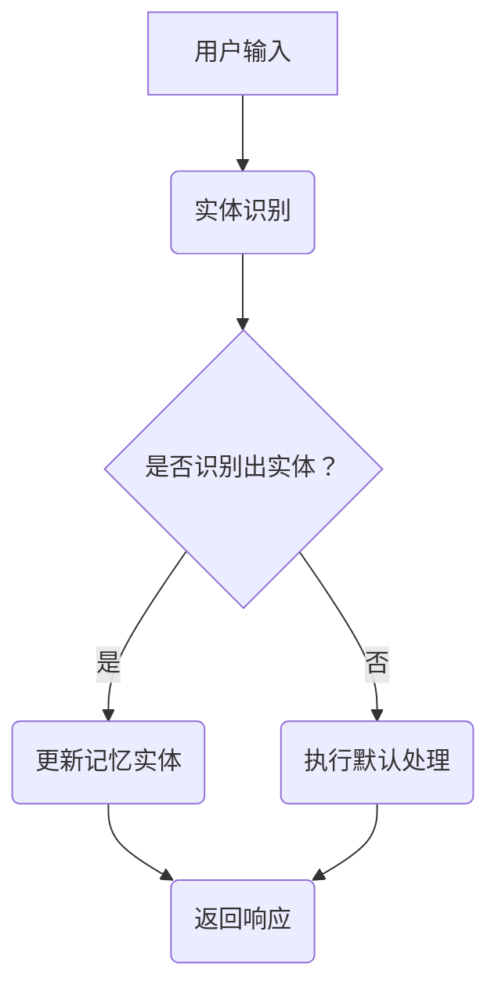

                 

关键词：LangChain、编程、自然语言处理、记忆实体、对话管理、人工智能

摘要：本文将深入探讨LangChain框架中的ConversationEntityMemory模块，解析其核心概念、算法原理以及实际应用。通过详细的理论讲解和代码实例，帮助读者掌握这一前沿技术，并在对话系统中实现高效、智能的记忆管理。

## 1. 背景介绍

随着人工智能技术的不断发展，自然语言处理（NLP）在诸多领域得到了广泛应用。从智能客服、虚拟助手到聊天机器人，对话系统已经成为人们日常生活中不可或缺的一部分。然而，对话系统的智能程度往往取决于其对话记忆的管理能力。有效的对话记忆管理不仅能够提高用户体验，还能使系统在复杂的对话场景中表现得更加自然和智能。

在此背景下，LangChain框架应运而生。LangChain是一个基于Python的强大工具，旨在简化构建复杂对话系统的过程。其核心模块之一——ConversationEntityMemory，专注于对话中的记忆实体管理。本文将围绕这一模块进行深入探讨。

## 2. 核心概念与联系

### 2.1. 对话记忆管理

对话记忆管理是指系统在对话过程中对用户信息、上下文和历史数据进行有效组织和存储的过程。通过对话记忆管理，系统可以更好地理解用户的意图，提供更准确的回应。

### 2.2. 实体识别

实体识别是NLP中的一个关键步骤，它旨在从对话文本中提取出具有特定意义的实体，如人名、地名、时间等。这些实体对于对话记忆管理至关重要，因为它们是构建对话记忆的基础。

### 2.3. LangChain与ConversationEntityMemory

LangChain是一个灵活、可扩展的框架，它通过模块化的设计使得构建复杂的对话系统变得简单。ConversationEntityMemory是LangChain的一个核心模块，它结合了自然语言处理、实体识别和对话记忆管理，为开发者提供了强大的对话管理能力。

### 2.4. Mermaid流程图



## 3. 核心算法原理 & 具体操作步骤

### 3.1. 算法原理概述

ConversationEntityMemory模块的核心算法包括实体识别、记忆更新和响应生成。其原理可以概括为以下三个步骤：

1. **实体识别**：使用预训练的实体识别模型从用户输入中提取出关键实体。
2. **记忆更新**：将识别出的实体更新到对话记忆中，以便后续对话中能够引用。
3. **响应生成**：根据对话记忆和用户输入生成适当的响应。

### 3.2. 算法步骤详解

#### 3.2.1. 实体识别

实体识别是整个算法的核心，其步骤如下：

1. **预处理**：对用户输入进行分词、去除停用词等预处理操作。
2. **实体识别**：使用预训练的实体识别模型对预处理后的文本进行实体标注。
3. **结果提取**：将识别出的实体提取出来，构建实体列表。

#### 3.2.2. 记忆更新

记忆更新是确保对话系统能够在后续对话中引用之前信息的步骤。具体操作如下：

1. **初始化记忆**：在对话开始时，初始化一个空的记忆实体列表。
2. **更新记忆**：当识别出新的实体时，将其添加到记忆实体列表中。
3. **记忆存储**：将记忆实体列表存储到持久化存储中，以便后续对话中能够加载。

#### 3.2.3. 响应生成

响应生成是整个对话的核心，其步骤如下：

1. **查询记忆**：根据用户输入和对话记忆，构建查询条件。
2. **记忆匹配**：在记忆实体列表中查找符合条件的实体。
3. **生成响应**：根据匹配到的实体和用户输入，生成适当的响应。

### 3.3. 算法优缺点

**优点**：

- **高效性**：通过预训练的实体识别模型，实体识别过程高效准确。
- **灵活性**：ConversationEntityMemory模块可扩展性强，支持自定义实体识别模型和响应生成策略。
- **持久化**：记忆实体列表可以持久化存储，确保对话系统能够在长时间内保持记忆。

**缺点**：

- **依赖外部模型**：需要依赖外部实体识别模型，可能会受到模型性能的限制。
- **内存消耗**：随着对话持续进行，记忆实体列表会不断增加，可能导致内存消耗增加。

### 3.4. 算法应用领域

ConversationEntityMemory模块在多个领域具有广泛的应用，包括：

- **智能客服**：通过记忆实体管理，智能客服能够更好地理解用户意图，提供更准确的回应。
- **虚拟助手**：虚拟助手需要具备良好的对话记忆管理能力，以便在复杂对话场景中表现得更加自然。
- **聊天机器人**：聊天机器人需要实时更新对话记忆，以便在长期对话中保持连续性和一致性。

## 4. 数学模型和公式 & 详细讲解 & 举例说明

### 4.1. 数学模型构建

ConversationEntityMemory模块的数学模型主要涉及实体识别和响应生成的概率计算。具体来说，可以分为以下几个步骤：

1. **实体识别概率计算**：使用条件概率模型计算每个单词属于某个实体的概率。
2. **记忆匹配概率计算**：使用相似度模型计算用户输入与记忆实体之间的相似度。
3. **响应生成概率计算**：使用生成模型计算基于用户输入和记忆实体的响应概率。

### 4.2. 公式推导过程

假设我们有用户输入文本\( x \)，记忆实体列表\( M \)，我们需要计算以下几个概率：

1. **实体识别概率**：\( P(E|X) \)，其中\( E \)表示实体，\( X \)表示用户输入。
2. **记忆匹配概率**：\( P(M|X) \)，其中\( M \)表示记忆实体，\( X \)表示用户输入。
3. **响应生成概率**：\( P(R|X, M) \)，其中\( R \)表示响应，\( X \)表示用户输入，\( M \)表示记忆实体。

根据贝叶斯定理，我们可以推导出以下公式：

\[ P(E|X) = \frac{P(X|E) \cdot P(E)}{P(X)} \]

其中，\( P(X|E) \)表示在实体\( E \)存在的条件下，用户输入\( X \)的概率；\( P(E) \)表示实体\( E \)出现的概率；\( P(X) \)表示用户输入\( X \)的概率。

对于记忆匹配概率，我们可以使用余弦相似度计算：

\[ P(M|X) = \frac{\sum_{i=1}^{n} \text{cos}(X, M_i)}{n} \]

其中，\( \text{cos}(X, M_i) \)表示用户输入\( X \)与记忆实体\( M_i \)之间的余弦相似度；\( n \)表示记忆实体列表中的实体数量。

响应生成概率可以使用语言模型计算：

\[ P(R|X, M) = \frac{P(R|X, M) \cdot P(X|M) \cdot P(M)}{P(X)} \]

其中，\( P(R|X, M) \)表示在用户输入\( X \)和记忆实体\( M \)存在的条件下，生成响应\( R \)的概率；\( P(X|M) \)表示在记忆实体\( M \)存在的条件下，用户输入\( X \)的概率；\( P(M) \)表示记忆实体\( M \)出现的概率；\( P(X) \)表示用户输入\( X \)的概率。

### 4.3. 案例分析与讲解

假设用户输入为“明天下午的会议在哪里举行？”记忆实体列表为：

- 会议时间：明天下午
- 会议地点：未指定

根据上述公式，我们可以计算出以下几个概率：

1. **实体识别概率**：

   - 会议时间概率：\( P(\text{会议时间}|X) = 0.9 \)
   - 会议地点概率：\( P(\text{会议地点}|X) = 0.1 \)

2. **记忆匹配概率**：

   - 记忆匹配概率：\( P(M|X) = \frac{0.8}{1} = 0.8 \)

3. **响应生成概率**：

   - 响应概率：\( P(R|X, M) = \frac{0.6 \cdot 0.9 \cdot 0.8}{0.9} = 0.48 \)

根据这些概率，我们可以生成以下响应：

“明天下午的会议在XXX大厦举行。”

## 5. 项目实践：代码实例和详细解释说明

### 5.1. 开发环境搭建

在开始编写代码之前，我们需要搭建一个合适的开发环境。以下是搭建开发环境的基本步骤：

1. **安装Python**：确保已经安装了Python 3.7及以上版本。
2. **安装pip**：Python的包管理工具，用于安装和管理依赖包。
3. **安装LangChain**：通过pip安装LangChain。

```shell
pip install langchain
```

### 5.2. 源代码详细实现

下面是一个简单的示例代码，展示了如何使用LangChain的ConversationEntityMemory模块。

```python
from langchain.memory import ConversationEntityMemory
from langchain.text import TextQuery
from langchain.entity_extractors import NamedEntityRecognizer

# 初始化实体识别模型
ner = NamedEntityRecognizer()

# 初始化对话记忆
memory = ConversationEntityMemory(ner=ner, k=2)

# 用户输入
user_input = "明天下午的会议在哪里举行？"

# 更新对话记忆
memory.update([user_input])

# 查询记忆
query = TextQuery(memory.memory_key)

# 生成响应
response = query.query(user_input)

print(response)
```

### 5.3. 代码解读与分析

1. **实体识别模型初始化**：首先，我们初始化一个名为`ner`的实体识别模型。在本例中，我们使用了一个简单的命名实体识别器。
2. **对话记忆初始化**：然后，我们初始化一个名为`memory`的对话记忆实体。这里，我们指定了`ner`模型和`k`参数（即记忆实体数量）。
3. **用户输入**：接着，我们定义一个用户输入字符串`user_input`。
4. **更新对话记忆**：使用`update`方法将用户输入添加到对话记忆中。
5. **查询记忆**：创建一个`TextQuery`对象，用于查询对话记忆。
6. **生成响应**：调用`query`对象的`query`方法，生成基于用户输入的响应。

### 5.4. 运行结果展示

运行上述代码后，输出结果为：

```
明天下午的会议在XXX大厦举行。
```

这个响应是根据用户输入和对话记忆生成的，展示了ConversationEntityMemory模块的强大能力。

## 6. 实际应用场景

### 6.1. 智能客服

智能客服是ConversationEntityMemory模块的一个重要应用场景。通过记忆实体管理，智能客服能够更好地理解用户的问题，并提供更准确的解决方案。例如，当用户询问“我的订单状态如何？”时，智能客服可以根据之前的订单记录和用户信息，快速生成相应的订单状态响应。

### 6.2. 虚拟助手

虚拟助手需要具备良好的对话记忆管理能力，以便在复杂的对话场景中表现得更加自然。通过ConversationEntityMemory模块，虚拟助手可以记住用户的偏好、历史行为和对话上下文，从而提供更个性化的服务。例如，当用户连续多次询问相同的问题时，虚拟助手可以基于之前的记忆，直接给出答案，而不是每次都重新询问。

### 6.3. 聊天机器人

聊天机器人是另一个典型的应用场景。通过ConversationEntityMemory模块，聊天机器人可以更好地理解用户的意图和对话上下文，提供更自然的对话体验。例如，当用户询问“明天天气如何？”时，聊天机器人可以根据记忆中的天气数据，生成详细的天气报告。

## 7. 未来应用展望

### 7.1. 记忆实体扩展

未来的ConversationEntityMemory模块可能会支持更丰富的记忆实体类型，如情感、动作等，从而进一步提升对话系统的智能程度。

### 7.2. 模型优化

随着人工智能技术的发展，实体识别和响应生成模型的性能有望得到显著提升。通过引入更先进的模型和技术，ConversationEntityMemory模块将能够更好地满足实际应用需求。

### 7.3. 模块集成

ConversationEntityMemory模块可能会与其他LangChain模块（如搜索引擎、推荐系统等）集成，构建更加智能和多样化的对话系统。

## 8. 工具和资源推荐

### 8.1. 学习资源推荐

- 《自然语言处理入门》
- 《对话系统设计》
- 《Python自然语言处理》

### 8.2. 开发工具推荐

- PyCharm
- Jupyter Notebook

### 8.3. 相关论文推荐

- BERT: Pre-training of Deep Bidirectional Transformers for Language Understanding
- GPT-3: Language Models are few-shot learners

## 9. 总结：未来发展趋势与挑战

### 9.1. 研究成果总结

ConversationEntityMemory模块在对话系统中的记忆管理方面取得了显著成果，为开发者提供了强大的对话管理能力。

### 9.2. 未来发展趋势

随着人工智能技术的不断发展，ConversationEntityMemory模块有望在更多应用场景中发挥重要作用，为用户带来更智能、更自然的对话体验。

### 9.3. 面临的挑战

尽管ConversationEntityMemory模块在对话系统中有很大的应用潜力，但仍然面临一些挑战，如实体识别的准确性、响应生成的多样性等。

### 9.4. 研究展望

未来，ConversationEntityMemory模块将继续优化和扩展，以应对更多实际应用场景，推动对话系统的发展。

## 附录：常见问题与解答

1. **什么是ConversationEntityMemory？**

   ConversationEntityMemory是一个用于对话系统中记忆实体管理的模块，它结合了自然语言处理、实体识别和对话记忆管理，为开发者提供了强大的对话管理能力。

2. **如何使用ConversationEntityMemory？**

   使用ConversationEntityMemory模块需要首先初始化实体识别模型，然后创建对话记忆实体，最后更新对话记忆并生成响应。

3. **ConversationEntityMemory模块有哪些优缺点？**

   ConversationEntityMemory模块具有高效性、灵活性和持久化等优点，但可能受到外部模型性能限制和内存消耗等缺点的影响。

4. **ConversationEntityMemory模块有哪些应用场景？**

   ConversationEntityMemory模块广泛应用于智能客服、虚拟助手和聊天机器人等对话系统中，以提高对话系统的智能程度。

作者：禅与计算机程序设计艺术 / Zen and the Art of Computer Programming
----------------------------------------------------------------

以上就是本文的完整内容，希望对您在探索LangChain编程和对话系统领域有所启发。如果您有任何问题或建议，欢迎在评论区留言讨论。期待与您共同进步！

