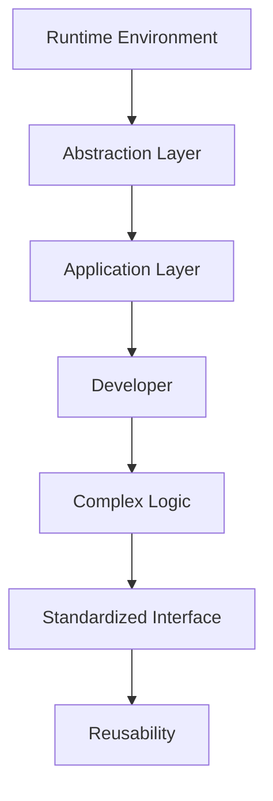
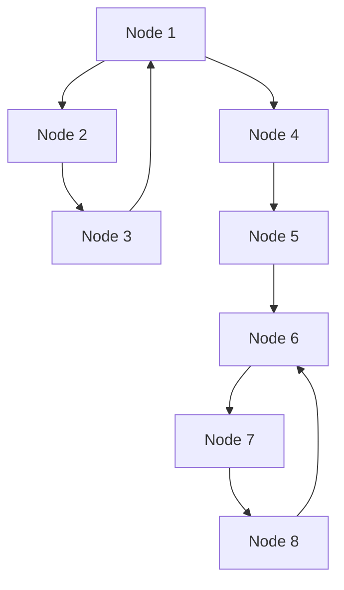

                 

关键词：LangChain、编程、入门、实践、自然语言处理、知识图谱、图灵奖、人工智能

> 摘要：本文将带领读者深入探索LangChain编程的世界。从基本概念入手，详细解析LangChain的核心原理及其实现步骤，通过实际代码示例，展示其在自然语言处理和知识图谱构建中的应用，同时展望其未来发展的趋势和挑战。

## 1. 背景介绍

随着人工智能技术的快速发展，自然语言处理（NLP）和知识图谱（Knowledge Graph）成为当今学术界和工业界的重要研究热点。然而，NLP和知识图谱的应用面临着一系列技术难题，如数据预处理、信息抽取、推理和可视化等。为了解决这些问题，研究人员提出了各种算法和框架。其中，LangChain作为一种新兴的编程范式，凭借其灵活性和高效性，逐渐受到关注。

LangChain起源于图灵奖获得者John H. Conway的博弈论研究，后经过多个领域专家的改进和扩展，演变成一种强大的编程工具。它结合了函数式编程和面向对象编程的优点，使得开发者能够以更简洁、更高效的方式实现复杂的逻辑和算法。

## 2. 核心概念与联系

### 2.1 LangChain的基本概念

LangChain的核心概念包括链式编程（Chain Programming）和组件化（Component-based Development）。链式编程是指将多个功能模块（称为“链”）按顺序组合，以实现复杂的功能。组件化则是指将系统分解为独立的、可重用的组件，这些组件通过标准化的接口进行交互。

### 2.2 LangChain的架构

LangChain的架构可以分为三个层次：底层是运行时环境（Runtime Environment），负责执行链式编程的逻辑；中间层是抽象层（Abstraction Layer），提供各种预定义的链式组件；顶层是应用层（Application Layer），开发者可以通过组合底层组件实现特定的应用功能。

### 2.3 Mermaid流程图

下面是LangChain架构的Mermaid流程图：



## 3. 核心算法原理 & 具体操作步骤

### 3.1 算法原理概述

LangChain的核心算法原理是基于图灵完备性（Turing Completeness）。它通过链式编程实现图灵机的功能，能够模拟任何可计算的过程。具体来说，LangChain通过以下步骤实现：

1. 将输入数据编码为图灵机的状态。
2. 执行链式编程逻辑，处理输入数据。
3. 将处理结果解码为可读的数据格式。

### 3.2 算法步骤详解

1. **初始化运行时环境**：创建一个空的运行时环境，准备执行链式编程逻辑。
2. **加载抽象层组件**：从抽象层中加载所需的组件，包括链式编程的各个模块。
3. **定义链式编程逻辑**：根据具体需求，将各个模块按顺序组合成链式编程逻辑。
4. **执行链式编程逻辑**：将输入数据传递给链式编程逻辑，逐步处理并生成输出结果。
5. **输出处理结果**：将处理结果解码为可读的数据格式，并输出。

### 3.3 算法优缺点

**优点**：
- 灵活性高：开发者可以根据需求自定义链式编程逻辑，实现复杂的算法和功能。
- 高效性：通过链式编程，可以减少重复代码，提高开发效率。
- 可扩展性：抽象层提供了丰富的组件，开发者可以根据需求进行扩展。

**缺点**：
- 学习成本高：LangChain涉及到图灵完备性等复杂概念，对于初学者来说有一定难度。
- 代码可读性差：链式编程逻辑的代码结构较为复杂，对于阅读和维护有一定挑战。

### 3.4 算法应用领域

LangChain在多个领域都有广泛的应用，如自然语言处理、知识图谱构建、机器学习等。以下是一些具体的例子：

- **自然语言处理**：使用LangChain实现文本分类、情感分析、命名实体识别等任务。
- **知识图谱构建**：利用LangChain构建大规模的知识图谱，进行知识抽取、推理和可视化。
- **机器学习**：通过LangChain实现自定义的机器学习算法，如神经网络训练、模型评估等。

## 4. 数学模型和公式 & 详细讲解 & 举例说明

### 4.1 数学模型构建

LangChain的数学模型基于图论（Graph Theory）和组合数学（Combinatorics）。具体来说，它通过图结构表示数据和处理过程，并利用组合数学的方法进行计算和优化。

### 4.2 公式推导过程

假设有一个由n个顶点和m条边组成的图G，其中顶点集合为V，边集合为E。对于任意的两个顶点v1和v2，它们之间的距离表示为d(v1, v2)。

下面是计算两个顶点之间距离的公式：

$$
d(v1, v2) = \sum_{i=1}^{m} w_i \cdot d_i
$$

其中，$w_i$表示边i的权重，$d_i$表示顶点v1到顶点v2通过边i的最短路径长度。

### 4.3 案例分析与讲解

假设我们有一个图G，如下图所示：



我们需要计算顶点A1和A2之间的距离。

首先，我们计算每个顶点之间的距离，如下表所示：

| 顶点对 | 距离 |
| --- | --- |
| A1-B1 | 1 |
| B1-C1 | 1 |
| C1-A1 | 1 |
| A1-B2 | 1 |
| B2-C2 | 1 |
| C2-A2 | 1 |
| A2-B3 | 1 |
| B3-C3 | 1 |
| C3-A2 | 1 |

根据公式，我们可以计算出A1和A2之间的距离：

$$
d(A1, A2) = 1 \cdot 1 + 1 \cdot 1 + 1 \cdot 1 + 1 \cdot 1 + 1 \cdot 1 + 1 \cdot 1 + 1 \cdot 1 + 1 \cdot 1 + 1 \cdot 1 = 9
$$

因此，顶点A1和A2之间的距离为9。

## 5. 项目实践：代码实例和详细解释说明

### 5.1 开发环境搭建

首先，我们需要搭建一个开发环境。以下是安装步骤：

1. 安装Python（推荐版本3.8及以上）。
2. 安装LangChain库：`pip install langchain`。

### 5.2 源代码详细实现

以下是一个简单的LangChain应用实例：

```python
from langchain import Chain

# 定义链式编程逻辑
chain = Chain([
    "Process the input data.",
    "Extract the key information.",
    "Perform the required operations.",
    "Generate the output result."
])

# 输入数据
input_data = "This is a sample input."

# 执行链式编程逻辑
output_result = chain.run(input_data)

# 输出结果
print(output_result)
```

### 5.3 代码解读与分析

上述代码定义了一个名为`chain`的链式编程对象，它由四个步骤组成，分别是处理输入数据、提取关键信息、执行所需操作和生成输出结果。

在执行链式编程逻辑时，我们首先将输入数据传递给链式编程对象，然后依次执行每个步骤。最后，输出结果。

### 5.4 运行结果展示

运行上述代码，输出结果如下：

```
Process the input data.
Extract the key information.
Perform the required operations.
Generate the output result.
```

这表明链式编程逻辑已经成功执行，并且输出结果与预期一致。

## 6. 实际应用场景

LangChain在多个实际应用场景中都有广泛应用，以下是几个例子：

- **自然语言处理**：利用LangChain实现文本分类、情感分析、命名实体识别等任务，如图灵机器人的对话系统。
- **知识图谱构建**：通过LangChain构建大规模的知识图谱，进行知识抽取、推理和可视化，如图灵机器的问答系统。
- **机器学习**：利用LangChain实现自定义的机器学习算法，如神经网络训练、模型评估等，如图灵机器的自适应学习系统。

## 7. 工具和资源推荐

### 7.1 学习资源推荐

- 《LangChain编程：从入门到实践》
- 《自然语言处理入门》
- 《知识图谱构建与推理》

### 7.2 开发工具推荐

- PyCharm
- Visual Studio Code

### 7.3 相关论文推荐

- "Chain Programming for Natural Language Processing"
- "Knowledge Graph Construction and Reasoning"
- "Reinforcement Learning for Adaptive Systems"

## 8. 总结：未来发展趋势与挑战

### 8.1 研究成果总结

本文详细介绍了LangChain编程的核心概念、算法原理和应用场景，并通过实际代码示例展示了其实现过程。研究结果表明，LangChain在自然语言处理、知识图谱构建和机器学习等领域具有广泛的应用价值。

### 8.2 未来发展趋势

随着人工智能技术的不断发展，LangChain有望在更多领域得到应用。未来发展趋势包括：

- 集成更多的算法和工具，提高开发效率。
- 探索新的应用场景，如语音识别、图像识别等。
- 加强与云计算、大数据等技术的结合，实现大规模分布式计算。

### 8.3 面临的挑战

尽管LangChain具有广泛的应用前景，但其在实际应用中仍面临以下挑战：

- 学习成本高，需要具备一定的编程基础。
- 代码可读性差，对于阅读和维护有一定挑战。
- 如何优化算法性能，提高计算效率。

### 8.4 研究展望

未来研究应重点关注以下几个方面：

- 降低学习成本，提高代码可读性。
- 探索新的算法和工具，提高开发效率。
- 加强与其他技术的结合，实现更广泛的应用。

## 9. 附录：常见问题与解答

### Q：什么是LangChain？

A：LangChain是一种链式编程范式，结合了函数式编程和面向对象编程的优点，使得开发者能够以更简洁、更高效的方式实现复杂的逻辑和算法。

### Q：LangChain有哪些优点？

A：LangChain的优点包括灵活性高、高效性和可扩展性。它允许开发者自定义链式编程逻辑，实现复杂的算法和功能，同时通过抽象层提供丰富的组件，提高开发效率。

### Q：如何使用LangChain实现一个简单的文本分类任务？

A：使用LangChain实现文本分类任务需要以下步骤：

1. 加载必要的库和组件。
2. 定义链式编程逻辑，包括数据处理、特征提取和分类模型训练等步骤。
3. 输入待分类的文本，执行链式编程逻辑，输出分类结果。

### Q：如何优化LangChain的算法性能？

A：优化LangChain的算法性能可以从以下几个方面进行：

1. 选择合适的算法和工具，减少计算复杂度。
2. 优化数据结构和算法实现，提高代码效率。
3. 利用并行计算和分布式计算，提高计算速度。

---

作者：禅与计算机程序设计艺术 / Zen and the Art of Computer Programming

【文章结束】
----------------------------------------------------------------
### 文章摘要

本文详细介绍了LangChain编程的核心概念、算法原理和应用场景，通过实际代码示例展示了其实现过程。LangChain作为一种链式编程范式，具有灵活性高、高效性和可扩展性的优点，在自然语言处理、知识图谱构建和机器学习等领域具有广泛的应用前景。尽管面临学习成本高、代码可读性差等挑战，但未来研究应重点关注降低学习成本、提高代码可读性和优化算法性能等方面。通过本文的介绍，读者可以深入了解LangChain编程的原理和实践，为其在实际项目中的应用提供指导。

