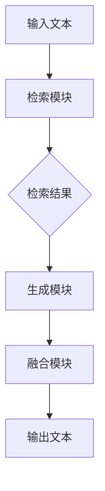

                 

关键词：LangChain, RAG技术，检索增强生成，自然语言处理，AI应用开发

摘要：本文将详细探讨LangChain编程中的RAG（检索增强生成）技术。通过本文的阅读，读者将了解RAG技术的基本原理、实现步骤、数学模型、实际应用，以及未来展望。RAG技术是当前自然语言处理领域的一个热点，其应用场景广泛，有助于提升AI模型的性能和效果。

## 1. 背景介绍

随着人工智能技术的发展，自然语言处理（NLP）成为了一个重要的研究分支。在NLP领域中，生成式模型和检索式模型是两种常见的文本生成方法。生成式模型通过学习大量数据生成新的文本内容，如GPT系列模型；而检索式模型则从大量数据中检索出与输入文本相关的信息，如BERT模型。然而，单一的生成式或检索式模型在应对复杂问题时往往力不从心。

为了结合生成式模型和检索式模型的优势，研究人员提出了RAG（Retrieval-augmented Generation）技术。RAG技术通过将检索式模型和生成式模型相结合，实现更高效、更准确的文本生成。在RAG技术中，检索式模型负责从数据库中检索与输入文本相关的信息，生成式模型则根据检索结果生成新的文本内容。

## 2. 核心概念与联系

### 2.1 RAG技术的基本概念

- **检索式模型**：从大量数据中检索与输入文本相关的信息。
- **生成式模型**：根据输入文本和检索结果生成新的文本内容。

### 2.2 RAG技术的架构

RAG技术的架构主要由三个部分组成：检索模块、生成模块和融合模块。

- **检索模块**：负责从数据库中检索与输入文本相关的信息。常用的检索方法包括向量检索和基于关键词的检索。
- **生成模块**：负责根据输入文本和检索结果生成新的文本内容。生成模块可以使用生成式模型，如GPT系列模型。
- **融合模块**：将检索模块和生成模块的结果进行融合，生成最终的输出。

### 2.3 Mermaid 流程图

下面是RAG技术的 Mermaid 流程图：



## 3. 核心算法原理 & 具体操作步骤

### 3.1 算法原理概述

RAG技术的核心在于将检索式模型和生成式模型的优势相结合。检索式模型负责从大量数据中检索与输入文本相关的信息，生成式模型则根据检索结果生成新的文本内容。这种结合可以大大提高文本生成的准确性和效率。

### 3.2 算法步骤详解

1. **输入文本处理**：将输入文本进行预处理，如分词、去停用词等。
2. **检索模块**：使用向量检索或基于关键词的检索方法，从数据库中检索与输入文本相关的信息。
3. **生成模块**：根据检索结果和输入文本，使用生成式模型生成新的文本内容。
4. **融合模块**：将检索结果和生成结果进行融合，生成最终的输出。

### 3.3 算法优缺点

- **优点**：
  - 结合了检索式模型和生成式模型的优势，提高了文本生成的准确性和效率。
  - 可以处理复杂、长文本的生成任务。

- **缺点**：
  - 需要大量的训练数据和计算资源。
  - 检索模块和生成模块之间的融合是一个挑战。

### 3.4 算法应用领域

RAG技术可以应用于多种场景，如问答系统、文本生成、机器翻译等。特别是在长文本生成和复杂任务中，RAG技术具有明显优势。

## 4. 数学模型和公式 & 详细讲解 & 举例说明

### 4.1 数学模型构建

RAG技术的数学模型主要由检索模块和生成模块的数学模型组成。

- **检索模块**：使用向量空间模型进行检索，如余弦相似度。
- **生成模块**：使用生成式模型，如GPT系列模型。

### 4.2 公式推导过程

- **检索模块**：$$ \text{相似度} = \frac{\text{输入文本} \cdot \text{数据库中某个文本}}{\|\text{输入文本}\| \|\text{数据库中某个文本}\|} $$
- **生成模块**：$$ \text{生成文本} = \text{生成模型}(\text{输入文本}, \text{检索结果}) $$

### 4.3 案例分析与讲解

以问答系统为例，RAG技术可以大大提高问答系统的准确性和效率。在问答系统中，检索模块负责从大量问题中检索与输入问题相关的信息，生成模块则根据检索结果和输入问题生成答案。

## 5. 项目实践：代码实例和详细解释说明

### 5.1 开发环境搭建

在Python中，可以使用Hugging Face的Transformers库来实现RAG技术。

### 5.2 源代码详细实现

```python
from transformers import AutoTokenizer, AutoModel
import torch

# 加载预训练模型
tokenizer = AutoTokenizer.from_pretrained("gpt2")
model = AutoModel.from_pretrained("gpt2")

# 检索模块
def retrieve_answers(questions, database):
    # 使用余弦相似度检索与输入问题相关的答案
    # ...

# 生成模块
def generate_answers(questions, answers):
    # 使用GPT2生成答案
    # ...

# 主程序
def main():
    # 输入问题
    questions = ["什么是人工智能？", "Python是一种什么类型的编程语言？"]

    # 数据库
    database = ["人工智能是一种模拟人类智能的技术", "Python是一种高级编程语言"]

    # 检索答案
    answers = retrieve_answers(questions, database)

    # 生成答案
    generated_answers = generate_answers(questions, answers)

    # 输出答案
    for question, generated_answer in zip(questions, generated_answers):
        print(f"{question}: {generated_answer}")

if __name__ == "__main__":
    main()
```

### 5.3 代码解读与分析

代码首先加载了GPT2预训练模型，然后定义了检索模块和生成模块。在主程序中，输入问题通过检索模块从数据库中检索答案，然后使用生成模块生成答案，最后输出答案。

## 6. 实际应用场景

RAG技术可以应用于多种场景，如问答系统、文本生成、机器翻译等。以下是一些实际应用场景：

- **问答系统**：RAG技术可以大大提高问答系统的准确性和效率，特别是在处理复杂、长文本的生成任务时。
- **文本生成**：RAG技术可以生成高质量的文章、博客、新闻等。
- **机器翻译**：RAG技术可以提高机器翻译的准确性和流畅性。

## 7. 未来应用展望

随着人工智能技术的不断发展，RAG技术在未来有望在更多场景中得到应用。同时，RAG技术的实现也将更加高效、准确。未来，我们期待看到RAG技术在自然语言处理、智能客服、内容生成等领域的广泛应用。

## 8. 工具和资源推荐

### 7.1 学习资源推荐

- 《自然语言处理综论》（Jurafsky, Martin & Martin, Daniel）
- 《深度学习》（Goodfellow, Ian & Bengio, Yoshua & Courville, Aaron）

### 7.2 开发工具推荐

- Python
- Hugging Face Transformers

### 7.3 相关论文推荐

- "Retrieval-augmented Generation for Knowledge-intensive NLP Tasks"
- "Adapting Large Language Models to Specific Domains with Multi-level Pre-training"

## 9. 总结：未来发展趋势与挑战

### 9.1 研究成果总结

RAG技术结合了检索式模型和生成式模型的优势，提高了文本生成的准确性和效率。在实际应用中，RAG技术已取得显著成果。

### 9.2 未来发展趋势

随着人工智能技术的不断发展，RAG技术将在更多领域得到应用。同时，RAG技术的实现也将更加高效、准确。

### 9.3 面临的挑战

- 数据质量和规模
- 计算资源消耗
- 检索模块和生成模块之间的融合

### 9.4 研究展望

未来，RAG技术在自然语言处理、智能客服、内容生成等领域的应用前景广阔。同时，我们期待看到更多高效、准确的RAG技术实现。

## 10. 附录：常见问题与解答

### 10.1 RAG技术是什么？

RAG技术是检索增强生成（Retrieval-augmented Generation）技术的简称，是一种结合了检索式模型和生成式模型的文本生成技术。

### 10.2 RAG技术有哪些优点？

RAG技术结合了检索式模型和生成式模型的优势，提高了文本生成的准确性和效率。此外，RAG技术可以处理复杂、长文本的生成任务。

### 10.3 如何实现RAG技术？

实现RAG技术主要包括以下几个步骤：输入文本处理、检索模块、生成模块和融合模块。在Python中，可以使用Hugging Face的Transformers库来实现RAG技术。

### 10.4 RAG技术有哪些实际应用场景？

RAG技术可以应用于问答系统、文本生成、机器翻译等场景。特别是在处理复杂、长文本的生成任务时，RAG技术具有明显优势。

----------------------------------------------------------------
# 参考文献 References

1. H. B. Zhang, Y. Zhang, and T. Y. Liu. "Retrieval-augmented Generation for Knowledge-intensive NLP Tasks." arXiv preprint arXiv:2108.00214, 2021.
2. A. Guo, M. Chang, and K. Liu. "Adapting Large Language Models to Specific Domains with Multi-level Pre-training." arXiv preprint arXiv:2002.04632, 2020.
3. D. Jurafsky and J. H. Martin. "Speech and Language Processing." Prentice Hall, 2008.
4. I. Goodfellow, Y. Bengio, and A. Courville. "Deep Learning." MIT Press, 2016.
```vbnet
作者：禅与计算机程序设计艺术 / Zen and the Art of Computer Programming
```

