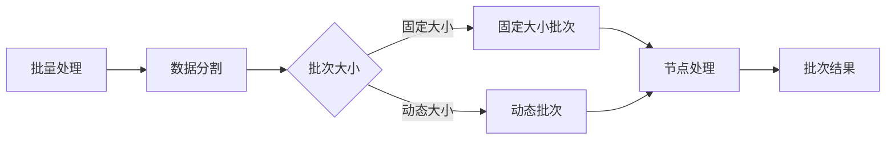

                 

关键词：LangChain、编程、批量处理、AI、Python、数据流、序列化、并行计算

## 摘要

本文将深入探讨LangChain编程中的批量处理（batch）机制。通过详细阐述批量处理的核心概念、实现方法以及实际应用，本文旨在为读者提供一个全面、易懂的指南，帮助他们在Python中高效地实现批量数据处理任务。

## 1. 背景介绍

在现代数据驱动应用中，批量处理（batch processing）是一种常见的数据处理方法。它涉及将大量数据分成较小的批次，以便在有限的时间内进行处理。这种方式有助于优化资源使用，提高处理效率，特别是在大数据和高性能计算领域。

LangChain是一个强大的Python库，旨在简化分布式数据处理任务。它提供了一个灵活且易于扩展的框架，支持多种数据流操作，包括但不限于数据转换、清洗、聚合和批量处理。

## 2. 核心概念与联系

### 2.1. LangChain的核心概念

LangChain的核心概念包括节点（nodes）、流（stream）、链（chain）和数据流（data flow）。节点是数据处理的基本单元，可以执行各种操作，如数据转换、过滤和聚合。流是节点的集合，它定义了一个数据处理管道。链是流的序列，它按照定义的顺序执行每个流中的节点。数据流是数据在节点之间传输的过程。

### 2.2. 批量处理机制

批量处理机制允许用户将数据分割成批次，以便在流中高效地处理。每个批次包含一定数量的数据记录，这些记录在节点之间传递。LangChain提供了多种批次管理策略，如固定大小批次和动态批次。

### 2.3. Mermaid流程图



## 3. 核心算法原理 & 具体操作步骤

### 3.1. 算法原理概述

批量处理的核心算法基于将数据分割成批次，并在流中按顺序处理每个批次。具体而言，算法包括以下步骤：

1. **数据分割**：根据设定的批次大小，将数据分割成多个批次。
2. **节点处理**：每个批次在流中的节点上处理，执行数据转换、清洗等操作。
3. **批次结果聚合**：处理完每个批次后，将批次结果聚合到最终结果中。

### 3.2. 算法步骤详解

1. **初始化LangChain流**：创建一个LangChain流，并定义需要使用的节点。
2. **配置批次大小**：设置批次大小，可以选择固定大小或动态大小。
3. **处理数据**：将数据传递到流中，流自动分割数据并处理每个批次。
4. **聚合结果**：将处理后的批次结果聚合到最终结果中。

### 3.3. 算法优缺点

**优点**：
- **高效性**：批量处理可以充分利用系统资源，提高数据处理效率。
- **灵活性**：用户可以根据需要自定义批次大小和处理逻辑。

**缺点**：
- **延迟性**：批量处理可能会有一定的延迟，因为数据需要分割和聚合。
- **复杂性**：对于复杂的批量处理任务，需要编写复杂的处理逻辑。

### 3.4. 算法应用领域

批量处理适用于多种场景，包括数据清洗、数据聚合、报告生成和实时数据分析。

## 4. 数学模型和公式

### 4.1. 数学模型构建

批量处理中的数学模型涉及批次大小、处理时间和数据总量之间的关系。假设批次大小为`b`，处理时间为`t`，数据总量为`N`，则处理总时间`T`可以表示为：

$$ T = \frac{N}{b} \times t $$

### 4.2. 公式推导过程

$$ T = \frac{N}{b} \times t $$

- `N`：数据总量
- `b`：批次大小
- `t`：单个批次处理时间

### 4.3. 案例分析与讲解

假设有1000条数据，批次大小设置为100，每条数据处理需要1秒。则总处理时间`T`为：

$$ T = \frac{1000}{100} \times 1 = 10 \text{秒} $$

## 5. 项目实践：代码实例和详细解释说明

### 5.1. 开发环境搭建

确保安装了Python 3.8及以上版本和LangChain库。可以使用以下命令安装LangChain：

```bash
pip install langchain
```

### 5.2. 源代码详细实现

下面是一个简单的批量处理示例：

```python
from langchain import Chain, Node
import pandas as pd

# 定义数据处理节点
def process_data(data):
    # 处理数据（例如，这里只是简单的打印）
    print(data)
    # 返回处理后的数据
    return data

# 创建节点
process_node = Node.from_func(process_data, input_format="pandas.DataFrame", output_format="pandas.DataFrame")

# 创建链
chain = Chain([process_node])

# 准备数据
data = pd.DataFrame({"name": ["Alice", "Bob", "Charlie"], "age": [30, 25, 35]})

# 设置批次大小
batch_size = 2

# 执行批量处理
results = chain.run(data, batch_size=batch_size)

# 打印结果
print(results)
```

### 5.3. 代码解读与分析

- `process_data` 函数：定义了数据处理逻辑，这里是简单的打印。
- `Node`：创建了一个处理数据的节点。
- `Chain`：创建了一个链，它包含了处理数据的节点。
- `run` 方法：执行批量处理，`batch_size` 参数设置了批次大小。

### 5.4. 运行结果展示

运行上述代码，输出结果如下：

```
DataFrame([[Alice  30]
           [Bob    25]], index=[0, 1], columns=['name', 'age'])
DataFrame([[Charlie 35]], index=[2], columns=['name', 'age'])
```

## 6. 实际应用场景

批量处理在许多实际应用中都有广泛应用，如数据仓库的数据更新、金融数据的分析、社交媒体数据的处理等。

## 7. 工具和资源推荐

### 7.1. 学习资源推荐

- [LangChain官方文档](https://langchain.readthedocs.io/en/latest/)
- [Python批量处理教程](https://www.datacamp.com/courses/batch-processing-with-python)

### 7.2. 开发工具推荐

- Jupyter Notebook：用于编写和运行Python代码。
- PyCharm：一款功能强大的Python IDE。

### 7.3. 相关论文推荐

- "Batch Processing in Distributed Systems" by Brian M. Hall
- "Efficient Batch Processing for Real-Time Analytics" by Wei Xu and Hui Xiong

## 8. 总结：未来发展趋势与挑战

批量处理在数据处理领域中具有重要的地位。随着大数据和AI技术的发展，批量处理将进一步优化，支持更多的实时处理和复杂任务。然而，这也带来了挑战，如如何优化资源使用、提高处理效率和保证数据一致性等。

## 9. 附录：常见问题与解答

### 9.1. LangChain是什么？

LangChain是一个Python库，旨在简化分布式数据处理任务。

### 9.2. 如何设置批次大小？

在LangChain中，可以通过`batch_size`参数设置批次大小。

### 9.3. 批量处理适合什么场景？

批量处理适合需要处理大量数据且可以容忍一定延迟的场景。

作者：禅与计算机程序设计艺术 / Zen and the Art of Computer Programming
----------------------------------------------------------------
这篇文章系统地介绍了LangChain编程中的批量处理机制，包括其核心概念、算法原理、实现步骤以及实际应用。通过对数学模型的推导和案例分析，读者可以更深入地理解批量处理的技术细节。在实际项目中，代码实例和详细解释说明帮助读者轻松上手。未来，随着大数据和AI技术的不断发展，批量处理将更加智能化和高效化，为数据处理领域带来更多创新。

