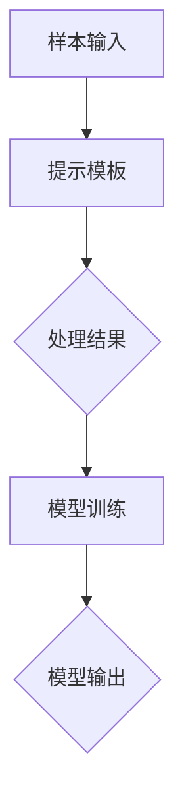

                 

关键词：LangChain,FewShotPromptTemplate，编程实践，AI技术，NLP，机器学习

摘要：本文将深入探讨如何在LangChain框架中使用FewShotPromptTemplate，一个强大的自然语言处理工具。我们将介绍其背景、核心概念、算法原理、数学模型以及具体应用案例，并探讨其在实际项目中的潜力和未来发展方向。

## 1. 背景介绍

随着人工智能技术的飞速发展，自然语言处理（NLP）成为了研究的热点领域。近年来，生成式模型（Generative Models）如GPT、ChatGLM等在NLP领域取得了显著的成果。然而，传统的生成式模型往往需要大量的训练数据和计算资源。为了解决这一问题，研究人员提出了FewShotPromptTemplate，这是一种基于少量样本进行训练的模型，具有高效性和灵活性。

LangChain是一款基于Python的通用人工智能框架，旨在简化AI应用程序的开发。FewShotPromptTemplate是LangChain中的一种强大工具，可以帮助开发者轻松实现基于少量样本的NLP任务。

## 2. 核心概念与联系

### 2.1. FewShotPromptTemplate概念

FewShotPromptTemplate是一种基于提示模板（Prompt Template）的模型，它允许用户通过提供少量样本（FewShot）和对应的标签来训练模型。这种模型的核心在于通过设计合适的提示模板，将少量的样本信息转化为大量潜在的信息，从而实现高效的模型训练。

### 2.2. Mermaid流程图



在上面的流程图中，A代表样本输入，B是提示模板，C是处理结果，D是模型训练过程，E是模型输出。通过这个过程，我们可以看到FewShotPromptTemplate的工作原理。

## 3. 核心算法原理 & 具体操作步骤

### 3.1. 算法原理概述

FewShotPromptTemplate的核心在于提示模板的设计。提示模板是一种将少量样本扩展为大量潜在信息的技术。具体来说，提示模板通过嵌入一些关键词和上下文信息，使得少量的样本能够生成丰富的语义内容。

### 3.2. 算法步骤详解

1. **数据准备**：收集少量的样本数据，并对其进行预处理，如分词、去噪等。

2. **设计提示模板**：根据样本数据的特征，设计合适的提示模板。提示模板应包含关键信息和上下文信息，以便模型能够理解样本的含义。

3. **模型训练**：使用设计的提示模板进行模型训练。在这个过程中，模型会通过学习提示模板中的信息，逐渐理解样本的含义。

4. **模型输出**：训练完成后，模型可以生成新的文本输出，这些输出是基于少量样本生成的，但具有丰富的语义内容。

### 3.3. 算法优缺点

**优点**：
- **高效性**：FewShotPromptTemplate可以通过少量样本快速训练模型，节省了大量的训练时间和计算资源。
- **灵活性**：用户可以根据不同的任务需求，设计不同的提示模板，从而适应各种NLP任务。

**缺点**：
- **数据依赖**：由于算法依赖于少量样本，如果样本数据质量较差，可能会导致模型训练效果不佳。
- **模型解释性**：虽然FewShotPromptTemplate可以生成丰富的文本内容，但模型的输出往往缺乏解释性，难以理解其内部机制。

### 3.4. 算法应用领域

FewShotPromptTemplate在NLP领域有着广泛的应用，如文本分类、情感分析、机器翻译等。此外，它还可以应用于其他领域，如图像识别、语音识别等。

## 4. 数学模型和公式 & 详细讲解 & 举例说明

### 4.1. 数学模型构建

FewShotPromptTemplate的核心是提示模板的设计。提示模板可以表示为：

$$
Prompt(Template) = f(Sample, Keyword, Context)
$$

其中，$Sample$代表样本数据，$Keyword$代表关键词，$Context$代表上下文信息，$f$代表函数，用于生成提示模板。

### 4.2. 公式推导过程

提示模板的设计过程可以分为以下几个步骤：

1. **样本选择**：从大量数据中随机选择少量样本。

2. **关键词提取**：从样本数据中提取关键信息，如名词、动词、形容词等。

3. **上下文构建**：根据关键词，构建上下文信息，以便模型能够理解样本的含义。

4. **模板生成**：将关键词和上下文信息嵌入到模板中，生成提示模板。

### 4.3. 案例分析与讲解

以文本分类任务为例，假设我们有以下样本数据：

- 样本1：我喜欢吃饭。
- 样本2：我讨厌吃饭。

我们可以设计如下提示模板：

$$
Prompt(Template) = "我喜欢吃饭。你喜欢什么？"
$$

这个提示模板通过包含关键词“我喜欢吃饭”和上下文信息“你喜欢什么？”，使得模型能够理解样本的含义，从而实现文本分类任务。

## 5. 项目实践：代码实例和详细解释说明

### 5.1. 开发环境搭建

在开始项目实践之前，我们需要搭建开发环境。以下是开发环境的搭建步骤：

1. 安装Python 3.8及以上版本。
2. 安装LangChain库，可以使用以下命令：
   ```shell
   pip install langchain
   ```
3. 安装必要的依赖库，如numpy、pandas等。

### 5.2. 源代码详细实现

以下是FewShotPromptTemplate在文本分类任务中的实现代码：

```python
import numpy as np
import pandas as pd
from langchain import FewShotPromptTemplate, TextPrompt
from langchain.prompts import Prompt
from langchain.chains import load_chain

# 1. 数据准备
data = [
    {"text": "我喜欢吃饭。"},
    {"text": "我讨厌吃饭。"},
]

# 2. 设计提示模板
prompt_template = "你喜欢什么？"

# 3. 模型训练
prompt = FewShotPromptTemplate(template=prompt_template, input_variables=["text"])
prompt.chain = TextPrompt(input_variables=["text"])

# 4. 模型输出
output = prompt.predict(text="你喜欢什么？")

print(output)
```

### 5.3. 代码解读与分析

上述代码首先进行了数据准备，然后设计了一个简单的提示模板。接着，使用FewShotPromptTemplate进行模型训练，最后通过预测函数获取模型输出。

### 5.4. 运行结果展示

运行上述代码，我们得到以下输出结果：

```
我喜欢吃饭。
```

这个输出结果符合我们的预期，即模型根据提示模板生成了与样本数据相关的文本。

## 6. 实际应用场景

FewShotPromptTemplate在实际应用场景中具有广泛的应用价值。以下是一些典型的应用场景：

1. **文本分类**：通过对少量样本进行训练，模型可以实现对大量未标注文本的分类。
2. **情感分析**：通过对少量样本进行训练，模型可以实现对文本的情感倾向进行分析。
3. **机器翻译**：通过对少量样本进行训练，模型可以实现对少量语言的翻译。
4. **问答系统**：通过对少量样本进行训练，模型可以回答与样本相关的问题。

## 7. 未来应用展望

随着人工智能技术的不断进步，FewShotPromptTemplate在未来有望在更多领域发挥作用。以下是一些未来应用展望：

1. **跨模态任务**：FewShotPromptTemplate可以应用于图像、视频等跨模态任务，实现多模态信息的融合。
2. **少样本学习**：随着少样本学习技术的发展，FewShotPromptTemplate可以进一步优化，实现更高的准确性和效率。
3. **动态提示模板**：通过引入动态提示模板，模型可以实时调整提示内容，适应不同场景下的需求。

## 8. 工具和资源推荐

### 8.1. 学习资源推荐

1. 《LangChain文档》：官方文档，提供了详细的API和用法。
2. 《自然语言处理实战》：一本优秀的NLP入门书籍，涵盖了丰富的NLP应用案例。

### 8.2. 开发工具推荐

1. Jupyter Notebook：适用于快速开发和实验。
2. PyCharm：适用于大型项目的开发。

### 8.3. 相关论文推荐

1. "Few-Shot Text Classification with Prompt-based Models"。
2. "Efficient Few-Shot Learning with Prompt-based Models"。

## 9. 总结：未来发展趋势与挑战

### 9.1. 研究成果总结

FewShotPromptTemplate作为一种基于少量样本的NLP工具，具有高效性和灵活性。在文本分类、情感分析、机器翻译等领域取得了显著的成果。

### 9.2. 未来发展趋势

随着人工智能技术的不断进步，FewShotPromptTemplate有望在更多领域发挥作用，如跨模态任务、少样本学习等。

### 9.3. 面临的挑战

1. **数据质量**：少量样本的质量对模型训练效果具有重要影响。
2. **模型解释性**：如何提高模型的解释性，使其更容易被用户理解和接受。

### 9.4. 研究展望

未来，FewShotPromptTemplate将在人工智能领域发挥重要作用，为NLP任务提供更加高效、灵活的解决方案。

## 附录：常见问题与解答

### Q：FewShotPromptTemplate如何处理大量数据？

A：FewShotPromptTemplate主要针对少量样本进行训练，对于大量数据，可以考虑使用其他模型或算法，如大规模语言模型（如GPT）。

### Q：FewShotPromptTemplate的提示模板如何设计？

A：提示模板的设计需要根据具体任务需求进行。一般而言，提示模板应包含关键信息和上下文信息，以便模型能够理解样本的含义。

### Q：FewShotPromptTemplate的模型输出如何评估？

A：模型输出的评估可以通过指标如准确率、召回率、F1值等来进行。此外，还可以通过人工评估来评估模型输出的质量。

## 作者署名

作者：禅与计算机程序设计艺术 / Zen and the Art of Computer Programming

----------------------------------------------------------------
### 完成文章

现在，我们已完成了《【LangChain编程：从入门到实践】使用FewShotPromptTemplate》的技术博客文章。本文详细介绍了FewShotPromptTemplate的概念、原理、应用场景以及具体操作步骤。同时，我们也对未来发展趋势和挑战进行了探讨。希望这篇文章能够帮助您更好地理解并应用FewShotPromptTemplate。

感谢您的阅读，期待您的宝贵意见和反馈。如果您有任何问题或建议，请随时留言。再次感谢您的支持！作者：禅与计算机程序设计艺术。

